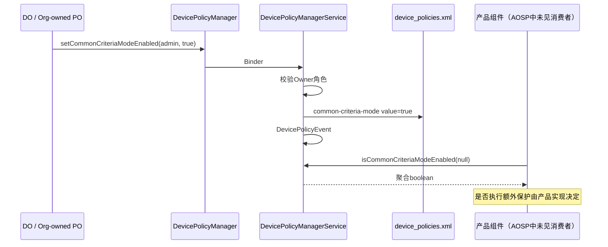
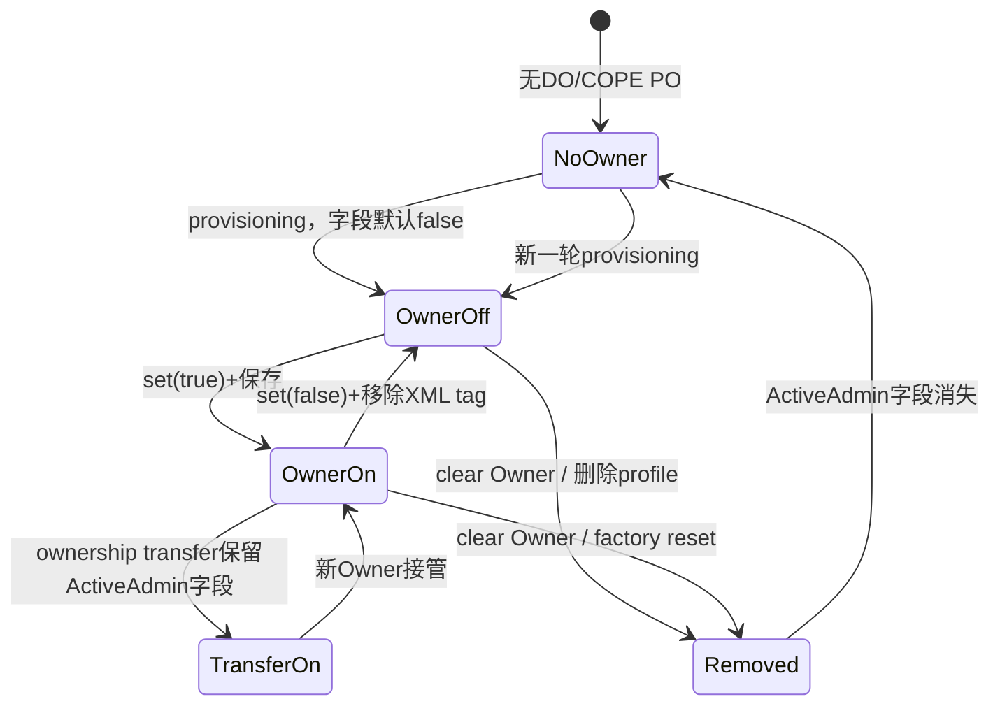
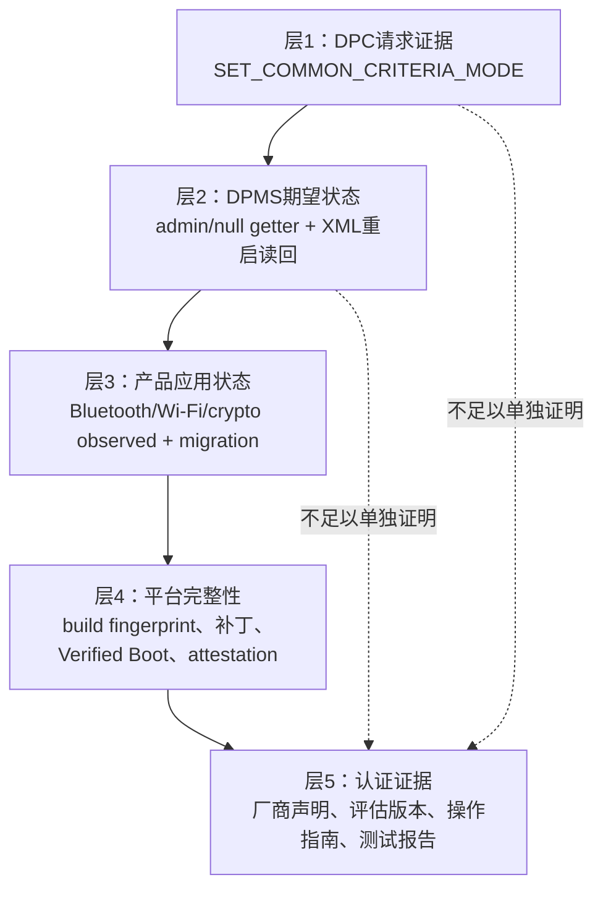

# 第 325 章 Android 企业 Common Criteria Mode：持久化、聚合查询、产品执行与合规证据边界链

> 源码基线：Android 11 / API 30 / `android-11.0.0_r48`。本章只读分析本地源码，不把开关状态等同于设备通过认证。

## 1. 这个API看起来做了什么

`DevicePolicyManager.setCommonCriteriaModeEnabled()` 允许Device Owner或组织所有设备上的Profile Owner打开Common Criteria模式。文档称设备功能会为更高安全等级调整，例如Bluetooth长期密钥材料、Wi-Fi配置存储额外使用AES-GCM完整性保护。

## 2. 源码实际先告诉我们什么

Android 11 r48 的DPMS setter只修改 `ActiveAdmin.mCommonCriteriaMode`、保存XML并写DevicePolicyEvent。全树搜索没有找到Bluetooth、Wi-Fi或加密模块读取这个状态的AOSP消费者；Framework这里主要提供管理声明和查询接口。

## 3. 本章核心：信号不等于能力

boolean=true只能证明Owner请求并由DPMS记录Common Criteria模式。它不能单独证明所有产品组件已切换、密钥重封装完成、设备满足某保护轮廓，更不能证明实验室认证仍对当前build有效。

## 4. 主要源码范围

API文档在 `frameworks/base/core/java/android/app/admin/DevicePolicyManager.java`；字段、XML和set/get在 `frameworks/base/services/devicepolicy/java/com/android/server/devicepolicy/DevicePolicyManagerService.java`；行为测试在其 `DevicePolicyManagerTest.java`。

## 5. Common Criteria是什么层次

它是信息技术安全评估标准体系，认证通常针对具体产品版本、配置和保护轮廓。Android API使用这一名称表达产品安全模式，但认证结论仍来自设备厂商和评估文档，不由Java boolean自行生成。

## 6. 谁可以设置

服务请求内部角色 `USES_POLICY_ORGANIZATION_OWNED_PROFILE_OWNER`，其匹配规则是Device Owner或organization-owned managed profile的Profile Owner。普通PO、传统Device Admin和普通应用不能写。

## 7. 为什么是设备级语义

文档说toggle mode for the device；即使setter由managed profile里的组织所有PO调用，聚合getter也能从user 0侧找到该PO字段。它不是只调整工作资料内某个应用的选项。

## 8. parent实例不可调用

客户端先 `throwIfParentInstance("setCommonCriteriaModeEnabled")`；getter亦同。组织所有PO用自己的DPM实例设置设备级声明，而不是切到parent facade。

## 9. 默认值

ActiveAdmin boolean字段没有显式初始化，Java默认false；writer只在true时输出tag。因此新Owner、无tag或清理后的模式均为false。

## 10. 整体状态链

## 11. 客户端服务为空

若 `mService==null`，setter静默不做事，getter返回false。公共API没有返回值或错误callback，正常返回不能证明system_server已持久化。

## 12. 服务端没有显式feature门

与许多DPM方法不同，这两个服务端实现没有先检查 `mHasFeature`。实际可写仍依赖ActiveAdmin Owner角色；没有device-admin能力的产品通常无法满足该角色，但源码结构值得区分。

## 13. admin非空只靠契约

客户端参数标 `@NonNull`，但setter服务端没有 `Objects.requireNonNull(who)`。null进入通用helper后会按calling UID遍历并选择符合角色的admin；实现可容忍不等于公开契约支持，调用者不应依赖该隐式选择。

## 14. who=null是getter的正式语义

getter明确把null定义为聚合设备级查询，且文档写Any caller can obtain。它不是setter的对称参数：读取null合法，写入null没有公开承诺。

## 15. setter如何找到ActiveAdmin

在caller userId对应DPMS锁内，`getActiveAdminForCallerLocked(who, USES_POLICY_ORGANIZATION_OWNED_PROFILE_OWNER)` 同时核对component、calling UID和Owner角色，返回真正承载字段的ActiveAdmin。

## 16. setter没有状态去重

源码直接赋 `admin.mCommonCriteriaMode=enabled` 并save。即使旧值相同也重写policy文件并写SET_COMMON_CRITERIA_MODE事件，没有early return。

## 17. 同值重复设置的含义

它可以作为管理端重申期望状态，但不会重新触发一个产品执行回调，因为AOSP没有广播或listener。事件数量也不等于状态实际发生了多次切换。

## 18. setter没有清Binder身份

核心工作仅是DPMS内存/受保护policy文件写入和事件日志，不跨调用需要外部系统权限的服务。因此方法在角色校验后无需像wipeData那样包住大段clean identity。

## 19. DevicePolicyEvent记录

`SET_COMMON_CRITERIA_MODE=131`，记录admin和boolean。它是策略调用审计，不包含持久化成功位、产品组件ACK或认证证书编号。

## 20. 返回void的证据上限

DPC能在调用后用admin getter读回当前内存状态，但API没有“应用完成”回调。即使读回true，也只闭环DPMS控制面。

## 21. 字段存在哪里

`mCommonCriteriaMode`位于对应Owner的ActiveAdmin。DO通常位于system user的device_policies.xml；组织所有PO位于managed profile自己的policy文件。

## 22. true的XML形式

writer调用 `writeAttributeValueToXml(out, "common-criteria-mode", true)`，形成带value属性的tag。它与Always-on VPN、profile timeout等字段一起属于admin子树。

## 23. false的XML形式

writer只有if(true)才输出；设false后重写文件，tag消失。读取缺省字段保持false，避免为默认关闭状态增加XML噪音。

## 24. reader如何解析

遇到tag时用 `Boolean.parseBoolean(value)`。只有忽略大小写的“true”得到true；缺失、false或其他字符串都是false，不抛格式异常。

## 25. I/O失败的共同边界

`saveSettingsLocked()` 捕获IOException/XML异常并rollback，不向setter抛；内存字段已改变，外层仍写DevicePolicyEvent。当前getter可能true，重启后却从旧XML恢复false。

## 26. 为什么读回仍不是持久证明

admin getter读ActiveAdmin内存，和刚set使用同一对象。要验证跨重启持久化，需要下一次启动重新读取；API没有fsync成功状态暴露给DPC。

## 27. own-state getter

who非null时重新做DO/组织所有PO角色检查，再返回该admin字段。普通admin不能借getter探测或伪装成Owner。

## 28. aggregated getter

who为null时完全不做caller权限检查，在DPMS锁内用 `getDeviceOwnerOrProfileOwnerOfOrganizationOwnedDeviceLocked(USER_SYSTEM)` 找唯一有效Owner，返回其字段或false。

## 29. 为什么任何调用者都能聚合读取

这是API文档明示设计，状态只有一个低敏感boolean，便于系统/产品组件适配。它不会暴露admin component、组织名或策略历史。

## 30. 聚合不是遍历OR

注释说只有DO或COPE PO能开启，因此直接取DO；没有DO再找user 0 profiles里的organization-owned PO。它不遍历所有ActiveAdmins做任意OR。

## 31. DO优先

helper先 `getDeviceOwnerAdminLocked()`，仅为null才找COPE PO。合法管理模型不应同时冲突存在；代码仍定义了优先顺序。

## 32. COPE PO如何被发现

从USER_SYSTEM的profiles遍历managed profile，要求存在Profile Owner且标记organization-owned，最后返回该profile的ActiveAdmin。聚合状态因此从子user提升为设备查询。

## 33. 没有Owner时

helper返回null，aggregated getter返回false。false既可能表示有Owner明确关闭，也可能表示没有Owner或policy加载失败；公开boolean无法区分。

## 34. getter没有product状态

它不询问Bluetooth、WifiConfigStore、KeyStore或crypto provider，只返回ActiveAdmin字段。命名“is mode enabled”在Framework层指政策位，不是所有子系统健康检查。

## 35. 全树搜索为什么重要

搜索 `isCommonCriteriaModeEnabled`、`mCommonCriteriaMode`、XML tag只找到DPM定义、DPMS和测试，没有功能消费者。结论应是“AOSP证据只覆盖状态面”，不是“设备一定什么都不做”。

## 36. 产品代码可能在树外

厂商Bluetooth/Wi-Fi实现、认证配置、系统扩展或GMS外部组件可调用null getter并调整行为。它们不在本地AOSP树，所以需要产品BOM、vendor源码和认证文档补证。

## 37. 文档示例不是本地调用链

Bluetooth LTK与Wi-Fi store AES-GCM例子描述期望功能，不提供类名/接口绑定。不能据此在AOSP图中画一条DPMS直接调用BluetoothService或WifiConfigStore的箭头。

## 38. 没有专用变更广播

setter不发送Common Criteria专用action。saveSettingsLocked会发通用、registered-only的DEVICE_POLICY_MANAGER_STATE_CHANGED到Owner user，但不携带字段；产品组件仍须收到通用信号后主动query，或在启动/配置变化点同步。

## 39. 没有reboot要求

API文档和setter都未强制重启。具体保护若只能对新生成/重新写入的存储生效，产品需要定义迁移或重启流程，Framework boolean不自动安排。

## 40. 没有用户确认UI

Owner可直接切换，不弹系统确认。企业管理应用应在后台做权限审批和影响说明，尤其模式可能影响性能、兼容性或旧密钥存储。

## 41. 通用state-changed广播的边界

它只发送给动态注册receiver，并定位到保存policy的user。DO通常是user 0；COPE PO保存在managed profile，所以仅监听user 0的产品组件未必收到该次通用变化。

## 42. 广播不是应用ACK

通用Intent无Common Criteria字段、版本或执行结果，DPMS也不等待receiver。即使产品以它为触发器，setter返回仍早于子系统完成。

## 43. 产品组件应启动时主动查询

仅依赖一次广播会漏掉进程未运行、user未启动、ownership transfer或I/O恢复等情形。null getter公开且低成本，适合在系统组件启动/用户解锁时重建期望状态。

## 44. 轮询不是理想唯一方案

任何caller可读并不意味着普通应用应高频轮询。产品应结合通用DPM状态信号、boot/user生命周期和自身持久化状态，只在需要时查询。

## 45. 并发设置由锁串行化

两个Owner进程线程不应同时存在，但同一DPC可并发set。DPMS锁使赋值/save依次执行，最后进入者决定内存/磁盘最终值；每次仍各写一个event。

## 46. 无compare-and-set

API没有旧值或revision参数。DPC后台若有多个策略来源，应先在自身控制面合并，再发送单一最终boolean，避免旧任务晚到覆盖新合规要求。

## 47. 所有权转移保留字段

`transferActiveAdminUncheckedLocked()` 保留原ActiveAdmin对象，只替换DeviceAdminInfo和map key，所以mCommonCriteriaMode随DO/PO ownership transfer到新admin。

## 48. transfer不会发送专用CC信号

会发送owner-changed与transfer-complete，但没有Common Criteria专用action。新DPC应在完成回调中用自己的admin getter读取并接管状态，产品组件也应响应Owner变化。

## 49. 转移回滚也保留

若转移journal表明中途失败，DPMS用同一transfer机制换回原admin；政策字段仍在对象上。它保证管理状态归属一致，但不回滚外部产品组件可能已开始的模式迁移。

## 50. 所有权生命周期图

## 51. clear Device Owner的结果

清DO会清user policies并移除ActiveAdmin；Common Criteria字段随之消失，aggregated getter没有Owner后返回false。没有代码把true复制到一个独立全局文件永久保留。

## 52. 删除组织所有profile的结果

profile wipe/remove会删除承载PO的user和device_policies.xml；聚合helper再找不到COPE PO，返回false。已由产品组件写出的外部状态是否回退，不在该字段删除路径中可见。

## 53. Factory reset的结果

/data wipe移除Owner、ActiveAdmin XML与DPC。新启动没有管理者，Framework聚合状态为false；若某硬件/外部存储仍按旧模式，产品初始化必须依据无Owner状态重新收敛。

## 54. set(false)与clear Owner不同

set(false)保留Owner身份并明确记录一次关闭事件；clear Owner移除整组管理策略。两者聚合getter都false，但审计语义与其他策略副作用不同。

## 55. false不是“不支持”

API没有support查询。false可能是默认、明确关闭、无Owner、policy加载失败或service为空；不能用它判断设备是否拥有经认证的Common Criteria产品实现。

## 56. true也不是“认证通过”

认证针对特定硬件、OS build、补丁、配置与操作指南。true只是一项运行时配置输入；越过认证版本、root/bootloader状态异常或必需策略缺失都可能让合规结论无效。

## 57. 文档中的AES-GCM只是例子

即便代码库某处使用AES-GCM，也要验证密钥来源、nonce唯一性、AAD、失败处理、迁移和硬件边界。算法名字匹配不是“额外完整性保护已按认证要求完成”的证据。

## 58. Bluetooth验证需要什么

应在具体产品源码/设计文档定位LTK存储格式、mode查询点、旧记录迁移、tag验证失败行为和测试；本地AOSP对mCommonCriteriaMode的引用没有给出这些链路。

## 59. Wi-Fi验证需要什么

应定位WifiConfigStore序列化、加密/认证key管理、mode开关读取、存量config重写和恢复失败路径。DPM文档示例不能替代这些实现证据。

## 60. 不能把它当FIPS开关

setter没有选择provider、加载FIPS module、执行算法self-test或禁用非批准算法的代码。产品可能另有实现，但Framework boolean自身不提供FIPS运行态证明。

## 61. 与Security Logging没有自动绑定

Common Criteria setter不启用上一章的persist.logd.security，也不检索SecurityEvent。若认证配置要求安全日志，DPC必须单独设置并验证；两个policy互不调用。

## 62. 与密码复杂度也没有自动绑定

它不会自动提高PIN长度、复杂度、最大失败次数或lock timeout。Common Criteria部署指南若规定这些值，企业仍要通过对应DPM API独立配置。

## 63. 与Verified Boot没有自动检查

getter不读取boot state、verity mode或补丁级别。安全日志可能记录OS startup状态，但CC mode boolean不会因verified boot异常自动变false。

## 64. 与硬件Keymaster没有自动证明

API不执行key attestation，也不查询StrongBox/Keymaster版本。需要硬件信任证据时，应使用已验证的attestation链并结合认证范围。

## 65. 与VPN/网络边界没有自动绑定

开启模式不配置Always-on VPN、Private DNS、proxy或Wi-Fi lockdown。企业基线应把这些显式策略作为独立项，而不是期待Common Criteria总开关隐式代办。

## 66. 这更像期望状态注册

Owner把“设备应在CC模式”写入管理状态；产品组件可查询并实现。DPMS不做orchestration或health aggregation，因此架构上是control-plane flag而非执行引擎。

## 67. 为什么公开聚合getter很关键

产品组件不属于DPC，也不持admin component；允许null查询使它们能读取设备期望值而无需获得强大Device Admin权限。

## 68. 为什么只返回boolean又不够

不同子系统可能逐步迁移、失败或需要reboot。一个boolean无法表达APPLYING、PARTIAL、FAILED、NEEDS_REBOOT；产品若要可靠合规，需要另建状态/遥测面。

## 69. 推荐的产品状态机

至少区分desired、observed per subsystem、migration version、last success/error和required reboot。DPM getter提供desired；observed不能反写成同一个boolean冒充完成。

## 70. DPC如何展示

界面应写“已请求/策略已记录”，只有获得厂商产品状态与认证版本校验后才显示“已应用”。避免用户把绿色开关误读为认证结论。

## 71. 管理后台应记录什么

记录tenant、device、admin、desired boolean、请求时间、读回值、build fingerprint、patch level、产品能力版本和外部应用结果；不要只记“API无异常”。

## 72. 开启前的兼容性检查

确认设备型号/build在认证清单、厂商声明支持动态开关、存量Bluetooth/Wi-Fi数据可迁移、必要reboot窗口和回退方案。Framework没有替你做这些前置检查。

## 73. 开启后的验证

admin getter读回true；null getter从独立系统调用路径读回true；检查产品组件observed状态、日志和自检；必要时重启再验证持久化与密钥存储行为。

## 74. 关闭后的验证

读回false并检查XML tag在重启后不再加载；同时确认产品组件是否恢复普通存储格式、是否保留向前兼容加密数据，以及回退是否属于认证允许操作。

## 75. save失败的排障

查DPMS “failed writing file” warning和journal；不要因getter立即返回新内存值就结束。重启后值回退是最明显症状，但等到重启才发现可能已造成产品状态不一致。

## 76. 产品执行失败的排障

若DPM true但Wi-Fi/Bluetooth未应用，应转到vendor组件、状态查询、迁移日志与版本兼容性；重复set(true)只重写同一字段，AOSP没有专用重试调用链。

## 77. 动态切换的一致性窗口

通用广播异步投递；多个产品子系统可在不同时间应用。窗口内aggregated getter已true，observed仍部分false，这是架构允许的暂态，不能靠DPMS锁消除。

## 78. 回退的一致性窗口

set(false)同样先改变期望，产品可能仍保留增强格式直到迁移完成。若立即把设备判定“普通模式”，可能忽略组件还在旧状态或无法降级。

## 79. 安全失败应偏向哪边

具体产品需定义fail-closed/fail-safe：增强存储验证失败是拒绝加载、清配置还是回退旧格式。DPMS没有规定，认证设计和可用性要求必须给出明确答案。

## 80. 审计不能只查stats事件

SET_COMMON_CRITERIA_MODE证明DPC调用，不证明save、广播消费或子系统执行；它应和XML重启读回、产品状态、测试结果、build认证材料共同构成证据链。

## 81. null setter的事件副作用

helper找到Owner后字段会正常更新，但外层 `DevicePolicyEventLogger.setAdmin(who)` 接收null并记录空admin package。业务功能可能成功，审计归因却变弱，这也是遵守NonNull契约的重要原因。

## 82. 多个同UID admin的歧义

who=null时helper遍历该user的admin list，返回首个同UID且符合角色者。Owner角色通常唯一，但组件转移/异常配置下显式ComponentName更可审计、更稳定。

## 83. 客户端注解不是安全门

Java @NonNull主要供静态检查和文档；真正安全来自server按calling UID和Owner角色筛选。恶意Binder caller能传null，却不能因此变成Owner。

## 84. 测试覆盖了什么

`testSetCommonCriteriaMode_asDeviceOwner` 验证初始own/null均false，DO set true后两者true；COPE测试验证同一行为。它证明角色与聚合读取主干。

## 85. 测试没有覆盖什么

未覆盖XML重启、save失败、null setter、transfer、Owner清除、generic broadcast或任何Bluetooth/Wi-Fi执行。不能用两个绿色单元测试外推端到端合规。

## 86. Mock测试也没有真实加密存储

DevicePolicyManagerTest运行DPMS测试替身，不启动产品Bluetooth stack或实际WifiConfigStore，更不会做认证算法测试。它验证API逻辑，不验证文档示例能力。

## 87. 源码引用计数本身是证据

当字段只在声明、write/read、dump、set/get出现时，可以有力说明AOSP没有本地消费者；但仍需保留“vendor/out-of-tree可能实现”的限定，不能从缺失证明所有产品不支持。

## 88. dumpsys 可见性

ActiveAdmin dump会打印 `mCommonCriteriaMode=<bool>`。在未来设备测试中可辅助确认DPMS内存，但dumpsys需要受控权限，也仍不是子系统observed状态。

## 89. XML与dumpsys的组合

运行时dumpsys true、XML无tag提示save失败/尚未同步；两者true说明控制面持久；二者都false但产品仍声称enhanced，提示产品状态未随Owner清理收敛。

## 90. 合规证据分层图

## 91. 第一层如何取证

保存企业控制台命令版本、DPC日志和DevicePolicyEvent，证明谁在何时请求true/false。避免在日志里只写“成功”，应写“set调用完成”。

## 92. 第二层如何取证

调用admin getter与独立进程null getter，重启后再次检查；在实验环境核对device_policies.xml tag。它证明Framework desired state，而非实际保护。

## 93. 第三层如何取证

必须由产品提供per-subsystem状态、自检、迁移版本和错误；若没有这些接口，只能做文件格式/行为测试，证据强度较弱。

## 94. 第四层为何必要

同一policy在解锁bootloader、verified boot异常或超出认证补丁范围时不一定满足假设。设备完整性和版本应和模式状态绑定存档。

## 95. 第五层为何不能由AI猜

认证范围、保护轮廓和操作指南是具体厂商/评估机构文档。没有这些材料时，只能说API打开，不能宣称“Common Criteria EAL某级已满足”。

## 96. 运行时策略漂移

DPC卸载/Owner清除使desired false；产品组件崩溃或OTA可能使observed偏离。持续合规应周期性比对，不是一劳永逸安装时检查。

## 97. OTA后的再验证

系统更新会改变build和可能的认证范围，即使XML仍true。更新完成后应重新检查产品支持、迁移状态、认证清单和回归测试。

## 98. 回滚或降级的风险

若设备允许版本回退，旧组件可能不认识mode或新存储格式。认证配置通常需要anti-rollback/版本控制配合；DPM boolean没有承担这项工作。

## 99. 备份恢复的边界

device policy文件由system管理，不应当作普通应用backup迁移到另一设备。新设备必须重新provision Owner并按其产品能力set，不能复制XML假装继承认证状态。

## 100. 多用户与聚合查询

普通secondary user应用也可调用null getter看到设备boolean；它不能看到COPE PO身份。产品若根据该值调整设备级行为，应确保实现不会只在某user进程局部应用。

## 101. user停止时的考虑

COPE policy存于managed profile，但设备级产品组件可能在profile停止时仍需维持mode。aggregated helper查profile数据是否已加载由DPMS管理；产品不应把work mode off等同于CC mode off。

## 102. Quiet Mode不会自动清flag

关闭managed profile运行只暂停应用，不删除ActiveAdmin XML。Common Criteria字段保持，null getter仍应返回true；如果产品把profile进程存活当唯一触发源会错误回退。

## 103. 组织所有权解除才改变归属

真正删除profile/Owner会让聚合状态false。DPC在“放弃企业所有权”流程中应先规划产品mode回退，否则资料删除后已无原PO权限发修复命令。

## 104. 模式开关的最小回归集

验证false→true、true重启、true→false、Owner transfer、Quiet Mode、profile wipe、DO clear和OTA；每个场景同时观察DPMS desired与产品observed。

## 105. 故障注入建议

在厂商测试环境模拟policy文件写失败、产品receiver未运行、迁移中断、存储tag验证失败和reboot；确认fail behavior与认证设计一致。macOS源码阶段只写测试计划，不实际执行。

## 106. 性能基线

额外AES-GCM/完整性元数据可能增加写放大和启动读取成本。产品需测Wi-Fi配置多、Bluetooth配对多和低端存储场景；DPMS不采集这些性能指标。

## 107. 可恢复性基线

增强完整性验证失败时，系统是否能安全恢复网络/配对、是否需要管理员重配、是否泄漏旧明文，都需产品测试。开关API没有错误callback。

## 108. 安全性基线

验证密文/metadata篡改被检测、错误不会silent fallback到不受保护格式、key不会与数据同域裸存，以及disable迁移不泄露。不能只检查文件看起来不可读。

## 109. 文档表述建议

写“DPC启用Framework Common Criteria mode期望状态；设备实现需按认证文档应用额外保护”，不要写“调用后Android自动获得Common Criteria认证”。

## 110. macOS只读阶段的结论上限

能确定角色、字段、持久化、聚合和缺少消费者；不能验证vendor二进制行为、硬件key保护或认证有效性。把证据缺口写进笔记比用合理想象填满更准确。

## 111. 本章知识检查

读者应能回答：true写在哪里；any caller为何能查null；own与aggregate差别；false为何多义；transfer为何保留；为什么AOSP文档例子不是执行链；完整合规还缺哪些证据。

## 112. macOS 只读练习一：追setter最短链

运行 `sed -n '12000,12050p' frameworks/base/core/java/android/app/admin/DevicePolicyManager.java` 与 `sed -n '16015,16060p' frameworks/base/services/devicepolicy/java/com/android/server/devicepolicy/DevicePolicyManagerService.java`。列出角色检查、字段、save和event，确认没有子系统调用。

## 113. macOS 只读练习二：核对XML默认语义

运行 `rg -n "mCommonCriteriaMode|TAG_COMMON_CRITERIA_MODE" frameworks/base/services/devicepolicy/java/com/android/server/devicepolicy/DevicePolicyManagerService.java`，逐处标注声明、write、read、dump、set/get；说明false为何通过tag缺失表达。

## 114. macOS 只读练习三：证明聚合算法

运行 `sed -n -e '8860,8890p' -e '9355,9385p' frameworks/base/services/devicepolicy/java/com/android/server/devicepolicy/DevicePolicyManagerService.java` 查看两个helper。画出DO优先、否则从user 0 profiles找组织所有PO、否则false。

## 115. macOS 只读练习四：检查消费者证据

运行 `rg -n "isCommonCriteriaModeEnabled|mCommonCriteriaMode|common-criteria-mode" --glob '!**/tests/**' .`。把结果分为API、存储、查询和实际执行；若执行类为空，写明“产品层待补证”，不要把文档示例当调用点。

## 116. 练习答案要点

练习一应只得到DPMS控制面；练习二会看到true写tag、false省略；练习三得到非遍历OR的Owner shortcut；练习四应确认本地AOSP没有Bluetooth/Wi-Fi消费者。

## 117. 复读修正一：不是一键认证

API文档说tune functionalities，但r48 setter仅保存boolean。认证还依赖具体build、产品实现、保护轮廓、操作指南和评估证据；任何“一行代码通过Common Criteria”的说法都错误。

## 118. 复读修正二：null getter不是Owner专属

who非null查询自己需要Owner角色；who=null按文档和源码允许任何caller读取聚合boolean。不要误加MANAGE_USERS或Device Admin权限，也不要把低敏状态开放扩大成可写权限。

## 119. 复读修正三：NonNull setter与实现容忍要分开

服务helper确实能在who=null时按calling UID选Owner，但公开契约标NonNull，且event会失去admin归因。正确DPC始终传component，安全分析则记录server仍靠UID/角色防越权。

## 120. 本章结论与下一章

Common Criteria Mode在Android 11 Framework里是Owner ActiveAdmin中的可持久desired boolean：DO/组织所有PO可写，任何caller可聚合读，transfer保留、Owner删除消失；没有专用执行链或完成ACK。下一章研究企业 `clearApplicationUserData()`：从Owner授权、ActivityManager清包数据、observer回调、protected package与存储残留边界展开。
