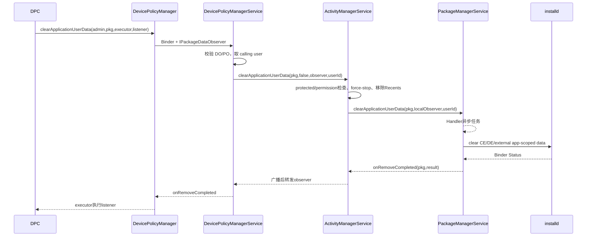
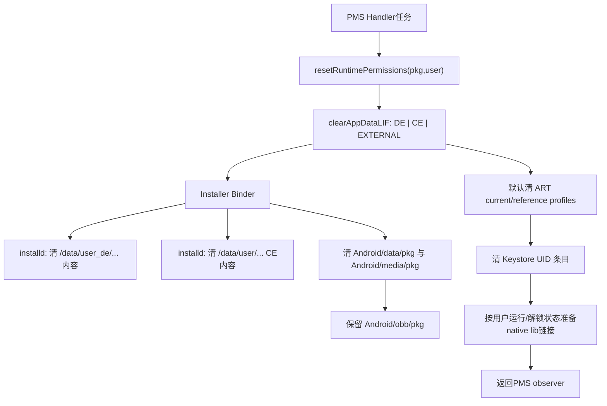
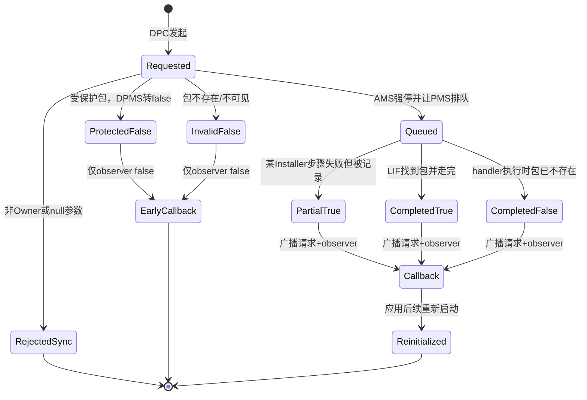

# 第 326 章 Android 企业 clearApplicationUserData：授权、AMS 强停、PMS/installd 清理、异步回调与残留边界链

> 源码基线：Android 11 / API 30 / `android-11.0.0_r48`。本章只读分析本地源码；“清除成功”必须按具体数据域理解，不能等同于卸载、恢复出厂或所有云端数据均已删除。

## 1. 这个 API 要解决什么问题

`DevicePolicyManager.clearApplicationUserData()` 让 Device Owner（DO）或 Profile Owner（PO）远程把某个应用恢复到近似“刚安装、尚未使用”的本地状态。典型场景是企业应用退出登录失败、缓存损坏、设备交接，或管理员需要撤掉工作资料中某应用的本地业务数据。

## 2. 它不是卸载

APK、版本号、签名、安装来源和 per-user 安装关系仍然存在，应用入口通常也仍存在。系统删除的是该用户下的数据并重置若干与包相关的系统状态；若要移除代码和安装记录，应研究卸载或企业静默卸载链。

## 3. 它也不是 wipeData

`wipeData()` 的目标是用户、工作资料或整台设备；本 API 的目标只是“调用者所在 user 中的一个 package”。两者的授权、Recovery/eUICC/FRP 行为和不可逆范围完全不同。

## 4. 一句话总链

DPC 经 DPM/DPMS 校验 Owner 身份，DPMS 清除 Binder 身份后调用 AMS；AMS 检查受保护包、强停进程并删除近期任务，再让 PMS 异步调用 installd 清 CE/DE/应用专属共享存储、重置权限和 Keystore，完成后广播并逐层回调 DPC。

## 5. 主要源码位置

公共 API 在 `frameworks/base/core/java/android/app/admin/DevicePolicyManager.java`；企业授权在 `services/devicepolicy/.../DevicePolicyManagerService.java`；运行态收敛在 `services/core/.../am/ActivityManagerService.java`；包数据操作在 `PackageManagerService.java`、`Installer.java` 和 `frameworks/native/cmds/installd/InstalldNativeService.cpp`。

## 6. 谁可以调用

DPMS 执行 `enforceProfileOrDeviceOwner(admin)`，所以活跃 DO 和 PO 都可以调用。普通 Device Admin、delegate、普通系统应用以及只持有包名的应用不能通过这条 DPM 接口获得能力。

## 7. PO 的作用域

服务端取 `UserHandle.getCallingUserId()` 作为目标 userId。工作资料 PO 因而只能清自己资料 user 中的包数据，不能借这条 API 指定父用户或其他任意用户。

## 8. DO 的作用域也不是 USER_ALL

DO 通常位于 system user，所以该调用清 system user 对应包的数据。API 没有 user 参数，也不会自动遍历所有次要用户；同一包在其他 user 的 CE/DE 数据仍然独立存在。

## 9. parent DPM 实例被拒绝

客户端先执行 `throwIfParentInstance("clearAppData")`。组织所有设备上的 PO 不能通过 parent facade 把目标切到父 user；这与某些允许 parent policy 的 DPM API 不同。

## 10. 端到端时序



## 11. 四个 NonNull 参数

公开方法要求 admin、packageName、executor、listener 均非空。DPM 客户端只显式 `requireNonNull` executor 和 listener；admin/packageName 在 DPMS 再检查，因此不要把检查发生在哪一层误写成“没有检查”。

## 12. admin 和 packageName 的服务端检查

DPMS 依次 `Objects.requireNonNull(admin)`、`Objects.requireNonNull(packageName)`、`Objects.requireNonNull(callback)`。null 会在真正执行前同步失败，不会产生“异步 false”。

## 13. listener 如何跨 Binder

DPM 创建匿名 `IPackageDataObserver.Stub`，把系统回调转换成公开的 `OnClearApplicationUserDataListener`。因此公开 listener 本身不跨进程，跨进程的是由 SDK 包装的 Binder observer。

## 14. 为什么需要 Executor

Binder 回调可能运行在 DPC 进程的 Binder 线程，SDK 不直接在该线程执行业务 listener，而是调用 `executor.execute(...)`。调用方可选择主线程、串行线程池或专用后台线程，并应避免 executor 已关闭导致回调任务被拒绝。

## 15. 方法返回不等于清理完成

公开 API 返回 `void`，Binder 请求进入 DPMS 后很快返回；PMS 明确把删除任务 `mHandler.post()`。唯一公开完成信号是 listener，不能在方法下一行就读取应用目录并宣称已清除。

## 16. observer 是 oneway

`IPackageDataObserver.aidl` 声明为 `oneway interface`。系统发送 `onRemoveCompleted()` 时不会同步等待 DPC listener 执行结束，这避免 PMS handler 被企业应用的慢回调拖住。

## 17. oneway 不保证业务必达

DPC 进程死亡、Binder 对象失效、executor 拒绝任务或应用逻辑异常，都可能让业务层看不到完成事件。系统侧捕获 `RemoteException` 后只记录或忽略，没有持久化“待重投回调”队列。

## 18. DPMS 的身份清洗

Owner 校验完成后，DPMS 调用 `binderClearCallingIdentity()`，以 system_server 身份进入 AMS，finally 中恢复。这样企业应用本身无需持有 `CLEAR_APP_USER_DATA`，但它的权力先被 DPMS 的 Owner 门约束。

## 19. 为什么必须先校验再清身份

若先清身份，后续角色检查看到的将是 system UID，授权边界就被破坏。源码顺序是 NonNull → Owner 校验 → 记录 calling userId → clear identity，体现“先证明委托者，再使用系统能力”。

## 20. AMS 再做一遍基础调用者检查

AMS 先 `enforceNotIsolatedCaller()`，再通过 `handleIncomingUser()` 解析 user。DPMS 已变为 system_server 身份，所以跨 user 权限门能通过，但目标仍是之前保存的真实 Owner userId。

## 21. AMS 的 CLEAR_APP_USER_DATA 门

一般调用者只能清自己的 UID 数据，清别的包必须有 `CLEAR_APP_USER_DATA`。本链进入 AMS 时 uid 是 system UID，因此通过；这不意味着原始 DPC 直接调用 AMS 也能通过。

## 22. “清自己的数据”比较的是 UID

源码计算 `appInfo.uid == Binder.getCallingUid()`，而非包名等于调用包。shared UID 场景下，同 UID 包的权限边界比“同包”更宽；但 DPM 路径已由 Owner 角色门包住，不能据此给普通 DPC 扩权。

## 23. 目标 user 的包信息

AMS 用 `MATCH_UNINSTALLED_PACKAGES` 查询 `ApplicationInfo`。这让某些仍保留 PackageSetting 的未安装状态也能被识别，后面还会结合 Instant App metadata 判定请求是否有效。

## 24. 无效包名的结果

若既没有 ApplicationInfo，也没有 Instant App metadata，AMS 直接给 observer 回调 false 并返回 false。DPMS 的公开方法不暴露 AMS boolean，DPC 最终只能从 listener 的 succeeded=false 得知失败。

## 25. 包可见性过滤

PMS 还会计算 `shouldFilterApplicationLocked(ps, callingUid, userId)`。DPM 路径的下游调用者是 system UID，通常不会被 package visibility 隐藏；通用 PMS API 的其他调用者则可能因为过滤而得到 false，避免用清数据接口探测包存在性。

## 26. Instant App 的特殊判断

若目标是 Instant App，调用者还需 `ACCESS_INSTANT_APPS`；其完成广播也要求接收方持有该权限，并额外放入包名。system_server 调用能处理，但普通调用链不能借返回差异枚举瞬时应用。

## 27. 第一层受保护包检查

AMS 在查询应用详情前调用 `PackageManagerInternal.isPackageDataProtected(userId, packageName)`。命中就抛 `SecurityException`，确保强停和实际删除都尚未发生。

## 28. 第二层受保护包检查

PMS Binder 入口再次调用 `ProtectedPackages.isPackageDataProtected()`。这是纵深防御：即便其他系统代码绕过 AMS 直接调 PMS，也不能轻易清 Owner 或产品关键包的数据。

## 29. 哪些包属于 data protected

Android 11 r48 包括：该 user 的 DO/PO 包、资源配置的 Device Provisioning 包，以及 Device Owner 额外指定的 protected package 列表。它不是“所有系统应用”，也不是仅按 `FLAG_SYSTEM` 判断。

## 30. 为什么 DPC 不能清自己

当前 user 的 Owner package 正是 ProtectedPackages 命中项。这样可防止 DPC 意外删除自己的政策数据库、密钥和接管状态，造成设备处于“系统仍认为受管、控制端却已失忆”的危险半状态。

## 31. 失败为何不把 SecurityException 抛给 DPC

DPMS 专门捕获 AMS 的 `SecurityException`，记录 warning，然后主动 `callback.onRemoveCompleted(packageName,false)`。注释解释调用者无法预先知道全部保护包，因此把它归一成清理失败结果。

## 32. 哪些异常仍可能同步抛出

Owner 身份不符、admin/package/callback 为 null 等发生在 DPMS catch 范围之前，会直接失败。只有调用 AMS 阶段的 SecurityException 被转换；不要把所有安全错误都概括成异步 false。

## 33. DPMS 不验证目标是否已安装

它只验证调用者和参数，把包存在性、Instant metadata 与保护状态交给 AMS/PMS。这减少企业服务复制包管理规则，但使公开 API 的成功/失败必然依赖异步下游结果。

## 34. AMS 先 force-stop

目标 AppInfo 存在时，AMS 调用 `forceStopPackageLocked(packageName, appInfo.uid,"clear data")`。这会阻止旧进程继续持有文件句柄或在删除过程中重写数据库，并让包进入 stopped 语义。

## 35. 强停不是最终永久禁用

完成回调中 AMS 调用 `finishForceStopPackageLocked(packageName, appInfo.uid)` 收尾；应用仍可在后续显式启动、符合条件的系统事件或用户操作下重新运行。它没有把 enabled state 改为 disabled。

## 36. 近期任务也被移除

AMS 调用 ATMS 的 `removeRecentTasksByPackageName(packageName,resolvedUserId)`。因此 Overview 中该包的旧任务卡片消失，避免用户点回指向已被删数据的 Activity 状态。

## 37. 为什么先强停再异步删

虽然 PMS 实际删除在 handler 上异步发生，强停和移除 Recents 在请求线程先执行。DPC 可能观察到 UI 已消失，但 listener 尚未回调；这是“运行态开始收敛”，不是“数据已删完”。

## 38. appInfo 为空时不强停

保留 Instant metadata 等合法无 ApplicationInfo 情况不会进入 force-stop、Recents、jobs/alarms 清理分支。PMS仍尝试按包状态处理，因此各种目标形态不能假定副作用完全相同。

## 39. keepState 参数的来源

AMS 通用方法有 `keepState`，DPM 路径固定传 false。注释显示 keepState=true 用于某些即将恢复合适应用数据的内部流程；企业清理要求同时撤掉 URI grants 和通知状态。

## 40. 到这里真正删除还没发生

前四十节完成的是 API、授权、目标校验和运行态隔离。磁盘删除发生在 PMS handler → install lock → installd，后续还要区分“删除目录内容”“重置系统数据库状态”和“仍然残留的数据域”。

## 41. PMS 为什么投递到 Handler

PMS 注释明确说包数据删除可能耗时，因此 `mHandler.post(new Runnable())`。Binder 入口只完成权限、跨用户和包可见性检查，不在来电线程执行大量文件 I/O。

## 42. Handler 排队带来的窗口

请求已返回但任务可能尚未获得执行机会；期间目标包已被 AMS 强停，PMS 的 PackageFreezer 还未建立。诊断时要把“排队延迟”与“installd 删除很慢”区分开。

## 43. PackageFreezer 的职责

handler 真正执行时以 `freezePackage(packageName,"clearApplicationUserData")` 包住操作。它用于在关键包变更窗口冻结并杀掉相关进程，避免安装/启动状态与数据删除交叉，而不是把 APK 永久冻结。

## 44. mInstallLock 串行化

PMS 在 PackageFreezer 内取得 `mInstallLock`，然后调用 `clearApplicationUserDataLIF()`。后缀 LIF 表示调用方需持有 install lock；大型 I/O 不在全局 `mLock` 下完成，减少包查询被长时间阻塞。

## 45. 包再次解析

`clearApplicationUserDataLIF` 先从 `mPackages` 找已解析 AndroidPackage，找不到再尝试 PackageSetting 中保留的 pkg。最终仍为空则记录“不存在”并返回 false，不调用 installd。

## 46. 成功定义的第一个局限

只要能取得 AndroidPackage，方法最后固定返回 true。内部 `clearAppDataLIF` 对 InstallerException 只记录 warning、不把失败上传；所以 succeeded=true 更接近“目标有效且清理流程走完”，并非每个文件都经逐项验证。

## 47. 先重置运行时权限

PMS 在删文件前执行 `mPermissionManager.resetRuntimePermissions(pkg,userId)`。它清用户可设置flags，普通runtime grant回到初始逻辑；但SYSTEM_FIXED、POLICY_FIXED会保留，默认或Role授予会重授，shared UID中仍被伙伴包请求的permission也会跳过，不能简化成“所有危险权限一律撤销”。

## 48. 为什么权限不在应用数据目录

运行时 grant 存在 PermissionManager/PackageManager 管理的用户级系统状态中，不属于 `/data/user/.../<package>`。只调用 installd 无法完成“清除应用数据”的用户期望，因此 PMS 必须单独重置。

## 49. 三类存储 flag

PMS 传入 `FLAG_STORAGE_DE | FLAG_STORAGE_CE | FLAG_STORAGE_EXTERNAL`。DE 是设备解锁前可用的数据，CE 是凭据解锁后数据，EXTERNAL 在这里指共享存储上的应用专属目录，而不是整块共享存储。

## 50. PMS 与 installd 的数据层



## 51. CE 路径如何清

installd 根据 volume、userId、packageName 和 ceDataInode 解析 CE package path；普通全量清理执行 `delete_dir_contents(path)`，保留包数据根目录本身但删除内部内容，并移除 cache/code_cache inode 扩展属性。

## 52. DE 路径如何清

DE 使用 `create_data_user_de_package_path()` 构造路径，存在时同样删除目录内容。它覆盖 Direct Boot aware 组件可能在用户解锁前写入的 SharedPreferences、数据库和文件。

## 53. 为什么同时清 CE 与 DE

一个应用可以同时使用 `createCredentialProtectedStorageContext()` 与 `createDeviceProtectedStorageContext()`。只清一侧会造成账户、令牌或迁移标记在另一侧“复活”，所以公开清数据传两种 flag。

## 54. 锁定用户时 CE 会怎样

PMS 仍把 CE flag 交给 installd；是否能依据 inode 访问加密目录取决于存储状态。源码不等待用户解锁，也不把每个底层失败转换成 false，因此锁屏/未解锁设备上更要把回调视为流程结果而非内容证明。

## 55. external 到底清什么

installd 遍历已知 storage mounts，删除该用户下 `Android/data/<package>` 和 `Android/media/<package>`。所以公共文档所说“外部存储数据不会被擦除”应精确理解为应用专属目录会尝试清，任意公共位置文件不会全盘搜删。

## 56. OBB 明确保留

native 源码注释写明 OBB 只在卸载时删除。即使使用 FLAG_STORAGE_EXTERNAL，`Android/obb/<package>` 仍保留，故大型游戏资源或企业离线包可能在清数据后继续占空间。

## 57. 公共目录文件保留

应用写到 Download、Documents、Pictures 或自定义共享目录的文件，没有按 package 可靠归属，installd 不会删除。管理员若要求数据彻底撤离，需要应用内清理协议、MediaStore 归属核对或更高层设备擦除。

## 58. 用户词典示例

DPM 文档还列出 user dictionary：应用写入由其他系统服务管理的共享数据，不一定随包私有目录清理。判断残留应按“数据实际由哪个服务/UID持久化”追链，而不是按最初是谁创建。

## 59. 云端数据不在范围内

服务器账户、同步副本、推送 token 服务端绑定、MDM 后台日志当然不由本机 installd 清除。合规删除应把本地清理与服务端删除、审计留存和备份保留策略分开确认。

## 60. ART profiles 也会清

`clearAppDataLIF` 在没有 KEEP_ART_PROFILES flag 时调用 `clearAppProfilesLIF(pkg,USER_ALL)`。DPM 路径没有 keep flag，因此会清当前/参考编译 profile；后续性能可重新学习和编译。

## 61. 一个容易忽略的跨用户点

数据目录只清目标 user，但 ART profile 调用传 `USER_ALL`。这源于 profile 的系统级管理方式；不能简单概括为整条操作“所有副作用都严格只在当前 user”。

## 62. Keystore 数据如何清

PMS 取 package appId，调用 `KeyStore.clearUid(UserHandle.getUid(userId,appId))`。由该 UID 放入旧 Keystore daemon 命名空间的密钥会被移除，应用下次启动不能继续用旧 alias。

## 63. Keystore 清理的 shared UID 风险

Keystore 以 UID 而非 package 隔离。若多个包共享 appId，清一个包时 `clearUid` 可能影响同 UID 伙伴的密钥；sharedUserId 本来就意味着较弱的包间隔离，企业评估必须按 UID 看影响面。

## 64. Keystore 联系失败

`KeyStore.getInstance()` 为 null 时只记录 warning；接口没有把该情况反馈成 succeeded=false。即便实例存在，代码也没有逐个 alias 验证删除后状态，回调不能作为密码学擦除证明。

## 65. 数据根目录会重新创建吗

native clear 主要删“目录内容”而非 destroy 根目录。之后 PMS 根据用户状态调用 `prepareAppDataContentsLIF`，Android 11 这里主要重建需要的 32 位 native library symlink；应用首次运行还会再创建普通内容。

## 66. 用户状态决定 prepare flags

用户 unlocking/unlocked 时准备 DE+CE；仅 running 但未解锁时只准备 DE；用户未运行则 flags=0。这个分支影响即时可用内容准备，不改变请求最初传给 clear 的三类删除 flag。

## 67. Installer Binder 的安全门

`InstalldNativeService::clearAppData` 使用 `ENFORCE_UID(AID_SYSTEM)`。普通应用即便能拿到接口句柄，也不能直接要求 native 守护进程删除其他包目录；有效请求必须来自 system UID 的 PackageManager 链。

## 68. native 还校验参数

installd 检查 volume UUID 与 package name，且以内部锁串行操作。包名不是随意文件路径，避免通过 `../` 等方式把 API 变成任意目录删除器。

## 69. 底层部分失败如何累计

installd 可先清 CE 成功、再清 DE 或 external 失败，并把 binder Status 设为 error。Installer.java 将异常包装为 InstallerException，但 PMS 的 leaf 方法捕获后只写日志，已经删掉的部分不会回滚。

## 70. 因而操作不具事务性

没有跨权限数据库、CE、DE、共享存储、ART profile、Keystore、通知和 URI grants 的统一事务。断电或单子系统异常可留下部分新、部分旧的混合状态，重试通常是合理的幂等恢复手段。

## 71. PMS 完成后的存储监测

若 LIF 返回 true，PMS 获取 DeviceStorageMonitorInternal 并调用 `checkMemory()`。清理释放空间后，系统可重新评估低存储通知和阈值，但这不等于精确统计本次释放字节数。

## 72. suspension 副作用

若目标包拥有 `SUSPEND_APPS` 权限，PMS 会解除它作为 suspending package 施加的暂停和 distracting restrictions。原因是该包自身数据被清后，不应继续保留它对其他应用施加的管理状态。

## 73. 这一解除可能影响别的包

`unsuspendForSuspendingPackage(packageName,userId)` 按“挂起者”清贡献，不只修改目标包自己的 suspended 位。随后还调用 `removeAllDistractingPackageRestrictions(userId)`；评估高权限管理应用时要观察全 user 的体验变化。

## 74. Instant metadata 删除

PMS 在 LIF 调用后删除该 user 的 Instant Application metadata。即使 LIF 返回 false，只要没有 visibility filter，源码仍执行该删除；Instant App 请求的元数据生命周期因此和普通已安装包不同。

## 75. PMS observer 回调点

PackageFreezer 退出、存储监测和可能的 suspension 清理完成后，handler 才调用 observer。这里的 succeeded 来自 LIF 的粗粒度 boolean，而不是 AMS 后续广播是否成功。

## 76. AMS 还会清 URI grants

因为 keepState=false，AMS 调用 `removeUriPermissionsForPackage(packageName,userId,true,false)`，移除授予该包以及由该包授出的持久/临时 URI 能力，避免清数据后的新实例继承旧跨应用文件访问。

## 77. URI grant 参数要谨慎理解

源码注释概括为“Remove all permissions granted from/to this package”。不要只写“撤销目标作为接收者的权限”；provider 方曾经授出的能力也在清理范围内，实际布尔参数语义应结合 UriGrantsManagerInternal 实现核对。

## 78. 通知状态也被重置

AMS 调用 `INotificationManager.clearData(packageName,appInfo.uid,uid==appInfo.uid)`。DPM 路径 caller 已是 system UID，通常 `fromApp` 为 false；通知、channel 等 NMS 持有的包状态不在应用目录中，必须单独清。

## 79. Scheduled Jobs 被取消

`JobSchedulerInternal.cancelJobsForUid(appInfo.uid,"clear data")` 清该 UID 的计划任务，避免旧业务参数在新应用数据环境继续执行。shared UID 下按 UID 取消也可能波及伙伴包。

## 80. Pending Alarms 被移除

`AlarmManagerInternal.removeAlarmsForUid(appInfo.uid)` 同样按 UID 清闹钟。清数据后应用需重新注册；对 shared UID，副作用范围仍应按 UID 而非单 package 评估。

## 81. Jobs/Alarms 清理的时序

AMS 在调用 PMS 后继续执行 jobs、alarms 等系统状态清理，并不主动等待 PMS observer。PMS 已把磁盘任务投到另一handler，通常能观察到这些状态较早变化，但两线程存在竞态，源码没有承诺它们一定先于磁盘任务完成。

## 82. pm.clear 返回不是完成

跨 Binder 调用 `pm.clearApplicationUserData()` 返回时，只说明 PMS 完成同步校验并成功排队。AMS 随即走后处理；真正数据结果稍后通过 localObserver 回来。

## 83. localObserver 为什么存在

AMS 不把 DPC observer 直接传给 PMS，而是插入本地包装层。这样可在通知最终调用者之前结束 force-stop、发送 `ACTION_PACKAGE_DATA_CLEARED`，并统一普通/Instant App 广播可见性。

## 84. finishForceStop 的条件

只有最初查到 appInfo 才调用 `finishForceStopPackageLocked`。目标在异步窗口中被卸载或包状态变化时，闭包仍持有旧 appInfo；这正说明回调应按请求时快照理解。

## 85. PACKAGE_DATA_CLEARED 广播

AMS 创建 data URI 为 `package:<packageName>` 的 `Intent.ACTION_PACKAGE_DATA_CLEARED`，加入 `FLAG_RECEIVER_INCLUDE_BACKGROUND`，并携带 EXTRA_UID 与 EXTRA_USER_HANDLE。系统组件可据此清自己维护的包关联状态。

## 86. 广播不只给目标应用

该 action 是包生态变化信号，ShortcutService、SliceManager、ContentService 等都可能监听。目标应用自己的数据刚被清且处于强停恢复阶段，不能把它当成可靠的“目标包自我初始化回调”。

## 87. 广播先于 DPC observer

localObserver 源码顺序是 finish force-stop → broadcast → 原 observer。这里的 broadcast 发送并不表示所有 receiver 已完成，但 DPC listener 至少在“广播请求已提交”之后被触发。

## 88. 广播不携带 succeeded

只要请求已经进入 PMS 并由 localObserver 回来，即使其 succeeded=false，AMS 仍构造 PACKAGE_DATA_CLEARED，再把 false 传给 observer。受保护包或 AMS 早期判定的无效包直接走原observer，不经过localObserver，因而不会走这段广播；消费者仍不能只看action断言成功。

## 89. 回调包名不要盲信业务输入

公开 listener 收到的是逐层回传的 `pkg` 字符串。正常链与请求包名相同；DPC仍应把一次请求绑定 requestId/期望包名，避免并发清理时只靠“最近一次操作”关联 UI。

## 90. 状态与结果矩阵



## 91. succeeded=true 能证明什么

它能证明异步请求找到了可处理 AndroidPackage，并走到了 PMS 完成回调；通常伴随权限、目录、Keystore和运行态清理尝试。它不能证明每个 mount 都在线、每次 installd 删除都成功，也不能证明外部服务和公共文件已删除。

## 92. succeeded=false 的多种原因

包括目标受保护、包名无效、包可见性被过滤、handler 执行时包已不存在等。公开 callback 没有错误码，DPC无法仅靠 false 区分原因，应结合自身包库存、角色状态和可获取的系统日志诊断。

## 93. 没有超时参数

SDK 没有提供 timeout 或取消方法。管理端应自己设置“等待中”超时，用于 UI 和任务重试；超时只能表示未收到 callback，不能证明系统任务没有在后台继续。

## 94. 重试是否安全

对同一 user/package 重复清理通常具有幂等性：空目录再次删除、权限再次重置、jobs再次取消。可是每次都会强停、移除 Recents 和触发广播，且 shared UID/管理权限副作用可能重复发生，所以应做有限退避而非无限循环。

## 95. 并发请求

两个请求都可在 PMS handler 排队，并由 install lock 串行完成；各自 observer 都可能回调。DPC 应为每次请求维护独立状态，不要假设只有最后一次会回调。

## 96. 与应用主动 clear 的等价边界

DPM 文档称行为等价于目标应用调用 `ActivityManager.clearApplicationUserData()`，核心最终确实进入同一 AMS 方法。差别是 DPC 由 Owner 委托清其他包，且目标 user 由 DPC 所在 user 固定。

## 97. 与“设置中清除存储”的关系

设置应用通常也通过受权限保护的 AMS/PMS 链执行，因此看到的强停、权限重置和目录清理大体一致。具体 UI 是否允许清系统关键包，由前端限制与 ProtectedPackages 后端门共同决定。

## 98. 数据恢复风险

应用重新启动后可能从 Android Backup、企业服务器、AccountManager 或同步服务恢复数据。清理本身不设置“禁止恢复”标志；若业务要求真正注销，需先撤销服务器会话并设计恢复策略。

## 99. Direct Boot 残留检查

只检查 `/data/user/<id>/<pkg>` 会漏掉 `/data/user_de/<id>/<pkg>`。反之，在 macOS 无设备环境下也不应凭路径列表声称真机已删除，应把这作为未来 userdebug 验证清单。

## 100. 多卷与可卸载存储

AndroidPackage 可带 volumeUuid，installd 也遍历已知 mounts 清 external app-scoped 目录。未挂载卷、非主用户 secondary physical storage TODO 等分支可能留下稍后重新挂载才可见的数据。

## 101. 锁竞争与性能

大量文件删除在 PMS handler 上并持有 install lock，会延迟其他安装类操作；native 又持 installd 内部锁。企业端应避开业务高峰，不要对几十个大包同时发起无节制清理。

## 102. 进程死亡后的状态

DPC 死亡不会自动撤销已排队任务；PMS仍可能完成，只是 observer Binder 已失效。DPC 重启后没有查询“某次 clear 是否完成”的 API，只能从自身任务日志、应用重建状态和再次幂等清理恢复。

## 103. system_server 重启窗口

若请求仅排队尚未执行，system_server 崩溃会丢失内存队列；若正在多阶段清理，则可能部分完成。平台没有为这次命令写 transaction journal，DPC 的超时重试是控制面必要设计。

## 104. 审计记录边界

这段 DPMS 实现没有像许多策略 setter 那样写 DevicePolicyEventLogger。DPC 应自行记录发起者、目标 user/package、请求时间、回调和重试，但不要在日志中复制被清应用的敏感内容。

## 105. 安全审计应记录哪些状态

至少区分 REQUESTED、CALLBACK_TRUE、CALLBACK_FALSE、TIMEOUT、RETRY 和后续应用重新注册结果。把“void 调用无异常”记录为 SUCCESS 会把异步、保护包和底层部分失败全部抹平。

## 106. 最小准确源码片段

关键不是背完整方法，而是记住 DPMS 固定 `keepState=false`，PMS异步排队，LIF同时清三类存储：

```java
ActivityManager.getService().clearApplicationUserData(
        packageName, false, callback, userId);

mHandler.post(() -> {
    succeeded = clearApplicationUserDataLIF(packageName, userId);
    observer.onRemoveCompleted(packageName, succeeded);
});

clearAppDataLIF(pkg, userId,
        FLAG_STORAGE_DE | FLAG_STORAGE_CE | FLAG_STORAGE_EXTERNAL);
```

## 107. 常见误解一：false 才会部分失败

错误。某些 InstallerException 被内部吞掉，仍可能回调 true；false 更常表示保护、无效或找不到目标。真实删除完整性只能通过更细的系统日志、文件/服务状态和产品测试补证。

## 108. 常见误解二：external 全都不清

公共文档的简写容易让人误会。r48 native 明确尝试清 `Android/data` 与 `Android/media` 的包目录，但不清 OBB、Download 等无可靠包归属的数据。

## 109. 常见误解三：只删沙箱文件

权限、通知、URI grant、jobs、alarms、近期任务、ART profile、Keystore 与 suspending-package 状态都由系统服务额外收敛。它是一条“包数据 + 关联系统状态”的组合链。

## 110. 常见误解四：listener 在主线程

listener 在调用者提供的 executor 上执行；选择 direct executor 可能让它落在 Binder 线程，选择 main executor 才是主线程。UI代码必须明确线程策略。

## 111. 本章知识检查

请先不看答案回答：为何 PO 不能清父用户？为何 true 仍可能残留？哪些外部目录会清、哪些不会？广播和 listener 谁先提交？为什么 shared UID 会扩大 Keystore/jobs/alarms 副作用？

## 112. macOS 只读练习一：追企业入口与身份切换

在本地执行 `rg -n "clearApplicationUserData" frameworks/base/core/java/android/app/admin frameworks/base/services/devicepolicy`，画出 DPM → DPMS，标记 Owner 校验、calling userId 保存、clear/restore identity 和 SecurityException 转 false 的位置。

## 113. macOS 只读练习二：追 AMS 运行态收敛

阅读 AMS 的同名方法，按源码顺序列出 protected 检查、force-stop、Recents、PMS请求、URI grants、通知、jobs、alarms、完成广播和 observer；特别标出哪些在 PMS 完成前执行。

## 114. macOS 只读练习三：核对真实删除目录

从 PMS 的 `clearApplicationUserDataLIF` 追到 Installer 和 native `clearAppData`，制作 CE、DE、Android/data、Android/media、OBB、Download 六行表，只依据源码填写“尝试清/明确保留/不在本链”。

## 115. macOS 只读练习四：构造结果边界表

为“受保护Owner包、不存在包、普通已安装包、installd external删除失败、shared UID包”分别写预期 callback 与可能副作用。无需在Mac编译，只引用本地行号并注明无法由静态源码确认的真机结果。

## 116. 练习答案要点

PO目标来自calling user且parent实例被拒；AMS先强停/移除Recents，PMS排队后AMS继续清URI/通知/jobs/alarms，但与另一handler的磁盘完成存在竞态；native清CE/DE及两个应用专属external目录、保留OBB且不遍历公共文件；保护/无效通常false，Installer局部失败可能仍true，shared UID影响按UID管理的状态。

## 117. 复读修正一：公开文档与 native 要同时读

初读若只复述“external storage不会擦除”会不准确。更易懂的说法是：系统会尝试删共享存储中能按包归属的 Android/data 与 Android/media，但不会替应用搜索所有公共文件，且OBB明确只在卸载时删。

## 118. 复读修正二：回调 true 不是原子提交凭证

PMS leaf 捕获 InstallerException 后不改变 LIF 最终 true，Keystore不可用也只告警；权限和部分目录还可能已经改变。因此应写“流程级成功”，不能写“全部数据已被验证清零”。

## 119. 复读修正三：时间线不能画反

AMS调用PMS后得到的是“已排队”，随后继续清URI grant、通知、jobs和alarms；另一handler可能并行完成磁盘任务，localObserver到来后才发送PACKAGE_RESTARTED、PACKAGE_DATA_CLEARED并通知DPC。源码未给两个线程建立“运行态清理必先于磁盘完成”的硬顺序，看到闹钟消失仍不能证明磁盘任务已经完成。

## 120. 本章结论与下一章

`clearApplicationUserData` 是Owner授权下的异步、多服务、非事务性清理：目标严格落在调用者user，保护包不可清，AMS先隔离运行态，PMS/installd清私有与应用专属external数据并重置系统状态，observer只给粗粒度结果。下一章进入 `setLogoutEnabled()`，分析次要用户退出入口、SystemUI展示、用户切换/停止及Owner持久化边界。
