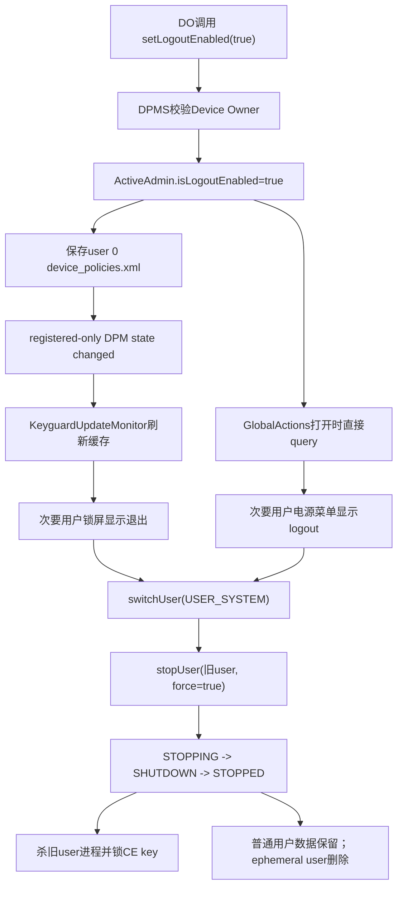
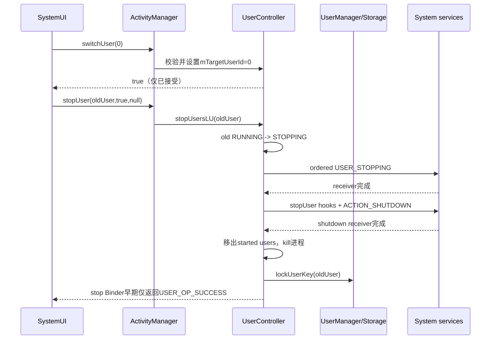
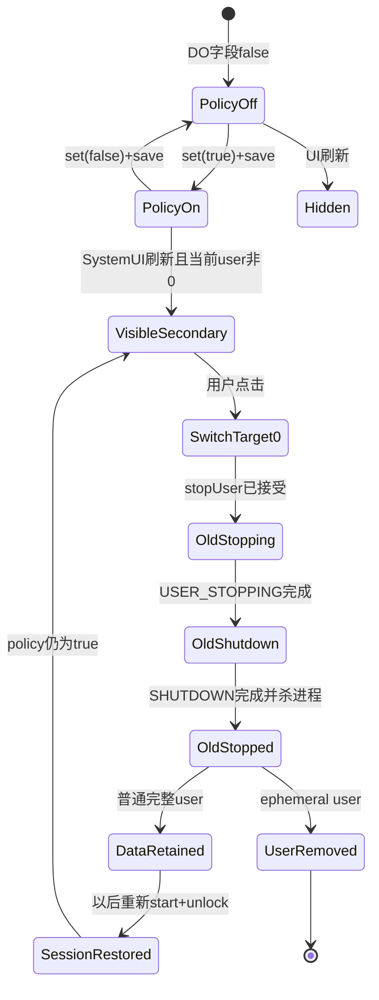

# 第 327 章 Android 企业 setLogoutEnabled：策略持久化、SystemUI 入口、用户切换停止与数据留存边界链

> 源码基线：Android 11 / API 30 / `android-11.0.0_r48`。本章只读分析本地源码；“logout”在这里是退出 Android 次要用户会话，不是注销某个 App 账户，也不是删除该用户。

## 1. 这个 API 开启什么

`DevicePolicyManager.setLogoutEnabled()` 允许 Device Owner 决定是否为所有次要前台用户展示系统退出入口。用户点击后，系统切回 user 0 并停止刚才的用户会话。

## 2. 它不是立即执行退出

setter 只保存一个 boolean 并触发通用 DPM 状态变化广播，不会切用户、停进程或弹确认框。真正退出发生在用户点击 SystemUI 的锁屏按钮或全局操作菜单之后。

## 3. 它不是应用账号 logout

Android user 是 UID、进程、CE/DE 存储、权限和系统服务状态的隔离边界。停止 user 与应用调用服务器 logout 完全不同：应用本地数据通常仍保留，云端 token 也不会自动吊销。

## 4. 与 DPM.logoutUser 的区别

`logoutUser(admin)` 是附属次要完整用户的 PO 主动执行命令并返回 UserOperationResult；`setLogoutEnabled` 是 DO 发布全局展示策略，让当前次要用户通过 SystemUI 自助退出。不要因名字相似把两条权限链混成一条。

## 5. 主要源码位置

策略 API/服务在 `DevicePolicyManager.java` 与 `DevicePolicyManagerService.java`；全局操作入口在 `SystemUI/.../globalactions/GlobalActionsDialog.java`；锁屏入口在 `KeyguardUpdateMonitor.java`、`KeyguardStatusView.java`；切换和停止位于 AMS 的 `UserController.java`。

## 6. 谁能设置

DPMS 用 `getActiveAdminForCallerLocked(admin,USES_POLICY_DEVICE_OWNER)` 获取 ActiveAdmin。只有真正 DO component 且 calling UID 匹配才能写；PO、delegate、普通 Device Admin 和任意 SystemUI 调用者都不能设置。

## 7. 为什么只有 DO

该 boolean 影响所有次要用户的系统级 UI，而非某个 profile 的局部体验。DO 具备整机管理权限，Profile Owner 只管理一个 user/profile，不应决定其他完整用户是否显示退出按钮。

## 8. parent 实例也不能调用

DPM 客户端执行 `throwIfParentInstance("setLogoutEnabled")`，getter同样拒绝parent facade。这里没有组织所有PO的parent特例，Owner模型就是DO-only。

## 9. Feature 门

若设备没有 `FEATURE_DEVICE_ADMIN` 对应能力，DPMS setter 静默返回、getter固定false。调用无异常并不证明状态被写入；DPC应结合设备管理能力与读回值判断。

## 10. 从策略到用户停止的总图



## 11. admin 的 null 检查

服务端先 `Objects.requireNonNull(admin)`。公开参数标注 NonNull，null 不会被解释为“自动寻找DO”，而是在进入角色 helper 前失败。

## 12. setter 的锁

ActiveAdmin 查询、旧值比较、字段修改和保存都在 DPMS 全局锁内。并发 setter 被串行化，最终状态由最后一次真正改变值的调用决定。

## 13. 幂等调用

若旧值已经等于 enabled，源码立即 return，不重写XML，也不发通用状态变化广播。DPC不能用重复set(true)强制SystemUI刷新。

## 14. 默认值

`ActiveAdmin.isLogoutEnabled` 显式初始化为false。新DO尚未调用、XML没有tag、Owner已移除或feature不存在时，聚合getter都返回false。

## 15. true 如何持久化

ActiveAdmin writer 只在true时写 `is_logout_enabled value="true"`。它位于DO admin子树中，通常存入user 0的 `device_policies.xml`。

## 16. false 如何持久化

设为false后重写整个policy文件，该tag被省略；reader遇不到tag就保持默认false。缺失tag和显式false在内存语义上相同。

## 17. XML 解析

reader 对value使用 `Boolean.parseBoolean()`；true字符串恢复为true，false或异常字符串落为false而不抛格式异常。损坏到无法解析整个文件则进入更外层错误处理。

## 18. save 成功才发变化广播

`saveSettingsLocked()` 在flush、sync、close和journal commit之后调用 `sendChangedNotification(userHandle)`。广播没有发生不能简单证明策略未改，但成功持久化路径会提交这次刷新信号。

## 19. I/O 失败的半状态

setter 在save前已把内存字段改掉；写失败时journal rollback、记录warning且不向DPC抛，getter当前进程仍可能返回新值，但没有广播，重启后从旧文件恢复。void正常返回不是持久化ACK。

## 20. 没有专用 logout policy 广播

系统发送通用 `ACTION_DEVICE_POLICY_MANAGER_STATE_CHANGED`，且FLAG_RECEIVER_REGISTERED_ONLY，不携带enabled值。消费者必须在收到后重新query，静态Manifest receiver也不能依赖它冷启动。

## 21. 广播目标 user

save 使用 calling userId；合法DO通常位于user 0，所以变化广播发给user 0。SystemUI进程启动时主动query，并注册相关当前/all-user接收器，避免只依赖一次历史广播。

## 22. getter 谁能调用

DPMS `isLogoutEnabled()` 没有caller权限检查，只在锁内取DO ActiveAdmin字段。这是SystemUI等消费者所需的只读接口；任意调用者能读低敏感boolean，不代表能设置或执行跨用户停止。

## 23. getter 是设备聚合状态

它不接收admin或user参数，直接 `getDeviceOwnerAdminLocked()`。所以在任意次要用户看到的是同一个DO全局位，而不是每用户独立开关。

## 24. 无 DO 时

即使旧policy文件曾经有true，当前找不到DO admin时getter也返回false。字段归属于Owner生命周期，不是独立永久的Global Settings。

## 25. Ownership transfer

DO转移保留原ActiveAdmin政策对象、只更换admin信息和map key，因此logout位随新DO接管。转移本身有Owner变化信号，新DPC应读回而不是假定默认false。

## 26. clear Device Owner

清DO会移除承载字段的ActiveAdmin，后续getter false，SystemUI刷新后隐藏入口。已经处于STOPPING的用户不会因为策略随后关闭而自动取消停止。

## 27. setter 没有 DevicePolicyEvent

r48 方法没有调用 DevicePolicyEventLogger。系统policy XML能保存当前状态，但没有在这段实现中生成一条带admin/boolean的专用调用审计；DPC若有合规要求需维护自己的变更记录。

## 28. SystemUI 有两个主要入口

一是长按电源后的 GlobalActions logout item；二是KeyguardStatusView中的锁屏logout TextView。它们最终都调用 IActivityManager 的 switchUser 与 stopUser，而不是回调DO应用。

## 29. 全局操作列表还受资源控制

GlobalActions遍历 `config_globalActionsList`，只有其中含 `logout` 才考虑添加。AOSP r48默认含该项，但OEM overlay可删除；因此policy=true是“允许展示”，不是保证任何产品UI必有按钮。

## 30. GlobalActions 的显示条件

除了配置项，必须 `isLogoutEnabled()==true`、currentUser非null且id不等USER_SYSTEM。系统用户永远看不到退出到自己的按钮。

## 31. 锁屏入口的显示条件

`KeyguardStatusView.shouldShowLogout()` 检查KeyguardUpdateMonitor缓存为true且current user不是USER_SYSTEM。布局本身包含TextView，逻辑只切VISIBLE/GONE。

## 32. 为什么锁屏缓存状态

KeyguardUpdateMonitor构造时query一次，收到DPM state changed后在主线程再次query，并通过 `onLogoutEnabledChanged()` 通知view。这避免每次layout都跨Binder，但引入广播/主线程处理的短暂刷新延迟。

## 33. GlobalActions 不使用该缓存

电源菜单每次构建action时直接调用DPM getter，所以刚变更后可能比Keyguard缓存更早看到新值。两个UI短时间不一致不一定说明policy分裂，而可能是消费模型不同。

## 34. 锁定状态也可以退出

GlobalActions的LogoutAction `showDuringKeyguard()` 返回true，锁屏更直接提供按钮。用户无需先解锁原user即可结束其会话，这是企业共享设备快速交接的核心设计。

## 35. 未完成Provisioning时

GlobalActions的LogoutAction `showBeforeProvisioning()` 返回false。即使policy为true，设备尚未完成provisioning时该电源菜单action不会展示；锁屏路径还需结合当时Keyguard布局/设备状态判断。

## 36. 点击没有二次确认

两个r48入口都直接安排切换与停止，没有确认Dialog。防误触主要依赖按钮位置和系统UI交互，产品若改变布局需重新评估共享设备中的数据会话影响。

## 37. GlobalActions 有一个短延迟

onPress使用 `mHandler.postDelayed(...,mDialogPressDelay)`，先让dialog消失再切用户。这个UI延迟不是策略延迟，也不代表停止完成时间。

## 38. Keyguard 点击立即请求

KeyguardStatusView直接调用switchUser，然后stopUser，没有dialog press delay。两者执行入口时序略有不同，但下游UserController状态机相同。

## 39. SystemUI 直接使用系统权限

UI没有调用 `DevicePolicyManager.logoutUser(admin)`，因为它没有企业admin component；它以受信SystemUI身份调用IActivityManager跨用户API。DPM boolean只作为是否展示的产品政策信号。

## 40. 策略门与执行门分离

setLogoutEnabled控制官方SystemUI入口，但IActivityManager仍有自身INTERACT_ACROSS_USERS_FULL等权限检查。普通应用不能因为读到true就直接switch/stop用户；有系统权限的其他组件也不一定受这个UI展示位强制约束。

## 41. 点击时先记住旧 user

SystemUI先读取当前userId，然后请求 `switchUser(USER_SYSTEM)`，最后用保存的旧id调用 `stopUser(old,true,null)`。若切换期间再读取“当前用户”，可能拿到target user 0而停错目标，所以快照顺序很关键。

## 42. switchUser 不是同步完成

UserController校验target存在、支持前台切换且控制器已初始化，然后设置 `mTargetUserId` 并投递切换消息，随即返回true。画时序图时不能把Binder返回画成“user 0 已完全解锁并显示桌面”。

## 43. 为什么紧接着 stop 不一定被判 current

`isCurrentUserLU()` 比较的是 `getCurrentOrTargetUserIdLU()`：一旦target设为user 0，旧user即使尚在屏幕切换过程中，也不再被停止逻辑视作当前目标。这是两次连续Binder调用能够协同的关键。

## 44. switch 到 USER_SYSTEM 的检查

UserController要求目标UserInfo存在、`supportsSwitchTo()` 且不是managed profile。常规完整Android产品的user 0满足；headless system user或产品特殊用户模型若不支持前台切换，switch会返回false。

## 45. SystemUI 忽略 switch boolean

GlobalActions和Keyguard r48代码没有检查 `switchUser()` 返回值，仍继续stop旧user，也不检查stopUser的int结果。若切换失败，旧user仍被视作current/target，stop通常返回错误，UI只在RemoteException时写日志。

## 46. DPM.logoutUser 更严格

用于附属PO的DPMS命令会检查switchUser返回false并映射为USER_OPERATION_ERROR_UNKNOWN，然后才调用stop。它还把stop结果转换为公开UserManager错误码；这再次证明SystemUI自助路径与DPC命令路径并非同一包装。

## 47. stopUser 的权限门

UserController要求 `INTERACT_ACROSS_USERS_FULL`，禁止停止负数userId或USER_SYSTEM，并执行shell restriction检查。SystemUI/system_server具备能力，普通应用无法直接复制这两行代码。

## 48. force=true 的含义

两个SystemUI入口均传true。若同profile group中某个相关user是system/current，force允许至少停止请求的旧user而不因整个关联组无法一起停止而全盘失败；它不跳过所有生命周期广播和清理步骤。

## 49. 会停止关联 profiles

`getUsersToStopLU()` 收集与目标相同profileGroupId的started users。因此退出一个带managed profile的完整次要用户，通常会连同其相关资料一起停止，而不是让资料在后台继续运行。

## 50. 点击后的双状态机



## 51. stop 返回也不是完成

`stopUser()` 返回USER_OP_SUCCESS表示状态机已成功发起。SystemUI传null callback，不会获知何时ACTION_SHUTDOWN结束、进程杀完或CE key锁定；界面切到user 0与旧user完全停止是两个完成点。

## 52. 第一阶段 STOPPING

UserState从运行态改为STATE_STOPPING，UserManagerInternal同步该状态，并更新started user数组。随后handler异步清该user的broadcast queue，避免旧广播继续堆积。

## 53. ACTION_USER_STOPPING

系统发送registered-only、ordered的USER_STOPPING到USER_ALL，接收需要INTERACT_ACROSS_USERS。result receiver完成后才进入 `finishUserStopping`，为系统服务提供会话退出前收尾机会。

## 54. 第二阶段 SHUTDOWN

`finishUserStopping` 把状态改为STATE_SHUTDOWN，通知BatteryStats用户运行结束，调用SystemServiceManager.stopUser(userId)，再向该user发送有序ACTION_SHUTDOWN。

## 55. 为什么要等待 shutdown receiver

各组件可关闭数据库、flush状态或断开资源，最终receiver再触发 `finishUserStopped`。但广播接收仍有超时和组件质量边界，不能把它当作每个应用都可靠执行了logout业务。

## 56. 第三阶段 STOPPED

finish阶段从mStartedUsers和LRU移除user，清UserManagerInternal运行态，调用AMS user-stopped hooks，并 `forceStopUser()` 杀掉该user所有进程。

## 57. ACTION_USER_STOPPED

forceStopUser之后发送registered-only、foreground的ACTION_USER_STOPPED给USER_ALL，附EXTRA_USER_HANDLE。它表示framework停止收敛，仍不是“该user数据已删除”的广播。

## 58. 系统服务也清理 user 状态

UserController继续调用SystemServiceManager cleanup、ATMS/stack移除等钩子。各系统服务应丢掉该user的内存对象，下一次启动时从持久层重建。

## 59. CE key 默认立即锁

AMS公开stopUser传 `allowDelayedLocking=false`，finish后在FgThread调用StorageManager.lockUserKey(userId)。旧user的credential-encrypted数据变得不可访问，直到下次用户启动并完成解锁。

## 60. DE 与 CE 的区别

停止/锁CE不等于删除DE或CE目录；DE仍是device-protected数据模型，CE密文仍在磁盘。安全收益是进程停止与凭据密钥退出可用状态，而不是存储归零。

## 61. 锁key前还有重启竞态保护

FgThread真正lock前再次检查mStartedUsers；若user已被快速重新启动，就跳过key eviction，避免新会话正在使用数据时被旧stop任务锁掉。

## 62. 普通完整用户数据保留

账号、应用沙箱、权限、桌面布局和系统设置都留在该user。稍后从user switcher重新选择并认证，可恢复同一会话环境；logout更接近桌面操作系统的“结束会话”，不是remove user。

## 63. ephemeral user 是例外

停止成功后，若UserInfo标记ephemeral且不是pre-created，UserController调用 `removeUserEvenWhenDisallowed()`。这会进入用户删除链，数据不再按普通用户保留。

## 64. Guest 不必然等于删除

guest可以是ephemeral，也可能受产品/user配置影响。源码在这里自动删除的判定明确是 `isEphemeral()`；不能仅看到“访客”名称就断言logout必定擦除。

## 65. managed profile 不是前台切换目标

UserController拒绝switch到managed profile，SystemUI只在当前完整次要user展示。工作资料通常随父user运行/停止；若只想暂停工作资料，应使用quiet mode等profile机制。

## 66. 次要用户包含什么

公开文档说all secondary users，SystemUI实际条件仅排除USER_SYSTEM；完整secondary user、affiliated user、guest等都可能看到。显示端不逐一检查affiliation，因为策略由DO全局决定。

## 67. 用户限制是否阻止退出

本点击链没有查询DISALLOW_USER_SWITCH或专门logout restriction；switchUser内部在此片段主要检查target与shell restriction。产品若要声明某restriction绝对阻止该系统入口，必须继续以本地对应消费者为证，不能凭名称推断。

## 68. user 0 为什么叫 primary

API文档写switch back to primary，r48实现写死 `UserHandle.USER_SYSTEM`。传统产品user 0通常也是primary UI user；在headless system user架构中两者未必等价，需以产品用户模型验证。

## 69. 切换UI本身可能异步

若 `mUserSwitchUiEnabled` 为true，UserController先展示switching dialog再启动目标；否则直接投递前台启动消息。无论哪种，switchUser Binder boolean都不是完成回调。

## 70. user 0 解锁状态

回到user 0是否需要凭据、是否已经running/unlocked，取决于产品配置和当前状态。logout按钮不绕过user 0的Keyguard认证，也不向DPC返回“主用户已可交互”证据。

## 71. 再次登录旧user

后续选择旧user会重新start services、装载运行态并要求解锁CE；原应用数据仍在。企业共享设备若要求每班次干净环境，应采用ephemeral user、removeUser或显式数据清理，而不能只开启logout按钮。

## 72. 会话消息是相邻但独立政策

DO还可设置start/end user session message，UserController切换UI可展示这些文字。它们与isLogoutEnabled分别持久；开logout不会自动生成提示，设置文案也不会开启按钮。

## 73. end session message 不等确认

即使产品展示DO提供的结束文案，r48 logout按钮动作仍没有等待DPC确认。文案用于用户沟通，不是审批hook或事务回调。

## 74. 多次点击

GlobalActions先dismiss且延迟执行，Keyguard按钮可能在切换开始前被再次触发。UserController用target/current和状态机抑制部分重复操作，但SystemUI没有为每次点击维护业务requestId。

## 75. 关闭策略时的UI延迟

成功save后广播排队、Keyguard主线程更新缓存才隐藏；GlobalActions若已构建，当前dialog中的action对象也不会因为boolean瞬时改变而自动撤回。策略关闭主要约束后续展示，不是强事务撤销。

## 76. 点击与策略关闭竞态

LogoutAction onPress不重新query；按钮已显示并被点击后，即使DO刚set(false)，延迟Runnable仍可能执行。若产品要求强一致，应在执行点再次检查policy并定义失败UI，r48当前实现没有。

## 77. enable 也不会踢出当前user

当前secondary user继续运行，直到用户主动点击或其他管理命令停止。DO不能把setter成功当作“所有次要用户已退出”的安全事件。

## 78. setter 没有结果callback

与上一章清应用数据不同，本API既无executor/listener也无UserOperationResult。DPC最多立即getter读内存状态；UI刷新、用户点击和stop完成都没有回传给setter调用。

## 79. 如何观察用户生命周期

受权系统组件可监听USER_SWITCHED、USER_STOPPING、SHUTDOWN、USER_STOPPED等信号；DPC能力与广播可见性需按action保护级别核对。企业后台还应从设备状态上报确认，而不是把policy call日志当退出日志。

## 80. 退出与屏幕锁定

锁屏只保护当前user UI，进程可继续运行；logout会切换前台并停止user进程、最终锁CE key。两者安全语义明显不同，企业“交接设备”通常需要logout而不只是按电源键锁屏。

## 81. 退出与 removeUser

removeUser删除用户记录、应用数据和相关持久状态；logout对非ephemeral用户保留这些内容。若设备要归还库存或解除人员数据，必须明确选择删除用户/恢复出厂，而非用logout术语模糊处理。

## 82. 退出与 stopUser(admin,user)

DO可用stopUser指定某个secondary user，目标不必是调用者；附属PO的logoutUser只能退出自身。SystemUI自助路径总取前台旧user。三者最终可进入UserController，但上层权限和结果反馈不同。

## 83. force stop 的范围

finishUserStopped调用 `activityManagerForceStopPackage(userId,"finish user")`，语义是强停该user全部包进程，而不是某一个package。跨user运行在其他UID空间的同包实例不应被一并当作目标。

## 84. 后台工作会中断

该user的services、jobs、alarms、sync和前台Activity都失去运行环境；哪些任务持久化到下次user start后重建，由各调度服务自己的per-user实现决定。logout不承诺业务操作优雅提交。

## 85. 网络会话可能仍在服务器

本地进程停止会断开现有socket，但服务端refresh token、Web session和消息队列订阅可能继续有效。共享设备威胁模型若要求人员离场即撤权，应用/IdP必须配合会话吊销。

## 86. 外设和硬件资源

相机、音频、位置、蓝牙等由进程死亡和system-service user stop hook回收。回收成功依赖各服务实现，policy boolean本身不提供资源清单或完成ACK。

## 87. stop 广播可能拖延

USER_STOPPING和SHUTDOWN是有序流程，慢receiver会增加停止时间，系统广播机制可能超时推进。用户已看到切换UI不代表旧user所有cleanup都已完成。

## 88. 无 callback 的诊断难点

SystemUI给stopUser传null，既不显示USER_OP错误，也不接userStopped/userStopAborted。除了RemoteException，按钮侧通常静默；故障排查需要dumpsys activity users、UserController日志和最终用户状态。

## 89. mTargetUserId 是关键证据

只看 `mCurrentUserId` 会误判“旧user仍current所以stop必失败”。r48的 `isCurrentUserLU` 使用 current-or-target；switch请求一旦接受，target=0使旧user可进入STOPPING，直到前台start阶段再把current正式更新为0并清target。

## 90. 状态、数据与可见性的三层模型



## 91. policy true 与按钮 visible 要分开

前者是DPMS期望状态；后者还依赖SystemUI资源、当前user、provisioning、缓存刷新和OEM实现。自动化测试应分别断言getter和两个UI surface，不能只截一张电源菜单图。

## 92. 按钮点击与 stop completed 要分开

点击只产生两次Binder请求；stop返回也只是已发起。完整验证至少等待当前/target user变为0、旧user不在started列表、进程消失，并在安全要求下确认user key锁定。

## 93. user key locked 与数据 deleted 要分开

锁key意味着CE暂时不可解密，不代表密文扇区擦除或云端副本消失。合规文档应使用“会话停止/CE不可用”，不要写“用户数据已永久清除”。

## 94. 策略持久与会话运行态要分开

重启设备后DO字段从XML恢复，SystemUI可再次显示按钮；某个secondary user当时是否started则由启动策略决定。policy不会记录“上次是谁点击、是否停止成功”。

## 95. 多用户数量不影响boolean

无论一个还是十个secondary users，DPMS只有DO上的一个位。它无法为某些用户开启、另一些关闭；差异化产品需求必须通过其他用户类型、UI或管理流程实现。

## 96. 读接口的隐私边界

getter只泄露设备是否允许logout，不返回DO身份、当前用户列表或会话信息。开放读取是低风险设计，但应用仍不能据此枚举用户或执行跨用户动作。

## 97. UI overlay 的产品边界

OEM可替换GlobalActions列表、Keyguard布局甚至SystemUI实现。Framework策略契约写“system may show”，因此AOSP调用链是参考实现，产品兼容性必须在目标build上验证入口是否存在。

## 98. headless system user 风险

源码写死切user 0，而UserController会拒绝不支持switchTo的目标。对headless system user产品，应核对厂商是否改写logout目标或禁用该功能；不能用传统手机行为外推。

## 99. I/O失败后的UI差异

save失败不发changed broadcast，Keyguard缓存可能保持旧值；GlobalActions下一次构建直接getter却可能读到已改变的内存值。于是同一system_server生命周期内两个surface可能暂时不一致，重启又回到旧持久值。

## 100. 重复set不能修复漏广播

I/O失败后内存已经等于新值，再次set同值命中early return，仍不保存也不广播。DPC若检测到跨重启不一致，需要改变状态再设回或等待平台存储恢复，而API没有force-resave选项。

## 101. 这是一个值得记录的恢复缺口

“内存先改、保存失败不回滚、同值提前返回”组合可能让本次boot看似成功却无法用同值重试持久化。该结论来自r48控制流，不应泛化到所有Android版本。

## 102. RemoteException 的上层表现

DPM把system_server RemoteException转为运行时异常；SystemUI点击只捕获RemoteException并写日志。正常UserOperation错误以返回值表达，但两个UI入口忽略返回值，所以不会统一弹失败提示。

## 103. 审计最少记录

DPC应记录policy旧值/新值、发起时间、管理员版本与下次冷启动读回。若还需记录实际logout，应由受权设备代理采集user lifecycle结果，不能把setter日志伪装成用户行为日志。

## 104. 安全设计建议

共享设备应组合短自动锁、明确logout按钮、ephemeral或可回收用户、服务器token撤销和user 0强认证。单独一个boolean只能解决入口可达性，无法完成端到端交接。

## 105. 可用性设计建议

用户点击后应清晰显示正在切换，失败时可恢复入口；结束会话前提示未保存工作。AOSP r48没有业务数据保存确认，企业应用应设计自动保存或可恢复提交。

## 106. 最小源码骨架

记住三段即可定位全链：

```java
deviceOwner.isLogoutEnabled = enabled;
saveSettingsLocked(callingUserId);

if (dpm.isLogoutEnabled() && currentUser.id != USER_SYSTEM) {
    add(new LogoutAction());
}

am.switchUser(USER_SYSTEM);
am.stopUser(oldUserId, true, null);
```

## 107. 常见误解一：开启后立刻退出

错误。setter只改变policy；当前user可无限期继续运行，直到有人点击入口或其他管理命令执行stop。

## 108. 常见误解二：退出会删除账号和文件

错误。普通完整user的数据保留，只停止运行并锁CE key；只有ephemeral user在停止后走删除。应用服务器账号更不在UserController范围内。

## 109. 常见误解三：所有PO都能设置

错误。setLogoutEnabled严格DO-only；相邻的logoutUser才允许已affiliated次要完整user的PO退出自己，而且managed profile仍被拒绝。

## 110. 常见误解四：switchUser返回即完成

错误。返回true表示目标有效且消息已排队；mTargetUserId先建立过渡语义，真正current更新、user 0启动解锁和旧user停止各自异步推进。

## 111. 本章知识检查

请回答：为什么policy是全局位？为什么旧user在switch尚未完成时仍可stop？普通与ephemeral用户的数据结局有何不同？哪两个SystemUI入口消费它？I/O失败后为什么重复set(true)可能无法补写？

## 112. macOS 只读练习一：追策略持久化

用 `rg -n "isLogoutEnabled|TAG_IS_LOGOUT_ENABLED" frameworks/base/services/devicepolicy`，标出默认值、true-only writer、reader、setter early return、save与getter；写出save失败后的内存/磁盘/广播三列表。

## 113. macOS 只读练习二：比较两个 SystemUI 入口

阅读GlobalActionsDialog与KeyguardStatusView/KeyguardUpdateMonitor，比较资源门、current-user门、缓存方式、执行延迟和返回值处理；说明为何policy=true仍可能不显示。

## 114. macOS 只读练习三：追 switch 与 stop

从两处点击代码追到UserController的 `switchUser`、`isCurrentUserLU` 和 `stopUsersLU`，画出mCurrentUserId/mTargetUserId变化，证明旧user为何不会因“仍在切换”必然被当current拒绝。

## 115. macOS 只读练习四：核对数据结局

阅读 `finishUserStopped`、`dispatchUserLocking` 和ephemeral分支，制作普通完整user、ephemeral user、managed profile、user 0四行表；只写源码可证明的停止、锁key、删除和拒绝结果，无需Mac编译。

## 116. 练习答案要点

字段属于DO ActiveAdmin且true-only持久；GlobalActions实时query但受resource/provisioning门，Keyguard使用广播刷新缓存；switch先设target=0，current-or-target比较让旧user可stop；普通user保留数据并锁CE，ephemeral删除，managed profile不能作为前台logout主体，user 0不能停止。

## 117. 复读修正一：不是先完整切换再停止

初读容易把两行Binder调用理解为串行完成。真实语义是先登记target并异步切换，立即发起旧user stop；mTargetUserId正是防止旧user继续被判current的桥梁。

## 118. 复读修正二：force 不等粗暴跳过生命周期

即使传true，UserController仍经过STOPPING、USER_STOPPING、SHUTDOWN、服务stop hooks、进程清理和key locking。force主要处理关联user无法一起停止的结果选择，不等于直接kill -9。

## 119. 复读修正三：save失败会制造消费分叉

内存字段已变而XML rollback，且没有changed广播；实时getter与Keyguard旧缓存可能不同，同值重试又early return。准确表述应保留这个r48恢复边界，不能简单写“保存失败则设置失败且状态不变”。

## 120. 本章结论与下一章

`setLogoutEnabled` 是DO控制的全局UI策略：持久位由SystemUI实时或缓存消费，点击后以target-user过渡衔接switch与异步stop，普通用户只结束运行会话并锁CE，ephemeral用户才删除。下一章进入用户会话开始/结束提示语，追 `setStartUserSessionMessage`、`setEndUserSessionMessage`、长度裁剪、持久化与UserSwitchingDialog展示边界。
