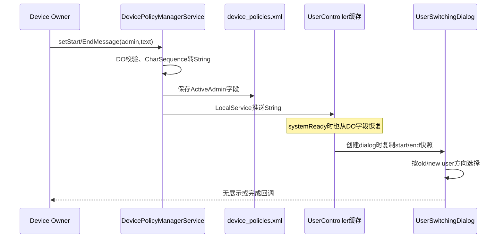
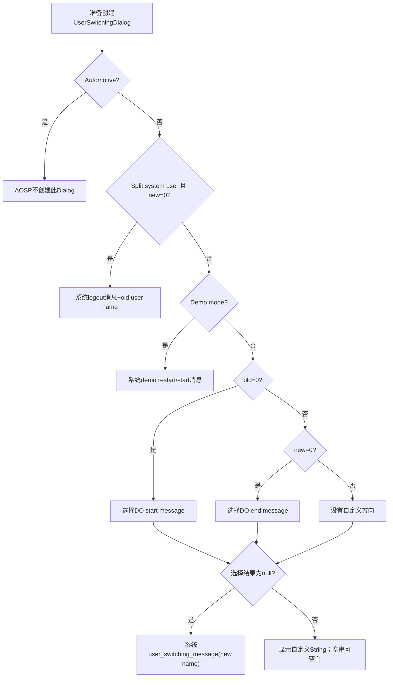
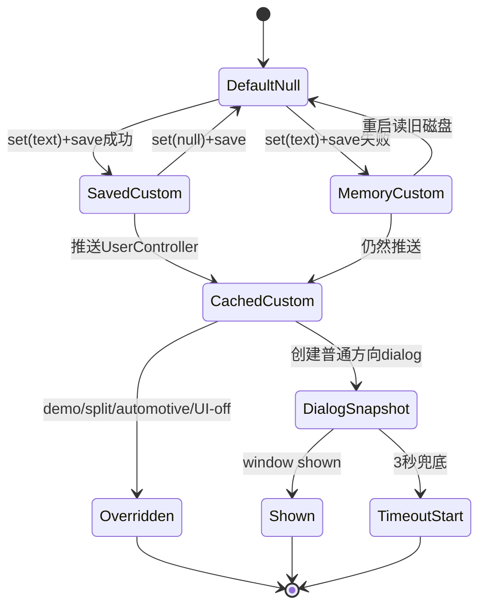

# 第 328 章 Android 企业用户会话开始/结束提示语：DO 持久化、UserController 缓存与切换对话框边界链

> 源码基线：Android 11 / API 30 / `android-11.0.0_r48`。本章只读分析本地源码；提示语只是切换界面文案，不是认证、确认或会话完成证明。

## 1. 两个 API 分别做什么

`setStartUserSessionMessage()` 配置从user 0进入次要用户时的文案；`setEndUserSessionMessage()` 配置从非0用户回到user 0时的文案。两者都可能出现在user switching dialog。

## 2. “may be displayed” 很重要

公共文档没有承诺每次切换都展示。是否出现还依赖UserController是否启用切换UI、产品是否Automotive、Demo/Split-system-user分支及切换方向。

## 3. 它们不执行用户切换

setter只更新DO ActiveAdmin和UserController内存缓存。真正switch仍来自SystemUI、DPC用户管理API或其他受权调用者。

## 4. 它们也不是toast

消费点是system_server创建的 `UserSwitchingDialog` TextView；没有通知channel、Toast队列或DPC Activity参与。

## 5. 主要源码

DPM契约和DPMS实现位于device policy文件；缓存位于 `UserController`；方向选择、默认fallback与3秒兜底位于 `UserSwitchingDialog.java`；布局是core res的 `user_switching_dialog.xml`。

## 6. 权限模型

四个set/get都通过 `USES_POLICY_DEVICE_OWNER` helper核验admin和calling UID。PO、组织所有PO、delegate及普通系统UI不能修改或读取DO的自定义字符串。

## 7. parent实例

客户端set/get都执行 `throwIfParentInstance`。这不是profile父侧政策，而是DO整机多用户会话UI配置。

## 8. Feature门

`mHasFeature=false` 时setter静默return、getter返回null。null在消费端代表使用system default，所以“无管理能力”和“DO主动清除自定义文案”最终显示可能相同。

## 9. null的公开语义

set参数允许null，表示恢复系统默认消息；空字符串不是null，会被当成自定义内容并让dialog文本为空。

## 10. 总体数据流



## 11. 为什么先转 String

服务把任意CharSequence用 `toString()` 冻结成String，避免调用进程的Spannable实现或后续可变内容进入system_server长期状态。样式span不会被保存。

## 12. admin null

服务端 `Objects.requireNonNull(admin)`；null不会触发自动选择DO。message本身可null，两个参数的可空语义必须分开。

## 13. 同值比较

DPMS用 `TextUtils.equals(旧String, 原CharSequence)`。内容相同就early return，不保存，也不再次推送UserController。

## 14. start字段

`ActiveAdmin.startUserSessionMessage` 默认null，true/false无关；非null时作为文本tag写入admin policy子树。

## 15. end字段

`endUserSessionMessage`结构对称，但消费方向不同。复制粘贴分析时不能把两个setter都画到同一个cache变量。

## 16. XML格式

writer用 `writeTextToXml` 写start/end tag内部文本，而不是value attribute。null时tag省略，空字符串是否形成空text要结合XML helper行为与回读验证。

## 17. Reader

遇到tag后再 `parser.next()`，只有TEXT才赋值；否则warning“Missing text”。因此空tag可能回读为null，而当前boot内存却是空String。

## 18. 空字符串边界

setter可把空String推给UserController，dialog只以null作为fallback条件，所以当前boot可能显示空白；重启后若XML没有TEXT则可能恢复null并显示默认。产品不应使用空串表达clear，应传null。

## 19. 保存与推送顺序

DPMS在锁内先改字段并 `saveSettingsLocked()`，退出锁后才调用ActivityManagerInternal setter。同步调用正常返回时，缓存已推送；但XML保存是否成功没有返回值。

## 20. I/O失败依旧推送

save失败会journal rollback，但外层仍无条件把新String推给UserController。因此当前boot UI使用新文案，重启后可能回旧文案；与上一章只依赖保存广播的消费方式不同。

## 21. 同值重试缺口

保存失败后ActiveAdmin内存已是新值，再set同值会early return，既不补写也不再推送。缓存已经新，但持久层无法用同值调用修复。

## 22. getter读什么

getter在DO权限检查后直接返回ActiveAdmin String，不询问UserController缓存或dialog。它证明DPMS内存期望值，不证明当前已显示。

## 23. 没有长度检查

尽管文档说短语句否则“may be truncated”，r48 setter、XML和UserController链没有显式最大长度或substring。不能编造一个源码不存在的字符上限。

## 24. “可能截断”来自哪里

产品窗口尺寸、TextView测量、字体和OEM实现可能裁剪或换行；AOSP布局TextView没有maxLines/ellipsize。静态源码能证明“无显式截断”，不能保证任意超长文本都完整可见。

## 25. Binder大小仍是上限

极长CharSequence仍受Binder transaction和内存资源约束，但这不是该API定义的业务长度。DPC应遵守短句契约，不用系统极限代替产品设计上限。

## 26. 本地化责任

文档明确要求DPC监听 `ACTION_LOCALE_CHANGED` 后重新set对应语言文本。DPMS不保存多语言map，也不会根据locale自动选版本。

## 27. locale变化竞态

系统语言变化到DPC收到广播并set之间，缓存仍是旧语言。默认系统文案可自动随Resources变化，自定义String则是设置时生成的固定文本。

## 28. 不要写入秘密

dialog在系统级切换画面显示，可能在锁屏/共享设备环境可见。文案应是组织提示，不应包含用户名、邮箱、工号、token或内部事件详情。

## 29. 无专用审计事件

两个setter没有DevicePolicyEventLogger调用。policy文件存当前值，但不保留历史版本、locale、操作者业务身份或展示次数。

## 30. save会发通用广播

成功保存仍走 `ACTION_DEVICE_POLICY_MANAGER_STATE_CHANGED`；但UserController不靠该广播更新，而是DPMS直接调用ActivityManagerInternal。广播消费者也拿不到字符串payload。

## 31. 为什么使用 LocalService

DPMS与AMS同在system_server，ActivityManagerInternal是进程内LocalServices接口，不经过应用Binder。它仍跨模块边界，但不是跨进程。

## 32. UserController加锁

两个setter在 `mLock` 下替换各自String；getter同锁读取。dialog创建时取得一致引用快照，String不可变避免后续内容突变。

## 33. systemReady恢复

DPMS初始化读取DO后，把start/end字段再次推到ActivityManagerInternal。这样system_server重启不要求DPC重新调用即可恢复缓存。

## 34. 无DO时缓存

初始化代码只在deviceOwner非null时推送；fresh system_server中的UserController字段默认null。全文件检索却只找到systemReady和两个setter的推送，`clearDeviceOwnerLocked`没有set null，所以同一boot清DO后旧缓存可能继续存在到重启或新DO覆盖。

## 35. ownership transfer

ActiveAdmin字段随DO transfer保留，新Owner getter能读到。UserController缓存本来已持该String，转移不需要重设才能继续显示，但新DPC应在locale/品牌策略中主动接管。

## 36. create dialog 时复制快照

UserController调用 `showUserSwitchingDialog(from,to,start,end)`，构造器保存final String。dialog创建后DO再改文案，不会修改已经展示的实例，只影响下一次切换。

## 37. user switch UI总门

`mUserSwitchUiEnabled=true`时才调用show dialog；false时直接投递START_USER_SWITCH_FG_MSG。后者完全没有TextView消费，自定义消息不会显示。

## 38. Automotive分支

Injector检测FEATURE_AUTOMOTIVE后不创建AOSP UserSwitchingDialog。汽车产品可能有自己的UX；本地这条Java链无法证明自定义消息在哪里显示。

## 39. dialog不可取消

`setCancelable(false)`。它是切换进度提示，不让用户用Back取消已接受的switch；文案也不是一个可交互审批选项。

## 40. dialog位于系统错误层

构造时aboveSystem=true，window使用TYPE_SYSTEM_ERROR及SHOW_FOR_ALL_USERS相关private flags，确保切换截图/过渡时可见。正因跨用户可见，更应避免敏感内容。

## 41. 无障碍标题

同一viewMessage既设置TextView文本，也设置accessibility pane title。屏幕阅读器可能朗读企业文案，DPC应使用清楚、可发音且不依赖纯视觉符号的短句。

## 42. 方向判断先看特殊模式

UserSwitchingDialog不是立刻按start/end选择；Split System User与Demo Mode优先覆盖自定义文案。只有进入普通else分支才看DO字符串。

## 43. Split System User退出

当设备是split-system-user且new user为USER_SYSTEM，dialog使用系统 `user_logging_out_message(oldUser.name)`，忽略自定义end消息。

## 44. Demo Mode

设备处于demo mode时，根据old user是否demo选择restart/start系统文案，start/end自定义字符串都不消费。

## 45. 普通start方向

old user id为USER_SYSTEM时选 `mSwitchingFromSystemUserMessage`。它表示“从系统用户进入别的会话”，因此API命名为start user session。

## 46. 普通end方向

new user id为USER_SYSTEM时选 `mSwitchingToSystemUserMessage`。这对应上一章logout返回user 0，表达结束旧次要用户会话。

## 47. 次要用户A到B

old!=0且new!=0时两个条件都不命中，viewMessage保持null，随后用系统默认 `user_switching_message(newUser.name)`。DO自定义文案不覆盖任意secondary-to-secondary切换。

## 48. null fallback

方向命中但对应自定义String为null，也使用system default并插入new user name。null不是“显示空白”，而是“交还系统”。

## 49. 空串不fallback

判断只写 `if (viewMessage == null)`，所以 `""` 会直接setText为空。这是null与empty必须严格区分的源码证据。

## 50. 消费决策图



## 51. 默认消息包含目标名

fallback通过format参数使用newUser.name。自定义消息不会自动附加用户名；若DPC自己拼接名字，会增加隐私暴露和本地化复杂度。

## 52. 3秒不是展示时长

WINDOW_SHOWN_TIMEOUT_MS=3000是等待onWindowShown的兜底；窗口一显示便调用startUser并dismiss，不会固定停留3秒给用户阅读。

## 53. onWindowShown路径

decor view注册listener，系统确认窗口shown后 `startUser()`。目标是先让用户看到切换反馈，再推进重操作和截图。

## 54. timeout路径

若屏幕开关竞态导致shown callback不来，handler 3秒后仍start user，避免切换永久卡住。文案可能根本没被用户看到。

## 55. 双触发去重

`mStartedUser` 在synchronized块内保证onWindowShown与timeout只启动一次，并移除listener/message。提示展示不是两次user start的来源。

## 56. 文案不会延长切换

没有“阅读完成”按钮或minimum display time。超长文案既可能布局不佳，也没有更多阅读时间，所以短句要求是实际UX约束。

## 57. show失败边界

若dialog无法正常shown，timeout仍尝试start；若构造/Window异常更早抛出，需由上层系统稳定性处理。API没有向DO报告此次是否显示。

## 58. setter返回的证据上限

正常返回只说明权限通过、内存赋值并尝试保存/推送。没有listener告诉DPC“下一次switch已展示”，更没有用户读过文案的证明。

## 59. getter的证据上限

getter返回String只说明ActiveAdmin内存值；可能因save失败与磁盘不同，也可能因special mode在dialog被覆盖，或因UI禁用完全不显示。

## 60. 到这里的核心心智模型

这是“DO期望字符串 → policy持久化 → UserController缓存 → 创建dialog时方向选择 → 可选展示”的链，而不是“DO发一条强制公告”。

## 61. start与登录认证无关

start message出现时目标user可能尚未start/unlock；它不收集凭据，也不改变Keyguard。后续认证仍由正常用户启动和锁屏链完成。

## 62. end与数据保存无关

end message可能在回user 0的switch dialog出现，但不会等待旧user应用flush或调用logout。停止用户的ordered broadcasts属于另一条生命周期链。

## 63. 与setLogoutEnabled组合

开启logout按钮可让用户触发返回user 0，end message可装饰该切换UI；两字段彼此独立。end非null不会自动开启logout，logout=true也不会自动生成组织文案。

## 64. 与DPM.switchUser组合

DO主动switch secondary user同样进入UserController；只要经过AOSP切换dialog且方向匹配，就可能消费字符串。它不是logout按钮专属。

## 65. 与系统UserSwitcher组合

用户从系统切换器选择账号也会走同一UserController前台switch主链，所以文案由方向而非发起组件决定。

## 66. 配置变化

String不随字体、屏幕旋转重新翻译；View重建仍使用dialog构造快照。系统默认Resources则可按当前configuration解析。

## 67. Unicode和换行

源码没有禁止换行、emoji或双向控制字符。DPC应规范化内容并防止控制字符制造视觉欺骗，尤其dialog处于可信system UI层。

## 68. 文案信任边界

虽然只有DO可写，DO应用也可能被错误配置或供应链攻击。SystemUI直接setText，不把文本解析为HTML，因此不会执行链接/脚本，但视觉社工仍可能发生。

## 69. TextView不是富文本

CharSequence先toString会丢span，XML回读也是String。不要依赖颜色、点击链接、图片span或粗体；多语言表达应靠纯文本。

## 70. XML转义

writeTextToXml/XML serializer会处理必要字符，DPC无需手工加入实体。手工把 `&` 写成 `&amp;` 可能导致用户看到实体文本。

## 71. 大文本存储成本

没有业务长度门意味着恶意或失误DO可膨胀policy XML、Binder和dialog布局成本。Owner本来是高权限信任主体，但产品仍应在DPC侧设置短上限。

## 72. 推荐产品上限

源码不提供数值，所以文档应写“由产品UX测试决定，例如一两行”，不要冒充Android强制常量。不同语言字形宽度也会改变可读长度。

## 73. 多语言数据模型

DPC可按locale资源id生成String，每次locale changed重新set；无需把所有语言拼进一个消息。若DPC进程没运行，旧语言会保留直到它恢复。

## 74. locale广播不保证即时

Receiver调度、后台限制和DPC服务状态会形成延迟。关键共享设备可在DPC启动、BOOT_COMPLETED和locale change三个时点幂等同步期望文案。

## 75. 同值locale更新

翻译结果内容恰好相同时early return是合理的；若save曾失败，同值early return仍暴露持久化缺口。管理端应在冷启动getter比对并保留恢复策略。

## 76. null清理后的缓存

set(null)在保存尝试后直接把UserController对应变量设null，下一次普通方向使用default。已经构造/显示的dialog仍持旧final快照。

## 77. 两个setter不是原子对

DPC先setStart再setEnd，中间可能发生user switch，看到新start+旧end。API没有一次Binder事务同时更新二者；需要业务上接受短窗口或在低流量时更新。

## 78. 两次保存也可部分持久

每个setter各自重写policy。第一条成功、第二条I/O失败会产生跨重启不对称；DPC应分别读回并做重启后验证。

## 79. 并发setter

DPMS锁串行字段和save，但锁外向UserController推送。两个线程可在各自退出锁后交错推送；因为start/end是独立变量通常无覆盖，针对同一字段的最后缓存顺序仍可能与锁内最终顺序竞态。

## 80. 一个微妙并发例子

线程A设start=A并退出锁，线程B设start=B保存并推B，随后A才推A；ActiveAdmin最终B，UserController缓存却可能A。源码没有revision校验，DPC应串行更新同一字段。

## 81. 重启可纠正缓存

systemReady会从最终持久ActiveAdmin重新推送，能修复上述内存交错；若最后保存失败，重启则恢复更旧磁盘值。它是恢复点，不是实时一致性保证。

## 82. getter也发现不了缓存竞态

getter只读ActiveAdmin，可能返回B而dialog缓存仍A。没有公开API读取UserController的实际message；真机只能通过受控切换或dumpsys/测试hook观察。

## 83. mLock不跨DPMS与UserController

两个模块各自有锁，且LocalService调用在DPMS锁外，避免锁序死锁；代价是没有跨模块原子提交。理解这种权衡比“加锁所以绝对一致”更准确。

## 84. Owner transfer期间

字段随ActiveAdmin迁移，旧缓存继续有效；若转移回滚也保持同一政策对象。新Owner重新set可覆盖，但应串行避免与transfer完成回调竞态。

## 85. clear Owner边界

字段从policy真值中消失，但r48 clearDeviceOwner路径没有清两个UserController变量。于是旧自定义提示可能在退管后的同一system_server生命周期继续显示；重启后fresh缓存为null。目标产品应验证并在后续版本补齐显式清理。

## 86. 默认消息的隐私

system fallback包含newUser.name。即使DO传null避免自定义PII，系统用户名称本身仍可能显示；共享设备应规范user display name。

## 87. accessibility隐私

Pane title可能被辅助服务接收/朗读。辅助服务权限模型降低风险但不等零风险，因此提示语不应放机密。

## 88. 截图与录屏

dialog是系统层并用于切换视觉反馈，是否进入截图/录屏取决于窗口策略；代码未设置FLAG_SECURE。不要把它作为只能本人看到的安全通道。

## 89. 失败分类

非DO/null admin同步异常；无feature静默无效；save失败不抛且缓存仍新；UI禁用/Automotive不显示；special mode覆盖；window timeout可能未真正可见。一个boolean“设置成功”无法覆盖这些层次。

## 90. 一致性状态图



## 91. 测试应拆四层

分别验证DPMS getter、policy XML重启恢复、UserController缓存推送、真实方向切换UI。只测setter/getter会漏掉大多数消费边界。

## 92. start方向用例

从user 0切到secondary，普通非Demo/非Automotive且UI enabled时应显示start；再用null验证default，用empty验证当前boot空白边界。

## 93. end方向用例

从secondary回user 0验证end；split system user产品预期被系统logout文案覆盖，不能把这当setter失效。

## 94. A到B用例

secondary A切B应走default，即便start/end都非null。该用例能防止产品文档错误宣称“所有用户切换都展示组织消息”。

## 95. Locale用例

先设置中文，切英文locale但不让DPC更新，观察旧String；再触发DPC set英文并切换，证明本地化责任位于管理端。

## 96. reboot用例

set两条、冷重启、再getter和切换，验证XML reader/systemReady repush。Mac只读阶段只能列方案，不能声称已完成设备验证。

## 97. I/O故障用例

userdebug可注入policy写失败，观察getter新、dialog缓存新、重启旧及同值重试early return。该测试风险高，应在隔离设备执行。

## 98. 并发用例

并发设置同一start字段A/B，检查ActiveAdmin与dialog是否可能分叉；生产DPC更好的做法是单线程策略队列，而非依赖竞态复现。

## 99. UI禁用用例

配置mUserSwitchUiEnabled=false后，确保切换仍发生但消息不显示。由此证明文案不是切换协议中的必需ACK。

## 100. Automotive用例

FEATURE_AUTOMOTIVE使AOSP injector不建dialog；应转查车载用户切换UX实现。不要把手机UserSwitchingDialog的布局结论复制给车机。

## 101. 源码最小骨架

```java
String value = message != null ? message.toString() : null;
deviceOwner.startUserSessionMessage = value;
saveSettingsLocked(callingUserId);
amInternal.setSwitchingFromSystemUserMessage(value);

if (oldUser.id == USER_SYSTEM) viewMessage = start;
else if (newUser.id == USER_SYSTEM) viewMessage = end;
if (viewMessage == null) viewMessage = systemDefault;
```

## 102. 常见误解一：系统自动翻译

错误。自定义String没有resource id/locale map，DPC必须监听locale并重设。

## 103. 常见误解二：超长一定在setter截断

错误。r48链未见显式截断；文档只警告可能因显示环境而截断。不要虚构MAX_LENGTH。

## 104. 常见误解三：空串等于清除

错误。null才fallback，empty可形成空白dialog且重启回读还可能不同。清除请传null。

## 105. 常见误解四：设置后所有切换都显示

错误。secondary-to-secondary、Demo、split-system-user退出、Automotive或UI disabled均可能不用自定义字符串。

## 106. 常见误解五：dialog确认了退出

错误。不可取消dialog只是进度反馈，onWindowShown甚至会立即继续start目标；它没有用户确认或完成回调。

## 107. 安全基线

短、无PII、无控制字符、纯文本、可被辅助技术理解，并明确它不是凭据输入提示。避免模仿系统认证话术诱导用户。

## 108. 可靠性基线

DPC串行设置两个字段，持久保存自己期望值，BOOT/locale时对账，接受短时混合版本，并在目标产品验证special modes。

## 109. 可观测性基线

记录set请求和getter，不记录敏感全文时可保存hash/版本；另以user lifecycle观测switch结果。没有“message shown”官方callback时不要伪造展示审计。

## 110. macOS只读结论上限

我们能证明Java控制流、字段和资源布局，不能证明特定OEM overlay、字体、屏幕尺寸、Automotive替代UI或真机用户是否看清。

## 111. 本章知识检查

回答：null和empty有何不同？start/end分别匹配什么方向？为什么save失败仍显示新文案？哪个并发顺序会让getter与dialog不同？3秒timeout到底保障什么？

## 112. macOS 只读练习一：追双字段持久化

搜索两个session message字段/tag/set/get，列出CharSequence转String、TextUtils.equals、XML TEXT与null省略；特别推演empty重启前后的差异。

## 113. macOS 只读练习二：追缓存推送

从DPMS setter和systemReady追ActivityManagerInternal到UserController，画出两个独立变量和锁；构造线程A/B锁外推送交错案例。

## 114. macOS 只读练习三：枚举文案选择

阅读UserSwitchingDialog.inflateContent，为普通0→10、10→0、10→11、split 10→0、Demo和Automotive分别填写custom/default/覆盖/不建dialog。

## 115. macOS 只读练习四：检查展示而非编译

核对dialog布局、onWindowShown和3秒timeout，记录无maxLines/ellipsize、无固定阅读时长、无展示callback；只做Mac静态分析，不执行AOSP编译。

## 116. 练习答案要点

null使用默认、empty可空白；0→次要用start、次要→0用end、次要间默认；save失败后锁外仍推缓存；同字段两线程可出现后保存B但后推A；3秒只防窗口shown回调缺失导致switch卡死。

## 117. 复读修正一：文档的truncated不是setter算法

全文复查没有找到长度常量或substring，AOSP TextView也无maxLines；准确说法是产品显示“可能”受布局截断，而非DPMS已按固定字符数裁剪。

## 118. 复读修正二：方向不是会话类型猜测

start/end严格用old/new是否USER_SYSTEM判断，A→B不使用任何自定义值；split和demo更在其前覆盖。用源码条件比自然语言“登录/退出”更不易误解。

## 119. 复读修正三：锁外推送有并发窗口

DPMS锁保证policy最终顺序，却不保证同字段LocalService推送顺序；串行DPC调用可避开ActiveAdmin=B、UserController=A的短暂分叉。

## 120. 本章结论与下一章

用户会话消息是DO持久字符串和UserController运行缓存共同驱动的可选切换UI：null/default、empty、方向、special mode、本地化、I/O与并发都影响最终可见文本。下一章进入 `setUserControlDisabledPackages`，研究用户强停/清数据保护名单、DeviceConfig默认项、PMS保护集合及Owner生命周期。
