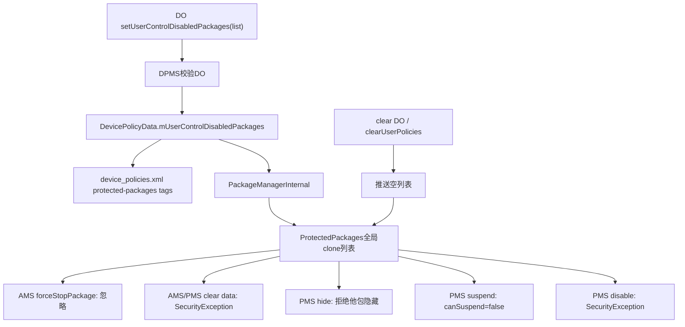
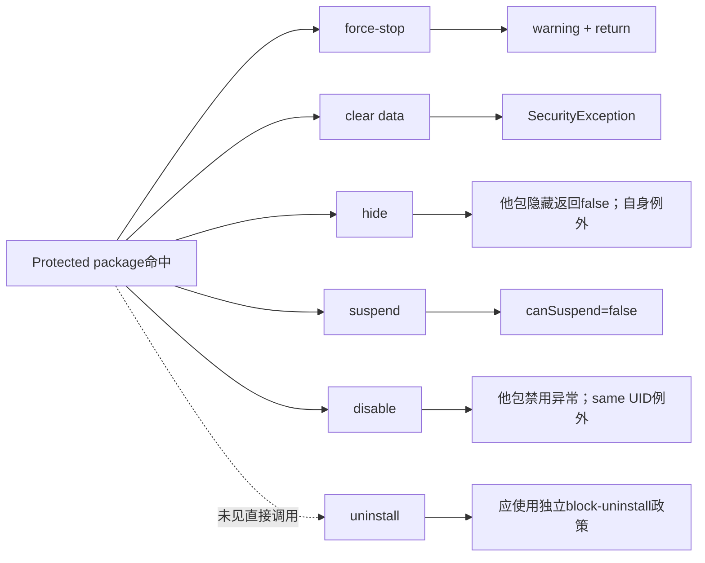
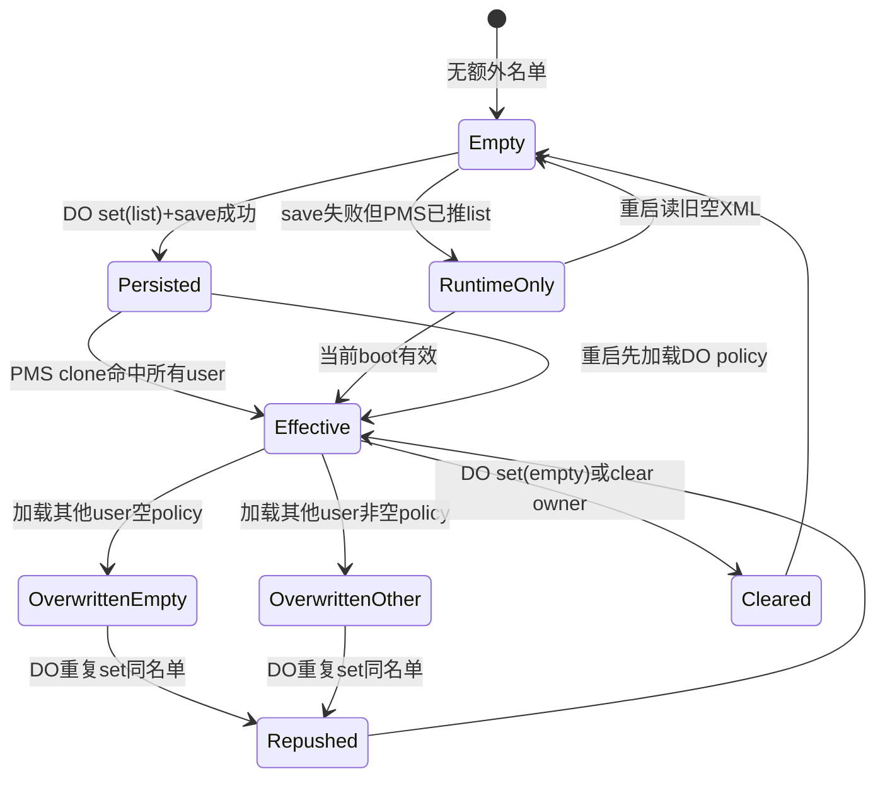

# 第 329 章 Android 企业 UserControlDisabledPackages：名单持久化、PMS 全局保护、强停/清数据与多用户覆盖边界链

> 源码基线：Android 11 / API 30 / `android-11.0.0_r48`。本章只读分析本地源码；“用户不可控制”是若干后端操作门的集合，不等于应用永不退出、永不卸载或数据绝对不可变。

## 1. 这个 API 的公开目标

`setUserControlDisabledPackages()` 让 Device Owner 指定一批包，用户不能在系统侧对它们执行清除应用数据或强行停止。常用于持续运行的企业代理、共享设备客户端和不能被用户重置状态的受管应用。

## 2. 为什么不叫 keepAlive

它没有启动进程、提升OOM优先级、建立前台服务或崩溃拉起。保护的是特定用户控制操作；应用仍可能自身退出、崩溃、被LMKD回收、随user stop结束或在升级时重启。

## 3. 为什么不叫 blockUninstall

阻止卸载已有独立 `setUninstallBlocked()` 状态和删除入口。r48的ProtectedPackages内部消费者主要是clear data、force-stop、hide、suspend和disable，不能把本名单直接等同卸载保护。

## 4. 与上一章的连接

上一章是UserController显示文案，本章进入PackageManager的保护集合。两者都由DO写，但一个影响可选UI，另一个在AMS/PMS执行入口真正阻断状态修改。

## 5. 主要源码位置

API在 `DevicePolicyManager.java`；名单、XML与推送在 `DevicePolicyManagerService.java`；运行时集合在 `ProtectedPackages.java`；消费者分布在AMS `forceStopPackage/clearApplicationUserData` 和PMS hide/suspend/component-state/clear-data路径。

## 6. 谁能设置

服务执行 `enforceDeviceOwner(who)`。PO、COPE PO、delegate、普通Device Admin与仅有MANAGE_DEVICE_ADMINS的应用都不能通过DPM接口写名单。

## 7. getter同样DO-only

`getUserControlDisabledPackages(admin)` 也验证Device Owner，不是给Settings或任意应用查询的公开聚合接口。系统UI若要判断底层保护，另有受MANAGE_DEVICE_ADMINS保护的PackageManager查询。

## 8. parent实例被拒绝

DPM客户端set/get都 `throwIfParentInstance`。名单由DO发布，既不是managed profile的local policy，也没有parent facade语义。

## 9. 没有 mHasFeature 早退

r48这两个服务实现没有显式 `if (!mHasFeature)`；真正能力由DO存在和角色校验决定。无Device Admin能力的设备通常无法建立DO，但控制流要按实际代码描述。

## 10. 控制面到执行面的总链



## 11. 参数 NonNull

客户端注解要求admin和packages非空；服务端分别 `Preconditions.checkNotNull`。null列表不能表示清除，清除必须传空list。

## 12. list元素没有校验

源码不验证包名格式、是否已安装、是否系统包，也不拒绝空字符串、重复项或null元素。DPC必须自行规范化，否则可能产生无效保护项甚至写XML运行时异常。

## 13. 可预埋不存在包

因为匹配只是字符串contains，不要求设置时安装，合法的未来包名可先进入名单；包之后安装便会命中执行门。这既可用于provisioning，也会让拼写错误静默无效。

## 14. 重复项

DPMS以List保存，XML逐项写，PMS也clone为List，查询用ArrayUtils.contains。重复不增加语义，只增加policy/event体积和线性搜索成本。

## 15. 顺序有无业务意义

保护判断仅contains，顺序不影响命中；getter却按保存顺序返回，DevicePolicyEvent也记录该顺序。DPC可排序以获得稳定审计和减少无意义重写。

## 16. setter没有相等判断

与logout/message setter不同，它不比较旧列表。即使内容相同也替换字段、保存XML、推PMS并写事件；可用于重新推送，但增加I/O。

## 17. DPMS是否防御性复制

`policy.mUserControlDisabledPackages = packages` 直接保存传入List引用。跨Binder正常调用时AIDL已经反序列化为system_server对象，客户端后续改原列表不会穿透；同进程测试/内部直调则可能观察别名风险。

## 18. PMS会再复制一次

`ProtectedPackages.setDeviceOwnerProtectedPackages` 创建 `new ArrayList<>(packageNames)`。因此DPMS字段后来被替换或修改，不会自动改变PMS集合，必须再次调用update。

## 19. getter返回引用的边界

DPMS实现返回内部List；跨Binder会序列化成调用端副本，所以普通DPC修改getter结果不会改变服务。单元测试直连service时则不应把这种Binder隔离当成Java方法本身的防御性复制。

## 20. 名单存在哪里

字段属于 `DevicePolicyData`，不是ActiveAdmin。合法DO通常位于user 0，因此写入该用户policy文件的顶层 `policies` 区域，而非某个admin子树。

## 21. XML标签

writer为每个元素输出 `protected-packages name="<package>"`。空列表不输出tag；reader启动前先clear list，再按遇到顺序add属性。

## 22. null元素的写盘风险

XmlSerializer.attribute通常不接受null value，而save catch只覆盖XmlPullParserException/IOException。名单已先放进内存，null元素可能导致未被该catch兜住的运行时异常，并阻止后续PMS推送。

## 23. 空字符串

空String能写为name=""并进入PMS，但正常包名不会等于它，所以不产生保护。它仍会出现在getter、XML和审计事件中。

## 24. save与push顺序

`setUserControlDisabledPackagesLocked` 先替换内存list，调用 `saveSettingsLocked`，然后无条件 `updateUserControlDisabledPackagesLocked(packages)`。save捕获I/O失败后方法继续，PMS当前boot仍得到新名单。

## 25. I/O失败半状态

policy文件journal回滚但DPMS内存/PMS集合已新，setter仍写DevicePolicyEvent。重启后从旧XML恢复；没有持久化成功位暴露给DPC。

## 26. 同值重试与上一章不同

本setter没有early return，所以相同名单可再次触发save和PMS推送。这使短暂I/O故障恢复更容易，但DPC仍应退避，避免无上限重写。

## 27. 通用变化广播

save成功会发送registered-only的DPM state changed到user 0；save失败则不发。PMS保护生效不依赖该广播，因为DPMS直接通过LocalService推送。

## 28. DevicePolicyEvent

`SET_USER_CONTROL_DISABLED_PACKAGES` 记录admin和整个字符串数组。它是调用审计，不含save成功、PMS ACK、包安装状态或具体阻断次数。

## 29. 包名列表的隐私

名单可能暴露企业安全代理、监控或专有应用inventory。审计管道应做访问控制和留存限制，避免把完整包清单随意上传到低权限日志。

## 30. PackageManagerInternal 边界

DPMS调用进程内 `setDeviceOwnerProtectedPackages(packages)`，没有Binder RemoteException或异步callback。调用返回时PMS内存list已clone，但磁盘policy持久化仍可能不同。

## 31. ProtectedPackages 的三类来源

它同时认该user的DO/PO包、资源配置的Device Provisioning包，以及本API提供的DO protected list。前两类不来自本名单，不能在DPC传空list后断言系统没有任何protected package。

## 32. DO/PO保护是per-user

`hasDeviceOwnerOrProfileOwner(userId,pkg)` 要求Owner所在user匹配。一个PO包只在其profile命中Owner保护，不自动保护同包在别的user实例。

## 33. provisioning与DO名单是全局包名

`isProtectedPackage(packageName)` 不接userId，设备Provisioning包和DO额外list对所有用户按包名命中。API文档说“apps”，实现影响范围实际跨user。

## 34. 为什么全局范围容易误解

名单存于DO的user policy，看起来像user 0局部；推入PMS后却进入单个全局List，`isPackageStateProtected(userId,pkg)` 对这部分忽略userId。存储位置不等于执行作用域。

## 35. 不存在 DeviceConfig 合并

本地r48全树检索没有发现DeviceConfig默认名单或union逻辑。产品若另有vendor默认保护属于树外扩展；本章不能把它写成AOSP事实。

## 36. protected data与state

ProtectedPackages公开两个判断：data protected和state protected；r48两者实现完全相同，都是Owner/provisioning/额外list的OR。拆成两个方法是为消费者表达语义，并不代表当前集合不同。

## 37. 注释的“package owner例外”

类注释称除package owner自身外，system/privileged不能改其data/state；但helper本身不知道caller，是否例外由各消费者决定。不能把注释当成所有入口统一行为。

## 38. force-stop没有自身例外

AMS先检查state protected，命中便warning并return，不比较callingUid是否目标包。用户/Settings/system调用都无法通过这条 `forceStopPackage` 执行。

## 39. clear data也没有自身例外

AMS在“是否清自己的UID”权限判断之前先检查data protected并抛SecurityException。因此名单中的应用调用公开self-clear也会被保护门挡住。

## 40. 用户UI可能仍可点击

Settings r48的AppStorage/AppButtons主要依据DISALLOW_APPS_CONTROL和active admin等条件，全文检索未见它查询isPackageStateProtected来统一隐藏按钮。后端仍是权威门；产品UI可能显示操作后失败或无效果。

## 41. force-stop失败形式

AMS对protected包只是记录“Ignoring request”并return；`ActivityManager.forceStopPackage()` 为void，Settings点击侧得不到false。表面操作结束但进程可能继续运行。

## 42. clear-data失败形式

AMS/PMS对protected data抛SecurityException。DPM上一章的Owner清数据API会把该异常转observer false；Settings直接走ActivityManager隐藏API时未见统一catch，产品体验需真机验证。

## 43. hide保护

PMS设置hidden=true时，若caller不是目标app自身且包受保护，返回false并不隐藏。目标包自身可隐藏自己，这是消费者实现的caller例外。

## 44. unhide是否被阻止

protected检查只在 `hidden && ...` 时执行。把已隐藏包恢复可见不会因保护名单被拒，符合保护“避免用户使其不可用”而非阻止恢复的方向。

## 45. suspend保护

`canSuspendPackageForUser` 将protected包标为不可暂停，与active admin、launcher、installer、verifier、dialer等独立门并列。批量suspend可能出现部分包成功、protected项失败。

## 46. 谁调用suspend也重要

这段protected判断没有“目标包自身”例外；但更外层caller权限/Owner规则仍决定谁能提出暂停。名单不是授予suspend能力，只是否决目标。

## 47. disable保护

PMS修改package/component enabled state时，若caller不是同app且目标protected，抛SecurityException。它可阻止Settings/shell/特权工具将包禁用。

## 48. 同app disable例外

enabled-state路径先判断 `!isSameApp(callingUid,appId)`，protected门位于其中；同UID应用可能改变自身状态。shared UID也会让“same app”边界扩大到伙伴包。

## 49. uninstall没有本类直接消费者

全树Java搜索未见删除包主链调用 `isPackageStateProtected`；不能仅凭protected命名宣称本名单阻止卸载。DO若需要该效果应显式使用setUninstallBlocked并验证Uninstaller。

## 50. 五类操作对照



## 51. 不能阻止普通进程死亡

LMKD、崩溃、ANR终止、系统升级和电源重启不经过用户force-stop API的protected判断。名单保证的是入口门，不是进程连续性SLA。

## 52. 不能阻止 user stop

上一章logout会强停整个user并锁CE；UserController不会逐包咨询ProtectedPackages。名单中的应用也随其user停止。

## 53. 不能阻止应用自清业务状态

后端只挡系统clearApplicationUserData；应用仍可删除自己的文件、退出账号或覆盖数据库。若恶意/损坏应用主动破坏状态，名单无能为力。

## 54. 不能保护服务器数据

它不控制云端删除、token撤销或后台配置。企业合规要分清本地package状态与服务端生命周期。

## 55. 不能阻止代码更新

包升级/替换不是这些consumer之一。更新可杀进程、迁移数据并改变行为；应另用managed update、签名和版本策略。

## 56. 不能自动拉起

protected进程被系统回收后，需要正常组件、Job、Alarm、Boot或DPC机制重新启动。API没有watchdog callback。

## 57. 和DISALLOW_APPS_CONTROL的粒度

UserRestriction `DISALLOW_APPS_CONTROL` 面向该user的应用控制UI/操作整体，本API按包名列举且通过PMS全局集合实现。前者粗粒度，后者细粒度但具有跨user实现特征。

## 58. 和active admin保护

即使名单为空，active device admin本身在hide/suspend等路径还有专门检查，DO/PO包又由ProtectedPackages自动保护。本API主要扩展到普通企业应用。

## 59. 和Device Provisioning包

资源 `config_deviceProvisioningPackage` 总是进入isProtectedPackage判断，不需要DO列出。AOSP默认/产品overlay决定具体包名。

## 60. 和block uninstall

block-uninstall是PMS per-user PackageSetting boolean，允许DO/PO分别控制；user-control-disabled list在PMS是全局包名。两者存储模型和作用域不同，常需组合。

## 61. 和keep uninstalled packages

`setKeepUninstalledPackages` 只保留卸载包的代码/metadata以便重装，不阻止用户强停或清数据。本名单也不等同“保留卸载后包”。

## 62. 和lock task

Lock Task allowlist决定哪些任务可在Kiosk中运行；protected list决定包状态操作。一个包可在两表之一、两者或都不在，不能相互推导。

## 63. 和清应用数据DPM API

DO自己调用 `clearApplicationUserData` 清名单包时也会被下游ProtectedPackages挡住并收到false。DO若确需重置，应先从名单移除、等待推送完成、再清理，最后按需要加回。

## 64. 临时移除不是事务

remove → clear → re-add是三次独立操作；中间窗口用户/其他系统组件可force-stop或disable该包，任一步I/O失败也会造成重启差异。管理端应维护状态机和恢复记录。

## 65. 空列表立即运行态清除

setter传empty，DPMS保存无tag并同步PMS clone空list。额外名单保护立即消失，但Owner和Provisioning包的内建保护仍在。

## 66. clear Device Owner

`clearUserPoliciesLocked` 清list并调用update，随后保存。退管当前boot会把PMS额外保护集合设空，不像上一章会话文案缓存那样漏清。

## 67. Owner transfer

名单不在ActiveAdmin，而在DevicePolicyData，所以DO component转移不会移除它。新DO通过自己的admin getter继续读取，PMS集合也不变。

## 68. 删除单个active admin

由于字段是user-level policy而非admin字段，普通admin删除不应改变；只有DO政策清理路径或DO setter改变它。这个存储选择反映“唯一DO全局名单”语义。

## 69. 启动加载

`loadSettingsLocked(policy,userHandle)` 读XML后无条件调用 `updateUserControlDisabledPackagesLocked(policy.list)`。这让system_server重启可恢复PMS内存集合，无需等待DPC进程启动。

## 70. 这里出现多用户覆盖问题

PMS只有一份全局额外list，但DPMS每个user都有一份DevicePolicyData，且每次load都无条件推送。加载非DO user的默认空list会覆盖先前从user 0恢复的真实DO名单。

## 71. 为什么不是理论上的union

源码没有判断 `isDeviceOwnerUserId(userHandle)`，也没有把各user list做union；ProtectedPackages setter直接替换clone。最后一次load哪个user，PMS就采用哪个list。

## 72. 常见启动顺序风险

systemReady先显式get user 0可恢复名单，但之后启动/首次访问其他user policy时，lazy `getUserData` 可能load其空文件并推空。user 0对象已缓存，不会自动再load补回。

## 73. 这是r48源码结论

本章只对 `android-11.0.0_r48` 本地树负责。后续Android可能修复为只由DO user推送；产品分支也可能已有补丁，必须对目标build重新检索。

## 74. 如何修复更合理

平台可只在加载DO user policy时调用update，或把名单移入Owners全局文件；若支持多来源则明确union与来源化撤销。简单依赖“user 0总是最后加载”不是可靠不变量。

## 75. DPC能否发现覆盖

DO getter仍读DPMS user 0 list，可能显示正确，而PMS实际全局list已被其他user空list覆盖。set同一名单没有early return，可重新推送，但DPC没有PMS实际集合的公开对账API。

## 76. 系统查询接口

PackageManager的 `isPackageStateProtected(pkg,userId)` 需要system/root或MANAGE_DEVICE_ADMINS，并做跨user权限检查。受权测试组件可用它验证执行面，普通DPC未必可直接获得。

## 77. dump证据

DPMS dumpsys打印每个policy的 `mUserControlDisabledPackages`；还应检查PMS/实际操作结果，因为DPMS正确不证明最后推入全局ProtectedPackages的集合正确。

## 78. 真机最小验证

在user 0设置包A、确认force-stop被忽略；启动secondary user触发其policy load，再重复force-stop。若第二次生效，便复现全局覆盖，而不是包自身行为变化。

## 79. Mac阶段能做什么

可静态证明unconditional load push、单全局list与replace clone三点形成风险；不能声称具体产品启动顺序必然触发或某厂商已修复。

## 80. 安全影响

覆盖后用户可能force-stop/clear/disable本应受保护的企业代理，而DO getter仍返回名单，形成控制面“配置正常”、执行面失守。安全监控必须验证效果而非只读策略。

## 81. 多用户覆盖也可能反向扩大保护

若非DO用户policy因旧版本、测试或损坏包含额外tag，它最后加载时也能把自己的list推成全局集合，导致所有user出现意外protected包。问题不只是清空，也可能错误扩权。

## 82. XML污染如何进入

公开setter不能由非DO调用，但policy文件迁移、历史版本、root修改或测试fixture仍可让其他user有tag。reader不会验证该user是否DO便接受并推送。

## 83. 解析失败的影响

load开始先clear list，若中途XML异常，catch后仍执行结尾的update。于是一个解析失败的user也可能把已恢复的全局list替换为空或部分解析结果。

## 84. 这不是AtomicFile能解决的

JournaledFile可减少半写文件，却不能修复“每user数据写入单全局消费者”的建模错误。即使每份XML都完全正确，加载顺序仍可能覆盖。

## 85. 并发set与load

DPMS多数路径在同一getLockObject下串行，避免字段同时改；但最后哪个user触发update仍决定PMS list。锁只保证时序确定，不保证语义来源正确。

## 86. PMS内部线程安全

ProtectedPackages setter和查询都使用synchronized或调用同步helper，clone替换是原子的。消费者不会看到半个List，但可能看到完整却来自错误user的List。

## 87. contains复杂度

ArrayUtils.contains对List线性搜索；每次force-stop/clear/hide等都可能扫描。名单通常很短，API却无上限，恶意DO可制造额外system_server CPU与XML负担。

## 88. 推荐DPC输入规则

仅允许合法Java包名、去重、排序、限制条目数和总字符数，拒绝null/empty，记录期望版本。平台不替你做这些数据卫生。

## 89. 推荐执行面探针

选择一个无敏感数据的测试包，周期性验证force-stop被忽略或受权查询isPackageStateProtected；不要用生产代理本身做破坏性clear-data探测。

## 90. 策略状态机



## 91. 回调与确认

setter是void、PMS LocalService也是void，没有“所有消费者已采用”的ACK。同步返回可说明直接clone调用没有抛异常，但无法覆盖随后其他user load覆盖。

## 92. 事件也无法证明执行面

DevicePolicyEvent记录set时list；覆盖来自policy lazy load，不会生成新的SET事件。因此审计可能显示最后一次DO配置正确，却没有记录实际集合被空list替换。

## 93. 广播也无法证明执行面

DPM state changed只反映policy保存，并不携带list或PMS revision。其他user load触发update时不一定产生对应变化广播。

## 94. 跨重启验证

至少在system_server重启、secondary user启动/解锁和DO policy重载后重复验证保护。只在provisioning刚结束测一次无法覆盖生命周期风险。

## 95. 包升级后验证

包名不变时list仍命中，不依赖versionCode或签名；这意味着被错误替换为同包名但合法签名检查失守的场景不由本名单解决，安装签名链必须另行保证。

## 96. shared UID边界

protected匹配包名，但force-stop最终按目标uid清进程；若包与伙伴共享UID/进程，阻止该包force-stop可保护整组，反之通过伙伴包入口可能产生复杂副作用。sharedUserId产品需单独测试。

## 97. 多进程应用

force-stop会处理包/UID关联进程，不只主进程；protected门在动作前return。名单不是逐进程白名单，不能只保护某个关键service进程。

## 98. isolated进程

应用派生isolated UID的生命周期由AMS关联记录管理。protected判断按请求包阻止标准force-stop入口，但其他系统回收仍可结束isolated进程。

## 99. package visibility

clear-data PMS路径会先计算filterApp，system/Settings通常可见；protected检查与visibility顺序可影响错误形式。名单本身不是让普通调用者发现隐藏包的查询渠道。

## 100. Instant App

ProtectedPackages按字符串也能包含Instant包名，但Instant metadata、可见性和生命周期有额外分支。企业持续代理一般不应依赖Instant形态承载该政策。

## 101. user 0并非调用参数

公开setter无userId，服务取calling user。DO通常user 0；真正全user效果来自PMS实现，不是DPC显式传USER_ALL。

## 102. 未来版本兼容

若后续版本把list改为per-user，依赖r48“自动全局保护所有user”的DPC可能出现行为变化。管理策略应以SDK文档和目标版本验证为准，不依赖未承诺的内部跨user副作用。

## 103. 最小源码骨架

```java
policy.mUserControlDisabledPackages = packages;
saveSettingsLocked(userId);
pmInternal.setDeviceOwnerProtectedPackages(packages);

boolean isProtectedPackage(String pkg) {
    return pkg.equals(mDeviceProvisioningPackage)
            || mDeviceOwnerProtectedPackages.contains(pkg);
}
```

## 104. 常见误解一：名单让应用常驻

错误。它只否决若干用户控制入口，不参与OOM、进程调度或崩溃恢复。

## 105. 常见误解二：只影响DO所在user

错误。额外list进入PMS单全局集合，包名部分不检查userId，r48会影响所有user。

## 106. 常见误解三：自动阻止卸载

错误。本地Java消费者未见卸载主链查询；应使用独立block-uninstall政策。

## 107. 常见误解四：getter正确等于保护有效

错误。非DO user policy load可能覆盖PMS全局集合，而DO getter仍读自己的正确list。

## 108. 常见误解五：所有操作都允许包自身绕过

错误。hide/disable消费者有caller例外，force-stop和clear-data没有统一self exception。要逐入口阅读。

## 109. 安全基线

名单输入做严格校验，配合uninstall block、签名/更新策略和进程健康监控，并在多用户生命周期后验证执行面。

## 110. 可恢复性基线

DPC保存期望list，允许幂等重推；若探针发现失效，重新set并上报告警。平台层应修正load来源，而非长期依赖DPC轮询补洞。

## 111. 本章知识检查

回答：为什么名单存user 0却全user生效？哪五类操作直接消费？为什么不保证卸载？save失败后当前boot怎样？非DO user load为何能让getter与实际保护分叉？

## 112. macOS 只读练习一：追设置与XML

搜索set/get、TAG_PROTECTED_PACKAGES和DevicePolicyData字段，列出null list、empty、重复、null元素、save失败与同值重推的结果；无需编译。

## 113. macOS 只读练习二：制作消费者矩阵

逐个阅读AMS force-stop/clear-data与PMS hide/suspend/disable，记录命中后的返回/异常及self例外；另用全树搜索证明未见uninstall直接消费者。

## 114. macOS 只读练习三：证明全局作用域

从PackageManagerInternal setter追到ProtectedPackages单List和isProtectedPackage，说明userId只参与Owner包判断、不参与额外名单判断。

## 115. macOS 只读练习四：复现多用户覆盖推演

按loadSettings结尾的无条件update、getUserData lazy load和setter replace clone，纸面推演user0 list A→user10空list→DO getter仍A的三步状态；Mac阶段不做真机破坏测试。

## 116. 练习答案要点

empty才是清除；额外list按包名全局；force-stop warning return、clear-data异常、hide他包返回false、suspend不可选、disable他包异常；卸载需独立政策；任意user load都replace同一PMS list，造成控制面/执行面分叉。

## 117. 复读修正一：没有DeviceConfig默认合并

初始计划提到DeviceConfig，但r48全树证据只显示DO list直接替换ProtectedPackages。正文已删除无源码依据的默认项，不把产品扩展冒充AOSP。

## 118. 复读修正二：protected不等uninstall-protected

类名很宽，但消费者搜索范围明确；本章只声称已找到的五类状态/数据操作。卸载结论必须落到setUninstallBlocked链。

## 119. 复读修正三：最大的风险在加载来源

最易忽略的不是setter，而是每user load都无条件推一个本应DO-only的全局list。锁、clone和Atomic journal都不能修复来源建模错误。

## 120. 本章结论与下一章

`setUserControlDisabledPackages` 把DO名单持久到user policy并同步成PMS全局包名保护，阻断force-stop、clear-data及若干state修改，但不提供常驻或卸载保证。r48还存在非DO user加载覆盖全局集合的显著边界。下一章进入secondary lockscreen与KEYGUARD_SERVICE_PROVIDER，追DO启用、服务解析、每用户绑定、Surface/Keyguard接管及失败回退。
