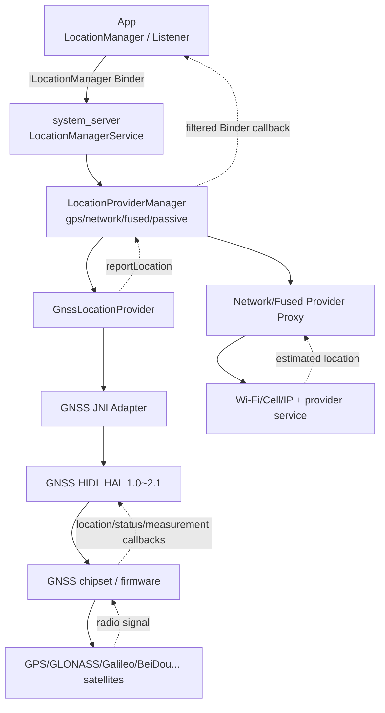
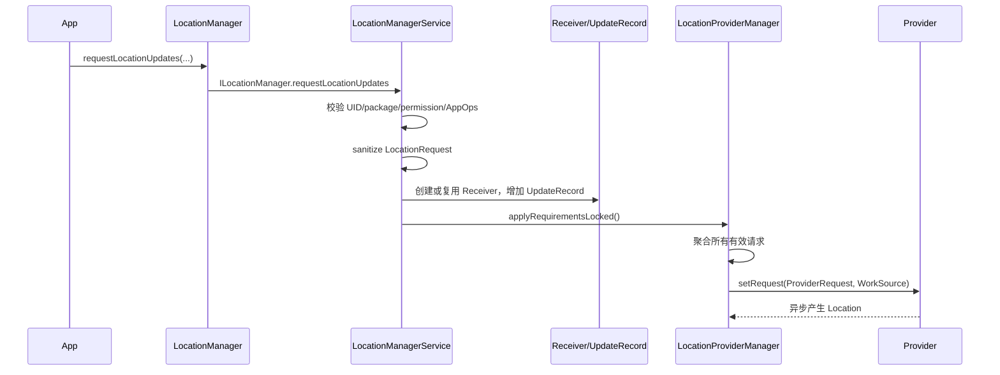
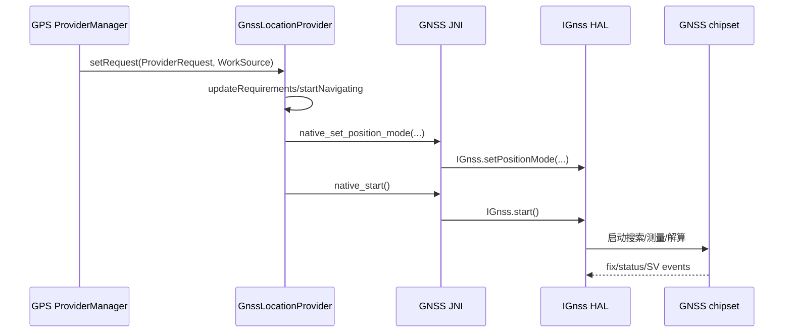
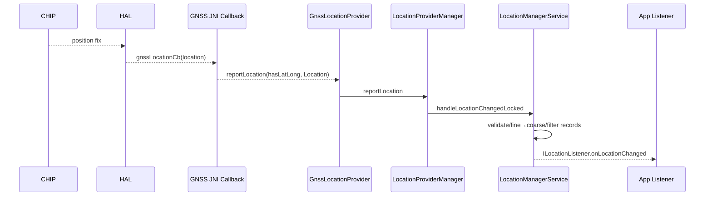

# 33 Android 定位系统、LocationManagerService 与 GNSS

> 源码版本：Android 11 / API 30 / `android-11.0.0_r48`  
> 学习方式：macOS 只读源码，不要求编译  
> 前置章节：[06 SystemServer 与系统服务](./06-SystemServer与系统服务.md)、[23 权限、AppOps 与 SELinux](./23-Android权限AppOps与SELinux.md)、[32 传感器系统](./32-Android传感器系统SensorService与SensorHAL.md)

定位系统最容易被一句“GPS 获取经纬度”带偏。Android 中，App 提交的是一个带精度、周期、距离、次数和过期条件的位置请求；`LocationManagerService` 要进行权限和后台策略裁决，再把多个请求聚合到不同 Provider。GNSS 只是 Provider 之一，网络定位、被动定位、融合定位和测试 Provider 都有不同来源。

本章围绕六条主线：

1. App 的请求怎样进入 LocationManagerService？
2. 多个 App 的请求怎样合并成 Provider 的工作要求？
3. GNSS 怎样从卫星信号生成 Location 并回调 Framework？
4. Fine/Coarse、AppOps、前后台和总开关怎样影响分发？
5. Network、GPS、Passive、Fused Provider 到底是什么？
6. Location、GNSS status、raw measurements、geofence 为什么是不同数据流？

---

## 1. 总体架构



先固定两条独立方向：

```text
请求向下：App → LMS → Provider → HAL/实现
结果向上：HAL/实现 → Provider → LMS → 合法客户端
```

两条方向由异步回调连接，不是一条同步函数栈。

---

## 2. 关键进程

| 组件 | 常见进程 | 职责 |
|---|---|---|
| App `LocationManager` | App 进程 | 发请求、持 listener/PendingIntent、收结果 |
| `LocationManagerService` | `system_server` | 权限、记录请求、Provider 管理、分发 |
| `GnssLocationProvider` | `system_server` | GNSS 状态机、辅助数据、HAL 适配 |
| Network/Fused Provider | 被绑定的系统组件进程 | Wi-Fi/蜂窝/融合算法，具体实现可替换 |
| GNSS HAL | vendor HAL 进程 | Framework 与芯片实现边界 |
| GNSS firmware/chip | 专用硬件 | 射频、测量、导航解算或辅助处理 |

AOSP 中能看到 Framework 和默认/示例 HAL，不代表商业设备的定位算法、基站数据库和芯片固件全部开源。

---

## 3. Android 11 的源码入口

```text
frameworks/base/location/java/android/location/LocationManager.java
frameworks/base/location/java/android/location/LocationRequest.java
frameworks/base/location/java/android/location/Location.java
frameworks/base/location/java/android/location/ILocationManager.aidl
frameworks/base/location/java/android/location/ILocationListener.aidl

frameworks/base/services/core/java/com/android/server/location/LocationManagerService.java
frameworks/base/services/core/java/com/android/server/location/LocationProviderProxy.java
frameworks/base/services/core/java/com/android/server/location/MockableLocationProvider.java

frameworks/base/services/core/java/com/android/server/location/gnss/GnssLocationProvider.java
frameworks/base/services/core/java/com/android/server/location/gnss/GnssManagerService.java
frameworks/base/services/core/java/com/android/server/location/gnss/GnssMeasurementsProvider.java
frameworks/base/services/core/jni/com_android_server_location_GnssLocationProvider.cpp

hardware/interfaces/gnss/1.0/IGnss.hal
hardware/interfaces/gnss/2.0/IGnss.hal
hardware/interfaces/gnss/2.1/IGnss.hal
```

Android 11 的 `LocationProviderManager` 是 `LocationManagerService` 的内部类，不要照搬新版本独立文件路径。

---

## 4. LocationManagerService 怎样启动

`SystemServer` 创建 `LocationManagerService`，把 Binder 服务发布为 `Context.LOCATION_SERVICE`，并在 boot phases 中完成 system running、用户设置、Provider 初始化等工作。

`LocationManagerService` 是统一入口，负责：

- Provider 注册和状态。
- listener/PendingIntent 接收者。
- 请求记录与聚合。
- 权限、AppOps、用户、后台限制。
- coarse location 模糊化。
- mock location。
- geofence、GNSS API 转发。
- settings 变化与 provider 启停。

它不是亲自计算每个经纬度的算法模块。

---

## 5. Provider 是策略和数据源抽象

传统 Provider 名称：

```text
gps
network
passive
fused
```

它们不是四颗硬件：

- GPS provider：GNSS 卫星定位路径。
- Network provider：利用 Wi-Fi、蜂窝等估算，常由可替换系统 Provider 实现。
- Passive provider：自己不主动启动定位，只“旁听”其他 Provider 已产生的位置。
- Fused provider：融合多个来源，具体实现可由系统组件提供。

Provider 名称、能力和实际算法实现必须分开理解。

---

## 6. GPS 为什么更准确但更慢更耗电

GNSS 接收极弱的卫星信号，需要搜索卫星、同步码相位、解导航电文或取得辅助数据，并完成位置解算。室内遮挡、多径、天线和冷启动都会影响结果。

Network provider 可以借助附近 Wi-Fi/基站迅速估计，通常首定位更快、功耗更低，但精度和数据库依赖更明显。

这只是典型特征，不能保证每次 GPS 都比 network 准，也不能用 provider 名字替代 `Location.getAccuracy()` 判断。

---

## 7. Fused 的边界

AOSP 有：

```text
frameworks/base/packages/FusedLocation/src/com/android/location/fused/FusedLocationProvider.java
frameworks/base/packages/FusedLocation/src/com/android/location/fused/FusedLocationService.java
```

这是平台基础 fused 实现。商业设备还可能配置另一套系统级 network/fused provider。Google Play services 的 Fused Location Provider API 也不是 `LocationManagerService` 本身。

读 bug 时先确认 App 调的是 `android.location.LocationManager`，还是其他 SDK 的 fused API；两者入口和策略不完全相同。

---

## 8. Location 对象包含什么

常用字段：

- provider。
- latitude、longitude。
- altitude。
- speed、bearing。
- accuracy；还可有 vertical/speed/bearing accuracy。
- wall-clock `time`。
- monotonic `elapsedRealtimeNanos`。
- extras、mock 标记等。

字段是否存在要用 `hasAltitude()`、`hasSpeed()` 等判断。0 可能是真实值，不能把 0 一律当“缺失”。

---

## 9. Accuracy 是半径，不是误差承诺

水平 `accuracy` 表示以报告经纬度为圆心的估计水平不确定度半径，单位米；Android API 的定义采用约 68% 置信水平。

```text
accuracy=10m
```

不是“真实位置一定在 10 米内”的最大误差保证，也不是经纬度小数点精度。若误差模型近似合理，很多样本应落在该半径内，但仍允许相当比例位于半径外；城市峡谷多径还可能让模型过度乐观。

业务应结合新鲜度、速度合理性、Provider 和连续轨迹，而非只判断 accuracy 一个字段。

---

## 10. 两套时间字段

```text
Location.getTime()                → Unix wall clock，毫秒
Location.getElapsedRealtimeNanos()→ 自启动以来 monotonic，纳秒
```

判断位置年龄优先使用 elapsed realtime，同一时间轴不受用户改时间/NTP 校时影响：

```text
ageNs = SystemClock.elapsedRealtimeNanos()
      - location.getElapsedRealtimeNanos()
```

不要用 `currentTimeMillis - elapsedRealtimeNanos`，它们单位和 epoch 都不同。

---

## 11. LocationRequest 描述什么

Android 11 `LocationRequest` 包含或表达：

- provider/quality。
- interval。
- fastest interval。
- smallest displacement。
- number of updates。
- expiration time。
- low power mode、location settings ignored 等系统属性。

它是请求偏好，不是硬件 SLA。系统会依据权限、后台状态、其他客户端和 Provider 能力净化/限制。

---

## 12. interval 与 fastestInterval

`interval` 表示期望的常规更新周期；`fastestInterval` 表示即使其他客户端让 Provider 更快地产生位置，本客户端也不希望比此更快接收。

例如：

```text
App A 请求 interval=10s
App B 请求 interval=1s
```

Provider 可能因 B 每秒工作，但 A 是否每秒收到，取决于 A 的 fastest interval 和分发节流规则。

`interval=1s` 也不保证每秒必有 fix；无卫星、室内、系统限制都可能中断。

---

## 13. minDistance

`smallestDisplacement`/minDistance 表示相对上次交付位置至少移动多少米才再次交付。

它通常与时间条件共同使用，不等于让 GNSS 芯片只在移动足够远后才采样。Framework/Provider 可先产出位置，再按请求过滤交付。

定位噪声本身也可能造成表面移动，静止设备并不保证距离永远为零。

---

## 14. requestLocationUpdates 的 App 入口

常见：

```java
locationManager.requestLocationUpdates(
        LocationManager.GPS_PROVIDER,
        1000L,
        0f,
        listener,
        looper);
```

`LocationManager` 把旧参数构造成 `LocationRequest`，将 listener 包装成 `ListenerTransport`，通过 `ILocationManager` Binder 进入 `LocationManagerService`。

方法正常返回只说明请求注册成功，不代表已得到首次定位。

---

## 15. ListenerTransport

`ILocationListener` Binder callback 到达 App Binder 线程后，`LocationManager.ListenerTransport` 会把事件送到指定 Looper/Executor，再调用业务 `LocationListener`。

因此要区分：

- system_server 发 Binder callback 的线程。
- App 接收 Binder transaction 的线程。
- 最终业务 listener 执行的 Looper。

listener 阻塞可能让 App 消费变慢，但不等于 GNSS 芯片停止输出。

---

## 16. Receiver 与 UpdateRecord

LocationManagerService 内部主要对象：

```text
Receiver：一个 listener 或 PendingIntent 接收端及其身份/生命周期
UpdateRecord：该 Receiver 对某个 Provider 的一条 LocationRequest
LocationProviderManager：管理一个 Provider 的 records、状态和位置分发
```

一个 Receiver 可以在不同 Provider 上有多条 record；一个 Provider manager 则聚合许多 App 的 records。

---

## 17. 注册请求完整控制链



这里 `LocationRequest` 是单客户端请求；`ProviderRequest` 是 Provider manager 聚合后的总体要求，不能混为一个对象。

---

## 18. 身份校验

LocationManagerService 收到请求后会核对：

- Binder calling UID/PID。
- packageName 是否属于该 UID。
- fine/coarse permission level。
- AppOps 是否允许。
- 当前 user/profile。
- background location 条件。
- 特权 flags 是否只有系统可用。

服务端不能相信客户端自报 packageName 或 WorkSource。跨 Binder 清除身份后也必须恢复。

---

## 19. Fine 与 Coarse

```text
ACCESS_FINE_LOCATION   → 精确位置权限
ACCESS_COARSE_LOCATION → 大致位置权限
```

只有 coarse 权限的客户端不应收到原始精确位置。LMS 通过 `LocationFudger` 生成 coarse 版本，再按 Receiver 的 permission level 选择 fine/coarse 数据。

这不是简单把经纬度保留两位小数，而是带网格/随机偏移和更新策略，避免通过高频观察轻易还原精确轨迹。

---

## 20. AppOps 是动态裁决

Manifest 权限只是第一层。每次注册或分发还可能受 `OP_FINE_LOCATION`、`OP_COARSE_LOCATION` 等 AppOps 控制。

AppOps 可因用户设置、前后台状态或系统策略变化。于是可能出现：

```text
PackageManager 显示权限已授予
但 AppOps 当前不允许实际访问
```

这与第 23 章的“声明/授予不等于最终操作允许”完全一致。

---

## 21. Android 11 后台位置

Android 10 起后台精确/持续定位通常还涉及 `ACCESS_BACKGROUND_LOCATION` 和相关限制；Android 11 对授权流程进一步收紧。

源码阅读需结合：

- target SDK。
- 前台/后台 UID importance。
- foreground service 类型和状态。
- AppOps foreground mode。
- background throttle interval/whitelist。
- 用户授予的是仅使用时还是后台允许。

“有 FINE 权限”不自动等于退到后台仍能按 1 秒频率持续收位置。

---

## 22. 总定位开关与 Provider 开关

用户 Location 总开关、按用户 Provider enabled 状态、权限和 AppOps 是不同层。

```text
设备硬件存在
≠ provider enabled
≠ App 有权限
≠ AppOps 允许
≠ 当前请求会驱动 provider
```

紧急定位、系统白名单或特殊请求可能有受控例外，普通 App 不应依赖这些路径。

---

## 23. 多用户

位置设置按用户管理，LMS 监听 user switch/unlock/restriction。请求是否有效还取决于调用者是否属于当前 user/profile。

Provider/HAL 可能是全局资源，但位置分发必须按用户隔离。切换用户时旧 Receiver、Provider request 和 settings 要重新评估。

---

## 24. 请求净化 sanitize

LMS 不把客户端 `LocationRequest` 原样传给 Provider，而会：

- 根据 permission level 限制 quality。
- 限制最快周期。
- 清除无权使用的 low power/ignore settings/WorkSource 等字段。
- 应用后台 throttle。
- 规范化非法或越界值。

所以 dumpsys 中 Provider 最终 request 与 App 原始参数不同，并不一定是 bug。

---

## 25. 多客户端请求聚合

假设 GPS Provider 上有：

```text
导航 App：1 秒，高精度，前台
天气 App：30 分钟，大致位置，后台
```

Provider 的总体工作频率通常要满足最严格的有效请求，因此可能按 1 秒运行；但 LMS 不必把每秒位置都交给天气 App。

```text
Provider 工作要求 ≠ 每个 Receiver 的交付频率
```

导航 App 退出后，LMS 重新聚合，GNSS 可降频或停止以省电。

---

## 26. WorkSource 与耗电归因

聚合请求时，LMS/Provider 会构造 `WorkSource`，把定位耗电归因到促使 Provider 工作的 UID/package。

如果一个慢请求没有增加额外硬件成本，它未必被当作主要 active attribution；具体看 Provider request 聚合逻辑。

普通 App 不能随意把耗电记到别的 UID，传入 WorkSource 属于受保护能力。

---

## 27. removeUpdates 为什么重要

```java
locationManager.removeUpdates(listener);
```

它删除 Receiver 的 UpdateRecords，触发 Provider 重新聚合。若最后一个有效请求消失，GNSS 可停止。

不移除的代价：

- GNSS/网络扫描继续工作。
- system_server 持有 Receiver/Binder 记录。
- App 持续收到 callback。
- 电池耗损和隐私暴露。

进程死亡会通过 Binder death 清理，但不能替代正常生命周期管理。

---

## 28. PendingIntent 请求

除 listener 外，LocationManager 支持 PendingIntent。LMS 用 Receiver 包装它，在位置满足条件时发送 Intent。

PendingIntent 适合进程不常驻的交付，但仍受背景执行、权限和 PendingIntent 身份语义影响。发送成功不等于业务立即处理完毕。

listener Binder death 与 PendingIntent cancellation 的清理机制也不同。

---

## 29. Passive Provider

Passive provider 不主动让 GPS/network 开始工作。它接收其他 Provider 已产生的位置，再转发给 passive listeners。

优点：几乎不增加定位硬件成本。限制：如果系统中没有其他活跃定位请求，它可能长期没有新位置。

因此 passive 不是“低功耗但仍保证周期更新”的 Provider。

---

## 30. Network Provider Proxy

`LocationProviderProxy` 通过系统配置选择并绑定受信任的 provider service。LMS 把聚合 `ProviderRequest` 和 WorkSource 传给远端，远端通过 provider 接口报告位置。

网络定位可能使用：

- Wi-Fi scan 信息。
- cell identity/signal。
- IP/network context。
- 本地/远程数据库与融合算法。

AOSP Framework 管接口、权限和绑定；核心数据库/算法可能不在 AOSP。

---

## 31. MockableLocationProvider

Provider manager 包一层 `MockableLocationProvider`，可在真实 Provider 与 mock Provider 间切换。

测试位置需 mock location AppOp/开发者设置授权。LMS 标记 mock 来源，业务可以用 `Location.isFromMockProvider()` 判断，但安全场景不能只依赖一个客户端字段建立完整反作弊体系。

测试结束必须移除 test provider/恢复真实 Provider。

---

## 32. GNSS 不只是 GPS

GNSS 是全球导航卫星系统总称，可能包含：

- GPS（美国）。
- GLONASS（俄罗斯）。
- Galileo（欧洲）。
- BeiDou（中国）。
- QZSS、SBAS 等区域/增强系统。

Android API/状态中的 constellation type 用于区分。把所有卫星都称“GPS”在口语可理解，读 HAL 时应使用 GNSS。

---

## 33. GNSS 定位的简化原理

接收机测量卫星信号传播时间，得到伪距。未知量通常包括三维位置和接收机钟差，因此需要足够数量、几何分布良好的卫星。

误差来源：

- 卫星钟差/星历误差。
- 电离层、对流层延迟。
- 多径和遮挡。
- 接收机噪声与天线。
- 卫星几何分布。

“看到 10 颗卫星”不等于“10 颗全部用于 fix”，也不保证精度一定高。

---

## 34. TTFF 与冷温热启动

TTFF 是 Time To First Fix。粗略区分：

- Cold start：缺少有效时间、位置、星历等，搜索范围大。
- Warm start：有部分辅助信息。
- Hot start：时间/位置/星历较新，可更快恢复。

实际定义由芯片实现和测试规范细化。开阔天空、辅助数据、网络和上次状态都会影响 TTFF。

---

## 35. GnssLocationProvider

它是 Framework GNSS 主状态机，负责：

- 接收 ProviderRequest。
- 决定 start/stop navigation。
- 设置 position mode、interval。
- 管理 SUPL、XTRA、NTP time、PSDS/辅助信息。
- wake lock、alarm、网络状态。
- HAL callback 转换为 Location/status。
- emergency、NI 等流程。

它不直接解调卫星射频信号，算法边界在 HAL/芯片实现。

---

## 36. GNSS 请求向下主链



`setPositionMode` 配置定位模式、recurrence、最小间隔、accuracy/time 偏好；`start` 才开始导航会话。

---

## 37. GNSS HAL 版本适配

JNI 同时尝试/持有：

```text
IGnss 1.0
IGnss 1.1
IGnss 2.0
IGnss 2.1
```

源码：

```text
frameworks/base/services/core/jni/com_android_server_location_GnssLocationProvider.cpp
hardware/interfaces/gnss/2.1/IGnss.hal
hardware/interfaces/gnss/2.1/IGnssCallback.hal
```

新版本提供扩展 callback/能力；JNI 根据可用接口选择调用并转换结构。不能看到 2.1 源码就断言某设备一定运行 2.1。

---

## 38. GNSS 结果返回链



HAL callback 线程不能长时间执行 Java 业务。Framework 会切到自己的 Handler/锁保护流程再分发。

---

## 39. Location 完整性检查

Provider 报告位置后，LMS 会检查或依赖完整字段，例如 provider、accuracy、time、elapsed realtime。缺少关键字段会影响排序、新鲜度和安全分发。

Mock location 和厂商 Provider 也不能只填 latitude/longitude 就视为高质量 Location。

阅读 `Location.isComplete()`、`makeComplete()` 及 Provider report 路径可理解兼容处理。

---

## 40. 分发为什么不是广播给所有人

对每个 UpdateRecord，LMS/ProviderManager 判断：

- 当前权限/AppOps 是否仍允许。
- Provider 对该用户是否 enabled。
- interval/fastest interval 是否满足。
- displacement 是否满足。
- request 是否过期、次数是否耗尽。
- App 是否被后台 throttle。
- 选择 fine 还是 coarse Location。
- listener/PendingIntent 是否仍存活。

同一个 GNSS fix 可以交给 A、不交给 B，也可以给 A fine、给 B coarse。

---

## 41. Last Known Location

`getLastKnownLocation()` 读取缓存，不主动启动 GNSS。返回值可能：

- 为 null。
- 很旧。
- 来自指定 Provider 的上一次结果。
- 根据权限被 coarse 化。

每次使用都应检查：

```text
是否为 null
elapsedRealtime 年龄
accuracy
provider/mock 状态
业务可接受阈值
```

“调用立刻返回”正是因为它不是一次新的卫星定位。

---

## 42. Provider Enabled 回调

Provider enabled/disabled 变化可通知 listener，但它表示服务可用性/设置状态，不保证当前位置一定能产生。

GPS provider enabled 且 permission 允许，在地下室仍可能没有 fix。反过来，Location 总开关关闭后，普通 App 即使芯片技术上可工作，也不应收到正常位置。

---

## 43. GNSS Status 与 Location 不同

`GnssStatus` 提供卫星可见性和状态，例如：

- constellation、svid。
- C/N0。
- elevation、azimuth。
- has ephemeris/almanac。
- used in fix。
- carrier frequency 等。

它不是一组 App 位置。SV status 更新可以发生而尚未得到 position fix。

---

## 44. NMEA

NMEA 是文本语句格式，可包含时间、位置、卫星等。Android 可向授权 listener 转发 NMEA。

注意：

- 语句频率和种类依 GNSS 实现。
- NMEA 位置与 Framework Location 可能在格式、时间和过滤上不同。
- 高频解析文本开销较大。
- 不应把 NMEA 当唯一现代 GNSS 能力接口。

---

## 45. Raw GNSS Measurements

`GnssMeasurementsEvent` 暴露 clock、载波、伪距率、累积 delta range 等原始/半原始测量，供高精度算法、研究和测试使用。

它与 `Location` 的区别：

```text
Location：已经解算出的经纬度等结果
Measurement：解算前的卫星观测量
```

注册 measurement callback 不等于普通定位 listener，也受 HAL 能力、权限和系统策略限制。

---

## 46. Navigation Message

Navigation message 是卫星广播的导航数据片段，例如星历/时间等。Android 有单独的 `IGnssNavigationMessageListener` 和 HAL extension。

它不是地图导航指令，也不是“向左转”的路线信息。这里 navigation 指卫星导航电文。

---

## 47. GnssManagerService

`GnssManagerService` 聚合 GNSS 专项 provider：

- status。
- measurements。
- navigation messages。
- antenna info。
- batching/geofence/capabilities 等。

LocationManagerService 的对应 Binder API 会转给它们。普通位置更新与 raw measurement callback 具有不同 listener 管理和 HAL extension。

---

## 48. AGNSS、SUPL、XTRA 与时间注入

辅助 GNSS 可通过网络提供：

- 更准确时间。
- 大致初始位置。
- 星历/辅助轨道数据。
- SUPL 会话数据。

这些可缩短 TTFF，但不意味着“服务器直接把最终 GPS 坐标发给手机”。接收机仍可能使用辅助信息完成搜索和解算。

网络不可用、辅助数据过期或服务器配置异常会导致冷启动变慢。

---

## 49. NTP 时间为何重要

GNSS 搜索需要时间参考。`GnssLocationProvider` 可请求可信时间并注入 HAL。时间不准确会扩大码相位/卫星搜索空间。

这里注入的是辅助时间，不应与 App `Location.getTime()` 的最终 wall-clock 字段混成同一个问题。

---

## 50. PSDS/XTRA 下载

预测卫星数据可通过网络下载并注入 GNSS HAL。它有缓存、过期、重试和网络约束。

诊断首定位慢时可分层看：

- 是否能联网。
- 服务器配置/DNS/TLS。
- 下载是否成功。
- HAL 是否接受注入。
- 芯片是否仍缺时间/位置。
- 天线与卫星环境。

不能只看到 XTRA 失败就断言 GNSS 完全无法定位。

---

## 51. SUPL 与蜂窝网络

SUPL 是安全用户平面定位辅助协议。GNSS Provider 可请求特定网络连接，为 AGNSS 数据建立通道，并把网络状态/地址交给 HAL。

这会跨到 ConnectivityService 和 telephony。定位问题有时根因是 APN、蜂窝数据、网络能力或 DNS，而不是卫星射频。

---

## 52. GNSS NI

Network Initiated 定位由网络侧发起，可能用于运营商/紧急服务。`IGnssNi` callback 触发 Framework 展示通知或请求用户响应，再把 accept/deny/no-response 传回 HAL。

它是受控系统流程，不是普通 App 任意向用户弹定位确认框的接口。

---

## 53. Emergency 与位置开关例外

紧急呼叫定位可能在严格条件下使用 ignore location settings、emergency extension、NFW visibility control 等能力。

这些例外服务公共安全，有权限、调用身份、时限和审计约束。不能根据紧急路径存在推断普通 App 能绕过位置总开关。

---

## 54. GNSS Visibility Control

Non-Framework location access 可能发生在基带、网络协议栈等非普通 Framework App 路径。Visibility Control 用于按允许列表和紧急状态管理/通知这类 GNSS 数据访问。

源码：

```text
hardware/interfaces/gnss/visibility_control/1.0/IGnssVisibilityControl.hal
hardware/interfaces/gnss/visibility_control/1.0/IGnssVisibilityControlCallback.hal
```

它解决的不是普通 LocationListener 权限检查，而是 GNSS HAL 侧非 Framework 客户端的可见性和控制。

---

## 55. Geofence

Geofence 描述地理围栏和进入/离开/dwell 等转换。实现可位于：

- GNSS hardware/HAL。
- 系统融合 Provider。
- 软件位置更新之上。

硬件 geofence 可降低 AP 唤醒，但容量有限。围栏 transition 的时间、location、confidence 仍受定位误差影响，边界附近可能抖动。

---

## 56. GNSS Batching

支持 batching 的 HAL 可在低功耗域积累多个 Location，再批量回调 Framework，减少 AP 唤醒。

它与第 32 章 sensor batching 原理类似，但数据类型和 HAL 接口不同：这里缓存的是定位结果，不是 accelerometer event。

batching 适合轨迹采样，不适合要求每个 fix 立即驱动 UI 的场景。

---

## 57. WakeLock 与 Alarm

GnssLocationProvider 在启动、网络辅助、下载、超时和结果处理期间使用 wake lock/alarm，确保关键状态机不在中途 suspend。

周期性、非连续请求可能启停 GNSS，利用 alarm 在下个时刻恢复。过短 interval 会减少休眠机会。

分析耗电要看 active duration、fix interval、signal environment、辅助网络和客户端 WorkSource，而不只数 callback 次数。

---

## 58. 首次定位与后续更新

启动后经历：

```text
engine start
 → SV status/NMEA 可能先出现
 → first fix
 → periodic fixes
 → request change/stop
```

首次 fix 延迟和稳定跟踪后的更新延迟是不同指标。测试 TTFF 应定义启动类型、是否删除 aiding data、天空环境和计时边界。

---

## 59. HAL/Provider 死亡恢复

GNSS HAL Binder/HIDL service 死亡后，JNI/Provider 需要清理旧接口、重新连接、重设 callbacks/capabilities，并根据现有 ProviderRequest 恢复导航。

旧 callback 与新 generation 可能交错，状态机要避免把过期结果当当前会话。

Network Provider service 也有 bind/death/rebind 逻辑。两类恢复不要混为一条。

---

## 60. 线程与锁

主要线程：

- App listener Looper/Executor。
- App Binder pool。
- system_server Binder pool。
- LMS 锁保护的数据结构。
- GnssLocationProvider Handler thread。
- HIDL callback threads。
- provider service Binder threads。

不要在持 LMS 全局锁时调用不可控远端代码。源码常先收集待分发对象，再安全回调并处理 `RemoteException`/pending broadcast 完成。

---

## 61. Listener 回调和 WakeLock/Pending Broadcast

LMS 向 Receiver 交付位置时会跟踪 pending broadcasts/wake lock，等待 listener 的 `locationCallbackFinished()` 或 PendingIntent 完成机制，防止 CPU 在交付未完成时休眠。

`locationCallbackFinished()` 不是业务 App 应主动调用的公开完成 API。`LocationManager.ListenerTransport` 把 Binder callback 投递到指定 Looper/Executor，执行 `onLocationChanged()` 等业务回调后，在内部自动调用 `ILocationManager.locationCallbackFinished(this)`。因此业务 callback 长时间阻塞会推迟 Framework 完成回执，也会延长这段交付保障。

这不是 GNSS HAL wake lock 本身，而是 Framework 到客户端的交付保障。不同层都可能持锁，必须按名称和 owner 区分。

---

## 62. Coarse Location 为什么不能只截断小数

经纬度一度对应的地面距离随纬度变化；固定截断还会产生稳定网格边界，攻击者可通过重复采样和统计还原。

`LocationFudger` 使用网格化、随机偏移和随时间更新的策略，让 coarse 位置保持可用同时降低精确轨迹泄露。

同一 fine fix 给 coarse App 的结果可能经过缓存/偏移，不能用它验证 GNSS 芯片原始误差。

---

## 63. 位置新鲜度与质量判断

一个实用判断顺序：

1. 非 null、字段完整。
2. 使用 elapsed realtime 计算 age。
3. accuracy 是否满足业务。
4. provider/mock 状态是否接受。
5. 与上个点的速度/距离是否物理合理。
6. 必要时等待连续点稳定，而非采信单点。

地图展示、天气城市、跑步轨迹、支付风控的阈值完全不同，不存在统一“好位置”。

---

## 64. 常见症状分层诊断

| 症状 | 优先检查 |
|---|---|
| SecurityException | Manifest/runtime permission、UID/package、AppOps、后台权限 |
| provider disabled | 用户总开关、按用户设置、restriction、provider bind 状态 |
| request 成功但无位置 | 有效 record、ProviderRequest、GNSS start、环境、HAL callback |
| 首定位很慢 | 冷启动、时间/位置/XTRA/SUPL、网络、天空/天线 |
| 位置跳点 | 多径、accuracy、provider 切换、coarse、mock、时间顺序 |
| 后台频率变慢 | background permission、throttle、AppOps/UID state、Doze |
| GPS 有卫星无 fix | used-in-fix、几何、C/N0、导航数据、时间/解算 |
| LastLocation 太旧 | 它只是缓存；检查 elapsed age，发起新请求 |
| Network provider 不工作 | proxy 是否绑定、provider package、网络/Wi-Fi/Cell、服务日志 |
| GNSS measurements 无回调 | permission、HAL capability、listener registration、GNSS state |

---

## 65. dumpsys location

可选真机观察：

```bash
adb shell dumpsys location
```

重点阅读：

- location enabled 与当前 user。
- provider 状态和 properties。
- active records/receivers。
- aggregated ProviderRequest、interval、WorkSource。
- last location/fudged location。
- GNSS started、capabilities、batching。
- background throttle/whitelist。
- geofence、measurements/status listeners。

涉及真实轨迹、坐标和 Wi-Fi/设备信息，分享日志前必须脱敏。

---

## 66. 其他诊断入口

```bash
adb shell settings get secure location_mode
adb shell cmd location help
adb shell dumpsys appops <package>
adb shell dumpsys package <package>
```

命令和字段随版本/厂商变化。只读学习可从源码的 `onShellCommand()`、dump 方法确认本版本支持的子命令，不要盲用新 Android 命令。

---

## 67. 源码路线一：请求注册

```text
frameworks/base/location/java/android/location/LocationManager.java
frameworks/base/location/java/android/location/ILocationManager.aidl
frameworks/base/services/core/java/com/android/server/location/LocationManagerService.java
```

搜索：

```text
requestLocationUpdates
requestLocationUpdatesLocked
Receiver
UpdateRecord
applyRequirementsLocked
```

练习：标出权限校验、request sanitize、record 建立和 Provider 聚合。

---

## 68. 源码路线二：位置分发

在 `LocationManagerService.java` 追：

```text
LocationProviderManager.onReportLocation
handleLocationChangedLocked
shouldBroadcastSafe
Receiver.callLocationChangedLocked
LocationFudger
```

练习：同一个 fine fix 分别给前台 fine App、后台 coarse App、已过期 record，写出三种结果。

---

## 69. 源码路线三：GNSS 启停

```text
frameworks/base/services/core/java/com/android/server/location/gnss/GnssLocationProvider.java
frameworks/base/services/core/jni/com_android_server_location_GnssLocationProvider.cpp
hardware/interfaces/gnss/2.1/IGnss.hal
```

搜索：

```text
setRequest
updateRequirements
startNavigating
native_set_position_mode
native_start
IGnss::start
```

练习：解释一个 1 秒请求如何最终配置 HAL，以及最后一个请求移除后怎样 stop。

---

## 70. 源码路线四：GNSS 回调

从 `GnssLocationCallback`/`gnssLocationCb` 反向追到：

```text
JNI reportLocation
GnssLocationProvider.reportLocation
LocationProviderManager
LocationManagerService
ILocationListener
LocationManager.ListenerTransport
```

练习：标出 HIDL、JNI、Java Handler、Binder 和 App Looper 五个边界。

---

## 71. 源码路线五：权限与后台限制

搜索：

```text
getAllowedResolutionLevel
checkResolutionLevelIsSufficientForProviderUse
LocationPermissions
AppOpsManager
LocationFudger
isThrottlingExemptLocked
getBackgroundThrottleIntervalMs
```

练习：说明 FINE permission、AppOps foreground、background permission 和 location enabled 如何共同决定结果。

---

## 72. 源码路线六：GNSS 专项数据

```text
frameworks/base/services/core/java/com/android/server/location/gnss/GnssManagerService.java
frameworks/base/services/core/java/com/android/server/location/gnss/GnssMeasurementsProvider.java
frameworks/base/location/java/android/location/GnssStatus.java
frameworks/base/location/java/android/location/GnssMeasurementsEvent.java
```

练习：分别画 Location、SV status、measurements、navigation message 的 callback，不要合成一条。

---

## 73. 推荐八组只读练习

1. **对象地图**：Receiver、UpdateRecord、ProviderManager、ProviderRequest。
2. **注册链**：App request 到 Provider setRequest。
3. **结果链**：GNSS HAL callback 到 App listener。
4. **聚合纸算**：1s 前台、30min 后台、passive 三请求如何影响 Provider。
5. **权限矩阵**：fine/coarse、foreground/background、AppOps、总开关组合。
6. **时间审计**：wall time、elapsedRealtimeNanos、request expiration 的时间轴。
7. **GNSS 数据分类**：Location/status/NMEA/measurement/navigation message。
8. **边界识别**：列出 AOSP 可见代码、可替换 Provider、vendor HAL 和芯片固件。

---

## 74. 初学者最容易混淆的十六点

1. GNSS 不只等于 GPS 星座。
2. GPS、network、fused、passive 不等于四颗硬件。
3. request 注册成功不等于已有首次 fix。
4. LocationRequest 是单客户端偏好，ProviderRequest 是聚合要求。
5. Provider 高频工作不等于所有 App 高频收结果。
6. FINE permission 不等于 AppOps 和后台策略必然允许。
7. coarse 不是简单截断经纬度。
8. last known location 不会主动启动定位。
9. provider enabled 不保证室内能 fix。
10. 卫星 visible 不等于 used in fix。
11. GNSS status 不是 Location。
12. raw measurement 不是已经算好的经纬度。
13. navigation message 不是地图路线指令。
14. Location time 和 elapsedRealtimeNanos 是不同单位/时间轴。
15. AOSP Fused APK 不代表所有设备融合算法都在 AOSP。
16. mock location 是测试 Provider 路径，不是改 Java Location 字段这么简单。

---

## 75. 自测题

1. LocationManagerService 和 GnssLocationProvider 各自负责什么？
2. Receiver、UpdateRecord、LocationProviderManager 是什么关系？
3. LocationRequest 与 ProviderRequest 有何区别？
4. 两个 App 请求 1 秒和 30 分钟，GNSS 可能怎样工作和分发？
5. FINE 权限已授权为何仍可能无位置？
6. coarse location 为何不能只截断小数？
7. last known location 与新的 fix 有何区别？
8. GPS provider enabled 后为何仍可能无位置？
9. GNSS status 与 raw measurements 有何区别？
10. elapsedRealtimeNanos 有什么用途？
11. A-GNSS/XTRA/SUPL 为什么能改善 TTFF？
12. Passive provider 何时没有数据？
13. removeUpdates 为什么能影响整机功耗？
14. 从 HAL fix 到 App callback 跨哪些边界？
15. 如何区分 GNSS 问题与 Network Provider 问题？

---

## 76. 自测答案

1. LMS 管请求、权限、Provider 和分发；GnssLocationProvider 管 GNSS 会话、辅助数据和 HAL。
2. Receiver 是接收端；其每个 Provider 请求形成 UpdateRecord；ProviderManager 聚合该 Provider 的所有 records。
3. 前者是单客户端请求，后者是满足所有有效客户端后下发 Provider 的总体工作要求。
4. Provider 可因前台 App 每秒工作，只按各 record 的最快周期、距离和策略给不同 App 分发。
5. 还可能被 AppOps、后台权限/节流、总开关、用户状态或 Provider 状态阻止。
6. 固定截断有可预测边界且可被重复观测还原；Fudger 使用随机偏移、网格和时间策略。
7. last location 是缓存且可能很旧；新 fix 需 active request 驱动 Provider 后异步产生。
8. 室内遮挡、冷启动、时间/星历、天线、HAL 故障都可能使 enabled 但无 fix。
9. status 描述卫星可见/使用情况；measurements 是伪距率、载波等解算输入。
10. 在 monotonic 时间轴判断位置年龄和顺序，避免墙钟跳变。
11. 提供时间、初始位置和轨道等辅助信息，缩小搜索并加快解算。
12. 没有其他 Provider 正在产生位置时。
13. 删除最后/最严格请求会重新聚合，让 Provider 降频或停止 GNSS。
14. HIDL HAL callback、JNI、Gnss Provider Handler、LMS、Binder、App Looper。
15. 看对应 ProviderRequest、Provider 绑定/started 状态、GNSS HAL callbacks 与 network provider service 日志。

---

## 77. 本章结论

普通 GNSS 位置更新可压缩为：

```text
App LocationRequest
 → ILocationManager Binder
 → LMS 权限/AppOps/后台策略
 → Receiver + UpdateRecord
 → GPS LocationProviderManager 聚合 ProviderRequest
 → GnssLocationProvider
 → JNI + IGnss HAL
 → 芯片搜索/测量/解算
 → HAL location callback
 → Provider reportLocation
 → LMS 按 record 筛选并 fine/coarse 化
 → ILocationListener/PendingIntent
 → App Looper
```

读任何定位问题时固定问：

```text
App 用的究竟是哪套 API、哪个 Provider？
原始 LocationRequest 被权限和后台策略改成了什么？
Provider 最终聚合出的 interval/WorkSource 是什么？
Provider 是否真正 started，结果有没有回到 LMS？
这个数据是 Location、SV status、NMEA 还是 raw measurement？
位置的 age、accuracy、provider、mock 和时间轴是否适合业务？
故障位于 Framework、可替换 Provider、网络、GNSS HAL，还是卫星/天线环境？
```

能回答这些问题，就能把“定位不到”拆成可验证的具体层次，而不是把所有问题都归结为 GPS 信号差。
