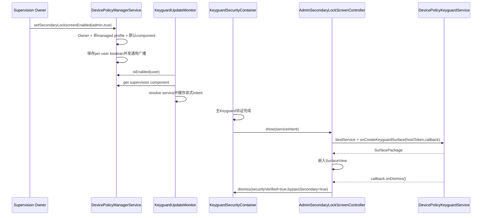
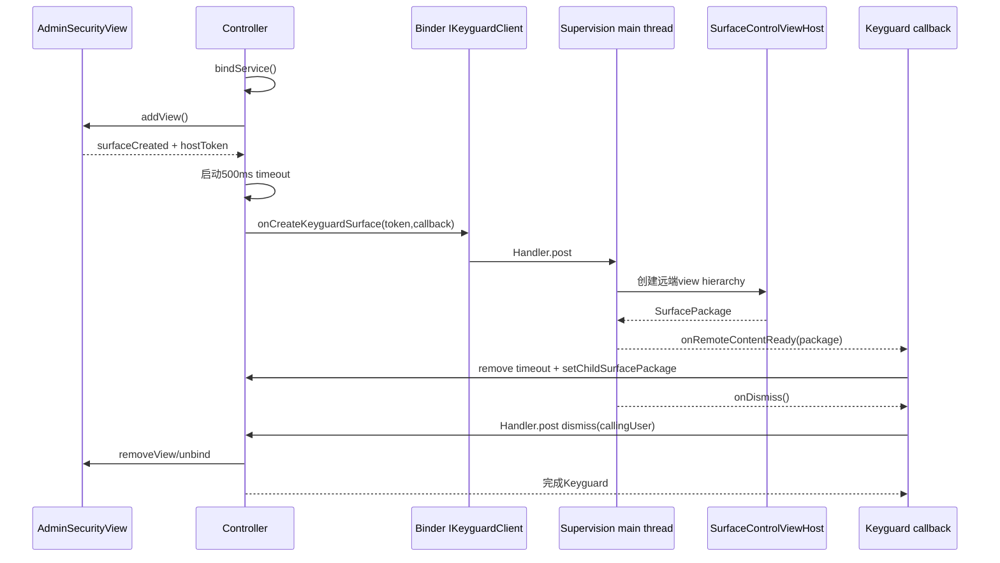
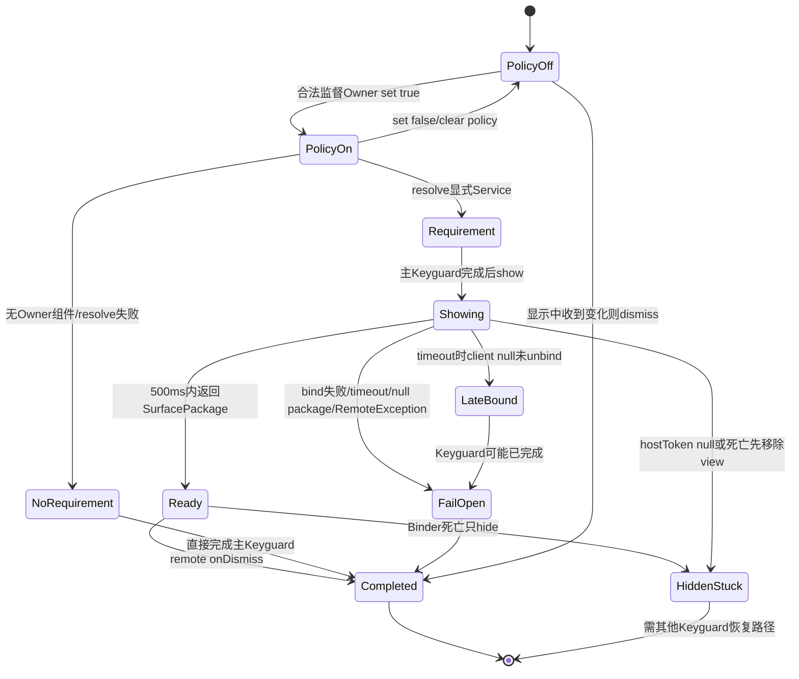

# 第 330 章 Android 企业 Secondary Lockscreen：监督组件、服务解析、Surface 嵌入、超时放行与死亡卡锁边界链

> 源码基线：Android 11 / API 30 / `android-11.0.0_r48`。这是隐藏SystemApi和产品监督能力；裸AOSP默认监督组件为空，不能把源码框架误写成开箱即用功能。

## 1. 什么是secondary lockscreen

它是在用户已经满足Android主Keyguard安全要求后，由受信监督应用再提供的一层企业UI。主密码/PIN/生物识别仍由SystemUI验证，管理应用只负责额外页面及何时通知继续解锁。

## 2. 它不是替换主锁屏

源码在 `showNextSecurityScreenOrFinish` 即将finish时插入secondary screen。监督应用不能借它读取主PIN，也不能绕过SIM PIN、Credential或StrongAuth的前置判断。

## 3. 它也不是普通Activity

SystemUI绑定 `DevicePolicyKeyguardService`，服务通过 `SurfaceControlViewHost.SurfacePackage` 把远端Surface嵌入Keyguard的SurfaceView。没有startActivity和普通任务栈。

## 4. 典型用途

学校/家庭监督、企业附加合规确认、使用时段提示或额外交互。若用于真正安全因子，必须评估r48大量fail-open与服务死亡边界，不能只看“additional security”命名。

## 5. 主要源码

API/授权在DPM与DPMS；服务SDK是 `DevicePolicyKeyguardService` 和两个AIDL；发现逻辑在 `KeyguardUpdateMonitor`；绑定/Surface/timeout在 `AdminSecondaryLockScreenController`；插入点在 `KeyguardSecurityContainer`。

## 6. API可见性

`setSecondaryLockscreenEnabled`、getter和service均为 `@SystemApi @hide`。普通第三方SDK不能作为通用锁屏扩展使用，目标是预装监督应用。

## 7. 文档说DO或PO

服务先 `enforceProfileOrDeviceOwner(who)`，所以Owner身份基础上接受DO或PO。但后续还有用户类型和默认监督component两道门，不能只读throws文档。

## 8. managed profile明确被拒

若calling user是managed profile，服务直接SecurityException。因此这里的PO只能是完整次要user上的Profile Owner；常见工作资料PO不能开启自己的secondary lockscreen。

## 9. 必须是默认监督组件

资源 `config_defaultSupervisionProfileOwnerComponent` 解析出的ComponentName必须与who完全相等。仅同package不同Receiver也失败，避免任意Owner自行占用系统级Surface能力。

## 10. 总体时序



## 11. parent实例

客户端set/get都拒绝parent DPM实例。策略属于Owner所在完整user，不是工作资料对父侧的政策映射。

## 12. setter的who非空

虽公开标NonNull，enforceProfileOrDeviceOwner/helper本身会依赖component；调用者不应传null。与有显式Objects.requireNonNull的方法相比，异常具体位置可能不同。

## 13. 默认AOSP资源

`config_defaultSupervisionProfileOwnerComponent` 在r48 core config中是空字符串。只有产品overlay为预装system supervision app提供合法flattened component后，该能力才可设置。

## 14. 注释要求system app

资源注释称component必须属于system app、只用于supervision；DPMS setter本身没有再次查询FLAG_SYSTEM，而是信任资源overlay和Owner provisioning链。

## 15. 空字符串的实际错误

`getString`通常返回 `""` 而非null，`unflattenFromString("")` 得null，随后 `who.equals(null)` 为false并报“not default supervision component”。测试用mock null才命中“no component defined”分支。

## 16. malformed资源风险

若资源非空但不能flatten，supervisorComponent仍null；setter安全地由who.equals(null)拒绝。另一个监督component getter却直接调用 `supervisorComponent.equals(...)`，在异常持久状态下可能NPE。

## 17. per-user字段

`mSecondaryLockscreenEnabled` 位于DevicePolicyData，而非ActiveAdmin。DO在user0保存自己的位；完整secondary user PO保存其user policy，两个user可各有不同状态。

## 18. 默认false

字段初始化false，writer只在true时输出 `secondary-lock-screen value="true"`。set(false)重写文件并省略tag。

## 19. reader

reader用Boolean.parseBoolean(value)，缺失/false/异常值均形成false。它不再次确认当前Owner仍为默认监督component。

## 20. setter没有同值短路

每次调用都赋值并save；相同true也重写policy并发送成功保存后的DPM state changed。该方法没有DevicePolicyEventLogger专用事件。

## 21. I/O失败

内存boolean已变，save回滚且不发通用广播，setter无错误返回。SystemUI若恰好主动query可看到新内存值，但通常依赖广播刷新，当前UI可能仍旧；重启恢复旧磁盘值。

## 22. getter没有权限门

`isSecondaryLockscreenEnabled(UserHandle)` 直接getUserData指定user，没有Owner、system或cross-user permission检查。任何能访问SystemApi的调用者可读boolean；SystemUI正依赖此能力。

## 23. getter甚至会lazy load

查询尚未加载的user会创建DevicePolicyData并读其XML。结合上一章，load结尾还会无条件推该user的UserControlDisabledPackages，secondary lockscreen查询可能间接覆盖PMS全局保护list。

## 24. userHandle null

服务没有requireNonNull，直接 `userHandle.getIdentifier()`；null产生NPE。NonNull注解是调用契约，不是服务端容错。

## 25. 不验证user存在

getUserData按int建立缓存，即使UserHandle指向不存在user，也可能尝试读取policy路径并返回默认false。调用者不应用它枚举或制造任意user缓存。

## 26. clear user policies

`clearUserPoliciesLocked` 把boolean设false并保存。Owner解除或user退管后policy真值会清，与上一章session message缓存漏清不是同一情况。

## 27. 状态不绑定服务可用性

setter只验证Owner component，不解析ACTION服务。DPC可成功保存true，但manifest缺服务、服务disabled或无法bind时，SystemUI在消费阶段回退。

## 28. ACTION声明

监督app的Service需处理 `android.app.action.BIND_SECONDARY_LOCKSCREEN_SERVICE` 并通常扩展DevicePolicyKeyguardService。Action是发现协议，不是一个发送给Receiver的broadcast。

## 29. service导出/权限

SystemUI最终以显式component bind；manifest的exported、permission和包可见状态仍影响bind。Framework基类不自动声明manifest，也没有定义专用bind permission常量。

## 30. 多个匹配service

SystemUI对监督package构造setPackage Intent并 `resolveService(intent,0)`，只取一个ResolveInfo。代码不检查是否唯一；监督app应只声明一个明确实现，避免解析顺序不确定。

## 31. 为什么先找监督Owner component

KeyguardUpdateMonitor调用 `getProfileOwnerOrDeviceOwnerSupervisionComponent(user)`；服务只在资源component等于该user的PO或全局DO时返回。仅安装同包但不再是Owner不会被发现。

## 32. DO匹配的user边界

监督getter比较资源component与DO component时没有要求DO userId等于请求user；若设备有DO，查询其他user也可能返回同一DO supervision component。这与PO按指定user查找不同。

## 33. Intent只限定package再解析

发现时setPackage(supervisor package)，没有预先把Receiver class当Service class。资源component通常是admin Receiver，实际secondary service可以是同package内另一component。

## 34. resolve成功后显式化

SystemUI把ResolveInfo.serviceInfo.getComponentName写入新Intent缓存，后续bind不再做implicit resolution，降低劫持和变化窗口。

## 35. resolve不到是fail-open

只记录错误/保持map中null，不创建secondary requirement；主Keyguard验证后直接finish。SDK文档也明确说bind失败将continue to unlock。

## 36. 失败没有通知Owner

DPMS没有service health callback，Keyguard log也不回传DPC。Owner getter仍true，形成“policy开启但未展示”；产品必须自行做服务自检和系统日志监测。

## 37. requirement缓存结构

`Map<Integer,Intent>` 按user保存。get返回null既可能从未查询、disabled、resolve失败，也可能显式put null；公开消费无法区分原因。

## 38. 启用时只在oldIntent null解析

如果已有Intent且enabled仍true，update不重新resolve。服务component升级/禁用或package变化不会由普通DPM广播刷新，除非先让requirement变null或重启SystemUI。

## 39. 禁用时

enabled=false且oldIntent非null时put null并通知callbacks；若原本resolve失败oldIntent已null，则changed=false，不通知，因为UI本来没有secondary view。

## 40. SystemUI何时刷新

KeyguardUpdateMonitor初始化时更新当前user；收到DPM state changed也按发送user更新，并在DPM状态handler中重查。user切换相关初始化会为新当前user建立requirement。

## 41. save失败的刷新缺口

DPMS save失败不发广播，Keyguard缓存可能仍null；即使getter内存true，也不会自动出现。重启又读旧false，因此设置API正常返回不能证明一次展示。

## 42. package更新广播未直接处理

本段requirement逻辑没有注册监督service package changed来重新resolve。产品更新service后应触发明确policy刷新/重启SystemUI验证，而非假设缓存自动换component。

## 43. 插入时机

KeyguardSecurityContainer计算主安全流程 `finish=true` 后，若 `bypassSecondaryLockScreen=false` 且requirement Intent非null，就show secondary并return false，暂不调用最终securityCallback.finish。

## 44. 主验证已完成但设备未解锁

secondary显示时系统已认可primary credential/biometric路径，但Keyguard完成回调被暂停。远端UI不是在未认证桌面上运行的普通overlay，而是Keyguard流程一部分。

## 45. bypass参数的意义

secondary自身dismiss后调用Keyguard callback时传 `bypassSecondaryLockScreen=true`，防止重新进入同一requirement造成无限循环。

## 46. securityVerified=true

Controller dismiss调用 `mKeyguardCallback.dismiss(true,userId,true)`。SystemUI信任监督service的onDismiss作为额外条件完成，不再要求远端提供密码学证明对象。

## 47. 服务必须保护自身逻辑

任何能在监督service进程内调用基类 `dismiss()` 的代码路径都可请求放行。监督app需严控exported components、IPC和业务状态，避免普通Activity或Receiver无条件触发。

## 48. show先bind再加View

若mClient为空，Controller调用bindService(BIND_AUTO_CREATE)，随后把AdminSecurityView加入parent。Surface创建与Service连接可任意先后，代码分别处理两种顺序。

## 49. bindService返回值被忽略

若bind立即返回false，仍添加SurfaceView并启动500ms计时，最终dismiss放行。UI不会给用户持久错误页，也没有把失败送回Owner。

## 50. Surface与Binder协作图



## 51. AdminSecurityView

它是SurfaceView，setZOrderOnTop(true)，附着时注册SurfaceHolder.Callback，分离时移除。远端内容不直接加入SystemUI View树，而由SurfacePackage作为child surface。

## 52. host token

SystemUI从SurfaceView `getHostToken()` 传给远端，供SurfaceControlViewHost建立嵌入和ANR归属。token只有在view附着/Surface准备后才应非null。

## 53. host token为null

`onSurfaceReady` 的else只调用 `hide()`，没有调用Keyguard完成dismiss。主验证已暂停，view被移除后可能留下无secondary UI但也未finish的卡锁状态。

## 54. ServiceConnection先到

onServiceConnected保存IKeyguardClient；若view已attached，立即onSurfaceReady并linkToDeath。若view尚未attached，不请求Surface，也不在此时link death，等待surfaceCreated处理。

## 55. Surface先到

surfaceCreated注册policy callback；mClient若已存在就请求，否则只启动timeout，待onServiceConnected看到view attached后再请求。

## 56. 500毫秒超时

`REMOTE_CONTENT_READY_TIMEOUT_MILLIS=500` 从surfaceCreated开始。远端进程冷启动、bind、主线程构建SurfacePackage都必须赶上，否则Controller dismiss当前user并继续解锁。

## 57. timeout是fail-open

注释明确“move on without secondary lockscreen”。它保障用户不因监督服务缓慢永久锁死，却削弱把此UI当强制第二因子的安全性。

## 58. content ready会取消timeout

IKeyguardCallback.onRemoteContentReady首先remove handler全部callbacks/messages；非null package嵌入child surface，不自动dismiss，等待监督UI后续调用onDismiss。

## 59. null SurfacePackage

回调null时再post dismiss当前user，形成fail-open。基类默认 `onCreateKeyguardSurface()` 就返回null，所以监督app若只继承不override，会自动放行。

## 60. 为什么还要post dismiss

Binder callback不直接操作View/Keyguard状态，而转到handler，避免跨线程UI访问。当前user在post执行前可能变化，因此dismiss还有userId核对。

## 61. callback的userId来源

onDismiss Binder回调里把lambda投到handler，lambda执行时才调用 `UserHandle.getCallingUserId()`。Binder calling identity已恢复为SystemUI线程身份；在多user SystemUI模型中这可能与远端原caller不同，属于需真机验证的r48细节。

## 62. 更稳妥的实现

应在Binder stub进入时先捕获 `final int callingUserId=UserHandle.getCallingUserId()`，再post该值，并校验它等于当前requirement user/绑定user。当前代码没有保存明确session user。

## 63. dismiss的user核对

只有view仍attached且传入userId等于 `KeyguardUpdateMonitor.getCurrentUser()` 才hide并finish。过期user回调不会解锁新用户，这是重要防竞态门。

## 64. 没有一次性callback token

IKeyguardCallback不含nonce/sessionId；旧service实例若连接仍在，理论上可在后续时点回调。userId+view attached是主要关联条件，缺少更细请求代次。

## 65. SurfacePackage生命周期

SystemUI调用 `mView.setChildSurfacePackage()` 接管显示；监督app仍需管理SurfaceControlViewHost与View资源。基类不保存/close host，具体实现必须防泄漏。

## 66. 输入事件

hostInputToken让远端嵌入内容可交互并参与ANR报告。监督UI应只收自身控件事件，主凭据输入仍不应通过远端Surface。

## 67. onCreate运行线程

IKeyguardClient是oneway Binder，基类stub收到后post到service主Looper，再调用可override方法。耗时网络/磁盘会堵主线程并很容易超过500ms。

## 68. 远端应预热

若产品真要展示，需让Surface构造足够快、避免冷启动重I/O，并将远程合规数据提前缓存。即便优化，500ms仍意味着不能把网络结果当首屏硬依赖。

## 69. onDestroy

基类Service.onDestroy只remove主handler callbacks/messages，不显式通知Keyguard；若尚未回content，SystemUI timeout最终放行。

## 70. mCallback单字段

DevicePolicyKeyguardService只保存最近一次IKeyguardCallback。并发/重入onCreate会覆盖旧callback，旧UI调用dismiss可能通知新session；正常Keyguard设计假定单活动请求，但代码无session map。

## 71. bind用户边界

Controller调用context.bindService而非显式bindServiceAsUser，解析和绑定使用SystemUI context的user语义。策略user、当前user和SystemUI进程user在产品多用户架构中必须联调验证。

## 72. setPackage降低劫持

发现Intent限定监督Owner package，其他包无法仅靠声明相同action被选中。最终显式component进一步固定目标。

## 73. 同包多服务风险

同一高权限监督package若多个service声明action，resolve结果可能不是预期实现。manifest应保证唯一并在测试中断言component。

## 74. service permission兼容

如果监督service声明SystemUI不具备的自定义permission，bind会失败并500ms放行。反过来若exported且无permission，其他应用可能绑定基类接口，虽不能直接拿到SystemUI callback，但扩大攻击面。

## 75. 建议签名级bind permission

产品可用仅SystemUI持有的signature permission保护service，并确认平台签名/permission授予。AOSP API本身没有在resolve时检查该permission是否符合预期。

## 76. onServiceDisconnected

该回调只把mClient设null，不hide、不dismiss。若断线场景未同时触发death recipient或timeout已取消，Keyguard可能保留空/旧Surface状态。

## 77. linkToDeath时机

只在onServiceConnected且view attached时link。若先连接后view后续surfaceCreated，onSurfaceReady会请求内容，但surfaceCreated分支没有linkToDeath；因此存在未注册death recipient的连接顺序窗口。

## 78. 这是一个明确的不对称

Service-first且view当时未attached：连接分支不link；之后surfaceCreated只onSurfaceReady，不link。远端死亡可能仅走onServiceDisconnected，当前代码不做收敛。

## 79. linkToDeath失败

若注册时RemoteException，代码log后调用dismiss当前user并unbind，fail-open继续解锁。注释与实现一致。

## 80. 已注册后的Binder死亡

death recipient只调用 `hide()` 并log，没有 `mKeyguardCallback.dismiss()`。若主Keyguard已暂停且remote content曾ready，用户可能停在无secondary view、无法完成的fail-closed卡锁状态。

## 81. timeout前死亡

若content尚未ready，surfaceCreated安排的500ms timeout仍可能触发dismiss；death hide先移除view，但dismiss要求view attached，届时条件false，反而不会finish。死亡与timeout顺序可能把原本fail-open变成卡锁。

## 82. hide何时unbind

`hide()` 仅在 `mClient != null` 时执行unbind。若bind正在pending、mClient尚null而timeout dismiss，view会被移除但connection不解绑；稍后onServiceConnected可留下已绑定却不再展示的连接。

## 83. pending bind泄漏边界

迟到的onServiceConnected看到view不attached，不请求Surface、不link death，但mClient变非null。直到未来hide/show路径才可能解绑，增加监督服务后台存活时间。

## 84. show重入

若mClient已经由迟到连接赋值，下一次show不会重新bind；添加view后surfaceCreated会用旧client请求。它可能偶然复用，也可能把跨session状态带入新请求。

## 85. policy关闭如何收敛

KeyguardUpdateMonitor把requirement设null并通知callback；Controller的update callback调用dismiss(userId)。只有view attached且当前user匹配才真正finish，未显示时只是无动作。

## 86. policy关闭是放行

管理员在secondary页面显示期间set(false)，成功广播到SystemUI后会dismiss并完成Keyguard。它不是隐藏页面后重新要求primary credential。

## 87. broadcast时延

save成功→registered-only DPM广播→Keyguard handler→resolve状态→Controller callback是异步链；setter返回不代表当前Surface立刻消失。

## 88. owner移除

clear policies设false并广播保存变化时可触发相同放行；若广播/缓存失败，Controller的service死亡和timeout行为决定残留。退管流程应实机覆盖正在显示的瞬间。

## 89. SystemUI进程重启

内存requirement、binding、Surface都丢失；新KeyguardUpdateMonitor从DPMS持久位和服务解析重建。旧远端Service连接应由进程死亡释放，但业务SurfaceHost也需监督app清理。

## 90. 异常结果状态图



## 91. 安全模型不是单向fail-open

服务缺失/慢/返回null多数会放行，但host token null、某些死亡/断线顺序只hide不finish，可能fail-closed卡住。准确文档必须同时写两类故障。

## 92. 为什么不能当强MFA

500ms超时直接bypass，且解析/bind失败无挑战；攻击者若能让监督服务不可用可能降低额外门。真正MFA应由平台认证框架和不可绕过的凭据策略承载。

## 93. 为什么仍有价值

它适合监督提示、快速本地确认、家长/课堂交互等“额外体验”。系统用超时优先可用性，符合可选监督层而非根信任因子定位。

## 94. 远端内容可信显示

Surface位于Keyguard顶层，用户可能把它视作系统UI。监督app必须清晰品牌化，禁止伪造Android PIN输入或诱导泄露主凭据。

## 95. FLAG_SECURE

本Controller片段未给AdminSecurityView设置FLAG_SECURE；截图/录屏保护取决于上层Keyguard window。产品应在目标SystemUI验证，不把Surface嵌入自动等同不可截屏。

## 96. 可访问性

远端SurfaceView嵌入的无障碍树、焦点和输入法需要SurfaceControlViewHost正确配置。只有视觉内容而无语义会让辅助用户无法dismiss，最终可能靠故障/超时放行。

## 97. 旋转与Surface重建

surfaceDestroyed移除policy callback但不主动unbind；新surfaceCreated可能再次请求并重置timeout。mCallback单字段和远端SurfaceHost资源需正确处理配置变化。

## 98. handler remove-all风险

Controller在content ready/dismiss时 `mHandler.removeCallbacksAndMessages(null)`。复读构造点确认KeyguardSecurityContainer专门 `new Handler(Looper.myLooper())` 传入，并未复用容器公共handler，所以生产r48主要删除本Controller的timeout/dismiss任务。

## 99. 当前构造来源

另一方面，Binder `onRemoteContentReady(non-null)` 直接调用SurfaceView setter，death recipient也直接hide/removeView，没有像onDismiss那样post到handler。Binder/death线程上的View操作存在明确线程亲和风险，产品应以SystemUI测试验证并考虑统一切主线程。

## 100. 日志可观测性

解析失败、timeout、RemoteException、death均有不同Log，但没有统一统计atom或DPM事件。产品应聚合这些log/metrics，否则政策有效率不可见。

## 101. 最小源码骨架

```java
if (finish && !bypassSecondaryLockScreen) {
    Intent i = updateMonitor.getSecondaryLockscreenRequirement(userId);
    if (i != null) { controller.show(i); return false; }
}

handler.postDelayed(() -> dismiss(userId), 500);
client.onCreateKeyguardSurface(view.getHostToken(), callback);
```

## 102. manifest最小概念

监督app声明一个处理BIND_SECONDARY_LOCKSCREEN_SERVICE的Service，并以产品认可permission限制；Receiver component仍须等于config默认监督component且成为DO/完整user PO。

## 103. Surface实现责任

override方法创建SurfaceControlViewHost、setView、保存host引用并返回SurfacePackage；离开/销毁时release。基类默认null只是模板，不提供实际UI。

## 104. dismiss调用责任

只有监督条件满足才调用基类dismiss；它通过最近mCallback发送oneway onDismiss。调用后远端也应停止交互、防重复，并准备Service unbind。

## 105. 常见误解一：任何PO都能开

错误。managed profile PO被拒，且Owner component必须是产品资源指定的默认supervision component。

## 106. 常见误解二：true保证一定显示

错误。服务解析、bind、500ms、特殊进程/用户和SystemUI缓存都可让主Keyguard直接完成。

## 107. 常见误解三：超时会保持锁定

错误。正常timeout明确dismiss放行；但死亡先hide等异常组合又可能卡锁，需区分路径。

## 108. 常见误解四：远端能看主密码

错误。它在primary security满足后才插入，获得的是自己的host token和callback，不是主凭据。

## 109. 常见误解五：Binder死一定fail-open

错误。成功link后的death recipient只hide，不finish；这是与link失败时dismiss相反的r48行为。

## 110. 产品验证矩阵

覆盖service不存在、disabled、bind false、冷启动>500ms、null/non-null Surface、host token null、content后crash、断线、policy关闭、user切换和SystemUI重启。

## 111. 本章知识检查

回答：为何裸AOSP不能启用？managed profile为何失败？requirement何时缓存？500ms从哪里开始？哪些故障放行、哪些可能卡锁？为何remote dismiss需要bypass标记？

## 112. macOS 只读练习一：追授权与持久化

定位setter、enforce helper、默认资源、DevicePolicyData tag和clearUserPolicies；写出DO、完整user PO、managed profile PO、非默认component四种结果。

## 113. macOS 只读练习二：追服务发现

从KeyguardUpdateMonitor的enabled query追supervision component、setPackage resolveService和显式Intent缓存，列出resolve失败、旧Intent非null及disable三种更新结果。

## 114. macOS 只读练习三：追Surface与超时

阅读Controller show、两个连接/Surface先后顺序、500ms callback、null Surface与dismiss；画出bind慢于timeout时为何pending connection可能未unbind。

## 115. macOS 只读练习四：审计死亡边界

比较linkToDeath失败、注册后的death recipient、onServiceDisconnected和hostToken null，标出哪些调用dismiss、哪些只hide；Mac阶段只做静态证据，不编译真机。

## 116. 练习答案要点

默认监督资源为空；只有资源component对应DO/完整user PO可set；SystemUI按user缓存显式service；timeout从surfaceCreated起500ms并放行；null/远程异常多放行，host token null和已注册Binder死亡只hide可能卡锁；bypass防二次进入。

## 117. 复读修正一：PO范围比文档标题窄

公开描述写DO/PO，但服务明确拒绝managed profile。正文已改为“完整secondary user PO”，避免读者把工作资料二次锁屏与本能力混淆。

## 118. 复读修正二：不是纯fail-open

SDK注释强调bind失败继续unlock，初读容易概括所有故障都放行；逐分支复读发现death/host-token/断线若只hide可能无法finish，必须保留双向故障。

## 119. 复读修正三：连接顺序影响death与unbind

linkToDeath只在onServiceConnected且view已attached注册；timeout时client null又不会unbind。时序不是实现细节，而是解释迟到连接和卡锁/泄漏的关键。

## 120. 本章结论与下一章

Secondary lockscreen是默认监督Owner提供的可选远端Surface层，SystemUI在主认证后插入，并以服务解析和500ms超时优先可用性；r48仍有身份捕获、pending bind和death只hide等边界。下一章进入设备监督角色本身，研究default supervision component、setup-complete后Profile Owner设定例外、Owner识别与系统应用信任根。
