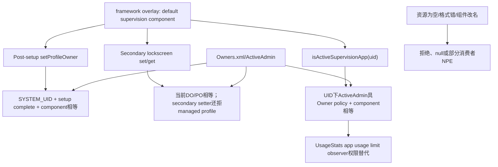
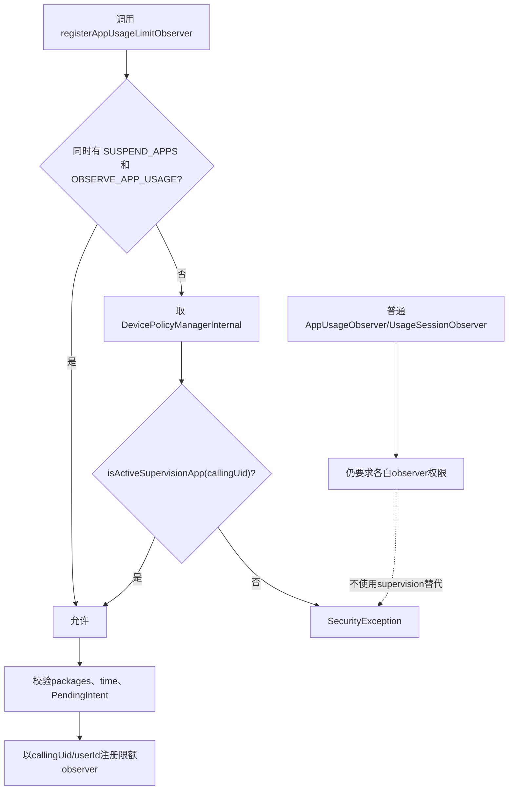
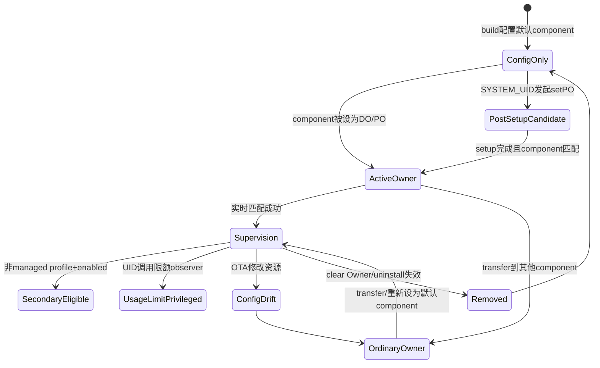

# 第 331 章 Android 企业 Default Supervision Component：资源信任根、Post-Setup Profile Owner 例外与 Usage Limit 特权链

> 源码基线：Android 11 / API 30 / `android-11.0.0_r48`。supervision并非Owners文件中的独立角色，而是产品资源指定component与当前DO/PO/Admin状态的实时交集。

## 1. 为什么单独研究supervision

上一章secondary lockscreen要求“默认监督应用”，但同一component还影响setup完成后设置Profile Owner以及UsageStats限额观察特权。理解它能避免把一条资源字符串低估成单纯UI配置。

## 2. 核心资源

`config_defaultSupervisionProfileOwnerComponent` 是flattened ComponentName字符串，AOSP默认空。产品overlay把某个预装DeviceAdminReceiver设为默认supervisor。

## 3. 不是运行时可配置Setting

它来自framework资源overlay，不在Settings.Global、DeviceConfig、Owners XML或DPC setter中。改变它通常意味着更换产品build/overlay，而非远程MDM下发。

## 4. 不是独立Owner类型

Owners仍只记录Device Owner/Profile Owner。系统需要判断supervision时，再读取资源component并与当前ActiveAdmin/DO/PO比较。

## 5. 三个主要消费者

一是post-setup setProfileOwner白名单；二是get supervision component和secondary lockscreen setter；三是DevicePolicyManagerInternal.isActiveSupervisionApp供UsageStats限额observer授权。

## 6. 资源注释的安全期望

注释要求component属于system app且只用于supervision。r48若干消费者只比较ComponentName，没有每次重新验证FLAG_SYSTEM；安全性依赖overlay审核、安装/provisioning门和系统镜像完整性。

## 7. 默认AOSP状态

config.xml内容为空字符串，所以裸AOSP没有有效supervisor。相关能力需要产品显式选择组件；学习源码时不能假设某个Google/厂商包天然存在。

## 8. Component而非package

匹配包含package和class。相同package的另一个DeviceAdminReceiver不算supervisor；升级重命名Receiver也会让现有Owner失去匹配。

## 9. flatten/unflatten

资源用 `ComponentName.unflattenFromString()` 解析。格式错误或空串返回null；不同消费者对null处理不一致，是本章的重要健壮性主题。

## 10. 信任关系总图



## 11. setup complete为何通常阻止PO

Profile Owner应在受控provisioning阶段设定，避免用户已使用设备后突然被接管。DPMS默认在user setup complete后拒绝非ADB、非特殊system路径。

## 12. setProfileOwner基础前置

目标user必须存在、非guest、没有现有PO，且同user不能已有DO；目标package已安装、component是active admin且未处于removing。

## 13. 调用者基础权限

非ADB路径先要求MANAGE_PROFILE_AND_DEVICE_OWNERS。setup完成后的特殊例外进一步要求calling UID正是SYSTEM_UID，仅有signature permission还不够。

## 14. system UID不是supervisor app自己

默认监督app并非靠自己调用setProfileOwner完成post-setup接管；代码要求system进程/系统UID执行设置，并把目标owner限定为资源component。

## 15. post-setup普通产品规则

若user已setup且不是watch：caller必须SYSTEM_UID，并且owner component等于默认supervisor。任何其他DPC即使预装且active admin也被拒。

## 16. watch例外

`mIsWatch` 时post-setup仍要求SYSTEM_UID，但跳过默认supervisor component比较。服务端因此允许system设置其他PO；前端DeviceAdminAdd是否一致需另查。

## 17. ADB例外

isAdb路径在检查incompatible accounts后直接return，不执行SYSTEM_UID或default supervisor比较。调试设备可通过ADB设置其他PO，前提取决于setup/watch与账户兼容条件。

## 18. 账户门

ADB在watch或setup已完成且存在incompatible accounts/non-adb条件时拒绝，防止已有账户数据被突然纳管。具体兼容账户判定属于Owner provisioning另一条链。

## 19. 资源为null分支

服务代码检查supervisor==null并给“no default”异常；真实Resources.getString对存在但空的资源通常返回空串，所以裸AOSP更常走解析null后owner.equals(null)=false的“non-default”异常。

## 20. owner参数null

setProfileOwner更早检查component/package安装，null会IllegalArgumentException；post-setup比较处的 `owner.equals` 正常不会接收null。

## 21. Settings前端也做一次门

DeviceAdminAdd在setup完成后读取相同资源，只允许who等于supervisorComponent，并展示简化确认dialog。服务端仍是权威，UI检查不是授权替代。

## 22. Settings的空资源NPE风险

前端只检查字符串null，然后调用 `who.compareTo(supervisorComponent)`；空串解析为null时可能NPE。裸AOSP若有人强行发post-setup添加PO action，前端健壮性不足。

## 23. TV Settings差异

TvSettings复制相似逻辑，但匹配时成功便直接addAndFinish，没有相同简化dialog流程。产品形态可有不同UX，服务端预条件仍共同。

## 24. Watch前后端不一致

DPMS在watch跳过default component检查，Settings/TV前端片段未见mIsWatch例外。某些调用路径可能前端先拒而服务理论可接受，需按目标设备入口验证。

## 25. setProfileOwner成功后的Owner记录

DPMS写Owners profile-owner文件、停用该user BackupManager、发送PROFILE_OWNER_CHANGED，并启动Owner service。supervisor资源只决定谁可成为Owner，不替代这些正常副作用。

## 26. managed profile默认限制

若目标user是managed profile，成功后还设置默认restrictions与unknown-sources策略。default supervision例外并不跳过PO正常政策初始化。

## 27. user restriction门

若目标是某parent下profile且parent有DISALLOW_ADD_MANAGED_PROFILE，setProfileOwner可返回false。component匹配不越过用户限制。

## 28. 资源component必须已是active admin

setProfileOwner在授权后检查ActiveAdmin；仅把包名写入overlay不会自动激活Receiver。前端通常先setActiveAdmin，provisioning任务也负责顺序。

## 29. Owners记录与资源可能漂移

OTA改变overlay component后，旧PO仍在Owners文件，但不再被实时识别为supervision app。系统不会自动迁移Owner component或转移policy。

## 30. 改名升级风险

监督app重构Receiver class需要Owner transfer/兼容组件保留和overlay同步。直接删旧Receiver可能让Owners解析、supervision特权及secondary screen共同失效。

## 31. getSupervisionComponent的算法

读取资源component，然后取全局DO component与指定user的PO component；资源component等于任一便返回，否则null。

## 32. DO比较不受请求user限制

代码比较全局DO component，没有同时判断DO userId==请求user。因此SystemUI查询secondary user时也可能拿到DO supervisor package。

## 33. PO比较按user

`mOwners.getProfileOwnerComponent(userId)` 只看指定user。另一个user的PO即使同package/component，也要该user真实存在记录才能匹配。

## 34. getter无显式caller权限

该隐藏接口供SystemUI使用，服务在锁内直接比较；没有MANAGE_USERS/cross-user门。返回的只是预配置component或null，但仍暴露管理组件身份。

## 35. feature门

`mHasFeature=false` 时直接null。资源即使配置也不构成supervisor，因为设备不支持管理能力。

## 36. 空资源导致NPE

getter对 `ComponentName.unflattenFromString("")` 的null结果调用 `supervisorComponent.equals`。正常secondary状态无法在空资源下启用，但异常持久policy或其他调用者仍可能触发。

## 37. 解析前应做TextUtils.isEmpty

更稳妥实现是empty直接null，并在解析失败后null return。仅检查Java null不足以保护resource placeholder。

## 38. secondary setter复用相同根

它要求who正是资源component，同时必须当前为DO/PO且非managed profile。资源只是白名单，Owner状态仍是动态授权条件。

## 39. 资源不直接授予权限

同component包安装但尚未成Owner时，不能开secondary lockscreen，也不会isActiveSupervisionApp。不能把overlay当成静态signature permission。

## 40. 退管即时失去匹配

Owners/ActiveAdmin清除后，component资源仍在但实时比较失败。UsageStats后续授权和supervision getter应转false/null；已注册observer或已显示Surface的清理则要看各服务生命周期。

## 41. isActiveSupervisionApp入口

DevicePolicyManagerInternal提供 `isActiveSupervisionApp(uid)` 给system_server其他服务，不是应用Binder API。它把资源component与调用UID下的ActiveAdmin结合判断。

## 42. 先按UID找Owner policy admin

`getActiveAdminWithPolicyForUidLocked(null,USES_POLICY_PROFILE_OWNER,uid)` 必须找到具Owner policy的ActiveAdmin。普通active Device Admin即使component相同也不满足。

## 43. DO是否可能命中

通用policy helper对USES_POLICY_PROFILE_OWNER会按Owner语义解析，测试只覆盖PO；对DO应以helper实现/目标测试确认。正文不把“supervision”硬限定为PO，因为另一个getter明确比较DO。

## 44. managed profile PO可命中

isActiveSupervisionApp没有 `isManagedProfile` 拒绝；测试正用managed-profile admin并返回true。它虽不能开启secondary lockscreen，却可获得UsageStats限额observer替代授权。

## 45. component精确比较

ActiveAdmin.info.component必须等于解析的资源component。同UID下另一个admin component不会因共享package/UID自动被当supervisor。

## 46. shared UID影响

方法入参只有uid，先按uid找admin；若监督package与其他包shared UID，其他包调用UsageStats时也呈现同一callingUid。后续callingPackage校验路径需要仔细评估，产品应避免supervisor共享UID。

## 47. 空资源在此较安全

isActiveSupervisionApp解析空串得null后执行 `admin.component.equals(null)`，安全返回false，不会像supervision getter那样在null对象上调用equals。

## 48. 结果不缓存

每次调用重新读resource并查ActiveAdmin，Owner清除/转移后即时变化。没有单独“active supervision”boolean需要持久化。

## 49. LocalService缺失

UsageStats获取DPM internal若为null，会把supervision替代判定视为false；系统服务启动顺序不满足时，调用者仍需常规两权限。

## 50. Usage Limit授权图



## 51. 特权只用于哪两个方法

r48特殊判断出现在register/unregisterAppUsageLimitObserver。普通registerAppUsageObserver和registerUsageSessionObserver仍调用hasObserverPermission，不因supervision身份放宽。

## 52. 为什么需要SUSPEND_APPS

App usage limit与家长/监督控制相关，普通替代路径要求同时观察使用和暂停应用；默认supervision app被产品信任，可不逐项持这两个权限。

## 53. 不是绕过所有UsageStats权限

queryUsageStats、usage session observers、report usage等各有独立门。本资源component只影响源码明确调用isActiveSupervisionApp的限额接口。

## 54. callingPackage仍传入

Binder方法接收callingPackage，常规hasPermissions会核包权限；supervision分支主要依赖callingUid/ActiveAdmin。shared UID或伪造package的具体防护要结合hasPermissions和Binder服务前置检查。

## 55. observer输入校验

packages必须非null且非空；若callbackIntent为null且timeUsed < timeLimit则NPE。supervision身份只替代权限，不跳过参数验证。

## 56. 已达到限额可无callback

条件允许当timeUsedMs >= timeLimitMs时callbackIntent为null；这反映注册可能只需内部状态/已触达逻辑，不能一般化成回调总是必填。

## 57. observer作用域

UsageStats使用callingUid派生userId并以callingUid+observerId登记。supervision组件不能借该特权直接指定其他user。

## 58. Binder身份清理顺序

权限与supervision判断在原callingUid下完成，随后clear identity调用内部注册。先验证委托者、再用system身份执行，结构与其他系统服务一致。

## 59. PendingIntent身份

达到限额时系统发送DPC提供的PendingIntent；PendingIntent自身封装创建者身份。监督app要防重复observerId、过期callback和进程重启恢复。

## 60. unregister也重做身份门

退管后旧app再unregister可能因不再active supervisor且缺两权限而被SecurityException拒绝。UsageStats应在Owner清理时清UID状态，或产品需验证残留observer生命周期。

## 61. 已注册observer是否自动撤销

本isActiveSupervisionApp只是register/unregister入口门；Owner变化时未见DPMS主动通知UsageStats清全部限额observer。必须追UsageStats UID/user removal或显式cleanup，不能假设实时判定自动删旧记录。

## 62. 资源OTA变化

component改动后旧app无法register/unregister特殊observer，新component只有成为ActiveAdmin Owner后才获得能力。旧observer可能继续存在直到UsageStats自身清理条件。

## 63. component签名不在实时判断

方法比较名字和ActiveAdmin，不重新校验证书。包升级签名接受由PackageManager安装链保证，supervision不是额外签名pin。

## 64. 系统app注释不等运行门

若产品错误overlay到非system app且仍设成PO，isActiveSupervisionApp本身会返回true。应在构建时lint/CTS/OEM测试验证资源目标确为system/privileged可信包。

## 65. post-setup能力的威胁模型

系统可在用户已完成设置后指定该组件为PO，赋予广泛管理权。资源供应链一旦被篡改，风险远高于一项UI，因此overlay应纳入安全评审和Verified Boot保护。

## 66. 为什么必须SYSTEM_UID

即便某应用持signature management permission，post-setup也不能自行选择资源component为PO。必须由system受控流程发起，减少授权代理面。

## 67. Settings简化确认不是唯一保护

用户UI可被绕过或不存在，服务端仍检查SYSTEM_UID/component。反过来，UI允许也不能保证service前置如账户、active admin、restriction全部通过。

## 68. 用户同意边界

Settings post-setup简化dialog提供可见确认；TV分支可能自动finish。最终产品是否需要用户同意取决于形态/政策，但system resource预授权不应被描述成普通应用静默自提权。

## 69. ADB是开发例外

ADB路径服务端跳过default component，但通常要求设备调试授权、shell/root环境且受账户条件。生产文档不应把adb行为当正常supervision provisioning。

## 70. guest永远不行

guest检查发生在ADB/system/default组件分支前；默认supervisor也不能成为guest PO。

## 71. 现有Owner冲突

目标user已有PO，或同user已有DO，都直接IllegalStateException。资源component没有覆盖/替换Owner的权力；需先合法clear/transfer。

## 72. package必须按user安装

setProfileOwner最早检查目标package在user安装。全局system app若未安装到secondary user，也不能成为该user PO。

## 73. active admin metadata

目标component需声明DeviceAdminReceiver、正确permission/metadata并已active。resource写一个普通Activity/Service会在ActiveAdmin检查处失败。

## 74. Owner name

ownerName只是人类可读组织名，DPM客户端null转空；它不参与supervision component匹配。不要用组织名判断是否监督应用。

## 75. backup副作用

成功设PO会永久停用该user backup service（直到Owner清理路径恢复策略），保护受管数据。supervision例外不跳过该副作用。

## 76. Owner service启动

DPMS调用DeviceAdminServiceController启动Owner package服务，原因set-profile-owner。监督app可在此初始化usage observers/政策，但必须处理服务重启幂等。

## 77. Owner changed广播

PROFILE_OWNER_CHANGED发到目标user。其他系统组件应重新query Owner状态；广播本身不携“supervision=true”，仍需资源component比较。

## 78. 多用户可否多个supervisor PO

资源只有一个ComponentName，同一system app若安装并在多个user分别成为PO，各user都可能匹配。isActiveSupervisionApp按UID/user隔离ActiveAdmin，但component名相同。

## 79. DO与PO同时比较

getSupervisionComponent对指定user先不定义优先级，只判断资源component是否等于全局DO或该user PO。合法Owner模型避免冲突；返回值反正是同一个资源component。

## 80. 状态不是policy字段

没有supervision-enabled XML tag。唯一持久事实是Owners中的DO/PO component；资源来自build。两者任何一侧变化都会改变实时身份。

## 81. 状态推导公式

可写成：configured component有效 AND 对应user/UID存在符合Owner policy的ActiveAdmin。secondary lockscreen还额外要求非managed profile和per-user enabled位。

## 82. systemReady恢复

Owners在DPMS启动加载，resource由当前build提供。无需DPC重新注册supervision；但OTA改resource后推导结果可与上次boot不同。

## 83. Owners写失败边界

setProfileOwner中Owners持久化失败的处理需要看Owners.write实现；supervision查询依赖内存Owner，当前boot可能与重启不同。不能把setProfileOwner true单独作为跨重启证明。

## 84. component禁用

Owners仍记component，但PackageManager若component被disable/uninstalled，ActiveAdmin加载/服务发现可能失败。名字匹配不是运行健康检查。

## 85. package replacement

合法升级保留包/component可维持身份；删除再装是否恢复Owner受ProtectedPackages和PMS安装策略影响。supervision公式不提供包恢复机制。

## 86. clearProfileOwner

退管删除Owners/ActiveAdmin后isActiveSupervisionApp false；secondary enabled字段由clearUserPolicies清。Usage observer等外部系统状态是否清需要各消费者补偿。

## 87. transferOwnership

若Owner从默认supervisor transfer到另一个component，新Owner仍是PO/DO但不再supervision；资源不随transfer改变。secondary lockscreen设置权限和Usage limit替代特权立即不同。

## 88. transfer到默认component

反向transfer使新Ownercomponent匹配resource，可获得supervision身份；但secondary enabled历史字段是否保留取决于DevicePolicyData/ActiveAdmin位置，本例enabled是user-level会保留。

## 89. 组件别名

ComponentName要求精确类名，activity-alias/receiver别名若与实际ActiveAdmin component不同不会自动规范化。overlay应使用DeviceAdminInfo真实component。

## 90. 生命周期状态图



## 91. 构建期验证

解析overlay字符串，确认component存在于system image、Receiver声明正确Device Admin permission/metadata、目标user安装策略允许，并保证只有一个产品定义。

## 92. 启动期验证

受权系统测试query getSupervisionComponent、isActiveSupervisionApp，并比较Owners实际component。空串、格式错和component改名应明确fail closed而非SystemUI NPE。

## 93. OTA验证

升级前后对比resource和Owner component，测试post-setup流程、usage observer、secondary service解析。若改名，先设计Owner transfer与旧component兼容窗口。

## 94. 多用户验证

分别覆盖user0 DO、完整secondary PO、managed-profile PO和无Owner user。前两者/后者在不同消费者中结果不完全相同。

## 95. Managed-profile差异表

它可isActiveSupervisionApp并用usage-limit特权，但secondary setter明确拒绝；post-setup system路径可将默认component设为managed-profile PO。一个“supervisor”标签不能推出所有能力。

## 96. Watch差异表

服务端post-setup system路径不要求default component，但isActiveSupervisionApp和secondary仍按resource匹配。watch上的普通PO不因此自动成为supervisor。

## 97. ADB差异表

ADB可设非default PO，但之后isActiveSupervisionApp仍false，secondary setter也因component不匹配失败。provisioning入口例外不会改变运行时身份公式。

## 98. DO差异表

default component作为DO可由supervision getter识别，secondary setter在user0可用；UsageStats内部helper是否把DO匹配USES_POLICY_PROFILE_OWNER应以测试补证，r48现有测试只证明PO。

## 99. API命名易误导

资源名含“ProfileOwner”，但get方法明确写ProfileOwnerOrDeviceOwner，secondary文档也写DO/PO。不要只凭资源名排除DO。

## 100. UsageStats最小代码

```java
if (!hasPermissions(callingPackage, SUSPEND_APPS, OBSERVE_APP_USAGE)
        && (dpmInternal == null
            || !dpmInternal.isActiveSupervisionApp(callingUid))) {
    throw new SecurityException(...);
}
```

## 101. ProfileOwner门最小代码

```java
if (hasUserSetupCompleted(userId)) {
    if (!isCallerWithSystemUid()) throw ...;
    if (!mIsWatch && !owner.equals(defaultSupervisor)) throw ...;
}
```

## 102. 常见误解一：资源配置即获得权限

错误。component还必须成为ActiveAdmin Owner；未纳管的预装包没有supervision身份。

## 103. 常见误解二：supervisor是一种第三Owner类型

错误。Owners只存DO/PO，supervision每次由资源与Owner状态推导。

## 104. 常见误解三：所有PO都能post-setup设置

错误。非ADB普通产品要求SYSTEM_UID发起且目标正是default component；已有PO/DO、guest、restriction等门仍有效。

## 105. 常见误解四：所有UsageStats接口都免权限

错误。特殊替代只在app usage limit observer注册/注销；普通usage/session observer仍用原权限。

## 106. 常见误解五：managed-profile supervisor不能有任何能力

错误。它不能开secondary lockscreen，但isActiveSupervisionApp测试明确为true，可走UsageStats限额授权。

## 107. 安全基线

资源目标必须system预装、独立UID、最小exported面和稳定component；post-setup system调用链需用户/产品授权，OTA必须保持Owner连续性。

## 108. 可靠性基线

所有消费者对empty/malformed resource统一null-safe；Owner变化清理observer/Surface；构建测试保证Settings和DPMS对watch/empty行为一致。

## 109. 审计基线

记录build资源值、Owners component、setProfileOwner入口（ADB/system/provisioning）和运行特权测试。只记录包名不足以证明具体Receiver匹配。

## 110. macOS只读结论上限

本地源码能证明授权公式和消费者，不能证明某OEM overlay值、目标包签名/system flag、实际用户同意UX或OTA迁移已正确。

## 111. 本章知识检查

回答：supervision为何不是独立角色？post-setup普通产品需哪三项条件？managed-profile supervisor能做什么/不能做什么？资源OTA漂移怎样影响旧Owner？UsageStats只放宽哪类接口？

## 112. macOS 只读练习一：盘点资源消费者

全树搜索config_defaultSupervisionProfileOwnerComponent，按DPMS post-setup、getter、secondary setter、isActiveSupervisionApp和Settings/TV前端分类，记录各自null处理差异。

## 113. macOS 只读练习二：推演设PO矩阵

为setup前/后、ADB/SYSTEM/普通权限、watch/非watch、default/非default、guest/普通user制作结果表，仅引用enforceCanSetProfileOwnerLocked。

## 114. macOS 只读练习三：追UsageStats特权

从register/unregisterAppUsageLimitObserver追DPM internal，再对比普通app/session observer，证明替代权限的精确范围与callingUid user作用域。

## 115. macOS 只读练习四：检查漂移恢复

纸面推演Owner仍为A而OTA资源改B、transfer A→B、clear B三种状态，对supervision getter、secondary setter和usage limit分别填结果；Mac不编译。

## 116. 练习答案要点

身份=resource component×Active Owner；post-setup需SYSTEM_UID、非watch时default匹配及所有基础Owner前置；managed-profile可active supervision usage limit但不能secondary；普通observer不免权限；resource改名使旧Owner变普通Owner。

## 117. 复读修正一：空字符串不等null

裸AOSP资源是empty，多个消费者只检查null；server setter多为安全拒绝，但getter/Settings compare可能NPE。正文按每个调用点区分，而非统一写“未配置返回null”。

## 118. 复读修正二：post-setup例外不创造运行身份

ADB/watch可让非default component成为PO，但supervision运行判定仍严格比较resource。成为PO与成为supervisor是两步不同结论。

## 119. 复读修正三：能力不是整包放宽

isActiveSupervisionApp只被本树UsageStats两个limit方法消费，secondary又有自己的额外门。不能用“监督应用有特殊权限”概括成无限系统特权。

## 120. 本章结论与下一章

Default supervision component是产品build中的静态信任根，与动态DO/PO状态相交后，才形成post-setup候选、secondary lockscreen资格和UsageStats限额特权；empty处理、OTA漂移与多用户能力差异是主要风险。下一章进入App Usage Limit Observer，深入AppTimeLimitController、observerId、时间累计、PendingIntent回调、session阈值与重启持久边界。
