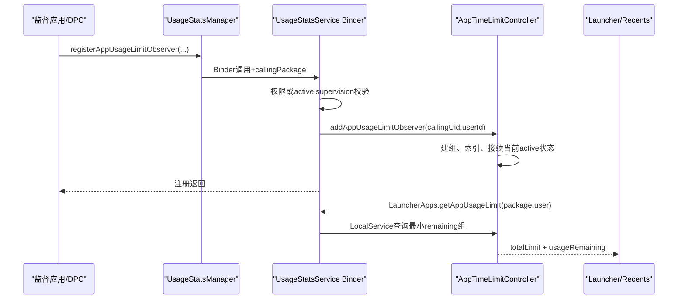
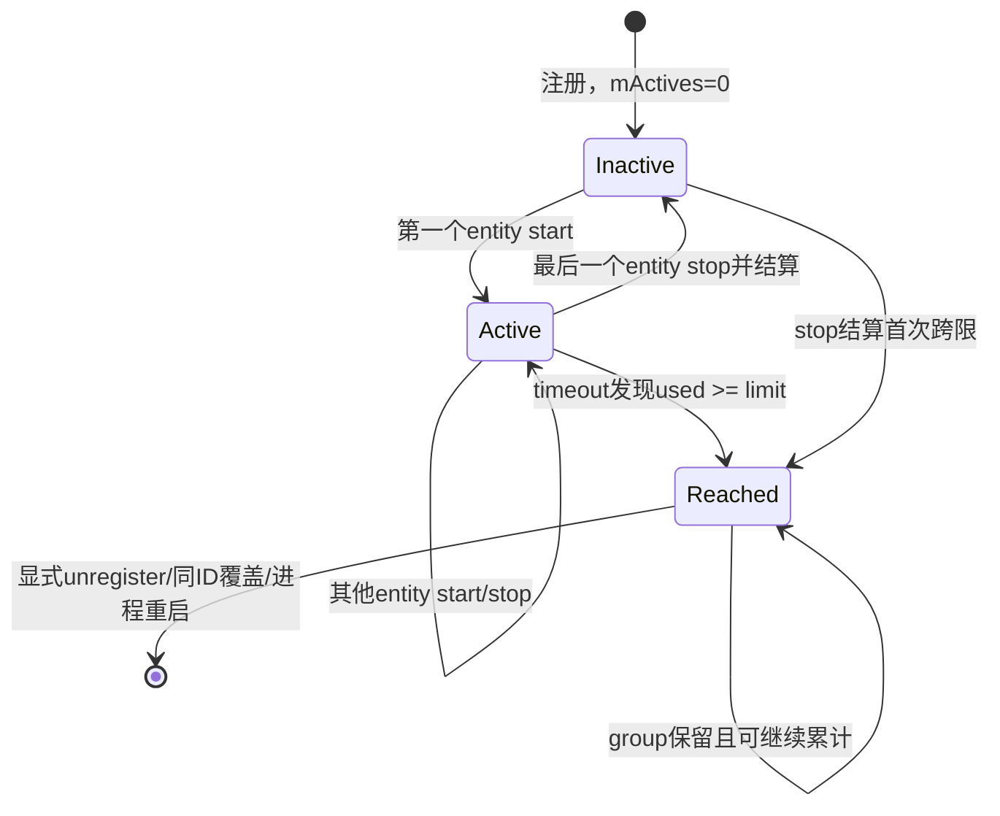
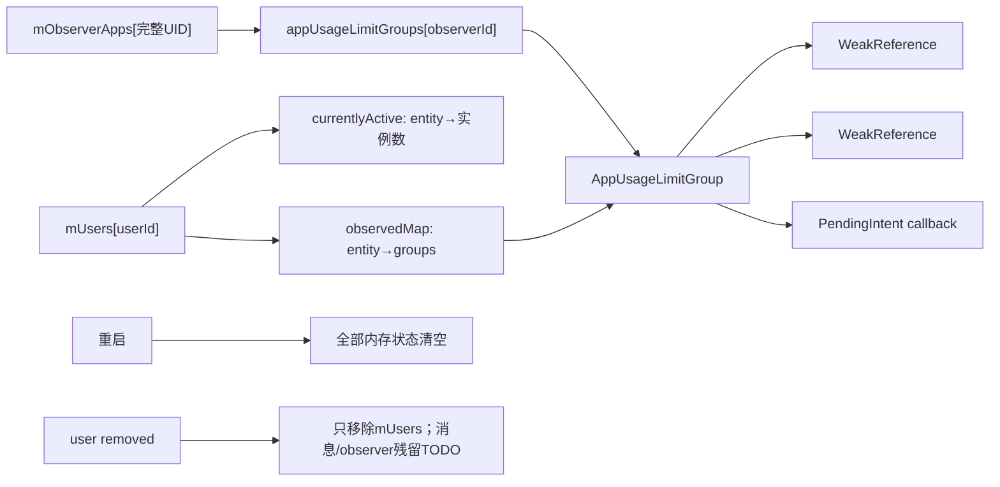

# 第 332 章 Android 企业 App Usage Limit Observer：权限、计时、回调、Launcher 展示与重启边界链

> 源码基线：Android 11 / API 30 / `android-11.0.0_r48`。本章只讨论 `registerAppUsageLimitObserver()` 这一类“可被桌面查询的使用限额”，不要把它与达到后自动删除的普通 App Usage Observer 混为一谈。

## 1. 本章解决什么问题

上一章证明active supervision app可绕过两项权限注册限额。本章继续回答：系统从哪里获得前台事件、多个包如何合计、何时发PendingIntent、达到限额后为何还能被Launcher看到，以及重启后为何消失。

## 2. 三种observer先分开

`AppTimeLimitController` 同时管理 `AppUsageGroup`、`SessionUsageGroup` 和 `AppUsageLimitGroup`。名字相似，但普通usage达到限额后自动remove，session还会等待会话结束，而limit group达到后继续保留。

## 3. 本章入口

应用调用 `UsageStatsManager.registerAppUsageLimitObserver(observerId, observedEntities, timeLimit, timeUsed, callbackIntent)`；这是隐藏 `@SystemApi`，并非任意三方应用的普通SDK能力。

## 4. 五个参数的含义

observerId是调用UID内的组编号；observedEntities是包名或完整token；timeLimit是总额度；timeUsed是调用方已知的历史用量；callbackIntent用于首次跨越额度时通知。

## 5. 为什么需要timeUsed

控制器没有磁盘账本。监督应用可在开机后从自己的持久化数据恢复“已经用了多久”，再把它作为timeUsed注册；系统只从该初值继续累计。

## 6. callback可空的唯一场景

服务端要求 `callbackIntent != null`，除非 `timeUsedMs >= timeLimitMs`。已耗尽的组只需要作为Launcher可见状态存在，不需要再发一次超限回调。

## 7. 最小额度

`AppTimeLimitController.getMinTimeLimit()` 返回60,000毫秒。小于一分钟会抛 `IllegalArgumentException`；这个限制在controller中执行，不只依赖API文档。

## 8. 数量上限

每个完整calling UID最多同时有1000个AppUsageLimit observer。计数只看 `appUsageLimitGroups`，普通usage与session各有自己的1000上限。

## 9. 不验证包是否安装

Binder入口只检查数组非null且非空；controller也未逐项向PMS验证包名。不存在的名称可以登记，只是没有匹配的usage start/stop事件便不会增长。

## 10. 完整调用链



## 11. 第一条授权路径

普通特权调用者必须同时拥有 `SUSPEND_APPS` 与 `OBSERVE_APP_USAGE`。代码使用 `hasPermissions(...两项...)`，少任何一项都不满足。

## 12. 第二条授权路径

若两项权限不齐，服务再调用 `DevicePolicyManagerInternal.isActiveSupervisionApp(callingUid)`；只有上一章所述资源component与active Owner/Admin实时匹配才放行。

## 13. 不是把权限授给包

这是UsageStatsService当前Binder调用上的替代判定，没有修改PackageManager permission flags，也没有让监督应用自动获得其他 `OBSERVE_APP_USAGE` API。

## 14. register和unregister同门

注销接口重复相同权限/监督身份检查。若应用注册后失去supervision身份且没有两项权限，它不能再经公开Binder注销自己的旧组。

## 15. 已注册状态不会自动撤销

代码只在每次注册/注销时鉴权；Owner转移或资源变化没有回调清理 `mObserverApps`。因此身份丢失后，内存中既有limit group可能继续计时和供Launcher查询，直到重启或其他清理。

## 16. callingPackage的作用

权限helper接收callingPackage，用于把包身份与Binder UID/AppOps语义结合；真正的observer归属键仍是 `Binder.getCallingUid()`，不能靠伪造包名取得另一UID的组。

## 17. userId从UID推导

服务用 `UserHandle.getUserId(callingUid)` 决定观察数据所属用户。API没有让调用者任选目标user，因此默认只能给监督应用自身所在user登记限额。

## 18. observer归属是完整UID

`mObserverApps` 是以完整UID为键的SparseArray。Android多用户UID已经编码userId，所以相同appId在user0和user10不会共享observerId命名空间。

## 19. 清除Binder身份

完成校验和参数检查后，服务 `Binder.clearCallingIdentity()`，再调用内部注册。这里是system_server内Java调用，不会因清身份把observer归属改成SYSTEM_UID，因为原callingUid已保存为参数。

## 20. 同observerId覆盖

controller先找到同UID、同observerId的旧 `AppUsageLimitGroup` 并remove，再创建新组。覆盖会清旧entity索引和callback，历史用量不会自动继承，必须由新timeUsed显式带入。

## 21. 覆盖与1000上限的顺序

先remove旧组，再读取当前size判断上限，因此替换已有编号在已经1000组时仍可成功；新增第1001个才抛 `IllegalStateException`。

## 22. 三类observer的ID可重复

三种组分别放在三个SparseArray。同一UID可以让普通usage、session和app usage limit都使用observerId=7，它们不是同一个对象，也不会互相覆盖。

## 23. UserData是什么

每个user有一个 `UserData`，包含 `currentlyActive` 和 `observedMap`。前者记录实体当前有多少实例活跃，后者把实体名称反向映射到所有观察它的组。

## 24. ObserverAppData是什么

每个观察者UID有一个 `ObserverAppData`，保存三种observerId到组对象的映射。它解决“谁创建了组”，UserData则解决“哪个用户的哪些事件会命中组”。

## 25. 双向索引

新组既加入observer UID的SparseArray，也按每个observed字符串加入user的 `observedMap`。事件到来时无需遍历所有DPC和所有组，只查对应名称的列表。

## 26. 当前已有活跃应用怎么办

注册末尾调用 `noteActiveLocked()`。若组内实体已在currentlyActive，组会立即进入active并从“现在”继续计时，而不会追溯这个Activity在注册前已前台多久。

## 27. 多个实体同时已活跃

`noteActiveLocked()` 会为每个命中的实体调用一次 `group.noteUsageStart()`，使 `mActives` 大于1；只有第一次从0变1时记录开始时间和安排timeout。

## 28. observed可包含token

文档允许 `package/token` 形式，例如 `com.example/featureA`。包前台事件使用纯包名；应用内功能需通过reportUsageStart/Stop产生完整token事件。

## 29. token按callingPackage文本命名空间化

UsageStatsService用 `buildFullToken(callingPackage, token)` 拼接，observer数组必须写完全相同的字符串才命中。但复读Binder实现发现report start/stop没有调用verifyCallingPackage；正常framework传本包名，直接Binder调用理论上可伪造文本，不能把此前“绝对不能冒充命名空间”的客户端约定当服务端保证。

## 30. token绑定Activity生命期

reportUsageStart携带Activity Binder；服务记录该Activity对应token。Activity停止/销毁时即使应用忘记reportUsageStop，UsageStatsService也尝试代为停止，避免永久active。

## 31. 重复start保护

以传入Activity Binder的 `hashCode()` 为key，同一key下同一token重复start会抛异常；stop未知或已停止token也会抛异常。r48片段未验证Binder确属calling UID的Activity，因此这是配对保护，不是完整的调用者真实性校验。

## 32. 包前台事件来源

Activity resumed事件进入UsageStatsService后，根据 `mUsageSource` 选择当前Activity package或task-root package，调用 `mAppTimeLimit.noteUsageStart()`。

## 33. 停止事件来源

Activity stopped/destroyed时从 `mVisibleActivities` 移除实例，先补停其token，再根据相同usage source对包调用noteUsageStop。paused只更新状态，不立即停止controller计时。

## 34. 为什么paused不停止

r48把“仍可见但失焦”的Activity与彻底stopped区分。多窗口场景下只用pause作为结束会低估可见使用；controller以可见Activity实例的start/stop为基础。

## 35. usage source会改变名字

若配置为CURRENT_ACTIVITY，观察子Activity包名可命中；默认/另一模式以TASK_ROOT_ACTIVITY计时。限额配置若与设备的usage source假设不一致，可能看起来完全不增长。

## 36. 同一包多个Activity

`currentlyActive` 的value是引用计数。第二个同名实例start只把count加一，不再次通知各组；直到最后一个实例stop，才真正从active移除并通知组停止。

## 37. 组的mActives

它不是Activity实例数，而是该观察组中当前活跃的不同entity命中数。包级重复实例在UserData层被折叠，多个不同包/token才会让组内计数增加。

## 38. 核心计时语义

当mActives从0变1记录 `mLastKnownUsageTimeMs`；当1变0才把区间加入 `mUsageTimeMs`。所以组统计的是任一观察实体活跃的时间并集。

## 39. 不是相加计费

A与B同时前台10分钟，组只增加约10分钟，不是20分钟。A先用5分钟、随后B独占5分钟则合计约10分钟；重叠区间不会重复算。

## 40. 为什么叫sum仍容易误解

API文档写“sum of usages”，实现实际通过mActives压成连续union区间。阅读实现时应把它理解为“该组有至少一个实体活跃的累计墙内时段”。

## 41. 使用哪一种时钟

`getUptimeMillis()` 返回 `SystemClock.uptimeMillis()`。它是单调时钟，避免用户修改日期造成跳变，但设备深度睡眠时间不计入uptime。

## 42. 不依赖UsageStats数据库

controller不查询日/周UsageStats落盘文件，也不按自然日自动清零。它消费实时start/stop并维护内存累计，日配额何时刷新由调用方重新注册决定。

## 43. 初次启动timeout

组从inactive变active时计算 `timeLimit - usageTime - (current-start)`；若仍大于0，就在同一Handler上延迟该剩余时间发送MSG_CHECK_TIMEOUT。

## 44. 为什么还要stop时检查

Handler可能有调度延迟，或短时使用在消息触发前结束。noteUsageStop结算区间后比较跨越前后状态，首次跨越便投递limit-reached消息。

## 45. timeout为何二次确认

MSG到达后重新检查组是否仍有观察实体active，并用当前uptime减lastKnown计算实际使用。若仍未到限额，再按新的remaining重排消息。

## 46. 回调不是精确定时器

Handler消息可能因system_server繁忙而晚执行；`EXTRA_TIME_USED` 可以大于timeLimit。调用方应把限额视作状态通知，不应假定在精确毫秒边界强制中断应用。

## 47. 达限不会自动暂停包

这条链只记账、通知并向Launcher暴露数据；没有调用PackageManager suspend、ActivityTaskManager force-stop或网络阻断。真正限制行为要由受信任产品组件另行执行。

## 48. 达限后的继续累计

回调发生时组不remove；如果实体继续active，之后stop仍会把后续区间加入mUsageTimeMs，但因为此前已不小于limit，不会再次发布跨越回调。

## 49. remaining可为负数

`getUsageRemaining()` 直接做limit-used-activeDelta，没有clamp到0。严重超用时Launcher可能收到负值，客户端不应假设结果总在0到total之间。

## 50. 计时状态机



## 51. AppUsageGroup为何不同

普通 `AppUsageGroup.onLimitReached()` 在通知后调用remove，所以不再计时也不再出现在索引。不能用它的“自动注销”文档推断AppUsageLimitGroup。

## 52. AppUsageLimitGroup没有onLimitReached覆盖

它继承基类实现，只调用listener，不remove。这正对应UsageStatsManager文档：“limit exceeded后不会清除，需要显式unregister”。

## 53. PendingIntent在哪里发送

controller的Handler调用listener；listener在UsageStatsService `onStart()` 中创建，构造空Intent并填extras，随后 `callbackIntent.send(context, 0, intent)`。

## 54. 三个回调extra

超限回调带 `EXTRA_OBSERVER_ID`、`EXTRA_TIME_LIMIT` 和 `EXTRA_TIME_USED`。它不额外携带userId、触发它的具体package或token，也不说明哪个实体最后贡献了时间。

## 55. userId为何没放入Intent

listener签名收到userId，但r48构造Intent时未putExtra。PendingIntent本身由对应user/UID应用创建，调用方仍应依自身实例和observerId管理账本。

## 56. callback取消

如果PendingIntent已被取消，send抛 `CanceledException`，服务只记录warning。组仍处于达限且保留状态，不会因投递失败重新安排通知。

## 57. 回调失败不回滚

系统没有ACK、重试队列或“已送达”持久标记。DPC必须把Launcher查询和自己的恢复逻辑当作补充，不能把收到单次广播当唯一一致性条件。

## 58. callbackIntent被置空的场景

构造group时若 `timeUsed >= timeLimit`，无论调用者传了什么PendingIntent，controller都保存null。这个恢复组永远不会补发“已经超限”通知。

## 59. 初始已超限仍可查询

该组仍加入observer map与observedMap；Launcher查询能获得total和非正remaining。因此“callback忽略”不等于“注册忽略”。

## 60. 初始timeUsed允许大于limit

代码没有上限或非负校验。大于limit会得到负remaining；这可表达严重超额，也说明调用方输入本身是信任边界的一部分。

## 61. 负timeUsed边界

r48 Binder/controller也未显式拒绝负timeUsed。负数会人为增加remaining，尽管Duration API通常可构造负Duration；受信任调用者应自行保证非负，产品测试应覆盖服务端加固需求。

## 62. timeLimit溢出思考

Duration转毫秒及long减法没有额外饱和处理。极端long输入可能导致算术溢出与异常timeout；SystemApi受限不代表可以省去鲁棒性测试。

## 63. 覆盖旧callback的竞态保护

`UsageGroup.remove()` 把旧callback置null，因此已经排队的limit reached消息即便仍执行，也不会发送旧PendingIntent。旧组对象可能短暂存活，但副作用被压低。

## 64. timeout消息是否取消完整

remove只移索引并清callback，没有直接调用 `cancelCheckTimeoutLocked()`。旧timeout将来可能唤醒、检查并走空callback；这是额外无效消息，不会恢复旧组。

## 65. 所有回调在什么线程

AppTimeLimitController使用UsageStatsService的 `mHandler.getLooper()`，即BackgroundThread looper。计时消息和PendingIntent send不在DPC Binder调用线程执行。

## 66. 锁的范围

MyHandler处理消息时持有controller的mLock，并在锁内调用listener，listener又同步send PendingIntent。虽然send通常异步投递，这仍使外部调用位于锁内，是延迟/重入审计点。

## 67. Binder注册线程

register最初运行在system_server Binder线程；清身份后进入controller并短时持锁建索引。它不做磁盘I/O，这也是API能同步返回的原因。

## 68. 事件线程

Activity usage事件通过UsageStatsService报告与队列处理，最终在服务线程路径下进入controller。controller自己的mLock把注册、查询、事件和Handler消息串成一致视图。

## 69. Launcher为何能看见

`LauncherApps.getAppUsageLimit(package,user)` 经LauncherAppsService调用UsageStatsManagerInternal，再进入controller查询；它不是让普通应用直接读取所有DPC限额。

## 70. 查询权限

LauncherAppsService先验证callingPackage、检查能否访问目标profile，再要求调用UID是当前Recents应用；否则抛SecurityException。这里的“Launcher”实质是系统认可的Recents角色调用者。

## 71. 查询不按设置者过滤

controller从目标user的observedMap收集所有 `AppUsageLimitGroup`，无论由哪个合格observer UID设置。Launcher看到的是该包最紧迫的有效展示结果。

## 72. 多个组如何选择

若一个包属于多个limit group，遍历后比较 `getUsageRemaining()`，返回剩余最小的组，而不是total最小、最早注册或observerId最小。

## 73. total来自获胜组

返回对象同时携带获胜组的 `getTotaUsageLimit()` 与remaining。不要把某组最小remaining和另一组最小total拼在一起展示。

## 74. 活跃中查询实时扣减

若mActives>0，remaining会减去 `uptime-now - lastKnownUsageTime`，不必等stop或timeout先结算，所以Launcher刷新时能看到连续下降。

## 75. 查询会创建UserData

`getAppUsageLimit()` 调用 `getOrCreateUserDataLocked()`；不存在的user条目也会被创建，然后因无observedMap返回null。这是轻微内存副作用，不是纯粹无状态查询。

## 76. 包必须精确命中

查询以纯packageName查observedMap，并再次扫描group.mObserved确认相等。只观察 `package/token` 的组不会因为前缀相同就出现在该包的Launcher限额查询中。

## 77. 为什么再次检查相等

usageGroups本已来自key对应列表，二次扫描属于防御/确认类型过滤；真正关键的过滤是 `instanceof AppUsageLimitGroup`，普通usage和session不会泄漏到Launcher结果。

## 78. ArraySet去重组对象

候选先放入ArraySet，避免同一group因异常重复索引被比较多次。它不会对observer内容做规范化，也不会合并语义相同的不同组。

## 79. Launcher显示不是强制状态

`AppUsageLimit` 只有total和remaining，没有“应用已被暂停”位。Recents/Launcher可据此显示沙漏、剩余时间或禁用入口，但具体UX和拦截不由controller决定。

## 80. 查询与达限回调可以竞态

Launcher查询、stop结算和timeout回调都受mLock保护，单次结果一致；但锁释放后状态可继续增长。UI展示是瞬时快照，不能被当作事务证据。

## 81. observer不会落盘

UsageStatsManager文档明确usage limits不持久化，controller也只有内存SparseArray/ArrayMap，没有AtomicFile、Settings或UsageStatsDatabase写入。

## 82. system_server重启影响

服务重建时mUsers与mObserverApps重新为空，所有组、当前active和已用时间都丢失。调用方必须在boot后重新注册并提供自己的timeUsed。

## 83. 普通设备重启影响

同样全部清空。即使UsageStats历史事件仍在磁盘，controller不会回放数据库自动重建当日额度。

## 84. 谁负责日界线

API没有midnight alarm或timezone observer。监督应用决定按本地日、滚动24小时、工作班次还是其他周期刷新，并在边界覆盖observerId或先注销再注册。

## 85. 修改时区的边界

单次运行计时基于uptime不受时区变化影响；但调用方若按日历日重置，时区/夏令时策略完全由其持久化和调度实现决定。

## 86. user removed处理

`onUserRemoved(userId)` 只从mUsers删除UserData，并留有TODO“移除inflight delayed messages”。它没有遍历mObserverApps删除属于该user的组。

## 87. user removed后的陈旧组

group弱引用旧UserData，但ObserverAppData仍强持有group。延迟消息和observer计数可能残留；弱引用何时清空取决于GC，源码没有完成式清理保证。

## 88. observer app卸载处理

代码注释明确mObserverApps entry当前不移除，假设能注册的app数量小且固定。本树未见按UID/package removed主动清理这些entry；这是长期运行设备的内存与配额边界。

## 89. unregister的userId未参与查找

remove方法接收userId但实际只按完整requestingUid和observerId取得group。由于calling UID已经编码user，正常Binder路径不会跨用户误删；参数更多是接口对称而非过滤条件。

## 90. 数据结构与生命周期图



## 91. observed重复项

注册路径没有去重数组。相同字符串重复会让同一group多次加入该entity的list，start/stop循环也会多次碰同一group；多数情况下mActives对称增减仍只结算一个union区间，但状态与日志更脆弱。

## 92. observed中的null

r48没有逐项NonNull/格式校验，ArrayMap可接收null键；正常事件名称通常非null，不会命中。受限调用方仍应拒绝null，服务端加固也应补元素验证。

## 93. overlapping start修正

若带timeAgo的start时间早于上一次usage结束，代码把start抬到 `mLastUsageEndTimeMs` 避免双计；注释承认一个罕见副作用：某些嵌套使用可能被漏计。

## 94. reportPastUsageStart的信任边界

它把currentTime-timeAgo传入controller；所读r48片段既未见timeAgo非负/上界校验，也未核验callingPackage或Activity Binder归属。伪造包名还会与Activity销毁时按真实event package补stop不一致，可能留下active token；产品加固应同时校验身份、Binder、字符串和时间。

## 95. mActives异常自愈

start过多会把mActives压到observed数组长度并记录error；stop过多会归零并记录active实体快照。它优先恢复可继续运行状态，而非让system_server崩溃。

## 96. unregister不是删除历史

remove会从observedMap与observer SparseArray脱钩并清callback；它不会把已用时写到任何地方。若稍后重建，历史只能由调用方保存后作为timeUsed带回。

## 97. dump诊断

UsageStatsService dumpsys可打印每user currently active/observed entities，以及每observer UID三类group的limit、used、lastKnown、mActives和observed数组。

## 98. dump读数的时效

active区间尚未stop时，dump打印的mUsageTimeMs可能不含当前区间；Launcher getUsageRemaining会临时减activeDelta。两处读数看似不同不一定是bug。

## 99. 锁内WeakReference的意义

group不强行维持UserData/ObserverAppData生命周期，但外层maps通常仍持有它们。WeakReference不是完整cleanup机制，尤其ObserverAppData反向强持group时仍要显式remove。

## 100. 最小注册代码

```java
usageStatsManager.registerAppUsageLimitObserver(
        42,
        new String[] { "com.example.video" },
        Duration.ofMinutes(60),
        Duration.ofMinutes(restoredUsedMinutes),
        callbackPendingIntent);
```

## 101. union计时伪代码

```java
if (firstObservedEntityStarted) start = uptime;
if (lastObservedEntityStopped) used += uptime - start;
remaining = limit - used - (active ? uptime - start : 0);
```

## 102. 常见误解一：系统自动每天清零

错误。controller没有日历周期和持久化；DPC决定周期、保存账本并在重启/日界线重新注册。

## 103. 常见误解二：两个应用同时用会双倍扣时

错误。mActives只控制0→1和1→0边界，统计观察集合的活跃时间并集，不按活跃实体数量乘算。

## 104. 常见误解三：达到限额自动封禁

错误。这里只有callback和Launcher数据，没有suspend/force-stop。策略执行者必须另外调用有权限的控制接口并处理失败。

## 105. 常见误解四：超限后observer自动删除

错误的是AppUsageLimitGroup；它刻意保留。自动remove的是普通AppUsageGroup，两套API文档也明确不同。

## 106. 常见误解五：重启后UsageStats会恢复额度

错误。UsageStats历史数据库与AppTimeLimitController账本分离；DPC必须用自身持久化timeUsed恢复。

## 107. 安全基线

只给稳定、最小权限、受签名保护的监督组件开放调用；校验observed实体、非负timeUsed和合理上限；PendingIntent使用明确目标和不可被第三方替换的身份设计。

## 108. 可靠性基线

持久保存周期ID、observerId、total、used与最后更新时间；开机、system_server重启感知、Owner迁移、时区变化和DPC升级均做幂等重建，并把callback视为可丢通知。

## 109. 测试基线

至少覆盖单包、两包重叠、多个Activity、token死亡补停、初始已超限、callback取消、同ID覆盖、1000上限、Launcher多组最小remaining和重启恢复。

## 110. macOS只读结论上限

本地源码能证明AOSP r48数据结构与控制流，不能证明具体OEM的Recents如何展示、DPC如何保存timeUsed、产品是否实际暂停应用，或运行时事件序列是否完整。

## 111. 本章知识检查

回答：为何要同时传timeLimit和timeUsed？组内两个包并发如何扣时？谁能注册、谁能查询？callback失败会重试吗？达到限额和设备重启分别怎样影响group？

## 112. macOS 只读练习一：追注册授权

从UsageStatsManager的SystemApi追到UsageStatsService Binder入口，列出双权限路径、supervision替代路径、callingUid推userId、参数检查和clearCallingIdentity顺序；只读不编译。

## 113. macOS 只读练习二：画union时间线

纸面设A在0—10分钟active、B在5—15分钟active，逐行模拟currentlyActive、mActives、lastKnown和usageTime，证明最终是15分钟而非20分钟。

## 114. macOS 只读练习三：核对达限差异

并排阅读AppUsageGroup与AppUsageLimitGroup的onLimitReached/remove，记录callback后observedMap、SparseArray、Launcher查询和后续计时的差异。

## 115. macOS 只读练习四：推演重启恢复

假设60分钟限额已用25分钟，写出重启前dump、重启后空状态、DPC用timeUsed=25分钟重注册及已用70分钟时callback=null的结果；Mac上无需真正启动system_server。

## 116. 练习答案要点

授权=两权限同时具备或active supervision；A/B重叠区间只算一次；普通usage达限remove而limit group保留；重启清空，调用方用持久timeUsed重建；初值已超限不回调但Launcher仍可查。

## 117. 复读修正一：文档的sum不是并发求和

首次草稿容易把“sum of usages”写成每个包各自UsageStats相加。重读 `mActives++ == 0` 与 `--mActives == 0` 后，已改为集合活跃区间的并集累计。

## 118. 复读修正二：limit reached不清组

普通AppUsageGroup覆盖onLimitReached并remove；AppUsageLimitGroup没有覆盖。因此本文统一改为“首次跨限通知、组继续存在”，也说明remaining可能继续变负。

## 119. 复读修正三：恢复与token信任都不能想当然

源码与API文档都明确不持久化，timeUsed只是调用方注入的恢复初值；同时report token的Binder端未见verifyCallingPackage/Activity归属检查。本文已删除“系统自动恢复”及“服务端绝对阻止命名空间冒充”两项过强结论。

## 120. 本章结论与下一章

App Usage Limit Observer是一套system_server内存账本：权限或监督身份负责建组，Activity/token实时事件按观察集合的活跃并集累计，首次跨限发可丢PendingIntent，组保留供Recents查询最小remaining；它既不自动封禁，也不跨重启保存。下一章将专门比较普通App Usage Observer与Usage Session Observer，解释自动注销、会话阈值、session-end回调及连续使用边界。
