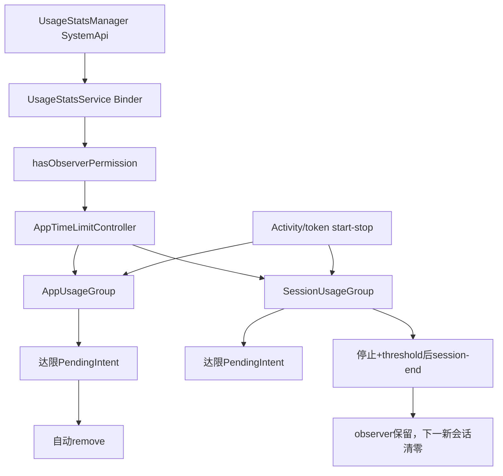
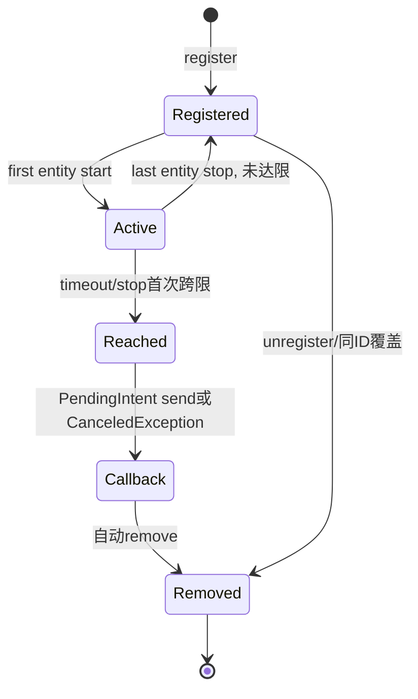
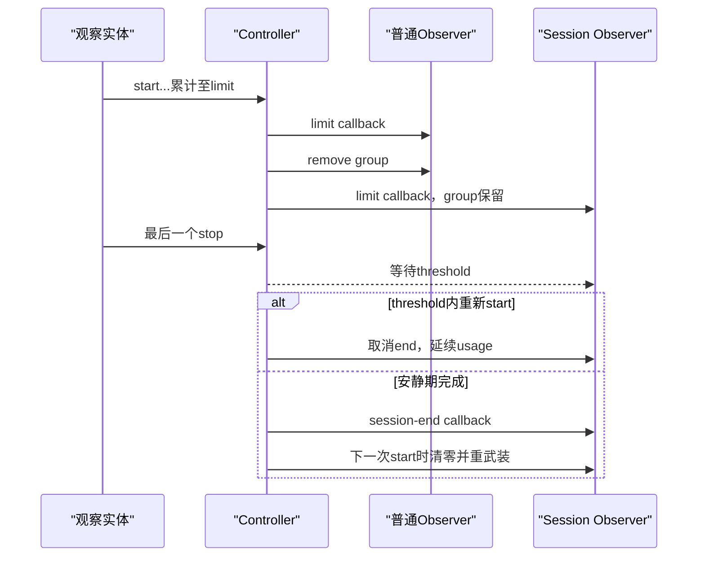

# 第 333 章 Android App Usage Observer 与 Usage Session Observer：权限、自动注销、会话阈值与双回调边界链

> 源码基线：Android 11 / API 30 / `android-11.0.0_r48`。两类observer共用 `AppTimeLimitController` 的实时事件与并集计时，但生命周期完全不同：普通observer是一次性，session observer可跨多个会话反复触发。

## 1. 为什么紧接上一章比较

三个API名字只差几个词，最常见错误却是把上一章可供Launcher查询、达限保留的AppUsageLimitGroup套到普通AppUsageGroup或SessionUsageGroup。本章用相同输入逐项对照差异。

## 2. 普通observer入口

`registerAppUsageObserver(observerId, observedEntities, timeLimit, timeUnit, callbackIntent)` 观察一个实体集合，累计到额度后发送一次PendingIntent并自动注销。

## 3. session observer入口

`registerUsageSessionObserver(sessionObserverId, observedEntities, timeLimit, sessionThresholdTime, limitReachedCallback, sessionEndCallback)` 增加“会话间隔”与第二个回调，并保留observer等待下一会话。

## 4. 共同实体模型

observedEntities均可含包名或 `package/token`。底层按字符串精确索引，不解析包名前缀、不验证包已安装，也不把token自动折算为包级使用。

## 5. 共同计时模型

两者继承UsageGroup：第一个观察实体active开始区间，最后一个停止才结算。多个实体重叠统计活跃时间并集，而不是按并发数量倍增。

## 6. 第一项核心差异

普通AppUsageGroup在 `onLimitReached()` 调listener后立即remove；SessionUsageGroup不覆盖该方法，所以达到限额后仍在双向索引中。

## 7. 第二项核心差异

普通observer只提供超限回调。session observer还可在达限后的使用停止并安静达到threshold时发送session-end回调。

## 8. 第三项核心差异

普通observer一生只跨限一次。session observer在新会话开始时清零usage，因而同一个sessionObserverId可在多次会话中反复触发limit与end。

## 9. 与AppUsageLimit再划界

这两类都没有timeUsed恢复参数，也不被LauncherApps.getAppUsageLimit查询。上一章limit group才负责可见剩余额度；三者都只在内存中。

## 10. 总体调用与状态图



## 11. hasObserverPermission第一类

SYSTEM_UID直接通过。system_server内部或系统UID调用无需再查manifest permission与Owner状态。

## 12. Owner替代路径

若DPM internal判定callingUid是带 `USES_POLICY_PROFILE_OWNER` 能力的active admin，则通过。DPMS对这个特殊policy的实现接受DO、普通PO和组织所有PO，不要求上一章的default supervision component。

## 13. 不是普通active admin

`USES_POLICY_PROFILE_OWNER` 的常量值是特殊内部角色判断；并非任意DeviceAdminReceiver只要在XML声明某个policy便能通过。DPMS实际检查Owner身份。

## 14. 权限路径

非SYSTEM、非合格Owner时，必须持有 `OBSERVE_APP_USAGE`。与App Usage Limit不同，这里不要求同时拥有SUSPEND_APPS。

## 15. callingPackage没有参与该门

register参数虽带callingPackage，`hasObserverPermission()` 只看Binder UID、DPM角色和calling permission，不调用verifyCallingPackage。正常framework传本包名，但它不是本接口授权主键。

## 16. register与unregister一致

普通和session的注册/注销都先调用hasObserverPermission。失去Owner角色且无permission后，应用不能经Binder注销旧observer，但既有内存组不会因角色变化自动清理。

## 17. user作用域

服务从callingUid推导userId，没有跨用户参数。DO位于user0便观察user0事件；工作资料PO位于profile user便观察资料用户事件。

## 18. observer归属

底层以完整callingUid和observerId联合定位。不同用户同appId的完整UID不同；另一个应用即使猜中observerId也不能覆盖或注销该组。

## 19. 清身份仍保留归属

Binder层保存callingUid/userId后clearCallingIdentity，再传给controller。组不会错误记到SYSTEM_UID名下。

## 20. 普通参数检查

observed数组必须非null非空，callback必须非null；controller再要求timeLimit至少60秒。数组元素格式、重复、null和包安装状态未逐项验证。

## 21. session参数检查

observed非空，limitReachedCallback非null，sessionEndCallback允许null；controller同样只强制timeLimit至少60秒。

## 22. threshold文档与实现落差

API文档称sessionThresholdTime必须非负，但r48 Binder与 `addUsageSessionObserver()` 未见小于0检查。负值进入Handler延迟与新会话比较，属于应修补的服务端参数缺口。

## 23. callback的必要性不同

session的limit回调必需，因为它定义“本会话已达限”；end回调可空，表示调用方不关心会话何时正式结束。observer行为与清零逻辑仍照常运行。

## 24. 1000上限分别计数

每完整UID最多1000个普通组、另有1000个session组。两类SparseArray分离；同一个数字ID可各注册一组而不冲突。

## 25. 同ID覆盖顺序

各类型都先remove同类型旧组，再按当前size检查上限并创建。覆盖不会继承旧usage、last end或callback。

## 26. 跨类型不会覆盖

registerAppUsageObserver(7)不会删除SessionUsageGroup(7)，反之亦然。注销也只查自己的SparseArray。

## 27. 新组加入两处

组一端存入ObserverAppData的ID map，另一端按每个entity加入UserData.observedMap。remove必须同时解除两端，避免事件继续命中已注销组。

## 28. 已active实体

注册时 `noteActiveLocked()` 只从当前uptime开始接续，不补算注册前已活跃的历史。测试所谓“already running partially counted”正验证这一点。

## 29. 普通组字段

AppUsageGroup只继承observerId、observed、timeLimit、usageTime、actives、时间戳、弱引用和limit callback，没有额外会话字段。

## 30. session额外字段

SessionUsageGroup增加 `mNewSessionThresholdMs` 与 `mSessionEndCallback`。阈值控制新旧会话切分，也决定达限后停止多久才通知end。

## 31. Activity事件入口

ACTIVITY_RESUMED按配置选择current package或task-root package调用start；ACTIVITY_STOPPED/DESTROYED调用stop。PAUSED不结束计时，多窗口下仍可保持可见使用。

## 32. token事件入口

应用reportUsageStart/Stop形成 `callingPackage/token` 字符串；Activity销毁会尝试补stop。上一章已指出r48 Binder缺少callingPackage与Activity Binder归属校验，不应把客户端约定误作强服务端隔离。

## 33. currentlyActive引用计数

同一实体多个Activity实例只在首次start通知group，最后一个stop才通知group。中间实例变化只改变UserData中的Integer count。

## 34. mActives的作用

组内多个不同实体活跃时mActives大于1；只有0→1记录起点/安排timeout，1→0结算/取消timeout。这是两类observer共同的并集计时基础。

## 35. uptime时间基准

所有间隔用SystemClock.uptimeMillis，用户改墙钟不会影响，但深睡不累计。session threshold也是uptime差，不是日历时间差。

## 36. timeout安排

首次active按remaining安排MSG_CHECK_TIMEOUT；消息到时再次确认组仍有entity active并按实际uptime计算。未到限则用新remaining重排。

## 37. stop补检

最后一个entity停止时结算usage。若结算前低于limit、结算后达到或超过，post limit-reached消息；这弥补短会话在timeout前结束的情况。

## 38. 一次跨限判定

stop先保存 `limitNotCrossed = usage < limit`，只有由低到高才通知。active timeout也在remaining>0基础上触发，防止同一session反复limit回调。

## 39. 回调可能晚到

Handler looper繁忙会延迟消息，EXTRA_TIME_USED可大于limit。observer是异步通知机制，不是精确计时器，更不是实时强制执行器。

## 40. 回调在哪发送

UsageStatsService listener在BackgroundThread looper上构造Intent并PendingIntent.send；controller Handler处理时仍持mLock。CanceledException只记warning。

## 41. 普通回调extras

带observerId、原timeLimit和实际timeUsed，不带触发包、userId或时间戳。观察多个实体时无法从回调直接知道最后贡献者。

## 42. 普通组remove顺序

`AppUsageGroup.onLimitReached()` 先调用super发送listener，再调用remove。PendingIntent即使取消，listener自行catch后返回，remove仍会执行。

## 43. remove做了什么

从每个observedMap列表删除group、列表空则删key；从observer UID的appUsageGroups删除ID；清limit callback以压制竞态旧消息。

## 44. remove没有做什么

它不保存usage、不撤销已投递PendingIntent，也未显式移除已排队timeout。旧timeout稍后可能无效唤醒，但组已无callback和索引。

## 45. active中remove的结果

达限timeout可在应用仍active时remove组。之后实体stop仍会更新currentlyActive，但observedMap不再含该组，因此不会再结算该组或通知。

## 46. 普通observer适用场景

适合“从现在开始累计X分钟后提醒一次”的一次性监测。若要再次提醒，接收方需要重新注册，并接受重注册前间隙无法追溯。

## 47. 普通observer不提供timeUsed

重启或进程恢复后不能把旧值注入同一组。若业务需要跨重启严格累计，应由调用方调整新timeLimit或改用更适合的自有账本/limit API。

## 48. 普通组不会供Launcher查询

getAppUsageLimit只筛 `instanceof AppUsageLimitGroup`。普通组即使即将到限，Recents也拿不到total/remaining。

## 49. 取消PendingIntent的后果

超限回调丢失且group仍自动remove，不会重试。一次性observer尤其需要接收方保持PendingIntent有效，或用其他状态源补偿。

## 50. 普通observer状态机



## 51. session从哪里判断新会话

每次mActives为0时收到start，先计算 `startTimeMs - mLastUsageEndTimeMs > mNewSessionThresholdMs`。严格大于threshold才清零usage。

## 52. 小于threshold

停止后很快重新start，gap小于或等于threshold，沿用原usage；这被视为同一session，先前片段继续累计。

## 53. 大于threshold

重新start与上次最后stop相隔严格超过threshold时，`mUsageTimeMs = 0`，新会话从这次start重新计时。

## 54. 等于threshold边界

比较使用 `>` 而不是 `>=`，所以纯算法上恰好等于仍属旧会话；但session-end消息正好也安排在threshold，Handler与新start先后会决定end是否已经送出，边界需测试而非凭文档猜。

## 55. 每次start取消end消息

在调用super.noteUsageStart前执行 `cancelInformSessionEndListener(this)`。若安静期尚未到，重新使用会撤销待发session-end。

## 56. 达限前停止不会安排end

noteUsageStop只有在最后entity停止且 `mUsageTimeMs >= mTimeLimitMs` 时才post session-end。普通短会话低于limit，即使安静很久也没有end回调。

## 57. 达限时仍active

timeout先发limit回调，但不安排end，因为会话尚未停止。最后一个entity stop后才以threshold延迟安排MSG_INFORM_SESSION_END。

## 58. stop结算时刚达限

super.noteUsageStop先post limit-reached，再由SessionUsageGroup检查已达限并post delayed end。threshold为正时顺序清晰；为0/负的非法边界应专测消息排序。

## 59. session-end extras

UsageStatsService的onSessionEnd只放observerId和timeUsed，不放timeLimit。接收方需用自己的配置知道阈值与限额。

## 60. session-end callback可空

controller仍安排并处理消息，listener看到null立即return。会话清零机制不依赖应用实际收到end通知。

## 61. end后observer仍保留

`onSessionEnd()` 只调用listener，不remove、也不立刻清usage。清零发生在下一次start确认gap大于threshold时。

## 62. 为什么不在end消息里清零

当前实现把“是否新会话”的最终判断留到下一次usage start，因此即使end回调丢失或没有回调对象，下一次也可根据lastUsageEndTime分段。

## 63. 同会话limit只发一次

达到后usage保持>=limit，后续短暂停/恢复不清零，base UsageGroup不会再次跨限。直到gap足够大、下一start清零，才重新武装limit timeout。

## 64. 新会话可重复双回调

测试验证同一SessionUsageGroup在第二个会话再次触发limit和end，且observer始终存在。它更像可重复状态机而非一次性闹钟。

## 65. threshold不是最长session时长

它只定义停止后的安静间隔。应用连续使用数小时不会因threshold自动切会话；必须先让组mActives归零。

## 66. 多实体延迟会话结束

A停止但B仍active时mActives不为0，不记录最后会话结束，也不安排end。只有组内全部观察实体都停止才开始threshold倒计时。

## 67. token漏stop的影响

若token因异常路径一直active，session永远不进入mActives=0，end回调不会发生，新会话也不能清零。Activity销毁补stop与服务端身份校验因此很关键。

## 68. past start重叠修正

若带timeAgo的start早于前一段结束，基类把start抬到lastUsageEnd避免重复计算；注释承认嵌套片段可能因此漏计。

## 69. Handler延迟竞态

安静期已过但end消息尚未被繁忙looper处理时，新start会先cancel消息并清零，可能使理论上应到的end通知消失。源码没有持久deadline或补发逻辑。

## 70. threshold为负的实际风险

gap几乎总会大于负数，下一start总清零；sendMessageDelayed接收负delay通常立即入队。文档虽禁止，服务缺校验意味着直接Binder调用可产生反直觉快速end。

## 71. threshold极大

极大正值会让多个相隔很久的片段仍归同一session，并安排很远的end消息。没有产品级上限，可能形成长期delayed message。

## 72. session callback取消

limit或end PendingIntent取消都只写warning；observer仍保留。limit取消后，当前session不会再重发limit，下一新会话才有新机会。

## 73. 覆盖session组

同ID重注册会清旧limit和end callback、解除索引并创建新组。remove也把mSessionEndCallback置null，已排队end消息执行时不会发送旧目标。

## 74. end消息显式取消

新start会remove `MSG_INFORM_SESSION_END`；显式remove本身没有调用cancel helper，但把end callback置null。旧消息仍可能无效执行。

## 75. stop时间记录

每次组从active变inactive，基类更新mLastUsageEndTimeMs。即使当前session未达limit，这个时间也用于下一start决定是否清零。

## 76. 初始last end为0

首次start若设备uptime已经大于threshold，会执行“新会话清零”，但初始usage本来就是0，因此没有实质影响；之后再按正常start安排timeout。

## 77. 注册时实体已active的session

noteActiveLocked用当前uptime作为start，SessionUsageGroup可能基于lastEnd=0判为新会话。注册前的前台时间不会累计。

## 78. session没有timeUsed恢复

设备或system_server重启后无法恢复“当前会话已用多少、上次何时结束”。调用方只能重新定义一个新会话，或自行调整新limit表达剩余额度。

## 79. user removal边界

controller只移除mUsers对应UserData，未清ObserverAppData与inflight delayed messages，源码留TODO。session的长threshold消息使这一缺口更值得关注。

## 80. UID卸载边界

mObserverApps条目按注释不主动移除，假设观察者app很少且固定。observer app卸载/UID复用的完整清理在此类中没有保证。

## 81. dump如何区分

dumpsys usage stats会分别列App Usage Groups与Session Usage Groups。session额外打印lastUsageEndTime与newSessionThreshold，可用来诊断为何尚未切新会话。

## 82. dump的used可能暂时偏小

active区间只在stop或timeout结算；dump直接打印mUsageTimeMs，不像Launcher limit query那样动态减activeDelta。分析现场要同时看mActives与lastKnownUsage。

## 83. callback持锁边界

MyHandler持controller mLock调用listener，listener在锁内PendingIntent.send。发送异常被捕获，但锁占用时间和未来实现的重入仍值得性能审计。

## 84. 这两类不强制限制应用

名字里的limit只决定通知时刻，没有suspend、force-stop或启动拦截。收到回调后是否显示提醒、改变策略由有权组件自己完成。

## 85. 普通observer与session的权限相同

二者都用hasObserverPermission；active supervision不是必要条件，所有DO/PO均可走Owner替代。不要把第332章更严格的双权限/监督门复制过来。

## 86. Manifest注解不是完整运行判定

API注解写RequiresPermission(OBSERVE_APP_USAGE)，运行服务还额外允许SYSTEM与Owner。反过来，注解不会替代Binder校验。

## 87. 文档“profile owner”的精确化

公开注释只说profile owner，但DPMS特殊policy实现明确“DO always has PO power”，还包含organization-owned PO。源码结论比一句Javadoc范围更宽。

## 88. observed重复与null

与上一章相同，数组不去重、不逐项校验。重复key可让同组多次进入list并对称改变mActives，null通常永远不命中；安全实现应在入口规范化。

## 89. app usage source配置

观察包级事件时必须知道系统按current activity还是task root报告。`getUsageSource()` 本身也要求hasObserverPermission，source在boot确定且本boot不变。

## 90. 两类行为对照图



## 91. 选择普通observer的条件

只需一次累计提醒、不需要Launcher展示、不关心会话结束，并能在回调丢失后由业务补偿时，普通observer模型最简单。

## 92. 选择session observer的条件

需要识别连续使用、在达限后知道用户何时停止，并希望相同配置跨多个会话重复生效时，session observer更匹配。

## 93. 不应拿session做日额度

长安静间隔会自动清零，重启也丢状态；它适合连续会话而非严格自然日总量。日额度更应由AppUsageLimit配合DPC持久账本。

## 94. threshold设计建议

阈值太短会把短暂切换切成新会话，太长会延迟end并合并独立使用。应结合多窗口、Activity跳转、锁屏和产品提醒语义选择。

## 95. PendingIntent设计建议

使用显式组件、稳定requestCode和合适可变性；接收后以observerId查自己保存的配置，不信任Intent提供触发包，因为系统根本不提供该字段。

## 96. 回调接收幂等

虽然同一session按代码只跨限一次，进程恢复、重注册或PendingIntent接收器重入仍可能重复业务动作。把“显示提醒/上报服务端”设计为幂等。

## 97. 角色变化恢复

Owner清除后既有observer可能仍运行但调用方无法注销。产品应在退管前显式remove所有ID，并在接管/转移后重建所需组。

## 98. system_server恢复

重启后全部observer消失且无系统广播逐组告知。调用方需要在可靠boot入口重注册；普通/session均没有timeUsed字段可精确续接。

## 99. 单元测试揭示的契约

现有AppTimeLimitControllerTests覆盖他包不触发、timeout、already running、最大数量、最小limit、继续会话、新会话和重复会话，是理解边界的最好伴读材料。

## 100. 普通注册示例

```java
usageStatsManager.registerAppUsageObserver(
        10, packages, 30, TimeUnit.MINUTES, reachedIntent);
```

## 101. session注册示例

```java
usageStatsManager.registerUsageSessionObserver(
        20, packages, Duration.ofMinutes(30), Duration.ofMinutes(2),
        reachedIntent, sessionEndIntent);
```

## 102. 常见误解一：所有PO特权都要求default supervisor

错误。普通与session用 `USES_POLICY_PROFILE_OWNER` 特殊角色门，DO/PO均可；只有AppUsageLimit的替代路径要求active supervision。

## 103. 常见误解二：session每次stop都会end

错误。只有该session先达到timeLimit，且最后实体stop后安静满threshold，才安排end回调。

## 104. 常见误解三：end回调立刻清零

错误。onSessionEnd不改usage；下一次start发现gap严格大于threshold才清零。

## 105. 常见误解四：普通observer达限后还能查询

错误。它自动remove，也不属于Launcher查询类型。只有业务自己保存回调结果。

## 106. 常见误解五：文档说非负所以服务一定拒负threshold

错误。r48所读服务与controller未实现该检查；API契约和服务端防御不是同一事实。

## 107. 安全基线

校验每个entity、threshold非负且有合理上限，修补token上报callingPackage/Activity归属；Owner退管前注销，PendingIntent使用明确且不可劫持的目标。

## 108. 可靠性基线

把callback视为可丢；记录所有已注册ID并能幂等重建；监控system_server重启、DPC升级、用户删除和角色转移；不要把observer当持久账本。

## 109. 测试基线

覆盖重叠实体、多Activity、gap小于/等于/大于threshold、threshold 0/负值、Handler延迟、callback取消、同ID覆盖、达限时仍active及跨两个新会话重复回调。

## 110. macOS只读结论上限

源码可证明AOSP r48状态机，不能证明OEM事件source、实际Handler负载、DPC收到回调后的强制动作或不同Launcher UX；这些需目标设备运行验证。

## 111. 本章知识检查

回答：普通与session授权谁可通过？普通达限后为何消失？session何时发end？何时清零？gap恰好等于threshold怎样理解？callback取消和重启各有什么后果？

## 112. macOS 只读练习一：对照授权

从两个SystemApi追到hasObserverPermission，再进入DPMS的USES_POLICY_PROFILE_OWNER特殊分支，列出SYSTEM、DO、PO、普通active admin、持permission应用的结果；不编译。

## 113. macOS 只读练习二：模拟一次性组

纸面模拟注册、两段usage、timeout达限、PendingIntent取消和remove，逐步记录observedMap、appUsageGroups、callback与后续stop是否还能命中。

## 114. macOS 只读练习三：模拟会话阈值

设置limit=10分钟、threshold=2分钟，分别让gap为1、2、3分钟，按源码的严格大于比较填写usage是否清零、end消息是否取消及下一次limit何时发生。

## 115. macOS 只读练习四：复核测试证据

阅读AppTimeLimitControllerTests中ContinueSession、NewSession、RepeatSessions和Timeout用例，把断言对应到SessionUsageGroup的start/stop/onSessionEnd代码；Mac无需执行atest。

## 116. 练习答案要点

权限=SYSTEM或DO/PO特殊角色或OBSERVE；普通callback后remove；session仅达限后最后stop才等threshold发end；gap严格大于threshold的下一start清零；取消不重试，重启全丢。

## 117. 复读修正一：Owner范围比Javadoc宽

初看API注释会只写Profile Owner；下钻DPMS发现USES_POLICY_PROFILE_OWNER明确包含Device Owner与组织所有PO。正文已按运行实现修正。

## 118. 复读修正二：threshold非负不是已实现校验

Duration参数与文档不能证明服务端拒绝负值。复读Binder和controller后确认r48没有对应if，正文将其列为参数加固缺口而非正常能力。

## 119. 复读修正三：session-end并不重置状态

真正清零在下一次start的gap比较，不在onSessionEnd Handler消息中；这解释了observer为何可保留，也暴露Handler延迟下end被新start取消的竞态。

## 120. 本章结论与下一章

普通App Usage Observer是达到额度即回调并自动删除的一次性组；Usage Session Observer则以停止间隔划分会话，达限后再等待threshold发送end，并在下一新会话start时清零复用。两者共享Owner/OBSERVE授权、实时并集计时、可丢PendingIntent与不持久化边界。下一章转入Permitted Accessibility Services企业策略，追允许名单聚合、系统服务例外、Settings启用门与已启用服务的收敛边界。
