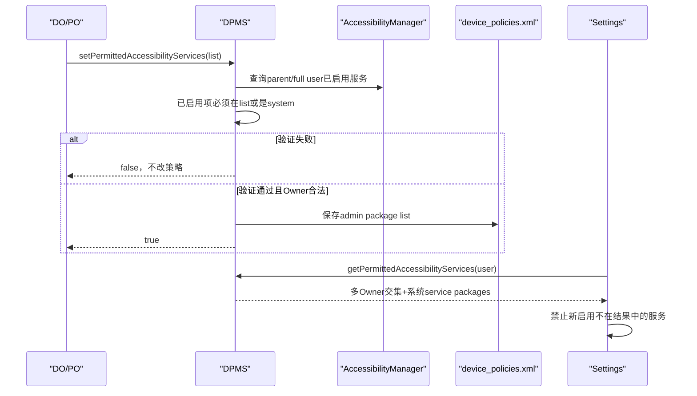
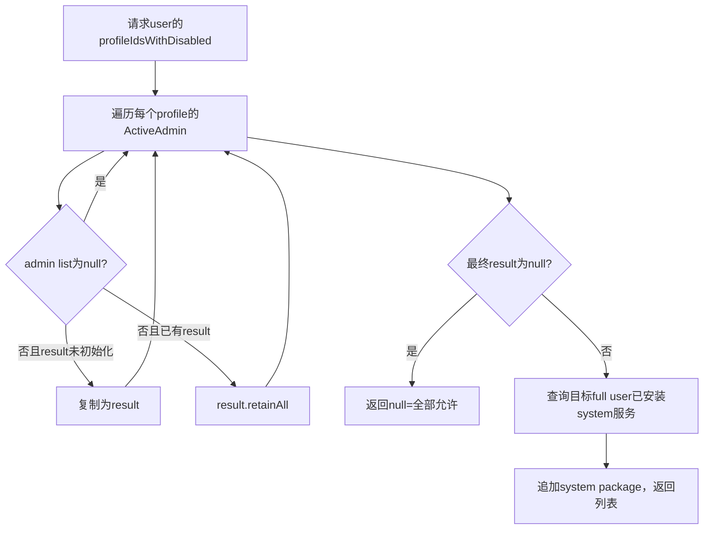
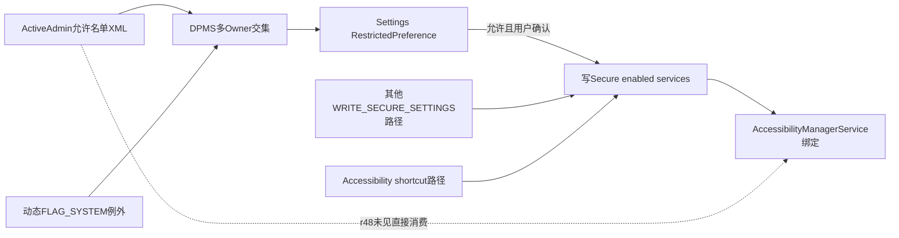

# 第 334 章 Android 企业 Permitted Accessibility Services：允许名单、多 Owner 交集、Settings 启用门与硬执行边界链

> 源码基线：Android 11 / API 30 / `android-11.0.0_r48`。该策略限制用户从标准Settings新启用哪些非系统无障碍服务；它不主动关闭已启用服务，AOSP r48的AccessibilityManagerService中也未发现直接消费这张名单的硬拦截。

## 1. 为什么这项策略敏感

AccessibilityService可读取界面结构、观察事件、执行手势和跨应用辅助操作。企业设备需要控制第三方服务，但也不能误关用户依赖的系统辅助能力或突然切断当前服务。

## 2. 公开setter

DO或PO调用 `DevicePolicyManager.setPermittedAccessibilityServices(admin, packageNames)`；这是按包名而不是ComponentName配置的允许名单。

## 3. null语义

传null表示取消限制，用户可使用任意无障碍服务。XML中不写对应tag，聚合时该admin不贡献交集约束。

## 4. empty语义

传空列表表示禁止所有非系统服务，但系统服务仍自动允许。XML会保留一个空的外层tag，以便重启后区别于null。

## 5. 非空语义

名单中的第三方package可被用户启用；未列出的非系统package在标准Settings中显示“由管理员停用”。同包多个AccessibilityService一起获得资格。

## 6. 不是强制启用名单

列入只表示permitted，不会写 `ENABLED_ACCESSIBILITY_SERVICES`，不会绑定服务，也不会替用户确认敏感能力。

## 7. 不是自动停用名单

setter明确拒绝排除当前已启用的非系统服务，而非先停掉它。返回false代表策略没有写入。

## 8. 系统服务恒允许

是否系统服务按目标user下ApplicationInfo的 `FLAG_SYSTEM` 判断。系统无障碍服务无需出现在DPC名单中。

## 9. Owner范围

服务使用 `USES_POLICY_PROFILE_OWNER` 特殊角色门，所以DO、PO及组织所有PO可设置；普通active admin不可。

## 10. 主链总览



## 11. parent instance被拒

客户端setter/getter调用 `throwIfParentInstance`。组织所有PO不能借parent DPM实例直接写这项父级策略；它仍从资料user的admin贡献到profile-group聚合。

## 12. feature关闭

设备无Device Admin feature时setter返回false，owner getter/aggregate getter返回null，单admin permitted检查返回true。策略系统整体退化为无限制。

## 13. who必须非null

服务首先Objects.requireNonNull；不能像少数DPMS API那样用null按calling UID推Owner。

## 14. 验证当前启用服务

只要packageList非null，服务先取得目标范围的enabled AccessibilityServiceInfo，把每项解析为packageName，再检查它是system或在新名单中。

## 15. 为什么null不验证

null只放宽限制，不可能排除已启用项，所以跳过AccessibilityManager查询并直接进入Owner授权和保存。

## 16. managed profile映射

调用user若是managed profile，查询enabled服务时把userId改为 `profileGroupId`，即父/full user；辅助功能运行和配置按父用户视图处理。

## 17. getAccessibilityManagerForUser

DPMS不使用进程缓存的AccessibilityManager.getInstance，而从ServiceManager取得IAccessibilityManager并显式构造指定user的AccessibilityManager，避免callingUid推错user。

## 18. 查询时清Binder身份

访问AccessibilityManager前clearCallingIdentity，以system_server身份跨内部Binder读取；finally恢复。DPC本身并未因此直接获得查询其他用户服务的权限。

## 19. enabled列表为空

若AccessibilityManager返回null或空，没有兼容性阻挡，新非null名单可以进入授权保存。

## 20. enabled按package折叠不去重

同包若启用多个service，enabledPackages可重复；contains对每项检查，结果不受重复影响，只增加少量循环。

## 21. 系统判断路径

helper用IPackageManager.getApplicationInfo(package, MATCH_UNINSTALLED_PACKAGES, user)并检查FLAG_SYSTEM。它判断应用包，不检查具体service是否平台签名或privileged。

## 22. MATCH_UNINSTALLED_PACKAGES

检查可能看到保留安装状态的包信息，旨在稳健识别系统包；是否当前可实际运行仍由AccessibilityManager的installed/enabled状态决定。

## 23. PM RemoteException

若查询包信息抛RemoteException，只写日志并保持systemService=false；包不在名单便导致false，属于偏安全拒绝。

## 24. ApplicationInfo null风险

r48代码直接读取 `applicationInfo.flags`，未显式判null。正常enabled service应有包信息，但卸载/查询竞态可能形成NPE健壮性边界。

## 25. 验证失败没有副作用

任一已启用非系统包不在新名单，打印错误并return false；不会取得admin、不会写XML、不会发DevicePolicy event。

## 26. 授权检查发生得偏晚

源码先查询enabled services并做名单验证，随后才在锁内 `getActiveAdminForCallerLocked`。非Owner直接调用可能在SecurityException前因内容不同先得到false，存在顺序侧信道与不必要系统工作。

## 27. 更稳妥顺序

应先验证caller与who的Owner身份，再清身份查询enabled列表；授权优先既减少信息泄露，也避免无权调用者驱动跨服务查询。

## 28. admin状态写入

验证通过后把传入List赋给 `ActiveAdmin.permittedAccessiblityServices`。字段名在r48含拼写 `Accessiblity`，但XML/API语义不受影响。

## 29. 按调用user持久化

`saveSettingsLocked(UserHandle.getCallingUserId())` 写该Owner所在user的device_policies.xml。managed profile PO的名单存资料user文件，不写父user文件。

## 30. true的完成含义

true表示内存字段已更新并调用保存/event日志；没有等待Settings刷新、用户界面重建或任何AccessibilityService解绑。

## 31. 无专用策略广播

setter片段没有发送“permitted accessibility changed”广播，也未主动通知AccessibilityManagerService。Settings在自身刷新/重建时重新取aggregate名单。

## 32. DevicePolicyEvent

成功后记录SET_PERMITTED_ACCESSIBILITY_SERVICES，并把package array写入事件；null名单记录null strings。它是审计，不是策略执行ACK。

## 33. 原始admin getter

`getPermittedAccessibilityServices(admin)` 再次校验calling Owner，返回该admin自己保存的null/empty/非空列表，不返回profile group合并结果。

## 34. aggregate getter

SystemApi `getPermittedAccessibilityServices(userId)` 要求MANAGE_USERS，服务遍历该user的profile group并返回所有相关admin名单交集，随后追加系统服务包。

## 35. 为何需要两种getter

DPC需要知道“我设置了什么”；Settings需要知道“所有适用管理员共同允许什么”。混用会在DO+PO并存时错误放宽。

## 36. profileIdsWithDisabled

聚合遍历 `getProfileIdsWithDisabled(userId)`，即使某managed profile当前disabled/quiet，也仍贡献管理限制，避免通过暂时停用profile绕过policy。

## 37. 遍历所有ActiveAdmin

每个profile的mAdminList都会扫描。注释依赖“只有Owner能写该字段”；代码聚合时不再次判断当前admin是否仍是Owner。

## 38. null不参与交集

某admin字段null表示没有意见。若其他admin提供列表，结果由其他列表决定；所有admin均null时aggregate返回null。

## 39. 第一个非null列表

结果初始化为该列表的ArrayList副本，避免retainAll直接修改ActiveAdmin原字段。

## 40. 后续列表取交集

每遇到非null列表调用retainAll。A允许[a,b]，B允许[b,c]，最终第三方只剩[b]。

## 41. empty拥有最强限制

任一适用admin给empty，第三方交集立即empty；后续非空列表不能重新增加元素。最后仍会追加系统包。

## 42. 顺序和重复

retainAll保留首个列表的顺序且输入未规范化；重复package可能保留，追加system包也不去重。调用方应把结果当membership集合而非稳定有序唯一列表。

## 43. 系统包何时追加

只有result非null，即确实存在至少一项限制时才查询installed accessibility services并追加FLAG_SYSTEM包；null已经代表全部允许，无需列举。

## 44. 系统例外是动态的

aggregate每次查询当前installed services生成系统包集合，不持久化系统例外。OTA增删系统辅助服务会改变返回结果而无需DPC改名单。

## 45. 返回的是package不是component

若系统包声明多个辅助service，结果可能多次add同一package。Settings用contains，因此重复不改变允许结论。

## 46. full user与profile的交集

DO在父user设置[A,B]，工作PO设置[B,C]，Settings对该profile group查询得到[B]+system。资料PO能收紧父侧可新启用第三方服务的集合。

## 47. 多managed profile假设

aggregate设计遍历全部profile。SettingsLib的admin归因helper只显式寻找一个managedProfileId，注释也暴露某些路径假设单资料；多profile产品需额外验证UI归因。

## 48. 单admin permitted检查

隐藏 `isAccessibilityServicePermittedByAdmin(who, package, user)` 只允许SYSTEM_UID调用，按指定user取admin；admin不存在返回false，字段null返回true，否则执行名单/system helper。

## 49. 为什么system-only

它用于SettingsLib判断具体是哪位管理员施加限制，不给普通应用枚举管理策略和系统服务例外。

## 50. 聚合算法图



## 51. XML outer tag

ActiveAdmin写盘调用 `writePackageListToXml`。null直接不写；empty仍写outer tag但没有item；非空每项写带value attribute的package-list-item。

## 52. XML读取

读到outer tag便创建新ArrayList，逐项读取value。因此空outer tag恢复empty，完全缺tag保留字段默认null，三态跨重启成立。

## 53. 重复与空字符串持久化

setter未去重、未检查TextUtils.isEmpty或包名格式；重复/空/不存在包会原样进入列表与XML。不存在包可被视为未来预授权，但也增加配置错误风险。

## 54. 非String元素

AIDL和服务端使用raw List，正常Java API泛型只在编译期约束。恶意Binder列表含非String可能在contains、XML写入或事件toArray转换处导致ClassCast/序列化异常。

## 55. save失败边界

字段在调用save前已改变；DPMS通用保存失败通常记录错误而非把内存字段回滚。因而true/当前boot查询与重启后磁盘值可能分叉，需故障注入验证。

## 56. Settings如何获得合并结果

AccessibilitySettings的helper调用 `mDpm.getPermittedAccessibilityServices(UserHandle.myUserId())`；Settings持MANAGE_USERS，可获得交集加system包。

## 57. serviceAllowed计算

aggregate为null即true，否则检查结果contains(packageName)。这是package级门，不逐ComponentName区分同包服务。

## 58. serviceEnabled计算

Settings同时从Secure enabled-services集合判断具体component是否已启用。最终UI门同时考虑allowed与enabled。

## 59. 已允许服务UI

serviceAllowed=true时Preference正常可点，用户仍需进入确认页并同意启用；DPM没有替用户跳过风险提示。

## 60. 未允许且未启用

Preference被disabled；SettingsLib查询父DO/PO与managed profile PO的单admin结果，若能归因便显示DisabledByAdmin及管理支持详情。

## 61. 未允许但已启用

`if (serviceAllowed || serviceEnabled)` 仍让Preference可点，使用户能进去关闭当前服务。它不是让不允许服务继续被重新开启的通用豁免。

## 62. setter为何先拒绝排除enabled

正常路径保证新policy落地时不会出现“未允许但已启用”；UI的serviceEnabled例外主要处理竞态、策略组合变化、恢复或异常状态，并保留用户关闭出口。

## 63. admin归因父侧

RestrictedLockUtilsInternal先取当前user的Profile/Device Owner并调用单admin检查；不允许则记该admin。

## 64. admin归因资料侧

再查一个managedProfileId的Profile Owner。两边都拒绝返回MULTIPLE_ENFORCED_ADMIN，一边拒绝返回对应admin。

## 65. aggregate与归因的关系

Settings用aggregate决定是否允许，用逐adminAPI决定提示谁。策略真值和UX归因是两次Binder查询，瞬间角色/策略变化可能让两者短暂不一致。

## 66. 实际启用写哪里

Settings的AccessibilityUtils修改 `Settings.Secure.ENABLED_ACCESSIBILITY_SERVICES` 字符串和总开关；DPM名单自身不进入该setting。

## 67. AccessibilityManagerService消费什么

AMS观察Secure settings、解析enabled ComponentName并绑定服务。对r48全树检索未发现AMS调用DPM permitted getter或单admin检查。

## 68. 因此不是服务端硬门

在标准Settings UX中限制有效，但拥有WRITE_SECURE_SETTINGS的特权代码、测试接口或其他直接改setting路径不一定经过DPM名单；不能把它等同于AMS不可绕过授权。

## 69. 快捷方式边界

Accessibility shortcut目标也保存在Secure setting，framework目标可调用AccessibilityUtils切换状态。所读DPM消费者只有Settings/SettingsLib，未见shortcut执行时重新检查允许名单，需把快捷目标配置纳入产品审计。

## 70. 已绑定服务不会被主动解绑

setter既不改enabled setting，也不调用AccessibilityManagerService disable。它靠“新名单必须包含当前enabled非system”避免突然产生矛盾，而非强制收敛。

## 71. 多Owner并发竞态

DO和PO可先后设置各自名单；每次setter只验证新调用者名单包含当前enabled，未用最终交集再验证。两个名单各自包含当前服务则交集也包含；但enabled与设置变化并发仍需测试锁外查询窗口。

## 72. 验证在DPMS锁外

enabled服务查询与package检查先发生，之后才进DPM锁写policy。期间用户可启用另一个服务，造成新策略写入时它已enabled却不在名单的TOCTOU窗口。

## 73. UI如何处理TOCTOU结果

刷新后该component因serviceEnabled=true仍可点以便关闭，但系统不会自动关闭。企业若要求强一致，需额外监听和修复，而非只依赖setter返回true。

## 74. 包安装状态变化

允许名单可含未安装包；未来安装后Settings会允许其服务。DPC应明确这是预授权还是脏配置，避免包名被不同签名应用占用的供应链风险。

## 75. 名单不绑定签名

策略只保存package string，没有证书摘要、version或installer约束。包被合法/恶意替换时，许可跟随包名。

## 76. shared UID无特殊含义

判断以声明service的packageName为粒度，不因shared UID自动允许兄弟包。每个包需独立列入或具system flag。

## 77. system app更新

只要PackageManager返回FLAG_SYSTEM，它始终例外；DPC不能用empty名单关闭。产品若不信任某预装服务，应从系统镜像/组件enabled状态治理。

## 78. disabled system package

系统例外只是“可被允许”，不保证包/组件当前enabled、installed for user或可绑定。DPM返回列表不是可用性清单。

## 79. 安装服务与启用服务分开

aggregate追加所有installed system accessibility services；setter兼容检查只看enabled services。一个第三方服务已安装但未启用可以被新名单排除。

## 80. 用户数据范围

enabled setting与AccessibilityManager状态按user；managed profile调用映射到parent，profile-group策略交集也服务于同一父侧UX。不要按每个profile想象独立辅助服务进程集合。

## 81. quiet mode影响

聚合仍包含disabled profile的PO限制，因此工作资料quiet并不会自动放宽父侧Settings可选服务；这符合“管理来源暂时停用但政策仍在”的设计。

## 82. Owner清除

移除Owner/Admin后其ActiveAdmin字段随政策记录清除，下一次aggregate不再包含该贡献。没有专用AccessibilityService重评/解绑动作，Settings刷新时才体现放宽。

## 83. Owner transfer

ActiveAdmin政策转移是否包含此字段要结合transfer实现/测试；即便持久字段迁移，包名许可与新DPC自身包没有自动关系。

## 84. 用户删除

对应device_policies.xml与Admin状态随user销毁；父user若仍有其他Owner限制，aggregate按剩余profile group重新计算。

## 85. 查询返回null不总是“无服务”

null明确表示无限制，绝不是空集合。Settings正确写成 `permittedServices == null || contains`；业务代码若把null当deny-all会反转策略。

## 86. empty返回也会含system包

DPC自己的getter会看到原始empty；System aggregate getter会在empty交集后追加system packages，所以通常不是Java empty。两种getter输出不可直接比较equals。

## 87. isPermitted admin不存在

system查询指定who/user若找不到ActiveAdmin返回false，而非true。Settings通常只传刚取得的Owner；角色变化竞态可能表现为临时“被禁止”。

## 88. system例外查询故障

单adminhelper若PM RemoteException把目标视为非system，再按名单判断；aggregate追加system时AccessibilityManager/包信息对象异常也可能影响UI结果，需观察日志。

## 89. 审计应记录两张表

一张是每个Owner的原始名单，另一张是当前profile group交集+动态system例外。只记录最终列表无法解释是哪位admin收紧了package。

## 90. 策略与执行关系图



## 91. 什么时候返回false

无feature，或新非null列表漏掉当前已启用非系统package。无权限通常抛SecurityException，不是false；保存后UI尚未刷新也不改变返回true。

## 92. 什么时候抛异常

who null抛NPE；caller不是Owner抛SecurityException；原始列表类型异常、PM竞态NPE或序列化错误也可能成为运行异常，而非规范化false。

## 93. 建议先读取enabled

DPC配置前可通过受允许运行接口盘点当前服务，先与用户/管理员协商关闭，再提交收紧名单；不能用反复调用setter当“强制关闭”。

## 94. 建议名单绑定资产清单

除package外，在DPC自身保存期望签名、版本、来源与业务理由，OTA/应用更新时复核；Framework名单本身不提供这些完整性字段。

## 95. 建议处理system例外

system服务不可被此API禁用。若合规要求禁止某预装辅助功能，应通过产品构建、组件overlay或更底层受支持机制治理，并保留紧急辅助能力评估。

## 96. 建议监听setting

高安全产品可由受信任组件观察ENABLED_ACCESSIBILITY_SERVICES变化，与DPMS aggregate比对并告警；任何自动修复都要避免剥夺用户必要无障碍能力。

## 97. 建议处理TOCTOU

setter true后重新读取aggregate与enabled集合，确认没有锁外新启用的非允许第三方服务。把这一复核视为收敛，而不是一次调用的原子保证。

## 98. 建议测试快捷入口

覆盖主Settings列表、Accessibility shortcut、音量键快捷方式、slice、恢复Secure settings和特权测试工具，验证哪些入口会重新执行DPM门。

## 99. dumpsys证据

DPMS ActiveAdmin dump会输出permittedAccessibilityServices；Accessibility dumpsys显示installed/enabled/bound服务。两者并读才能区分desired policy与runtime binding。

## 100. 最小设置示例

```java
boolean accepted = dpm.setPermittedAccessibilityServices(
        admin, Arrays.asList("com.example.approvedaccessibility"));
```

## 101. 三态示例

```text
null  -> 所有第三方与系统服务均可选
[]    -> 只有FLAG_SYSTEM服务可选
[pkg] -> pkg与FLAG_SYSTEM服务可选
```

## 102. 常见误解一：名单会自动启用服务

错误。它只控制可选资格，真实enabled/bound状态仍由Settings.Secure与AccessibilityManagerService管理。

## 103. 常见误解二：empty表示什么都不能用

错误。所有FLAG_SYSTEM无障碍服务始终例外，aggregate还会把它们明确追加到返回列表。

## 104. 常见误解三：true表示所有入口硬拦截

错误。AOSP r48所见消费者主要是Settings/SettingsLib，AMS未直接检查；其他能写Secure setting的特权路径必须另审。

## 105. 常见误解四：策略会关闭当前第三方服务

错误。漏掉当前enabled非system时setter返回false；并发异常状态下也只让UI提供关闭入口，不主动解绑。

## 106. 常见误解五：DO与PO名单取并集

错误。非系统许可取交集，任一admin都能收紧；最后额外追加system例外。

## 107. 安全基线

授权检查应早于enabled查询；验证非空合法包名、去重、签名资产；修补AMS/shortcut等非Settings启用路径；对TOCTOU做提交后复核。

## 108. 可用性基线

政策变更前保护当前依赖服务，保留系统辅助能力，提供管理员归因与退管恢复；不要用合规策略制造用户无法操作设备的无障碍事故。

## 109. 测试基线

覆盖null/empty/非空、当前enabled第三方、system服务、DO+PO交集、quiet profile、包卸载重装、列表重复/空值、无权限侧信道、并发启用与shortcut绕行。

## 110. macOS只读结论上限

源码能证明r48持久化、聚合与AOSP Settings门，不能证明OEM Settings是否沿用该helper、厂商AMS是否加硬门、目标系统包清单或用户实际辅助需求。

## 111. 本章知识检查

回答：null与empty有何区别？为何system service总允许？setter为何会false？DO与PO如何合并？未允许但已enabled时Settings怎样处理？为何这不等于AMS硬授权？

## 112. macOS 只读练习一：画三态XML

阅读writePackageListToXml/readPackageList，分别写出null、empty、[a,b]在ActiveAdmin XML中的形态，并解释重启后如何恢复三态；不编译。

## 113. macOS 只读练习二：手算Owner交集

设DO=[a,b]、PO=[b,c]、系统服务=[sys1]，逐行模拟result复制、retainAll与system追加；再把PO改null和empty比较结果。

## 114. macOS 只读练习三：追Settings执行门

从AccessibilitySettings的serviceAllowed/serviceEnabled进入RestrictedLockUtilsInternal，记录aggregate真值、单admin归因和Preference enabled/disabled的四种组合。

## 115. macOS 只读练习四：审计绕行面

全树搜索getPermittedAccessibilityServices与ENABLED_ACCESSIBILITY_SERVICES写入者，列出Settings、shortcut和其他特权路径；确认AccessibilityManagerService是否直接调用DPM，Mac无需运行设备。

## 116. 练习答案要点

null无约束、empty仅系统；setter漏掉enabled第三方返回false；多Owner取交集；系统包动态追加；已enabled即使不允许仍可点以便关闭；r48 AMS未直接消费名单。

## 117. 复读修正一：这不是自动停用策略

初看“not permitted cannot be enabled”容易写成DPMS主动disable。重读setter发现它拒绝不兼容新名单，重读Settings发现enabled项保留可点击，正文已改为防新增+可关闭。

## 118. 复读修正二：aggregate不是原始admin列表

系统getter跨profile取交集并动态加FLAG_SYSTEM；DPC getter只返回自己原值。本文已分别说明empty在两类getter中的不同外观。

## 119. 复读修正三：标准UI门不等服务硬门

全树检索的DPM消费者位于Settings/SettingsLib，AccessibilityManagerService绑定链未直接查名单；正文因此明确列出Secure setting、shortcut与OEM路径的验证责任。

## 120. 本章结论与下一章

Permitted Accessibility Services把每位Owner的包名单持久化并按profile group取交集，同时永远放行动态system服务；setter以“不能排除当前enabled第三方”保护可用性，Settings负责阻止新启用并显示管理员归因。它不是AMS硬授权，也不保证原子收敛。下一章将用相同方法研究Permitted Input Methods，重点比较IME当前启用校验、system IME例外、per-user聚合以及输入法切换与绑定边界。
