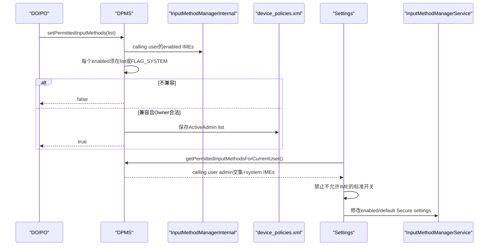
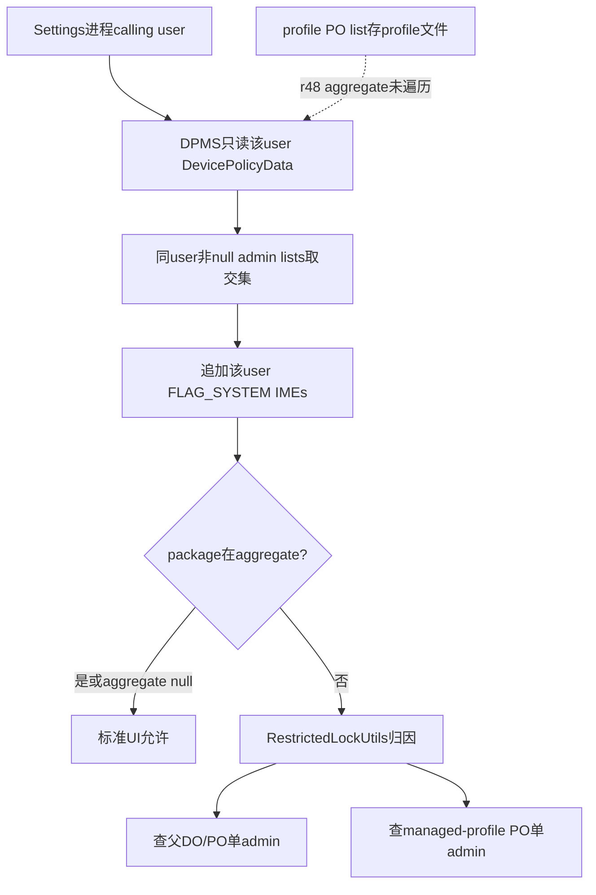
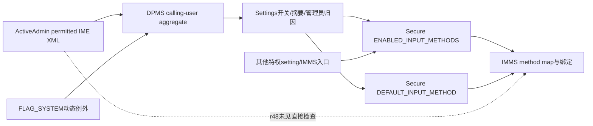

# 第 335 章 Android 企业 Permitted Input Methods：允许名单、当前用户聚合、Settings 开关与 IMMS 硬执行边界链

> 源码基线：Android 11 / API 30 / `android-11.0.0_r48`。IME策略与上一章表面相似，但r48聚合只扫描calling user的ActiveAdmin，并未遍历profile group；这与API注释及Settings的双admin归因结构存在值得实机验证的落差。

## 1. 为什么企业要管IME

输入法能看到用户键入内容、候选、EditorInfo与部分剪贴板交互。第三方IME是敏感数据出口，因此DO/PO可限制用户从标准Settings启用哪些非系统输入法。

## 2. setter入口

`DevicePolicyManager.setPermittedInputMethods(admin, packageNames)` 按package配置，不按具体InputMethodService component或subtype配置。

## 3. null语义

null取消该admin的限制，任意IME都可用；ActiveAdmin XML不写permitted-imes tag。

## 4. empty语义

empty禁止所有非system IME，但系统IME始终例外；XML写空outer tag，重启后仍恢复empty而不是null。

## 5. 非空语义

名单包及所有FLAG_SYSTEM输入法可由用户启用。列入不会自动启用、设默认或切换到该IME。

## 6. 当前enabled保护

新非null名单必须包含每个当前enabled非system IME package，否则setter返回false且不写策略。

## 7. system IME不可禁止

helper按ApplicationInfo.FLAG_SYSTEM判断。DPC即使传empty，预装system IME仍会出现在aggregate允许结果中。

## 8. Owner角色

服务使用USES_POLICY_PROFILE_OWNER特殊门，DO、普通PO和组织所有PO可设置；普通DeviceAdminReceiver不可。

## 9. 与无障碍策略的最大差别

Accessibility aggregate遍历profileIdsWithDisabled；IME aggregate在r48只读取callingUserId的DevicePolicyData.mAdminList。不能把上一章交集算法原样复制。

## 10. 总体调用链



## 11. parent instance门

客户端setter和getter都throwIfParentInstance。COPE Profile Owner不能通过parent DPM实例直接把字段写入父ActiveAdmin。

## 12. mHasFeature=false

setter返回false、原始getter返回null；单adminisPermitted返回true。aggregate方法片段未显式mHasFeature early return，而是仍按当前user数据计算，通常无admin便null。

## 13. who非null

服务Objects.requireNonNull，不能用null按calling UID自动选Owner。

## 14. callingUserId

setter一开始用Injector取得Binder calling user；enabled IME查询、保存文件和Observer归属都基于它，没有让DPC指定任意目标user。

## 15. 文档的foreground约束

Javadoc称admin必须位于foreground user或其profile，否则调用失败。但r48 setter片段未见ActivityManager current-user比较或显式foreground检查。

## 16. 实现与文档分开写

本章不推断隐藏下层必然替代该检查：InputMethodManagerInternal本来支持按user查询。故将“background Owner是否可成功”列为r48源码落差与测试项。

## 17. enabled查询

`InputMethodManagerInternal.get().getEnabledInputMethodListAsUser(callingUserId)` 直接进入IMMS LocalService，返回该user当前启用的InputMethodInfo列表。

## 18. 与Accessibility的映射差别

setter没有先把managed-profile userId改为profileGroupId再查enabled IME；它把calling profile ID直接交给IMMS。

## 19. system分类又会映射parent

共用helper `checkPackagesInPermittedListOrSystem` 若收到managed profile user，会把“查ApplicationInfo的user”改为profileGroupId。于是enabled列表来源user与system flag查询user可能不同。

## 20. 当前默认IME必然重要

正常默认IME属于enabled集合，所以非system默认IME必须列入新名单；否则setter false，不会让设备突然失去当前键盘。

## 21. 多subtype不影响名单

enabled InputMethodInfo按IME service/package统计，语言、布局、语音等InputMethodSubtype不单独进入DPM策略。

## 22. 同包多个IME

名单按package contains，同包声明多个IME一起允许。enabledPackages可能重复，但不改变检查结论。

## 23. PM查询

helper以MATCH_UNINSTALLED_PACKAGES读取ApplicationInfo并看FLAG_SYSTEM；RemoteException时按非system处理，包不在名单即false。

## 24. null ApplicationInfo边界

代码未判applicationInfo null便访问flags。enabled包通常应存在，但卸载竞态或异常package state可能触发NPE。

## 25. 验证失败

发现任何enabled非system包不在proposed list，记录错误并return false；没有授权检查、XML保存或DevicePolicy event。

## 26. 授权仍发生得晚

与上一章相同，服务先读取enabled IME并根据名单返回不同结果，之后才在锁内校验who/caller Owner。非Owner可能利用false与SecurityException差异探测状态。

## 27. 正确加固顺序

先在DPM锁内验证Owner并保存必要身份，再锁外查询IMMS，最后重入锁确认角色未变并提交，能同时缩小侧信道与角色变化竞态。

## 28. ActiveAdmin赋值

成功路径把raw List直接赋给 `admin.permittedInputMethods`，随后保存callingUserId的device_policies.xml。

## 29. 不做列表规范化

不存在包、空字符串、重复项和顺序会保留；正常API泛型是List<String>，但服务/AIDL raw List对恶意元素缺少运行校验。

## 30. DevicePolicyEvent

成功后写SET_PERMITTED_INPUT_METHODS并附packageArray；这只是审计事件，不是IMMS已应用/切换的确认。

## 31. true的准确含义

新内存字段已赋值、save被调用、event被写；不代表Settings已经刷新，也不代表当前default/selected IME发生任何变化。

## 32. 没有专用广播

setter片段未通知IMMS重新评估或向Settings发专用changed action。UI下次onStart/update时查询名单。

## 33. 原始getter

`getPermittedInputMethods(admin)` 校验calling Owner后返回该admin保存的原始三态，不做交集、不追加system IME。

## 34. aggregate SystemApi

`getPermittedInputMethodsForCurrentUser()` 要MANAGE_USERS。Android Q+文档明确结果针对calling user，而非ActivityManager当前foreground user。

## 35. 方法名的CurrentUser易误导

r48实现用 `userHandleGetCallingUserId()`；这里“Current”对Q+应理解为调用者user。P及以前文档语义不同，兼容代码不能只凭名字猜。

## 36. 只取一份DevicePolicyData

锁内 `getUserDataUnchecked(callingUserId)`，仅循环该policy.mAdminList；没有getProfileIds、getProfiles或profile parent查询。

## 37. 同user多admin交集

若同一user的多个ActiveAdmin字段非null，首个列表复制，后续retainAll。通常只有该user Owner可写，但遗留/转移字段也可能参与。

## 38. profile PO字段存哪里

managed-profile PO setter用profile callingUserId保存到profile的device_policies.xml。父user Settings调用aggregate时按当前代码不会读取该profile文件。

## 39. Javadoc却写多Owner交集

文档说返回适用于该user的Device/Profile Owner名单交集；实现只扫calling user。这是本章最重要的r48实现落差，需目标设备/补丁历史验证。

## 40. Settings双admin归因的暗示

RestrictedLockUtilsInternal会分别询问父侧Owner和managed-profile PO谁禁止IME，说明UI设计预期profile PO也可约束；但只有aggregate先判IME不允许时才进入归因。

## 41. 可能的效果缺口

若父user aggregate为null而只有profile PO在profile文件设置限制，Settings会把所有IME视为allowed，通常不会调用归因helper；从r48所读代码无法证明PO限制能在父Settings入口生效。

## 42. 谨慎结论

这是静态控制流推导，不等于所有产品必现：OEM可能修改Settings/DPMS，IME per-profile行为也影响入口。正文把它记录为需实机矩阵验证的疑点。

## 43. null聚合

calling user所有admin字段均null时返回null，表示无限制，不查询system IME列表。

## 44. empty聚合

任一同useradmin empty使第三方交集empty；随后追加所有installed FLAG_SYSTEM IME package。

## 45. system IME动态追加

通过InputMethodManagerInternal.getInputMethodListAsUser(callingUserId)取得已安装IME，不限enabled；每个system package被add，可能重复。

## 46. system例外不是可用保证

被追加只表示政策不禁止。组件disabled、包未为user安装、服务解析失败或硬件/locale不适配仍可让IME不可用。

## 47. retainAll的集合外观

算法用List，顺序来自第一个列表，重复可保留。消费者应contains，不应依赖排序、唯一性或稳定序列化。

## 48. 单admin检查

`isInputMethodPermittedByAdmin(who, package,user)` 仅SYSTEM_UID可调；admin不存在false，字段null true，否则名单或FLAG_SYSTEM为true。

## 49. 单admin与aggregate用途

aggregate决定Settings开关是否被组织允许；单adminAPI只负责DisabledByAdmin归因。二者不是相同返回形态。

## 50. 聚合与归因图



## 51. XML写入

字段复用writePackageListToXml：null省略tag，empty写空permitted-imes，非空写package-list-item value。

## 52. XML读取

看到outer tag就创建ArrayList，逐item恢复；缺tag保持null。三态和重复顺序跨重启保存。

## 53. 保存失败窗口

字段先赋值后save，通用保存错误未在setter返回值中体现回滚。当前boot内存可能显示新策略而重启回旧值。

## 54. Settings消费者一：可用键盘页

AvailableVirtualKeyboardFragment取得aggregate list，为每个InputMethodPreference计算isAllowedByOrganization；不允许的开关显示管理员限制。

## 55. Settings消费者二：已启用列表

InputMethodPreferenceController遍历enabled IMEs并传allowed flag，影响Preference可用状态和设置入口。

## 56. Settings消费者三：摘要

VirtualKeyboardPreferenceController只把aggregate允许的enabled IME label加入摘要。异常已启用但已不允许的IME可能被摘要隐藏，却仍存在于IMMS状态。

## 57. InputMethodPreference禁用逻辑

若IME不是always-checked且mIsAllowedByOrganization=false，调用RestrictedLockUtils找admin并setDisabledByAdmin；开关不可操作。

## 58. 与Accessibility已启用例外不同

上一章UI在serviceEnabled时仍允许点击以便关闭；IME preference没有“已启用即放行”分支。正常setter保证不会产生已启用但不允许状态，异常竞态下用户可能反而无法从该开关关闭。

## 59. always-checked IME

系统为保证至少一个可用键盘可标记IME不可关闭；该分支先普通disable而非admin归因。system IME又恒被policy允许，二者通常一致。

## 60. 实际enabled存储

IMMS使用Settings.Secure.ENABLED_INPUT_METHODS记录启用的IME/subtype，DEFAULT_INPUT_METHOD记录当前选择；DPM名单是独立desired policy。

## 61. 真正绑定链

IMMS解析settings、选择当前method、bind InputMethodService，并给应用窗口建立InputConnection会话。setter不直接进入这些运行态步骤。

## 62. 全树消费者结论

r48对getPermittedInputMethodsForCurrentUser/isInputMethodPermittedByAdmin的实际调用主要位于Settings/SettingsLib，IMMS未见在enable、setInputMethod或bind时直接查询DPM名单。

## 63. 因而不是IMMS硬门

标准Settings会阻止用户新启用，但拥有WRITE_SECURE_SETTINGS、IMMS内部特权API或OEM其他入口的代码是否受限需另查；不能写成内核级/服务端不可绕过。

## 64. 输入法切换器

系统切换器通常在已enabled IME中选择。setter保证提交瞬间所有enabled第三方都在新名单，但TOCTOU或直接setting修改可产生不允许却仍可切换的异常状态。

## 65. 验证与提交非原子

enabled IME列表在DPM锁外获取，之后才持锁保存。两步间另一路可启用新第三方IME，使setter true却漏掉刚启用项。

## 66. admin角色也可竞态

验证前未锁定Owner身份，验证后才getActiveAdminForCallerLocked。Owner转移/清除与调用并发时，最终授权会拒绝或命中新状态，但前置查询已发生。

## 67. package allowlist不绑签名

只存字符串。未来同包名不同签名安装若通过包管理门，政策仍允许；DPC应另存/核验签名资产。

## 68. 未安装包

可预先列入，setter不验证proposed entries安装。未来安装同名IME会被Settings视为组织允许。

## 69. 包内多个服务

批准一个package同时批准它所有IME service与subtype，无法只允许“安全键盘”component而拒绝同包语音/实验service。

## 70. shared UID

许可不按UID传播；同shared UID的另一个package若声明IME仍需自己的package名在名单中或为system。

## 71. system包信任边界

FLAG_SYSTEM意味着DPC不能借此API禁止。产品若不信任预装IME，应通过system image、组件enabled、默认配置与签名治理。

## 72. 用户切换

每个full user有自己的enabled/default IME与DPM数据。get...ForCurrentUser在Q+取calling user，所以SystemUI/Settings必须用正确user context创建DPM。

## 73. background user调用疑点

文档要求foreground group，代码未检查。若background DO/PO成功写入，它只改变自己的user XML；不会立即改变当前前台user IME。

## 74. managed profile与IME共享体验

资料应用使用输入法时涉及父/profile user的IME可用模型。setter、system分类、aggregate三处user选择不完全一致，必须用父/资料/COPE矩阵实测。

## 75. quiet profile

IME aggregate不遍历profile group，所以quiet与否都不会改变“calling user只扫自身”的代码；profile PO政策是否生效的疑点也不会因quiet自动解决。

## 76. Owner清除

该ActiveAdmin字段随Owner/Admin记录清除；Settings下次刷新放宽。没有专用IMMS重绑定动作，因为正常策略未主动改变enabled/default。

## 77. Owner transfer

若transfer复制ActiveAdmin policies，名单可随角色延续；仍应验证XML字段、调用user和Settings aggregate，不能只看新Owner设置成功。

## 78. 包卸载

policy package string可残留；IME卸载由IMMS清理enabled/default。未来同名重装可能重新获得允许资格。

## 79. 包从system变非system

OTA/安装形态变化会改变动态例外；若它不在显式名单，Settings刷新后可能显示admin限制。已enabled异常状态不会被DPMS自动关闭。

## 80. 包从非system变system

即使未列入也被追加/单adminhelper允许。系统镜像信任变化直接扩大可选集合。

## 81. 查询结果快照

aggregate、installed IME和Settings Preference构建不是单一事务；包安装、Owner policy和user切换并发会让一次UI快照短暂过期。

## 82. 返回null的正确处理

null是allow-all，不是无IME。Settings用 `list == null || contains`；企业审计工具必须保持同样三态。

## 83. empty原始值与aggregate外观

DPC原始getter可返回empty；aggregate会追加system IME，通常返回非空。不能用两者equals判断策略是否漂移。

## 84. DevicePolicy event不是执行证据

事件记录who与输入list，不含最终aggregate、enabled/default IME、Settings刷新时间或IMMS binder状态。

## 85. dumpsys联合诊断

DPMS dump看permittedInputMethods；IMMS dump看method map、enabled/default/current client与binding。两张状态表共同定位“策略正确但键盘仍可用”。

## 86. 用户可用性风险

错误禁用所有可用键盘会让设备难以输入凭据。system IME恒允许和setter兼容检查是保护层，但OEM无system fallback或组件disabled仍需测试。

## 87. 密码字段并不完全交给IME

Android输入连接、secure window和应用实现各有保护，但IME本身仍高度敏感；允许名单只是供应方治理的一环，不是数据防泄漏完整方案。

## 88. 网络能力不受此API控制

获准IME仍可按其manifest权限联网。需要结合网络策略、VPN、证书、应用权限和审计，而不是把“permitted”理解成离线可信。

## 89. 锁屏与Direct Boot

开机解锁前可用IME还受directBootAware、system默认与CE/DE设置可用性影响；DPM名单不保证某IME在凭据输入阶段可加载。

## 90. Policy到运行态关系图



## 91. 何时返回false

无Device Admin feature，或proposed非null列表漏掉当前enabled非system IME。非Owner通常抛SecurityException，不用false表达。

## 92. 何时抛异常

who null、caller非Owner、raw List类型异常、PackageManager竞态NPE等。文档所谓foreground失败在r48片段中没有对应明确分支。

## 93. 配置前迁移步骤

盘点enabled/default，确认至少一个可靠system fallback；先引导用户/管理员切换或关闭将被移除的第三方IME，再提交名单并复核。

## 94. 配置后复核

setter true后重新读取原始名单、aggregate、enabled与default；检查TOCTOU产生的新增项，并在不破坏输入可用性的前提下收敛。

## 95. 签名资产复核

DPC自己的配置库应为每个允许package记录签名摘要、版本、安装来源和负责人。Framework只保存包名。

## 96. Profile矩阵

至少测试DO-only、父DO+资料PO、普通PO full secondary、COPE PO、quiet profile与background full user；特别记录每个进程的calling user。

## 97. 入口矩阵

测试Available Virtual Keyboard、已启用键盘页、系统IME picker、硬件键盘触发、恢复Secure settings、ADB/特权工具和OEM快速切换入口。

## 98. 故障注入

在enabled查询后并发启用IME、保存XML失败、PM返回null/RemoteException、Owner转移中调用，观察return、内存、磁盘、UI与IMMS五层状态。

## 99. 最小代码

```java
boolean accepted = dpm.setPermittedInputMethods(
        admin, Arrays.asList("com.example.approvedime"));
```

## 100. 三态速记

```text
null  = DPC不限制
[]    = 仅system IME
[pkg] = pkg + system IME
```

## 101. 与Accessibility对照

共同点：三态、当前enabled兼容、system例外、Settings主消费、非硬门。差异：Accessibility跨profile聚合且已enabled Preference可点；IME只扫calling user且disallowed Preference直接disabled。

## 102. 常见误解一：方法名CurrentUser就是前台user

错误。Android Q+文档与r48实现都取Binder calling user；调用context的user身份决定结果。

## 103. 常见误解二：PO名单必然与DO跨profile取交集

不能这样断言。r48实现只扫calling user policy，与Javadoc/归因helper存在落差，必须按具体user调用链验证。

## 104. 常见误解三：empty会让设备没有键盘

策略仍允许FLAG_SYSTEM IME；但若产品没有可用system fallback或组件不可用，实际体验仍可能无键盘。

## 105. 常见误解四：setter会切走不允许IME

错误。它在提交前发现enabled不兼容便false，不修改default或绑定；竞态异常也不会自动切换。

## 106. 常见误解五：IMMS每次bind都会查DPM

在r48全树所见没有该直接调用，限制主要由Settings控制新启用。其他特权入口需独立审计。

## 107. 安全基线

授权前置、包名规范化与签名绑定、IMMS硬门或统一特权入口检查、提交后TOCTOU复核，并修正profile-group聚合与文档的一致性。

## 108. 可用性基线

确保至少一个direct-boot可用system fallback；策略迁移先切默认再收紧；异常状态给管理员安全关闭/恢复路径，避免锁死输入。

## 109. 测试基线

覆盖三态、enabled/default第三方、system/updated-system、同包多IME、父/资料多Owner、calling/foreground user差异、直接setting绕行、切换器和保存失败。

## 110. macOS只读结论上限

本地r48可证明调用者user聚合与AOSP Settings消费者，不能证明OEM IMMS硬化、目标system IME清单、实际profile共享模型或后台Owner调用结果。

## 111. 本章知识检查

回答：setter何时false？null/empty如何持久化？aggregate扫描哪些admin？为何与Javadoc有落差？Settings和IMMS各负责哪层？为何true不代表当前IME切换？

## 112. macOS 只读练习一：对比两个setter

并排阅读Accessibility与IME setter，标出managed-profile user映射、enabled列表来源、共同helper、授权顺序和保存user差异；不编译。

## 113. macOS 只读练习二：验证聚合范围

对比getPermittedAccessibilityServicesForUser与getPermittedInputMethodsForCurrentUser，数出profile遍历调用，纸面推演父DO=[a,b]、profile PO=[b,c]在两者中的结果。

## 114. macOS 只读练习三：追Settings开关

从AvailableVirtualKeyboardFragment/InputMethodPreferenceController进入InputMethodPreference.updatePreferenceViews，再追RestrictedLockUtils双admin归因，记录allowed/always-checked组合。

## 115. macOS 只读练习四：确认硬门边界

全树搜索DPM IME getter与ENABLED_INPUT_METHODS/DEFAULT_INPUT_METHOD写入者，确认IMMS bind/setInputMethod是否直接查名单，列出可能绕开Settings的特权入口。

## 116. 练习答案要点

漏掉enabled第三方则false；null无限制、empty仅system；r48 IME aggregate只扫calling user而Accessibility扫profile group；Settings是主要门，IMMS未直接消费；true不改enabled/default/binding。

## 117. 复读修正一：不能照搬Accessibility聚合

初始计划按Javadoc写多Owner profile交集；重读实现发现只取callingUserId DevicePolicyData。正文已将其改为源码落差和实机验证项。

## 118. 复读修正二：foreground限制未见实现

API注释写admin须在foreground group，但setter未查current user。本文不把文档条件伪装成已执行的if，也不擅自断言一定可绕过。

## 119. 复读修正三：标准Settings门不等IMMS硬门

消费者搜索落在Settings/SettingsLib，IMMS LocalService只提供列表查询。正文已分开desired名单、Secure enabled/default与真实bind三层。

## 120. 本章结论与下一章

Permitted Input Methods以包名单保护标准Settings启用面，并在提交时拒绝排除当前enabled第三方、永远放行system IME；但r48 aggregate只扫calling user，与profile-group文档存在落差，且IMMS未直接把名单当bind硬门。下一章进入Permitted Cross-Profile Notification Listeners，追资料通知对父用户监听器的过滤、system例外、managed-profile限定与NotificationManagerService投递边界。
