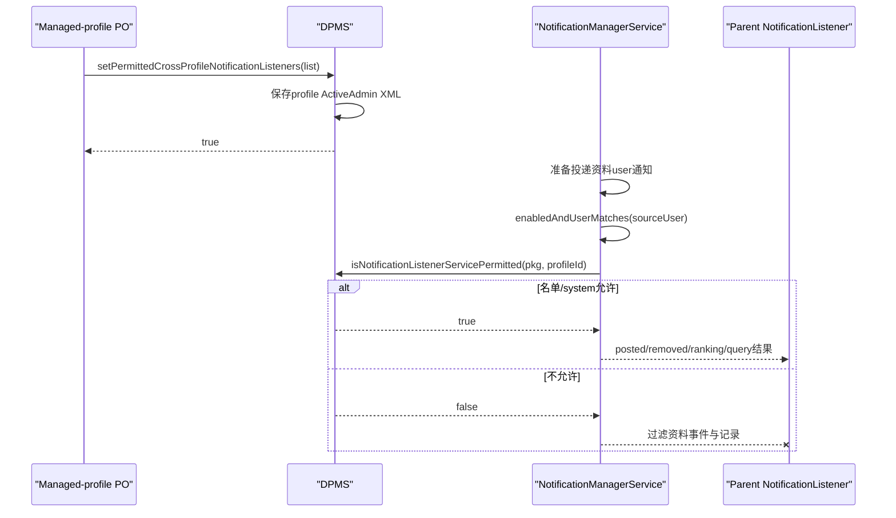
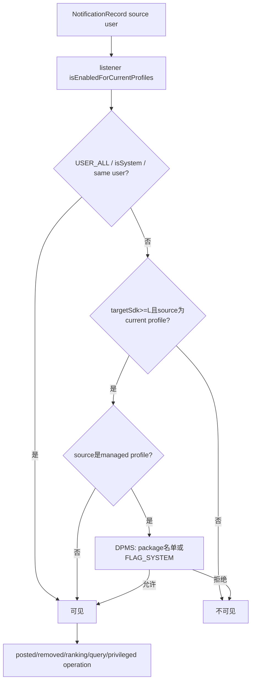
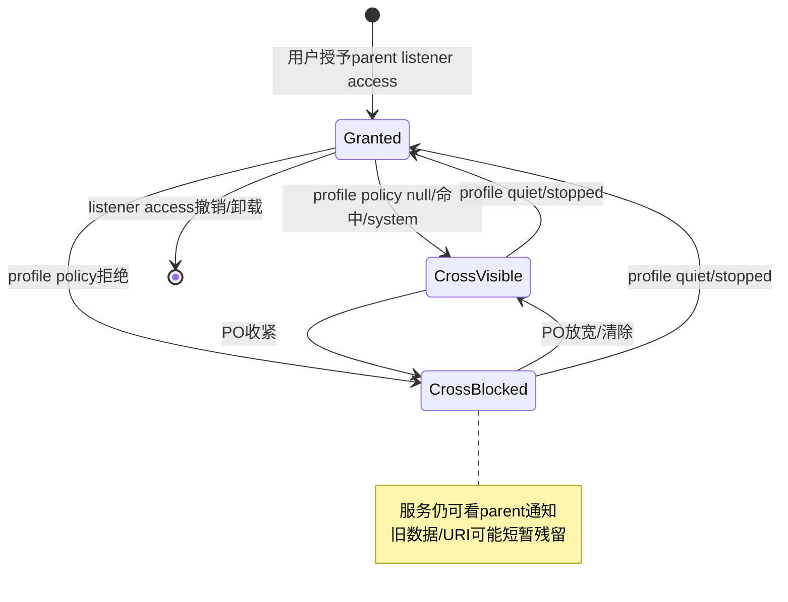

# 第 336 章 Android 企业 Cross-Profile Notification Listeners：资料通知过滤、NMS 逐事件硬门与残留授权边界链

> 源码基线：Android 11 / API 30 / `android-11.0.0_r48`。这张名单不禁用父用户的NotificationListenerService，而是在它跨profile接收工作资料通知时由NotificationManagerService动态过滤。

## 1. 本章核心问题

父用户通知监听器已被用户授予访问权后，默认可看到当前managed profile通知。Profile Owner怎样只允许特定监听器跨界，同时保留它对父用户通知的正常访问？

## 2. setter

managed-profile PO调用 `setPermittedCrossProfileNotificationListeners(admin, packageList)`；名单填写安装在primary/parent user中的listener package。

## 3. null

null表示不限制，所有符合通知监听基础授权与profile支持条件的listener都可接收该资料user事件。

## 4. empty

empty阻止所有非system parent listener接收该资料通知；system package仍动态例外。

## 5. 非空

名单中的package和system package可跨界。粒度是package，同包所有NotificationListenerService共享结果。

## 6. 只管跨profile方向

它控制“父/primary user中的listener读取指定managed profile通知”，不控制listener读取自身user通知，也不禁用listener服务本身。

## 7. 不是通知发布名单

工作应用仍可发布通知，SystemUI仍可展示；被过滤的是第三方NotificationListenerService的事件与查询视图。

## 8. 不是listener access grant

用户是否授予Notification Access由ManagedServices approved配置决定。DPM名单是在已有access之上的按来源profile第二道门。

## 9. 仅managed profile可设置

服务先检查callingUserId `isManagedProfile`；DO user0、full secondary PO和普通非profile user调用返回false。

## 10. 主链图



## 11. parent instance被拒

客户端throwIfParentInstance；PO必须从managed-profile自身DPM实例设置，不是从parent instance写策略。

## 12. feature关闭

mHasFeature=false时setter false、getter null、system permitted query true，等价于没有企业跨profile限制。

## 13. who非null

Objects.requireNonNull；不能由服务按UID隐式选admin。

## 14. managed-profile门先于Owner门

调用者不在managed profile时直接false，不校验who是否DO/PO。测试明确DO与full-user PO都不可用。

## 15. Owner授权

通过profile形态门后，锁内 `getActiveAdminForCallerLocked(who, USES_POLICY_PROFILE_OWNER)` 要求calling UID拥有该managed profile的PO能力。

## 16. 没有enabled兼容检查

与Accessibility/IME不同，setter不盘点当前已授权listener，也不要求新名单包含它们；可以立即收紧跨资料可见性。

## 17. 为什么可直接收紧

listener仍绑定并可看父user通知，只丢失工作资料事件，不会让设备失去核心输入/辅助能力，所以没有“当前enabled必须保留”的可用性门。

## 18. ActiveAdmin字段

名单赋给managed profile PO的 `permittedNotificationListeners`，保存calling profile的device_policies.xml。

## 19. 没有交集

system查询只取得 `getProfileOwnerAdminLocked(sourceUserId)`。一个managed profile只有一个PO，不遍历DO或其他profile admin列表。

## 20. 原始getter

PO的getter返回自己设置的null/empty/非空列表，要求调用者仍有Owner身份。

## 21. XML三态

复用package-list helper：null不写tag、empty写空permitted-notification-listeners、非空写每个package-list-item。

## 22. 不校验package

setter不验证安装、格式、重复、签名或是否真声明NotificationListenerService；可预先允许未来包，也会保留拼写错误。

## 23. package不绑签名

策略只记字符串。同名包替换后许可继续，DPC需自行维护签名/版本/installer资产。

## 24. 没有DevicePolicyEvent

r48 setter片段保存后直接return true，未像前两章setter那样调用DevicePolicyEventLogger；审计主要依赖policy dump/XML与DPC自身日志。

## 25. 没有专用广播

策略改变不通知NMS重新绑定listener，也不向父Settings发changed action。NMS在每次可见性判断时动态查询。

## 26. true的含义

内存字段已改且save被调用；不代表旧事件已从listener进程内缓存删除，也不代表已有URI grant立即撤销。

## 27. system-only查询

`isNotificationListenerServicePermitted(packageName, sourceUserId)` 只允许SYSTEM_UID，普通listener不能直接枚举工作政策。

## 28. 参数检查

packageName null/empty被Preconditions拒绝；userId不额外要求managed profile，但非profile通常没有可设置名单，结果默认true。

## 29. 无PO默认允许

source user没有Profile Owner，或PO字段null，都return true。

## 30. 非空检查

有PO且字段非null时调用共同helper：package在名单中，或在source profile对应parent user被识别为FLAG_SYSTEM，才允许。

## 31. system分类映射parent

helper发现userId是managed profile便改用profileGroupId查ApplicationInfo，符合listener实际安装在primary user的模型。

## 32. system服务恒允许

即使PO列表empty，parent user中的FLAG_SYSTEM listener仍可接收profile事件；DPC不能用这项API排除它。

## 33. PM故障

RemoteException只记日志并按非system继续名单判断；ApplicationInfo null未判便读flags，存在卸载/竞态NPE边界。

## 34. 测试证据

DPMS单元测试覆盖默认null全允许、单包名单、empty仅system、恢复null、SYSTEM_UID限定及primary profile不受影响。

## 35. ManagedServices角色

NotificationListeners继承ManagedServices；每个绑定服务用ManagedServiceInfo记录component、userid、isSystem、connection与targetSdkVersion。

## 36. enabled基础门

`enabledAndUserMatches(nid)` 先要求listener对当前profiles仍enabled；非system服务connection为空或component不在enabled集合都false。

## 37. USER_ALL例外

listener userid为USER_ALL直接匹配所有来源，通常属于system内部注册服务，不走普通跨profile许可路径。

## 38. ManagedServiceInfo.isSystem例外

isSystem也直接true，甚至早于DPM查询；这是ManagedServices内部系统监听器身份，与DPMS按package FLAG_SYSTEM例外形成两层系统通道。

## 39. 同user事件

通知nid等于listener.userid时直接true，不调用DPM。因此父listener仍收父通知，profile内listener仍收自身profile通知。

## 40. 只有跨user才查名单

nid属于另一个current profile时，listener还必须supportsProfiles且DPM允许该source profile。

## 41. targetSdk门

supportsProfiles要求targetSdkVersion>=Lollipop。旧target listener不会看到profile通知，无论PO名单是否允许。

## 42. current profile门

source user必须在mUserProfiles当前profile集合。非当前用户或无关联user通知不会因DPM名单而跨界。

## 43. isPermittedForProfile

若source不是managed profile直接true；若是，则clearCallingIdentity后通过DevicePolicyManager Binder查询package与profileId，finally恢复。

## 44. 为什么逐事件查询

名单不缓存进NMS listener对象，Owner变更、XML更新后的后续事件会重新读取DPMS最新值，不需要重绑服务。

## 45. Binder开销

每次可见性判断managed profile事件都会经DevicePolicyManager门面进入DPMS并可能查PM system flag；高通知量下需关注锁与调用成本。

## 46. 同一进程但仍有边界

NMS与DPMS都在system_server；`asInterface` 可能取得本地Stub而不发生驱动事务，但代码仍显式clear identity并经过system-only服务门，逻辑权限和锁顺序仍是真实审计点。

## 47. posted过滤

notifyPostedLocked遍历listener，分别算新旧SBN的isVisibleToListener；都不可见便continue，不发送onNotificationPosted。

## 48. removed过滤

notifyRemovedLocked先isVisibleToListener；当前策略不允许时不向该listener发送onNotificationRemoved。

## 49. ranking过滤

makeRankingUpdateLocked遍历全部NotificationRecord，只把isVisibleToListener为true的记录加入Ranking数组，避免通过ranking key/importance侧漏工作通知。

## 50. NMS执行图



## 51. 主动查询过滤

listener调用getActiveNotifications等API时，NMS遍历记录并用isVisibleToListener过滤；收紧策略后新查询不会返回被禁profile记录。

## 52. 特权listener操作过滤

verifyPrivilegedListener针对指定UserHandle还调用enabledAndUserMatches；不允许的parent listener不能借companion/assistant能力操作该profile。

## 53. cancel等调用边界

若listener尝试取消/操作工作通知，NMS相关路径检查serviceInfo与source/calling user匹配；DPM门不仅保护被动callback，也参与主动能力授权。

## 54. Notification Access仍可开启

父Settings可以让某listener保持全局access granted；PO名单只在工作资料行显示blocked摘要，并不强制撤销access开关。

## 55. Settings提示

NotificationAccessSettings取得managedProfileId并调用isNotificationListenerServicePermitted；被拒时summary显示工作资料通知访问被阻止。

## 56. ManagedServiceSettings同样提示

通用managed-service设置页也查询该policy更新summary，但开关listener access的动作仍控制基础approved状态。

## 57. UI提示不是执行根

即使OEM Settings不显示提示，NMS的enabledAndUserMatches仍在投递/查询链硬过滤；本章与前两章“主要Settings门”不同。

## 58. 这是服务端硬门

普通listener无法通过直接改自身setting绕过跨profilefilter，因为最终NotificationRecord可见性在system_server按source user重新裁决。

## 59. 但system通道例外

USER_ALL、ManagedServiceInfo.isSystem及FLAG_SYSTEM package是产品信任根；DPC无法用名单压制所有系统监听者。

## 60. companion不会自动绕过名单

hasCompanionDevice可赋某些privileged listener能力，但verifyPrivilegedListener最终仍检查enabledAndUserMatches(user)，所以managed profile DPM门仍适用。

## 61. listener位于profile内部

若listener.userid正是通知source profile，same-user分支直接允许，不查cross-profile名单；政策只针对“外部listener看进来”。

## 62. 如何阻止同userlistener

Javadoc建议通过隐藏/停止包等手段防止该user中的服务运行；本API不承担profile内listener治理。

## 63. 收紧策略即时影响未来事件

下一次posted、removed、ranking构造或active查询会按新名单过滤，无需listener重新连接。

## 64. 不会主动发synthetic removed

setter没有调用NMS；旧工作通知已发送给listener后，单纯收紧名单不会立即触发onNotificationRemoved。

## 65. 更新同一通知也未必补remove

notifyPostedLocked计算oldSbnVisible时使用“当前政策”；收紧后新旧都false便直接continue，无法知道旧版本曾在更宽政策下对该listener可见。

## 66. listener本地缓存残留

第三方进程可能继续保存此前收到的StatusBarNotification内容，直到自身刷新/查询或业务清理。访问控制不能追回已经泄露的数据。

## 67. URI grant残留

通知投递前NMS为listener授予URI访问；策略setter未调用updateUriPermissionsForActiveNotificationsLocked(false)，所以收紧名单本身不立即撤销已发grant。

## 68. 通知最终移除

真实NotificationRecord被移除时，notifyRemoved回调可能因策略被过滤，但NMS随后全局updateUriPermissions撤销该通知相关grant，残留并非永久保证。

## 69. listener access撤销

若基础Notification Access被用户/系统撤销，ManagedServices会解绑并有专门URI权限清理路径；这与只收紧某profile名单不同。

## 70. policy放宽

改回null后，未来事件和active查询重新包含profile记录；NMS不会必然为所有已存在记录主动补发posted，具体重同步取决于后续listener/query流程。

## 71. posted数据裁剪

被允许listener收到的SBN仍按listener trim策略clone，Ranking也按版本/权限构造。DPM名单只决定可见/不可见，不额外字段级脱敏。

## 72. removed reason

跨profile策略变化没有专用NotificationListenerService removal reason。不要从REASON_USER_STOPPED等已有reason推断“被DPC收回”。

## 73. primary profile不受影响

DPMS测试设置profile empty后，对UserHandle.SYSTEM调用isPermitted仍true，因为system user没有该managed-profile PO名单。

## 74. 每个profile独立

多个managed profile各由sourceUserId找到自己的PO字段；A profile empty不应阻止同listener看B profile，除非B也限制。

## 75. quiet mode组合

quiet profile本身停止/隐藏资料运行与通知可见性；DPM名单仍持久存在，profile恢复后继续过滤。两者是独立门。

## 76. user stop组合

source不在current profiles时enabledAndUserMatches先false，无需DPM查询。user重启加入current profiles后再按名单判断。

## 77. Owner清除

Profile Owner/Admin清除后profileOwner=null，query默认true；未来事件恢复跨界可见。此前被过滤期间的历史数据不会自动补齐。

## 78. Owner transfer

需验证ActiveAdmin字段迁移；若新PO未继承则短暂null会放宽。高安全产品应在transfer前后复核system query与真实listener结果。

## 79. save失败

字段先改再save，失败可能使当前boot用新内存策略、重启恢复旧磁盘策略。由于NMS实时查询，运行态会立即随内存变化而非等待磁盘成功。

## 80. 包卸载重装

名单字符串保留；parent listener卸载会丢基础grant/绑定，未来同名重装是否重新grant另有规则，但DPM许可本身仍按包名存在。

## 81. package system状态变化

OTA使包成为system会绕过empty；反向变非system且不在名单则未来事件被过滤。例外是动态package metadata，不是写入XML的副本。

## 82. shared UID

许可按component package，不按UID；同shared UID兄弟listener包不会自动被允许。

## 83. same package多listener

任一component.getPackageName命中便均可看profile；无法在同包内允许一个listener而拒绝另一个。

## 84. targetSdk升级

旧listener target<L原本不支持profiles；升级到L+后若基础grant仍在且DPM允许，可能开始看到工作通知。升级测试应纳入隐私审计。

## 85. 锁与线程

Notification分发在NMS锁相关路径构造可见性；DPMS query自身取DPM锁并可能查PM。跨服务锁顺序和高频延迟值得性能测试。

## 86. callback异步

可见性与Ranking快照在NMS锁内决定，实际listener callback post到Handler；投递前政策再变化不会对已排队callback二次检查。

## 87. 政策竞态窗口

事件已判允许并排队后PO立即收紧，旧callback仍可能送达；访问控制收敛不是跨Handler消息的瞬时原子屏障。

## 88. 数据最小化

一旦允许，listener得到完整通知对象能力范围；若只需统计而非内容，本API没有字段级scope，应选择更窄系统接口或产品代理。

## 89. 审计四本账

同时记录PO原始名单、parent Notification Access approved组件、NMS当前bound services/profile集合和真实投递/URI grant。单看任何一张都不足。

## 90. 生命周期图



## 91. 何时setter返回false

无Device Admin feature，或calling user不是managed profile。caller在profile但不是合法PO则抛SecurityException。

## 92. 何时system query为true

无feature、无profile owner、字段null、package在名单、package为parent user FLAG_SYSTEM，或source根本是无该策略的primary user。

## 93. DPC部署建议

默认采用最小名单；在授予前验证package签名与用途；收紧后让允许/拒绝listener主动重新query active notifications并清本地缓存。

## 94. URI收敛建议

若通知含敏感content URI，不要仅依赖动态收紧；使用短期grant、不可复用token、内容端再次鉴权，必要时撤销listener access以触发更完整清理。

## 95. system listener治理

列出所有parent FLAG_SYSTEM/USER_ALL通知监听者和数据用途。DPC empty并不意味着“没有任何外部进程看工作通知”。

## 96. 多profile测试

同一listener对profile A允许、B拒绝，验证posted、removed、active query、ranking与cancel能力都按SBN userId分别裁决。

## 97. 竞态测试

在posted已排队未callback时收紧，在旧SBN已送达后更新/删除，在URI已grant时收紧，记录实际收敛时刻。

## 98. 故障注入

测试DPMS保存失败、PM RemoteException/null ApplicationInfo、Owner清除/转移、profile stop/start和listener binder death重连。

## 99. dumpsys诊断

DPMS dump看permittedNotificationListeners；notification dump看approved/bound ManagedServiceInfo、userid/isSystem/targetSdk与active records；再查URI grants。

## 100. 最小设置代码

```java
dpm.setPermittedCrossProfileNotificationListeners(
        admin, Collections.singletonList("com.example.approvedlistener"));
```

## 101. 三态速记

```text
null  -> 所有合格parent listener可看该profile
[]    -> 仅system listener可跨界
[pkg] -> pkg与system listener可跨界
```

## 102. 常见误解一：empty会禁用listener服务

错误。listener仍绑定、仍可看自身parent通知，只在资料source user可见性判断中被过滤。

## 103. 常见误解二：名单只影响Settings提示

错误。ManagedServices.enabledAndUserMatches在NMS投递、查询、ranking及操作路径执行，是system_server硬门。

## 104. 常见误解三：收紧会立即删除旧数据

错误。没有synthetic removed，已送对象无法追回，已授URI也不因setter本身立即撤销。

## 105. 常见误解四：允许package就自动获得Notification Access

错误。基础approved/bound、current profiles、targetSdk支持和DPM许可缺一不可。

## 106. 常见误解五：可以阻止所有system listener

错误。ManagedServices system/USER_ALL与DPMS FLAG_SYSTEM均有例外，DPC名单不覆盖产品系统信任根。

## 107. 安全基线

最小package名单+签名资产，审计system/USER_ALL通道，NMS所有查询/回调/主动操作统一走isVisible，并为政策变化补缓存与URI收敛机制。

## 108. 隐私基线

通知正文和URI按最小必要设计；敏感内容端二次鉴权；明确向用户展示哪个parent listener可读取工作通知及管理员来源。

## 109. 测试基线

覆盖三态、system/non-system、same-user/cross-user、target<L/L+、多profile、quiet/stop、旧通知更新删除、ranking/query/cancel、URI grant与Handler竞态。

## 110. macOS只读结论上限

源码可证明AOSP r48逐事件硬门，不能证明OEM system listener清单、真实通知内容、应用本地缓存清理或产品对URI的二次鉴权。

## 111. 本章知识检查

回答：为何此策略不解绑listener？哪五道门共同决定跨profile可见？system有哪两层例外？收紧后未来事件和旧缓存分别怎样？为何same-user listener不受它管？

## 112. macOS 只读练习一：推演三态

用managed profile PO分别设null/empty/[a]，对parent中的a、b、system与profile内listener填写isPermitted及enabledAndUserMatches结果；不编译。

## 113. macOS 只读练习二：追posted过滤

从notifyPostedLocked进入isVisibleToListener、enabledAndUserMatches、isPermittedForProfile和DPMS，记录old/new visibility四种组合及callback类型。

## 114. macOS 只读练习三：追ranking与主动查询

定位makeRankingUpdateLocked、getActiveNotifications和verifyPrivilegedListener，证明名单不仅过滤posted，还过滤记录视图和跨profile操作能力。

## 115. macOS 只读练习四：审计收紧残留

纸面模拟listener已收到含content URI的工作通知后PO改empty，继续推演update、remove、active query和URI revoke时点，列出不能追回的数据。

## 116. 练习答案要点

null全允许、empty仅system；基础grant+enabled+profile支持+current profile+DPM许可共同决定；same-user直接允许；未来事件立即过滤，旧对象和URI不会由setter即时清理。

## 117. 复读修正一：这次确实有NMS硬门

不能沿用前两章“只有Settings门”的结论。重读ManagedServices发现enabledAndUserMatches逐profile调用DPM，正文已覆盖posted/removed/ranking/query/operation。

## 118. 复读修正二：政策不等基础access grant

允许名单不写ManagedServices approved状态，也不绑定服务；它只是跨profile附加条件。正文已把两本账与same-user分支分开。

## 119. 复读修正三：动态查询仍非瞬时撤回

未来可见性立即用新值，但已排队callback、listener本地对象与URI grant有时间窗口；正文不再把“无需重绑”误写成“旧数据同步清除”。

## 120. 本章结论与下一章

Cross-Profile Notification Listener名单由managed-profile PO单独持久化，NMS按每条通知source user在system_server执行附加可见性门；它保留listener对父user的基础访问，却过滤工作资料posted、removed、ranking、query和操作。system例外、异步竞态、旧缓存及URI grant是主要边界。下一章进入Keep Uninstalled Packages，追DO/delegate名单、PMS保留代码路径、卸载数据与APK缓存区别及存储压力边界。
