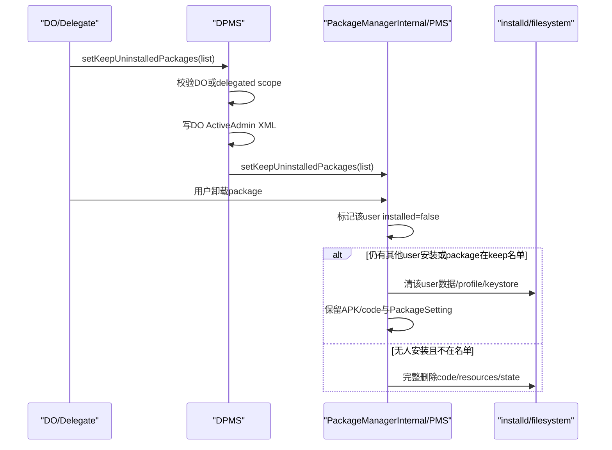
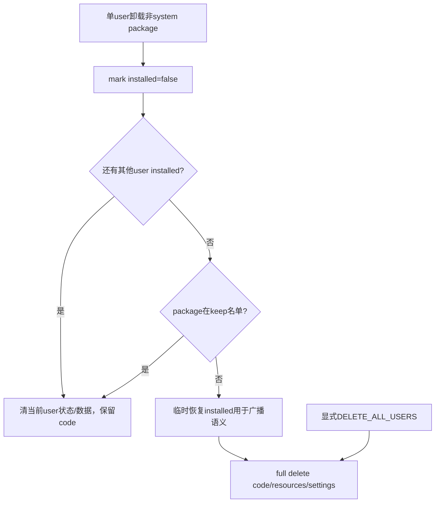
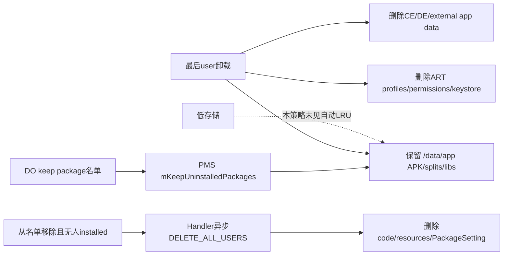

# 第 337 章 Android 企业 Keep Uninstalled Packages：委托、全局代码保留、用户卸载数据清理与异步回收边界链

> 源码基线：Android 11 / API 30 / `android-11.0.0_r48`。这里“keep”主要保留最后一个用户卸载后的APK/code与PackageSetting，不等于保留该用户应用数据，也不等于预下载未安装应用。

## 1. 这项策略解决什么问题

企业设备可能在多个用户间反复启停同一大应用。若最后一个用户卸载就删除/data/app代码，稍后恢复需要重新下载；DO可指定包在无人安装时继续缓存代码。

## 2. 公开API

`setKeepUninstalledPackages(admin, packageNames)` 写保留名单；`getKeepUninstalledPackages()` 读取全局名单。调用者可以是Device Owner或持专用delegated scope的delegate。

## 3. packageNames不能为null

服务Objects.requireNonNull。与前三章三态名单不同，本API没有用null表示“无限制”；清空策略必须传empty list。

## 4. 初始getter可为null

尚未设置、没有DO或旧设备未写字段时getter可能null。setter只能写非null列表，因此一旦设置，empty就是“当前不保留任何包”。

## 5. 不是预缓存API

文档明确设置名单不会下载、安装或预取APK。若包从未安装且PMS没有PackageSetting/code，添加名字没有即时磁盘效果。

## 6. 不是保留用户数据

普通用户卸载仍清CE/DE/external app data、runtime permissions、Keystore和应用状态。keep只改变“最后一个用户卸载时是否继续删除共享代码”的分支。

## 7. 是设备级名单

字段实际存放在全局Device Owner ActiveAdmin，并推送到PMS单一 `mKeepUninstalledPackages`，不是每user各一张保留表。

## 8. 对system app意义有限

system APK本就在只读system分区，卸载用户态通常只是标记未安装；keep判断只出现在非system应用的last-user单用户卸载分支。

## 9. 主要消费者

全树中PMS以该名单决定last user uninstall是否保留code，并在包从名单移除且无人安装时异步彻底删除。

## 10. 主链总览



## 11. parent instance门

客户端throwIfParentInstance；COPE parent实例不能调用。正常Device Owner位于system/full user并管理设备级列表。

## 12. mHasFeature=false

setter静默return，getternull，不向PMS推送；没有异常提醒调用方“策略未应用”。

## 13. who可null

admin非null表示Owner直接调用；who null表示callerPackage必须持 `DELEGATION_KEEP_UNINSTALLED_PACKAGES`。

## 14. callerPackage来源

DevicePolicyManager客户端传自身context package；服务delegation helper把它与Binder calling UID及当前user delegation map核对，不能只伪造字符串获得scope。

## 15. Owner直接门

who非null时 `enforceCanManageScope` 要求 `USES_POLICY_DEVICE_OWNER`，所以普通PO不能直接设置，即使API整体helper也支持多种Owner策略。

## 16. delegate路径不再检查reqPolicy

who null时helper只验证对应scope，没有再次证明scope由DO授予或设备当前DO存在。这与scope授予规则的组合是重要边界。

## 17. delegation规则落差

r48 `DEVICE_OWNER_DELEGATIONS` 只列NETWORK_LOGGING，KEEP_UNINSTALLED不在其中；因此PO理论上也能授予该scope，但实际API却写全局DO字段。

## 18. 无DO时的风险

delegate通过scope后，代码直接取得 `getDeviceOwnerAdminLocked()` 并访问其字段，没有null检查。若profile PO授予scope而设备无DO，setter可能NPE。

## 19. 有DO但跨userdelegate

若profile PO给自己user中的delegate该scope且设备另有DO，delegate可通过scope并修改全局DO ActiveAdmin内存字段，形成授权模型不一致。

## 20. 保存user也可能错位

setter用Binder calling user执行 `saveSettingsLocked(userHandle)`，但字段属于DO所在user。正常DO/user0 delegate一致；跨user delegate会把错误user文件保存，当前boot与重启可能分叉。

## 21. 不是推测成正常能力

文档意图是DO或其delegate。本章把PO授予/跨user路径列为r48加固疑点，而不是建议产品依赖的功能。

## 22. package列表未验证

服务只要求List非null；不检查包名格式、是否安装、是否非system、重复、签名或列表大小。

## 23. 空字符串与不存在包

会进入ActiveAdmin XML及PMS内存列表。PMS卸载真实包时按精确contains，脏名字不会产生作用。

## 24. 重复项

DPMS/PMS不去重，contains语义不变，但从旧名单移除时可能对重复旧项多次安排deletePackageIfUnused。

## 25. ActiveAdmin赋值

锁内取得Device Owner ActiveAdmin后，把传入List直接赋给 `keepUninstalledPackages`。

## 26. 持久化

复用package-list XML：非null empty写空outer tag，非空逐item写value；由于setter拒null，清空后重启仍恢复empty。

## 27. DPMS保存先于PMS推送

同一DPM锁内先saveSettingsLocked，再调用PackageManagerInternal.setKeepUninstalledPackages。两步没有事务/回滚。

## 28. 保存失败边界

内存DO字段已经变，仍继续推给PMS；当前boot执行新名单，而重启可能从旧磁盘恢复。

## 29. PMS调用是LocalService

PackageManagerInternal同在system_server，经LocalServices直接调用，不发生Binder驱动切换；会进入PMS自己的mLock。

## 30. 锁顺序

DPMS持DPM锁调用PMS LocalService，后者持PMS锁。任何反向PMS→DPMS同步路径都需审查锁顺序，避免system_server死锁。

## 31. DevicePolicyEvent

锁外记录SET_KEEP_UNINSTALLED_PACKAGES，admin字段写callerPackage，boolean表示who是否为null的delegate，并附完整字符串数组。

## 32. 事件不是磁盘证明

它无法证明DPM XML fsync成功、PMS实际clone完成或某APK仍在磁盘，只证明setter成功走到日志点。

## 33. getter授权

getter复用相同DO或delegate scope门，返回全局Device Owner字段；split-system-user TODO说明user0其他应用查询支持不完整。

## 34. getter无DO

通过授权后helper返回null；直接DO调用在无DO场景本就无法通过，异常delegate路径仍需测试。

## 35. boot恢复

`onLockSettingsReady()` 读取DO字段，若非null便推给PackageManagerInternal；empty也非null，所以会正确清空PMS旧运行态。

## 36. null不推送

初始null时boot不调用PMS setter，PMS默认mKeepUninstalledPackages保持null，与“无保留名单”一致。

## 37. PMS防御性复制

LocalService要求list非null并用 `new ArrayList<>(packageList)` 保存，避免DPMS后续修改同一List对象直接改变PMS状态。

## 38. PMS旧新差集

遍历旧mKeepUninstalledPackages；旧package不在新list则加入removedFromList。新增项只进入新内存，不触发下载/扫描。

## 39. 从名单删除的即时判断

更新mKeep后，对每个removed package调用deletePackageIfUnusedLPr；若仍有任一user installed，暂不删除code。

## 40. 添加名单不会复活APK

若包早已完整删除，mSettings中无PackageSetting，添加后PMS只记字符串；不会从商店、APEX或备份找回文件。

## 41. shouldKeep算法

`mKeepUninstalledPackages != null && contains(packageName)`，没有user、版本、签名或时间条件。

## 42. 保留名单何时真正参与卸载

executeDeletePackageLIF处理非system、单user删除时，先把该user标记uninstalled，再判断其他user是否仍installed或shouldKeep。

## 43. 其他user仍安装

无论名单如何，代码必须保留；只清当前user状态与数据。keep只在“已经没有任何user安装”时产生额外效果。

## 44. 最后user且在名单

仍走clearPackageStateAndReturn=true：清最后user数据、保存package restrictions并返回，不进入完整代码删除。

## 45. 最后user且不在名单

PMS暂把该user installed重新设true以保证完整卸载广播语义，然后走full delete移除code/resources和全局package state。

## 46. 为什么先改回installed

前面已经标false；完整删除流程需要把该user纳入removedUsers/broadcast，临时恢复让通用删除路径生成正确“曾安装并被删除”信息。

## 47. per-user卸载结果

对用户查询，该包仍是uninstalled/stopped/notLaunched，普通Launcher与默认PackageManager查询不会因为code保留而显示可运行应用。

## 48. code保留结果

AndroidPackage/PackageSetting与/data/app代码仍可供系统后续install-existing/重新启用流程利用，避免再次获取同一APK字节。

## 49. 不是应用仍能执行

没有user installed状态便没有普通应用入口；保留code不是保留进程、UID运行授权或组件可解析给普通用户。

## 50. 卸载决策图



## 51. clearPackageStateForUser

保留code分支仍调用该方法，逐user清除运行相关状态并填充PackageRemovedInfo。

## 52. ART profile

先调用destroyAppProfilesLIF(pkg)。这不是只删除某个user的小设置，而会清应用编译profile，保留APK后再次启用可能需要重新优化积累。

## 53. CE/DE数据

普通卸载flags不含DELETE_KEEP_DATA时，通过installd销毁credential/device encrypted app data。

## 54. external app data

还带FLAG_STORAGE_EXTERNAL，清Android/data、Android/media等应用专属外部状态；公共共享文件/云端数据另论。

## 55. DELETE_KEEP_DATA

若特权删除调用显式带该flag，数据层可保留；这是卸载flag语义，不是KeepUninstalledPackages自动赋予。

## 56. Keystore

removeKeystoreDataIfNeeded按user/appId清密钥命名空间。APK保留不保留应用私钥。

## 57. runtime permissions

PermissionManager reset该user运行时权限；以后重新安装/启用需按新安装状态重新处理授权。

## 58. preferred activities

默认处理器/首选Activity等per-user关系被清，防止卸载应用继续占据Intent默认项。

## 59. browser状态

若该包是user默认浏览器，clearDefaultBrowserIfNeededForUser会移除关联。

## 60. stopped/notLaunched

markPackageUninstalledForUser写installed=false、stopped=true、notLaunched=true，并清hidden/suspended/组件覆盖等user state。

## 61. suspend贡献

完整删除路径还在包曾有SUSPEND_APPS权限时解除其对其他包的suspension/distraction restrictions；保留code分支的相关清理要结合per-user state处理验证。

## 62. 卸载广播

PackageRemovedInfo仍填removedPackage、removedUsers等，外部观察者看到包对该user被移除；不会广播“只是代码缓存”。

## 63. 数据与代码两条证据

看到PACKAGE_REMOVED不能推断/data/app code一定删除；看到code目录仍在也不能推断用户数据或权限保留。

## 64. appId与PackageSetting

保留code意味着全局PackageSetting仍在并持有签名/version/appId等扫描状态，但user Keystore和permissions已清；“UID编号存在”不等于身份可继续使用。

## 65. native libraries

它们属于安装代码资源，通常随/data/app目录一起保留；用户数据目录则已清。

## 66. install-existing机会

系统可利用仍扫描的package为目标user设置installed=true，速度通常快于重新下载；具体DPC/商店UI是否选择该路径不由本API保证。

## 67. 版本不会自动更新

缓存的是卸载时已有版本。名单不会让PackageInstaller后台更新；重新启用前仍要按企业版本/签名政策检查。

## 68. 显式全用户删除边界

keep判断位于 `userId != USER_ALL` 的单user分支。特权调用若直接请求DELETE_ALL_USERS，会绕过该keep分支并进入完整删除。

## 69. 策略不是绝对不可删除锁

它优化普通逐user卸载后的缓存，不是对所有PMS删除模式、安装失败清理、损坏清理或存储维护的永久法律禁止。

## 70. system updated app

system/updated-system删除有回退system partition的独立语义；不应以普通/data app keep分支推断其版本回退行为。

## 71. 从名单移除

PMS先把新list设为权威值，再检查removed package。若无人installed，调用deletePackageIfUnusedLPr。

## 72. PackageSetting不存在

helper直接return；名单清理不会对从未安装或早已完全删除的字符串做任何文件操作。

## 73. 仍有人安装

不删除code。以后最后user卸载时shouldKeep已false，正常完整删除会发生。

## 74. 无人安装

PMS在mLock内确认后向handler post `deletePackageX(package, highestVersion, 0, DELETE_ALL_USERS)`。

## 75. 为什么异步

完整删除涉及安装锁、installd、广播和多服务清理，不能长期占用当前PMS mLock/DPMS调用栈。

## 76. setter返回早于回收

从名单去掉包后，DPM setter/PMS LocalService返回时code可能仍在；handler任务完成才是实际空间释放点。

## 77. 明确TODO竞态

源码注释承认非原子：检查“无人安装”后到异步delete执行前，包可能被重新安装，仍可能被删除。

## 78. 竞态为何严重

策略撤销与install-existing并发时，用户刚恢复的包可能被DELETE_ALL_USERS任务清掉，产生安装状态、广播和UI反复。

## 79. 理想修复

删除执行时重新在统一安装锁/mLock下验证新名单与isAnyInstalled，或用package generation/token确认检查与执行针对同一状态。

## 80. 重复旧名单项

removedFromList不去重；相同package可能post多个删除任务，加重竞态。入口规范化为Set可降低风险。

## 81. 添加与卸载并发

PMS setter更新mKeep在mLock内，单user卸载检查也持mLock，单次contains与状态检查有序；但外围完整删除阶段仍跨锁/异步。

## 82. DPMS与PMS双账

DPMS XML是重启源，PMS mKeep是运行决策。save/push失败或跨userdelegate错存会让两者不一致。

## 83. PMS名单不单独持久化

所读路径由DPMS在boot ready时重新推送，PMS没有为该政策建立独立Settings XML权威副本。

## 84. system_server重启

DPMS从DO XML恢复再push；若上次save失败，PMS恢复旧名单，可能立即改变后续卸载与名单移除回收行为。

## 85. Device Owner清除

Device Owner清除后应把PMS列表清空，才能让后续卸载不再命中旧政策并触发无人安装缓存回收；仅删除ActiveAdmin XML还不够改变PMS当前内存。

## 86. r48清除疑点

复读 `clearDeviceOwnerLocked()` 与 `clearUserPoliciesLocked()` 确认没有调用PMS `setKeepUninstalledPackages(empty)`：当前boot的PMS旧列表会残留；重启后PMS新实例默认null，但旧缓存code也不会因boot null路径主动删除。这是明确的退管清理缺口。

## 87. delegate撤销

撤销scope只阻止未来setter/getter，不自动清空DO已设置名单；政策归属仍是DO ActiveAdmin，不是delegate私有字段。

## 88. delegate轮换

新delegate读取/修改同一全局名单。事件boolean记录调用是否delegate，但XML无法归因哪个delegate最后写入。

## 89. storage cost

每个无人安装包仍占/data分区的APK、splits与native code。名单没有配额、大小上限、LRU或过期时间。

## 90. 存储关系图



## 91. 低存储不会自动忽略名单

本树mKeep消费者只在卸载/名单更新决策；未见DeviceStorageMonitor按压力裁剪这张企业名单。大量缓存可持续占空间。

## 92. DPC容量治理

应定期盘点实际code size、最后使用/安装user、恢复收益和剩余空间，主动从名单淘汰，而不是无限增长。

## 93. 预缓存应另做

若目标是离线前准备应用，需要PackageInstaller/商店下载、签名校验与版本固定；只先写keep名单毫无下载效果。

## 94. 恢复数据应另做

若目标是保存业务状态，需要应用同步、Backup或受管存储；keep APK不会保留数据库、账号token或私钥。

## 95. 安全更新

无人安装的旧代码仍占盘但不可普通运行；重新启用前应更新到合规版本，避免“缓存快”导致恢复已知漏洞版本。

## 96. 签名变化

PackageSetting保留旧签名信息，后续安装/更新仍受签名兼容校验；DPM名单本身不证明新APK签名可信。

## 97. 多用户测试

依次在user0/user10安装，卸载一个、卸载最后一个，观察installed flags、数据目录、code目录与广播；再empty名单观察异步回收。

## 98. DELETE_ALL_USERS测试

用特权只读推演/未来userdebug验证显式全用户删除是否绕过keep，不能把普通Settings卸载结果泛化到所有管理API。

## 99. 故障注入

覆盖DPMS save失败、PMS push异常、异步删除前install-existing、重复名单、Owner清除和system_server重启。

## 100. dumpsys证据

DPMS dump看keepUninstalledPackages；PMS dump/package setting看每userinstalled与codePath；文件系统看/data/app，installd数据目录验证数据是否清理。

## 101. 最小代码

```java
dpm.setKeepUninstalledPackages(
        admin, Arrays.asList("com.example.largeofflineapp"));
```

## 102. 常见误解一：名单会下载APK

错误。新增只更新DPMS/PMS列表；没有PackageInstaller、DownloadManager或网络调用。

## 103. 常见误解二：卸载后数据仍在

错误。普通flags下CE/DE/external data、permissions、Keystore和profiles照常清，主要保留共享code。

## 104. 常见误解三：任何删除都不能删code

错误。keep判断集中在非system单userlast-uninstall分支；DELETE_ALL_USERS等路径不保证受它保护。

## 105. 常见误解四：从名单移除立即释放空间

错误。PMS先post异步delete，setter返回时任务可能未执行，且存在安装并发竞态。

## 106. 常见误解五：delegate拥有自己的名单

错误。delegate写的是Device Owner ActiveAdmin的全局字段；撤销delegate不清政策。

## 107. 安全基线

只允许DO或严格证明由DO授予的same-userdelegate；规范化包名/去重/限量，绑定签名资产，完整删除执行前重新验证installed与keep generation。

## 108. 可靠性基线

监控DPMS/PMS双账、save/push、Owner清除和重启恢复；为异步回收提供完成证据，避免与install-existing并发。

## 109. 存储基线

设置总字节/包数/期限预算，低空间主动缩表，区分code、native libs、profiles与user data，不能用package数量代替真实容量。

## 110. macOS只读结论上限

源码能证明r48决策与清理调用，不能证明目标设备商店会走install-existing、实际APK大小、installd完成时点或OEM低存储回收策略。

## 111. 本章知识检查

回答：keep保留什么/删除什么？何时名单才影响卸载？empty与null有何不同？delegate写到哪里？从名单移除为何异步且有竞态？全用户删除怎样？

## 112. macOS 只读练习一：追授权与双账

从DPM客户端追enforceCanManageScope、DO ActiveAdmin XML、PackageManagerInternal与PMS mKeep，画出DO和delegate两种calling user；不编译。

## 113. macOS 只读练习二：手算多用户卸载

设包安装在user0和10，先卸载10再卸载0，分别在名单命中/不命中时填写installed flags、clearPackageStateAndReturn与code删除结果。

## 114. macOS 只读练习三：列清理对象

阅读markPackageUninstalledForUserLPw和clearPackageStateForUserLIF，制作code、CE、DE、external、ART profile、Keystore、runtime permission、preferred activity保留/删除表。

## 115. macOS 只读练习四：推演异步竞态

从PMS新名单移除无人安装package，在deletePackageIfUnusedLPr post后、deletePackageX前插入install-existing，解释源码TODO及需要的二次验证；Mac无需执行。

## 116. 练习答案要点

保留APK/code/PackageSetting，普通卸载仍清用户数据与身份状态；仅last-user非system单user卸载命中；empty清单、初始可null；delegate改DO全局字段；移除后异步全删且检查/执行非原子。

## 117. 复读修正一：cached app不等数据归档

初看API的keep cached容易理解成整应用快照。重读clearPackageStateForUserLIF后，正文已明确数据、权限、Keystore与profile照常删除。

## 118. 复读修正二：策略并非所有删除路径硬锁

shouldKeep只在非system且userId非USER_ALL分支出现。正文已加入显式全用户删除、system app和失败清理的适用范围限制。

## 119. 复读修正三：delegation与Owner清除都有落差

KEEP scope不在DO-only delegation列表，但API操作DO字段并按calling user保存；同时clearDeviceOwner主链未清PMS运行名单。正文记录无DO NPE、跨user持久化和退管后当前boot继续保留三类r48缺口。

## 120. 本章结论与下一章

Keep Uninstalled Packages是设备级代码缓存政策：最后一个用户普通卸载时仍彻底清理用户数据与授权，只保留共享APK/code和PackageSetting；空名单撤销后PMS异步全删无人安装包。委托角色落差、双账持久化、DELETE_ALL_USERS范围、异步安装竞态和无容量上限是主要风险。下一章进入DevicePolicy创建与管理完整secondary user API，追createAndManageUser的flag、包裁剪、Profile Owner建立、失败码与非原子补偿。
