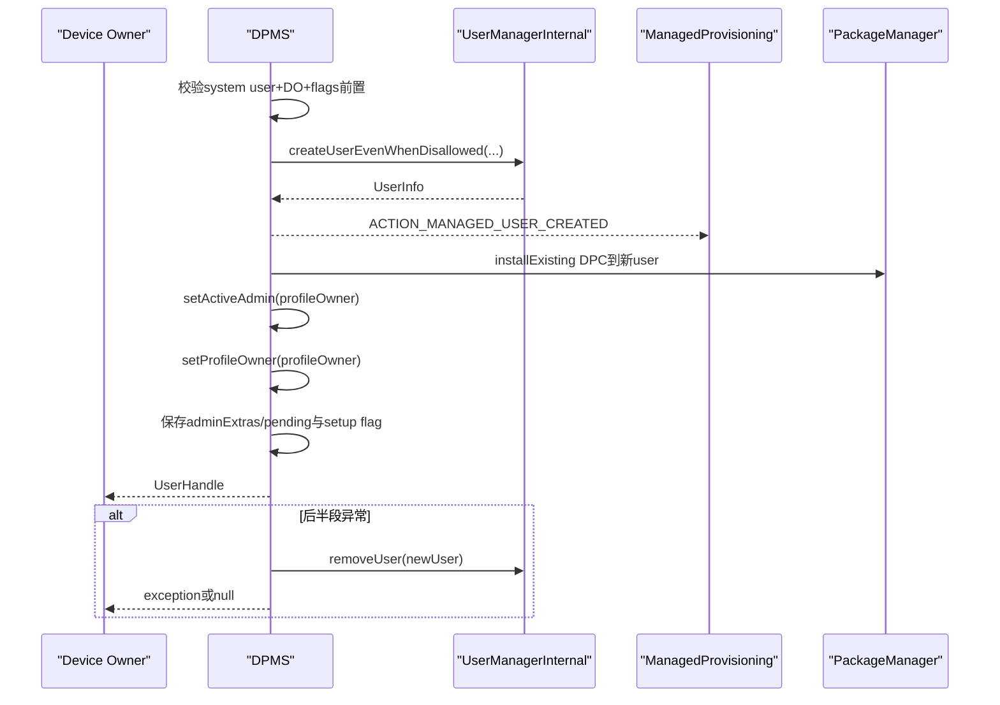
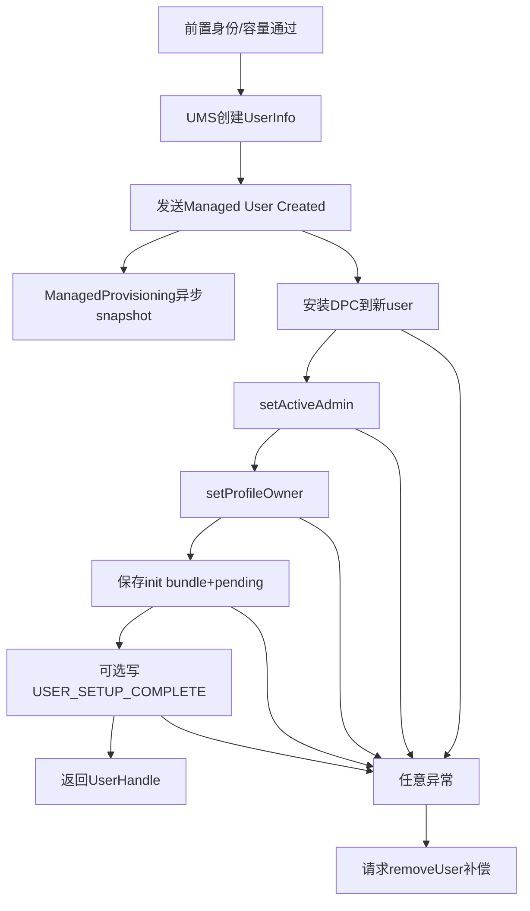
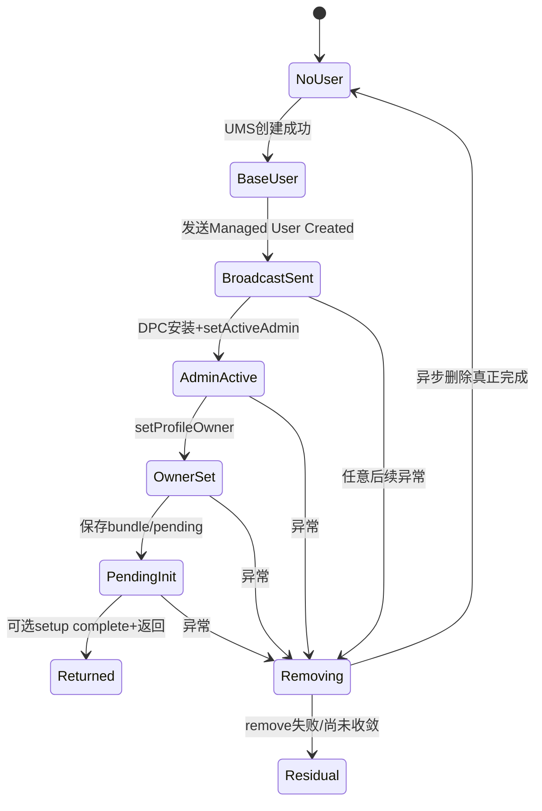

# 第 338 章 Android 企业 Create and Manage User：完整用户创建、系统包裁剪、Profile Owner 提交与失败补偿链

> 源码基线：Android 11 / API 30 / `android-11.0.0_r48`。`createAndManageUser()` 创建的是full secondary/demo user，不是managed profile；返回UserHandle前还要安装DPC、激活admin、设置Profile Owner并保存首次启动初始化状态。

## 1. API用途

Device Owner可创建由同一DPC管理的secondary user，适合共享设备、值班账号、专用终端或临时会话。

## 2. 与managed profile不同

新user type是FULL_SECONDARY或FULL_DEMO，没有parent/profileGroup从属关系；它有独立前台会话、CE密钥、应用状态和Profile Owner。

## 3. 调用入口

`DevicePolicyManager.createAndManageUser(admin, name, profileOwner, adminExtras, flags)` 通过Binder进入DPMS同步流程。

## 4. 返回值

成功返回UserHandle，但新user不会自动start或切到前台；DPC之后需调用start/switch等API。

## 5. UserHandle不能长期持久化

userId可在删除后复用。业务应保存UserManager serial number并在使用时重新解析，而不是永久相信整数ID。

## 6. admin与profileOwner

admin是当前Device Owner receiver；profileOwner是新user内将成为PO的receiver。两者package必须相同，但class可以不同。

## 7. adminExtras

PersistableBundle保存到新user的DevicePolicyData，等user首次启动时随ACTION_DEVICE_ADMIN_ENABLED交给新PO。

## 8. flags

主要包括SKIP_SETUP_WIZARD、MAKE_USER_EPHEMERAL、LEAVE_ALL_SYSTEM_APPS_ENABLED；实现还识别隐藏MAKE_USER_DEMO。

## 9. 非事务本质

UMS创建、广播、PMS安装、ActiveAdmin、Owners文件、policy XML和Secure setting分属多个服务/文件，没有统一事务。

## 10. 完整时序



## 11. 非null检查

服务明确requireNonNull admin和profileOwner；name与adminExtras未在入口显式require，客户端注解虽NonNull仍不能替代服务防御。

## 12. 同包检查优先

若两个ComponentName package不同，立即IllegalArgumentException，任何user都尚未创建。

## 13. 只允许system user调用

Binder calling UserHandle必须是SYSTEM；即使另一个full secondary user的PO/DO能力异常匹配，也被这道门拒绝。

## 14. 再验证Device Owner

进入DPM锁后用USES_POLICY_DEVICE_OWNER取得admin。只有真实DO receiver及其UID可创建。

## 15. 为什么两道门都要

Owner角色回答“谁有设备权力”，system-user门回答“从哪个user进程调用”；split-system-user产品上两者不必天然等价。

## 16. caller targetSdk

清Binder身份前保存callingUid，随后通过PackageManagerInternal读取targetSdk，决定失败是返回null还是抛ServiceSpecificException。

## 17. P兼容分界

targetSdk>=P时低存储、用户上限和未知创建失败转换为UserOperationException；旧target应用兼容返回null。

## 18. 清Binder身份

真正调用存储监控、UMS、PMS和Settings前以system_server身份执行，finally恢复原calling identity。

## 19. 低存储预检

DeviceStorageMonitorInternal.isMemoryLow为true时不创建，P+返回USER_OPERATION_ERROR_LOW_STORAGE。

## 20. 用户数量预检

`mUserManager.canAddMoreUsers()` false时P+返回USER_OPERATION_ERROR_MAX_USERS；这只是快检，UMS内部仍可能因竞态失败。

## 21. 预检不等提交成功

低存储状态、用户数、磁盘I/O和userId分配都可能在随后变化，UMS仍是权威创建点。

## 22. ephemeral flag

MAKE_USER_EPHEMERAL映射UserInfo.FLAG_EPHEMERAL；此类user切走或重启后可能被删除，不能承诺长期数据。

## 23. demo flag

只有flag包含MAKE_USER_DEMO且设备处于Demo Mode才用FULL_DEMO，否则静默创建普通FULL_SECONDARY。

## 24. demo文档落差

IntDef包含MAKE_USER_DEMO，实现也处理，但createAndManageUser Javadoc的supported flags列表未明确列它；这是隐藏/产品能力，不应给普通DPC盲用。

## 25. 未知flag

r48没有统一mask校验，未识别bits会被忽略，不会IllegalArgumentException。调用方必须只用当前版本定义位。

## 26. leaveAllSystemAppsEnabled

置位时disallowedPackages=null，新user不做企业provisioning的非必要system app裁剪。

## 27. 默认会裁剪

未置位时OverlayPackagesProvider计算ACTION_PROVISION_MANAGED_USER的non-required apps，并传给UMS创建。

## 28. 计算基准user

代码传 `UserHandle.myUserId()`；DPMS运行在system_server，结果通常是user0，用system镜像/已知组件推导新user初始包集。

## 29. launchable集合

Provider查询带MAIN/LAUNCHER的系统应用，包含uninstalled/disabled与Direct Boot两类组件，形成候选非必要集合。

## 30. required集合

从framework required_apps_managed_user、vendor required数组和DPC package合并，随后从候选删除，确保关键系统/DPC不被裁剪。

## 31. system IME保护

所有system InputMethod包从non-required集合移除，避免新user没有可用键盘。

## 32. disallowed集合

framework/vendor disallowed apps最终add进结果；源码注释明确若同包同时required与disallowed，disallowed获胜。

## 33. 非launchable disallowed也会被禁

因为disallowed在最后add，它不要求包具Launcher入口，可强制排除后台系统组件。

## 34. DPC被required保护

admin package总被加入required；但若产品又错误列入disallowed，最终仍可能被排除，随后installExisting负责补装。

## 35. overlay是产品政策

AOSP数组只是基线，vendor overlay可改变新user应用面。源码无法证明某OEM最终裁剪清单。

## 36. UMS调用

`createUserEvenWhenDisallowed(name, userType, flags, disallowedPackages)` 进入createUserInternalUnchecked，绕过普通DISALLOW_ADD_USER策略门。

## 37. EvenWhenDisallowed不是无条件

仍受低存储、最大user、user type限制、文件/密钥/PMS创建失败等内部约束；“bypass restriction”不等于必成。

## 38. DPM锁范围较大

DPMS在自身锁内调用UMS完整创建，后者会建立user XML、FBE key、PMS user state和目录，属于跨服务长操作/锁序审计点。

## 39. UMS Checked异常

createUser抛CheckedUserOperationException时DPMS只记log并让user保持null，没有保留具体错误码。

## 40. generic unknown

因此除两个前置特判外，P+调用者往往只收到USER_OPERATION_ERROR_UNKNOWN，难以区分内部真实原因。

## 41. 旧target返回null

target<P时同样日志化但不抛；DPC必须处理null，不能立即调用switchUser。

## 42. UserInfo完成点

UMS返回非null说明基础UserInfo、userId、密钥/目录/PMS状态的创建主流程完成，但尚未证明企业Owner配置完成。

## 43. userHandle提取

DPMS只保存新UserInfo.getUserHandle；后半段异常时用整数identifier请求移除。

## 44. 创建成功广播

构造ACTION_MANAGED_USER_CREATED，带EXTRA_USER_HANDLE和leave-all-system-apps布尔值。

## 45. 广播目标

Intent显式setPackage到ManagedProvisioning，发送给UserHandle.SYSTEM并加FLAG_RECEIVER_FOREGROUND，不是面向所有应用的隐式广播。

## 46. 广播时机过早

它在installExisting、setActiveAdmin、setProfileOwner、adminExtras保存之前发送；接收者看到的只是“基础user已创建”。

## 47. ManagedProvisioning动作

Receiver goAsync后启动高优先级Thread，ManagedUserCreationController在未leave-all时为该user建立SystemAppsSnapshot。

## 48. snapshot用途

记录创建时system app状态，供后续新系统应用处理/恢复政策参考；它不是Owner提交或user启动。

## 49. 广播与主线程并发

receiver线程可在DPMS后半段仍执行时读新user状态，形成有意的异步并发；不能假设收到广播时PO已存在。

## 50. 分阶段完成图



## 51. DPC安装检查

后半段先取admin package，若 `isPackageAvailable(adminPkg,newUser)` false，调用installExistingPackageAsUser。

## 52. installExisting不是网络安装

它复用设备上已有DPC APK/code，为新user打开installed状态；不下载新版本。

## 53. restricted permission flag

传INSTALL_ALL_WHITELIST_RESTRICTED_PERMISSIONS，并标INSTALL_REASON_POLICY，使企业DPC在新user获得政策安装语义。

## 54. 返回码未检查

代码不读取installExistingPackageAsUser的结果；若调用返回失败码但不抛，随后setActiveAdmin才以“包/receiver不可用”形式失败。

## 55. RemoteException被吞

同进程IPackageManager RemoteException catch注释认为不会发生并忽略；异常后仍继续setActiveAdmin。

## 56. Receiver必须存在

同package检查不足以保证profileOwner class在APK manifest中声明、export/permission/metadata正确；setActiveAdmin负责权威解析。

## 57. setActiveAdmin参数

调用 `setActiveAdmin(profileOwner, true, userHandle)`；refreshing=true用于这条受控初始化路径，避免普通重复激活语义。

## 58. ActiveAdmin不是Profile Owner

到此只在new user的DevicePolicyData建立admin记录。Owner身份仍需下一步Owners持久化。

## 59. PO名称来源疑点

代码调用 `getProfileOwnerName(Process.myUserHandle().getIdentifier())`。system_server进程user通常0，读取的是user0 Profile Owner名，而非Device Owner名或新user label，常可能为null。

## 60. setProfileOwner

对new full user检查安装、账户、已有Owner、active admin等，禁用该user Backup Service，写profile_owner.xml并启动Owner service。

## 61. full secondary没有parent restriction分支

`getProfileParentId(user)==user`，DISALLOW_ADD_MANAGED_PROFILE的false返回分支不适用；它不是managed profile。

## 62. setProfileOwner返回值被忽略

createAndManageUser没有检查boolean。当前已创建full user的正常路径几乎应true，但API设计上忽略返回仍是不完整的完成验证。

## 63. exception会进入补偿

setActiveAdmin/setProfileOwner抛出的SecurityException、IllegalArgumentException、I/O包装异常等被外层catch(Throwable)捕获。

## 64. catch范围过宽

连Error也会尝试remove user再转换成generic failure，可能掩盖system_server严重故障的原始类型/栈给客户端。

## 65. backup副作用

setProfileOwner在写Owner前禁用new user backup；若之后init bundle保存失败并异步删user，backup状态随user删除收敛，而非事务回滚。

## 66. Owner changed广播

setProfileOwner会发ACTION_PROFILE_OWNER_CHANGED并启动Owner service；这可能早于createAndManageUser最终返回。

## 67. init bundle写入

成功设PO后，在DPM锁内把adminExtras赋给new user DevicePolicyData.mInitBundle，并设mAdminBroadcastPending=true。

## 68. pending的意义

新user尚未start时先保存；handleStartUser阶段maybeSendAdminEnabledBroadcastLocked把bundle交给PO，成功后清bundle与pending再保存。

## 69. Bundle可为null

即使adminExtras null，pending仍true；首次启动仍需完成admin enabled初始化，只是无额外参数。

## 70. 持久化保证重启恢复

在user首次启动前system_server/设备重启，policy XML中的pending与PersistableBundle可继续驱动后续广播。

## 71. PersistableBundle限制

只支持可持久化基本类型/数组/嵌套PersistableBundle，不应放Binder、Parcelable或超大业务数据。

## 72. onEnable不是当前立即调用

API文档说明bundle在user首次start时传给admin；createAndManageUser返回不等于新PO进程已经收到onEnable。

## 73. SKIP_SETUP_WIZARD

置位后直接写new user的Settings.Secure.USER_SETUP_COMPLETE=1，跳过该user Setup Wizard。

## 74. 不置位

保持默认setup state，之后切换/启动时仍可能进入Setup Wizard；Owner存在不自动等于setup complete。

## 75. setup写入顺序

它发生在Owner和pending bundle保存之后，是返回前最后步骤之一；写setting异常会触发删除补偿。

## 76. LEAVE flag传播

同一布尔既决定UMS disallowedPackages是否为null，也放入早期ManagedProvisioning广播决定是否建立system-app snapshot。

## 77. 两边必须一致

若广播消费者读取值与实际UMS传参分叉，会导致后续OTA system app治理错误；代码复用同一local boolean降低风险。

## 78. 成功返回的最低证明

基础user已创建、DPC可用、ActiveAdmin/PO调用未抛、pending保存与可选setup写完成；但user尚未start/unlock，onEnable未确认。

## 79. 不证明可切换

User restrictions、最大running users、系统UI模式、ephemeral状态或后续启动错误仍可能让switch/start失败。

## 80. 不证明DPC业务就绪

Owner service启动与admin enabled广播都是异步边界，DPC数据库、网络注册、策略下发可能尚未完成。

## 81. 后半段失败补偿

catch(Throwable)调用 `mUserManager.removeUser(userHandle)`，然后P+抛USER_OPERATION_ERROR_UNKNOWN，旧target返回null。

## 82. 使用普通removeUser

这里不是前述DevicePolicy removeUserEvenWhenDisallowed；调用system身份的UserManager.removeUser，返回boolean被忽略。

## 83. 删除可能失败

若removeUser返回false，补偿仍向客户端报告创建失败但partial user可残留。代码没有第二次尝试或持久pending cleanup任务。

## 84. 删除通常异步

UserManager removal包含stop、broadcast、PMS/installd/key销毁等阶段；catch返回时不能证明所有文件与Owner记录已清。

## 85. 已发广播不可撤回

ManagedProvisioning可能已建立snapshot，甚至与remove并发。失败补偿没有发送create-aborted专用广播给它。

## 86. 已写Owner记录窗口

若失败发生在setProfileOwner之后，profile_owner.xml与Owner service短暂存在，等待user删除监听/清理收敛。

## 87. partial user可见性

UMS创建主链自身用partial flag处理崩溃恢复；但DPMS后半段失败发生在基础user已完成后，属于更高层“企业配置partial”。

## 88. 错误码丢失

安装、admin、Owner、Settings失败最终统一UNKNOWN，message只用Throwable.getMessage；DPC应采集system日志而非只看code。

## 89. targetSdk兼容风险

同一设备上旧DPC拿null、新DPC拿UserOperationException。公共管理SDK应封装两种结果，不要仅catch异常。

## 90. 状态与补偿图



## 91. 并发创建

两个DO线程虽受DPM锁串行进入UMS段，但第一个释放锁后后半段继续时第二个可开始；user上限与资源仍可能发生交错。

## 92. broadcast receiver线程

ManagedProvisioning receiver调用goAsync并自行new Thread，设MAX_PRIORITY；它不在DPMS Binder线程，也不阻塞createAndManageUser等待snapshot完成。

## 93. 过高线程优先级边界

MAX_PRIORITY可能与system工作竞争，snapshot I/O失败也不回传DPMS。广播投递成功不等snapshot成功。

## 94. name边界

name传给UMS作为显示名，不是安全标识；可重复、可本地化，审计与业务映射应使用serial number。

## 95. ephemeral语义

返回成功的ephemeral user仍可能在切走/重启被自动删除；DPC不应把其adminExtras和本地数据当永久资产。

## 96. demo语义

Demo Mode下MAKE_USER_DEMO生成FULL_DEMO，可能受RetailDemo/用户切换清理逻辑影响；普通企业secondary不要误置。

## 97. 包裁剪安全性

过度裁剪可能缺少拨号、设置、辅助功能或vendor依赖；required/system IME保护不等于所有隐式依赖都被发现。

## 98. leave-all代价

保留全部system apps提升兼容性，却扩大攻击面、后台耗电与用户可见入口；应按产品验证选择，而非默认求稳。

## 99. DPC升级

新user安装的是设备当前已有DPC版本；创建API不下载升级。应先确保主user DPC版本/签名合规再批量创建。

## 100. 最小调用代码

```java
UserHandle user = dpm.createAndManageUser(
        deviceOwner, "Shift A", profileOwner,
        initExtras, DevicePolicyManager.SKIP_SETUP_WIZARD);
```

## 101. 完成点速记

```text
UserInfo != null        ≠ Profile Owner完成
创建广播已收到          ≠ DPC已安装
createAndManageUser返回 ≠ user已启动/解锁
removeUser已调用        ≠ 补偿已完成
```

## 102. 常见误解一：managed user就是managed profile

错误。这里创建FULL_SECONDARY/FULL_DEMO并为其设置PO；没有parent profile关系。

## 103. 常见误解二：成功会自动切换用户

错误。源码返回前没有startUserInBackground或switchUser；DPC必须另行调度。

## 104. 常见误解三：广播代表企业配置完成

错误。广播早于DPC安装、admin激活和PO提交，只适合ManagedProvisioning做创建后快照。

## 105. 常见误解四：SKIP_SETUP跳过所有初始化

错误。它只写USER_SETUP_COMPLETE；DPC安装、Owner、admin enabled pending及user启动仍各自存在。

## 106. 常见误解五：catch后一定没有残留user

错误。remove返回值未检查且删除多阶段异步；广播/snapshot/Owner短暂状态也无法事务回滚。

## 107. 安全基线

严格同包receiver与DO/system-user门，固定已验证flags和DPC签名，审核overlay裁剪，创建成功后再验证PO component、serial与user type。

## 108. 可靠性基线

为每个阶段保存外部状态机；失败后轮询user真正删除，清ManagedProvisioning snapshot残留；不要只依赖同步return。

## 109. 测试基线

覆盖低存储、max users、旧/新targetSdk、DPC不可用、Receiver不存在、Owner设置失败、Secure写失败、remove失败、ephemeral/demo和未知flags。

## 110. macOS只读结论上限

源码可证明AOSP顺序与补偿请求，不能证明目标vendor required/disallowed数组、实际存储阈值、UMS删除耗时或DPC首次onEnable业务完成。

## 111. 本章知识检查

回答：为何是full user？创建广播位于哪一步？四个flag各做什么？DPC怎样进入新user？adminExtras何时交付？后半段失败为何可能残留？

## 112. macOS 只读练习一：画完成点

从createAndManageUser逐行列UserInfo、broadcast、package available、ActiveAdmin、ProfileOwner、pending bundle、setup complete和return八个完成点；不编译。

## 113. macOS 只读练习二：推演包裁剪

阅读OverlayPackagesProvider，设launcher={a,b,dpc,ime}、required={a,dpc}、systemIme={ime}、disallowed={a,b}，手算最终nonRequired集合并解释disallowed优先。

## 114. macOS 只读练习三：故障矩阵

分别在broadcast后、installExisting后、setActiveAdmin后、setProfileOwner后和setup写入时抛异常，填写已产生文件/广播/服务及remove补偿对象。

## 115. macOS 只读练习四：核对首次启动

追mAdminBroadcastPending、mInitBundle与maybeSendAdminEnabledBroadcastLocked，解释设备重启、user首次start和receiver投递失败时Bundle何时清除；Mac无需运行。

## 116. 练习答案要点

创建FULL user；广播只证明基础user；默认裁剪非必要system apps；DPC用install-existing；PO后保存pending bundle，首次start交付；补偿remove返回未检查且异步。

## 117. 复读修正一：广播不是最终成功信号

初读容易按ACTION名称理解为managed user已配置完成。重排源码顺序后确认它早于DPC/Owner，正文已定义为基础创建通知。

## 118. 复读修正二：错误码只有部分精确

LOW_STORAGE和MAX_USERS由DPMS前置映射；UMS Checked异常及后半段Throwable都退化UNKNOWN。正文不再泛称“P+总能拿具体原因”。

## 119. 复读修正三：补偿不是事务回滚

removeUser返回值被忽略、删除异步且广播已发；正文已把partial Owner、snapshot和残留user纳入恢复，而非写成catch即恢复原状。

## 120. 本章结论与下一章

createAndManageUser把full user创建、system app裁剪、DPC install-existing、ActiveAdmin、Profile Owner、首次启动Bundle和Setup状态串成一条非事务链；返回成功仍不代表user已启动，早期广播更不是最终完成。失败只发起best-effort删除。下一章将比较getSecondaryUsers、switchUser、startUserInBackground、stopUser与removeUser的目标校验、返回码和异步生命周期边界。
