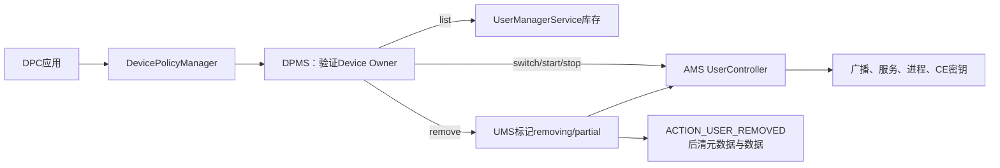
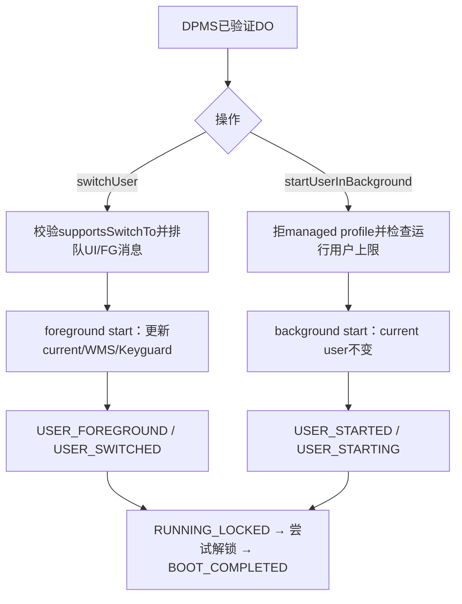
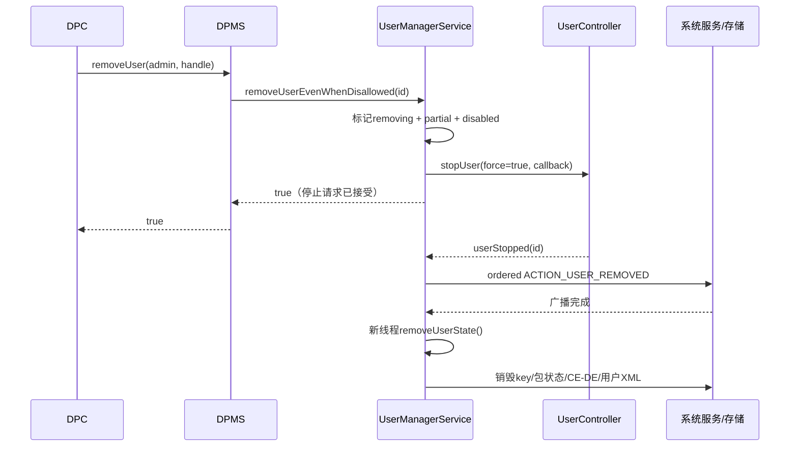

# 第 339 章 Android 企业 Secondary User：枚举、切换、后台启动、停止、删除与异步生命周期边界链

> 源码基线：Android 11 / API 30 / `android-11.0.0_r48`。本章只做macOS源码阅读，不编译。最重要的阅读原则是：DPM方法的同步返回值通常只表示“请求被接收或初步拒绝”，不能直接当作用户已切换、已解锁、已停止或数据已删除。

## 1. 本章解决什么问题

第338章创建了一个full secondary user，但返回的`UserHandle`还只是身份。现在要回答五个运营问题：有哪些secondary user、怎样切到前台、怎样在后台启动、怎样停止，以及怎样永久删除。

## 2. 五个API并非一层抽象

`getSecondaryUsers()`读UserManager库存；`switchUser()`和`startUserInBackground()`进入ActivityManager的`UserController`；`stopUser()`也由UserController驱动；`removeUser()`则先由UserManager标记删除，再借停止回调完成持久数据清理。

## 3. 先区分四个动词

start让用户进入运行状态，switch还会让其成为foreground/current user，stop终止会话与进程但通常保留账户和数据，remove才删除用户元数据、密钥、包状态及CE/DE数据。把stop翻译成“删除”会导致危险误判。

## 4. 公共入口仍要求Device Owner

这五个接口都从`DevicePolicyManager`进入DPMS；服务端分别使用`enforceDeviceOwner()`或`USES_POLICY_DEVICE_OWNER`查活动admin。普通Profile Owner不能替DO枚举或控制任意secondary user。

## 5. parent实例被客户端拒绝

公开方法均先执行`throwIfParentInstance()`。组织所有工作资料的parent DPM实例也不能借这些入口管理整机secondary user；这里是Device Owner用户管理能力。

## 6. Binder身份为何要清除

DO通过Binder进入system_server后，DPMS验证admin，再清除calling identity，以system身份调用AMS/UMS。清身份不是绕过前置授权，而是避免下游把DPC应用UID误当成具备`INTERACT_ACROSS_USERS_FULL`的系统调用者。

## 7. UserHandle只是瞬时定位符

这些API最终主要取`userHandle.getIdentifier()`。userId在删除并经过回收后可能复用，因此业务数据库应同时保存UserManager serial number；恢复任务前要验证“这个ID仍对应原用户”。

## 8. API返回类型透露语义

枚举返回列表；switch/remove返回boolean；start/stop返回`USER_OPERATION_*`整数。即使类型叫success，也要继续追它对应的是排队成功、状态变更完成，还是数据擦除完成。

## 9. 一条总原则：接收点不等于完成点

`switchUser()`可以在UI消息刚入队时返回true；`startUserInBackground()`可以在BOOT_COMPLETED之前返回success；`stopUser()`可以在STOPPING广播之前返回success；`removeUser()`可以在任何用户数据尚未擦除时返回true。

## 10. 进程与线程总览

DPC调用发生在应用进程；DPMS、AMS、UserController、UMS均在system_server，但仍跨Binder接口和不同Handler/FgThread/新建清理线程。所谓“同进程”不代表同步执行到生命周期终点。

## 11. 五类操作总图



## 12. getSecondaryUsers的入口

DPMS先判`who`非null且是Device Owner，然后在clean identity中调用`UserManager.getUsers(true)`。参数`true`表示排除dying/removing用户，并不是“只返回enabled用户”。

## 13. getUsers还排除partial与pre-created

r48的单参数`getUsers(excludeDying)`转成`excludePartial=true`、`excludePreCreated=true`。因此创建未完成的partial用户和库存中的pre-created用户不会出现在DO的secondary列表里。

## 14. secondary的真实过滤条件

DPMS循环UserInfo，只判断“不是system user”且“不是managed profile”。它没有检查名字是否为secondary，也没有只接受`USER_TYPE_FULL_SECONDARY`这一种type。

## 15. Demo与Guest也可能进入列表

因为过滤条件宽于方法名，非system、非managed-profile的full demo或guest通常也会被返回。调用方不应看到列表项就假定它一定由`createAndManageUser()`创建或一定安装了自己的DPC。

## 16. 非managed的其他profile边界

代码仅调用`isManagedProfile()`，并非统一调用`isProfile()`排除所有资料类型。若产品定义其他非managed profile type，不能只凭API文档推定其一定被过滤；应检查具体UserType配置。

## 17. disabled不是显式过滤条件

`getUsers(true)`排partial、dying和pre-created，但没有按`UserInfo.isEnabled()`筛选。一个disabled但尚未被标为removing的full user仍可能出现在结果中。

## 18. 列表是时刻快照

查询返回新的`ArrayList<UserHandle>`。查询后用户可能立即被删除、禁用或切换，所以列表不能作为后续操作的永久授权证明；每个动作还要接受下游实时校验。

## 19. 列表不提供运行状态

`getSecondaryUsers()`没有告诉用户处于BOOTING、RUNNING_LOCKED、RUNNING_UNLOCKED、STOPPING还是SHUTDOWN。需要另用受权限保护的运行/解锁查询或监听生命周期事件建立状态机。

## 20. 列表也不提供归属关系

结果不标记谁创建了用户、当前Profile Owner是谁、是否affiliated或是否ephemeral。企业控制台应逐项补查，不能从“DO可见”推导“该用户处于合规管理状态”。

## 21. switchUser的null语义

公开API允许`userHandle=null`；DPMS把它转换为`UserHandle.USER_SYSTEM`。所以null不是“自动选择主用户”，而是在r48代码中明确切换到user 0。

## 22. primary与system不总是同义

文档把null描述为switch to primary，但split/headless system user产品中user 0可能不是人类前台用户。学习源码时应写“服务端目标是USER_SYSTEM”，再单独讨论产品形态。

## 23. DPMS没有校验目标来自secondary列表

`switchUser()`拿到任意非nullUserHandle就把ID交给AMS，没有先检查它是否由`getSecondaryUsers()`返回。真正的存在性和可切换性判断发生在UserController。

## 24. switchUser锁内跨服务调用

r48的DPMS在`getLockObject()`同步块中验证DO、清身份并调用`IActivityManager.switchUser()`。虽然AMS通常快速返回，但这仍是持有DPMS锁的跨组件调用，排障时要注意锁等待而非把它当纯字段操作。

## 25. 已是current user直接成功

UserController首先读取当前userId；若目标就是当前用户，直接返回true，不重新发送完整切换广播，也不证明此前BOOT_COMPLETED或某个DPC初始化任务刚刚完成。

## 26. 无UserInfo返回false

目标ID不存在时，`getUserInfo()`为null，switch返回false。由于userId可回收，一个陈旧ID也可能不再是null而指向新用户，因此serial验证比仅看boolean更可靠。

## 27. supportsSwitchTo的实际规则

`UserInfo.supportsSwitchTo()`拒绝资料用户和pre-created用户，也拒绝“已disabled且ephemeral”的删除中用户。它并未普遍拒绝所有disabled full user，这是容易从方法名想当然读错的地方。

## 28. managed profile双重不能切前台

`supportsSwitchTo()`对任何profile返回false，UserController随后还显式检查`isManagedProfile()`。工作资料依附父用户运行，不能像full user一样成为整机current user。

## 29. UserController未初始化会失败

系统启动早期若`mInitialized`尚未设置，switch返回false。此处false不是目标用户坏了，而是UserController还未准备好，重试策略应区分启动时序与永久非法目标。

## 30. true出现得非常早

通过校验后，UserController只设置`mTargetUserId`并向UI Handler或主Handler发送启动消息，随即返回true。此时目标可能尚未start，WMS current user也未变，界面、广播和解锁都未完成。

## 31. 有UI与无UI两条入口

启用user switch UI时先显示切换对话框，由dialog再触发foreground start；禁用UI时直接发送`START_USER_SWITCH_FG_MSG`。相同true返回值背后，真正开始切换的时刻不同。

## 32. foreground start会清LockTask

`startUserInternal(..., foreground=true)`先调用`clearAllLockedTasks("startUser")`。专用设备若处于LockTask/Kiosk模式，切用户前后必须重新核对锁定任务策略，而不能认为会话切换完全透明。

## 33. current user字段先于完整完成更新

foreground路径在UserController锁内把`mCurrentUserId`改为目标并清`mTargetUserId`，随后更新Configuration、WMS current user和Keyguard。业务观察到current变化时，应用启动与用户解锁仍可继续进行。

## 34. 新用户从BOOTING开始

目标尚未运行时创建`UserState`并加入`mStartedUsers`和LRU，通知UMS内部状态，再调用`onBeforeStartUser()`准备限制和app storage，最后由Handler分发系统服务start与生命周期广播。

## 35. 正在STOPPING可以被救回

若目标尚在STOPPING、还没有发送ACTION_SHUTDOWN，start会恢复`lastState`并继续；因此stop返回success后立刻switch，停止流程可能被取消。这说明“已接收stop”不是不可逆终点。

## 36. 已到SHUTDOWN则重新boot

如果ACTION_SHUTDOWN已发送，用户状态会重新设为BOOTING，按新一次启动处理。竞态分析必须记录状态代际，不能只按调用先后猜最终结果。

## 37. 前台切换广播不是一个事件

系统会向旧用户及其profiles发`ACTION_USER_BACKGROUND`，向新用户及其profiles发`ACTION_USER_FOREGROUND`，再向所有用户发送带MANAGE_USERS保护的`ACTION_USER_SWITCHED`。这些事件的受众和含义不同。

## 38. ACTION_USER_SWITCHED仍非解锁完成

该广播在`moveUserToForeground()`阶段发出，后面还会继续`finishUserBoot()`、Direct Boot、CE解锁、初始化与BOOT_COMPLETED。因此它证明前台身份切换，不证明credential-encrypted数据可用。

## 39. UserSwitchObserver可能拖慢但不能永远阻塞

注册observer的`onUserSwitching()`带回调。r48等待约3秒，超时会继续切换；再过约5秒记录仍未回调者。超时机制保护系统推进，但也意味着迟到observer不能把“未准备好”永久当作闸门。

## 40. switch完成的更可靠证据

需要按目标选择证据：前台身份看current user和switch-complete observer；Direct Boot组件看LOCKED_BOOT_COMPLETED；依赖CE数据看USER_UNLOCKED；依赖普通启动完成看BOOT_COMPLETED。单一boolean覆盖不了这些完成点。

## 41. startUserInBackground的目标

后台启动让full secondary user运行系统服务、Direct Boot组件，并在密钥可解时进入RUNNING_UNLOCKED，但不改变整机foreground/current user，也不把其Home显示到屏幕上。

## 42. DPMS先拒绝managed profile

服务端用`isManagedProfile(userId)`返回`USER_OPERATION_ERROR_MANAGED_PROFILE`。虽然底层UserController能够随父用户管理profile，DPM这个企业API刻意只面向非managed secondary user。

## 43. 它仍未证明目标是secondary

除了managed-profile判断，DPMS没有验证非system、full、enabled或来自枚举列表。传入user 0、guest、demo、无效ID等情况会继续由容量判断和AMS真实状态决定，文档意图与服务端防线要分开写。

## 44. 最大运行用户数是启动前置门

DPMS调用`ActivityManagerInternal.canStartMoreUsers()`，其算法计算当前非STOPPING/SHUTDOWN的运行用户数，与overlay配置的`mMaxRunningUsers`比较。达到上限即返回`ERROR_MAX_RUNNING_USERS`。

## 45. system-only user 0可能不计数

在headless/split system user形态，纯system user 0不被`getRunningUsersLU()`计入容量；普通形态则会计入。相同硬件资源下，产品overlay和用户模型会改变后台并发上限的表面行为。

## 46. 一个值得注意的先后顺序

容量检查发生在AMS判断“目标是否已经运行”之前。因此达到上限时，即使目标本来就在运行，DPMS也可能先返回MAX_RUNNING_USERS，而不是幂等success。这是r48实现顺序带来的边界。

## 47. AMS boolean到DPM错误码的映射

通过容量门后，`IActivityManager.startUserInBackground()`返回true映射SUCCESS，false映射UNKNOWN，RemoteException也映射UNKNOWN。除managed profile和容量外，DPM不会给出更细失败原因。

## 48. 无效ID最终是UNKNOWN

UserController查不到UserInfo就返回false，DPMS将它压缩为`USER_OPERATION_ERROR_UNKNOWN`。因此UNKNOWN可能是无效ID、precondition或内部失败，不能直接解释为“系统繁忙”。

## 49. 后台启动不会经过switch UI

它调用`startUser(userId, foreground=false)`，不显示切换dialog、不改current user、不发USER_FOREGROUND/USER_SWITCHED；但会调整started users、LRU、current profile IDs并走用户boot链。

## 50. start success只表示同步启动入口成功

UserController在安排USER_START_MSG、发起USER_STARTED/USER_STARTING并调用`finishUserBoot()`后返回true。LOCKED_BOOT_COMPLETED、解锁、USER_INITIALIZE和BOOT_COMPLETED大多仍在异步队列后方。

## 51. 从启动请求到可用状态

最小状态序列是BOOTING→RUNNING_LOCKED→RUNNING_UNLOCKING→RUNNING_UNLOCKED；若凭据密钥不能用，可能长期停在RUNNING_LOCKED。运行和解锁是两条不同维度。

## 52. 前台与后台启动对比图



## 53. Direct Boot决定后台能力

进入RUNNING_LOCKED后，device-encrypted存储和directBootAware组件可工作；依赖credential-encrypted存储的普通DPC逻辑必须等待USER_UNLOCKED。后台start success不能保证业务数据库已经可读。

## 54. 空凭据尝试并不保证成功

`finishUserBoot()`对full user调用`maybeUnlockUser()`，以空token尝试解锁。无安全凭据或密钥已可用时可能成功；受凭据保护时失败并保留locked状态，需要真实解锁流程。

## 55. 首次启动还要initialize

用户未带`FLAG_INITIALIZED`时，解锁完成链发送有序`ACTION_USER_INITIALIZE`，receiver结束后才`makeInitialized()`。企业初始化逻辑必须考虑广播未完成或进程重启时的幂等性。

## 56. BOOT_COMPLETED是后段证据

`ACTION_BOOT_COMPLETED`在用户unlock、可能的PRE_BOOT与初始化步骤后发送。它比start返回值更接近“普通应用可工作”，但仍不等于DPC自己的网络注册、策略同步或业务任务成功。

## 57. 已经是当前用户的特殊快返

若start目标就是current user且已有UserState，UserController通常直接返回true；只有已经RUNNING_UNLOCKED时才会立即完成可选unlock listener。DPMS没有传listener，所以DPC仍拿不到完成回调。

## 58. 正在SHUTDOWN的延迟重启

非Handler线程看到目标处于SHUTDOWN时，会post一个未来start并立刻返回true。此时success更加明确地只是“已安排在完全停止后重启”。

## 59. pre-created用户的底层特例

后台UserController允许启动pre-created user做系统服务初始化，完成后又自动stop；但DPMS枚举排除了pre-created。若调用方凭未知ID强行调用，服务端意图和生命周期都与普通secondary不同。

## 60. 后台运行可能随后被容量回收

完成前台用户切换后，`finishUserSwitch()`会调用`stopRunningUsersLU(mMaxRunningUsers)`按LRU停止超限后台用户。一次start success并不承诺用户无限期常驻。

## 61. DISALLOW_RUN_IN_BACKGROUND的效果

用户切到后台后，若其带`DISALLOW_RUN_IN_BACKGROUND`，UserController会尝试停止该旧用户及关联资料。DPC应把限制策略与会话驻留需求一起设计。

## 62. stopUser的第一道目标检查

DPMS验证DO后先拒绝managed profile并返回`ERROR_MANAGED_PROFILE`。full user的关联profile会由底层group停止逻辑处理，但不能把managed profile本身作为这个API的目标。

## 63. stopUser没有secondary库存校验

与start类似，它没有确认ID来自`getSecondaryUsers()`。尤其传user 0时，底层`UserController.stopUser()`会抛`IllegalArgumentException("Can't stop system user")`，DPMS只捕获RemoteException，因而不一定优雅映射为UNKNOWN。

## 64. force=true改变关联用户策略

DPMS固定调用AMS `stopUser(userId, true, null)`。底层若同profile group包含current/system相关用户，本可返回RELATED_USERS_CANNOT_STOP；force使其仍停止请求的目标，而不停止不可停的关联用户。

## 65. current user不能直接stop

UserController在`stopUsersLU()`先检查目标是否current，返回`USER_OP_IS_CURRENT`；DPMS将其映射为`USER_OPERATION_ERROR_CURRENT_USER`。正确流程通常先switch到user 0，再停止旧用户。

## 66. logoutUser为何是组合操作

另一个API `logoutUser()`供affiliated secondary-user Profile Owner调用：先切到USER_SYSTEM，若接受，再stop calling user。它说明“退出当前用户”本质是switch和stop两个异步请求串联，而非原子指令。

## 67. stop的SUCCESS映射

AMS返回`ActivityManager.USER_OP_SUCCESS`时DPMS映射SUCCESS；IS_CURRENT映射CURRENT_USER；其他底层码一律UNKNOWN。DPC看不到IS_SYSTEM或RELATED_USERS等所有细分信息。

## 68. success发生在STOPPING刚入队时

对运行用户，UserController把状态设为STOPPING、更新started数组，然后向Handler post停止流程便返回SUCCESS。此时进程尚未全部杀死，CE密钥也尚未锁定。

## 69. stopUser没有传完成callback

DPMS向AMS传入null `IStopUserCallback`，所以DPC只得到同步结果码，没有`userStopped()`/`userStopAborted()`。它必须通过受保护广播或状态查询观察最终完成。

## 70. 已停止用户也返回SUCCESS

若`mStartedUsers`没有目标，`stopSingleUserLU()`视作已停止；存在callback会异步补回调，但DPMS传null，于是调用快速成功。幂等成功不代表这次执行了新的清理动作。

## 71. 停止广播的第一阶段

Handler先清除该用户旧广播队列，再向USER_ALL发送registered-only、有序`ACTION_USER_STOPPING`，并要求接收者具备`INTERACT_ACROSS_USERS`。结果receiver触发下一阶段。

## 72. ACTION_SHUTDOWN在目标用户内发送

完成STOPPING后，状态转STATE_SHUTDOWN，SystemServiceManager收到stopUser，再向目标user发送有序`ACTION_SHUTDOWN`。其完成receiver才进入`finishUserStopped()`。

## 73. stop可以在STOPPING阶段被启动取消

前面看到start可从STOPPING恢复lastState；而`finishUserStopping()`也会验证状态仍为STOPPING，否则直接退出。调用先后不等于最终状态，必须观察最终广播/查询。

## 74. 真正停止时移出started集合

`finishUserStopped()`在锁内确认相同UserState且处于SHUTDOWN，然后从`mStartedUsers`和LRU移除，通知UMS移除运行状态，并强停该用户的全部进程。

## 75. ACTION_USER_STOPPED的位置

`forceStopUser()`在强停进程后向USER_ALL发送registered-only、foreground的`ACTION_USER_STOPPED`。它比DPMS result更接近会话结束，但后面的SystemService cleanup和密钥驱逐仍可能继续。

## 76. stop通常会锁CE密钥

普通DPM stop使用`allowDelayedLocking=false`，最终经FgThread调用StorageManager `lockUserKey()`。这是异步步骤；stop SUCCESS与ACTION_USER_STOPPED到达时不能轻率地断言密钥已完成驱逐。

## 77. delayed locking不适用于这条DPM调用

系统另有`stopUserWithDelayedLocking()`，但DPMS这里固定走普通stop。即使产品overlay开启delay模式，显式DPM stop仍要求锁定，而系统自动停止后台用户可能允许延迟锁定。

## 78. ephemeral停止会触发删除

`finishUserStopped()`检查UserInfo；若是ephemeral且非pre-created，会调用`removeUserEvenWhenDisallowed()`。所以对临时用户，stop可能自然升级成永久remove，DPC不能期待下次还能恢复该账户数据。

## 79. stop不等于普通用户数据消失

非ephemeral full user停止后，UserInfo、应用安装状态、DE/CE数据和策略仍在；下次start可重新进入会话。安全需求若是退役账户，应调用remove并等待删除完成。

## 80. 建议的停止完成证据

至少组合`ACTION_USER_STOPPED`、`isUserRunning(...)=false`和需要时的存储/业务状态；若目标是ephemeral，还要继续等`ACTION_USER_REMOVED`。不要用一次SUCCESS刷新数据库为“已删除”。

## 81. removeUser是永久退役入口

公开文档称删除用户/profile及全部关联数据，primary不能删除。DPMS验证Device Owner、目标UserHandle非null，然后根据目标是否managed profile选择不同的删除限制key。

## 82. 删除限制按目标类型选择

managed profile使用`DISALLOW_REMOVE_MANAGED_PROFILE`，其他用户使用`DISALLOW_REMOVE_USER`。虽然本组API多次排斥managed profile，remove特意允许DO删除它，这是与start/stop不同的目标集合。

## 83. restriction source而非boolean决定DO能否绕过

DPMS调用`getUserRestrictionSource()`：未设置则不受影响；restriction由同一DO贡献时可绕过；由PO、base/system或其他来源贡献时阻止。这体现“Owner可绕过自己设的限制，但不能覆盖更高或他人来源”。

```java
String restriction = isManagedProfile(targetId)
        ? UserManager.DISALLOW_REMOVE_MANAGED_PROFILE
        : UserManager.DISALLOW_REMOVE_USER;
if (isAdminAffectedByRestriction(who, restriction, callingUserId)) {
    return false;
}
return mUserManagerInternal.removeUserEvenWhenDisallowed(targetId);
```

## 84. callingUserId参与restriction归因

`isAdminAffectedByRestriction()`传的是Binder calling user，即DO所在用户，通常为user 0，而不是目标用户。阅读多用户限制时，要区分“限制作用的删除动作”与“贡献限制的admin身份”。

## 85. EvenWhenDisallowed不是无条件删除

该内部入口绕过普通UserManager的restriction检查，但仍受UserManagerService自身不变量约束：不能删system user、不能删current user、目标必须存在、不能已经在removing集合中。

## 86. 删除current user会失败

UMS读取`ActivityManager.getCurrentUser()`；若等于目标就返回false。标准做法是先请求switch并确认新current user，再remove旧用户，不能只因switch返回true就立刻假定删除一定通过。

## 87. 删除system user会失败

UMS明确拒绝`USER_SYSTEM`。这使`removeUser()`通常返回false，而`stopUser(user0)`可能在更早层抛IllegalArgumentException；相同非法目标在不同API中的失败形态不一致。

## 88. 第一次真正提交是标记removing

UMS在锁内把userId加入`mRemovingUserIds`和recently removed队列，再把`UserInfo.partial=true`、添加`FLAG_DISABLED`并写user XML。设备此后即便重启，也能识别并清理这个未完成删除用户。

## 89. userId不会在当前boot立刻复用

`addRemovingUserIdLocked()`保留删除ID并维护近期删除LRU，注释说明当前boot避免复用，但重启或回收后仍可能再用。外部记录若只保存整数，长期仍会串到新身份。

## 90. AppOps先于停止被清除

标记后UMS尝试`mAppOpsService.removeUser(userId)`，再请求AMS强制stop。删除链并非把所有状态包在一个事务里；某个子系统已清而停止失败时，会出现中间状态。

## 91. removeUser异步提交与清理图



## 92. remove true的精确定义

UMS只要成功把目标标为removing，并让AMS `stopUser()`返回USER_OP_SUCCESS，就返回true。它不等待stop callback、USER_REMOVED广播或磁盘清理，所以boolean应记录为“删除已提交”。

## 93. 停止失败留下什么

若AMS stop抛RemoteException或返回非SUCCESS，UMS返回false，但此前removing、partial、disabled以及AppOps清理可能已发生。这里没有把这些字段恢复原值的回滚代码，false也不等于“系统完全没变”。

## 94. 已停止用户仍异步完成

UserController发现目标未运行时，会把`userStopped()`回调post到Handler。UMS仍先返回true；稍后回调才调用`finishRemoveUser()`。因此“它原本没运行”也不会把永久删除变成同步操作。

## 95. ACTION_USER_REMOVED先于最终擦除

`finishRemoveUser()`先向ALL users发送需要MANAGE_USERS权限的有序`ACTION_USER_REMOVED`。只有有序广播最终receiver执行后，才启动新Thread调用`removeUserState()`。

## 96. 为什么广播放在擦除之前

注释说明要让其他服务先关闭活动并清自己的用户状态，再彻底擦除user system目录和用户列表。它是“删除即将最终落盘”的协调点，不是磁盘擦除已经完成的证明。

## 97. 广播receiver能延长中间窗口

有序广播逐个receiver执行，慢receiver、超时或system_server繁忙都会推迟最终清理线程。在此窗口里枚举已因dying标记排除目标，但磁盘与部分服务状态仍存在。

## 98. 最终清理使用单独Thread

r48直接`new Thread().start()`执行ActivityManagerInternal onUserRemoved与`removeUserState()`，不在原Binder线程或广播receiver线程同步擦除。排障日志要跨线程和时间线关联。

## 99. removeUserState先销毁用户密钥

UMS调用StorageManager `destroyUserKey(userId)`；partial user可能没有完整key，IllegalStateException会被记录后继续。这是best-effort分步清理，而不是某一步失败便整体回滚。

## 100. GateKeeper状态也要清

系统尝试`GateKeeper.clearSecureUserId(userId)`；异常只记录warning并继续。用户记录可能先从Android侧消失，而安全硬件相关清理曾失败，诊断时不能只看列表为空。

## 101. PackageManager清理是独立阶段

`mPm.cleanUpUser(this, userId)`清理per-user包状态和应用数据相关内容；之后UserDataPreparer销毁DE与CE user data。代码顺序意味着中途崩溃可留下需要启动恢复继续处理的残余。

## 102. CE与DE都会被销毁

最终调用带`FLAG_STORAGE_DE | FLAG_STORAGE_CE`的`destroyUserData()`。这与stop只锁CE密钥完全不同：remove针对的是永久数据销毁，而非暂时不可访问。

## 103. 用户内存表与restriction也要清

UMS从`mUsers`、managed标记、user states以及base/applied/cached restrictions中移除目标，还清理该用户贡献给其他目标的local/global DevicePolicy restriction，并按需重新应用全局限制。

## 104. 最后更新持久列表与XML

UMS写回user list，删除`/data/system/users/<id>.xml`，更新可用userIds；某些构建配置还释放removing ID。看到XML消失才更接近最终持久完成，但外部DPC通常不能直接依赖这个私有路径。

## 105. 删除没有公开完成callback

DPM `removeUser()`只返回boolean。适合DPC的可观察证据通常是受权限限制的USER_REMOVED、枚举中消失、serial映射失效，以及应用自身后台账本的最终确认；需要设计重启后的reconcile。

## 106. 枚举消失早于数据擦除

因为`getSecondaryUsers()`调用`getUsers(excludeDying=true)`，一旦UMS设置removing，目标便从列表消失。用“列表不含该ID”当作“CE/DE已擦除”会把提交点误作完成点。

## 107. 四个操作的幂等性不同

switch到current通常true；start已运行通常可true但可能被DPMS容量前置门挡住；stop已停止返回success；remove已removing返回false。重试器不能用一个统一的“false就无限重试”策略。

## 108. 推荐的企业状态模型

DPC数据库可维护`DISCOVERED → START_REQUESTED → RUNNING_LOCKED/UNLOCKED → SWITCH_REQUESTED → FOREGROUND → STOP_REQUESTED → STOPPED → REMOVE_REQUESTED → REMOVED`，并另存serial。每个箭头由真实事件校正，而不是调用返回即跳到终态。

## 109. 竞态一：switch true后立即remove旧用户

switch true只说明消息已排队，AMS current可能仍是旧用户；此时remove旧用户会因current检查返回false。应等待current user或switch-complete证据，再提交remove。

## 110. 竞态二：stop后立即start

若start赶在STOPPING结束前到达，UserController可恢复lastState并取消后续停止；若已到SHUTDOWN，则排队完整重启。最终状态取决于状态机时刻，而非“最后一次方法调用”这句口号。

## 111. 竞态三：remove与陈旧UserHandle

删除完成并经过ID复用后，旧handle可能命中新用户。每次危险操作前都应把保存的serial重新解析并核对Owner/用户属性；若不一致，停止自动化并要求人工审计。

## 112. macOS只读练习一：画五条完成线

用`rg`定位DPMS五个方法，在纸上分别标注“同步返回”“关键广播”“最终状态”。要求解释为什么switch true、start success、stop success、remove true分别不能当作最终完成；无需编译。

## 113. macOS只读练习二：手推运行上限

阅读`canStartMoreUsers()`与`getRunningUsersLU()`，假设最大运行数为3，分别推演普通system user、headless system user、两个已运行secondary以及“目标已运行”时DPM返回码，特别观察容量检查先于幂等判断。

## 114. macOS只读练习三：手推stop/start竞态

沿`STATE_STOPPING`、`finishUserStopping()`、`STATE_SHUTDOWN`和`startUserInternal()`画两条时序：start在SHUTDOWN广播前到达，以及在SHUTDOWN后到达。说明一个恢复旧状态，一个按新boot处理。

## 115. macOS只读练习四：审计删除证据

从`removeUserUnchecked()`追到`finishRemoveUser()`和`removeUserState()`，列出removing标记、stop callback、USER_REMOVED、清key、清包/数据、删XML六个节点，并判断列表消失发生在哪个节点。

## 116. 四个返回值速查

switch true是“目标合法且切换消息已接受”；start SUCCESS是“容量门通过且UserController接受启动”；stop SUCCESS是“停止流程已接受或本就停止”；remove true是“已标记删除且stop请求接受”。四者都不是磁盘级完成ACK。

## 117. 复读修正一：secondary列表比名字宽

初读容易写成“只返回createAndManageUser创建的FULL_SECONDARY”。复查实现后已改为：排除system、managed profile、partial、dying、pre-created，但可能包含guest/demo、disabled full及产品自定义的非managed类型。

## 118. 复读修正二：后台start的容量门不完全幂等

初读UserController会觉得已运行用户start总能true；回到DPMS看到`canStartMoreUsers()`先执行，已达上限时可能先返回MAX_RUNNING_USERS。正文已明确分开DPMS前置门和AMS幂等路径。

## 119. 复读修正三：USER_REMOVED不是擦除完成

广播完成后才新建线程执行key、GateKeeper、PackageManager、CE/DE、restriction和XML清理。正文把USER_REMOVED定义为协调/提交后段信号，不再写成“收到广播即全部数据消失”。

## 120. 本章结论与下一章

企业多用户控制是一组异步状态机：枚举是过滤快照，switch/start把请求交给UserController，stop结束会话并通常锁CE，remove先标记dying再等stop、广播和后台擦除。可靠DPC必须保存serial、区分接收点与完成点、容忍竞态并在重启后reconcile。下一章将追`logoutUser()`、affiliation、ephemeral session与SystemUI Logout入口，比较DO发起退出和secondary Profile Owner自助退出的权限及状态边界。
