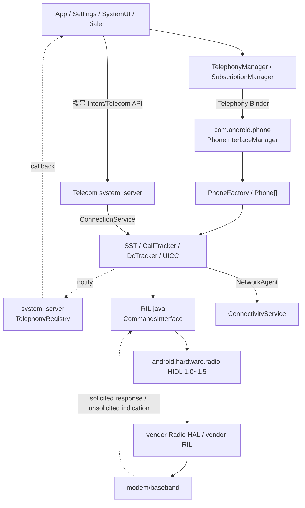
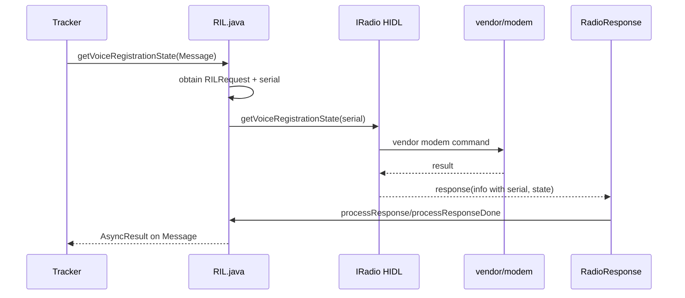
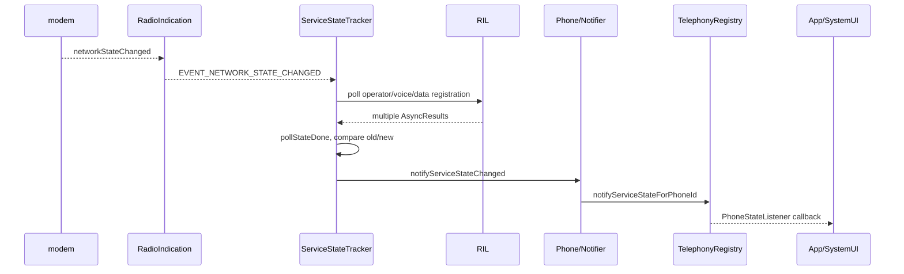
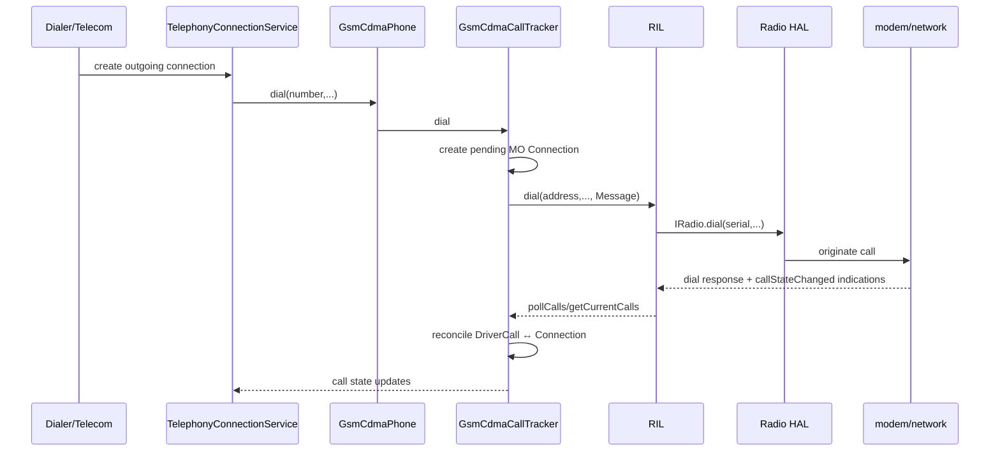
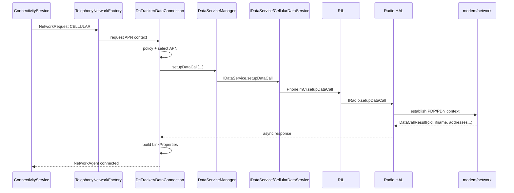

# 34 Android 电话系统、Telephony Framework 与 RIL

> 源码版本：Android 11 / API 30 / `android-11.0.0_r48`  
> 学习方式：macOS 只读源码，不要求编译  
> 前置章节：[06 SystemServer](./06-SystemServer与系统服务.md)、[07 Binder](./07-Binder基础与完整调用链.md)、[24 网络栈](./24-Android网络栈ConnectivityService与NetworkAgent.md)

电话系统是 Android Framework 中跨度最大的子系统之一。它同时面对 App API、SIM/UICC、多卡订阅、蜂窝驻网、语音通话、短信、移动数据、IMS、Radio HAL、厂商 RIL 和基带。阅读时若只沿 `TelephonyManager` 搜索，很快会淹没在 callback 和状态机中。

本章按五条主线组织：

1. Telephony 进程怎样启动并为每个 modem/slot 创建 Phone？
2. SIM 插入后怎样形成可供用户选择的 Subscription？
3. 基带网络注册怎样变成状态栏信号和 ServiceState callback？
4. 拨号怎样在 Telecom、Telephony、IMS/CS 和基带之间流动？
5. 蜂窝数据怎样建立 DataCall，再作为 Android Network 交给 ConnectivityService？

---

## 1. 先分清 Telephony、Telecom、Connectivity

| 子系统 | 主要职责 | 典型对象 |
|---|---|---|
| Telephony | SIM、蜂窝服务状态、Radio、通话能力、短信、数据连接 | Phone、SST、RIL、DcTracker |
| Telecom | 统一管理电话账户、Call、ConnectionService、InCall UI、音频路由 | CallsManager、Call、ConnectionService |
| Connectivity | 把蜂窝/Wi-Fi 等变成 Network，选择默认网络和路由 | NetworkAgent、NetworkRequest、netId |

一通电话会跨 Telecom 和 Telephony；一次移动数据联网会跨 Telephony 和 Connectivity。它们不是三个名字相近的同一服务。

---

## 2. 总体架构



---

## 3. 关键进程

```text
App 进程
system_server
com.android.phone
IMS service 进程（实现相关）
Radio HAL/vendor service 进程
modem/baseband 固件
```

- `TelephonyRegistry` 在 `system_server`，负责把电话状态通知分发给监听者。
- Telephony Framework 主体通常运行在 `com.android.phone`，包括 `PhoneFactory`、Phone、RIL、SST、DcTracker。
- Radio HAL 通常在 vendor 进程，通过 HIDL 与 Java RIL 通信。
- 基带往往是独立处理器/固件，不运行 Android Java。

---

## 4. Android 11 的源码入口

```text
frameworks/base/telephony/java/android/telephony/TelephonyManager.java
frameworks/base/telephony/java/com/android/internal/telephony/ITelephony.aidl
frameworks/base/services/core/java/com/android/server/TelephonyRegistry.java

packages/services/Telephony/src/com/android/phone/PhoneGlobals.java
packages/services/Telephony/src/com/android/phone/PhoneInterfaceManager.java
packages/services/Telephony/src/com/android/phone/CarrierConfigLoader.java

frameworks/opt/telephony/src/java/com/android/internal/telephony/PhoneFactory.java
frameworks/opt/telephony/src/java/com/android/internal/telephony/Phone.java
frameworks/opt/telephony/src/java/com/android/internal/telephony/GsmCdmaPhone.java
frameworks/opt/telephony/src/java/com/android/internal/telephony/ServiceStateTracker.java
frameworks/opt/telephony/src/java/com/android/internal/telephony/GsmCdmaCallTracker.java
frameworks/opt/telephony/src/java/com/android/internal/telephony/dataconnection/DcTracker.java
frameworks/opt/telephony/src/java/com/android/internal/telephony/dataconnection/DataConnection.java
frameworks/opt/telephony/src/java/com/android/internal/telephony/RIL.java

hardware/interfaces/radio/1.0/IRadio.hal
hardware/interfaces/radio/1.5/IRadio.hal
```

---

## 5. TelephonyManager 是客户端门面

App 常用：

```java
TelephonyManager tm = context.getSystemService(TelephonyManager.class);
```

它提供设备/订阅/网络/通话相关 API，但大部分真正工作通过 Binder 交给：

- `ITelephony`：主要由 `PhoneInterfaceManager` 实现。
- `ITelephonyRegistry`：监听注册和状态通知。
- `ISub`：Subscription 查询与管理。

`TelephonyManager` 本身不是 modem driver，也不持有完整 Phone 状态机。

---

## 6. Phone App 启动

`packages/services/Telephony` 生成的系统应用进程通常是 `com.android.phone`。`PhoneGlobals` 是 Application 级入口，初始化：

```text
PhoneFactory.makeDefaultPhones(context)
PhoneInterfaceManager
CallNotifier
CarrierConfig
其他电话服务
```

它是平台签名、拥有特权权限的系统进程。名字含 App，不代表它只是拨号界面；Dialer/InCall UI 可以是另一个包。

---

## 7. PhoneFactory

`PhoneFactory.makeDefaultPhones()` 创建全局 Telephony 对象：

- RIL/CommandsInterface 数组。
- UiccController。
- SubscriptionController。
- 每个 phoneId 的 `GsmCdmaPhone`。
- IMS/PhoneSwitcher/NetworkFactory 等协调对象。
- 默认 Phone。

它应只初始化一次，许多类假设在同一个 Telephony Looper/线程环境创建。

---

## 8. phoneId、slotId、subId 不一样

这是电话源码第一大混淆点：

| ID | 含义 | 是否稳定 |
|---|---|---|
| slotId | 物理/逻辑 SIM 卡槽索引 | 通常对应卡槽，但 eSIM 使关系更复杂 |
| phoneId | Framework Phone/modem 逻辑索引 | 与当前 modem/Phone 数组相关 |
| subId | 一条有效订阅记录 ID | SIM 更换/激活状态变化后可能变化 |

不能把 `subId=1` 当作卡槽 1。应使用 `SubscriptionManager` 显式转换，并处理 invalid ID。

后续日志还会出现另外三个局部 ID：

| ID | 所属范围 | 用途 |
|---|---|---|
| RIL serial | 一次 RIL client 会话的 pending request list | 匹配 request 与 solicited response |
| call index | modem 当前 CS call list | 标识一条 DriverCall，随通话建立/结束变化 |
| data `cid` | modem 当前 packet data call list | 标识一条 DataCall/PDP/PDN context |

它们都可能是小整数，但互相没有转换关系。看到日志中的 `id=1` 必须先确认对象类型和 phoneId。

---

## 9. 多卡与多 Modem

设备可能是：

- 单卡单待。
- 双卡双待 DSDS。
- 双卡双通 DSDA。
- eSIM 多 profile，但同时激活数量受 modem 能力限制。

`Phone[]` 数量、physical slot 数、active subscription 数未必相等。RadioConfig HAL 提供 SIM slot mapping、modem config 等全局能力。

---

## 10. Phone 抽象

`Phone` 是 Framework 内部抽象，聚合某个 phoneId 的：

- CommandsInterface/RIL。
- ServiceStateTracker。
- CallTracker。
- DcTracker。
- Icc/UICC records。
- IMS Phone。
- notifier 和 registrants。

`GsmCdmaPhone` 同时支持 3GPP/3GPP2 传统路径，并可把 IMS 呼叫委托给 `ImsPhone`。

这里的 Phone 不是一台物理手机，而是一个电话栈逻辑实例。

---

## 11. CommandsInterface

`CommandsInterface` 定义 Framework 对 radio 的抽象命令：

```text
getVoiceRegistrationState
getDataRegistrationState
getSignalStrength
dial / hangup
setupDataCall / deactivateDataCall
getIccCardStatus
setRadioPower
```

`RIL` 是主要实现。上层 Tracker 依赖接口而非直接依赖 HIDL，便于测试和替代实现。

---

## 12. RIL 在 Android 11 是什么

历史上 RIL 常指 Java RIL + `rild` + vendor RIL socket 架构。Android 11 当前主路径中，`RIL.java` 直接作为 HIDL client 连接 `android.hardware.radio` service。

所以应区分：

```text
RIL.java：Telephony Framework 中的 Radio Interface Layer client
Radio HAL：标准 HIDL 接口
vendor radio implementation：把标准请求映射到 modem 协议
baseband：实际蜂窝协议栈/射频控制
```

不要把旧教程的每一步 `RIL.java → rild socket` 原样套到本工程。

---

## 13. Radio HAL 版本

Android 11 源码有 Radio HIDL 1.0～1.5：

```text
hardware/interfaces/radio/1.0/IRadio.hal
...
hardware/interfaces/radio/1.5/IRadio.hal
```

后续版本通过继承增加请求、响应和结构。`RIL.java` 获取可用 proxy，并按接口版本选择 `_1_2`、`_1_4`、`_1_5` 等方法。

设备声明哪个版本要看 VINTF 和运行时服务，不能以源码最高版本断言硬件支持。

---

## 14. 请求、响应、主动上报三类消息

```text
Request：Framework 主动问/命令 modem
Solicited Response：对应某个 Request 的异步结果
Unsolicited Indication：modem 主动报告状态变化
```

例如：

```text
getSignalStrength → response
signalStrengthChanged → unsolicited indication
```

两者都可能更新信号，但触发方式不同。

---

## 15. RILRequest 与 serial

每个异步 request 分配 serial，封装成 `RILRequest` 并放入 pending request list。调用 HIDL 后立即返回；稍后 `RadioResponse` 带 serial 回来：

```text
serial → findAndRemoveRequestFromList
       → 转换 RadioError/result
       → AsyncResult
       → Message.sendToTarget
```

serial 是一次请求关联 ID，不是 phoneId、callId 或 data cid。

---

## 16. RIL 请求时序



上层 Handler 不能假设请求函数返回时结果已经存在。

---

## 17. RadioIndication

`RadioIndication.java` 接收 modem 主动通知，例如：

- radio state changed。
- network state changed。
- new SMS。
- call state changed。
- data call list changed。
- signal strength。
- SIM status changed。

它转换 HIDL 类型后通知 RIL 中的 RegistrantList。相关 Tracker 预先 register，收到 event 后主动查询或更新状态机。

---

## 18. Registrant 模式

Telephony 大量使用：

```text
registerForXxx(handler, eventWhat, userObj)
unregisterForXxx(handler)
RegistrantList.notifyRegistrants(AsyncResult)
```

这是一种进程内异步观察者机制，通常基于 Handler Message，不是 Android broadcast，也不是 Binder callback。

阅读 event 时固定查：谁注册、`what` 是多少、由哪个线程 Handler 处理、何时注销。

---

## 19. Radio 状态

需要区分：

```text
RADIO_OFF：modem radio 关闭
RADIO_ON：radio 可工作
RADIO_UNAVAILABLE：HAL/modem 不可用或重启中
```

飞行模式通常请求 radio power off，但 emergency、双卡策略和厂商实现会影响细节。

radio on 不等于已注册运营商，更不等于移动数据已连接。

---

## 20. Radio HAL 死亡

RIL 监听 HIDL service death。死亡后需要：

- 清理 proxy。
- 让 pending requests 以 `RADIO_NOT_AVAILABLE` 等错误结束。
- 增加 cookie/generation，丢弃旧 death notification。
- 延迟重新获取 service。
- 重新设置 response/indication functions。
- 上报 radio unavailable，再等待状态恢复。

旧请求的迟到 response 不能误配给新会话。

---

## 21. SIM、UICC、ICC

术语粗略关系：

```text
UICC：智能卡平台
SIM/USIM/CSIM：卡上的应用
ICC：历史代码中的泛化叫法
eUICC/eSIM：嵌入式 UICC，可管理多个 profile
```

源码中 `Icc*`、`Uicc*` 并存是历史演进结果，不表示两套完全独立的卡。

---

## 22. UiccController

`UiccController` 监听 radio available、SIM status changed 等事件，并请求 `getIccCardStatus`，维护：

```text
UiccSlot
 └─ UiccCard
     └─ UiccCardApplication
         ├─ IccRecords
         └─ IccFileHandler
```

每个 application 可能是 SIM、USIM、CSIM、ISIM，承载不同 records 和认证能力。

---

## 23. SIM 状态不是一个 boolean

常见阶段：

```text
ABSENT
NOT_READY
PIN_REQUIRED / PUK_REQUIRED
NETWORK_LOCKED
READY
LOADED
CARD_IO_ERROR
```

卡被识别、application ready、records loaded、subscription 建立是不同完成点。

“手机读到 SIM”不等于 IMSI、运营商配置、联系人和所有 records 已加载完。

---

## 24. IccRecords

`IccRecords` 及其子类异步读取：

- IMSI。
- ICCID。
- SPN。
- operator numeric/MCC-MNC。
- voicemail、语言等卡记录。

它通过 CommandsInterface 发 APDU/ICC IO 请求，等待 response，累积 recordsToLoad；全部关键记录完成后通知 records loaded registrants。

日志中的 `records loaded` 是一个同步里程碑，不是 SIM 插入的同义词。

---

## 25. Subscription

Subscription 是 Android 对一条可用移动业务订阅的数据库/Framework 抽象，包含 subId、slot、carrier、display name、MCC/MNC、状态等。

`SubscriptionInfoUpdater` 根据 SIM 状态/ICCID 更新订阅数据库，`SubscriptionController` 通过 `ISub` 提供查询和默认订阅管理。

换卡、eSIM profile 启停、slot mapping 变化都可能让 active subscriptions 改变。

---

## 26. 默认订阅不是一个值

常见默认项：

- default voice subId。
- default SMS subId。
- default data subId。
- overall default subId。

双卡设备可分别选择。看到“默认 SIM”必须问是哪项业务。

数据默认订阅切换还会触发 PhoneSwitcher/NetworkFactory 重新决定哪个 modem 建默认数据。

---

## 27. CarrierConfig

`CarrierConfigManager` 提供按订阅的运营商配置，`CarrierConfigLoader` 合并默认值、carrier app/service 和 override。

它可控制：

- VoLTE/VoWiFi/IMS 开关和行为。
- APN/漫游/网络显示策略。
- 通话、短信、数据 UI/功能。
- 特定运营商兼容开关。

同一 AOSP 代码在不同 SIM 上行为不同，常常是 CarrierConfig，而非 Java 分支随机变化。

---

## 28. ServiceStateTracker

SST 管理某个 Phone 的：

- voice/data registration state。
- operator numeric/name。
- roaming。
- RAT/network type。
- signal strength。
- cell identity/location。
- radio power 和 poll state。

它是蜂窝“驻网状态聚合器”，不是通话 Call 状态机。

---

## 29. 驻网是什么

modem 开机后搜索支持的 PLMN/频段和小区，选择网络并完成注册。Framework 最终看到：

```text
voice registration state
data registration state
operator
access technology (GSM/WCDMA/LTE/NR...)
roaming
reject cause
```

SIM ready 只是身份材料可用；是否能驻网还取决于覆盖、套餐、网络授权、频段、radio 状态。

---

## 30. pollState

收到 network state changed 或主动刷新时，SST 并行请求：

```text
getOperator
getVoiceRegistrationState
getDataRegistrationState
getNetworkSelectionMode
```

每个 response 到达后减少 pending polling context；全部结束才综合构造新的 `ServiceState`，与旧状态比较并发送差异通知。

不能用某一个 response 单独宣布完整驻网状态已更新。

---

## 31. ServiceState 更新时序



---

## 32. Voice 与 Data 注册可不同

设备可能出现：

```text
voice in service，data out of service
voice on legacy RAT，data on LTE
LTE data registered，语音由 IMS 提供
emergency only
```

因此 `ServiceState` 内分别保存多种 registration info。状态栏简化成一个图标，不代表底层只有一个注册状态。

---

## 33. SignalStrength

信号可能包含 GSM、WCDMA、CDMA、LTE、NR 等不同测量：RSSI、RSRP、RSRQ、RSSNR、SS-RSRP 等。

Framework 根据当前 RAT 和阈值映射为 level 0～4。阈值可能受 CarrierConfig 和设备配置影响。

“四格信号”不是原始 dBm，也不能跨 RAT 直接用一个 RSSI 公式比较。

---

## 34. TelephonyRegistry

TelephonyRegistry 位于 system_server，维护各 phoneId 最近状态和监听记录，把 com.android.phone 的 notify 转成 App callback/broadcast。

它负责：

- 权限和 location 信息裁剪。
- 按 subId/phoneId 过滤。
- listener Binder death 清理。
- 初始 sticky-like 状态回放。
- ServiceState、SignalStrength、CallState、DataConnection 等通知。

它不是状态源，状态主要由 Telephony 进程产生。

---

## 35. PhoneStateListener

Android 11 App 常用 `TelephonyManager.listen(listener, events)`。客户端 transport 通过 `ITelephonyRegistry` 注册；Registry 回调后再投递到 App 的线程/Executor。

不同 event 要求不同权限。包含 cell identity、精确通话状态等信息时，Registry 会按权限移除/模糊字段或拒绝注册。

监听注册成功不代表所有 event 都立刻变化；可选择 notifyNow 获取当前缓存状态。

---

## 36. Telecom 与拨号入口

用户拨号通常先进入 Telecom：

```text
Dialer / ACTION_CALL
 → TelecomServiceImpl
 → CallsManager
 → PhoneAccount/ConnectionService 选择
 → TelephonyConnectionService
 → Phone.dial
```

Telecom 负责统一 Call 模型、UI、账户、音频路由和不同 ConnectionService；TelephonyConnectionService 把蜂窝账户连接到 Telephony Phone。

---

## 37. CS 与 IMS 通话

```text
CS call：传统 circuit-switched voice，经 modem/RIL CallTracker
IMS call：IP Multimedia Subsystem，经 IMS service/ImsPhoneCallTracker
```

VoLTE/VoWiFi 属于 IMS。`GsmCdmaPhone.dial()` 会根据 IMS 可用性、号码类型、CarrierConfig、紧急等条件选择 IMS 或 CS，并处理 fallback。

不能把所有 `dial()` 都追到 `RIL.dial()`；IMS 可能走另一服务和厂商 IMS stack。

---

## 38. CS 拨号控制链



MO 是 Mobile Originated。dial response 成功只说明 modem 接受请求，最终 ACTIVE/FAILED 由后续 call list/state 决定。

---

## 39. GsmCdmaCallTracker

它维护：

- foreground/background/ringing Call。
- `GsmCdmaConnection[]`。
- pending MO。
- hangup pending、dropped during poll。
- 与 modem `DriverCall` 列表的匹配。

收到 call state changed 后通常请求 `getCurrentCalls`，把新列表与旧 Connection 对账，识别新来电、状态迁移、断开和未知连接。

---

## 40. Call、Connection、DriverCall

```text
Telephony Call：一组逻辑连接，如 foreground/ringing
Telephony Connection：一条具体号码连接
DriverCall：modem 当前 call list 的一次快照条目
Telecom Call：跨 ConnectionService 的系统级通话对象
```

同名 Call 分属不同层。会议通话中一个 Call 可包含多个 Connections。

---

## 41. 来电链

```text
modem callStateChanged indication
 → RIL registrants
 → GsmCdmaCallTracker pollCalls
 → 发现新 INCOMING/WAITING DriverCall
 → 创建 Connection，notifyNewRingingConnection
 → Phone/CallNotifier
 → TelephonyConnectionService/Telecom
 → InCallService/Dialer UI
```

主动 indication 通常只表示“状态可能变了”，真正详情通过 poll current calls 获取。

---

## 42. 挂断不是立即删除对象

hangup 命令发给 modem 后要等待 response 和 call list 更新。Tracker 可能先标记 local hangup cause，再在 poll 中确认连接消失，最后触发 disconnect。

通话断开原因需要结合：

- 本地动作。
- RadioError。
- last call fail cause。
- IMS reason code。
- network release cause。

不能只看 UI 显示“通话结束”。

---

## 43. 紧急呼叫

紧急号码识别和路由跨：

- EmergencyNumber 数据。
- SIM/网络下发号码。
- CarrierConfig/资源配置。
- Telecom 账户选择。
- IMS emergency 能力。
- Radio HAL emergency dial 版本能力。

紧急呼叫可能在无普通服务、SIM 异常或位置开关关闭等条件下走特权路径。普通 App 无权模拟这些能力。

---

## 44. IMS 框架边界

Android IMS Framework 定义 `ImsService`、feature（MMTEL/RCS）、registration、capability 和 call session 接口；厂商/运营商实现 IMS stack。

Telephony 中 `ImsPhone`/`ImsPhoneCallTracker` 把 IMS call 映射成 Phone/Call/Connection 模型，使上层 Telecom 不必理解 SIP/IMS 细节。

IMS 注册成功、LTE data 注册和 IMS voice capability 是三个相关但不同状态。

---

## 45. VoLTE 与 VoWiFi

VoLTE：IMS 语音承载在 LTE/EPC 上。VoWiFi：IMS 通过 Wi-Fi/ePDG 等接入。

判断能否 IMS 拨号需综合：

- IMS service ready/registered。
- MMTEL voice capability。
- user setting。
- CarrierConfig/provisioning。
- roaming/emergency 条件。
- 当前 access network。

状态栏显示 LTE 不等于 VoLTE 一定可用。

---

## 46. SMS 简要主链

短信也通过 Phone/RIL 或 IMS：

```text
SmsManager
 → ISms Binder service
 → IccSmsInterfaceManager / SMS Dispatcher
 → IMS SMS 或 RIL sendSms
 → Radio HAL/modem/network
 → response/status report
```

入站 SMS 从 RadioIndication 开始，经 inbound handler、过滤/存储/广播到默认 SMS App。短信完整细节可单独成章，本章只标出它与 RIL 的关系。

---

## 47. 移动数据不是“打开一个 socket”

移动数据建立包括：

- 选择 subscription/phone。
- 根据 NetworkRequest 选择 APN type。
- 检查数据开关、漫游、策略、附着和 RAT。
- 找 APN 配置。
- 向 modem setupDataCall。
- 获得 cid、interface、IP、DNS、gateway、MTU。
- 创建 NetworkAgent 交给 ConnectivityService。

App socket 之后才通过 netId/路由使用该网络。

---

## 48. APN

APN 配置描述运营商 packet data 接入参数：

- name/APN。
- MCC/MNC。
- type：default、mms、ims、dun、supl 等。
- protocol/roaming protocol。
- authentication、proxy。
- bearer/network type、MVNO 条件。

APN type 表达业务用途，不等于 Android NetworkCapability 的简单同名替换，但两者会映射。

---

## 49. DcTracker

`DcTracker` 负责数据连接策略和 APN contexts：

- 是否允许数据。
- attach/records/service state。
- APN 选择和重试。
- setup/cleanup data。
- roaming/data enabled/policy。
- DataConnection 分配。
- 通知 TelephonyNetworkFactory。

它决定“要不要、用哪个 APN 建”，而 `DataConnection` 管一条具体 data call 状态机。

---

## 50. ApnContext

每种业务请求有 `ApnContext`，例如 default、mms、ims。它记录：

- 当前 enabled/dependency 状态。
- reason。
- APN setting 候选。
- DataConnection 关联。
- retry state。

多个 ApnContext 有时可复用一条 data connection，取决于 APN 类型和网络能力。

---

## 51. DataConnection 状态机

典型状态：

```text
Inactive
Activating
Active
Disconnecting
DisconnectingErrorCreatingConnection
```

连接时构造 DataProfile 等本版本支持参数，通过 DataServiceManager 请求 setupDataCall，等待异步 response。

response 成功还要验证 link properties；缺少接口/IP/DNS 可能导致 Framework 判失败。

---

## 52. setupDataCall 主链



不同设备的数据 DataService 可由 cellular package/厂商替代，具体 Binder 层次需按运行配置确认。

更准确地说，`DataServiceManager` 是可绑定 DataService 的客户端和生命周期管理者，并不直接等于 RIL。AOSP 默认 `CellularDataService` 的 provider 最终调用 `mPhone.mCi.setupDataCall()`，此时 `CommandsInterface` 通常才落到 `RIL`；若 overlay/配置选择厂商 DataService，中间实现可以不同。

对应源码：

```text
frameworks/opt/telephony/src/java/com/android/internal/telephony/dataconnection/DataServiceManager.java
frameworks/opt/telephony/src/java/com/android/internal/telephony/dataconnection/CellularDataService.java
frameworks/opt/telephony/src/java/com/android/internal/telephony/RIL.java
```

---

## 53. PDP、PDN、PDU Session

蜂窝代际术语不同：

- 2G/3G 常说 PDP context。
- LTE/EPC 常说 PDN connection/default bearer。
- 5G 常说 PDU session/QoS flows。

Framework 用 DataCallResponse 等统一抽象。旧代码变量名 `cid`、APN 仍可能覆盖新网络，不应因名字历史化就认为只支持 3G。

---

## 54. DataCallResponse

成功结果常含：

- cause/status。
- suggested retry time。
- cid。
- active state。
- interface name。
- addresses。
- DNS、gateway、PCSCF。
- MTU。

这些转换成 `LinkProperties` 和 `NetworkCapabilities`。modem 报 success 但 IP 配置不完整，Android 仍可能拆链重试。

---

## 55. DataCall list indication

modem 可主动上报 data call list changed。Framework 对账当前 DataConnections：

- call 仍存在且属性变化 → 更新 LinkProperties。
- call 消失/失败 → lost connection，清理并重试。
- 新的未知 call → 按策略处理。

这与 CallTracker 对账 DriverCall 列表的模式相似：indication 触发状态快照 reconciliation。

---

## 56. TelephonyNetworkFactory

它把 Connectivity 的 NetworkRequest 映射到某个 Phone/ApnContext，并在默认数据订阅变化时重新评估。

Connectivity 关心 capability/score/transport；Telephony 关心 subId、APN、modem 数据允许条件。Factory 是两个策略世界的桥。

---

## 57. NetworkAgent

DataConnection 建好后向 ConnectivityService 注册 NetworkAgent，报告：

- `TRANSPORT_CELLULAR`。
- INTERNET、MMS、IMS 等 capabilities。
- LinkProperties。
- score。
- network info/state。

Connectivity 再分配 netId、进行验证并选择默认网络。蜂窝 data call active 不保证它就是系统默认网络：Wi-Fi 可能得分更高。

---

## 58. 默认数据切换

双卡切换 default data sub 会触发：

```text
Subscription 默认值改变
 → PhoneSwitcher 重新计算 active phones
 → 旧 Phone 默认 APN request 释放
 → 新 Phone 建 data call
 → Connectivity 网络丢失/新增/切换
```

存在短暂断网和两个 modem 状态交错。subId、phoneId 日志必须同时记录。

---

## 59. 数据允许条件

DcTracker 综合多个开关/策略：

- user data enabled。
- policy data enabled。
- carrier data enabled。
- internal data enabled。
- roaming enabled。
- PS restricted。
- SIM records loaded。
- attached/service state。
- voice call concurrency 能力。
- emergency/IMS 等特殊 APN 例外。

UI 的“移动数据”只是一项，不是最终 `isDataAllowed` 的全部答案。

---

## 60. Data Stall 与重试

data call 建立失败时使用 fail cause、永久/临时分类、suggested retry time 和 retry manager。已连接但无流量还可能由 Connectivity validation、DNS、路由或 radio data stall 触发恢复。

诊断要区分：

```text
setupDataCall 失败
data call 成功但 LinkProperties 错
NetworkAgent 已注册但 validation 失败
默认网络未选中
socket 路由/DNS 问题
```

---

## 61. 通话与数据并发

某些 RAT/设备在 CS 通话时不能保持 packet data，SST/DcTracker 会根据 concurrent voice/data capability 暂停或恢复数据。

VoLTE 通常允许 LTE packet data 与 IMS voice 共存，但仍受 modem、网络和订阅能力影响。

“一打电话就断网”可能是网络代际/能力限制，不一定是 Connectivity bug。

---

## 62. 飞行模式链路

Settings 改 airplane mode 后，Framework/Telephony 根据策略调用 `setRadioPower(false)`，RIL 发 `IRadio.setRadioPower`，等待 radio state indication。

双卡需要对各 Phone/modem 协调。紧急、Wi-Fi/Bluetooth 单独开关和 modem shutdown 会引入更多状态。

UI 开关变化不等于 HIDL 命令完成，最终看 radio state callback。

---

## 63. 网络制式选择

preferred network type/allowed network types 控制 modem 可使用的 RAT 集合，例如 LTE/WCDMA/GSM/NR 组合。

来源可能包括：

- 用户设置。
- CarrierConfig。
- subscription database。
- PhoneSwitcher/RadioCapability。
- 运营商和 modem 实际支持。

设置成功不保证当前位置有对应网络覆盖。

---

## 64. 5G NSA 与 SA

- NSA：NR 与 LTE anchor 协同，注册/显示可能同时涉及 LTE ServiceState 和 NR state。
- SA：独立 5G 核心网与 NR 注册。

Android 11 的显示状态还可能使用 override network type，把底层多项状态简化成 5G 图标。

状态栏“5G”不等于当前每个数据包必定只走 NR，也不应直接从 icon 推导 Radio HAL registration 细节。

---

## 65. 权限层次

Telephony 数据高度敏感，常见权限/裁决：

- `READ_PHONE_STATE`。
- `READ_PRIVILEGED_PHONE_STATE`。
- `READ_PHONE_NUMBERS`。
- `CALL_PHONE`。
- location permission（cell info 等）。
- carrier privileges。
- AppOps、默认 Dialer/SMS 角色。

同一 API 在普通 App、carrier app、default dialer、system UID 下结果可能不同。

---

## 66. Carrier Privileges

SIM 上的 access rules 可授权签名匹配的 carrier app 执行特定 Telephony 操作，而无需成为系统 App。

判断链涉及 UICC access rules、package certificate 和当前 subscription。卡未加载完成时 privilege 状态也可能尚未可用。

carrier privilege 不是“运营商包名白名单”，也不是授予所有系统权限。

---

## 67. CellInfo 与 Location 权限

小区标识和信号可推断位置，因此读取 CellInfo/CellLocation 在 Android 11 受 location permission、location enabled、AppOps 和前后台限制影响。

TelephonyRegistry 分发 ServiceState 时也可能按权限清除 cell identity。

`READ_PHONE_STATE` 已授权并不自动允许读取所有小区位置数据。

---

## 68. 数据隐私

日志可能包含：

- 电话号码。
- IMSI、ICCID。
- IMEI/MEID。
- cell identity。
- APN、IP 地址。
- SMS 内容。
- 精确失败原因和运营商信息。

AOSP 有 pii masking 和 user build 日志限制。学习笔记、bugreport、RIL log 分享前必须脱敏；不要主动开启包含用户通信内容的厂商 modem log。

---

## 69. Handler 线程模型

Telephony Framework 大量类继承 Handler/StateMachine，依赖创建它们的 Looper 串行处理：

- Phone/SST/CallTracker/DcTracker events。
- RIL response target Message。
- UICC records loaded。
- subscription changes。

HIDL callback 到达后会转成 Message/Registrant 通知。不要在状态机 Handler 中执行长时间磁盘/网络阻塞。

---

## 70. AsyncResult 阅读法

Handler 常收到：

```java
AsyncResult ar = (AsyncResult) msg.obj;
ar.result
ar.exception
ar.userObj
```

必须同时检查 exception 和 result 类型。`msg.arg1/arg2`、userObj 有时用于携带 polling context 或原始请求对象。

只看 event `what` 不追注册点和 Message 创建处，容易误判 result 类型。

---

## 71. 错误的三层表达

```text
HIDL transport error：Radio HAL Binder 调用本身失败
RadioError：modem 对请求返回业务错误
Telephony domain cause：CallFailCause/DataFailCause/CommandException 等上层语义
```

RIL 将 RadioError 映射为 `CommandException`；Call/Data tracker 再结合上下文转成 disconnect/fail cause 和重试策略。

“GENERIC_FAILURE”信息量有限，需向下看 vendor/modem 原因和前后状态。

---

## 72. 常见问题分层诊断

| 症状 | 优先检查 |
|---|---|
| 无 SIM | slot/card status、UiccController、ICCID records、HAL indication |
| SIM ready 但无服务 | radio、SST poll、registration reject、频段/覆盖/运营商 |
| 有信号但不能打电话 | voice/IMS registration、dial route、CallTracker、emergency/FDN |
| 来电无 UI | modem call list、CallTracker、TelephonyConnectionService、Telecom/InCallService |
| LTE 有图标但无网 | data allowed、APN、setupDataCall、LinkProperties、NetworkAgent/validation |
| 双卡用错卡 | voice/SMS/data default sub、subId↔phoneId mapping、PhoneSwitcher |
| 5G 图标异常 | NR registration、override network type、CarrierConfig、SystemUI 映射 |
| API 没 callback | TelephonyRegistry registration、权限、subId filter、Binder/Executor |
| radio unavailable | HAL service/death、modem restart、RIL proxy recovery |

---

## 73. dumpsys 与只读观察

可选真机：

```bash
adb shell dumpsys phone
adb shell dumpsys telephony.registry
adb shell dumpsys isub
adb shell dumpsys carrier_config
adb shell dumpsys telecom
adb shell dumpsys connectivity
```

厂商和版本可能支持不同 service 名。输出含敏感数据，分享前脱敏。

对比时同时记录：时间、phoneId、subId、slotId、radio state、voice/data registration、IMS、APN/DataConnection、NetworkAgent。

---

## 74. 源码路线一：启动与 Phone 创建

```text
packages/services/Telephony/src/com/android/phone/PhoneGlobals.java
frameworks/opt/telephony/src/java/com/android/internal/telephony/PhoneFactory.java
frameworks/opt/telephony/src/java/com/android/internal/telephony/GsmCdmaPhone.java
frameworks/opt/telephony/src/java/com/android/internal/telephony/RIL.java
```

练习：按 phoneId 列出 Phone、CommandsInterface、SST、CallTracker、DcTracker 的归属。

---

## 75. 源码路线二：SIM 与订阅

```text
frameworks/opt/telephony/src/java/com/android/internal/telephony/uicc/UiccController.java
frameworks/opt/telephony/src/java/com/android/internal/telephony/uicc/UiccCard.java
frameworks/opt/telephony/src/java/com/android/internal/telephony/uicc/IccRecords.java
frameworks/opt/telephony/src/java/com/android/internal/telephony/SubscriptionInfoUpdater.java
frameworks/opt/telephony/src/java/com/android/internal/telephony/SubscriptionController.java
```

练习：追 SIM_STATUS_CHANGED → getIccCardStatus → records loaded → active SubscriptionInfo。

---

## 76. 源码路线三：驻网状态

```text
frameworks/opt/telephony/src/java/com/android/internal/telephony/ServiceStateTracker.java
frameworks/opt/telephony/src/java/com/android/internal/telephony/RadioIndication.java
frameworks/opt/telephony/src/java/com/android/internal/telephony/RadioResponse.java
frameworks/base/services/core/java/com/android/server/TelephonyRegistry.java
```

练习：追 network state indication、pollState 四个请求、pollStateDone 和 App callback。

---

## 77. 源码路线四：RIL 往返

```text
frameworks/opt/telephony/src/java/com/android/internal/telephony/RIL.java
frameworks/opt/telephony/src/java/com/android/internal/telephony/CommandsInterface.java
hardware/interfaces/radio/1.5/IRadio.hal
hardware/interfaces/radio/1.5/IRadioResponse.hal
hardware/interfaces/radio/1.5/IRadioIndication.hal
```

练习：选 `getSignalStrength`，记录 serial、RILRequest、HIDL request、response、Registrant notification。

---

## 78. 源码路线五：CS 通话

```text
frameworks/opt/telephony/src/java/com/android/internal/telephony/GsmCdmaPhone.java
frameworks/opt/telephony/src/java/com/android/internal/telephony/GsmCdmaCallTracker.java
frameworks/opt/telephony/src/java/com/android/internal/telephony/GsmCdmaConnection.java
frameworks/opt/telephony/src/java/com/android/internal/telephony/RIL.java
```

练习：追 dial → pending MO → pollCalls → DriverCall ACTIVE → hangup → disconnect cause。

---

## 79. 源码路线六：数据连接

```text
frameworks/opt/telephony/src/java/com/android/internal/telephony/dataconnection/DcTracker.java
frameworks/opt/telephony/src/java/com/android/internal/telephony/dataconnection/DataConnection.java
frameworks/opt/telephony/src/java/com/android/internal/telephony/dataconnection/DataServiceManager.java
frameworks/base/telephony/java/android/telephony/data/DataService.java
```

练习：从 default NetworkRequest 追 APN context、setupDataCall、DataCallResponse、LinkProperties 和 NetworkAgent。

---

## 80. 推荐八组只读练习

1. **ID 地图**：slotId、phoneId、subId、RIL serial、call index、data cid。
2. **启动图**：PhoneGlobals → PhoneFactory → 每卡 Phone/Tracker/RIL。
3. **SIM 图**：card status → records → subscription。
4. **驻网图**：indication → poll → ServiceState → Registry。
5. **通话双路线**：CS 与 IMS dial 分开画。
6. **数据路线**：APN → DataCall → NetworkAgent → default network。
7. **错误映射**：HIDL transport、RadioError、CommandException、domain cause。
8. **多卡纸算**：voice/SMS/data 默认订阅不同情况下各请求去哪一个 Phone。

---

## 81. 初学者最容易混淆的十八点

1. Telephony 不等于 Telecom。
2. com.android.phone 不等于 Dialer UI。
3. slotId、phoneId、subId 不能互换。
4. Phone 是逻辑电话实例，不是物理手机。
5. SIM present、ready、records loaded、subscription active 是不同阶段。
6. 默认 voice、SMS、data subscription 可不同。
7. radio on 不等于已驻网。
8. voice 与 data registration 可不同。
9. 信号格不是原始 dBm。
10. RIL request 是异步的。
11. solicited response 与 unsolicited indication 不同。
12. Android 11 主路径不能照搬旧 rild socket 教程。
13. dial response 成功不等于通话 ACTIVE。
14. IMS call 不一定走 RIL.dial。
15. Telephony Call 与 Telecom Call 不是同一个类。
16. data call active 不等于它是默认网络。
17. APN type 不等于完整 NetworkCapability。
18. 5G 图标不等于所有流量只经过 NR。

---

## 82. 自测题

1. Telephony、Telecom、Connectivity 各负责什么？
2. PhoneFactory 在哪里运行，创建哪些核心对象？
3. slotId、phoneId、subId 有何区别？
4. RIL.java 在 Android 11 怎样与 modem 通信？
5. RIL serial 用来做什么？
6. response 和 indication 有何区别？
7. SIM ready 与 subscription active 为何不是同一步？
8. ServiceStateTracker 如何得到一次完整新状态？
9. radio on 为什么可能仍无服务？
10. CS 和 IMS 拨号路径如何区分？
11. dial response 后为何还要 pollCalls？
12. DcTracker 与 DataConnection 如何分工？
13. setupDataCall 成功后怎样成为 Android Network？
14. 蜂窝已连接为什么系统仍可能使用 Wi-Fi？
15. 默认数据卡切换影响哪些对象？
16. READ_PHONE_STATE 为什么不一定能读 CellInfo？

---

## 83. 自测答案

1. Telephony 管蜂窝/SIM/modem；Telecom 管统一 Call/UI/账户；Connectivity 管 Network 选择与路由。
2. 在 com.android.phone，创建 RIL、UICC、Subscription、Phone、SST、CallTracker、DcTracker 等。
3. slot 是卡槽，phone 是 Framework/modem 实例，sub 是业务订阅数据库 ID。
4. 作为 HIDL client 调用 Radio HAL，vendor implementation 再与 baseband 通信。
5. 把异步 RadioResponse 与 pending RILRequest 匹配。
6. response 对应主动请求；indication 是 modem 主动上报。
7. 卡应用 ready 后还要异步加载 records，并由 updater 建立/更新订阅记录。
8. 收 indication 后并行查询 operator/voice/data/selection，全部 response 完成后综合并比较新旧状态。
9. 可能未找到/未获准注册运营商，或 SIM、覆盖、频段、网络拒绝有问题。
10. GsmCdmaPhone 根据 IMS 能力/策略选 ImsPhoneCallTracker 或 CS GsmCdmaCallTracker/RIL。
11. response 只表明命令被接受；call list 才给出实际 call index/state 和后续迁移。
12. DcTracker 决定是否建、选哪个 APN；DataConnection 管一条具体 data call 状态机。
13. 把 response 转成 LinkProperties/Capabilities，注册 NetworkAgent 给 ConnectivityService。
14. Connectivity 根据请求、验证和 score 选择默认网络，Wi-Fi 可能更优。
15. Subscription 默认值、PhoneSwitcher、TelephonyNetworkFactory、旧新 DcTracker/DataConnection 和 Connectivity 网络。
16. Cell identity 可推断位置，还需 location permission、开关、AppOps 和前后台条件。

---

## 84. 本章结论

Android 11 Telephony 的通用控制模型：

```text
App API / Telecom / Connectivity
 → Binder 到 com.android.phone
 → Phone 与专用 Tracker/StateMachine
 → CommandsInterface / RILRequest
 → Radio HIDL HAL
 → vendor implementation
 → modem/baseband/network
 → solicited response 或 unsolicited indication
 → RIL AsyncResult/Registrant
 → Tracker 对账并更新状态
 → TelephonyRegistry/Telecom/NetworkAgent
 → App 与系统 UI
```

读任何电话问题时固定问：

```text
操作属于 SIM、驻网、通话、短信还是数据？
当前 slotId、phoneId、subId 分别是什么？
走 CS、IMS，还是 packet data？
这是 request response，还是 modem indication？
Tracker 的当前状态与下一次对账证据是什么？
Radio HAL 命令是否成功，modem 业务结果又是什么？
数据连接是否已转换成 Connectivity 的有效 Network？
故障在 App/Telecom、Telephony、Radio HAL、modem，还是运营商网络？
```

掌握这些问题，就能把庞大的 Telephony 源码拆成几条可验证的状态机，而不是在数千个 `EVENT_*` 中迷路。
