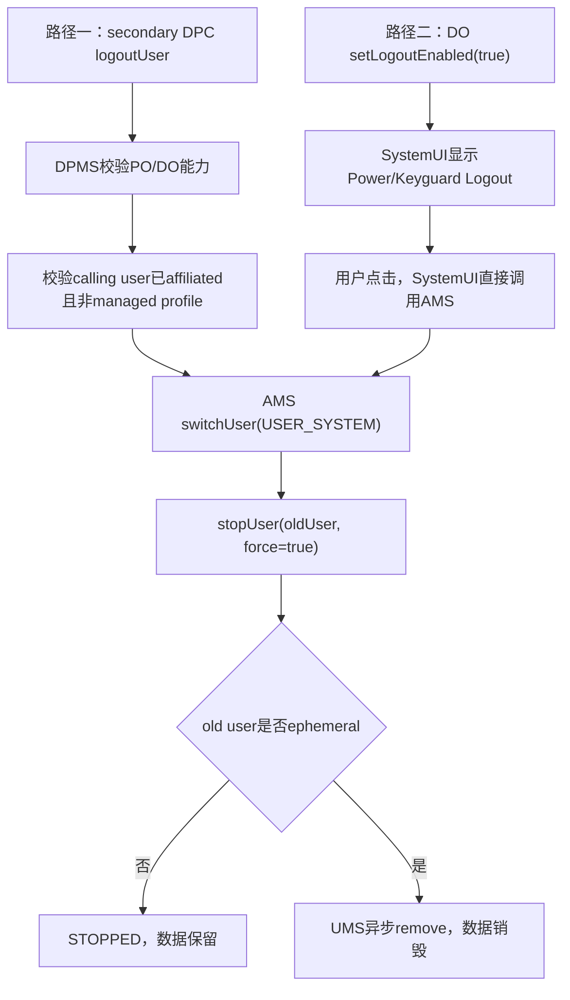
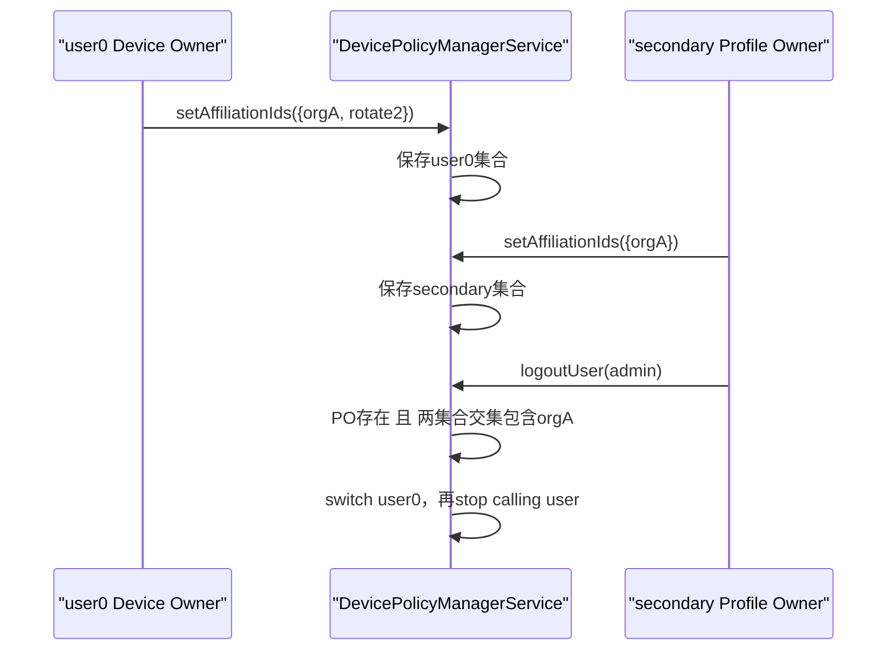
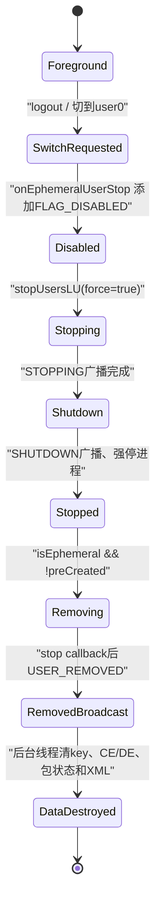

# 第 340 章 Android 企业 Logout User：用户 Affiliation、临时会话、SystemUI 退出与自动删除边界链

> 源码基线：Android 11 / API 30 / `android-11.0.0_r48`。本章延续第327章的`setLogoutEnabled()`界面开关和第339章的switch/stop/remove状态机，重点解释两条名字相近但授权完全不同的退出路径，以及ephemeral用户为何会在退出后自动删除。仅做macOS只读学习，不编译。

## 1. “退出用户”不是退出应用账号

这里的logout是Android多用户会话退出：切换到user 0，再停止原full secondary user。它不会只清某个App登录态，而是结束该用户下所有应用进程与系统服务会话。

## 2. 两条退出路径

第一条是secondary用户内的DPC调用`DevicePolicyManager.logoutUser(admin)`；第二条是Device Owner开启全局Logout UI后，用户点击SystemUI按钮。二者最终都调用AMS switch+stop，但前置权限不同。

## 3. 与第339章stopUser的关系

当前用户不能直接stop，所以logout必须先把current/target改成user 0，再停止旧用户。logout不是新的底层生命周期原语，而是对`switchUser(USER_SYSTEM)`和`stopUser(old,true)`的编排。

## 4. 与removeUser的关系

普通secondary用户logout后只停止，数据仍保留；ephemeral用户停止完成时会继续remove。是否永久删除由UserInfo属性和UserController收尾决定，而不是logout方法名决定。

## 5. 三个常见误解

误解一：打开Logout按钮等于允许PO调用logoutUser；误解二：logout success等于旧用户已停止；误解三：所有logout都会擦数据。三者都与r48源码不符。

## 6. 参与组件

DPC侧经过DevicePolicyManager和DPMS；界面侧涉及GlobalActionsDialog、KeyguardUpdateMonitor与KeyguardStatusView；共同下游是ActivityManagerService/UserController，ephemeral最终还进入UserManagerService删除链。

## 7. 进程边界

DPC位于被管理用户应用进程，SystemUI位于系统UI进程，DPMS/AMS/UMS位于system_server。SystemUI虽然是特权进程，调用IActivityManager仍跨Binder；生命周期继续在system_server Handler与FgThread异步执行。

## 8. 先定义affiliation

Affiliation表示某个secondary用户的Profile Owner与设备Device Owner声明共享的组织标识。它不是profile group关系，也不是同包判断，而是两侧持久化ID集合是否有交集。

## 9. 为什么需要affiliation

secondary PO只管理自己的完整用户，却请求影响整机前台用户切换。系统要求它与DO属于同一管理域，避免任意独立PO把设备切走并结束当前会话。

## 10. UI开关为何无需affiliation

SystemUI按钮由DO全局策略显式开启，真正调用者是受信任SystemUI，不是secondary PO。因此其服务路径不再调用DPMS的affiliation检查；DO通过全局开关授权了这类用户操作入口。

## 11. 两条退出总图



## 12. logoutUser公共API

`DevicePolicyManager.logoutUser(admin)`不接UserHandle，因为目标固定为Binder calling user。DPC无法借它让自己所在用户之外的任意用户退出。

## 13. 客户端先拒绝parent实例

API调用`throwIfParentInstance("logoutUser")`。managed profile的parent DPM实例不能把parent full user当成calling user退出，避免身份语义被parent facade改写。

## 14. 服务端admin非null

DPMS执行`Objects.requireNonNull(who)`，然后读取`userHandleGetCallingUserId()`。后续affiliation、managed-profile判断和stop目标都绑定这个calling userId。

## 15. USES_POLICY_PROFILE_OWNER的特殊含义

`getActiveAdminForCallerLocked(...USES_POLICY_PROFILE_OWNER)`并不是只接受PO。DPMS通用判断明确写着“DO always has the PO power”，因此DO、组织所有PO和普通PO都可能通过第一层。

## 16. 文档意图仍是secondary PO

公开Javadoc描述“affiliated secondary user中的Profile Owner”。服务端复用PO能力门导致DO技术上也可过第一层，但并不意味着从user 0调用就有合理结果；还要继续看目标与stop不变量。

## 17. affiliation是第二层硬门

在DPMS锁内，若`isUserAffiliatedWithDeviceLocked(callingUserId)`为false，直接抛SecurityException。它不是返回UNKNOWN，也不是让switch失败后再提示。

## 18. 检查发生在每次调用时

logoutUser不缓存授权。管理员更新任一侧affiliation IDs后，下一次调用立即按新集合判定；之前曾经affiliated并不形成永久能力。

## 19. managed profile是第三层拒绝

通过admin与affiliation后，若calling user是managed profile，返回`USER_OPERATION_ERROR_MANAGED_PROFILE`。工作资料不能单独成为前台，也不能用这条API退出其parent。

## 20. full secondary是正常目标

正常场景是第338章创建的FULL_SECONDARY/FULL_DEMO user已安装同包DPC并成为Profile Owner，再与DO建立affiliation。此时calling user既有独立会话，又满足跨整机退出信任。

## 21. 第一步固定切到USER_SYSTEM

DPMS清Binder identity后调用`IActivityManager.switchUser(UserHandle.USER_SYSTEM)`。它不是切到“上一个用户”，也不读取最近非guest用户。

## 22. headless system user边界

在headless system user产品上，user 0不一定代表可交互人类用户。r48代码仍写死USER_SYSTEM；产品若采用这种形态，应单独验证UI与前台支持，不能从“primary”文案推断正确目标。

## 23. switch false立即UNKNOWN

若AMS拒绝切换，logoutUser记录warning并返回`USER_OPERATION_ERROR_UNKNOWN`，不会继续stop calling user。这样至少避免在仍是current user时强停它。

## 24. switch true仍只是接收

与第339章相同，AMS switch true只表示目标合法且消息已排队；此刻user 0的Home、广播和解锁未必完成。但UserController已经设置`mTargetUserId=0`。

## 25. mTargetUserId让紧接stop成为可能

底层`isCurrentUserLU()`比较的是current-or-target。switch请求接受后，旧calling user不再被视为current/target，因此紧接着`stopUser(old,true)`不会因“当前用户不可停”而必然失败。

## 26. 第二步调用stopUserUnchecked

DPMS恢复第一次clean identity后，再进入`stopUserUnchecked(callingUserId)`；后者再次清身份并调用AMS stop，参数固定`force=true`、callback=null。

## 27. 两次操作没有事务

switch可能已进入不可轻易撤销的UI流程，而stop随后返回UNKNOWN；系统不会自动切回旧用户。相反，switch若失败则完全不尝试stop。调用方要处理“已切走但旧用户未停”的中间态。

## 28. logout success的精确定义

只有switch返回true且stop映射为USER_OP_SUCCESS时，API返回`USER_OPERATION_SUCCESS`。它表示两项请求均被接受，不等待user 0切换完成，也不等待旧用户ACTION_USER_STOPPED。

## 29. CURRENT_USER仍可能出现

虽然正常switch会设置target user 0，竞态或产品实现异常仍可能让stop看到旧用户为current/target，从而映射`ERROR_CURRENT_USER`。调用方不能删除这个公开返回码分支。

## 30. RemoteException统一退化UNKNOWN

switch和stop都在system_server同进程服务间调用，注释称RemoteException不应发生；代码仍将其映射UNKNOWN。UNKNOWN只说明缺少更细证据，不等于可以立即无脑重试。

## 31. user 0调用的实现落差

DO在user 0能通过PO能力和“DO user永远affiliated”判断，也不是managed profile；switch user0可true，随后stop user0会触发UserController的IllegalArgumentException。DPMS并未捕获该RuntimeException。

## 32. 为什么要记录这个落差

它说明服务端授权范围比Javadoc场景宽，但下游不变量更窄。正确DPC应遵守“secondary PO调用”的契约，而不是把通过第一层SecurityException测试当成API适用证明。

## 33. Affiliation IDs由谁设置

`setAffiliationIds(admin, ids)`可由Device Owner或各secondary user的Profile Owner在自己的用户内调用。双方必须至少有一个相同非空字符串，secondary user才被判为affiliated。

## 34. IDs是集合而非单值

客户端Set转List跨Binder，服务端再构造`ArraySet`，自动去重。任一交集即可通过，不要求两个集合完全相等。

## 35. null和空字符串规则

null集合被拒绝；集合内null或空字符串会被`TextUtils.isEmpty()`拒绝。空集合本身合法，它会撤销该用户通过ID建立的affiliation。

## 36. IDs没有内建业务语义

源码只把字符串写入XML并做equals/contains，没有组织目录、证书或服务器在线验证。它是DPC双方协商的opaque token，安全性取决于管理方案如何分发和轮换。

## 37. IDs不是Android账号

它不关联AccountManager账号、登录邮箱、签名证书或package name。相同DPC包有助于安全传递，但“同包”本身不让集合自动相交。

## 38. createAndManageUser不会自动affiliated

第338章方法设置Profile Owner并保存adminExtras，却没有自动复制DO affiliation IDs。新user必须由其Owner尽快调用setAffiliationIds，否则logoutUser、security logging等affiliation能力暂不可用。

## 39. adminExtras可承载引导信息

同包DPC可在创建时通过PersistableBundle把组织侧配置交给新user首次`ACTION_DEVICE_ADMIN_ENABLED`。但源码不会替应用验证某字段就是affiliation ID，DPC仍需自行校验、落账并调用setter。

## 40. 分发ID应按敏感配置处理

虽然框架称opaque ID而非密码，它直接影响跨用户特权判定。企业实现应避免可猜的公共常量、限制日志暴露，并支持轮换后的双侧一致更新与失败恢复。

## 41. Affiliation的持久化位置

每个用户的`DevicePolicyData.mAffiliationIds`写入该用户device policy XML，每个值使用`affiliation-id`标签。它不是Owners全局文件中的一张单独关系表。

## 42. DO在非system user的兼容逻辑

若split-user产品把DO放在非system user，setAffiliationIds还会把同一集合写入user 0的DevicePolicyData。因为算法统一把user 0集合当作device侧基准。

## 43. 普通形态下DO直接写user 0

DO通常本就在user 0，第一次写当前用户数据已经建立device集合，不触发额外复制分支。secondary PO只写自己的user数据。

## 44. Affiliation判定的第一条

设备没有Device Owner时，所有用户返回false。即使某个PO保存了与历史DO相同的字符串，失去当前DO后也不再构成设备affiliation。

## 45. DO所在用户天然affiliated

若userId等于Device Owner userId，直接true，不要求集合非空。这是管理信任根的定义，不是通过集合交集算出的结果。

## 46. user 0也天然affiliated

只要设备存在DO，user 0直接true，即使DO安装在split-user产品的另一个primary user。这样系统用户承担设备级服务时不会被交集规则误排除。

## 47. 其他用户必须先有Profile Owner

算法对非DO、非user0用户先调用`getProfileOwner(userId)`；没有PO立即false。普通次要用户即使碰巧保存了相同字符串，也不能仅凭数据成为affiliated。

## 48. 最后一层是集合交集

遍历user侧IDs，只要device侧集合`contains(id)`便true，遍历结束无命中则false。复杂度和集合规模相关，但源码没有显式数量或字符串长度上限。

## 49. isAffiliatedUser无需传admin

公开getter按Binder calling user返回布尔值，服务端没有要求ComponentName。它只暴露当前用户是否属于设备管理域，不让调用者选择其他userId查询。

## 50. getAffiliationIds只返回自己的集合

该getter仍需要Owner admin能力，并从calling user DevicePolicyData复制为新List。secondary PO看不到DO集合，因此业务通常通过自己的安全控制面决定应设置什么，而非向框架读取对端token。

## 51. 集合建立与logout授权图



## 52. 更新集合会影响全设备能力

DPMS注释明确：任何用户的affiliation状态都可能变化。setter保存后会重新评估device-wide security logging的暂停/恢复，并可能清除不再合法的LockTask policy。

## 53. maybePause与maybeResume连续调用

代码依次执行pause再resume检查，用当前全体用户状态把logging收敛到正确状态。不能把看到两个调用误读为“每次更新都先丢日志再重启”；内部仍各有条件判断。

## 54. unaffiliated会清某些LockTask策略

`maybeClearLockTaskPolicyLocked()`用于防止失去affiliation的用户继续保留需要该信任关系的设备级锁定策略。affiliation不是只给logout使用的孤立boolean。

## 55. 更新不是跨用户事务

DO和PO各自在不同调用中保存各自XML。轮换ID若先改一侧，交集会暂时消失，logoutUser立刻SecurityException，日志和LockTask也可能变化；需要设计重叠窗口，如先加入新ID再移除旧ID。

## 56. 推荐的双阶段轮换

阶段一双方从`{old}`变为`{old,new}`，确认affiliated；阶段二双方再变为`{new}`。但两侧调用仍可能失败，DPC应以`isAffiliatedUser()`和持久恢复任务验证，而非只看setter无异常。

## 57. save失败的内存/磁盘分叉

setter先替换内存集合，再`saveSettingsLocked()`；写盘异常被内部记录，不向调用方显式返回失败。当前boot判定可能已用新集合，重启却恢复旧集合。

## 58. 同值也会写盘

setAffiliationIds没有相等early return，会替换集合并保存。与`setLogoutEnabled()`的幂等early return不同，同值调用可能用于触发一次重新持久化尝试，但仍没有成功ACK。

## 59. Device Policy广播的范围

成功保存会向被保存的user发送registered-only `ACTION_DEVICE_POLICY_MANAGER_STATE_CHANGED`。DO和PO分别写自己的用户时分别通知，不存在携带完整affiliation集合的跨用户公开广播。

## 60. logoutUser不修改affiliation

退出只切换并停止用户，不清集合、不清Profile Owner。普通用户下次start后仍是affiliated；只有Owner变化、策略清理或集合更新才改变该关系。

## 61. setLogoutEnabled是另一张账

Device Owner ActiveAdmin中的`isLogoutEnabled`是全局UI期望位，true写XML、false默认省略。它与各user的mAffiliationIds相互独立。

## 62. setter只允许Device Owner

DPMS用`USES_POLICY_DEVICE_OWNER`取active admin。secondary Profile Owner即使affiliated也不能决定所有用户是否看到系统Logout按钮。

## 63. getter是全局读取

`isLogoutEnabled()`不接admin，DPMS取当前Device Owner ActiveAdmin并返回该字段；无feature、无DO或字段false都返回false。SystemUI可直接读取这张全局策略。

## 64. 同值setter会提前返回

若内存字段已等于enabled，代码不保存也不发变化广播。若前一次写盘失败但内存已变，同值重试在当前boot无法补写，这是第327章已经识别的恢复缺口。

## 65. 成功写盘才广播

`saveSettingsLocked()`在journal commit后调用`sendChangedNotification(userHandle)`；I/O异常rollback且不广播。SystemUI可能仍在下次主动getter时看到内存新值，但不会被这次失败写及时唤醒刷新。

## 66. Global Actions还受资源列表控制

SystemUI遍历`config_globalActionsList`，只有产品资源包含字符串`logout`才构造该action。r48 AOSP默认列表包含它，但OEM overlay可删掉。

## 67. Power Menu显示条件

处理logout key时同时要求DPM getter为true、currentUser非null且current userId不是USER_SYSTEM，再经过通用`addIfShouldShowAction()`规则。

## 68. provisioning门

`LogoutAction.showBeforeProvisioning()`返回false，因此设备尚未provisioned时Power Menu不显示。DO策略true不是唯一的UI可见条件。

## 69. Keyguard也有Logout入口

KeyguardStatusView包含logout View，`shouldShowLogout()`检查KeyguardUpdateMonitor缓存的logoutEnabled，以及current user不是USER_SYSTEM。它与Power Menu是两个消费点。

## 70. Keyguard使用缓存而非每帧Binder查询

KeyguardUpdateMonitor初始化时调用DPM getter，之后监听Device Policy state changed广播，在主线程重新查询并通知callbacks。缓存减少Binder调用，也引入策略变化传播时延。

## 71. 为什么文字要手工取当前资源

KeyguardStatusView注释说明，不重新取resource时按钮会停留在user 0语言；updateLogoutView每次设置当前Context资源中的`global_action_logout`文本，以适配前台用户locale。

## 72. Power Menu点击有短延迟

`LogoutAction.onPress()`先postDelayed，让dialog有时间消失，再读取current user并执行switch/stop。这是UI动画协调，不是等待设备策略或保存用户数据完成。

## 73. Keyguard点击没有该dialog延迟

锁屏按钮直接读取KeyguardUpdateMonitor current user，立即调用IActivityManager switch/stop。两处UI的视觉时序不同，底层生命周期语义相同。

## 74. SystemUI没有调用DPM logoutUser

两处都直接持有`mIActivityManager`，先`switchUser(USER_SYSTEM)`再`stopUser(currentUserId,true,null)`。所以没有admin ComponentName、PO检查或affiliation检查。

## 75. UI允许无PO的secondary退出

只要DO开启全局位且当前user非0，SystemUI按钮可出现；该用户不必有Profile Owner，也不必affiliated。这是“DO授权人机入口”与“PO程序化跨用户能力”的关键差异。

## 76. SystemUI也不检查managed profile

当前整机foreground user本就应是full user，managed profile不能成为current，因此UI无需重复DPM那条managed-profile错误映射。约束由更早的用户模型保证。

## 77. UI忽略switch返回boolean

代码调用switch后不检查结果，随即调用stop。若switch失败且旧用户仍为current/target，stop通常返回IS_CURRENT；SystemUI也不读取该int，用户只会看到退出未完成或UI切换异常。

## 78. 正常情况下立即stop为何可行

switchUser同步设置`mTargetUserId=0`后才返回true；stop对“current”使用current-or-target判断，因此旧user已经可停。这个细节解释了两次Binder调用之间无需等待ACTION_USER_SWITCHED。

## 79. UI同样没有stop callback

传入null callback，SystemUI不会在`userStopped()`时显示明确完成反馈。它依赖系统切换界面和后续广播自然收敛。

## 80. 开关关闭不会中断已点击操作

策略只决定未来按钮可见性。用户点击后已post的Runnable或已经发送的AMS调用没有撤销token；此时DO把开关改false，源码未见取消在途logout的逻辑。

## 81. 普通用户logout后的生命周期

stop请求接受后依次走STOPPING、ACTION_USER_STOPPING、SHUTDOWN、ACTION_SHUTDOWN、移出started集合、强停进程、ACTION_USER_STOPPED与CE key locking。UserInfo和磁盘数据仍保留。

## 82. 下次可以重新登录同一普通用户

DO可再次switchUser或startUserInBackground；若凭据允许，用户重新unlock并恢复应用状态。logout在此模型中类似结束OS会话，而不是恢复出厂。

## 83. ephemeral是创建时属性

第338章`MAKE_USER_EPHEMERAL`最终写入UserInfo FLAG_EPHEMERAL。logout路径本身不临时设置该flag，也不根据DPC运行时偏好临时决定擦除。

## 84. 切出ephemeral时先标disabled

UserController完成用户切换后调用`stopGuestOrEphemeralUserIfBackground(oldUserId)`；若旧user是ephemeral，先通知UserManagerInternal `onEphemeralUserStop()`。

## 85. onEphemeralUserStop的作用

UMS在用户锁内再次确认UserInfo存在且isEphemeral，然后添加`FLAG_DISABLED`。注释说明这是为了不允许用户在即将删除时再次切回。

```java
if (userInfo != null && userInfo.isEphemeral()) {
    userInfo.flags |= UserInfo.FLAG_DISABLED;
    if (userInfo.isGuest()) {
        userInfo.guestToRemove = true;
    }
}
```

## 86. guestToRemove只针对同时为guest

ephemeral full secondary不一定是guest；它仍被disabled，但只有`isGuest()`还会设置guestToRemove。自动永久删除的关键并不依赖guestToRemove，而在stop完成的ephemeral检查。

## 87. 标disabled后立即发起stop

若旧用户是guest或ephemeral，UserController调用`stopUsersLU(oldUserId, force=true, allowDelayedLocking=false)`。因此只靠switch离开也会自动结束临时会话。

## 88. 显式logout与自动stop会汇合

DPM/SystemUI在switch后已显式stop旧用户；稍后`continueUserSwitch()`再次检查ephemeral时，常会看到它已STOPPING/SHUTDOWN并直接return。两条触发不会创建两个独立完整停止流程。

## 89. finishUserStopped决定永久删除

真正停止后，UserController读取UserInfo；若`isEphemeral()`且非preCreated，调用`removeUserEvenWhenDisallowed(userId)`。所以数据删除发生在stop收尾之后，并继续走第339章UMS异步remove链。

## 90. pre-created是例外

pre-created user为预热系统服务而后台启动，完成后也会stop；代码用`!userInfo.preCreated`防止把库存预创建对象按普通ephemeral会话立刻删除。

## 91. ephemeral退出状态图



## 92. logout success距离删除还很远

ephemeral场景下，success只到switch与stop请求接受；后面至少还有停止广播、进程清理、自动remove提交、有序USER_REMOVED和后台数据销毁。UI或DPC不能立即复用旧userId。

## 93. disabled写入的持久化细节

`onEphemeralUserStop()`片段只在内存UserInfo上加flag，没有在该方法内调用`writeUserLP()`。正常链很快进入remove并持久化partial/disabled；若中途崩溃，恢复行为要以启动清理代码和实际XML为准。

## 94. explicit stop也会删ephemeral

即使没有先发生foreground switch的`onEphemeralUserStop()`，DO直接stop一个后台ephemeral user，`finishUserStopped()`仍会检查flag并remove。disabled只是防切回措施，不是删除的唯一触发器。

## 95. 非ephemeral guest的边界

`stopGuestOrEphemeralUserIfBackground()`会停止guest，但`finishUserStopped()`自动remove条件只看ephemeral。不能把“guest”与“必定立即删除”画等号；还要看产品创建flag和其他guest删除流程。

## 96. remove失败可能留下partial用户

自动remove同样是非事务链。UMS会先标removing/partial/disabled，再stop并异步清理；异常或重启可能留下由启动恢复继续清理的中间状态。

## 97. 退出前业务保存不由框架保证

logout没有“让DPC上传完成后再继续”的回调协议。应用若需要同步本地业务数据，应在策略允许的更早阶段持续保存，而不是用户点击后依赖STOPPING广播完成网络操作。

## 98. STOPPING广播不是无限宽限期

它是有序系统生命周期广播，但慢receiver仍受广播超时治理；且企业网络可能已变化。把关键一致性只押在最后广播上会产生丢数据风险。

## 99. 安全擦除验证应观察最终remove

ephemeral设计目标是会话结束后删除，但DPC审计应等待USER_REMOVED、serial失效/列表收敛，并在重启后reconcile，而不是只记录“logout按钮被点击”。

## 100. 普通用户若要求擦除应另调remove

可以先logout确保切离并停止，再由DO调用removeUser；但仍要等待switch/stop状态，处理restriction和UMS异步完成。不要试图用setLogoutEnabled替代退役工作流。

## 101. Power Menu与Keyguard的威胁模型

全局Logout入口允许拿到当前物理会话的人结束secondary session，即使不知道该用户DPC的admin组件。它通常增强共享设备隐私，但也可能被用于造成业务中断。

## 102. 是否显示应结合设备用途

共享班次设备适合让用户主动退出；无人值守Kiosk可能不希望暴露入口。DO设置全局位前应同时评估LockTask、Keyguard、物理访问和会话恢复策略。

## 103. Logout不等于Lockdown

Lockdown通常禁用生物识别并要求强认证，仍留在同一用户；Logout切换用户并停止整个会话。二者在Global Actions列表相邻，但安全效果完全不同。

## 104. Logout不等于Guest reset对话框

UserSwitcherController另有guest退出/重置体验，可返回last non-guest user并处理guest删除。企业全局LogoutAction则写死user 0、直接switch+stop，不能混用两套行为推理。

## 105. Logout不等于setLogoutEnabled成功

setter只更新持久策略并触发UI刷新；按钮是否存在还受资源、provisioning、current user和缓存传播影响，点击后的AMS执行更是另一阶段。

## 106. 可观测证据分层

策略层看DPM getter；界面层看Power/Keyguard可见性；切换层看current/target与USER_SWITCHED；停止层看USER_STOPPED；ephemeral删除层看USER_REMOVED和serial失效。每层回答不同问题。

## 107. 建议DPC日志字段

记录calling userId、serial、是否ephemeral、当前affiliated状态、logout返回码、请求elapsedRealtime、观察到的switch/stop/remove事件及最终userId→serial映射。避免只记一个“logout success”。

## 108. affiliation失败的排查顺序

先确认设备仍有DO，再确认calling user有Profile Owner，分别读取两侧各自集合配置记录，检查至少一个完全相同且非空的字符串，最后确认调用确实来自目标secondary user进程。

## 109. UI不出现的排查顺序

检查DO `isLogoutEnabled()`、产品`config_globalActionsList`、设备provisioned状态、current user是否为0，以及Keyguard缓存是否收到DPM state changed；不要先怀疑AMS stop链。

## 110. 点击无效的排查顺序

查看SystemUI是否进入onPress、switchUser返回、UserController mTargetUserId、stopUser返回码、旧user的STOPPING/SHUTDOWN日志。UI代码不检查返回值，因此失败常不会直接呈现详细错误。

## 111. 重启后的恢复原则

重新读取logoutEnabled、affiliation IDs和所有用户状态；对普通STOPPED用户恢复可登录记录，对removing/partial用户等待或推动系统清理，对旧serial不再匹配的记录标为终止，切勿凭旧UserHandle继续操作。

## 112. macOS只读练习一：对比两条权限链

分别追`DevicePolicyManagerService.logoutUser()`与SystemUI `LogoutAction.onPress()`，列出admin、affiliation、managed profile、global policy、current-user UI条件，解释为何无PO用户也可能点击Logout。

## 113. macOS只读练习二：手算affiliation

为DO集合`{A,B}`构造五个用户：无PO、PO集合空、`{C}`、`{B,C}`、DO所在用户；逐个按`isUserAffiliatedWithDeviceLocked()`源码给出结果，再模拟两阶段B→D轮换。

## 114. macOS只读练习三：追switch后立即stop

从`switchUser()`设置mTargetUserId开始，定位`getCurrentOrTargetUserIdLU()`和`isCurrentUserLU()`，解释SystemUI为何不等USER_SWITCHED也能stop旧user，以及switch失败时stop为何通常被拒。

## 115. macOS只读练习四：追ephemeral自动删除

串联`stopGuestOrEphemeralUserIfBackground()`、`onEphemeralUserStop()`、`finishUserStopped()`与UMS `removeUserEvenWhenDisallowed()`，标出disabled、STOPPED、removing、USER_REMOVED和数据销毁的先后。

## 116. 本章速查表

DPC logoutUser：secondary Owner主动调用，必须affiliated；SystemUI Logout：DO全局开启，current非0用户点击，无PO/affiliation门；普通用户结果是停止并保留；ephemeral结果是停止后异步删除。

## 117. 复读修正一：USES_PROFILE_OWNER不只接受PO

初读方法名容易写成“服务端第一行只允许PO”。复查`isActiveAdminWithPolicyForUserLocked()`后确认DO和组织所有PO也具备PO power；正文同时保留user0调用最终撞上stop不变量的实现落差。

## 118. 复读修正二：SystemUI没有调用logoutUser

界面文案相同不代表Binder路径相同。两处SystemUI都直接调用IActivityManager，因而不执行affiliation检查；正文已将全局DO策略授权与secondary PO程序化权限分开。

## 119. 复读修正三：ephemeral删除点在stop收尾

onEphemeralUserStop添加disabled并发起stop，但永久remove真正由`finishUserStopped()`中的isEphemeral判断触发；即使显式停止未经过切后台helper也会删除。正文不再把disabled误写成删除提交点。

## 120. 本章结论与下一章

Android 11企业Logout由“信任授权”和“异步生命周期”两层组成：PO自助退出靠affiliation交集，SystemUI人机入口靠DO全局策略；二者都先切user0再强停旧用户，普通会话保留、ephemeral会话在停止后继续异步remove。下一章将追用户affiliation对Security Logging、Network Logging、LockTask和跨用户DeviceAdminService绑定等设备级能力的共同门控与动态失效边界。
