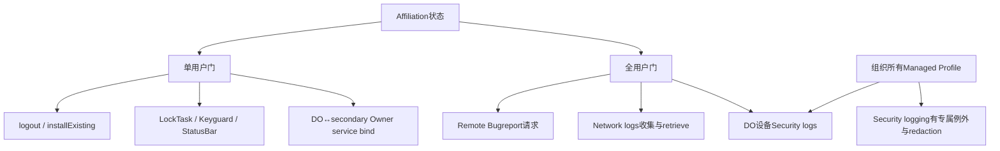
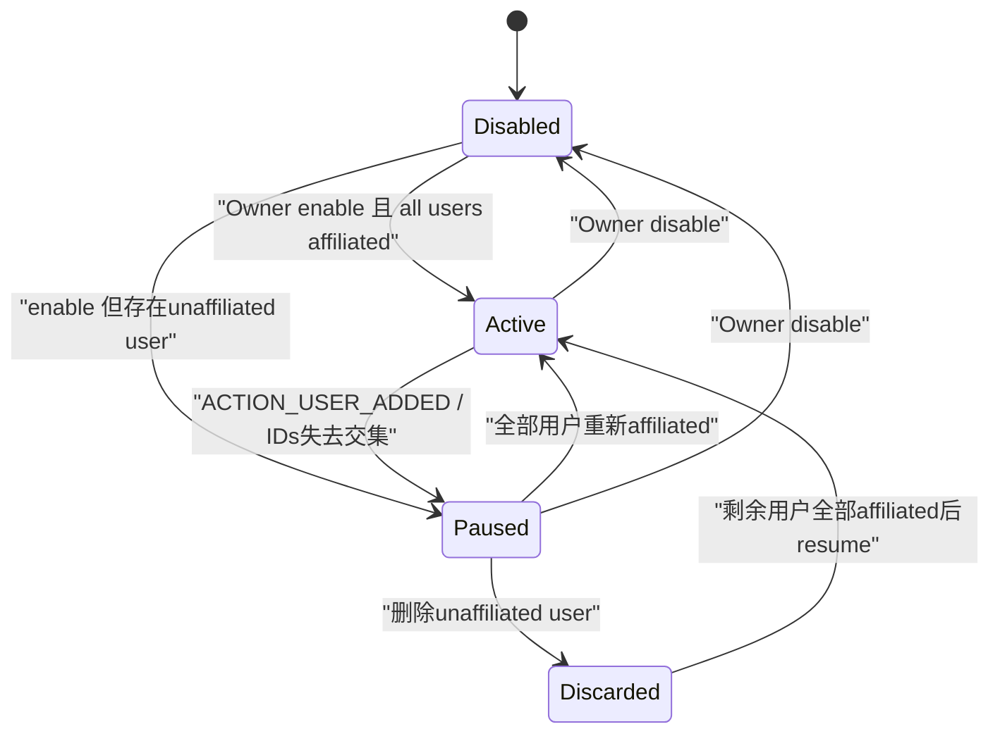
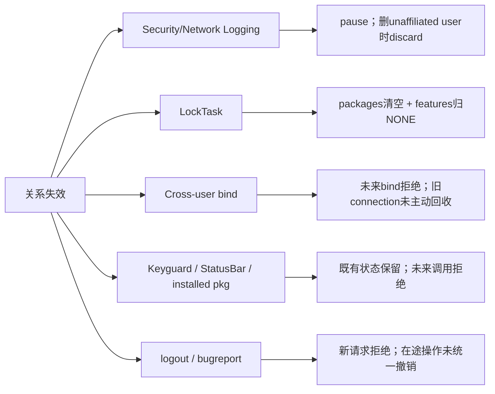

# 第 341 章 Android 企业 Affiliation：设备级能力矩阵、日志、LockTask、跨用户绑定与动态失效边界链

> 源码基线：Android 11 / API 30 / `android-11.0.0_r48`。第340章解释了affiliation如何建立；本章不再停留在“集合有交集”这一句，而是逐个核对消费者：有的要求calling user affiliated，有的要求all users affiliated，有的是调用时门，有的会主动暂停或清策略。全文只做macOS本地源码阅读，不编译。

## 1. 为什么要做能力矩阵

如果只记住“affiliated后权限更大”，很容易误判：Network Logging检查全体用户，logoutUser只检查调用用户，LockTask在关系失效时会清策略，而Keyguard/StatusBar只在setter时检查，并不会统一自动恢复。

## 2. 两种基本谓词

`isUserAffiliatedWithDeviceLocked(userId)`回答某一个用户；`areAllUsersAffiliatedWithDeviceLocked()`遍历当前用户库存，任何一项false便整体false。消费者选择哪一个决定了影响半径。

## 3. individual gate

individual gate只要求能力执行者所在user或目标user与DO有关联。一个无关的第三用户存在，不一定阻断logout、install-existing、LockTask或Owner间service binding。

## 4. all-users gate

all-users gate用于可能收集整机数据的能力。只要设备上存在一个unaffiliated用户，DO就不应看到可能包含该用户行为的Network/Security日志或完整bugreport。

## 5. 三种执行时机

第一类是调用时抛SecurityException；第二类是策略可enable但运行器被pause；第三类是关系变化时主动清理既有配置。不能只看API入口有没有`ensureAllUsersAffiliated()`。

## 6. 先回顾single-user算法

有DO是前提；DO user和user 0天然true；其他user必须有Profile Owner且自身IDs与user0 IDs至少一项相交。这里没有同包要求，同包是某些具体能力追加的门。

## 7. all-users遍历哪些用户

DPMS调用`mUserManager.getUsers(excludeDying=true)`；该单参数实现还排除partial与pre-created。正在removing的用户不参与全体判定，但disabled且非dying用户可能仍参与。

## 8. 快照不是永久事实

遍历发生在一次DPMS锁保护的逻辑中，但新用户随后可以创建、Owner可以转移、IDs可以更新。每个设备级能力仍需在自己的生命周期节点重新收敛。

## 9. 无DO时all-users必然失败

single-user谓词开头发现无DO即false，所以只要用户列表非空，all-users也是false。Affiliation是围绕Device Owner建立的设备关系，不是PO之间的通用联盟。

## 10. 本章消费者清单

重点覆盖Remote Bugreport、Security Logging、Network Logging、LockTask、logoutUser、installExistingPackage、Keyguard/StatusBar禁用、bindDeviceAdminServiceAsUser，以及Profile Owner转移完成通知。

## 11. 门控类型总图

## 12. 用户新增会立刻触发日志审查

DPMS接收`ACTION_USER_ADDED`后先向DO发送admin command，再在锁内调用`maybePauseDeviceWideLoggingLocked()`。新用户尚未建立PO/IDs时通常unaffiliated，日志能力随即收紧。

## 13. 为什么不等用户start

隐私风险从UserInfo存在开始，而非首次解锁才开始；创建后DPC可能还在安装/设Owner。框架选择先pause，再等管理关系完整后resume，属于保守默认。

## 14. setAffiliationIds负责再次收敛

任一Owner更新IDs后，DPMS依次调用maybePause、maybeResume和maybeClearLockTaskPolicy。两侧最终形成交集时，符合条件的日志运行器可恢复。

## 15. 日志enable与active要分开

Security/Network Logging的持久enable状态可以为true，而采集Monitor/Logger因unaffiliated用户处于paused。getter说enabled不能证明此刻正在产生可检索batch。

## 16. 用户删除也要重新审查

收到`ACTION_USER_REMOVED`时，DPMS在清该用户DevicePolicyData前先计算它是否affiliated。若删除的是unaffiliated用户，会丢弃已收集device-wide logs，然后尝试为剩余用户resume。

## 17. 为什么必须在removeUserData之前判断

一旦清掉Profile Owner和IDs，就无法区分“删除前本来已affiliated”还是“因数据被清而变false”。源码注释明确要求先保存这个布尔值。

## 18. 删除unaffiliated用户为何丢日志

pause前后和异步删除窗口可能仍有包含该用户的信息。为了防止用户消失后DO突然满足all-users并读取历史隐私，系统清空SecurityLogMonitor和NetworkLogger现有日志。

## 19. pre-reboot logs存在TODO缺口

`discardDeviceWideLogsLocked()`明确TODO：还应丢弃pre-boot security logs，否则下次boot仍可能读到被删unaffiliated用户相关事件。正文必须把这是已知未闭合边界写出来。

## 20. 删除affiliated用户不必丢日志

该用户原本属于同一管理域，DO按政策已可看到其device-wide日志，因此删除时不走discard分支。若还有其他unaffiliated用户，其他路径仍会保持日志paused。

## 21. Remote Bugreport使用最硬前置门

`requestBugreport(who)`调用`ensureDeviceOwnerAndAllUsersAffiliated()`：既要求who是实际DO，又要求当前全体用户affiliated。它不是enable后pause，而是在请求入口直接SecurityException。

## 22. 用户同意不能替代affiliation

Remote Bugreport后续虽还要用户接受分享，但DPMS不会因为有consent就放宽all-users门。Owner授权与用户即时同意解决不同信任问题。

## 23. Remote Bugreport的删除残留TODO

源码注释承认：unaffiliated用户删除后，bugreport仍可能包含其残留数据；现在只要剩余用户全affiliated，DO又可请求。代码仅提出是否应延迟到下次boot的TODO，没有实现冷却门。

## 24. Bugreport检查是请求时快照

请求通过后开始远程bugreport状态机。若随后新增unaffiliated用户，ACTION_USER_ADDED会pause日志，但本方法中未见自动取消已启动remote bugreport；必须区分入口资格与在途撤销。

## 25. Security Logging的enable权限

`setSecurityLoggingEnabled()`要求`USES_POLICY_ORGANIZATION_OWNED_PROFILE_OWNER`，即DO或组织所有managed-profile PO。它不在setter入口强制all-users affiliated。

## 26. enable后才按设备形态pause

设置property并start monitor后，enabled=true分支调用`maybePauseDeviceWideLoggingLocked()`。普通DO设备若存在unaffiliated user则pause；组织所有managed-profile设备有security-specific例外。

## 27. 组织所有例外只给Security Log

pause方法在all-users false时总暂停NetworkLogger，但只有“不是organization-owned managed profile device”才暂停SecurityLogMonitor。这是两类日志最重要的差异。

## 28. 例外为何仍能保护其他用户

组织所有模式的SecurityLogMonitor按`getSecurityLoggingEnabledUser()`选择组织profile user而非USER_ALL，retrieve前也会对events做redaction。它不是让PO无条件看到整个设备所有用户事件。

## 29. DO设备的enabled user

存在Device Owner时`getSecurityLoggingEnabledUser()`返回USER_ALL，所以日志可能覆盖整机。也因此普通DO场景必须要求all-users affiliated才能恢复和retrieve。

## 30. 组织所有设备的enabled user

无DO、只有组织所有PO时返回该profile userId；读取pre-reboot事件后若不是USER_ALL，调用`SecurityLog.redactEvents(output, enabledUser)`收窄结果。

## 31. retrieveSecurityLogs的门

先要求DO或组织所有PO；若不是organization-owned managed profile device，再调用ensureAllUsersAffiliated。普通DO上有任一unaffiliated user时直接SecurityException。

## 32. retrievePreRebootSecurityLogs相同分流

资格和all-users例外与当前Security logs一致；之后还检查产品是否支持pre-reboot日志和logging property。通过授权也可能因能力关闭返回null。

## 33. retrieve门比enabled getter更强

`isSecurityLoggingEnabled()`只验证Owner角色并返回property，不要求all-users。于是“getter=true、retrieve抛SecurityException”是合法组合，表示策略开启但隐私门尚未满足。

## 34. setAffiliationIds可resume Security Monitor

`maybeResumeDeviceWideLoggingLocked()`在all-users true或组织所有设备时调用SecurityLogMonitor.resume；这让因新用户临时暂停的普通DO日志在双方IDs到位后继续。

## 35. resume不保证旧batch保留

如果期间删除过unaffiliated用户，discard已清缓存；resume只恢复未来收集，不能用旧token找回被主动丢弃的内容。

## 36. Security retrieval仍受节流

Affiliation只是隐私门，`SecurityLogMonitor.retrieveLogs()`还可能因2小时检索间隔、通知状态或无新batch返回null。通过affiliation不等于必有数据。

## 37. Network Logging的enable权限

`setNetworkLoggingEnabled(admin, packageName, enabled)`允许DO或NETWORK_LOGGING delegate。setter不先ensureAllUsers；它保存DO字段，创建NetworkLogger并启动后再按all-users状态pause。

## 38. delegate不会绕过affiliation

委托只替代“谁可管理网络日志”的Owner角色门。真正retrieve时仍调用ensureAllUsersAffiliated，delegate与DO面对相同的全设备隐私条件。

## 39. Network没有组织所有例外

无论设备是否organization-owned managed profile，只要all-users false，NetworkLogger就pause；resume也只有all-users true分支。因为这套r48网络日志能力依附DO全局字段。

## 40. enable notification不等于正在采集

启动NetworkLogger后会发送网络日志通知，同时可能立即pause。通知说明企业网络日志策略已启用，不证明当前所有用户affiliated或batch正在增长。

## 41. retrieveNetworkLogs入口

服务端先校验DO或delegate scope，再在锁外调用`ensureAllUsersAffiliated()`；任何当前库存用户unaffiliated都抛SecurityException，而不是返回null。

## 42. null代表另一类状态

通过all-users后，若`mNetworkLogger==null`或策略未enabled，返回null；合法batch token已过期或不可用也可能由logger返回null。SecurityException与null分别表达资格失败和数据/运行态缺失。

## 43. batchToken不能跨pause想当然复用

公开Javadoc提示：新增unaffiliated用户后，最近通知提供的batchToken也不再可retrieve。日志可能pause或discard，恢复后应等待新的onNetworkLogsAvailable。

## 44. retrieval时间账本在成功资格后更新

DPMS在实际调用logger前，以wall clock更新user0 DevicePolicyData的last network retrieval time。即使logger最终对token返回null，时间字段仍可能已推进。

## 45. forceNetworkLogs不是DPC旁路

`forceNetworkLogs()`只允许shell，检查enabled并让logger finalize batch。它不构成生产DPC绕过all-users retrieve门的渠道。

## 46. 日志状态转换图

## 47. LockTask使用individual gate

`setLockTaskPackages()`和`setLockTaskFeatures()`先走`enforceCanCallLockTaskLocked()`，它验证PO power，再用calling userId调用`canUserUseLockTaskLocked()`。

## 48. 有DO时必须affiliated

若calling user affiliated立即true；若不affiliated且设备存在DO，立即false。也就是说secondary PO不能在与DO无关的用户里配置企业LockTask。

## 49. 无DO时存在legacy PO路径

设备无DO时，full-user Profile Owner只要不是managed profile，也可使用LockTask，不需要affiliation——因为没有device侧集合可供交集。managed profile仍被拒绝。

## 50. LockTask比同包绑定宽

LockTask individual gate不要求PO包与DO包相同；只要Owner身份与IDs交集成立即可。不要把bindDeviceAdminServiceAsUser的“same package”条件外推到所有affiliation能力。

## 51. LockTask setter写什么

packages保存到calling user DevicePolicyData并推给ActivityTaskManager；features也持久化并推运行态。Affiliation只决定这次Owner是否可设置，并不是列表本身的一部分。

## 52. 失去affiliation会主动清LockTask

setAffiliationIds完成后调用`maybeClearLockTaskPolicyLocked()`，遍历非dying用户；对`canUserUseLockTaskLocked=false`者，将packages清空、features设NONE并分别持久化/推送。

## 53. 这是少见的动态撤权

很多API只阻止未来调用；LockTask额外删除既有policy。DPC不能期待稍后恢复交集便自动恢复旧allowlist/features，因为原值已被清空。

## 54. 清理可能产生多次保存

同一user既有packages又有features时，helper分别调用两个setter-locked，各自saveSettings并推下游。它不是单次原子更新，崩溃窗口可能只清了一半。

## 55. 当前LockTask会如何收敛

DPMS把空packages/features推给ActivityTaskManager，真实当前任务退出/限制UI的细节由LockTaskController继续裁决。本章只从DPMS证明政策被清，不能把它简化成“setter返回时画面已退出Kiosk”。

## 56. isLockTaskPermitted的特殊边界

该getter只检查当前DevicePolicyData packages是否包含pkg，没有再次验证admin或affiliation。正常失效setter会清列表，但在写盘/清理竞态中不能把它当独立权限证明。

## 57. installExistingPackage也是individual gate

Owner或INSTALL_EXISTING_PACKAGE delegate先通过scope门，然后calling user必须affiliated。无关第三用户不会阻止在这个secondary user内安装已存在system-wide的包。

## 58. delegate同样要用户affiliated

`who==null`只表示调用者是delegate；服务端仍取Binder calling userId并检查single-user谓词。DO不能通过给unaffiliated用户授权delegate来绕过关系门。

## 59. install-existing不会复制APK

通过后调用PMS `installExistingPackageAsUser`，让已在设备代码库存中的package对calling user可用。它不是下载新APK，也不赋予跨用户数据访问。

## 60. affiliation失效不自动卸包

源码只在调用入口检查，setAffiliationIds的收敛代码没有卸载先前install-existing的应用。关系失效后未来调用被拒，但已安装per-user状态继续存在，需另行治理。

## 61. logoutUser的single-user门

第340章已经追过：calling user须affiliated，随后固定switch USER_SYSTEM并stop自己。其他unaffiliated用户存在不会阻止这个已affiliated user自助退出。

## 62. affiliation失效只阻止未来logout API

已开始的switch/stop没有撤销；普通用户仍可由DO `switchUser/stopUser`管理，也可能通过DO开启的SystemUI Logout退出。失去PO程序化能力不等于被困在会话中。

## 63. setKeyguardDisabled的single-user门

调用者需PO power且所在user affiliated；managed profile抛SecurityException。请求disabled=true时如果当前设置了secure credential，返回false而不禁用锁屏。

## 64. affiliation只是第一道条件

通过affiliation仍可能因密码安全状态失败；反过来，无secure credential也不能让unaffiliated PO调用。权限门和业务precondition要分开记录。

## 65. Keyguard失效时没有自动恢复

setAffiliationIds只联动日志与LockTask，未见调用`setLockScreenDisabled(false)`。若锁屏已被合法禁用，后来IDs失去交集，r48不会在该setter中自动重新启用。

## 66. 更棘手的恢复权限

失去affiliation后，该PO连调用`setKeyguardDisabled(false)`也会先SecurityException；需要DO恢复交集、Owner清理或系统其他路径纠正。说明写时gate不等于持续安全不变量。

## 67. setStatusBarDisabled同样是single-user门

PO power、calling user affiliated、非managed profile三门通过后，才更新StatusBarService运行状态和DevicePolicyData布尔值。

## 68. LockTask mode下的StatusBar延迟

若当前处于LockTask，setter不直接调用`setStatusBarDisabledInternal`，但仍保存policy布尔值；LockTask和状态栏自己的后续逻辑决定显示。返回true不证明当前像素状态已变化。

## 69. StatusBar失效也不会自动恢复

affiliation更新只清LockTask packages/features，没有清`mStatusBarDisabled`或主动enable状态栏。与LockTask相比，它是明显的call-time authorization模型。

## 70. individual gate矩阵小结

logout控制一次会话；install-existing留下包状态；Keyguard/StatusBar留下系统设置；LockTask会在失效时清既有政策。四类都查single user，却有四种不同的后效。

## 71. 跨用户Owner service bind再加same-package门

`getBindDeviceAdminTargetUsers()`首先要求caller有PO power。DO枚举可绑定的secondary Owners；secondary PO最多把DO user加入目标列表。

## 72. canUserBindToDeviceOwner三条件

设备必须有DO且目标user不是DO user；目标user必须有Profile Owner且PO package与DO package相同；最后目标user必须affiliated。少一项都不进入target list。

## 73. 为什么需要same package

Affiliation ID只说明同一管理域，service binding还把一个Owner应用进程的Binder服务暴露给另一用户中的Owner。r48进一步限定相同package，缩小跨用户代码信任边界。

## 74. Android 11文档语义

Javadoc说明旧版本可用于DO与Profile Owner通信；Android 11后主要面向Device Owner与managed secondary user。这里的“managed secondary”是有PO的full user，不是managed profile。

## 75. target list是动态快照

DO遍历`getUsers(excludeDying=true)`并逐项计算；PO只检测自己是否可bind DO。Owner转移、包名变化、ID集合变化或user removing都会改变下次结果。

## 76. bind入口再次检查list

`bindDeviceAdminServiceAsUser()`要求target与calling user不同，再调用getBindDeviceAdminTargetUsers并检查contains。调用方先查询列表后关系变化，也会在真实bind时被重新拒绝。

## 77. Intent必须显式到包或组件

服务端要求Intent至少有component或package，然后在目标user resolve。无任何限定的隐式Intent直接IllegalArgumentException，避免system_server替caller跨用户寻找任意服务。

## 78. resolved package必须是目标Owner包

`createCrossUserServiceIntent()`比较ResolveInfo service package与target Owner package，不同即SecurityException。caller不能借合法Owner关系绑定目标user的第三方服务。

## 79. exported服务必须受BIND_DEVICE_ADMIN保护

若目标service exported却未声明`android.permission.BIND_DEVICE_ADMIN`，服务端拒绝。非exported服务允许的细节来自system_server代bind与后续AMS身份处理，仍应按官方要求配置保护权限。

## 80. resolve后Intent被钉死component

helper把解析出的ServiceInfo ComponentName写回原始Intent再返回；后续虽然代码变量名仍使用`serviceIntent`，它已经被原地修改，不是丢弃sanitizedIntent的漏洞。

## 81. bind以caller应用身份建立

注释强调：ActivityManager bind使用传入的caller ApplicationThread，而非让DPMS成为长期client。清Binder identity用于系统检查，但ServiceConnection归属仍是调用DPC进程。

## 82. true只表示bind请求成功

AMS返回非0映射true；真正`onServiceConnected()`稍后在DPC主线程到达。target user没运行、service无法解析或AMS拒绝时可能false。

## 83. affiliation失效不会主动unbind

setAffiliationIds的动态收敛只处理日志与LockTask，源码未见遍历既有cross-user ServiceConnection并unbind。关系失效会让未来target list为空，但已经连接的Binder需依赖进程死亡、显式unbind或服务生命周期结束。

## 84. 这是一种撤权延迟

策略面资格即时消失，数据面已获得的Binder对象却可能继续存活。DPC双方应在服务协议中重复鉴权/检测affiliation变化，并主动断开，而不是只依赖首次bind门。

## 85. transferOwnership完成通知的individual用法

Profile Owner转移成功后，DPMS总向新PO发`ACTION_TRANSFER_OWNERSHIP_COMPLETE`；只有calling user此时affiliated，才额外向DO发`ACTION_AFFILIATED_PROFILE_TRANSFER_OWNERSHIP_COMPLETE`并携带user handle。

## 86. affiliation不阻止PO本身转移

检查位于transfer完成和普通Owner changed广播之后，只控制DO是否收到“affiliated profile transfer”专用通知。不能写成unaffiliated就无法transfer ownership。

## 87. 新旧Owner同包并非此处重点

transfer有自己的admin组件、package/签名与bundle约束；affiliation这里只决定跨用户通知。应分别审计Owner转移安全链，不把一个末尾if当全部授权。

## 88. LocalService还暴露single-user查询

DPMS内部`DevicePolicyManagerInternal.isUserAffiliatedWithDevice(userId)`直接复用locked算法，供system_server组件按需查询。当前全树未发现本服务外Java消费者，不应凭接口存在虚构执行点。

## 89. 没有统一“affiliation changed”公共事件

setter成功保存会发通用DPM state changed到相关user，日志/LockTask由DPMS内部同步收敛；DPC若需业务层状态，应主动getter和自建协议，不能等待一个携带旧新集合的专用广播。

## 90. 动态失效的核心分类

日志是pause/resume并可能discard；LockTask是清policy；bind是拒新连接但旧连接可能留；Keyguard/StatusBar/installed package是拒未来setter却保留既有状态；Remote Bugreport主要是请求时门。

## 91. 能力矩阵图

## 92. SecurityException不是唯一失效表现

Network retrieve、Remote Bugreport和许多setter会抛；日志采集器可能静默pause；bind target getter只返回空列表；LockTask既有值会被删除。调用方必须针对API语义处理。

## 93. enabled getter可能继续true

Network/Security logging策略位不会因pause自动改false。控制台若只轮询enabled，会把“政策希望开启”误报成“数据正在连续采集”。

## 94. 已有状态可能比权限活得久

已安装package、disabled keyguard/statusbar和已有Binder connection都体现这一点。Android安全常在请求边界鉴权，而不是为所有状态建立持续租约。

## 95. 清LockTask也不是原子完成

packages/features分别保存和推送，下游UI/Task状态继续异步收敛。即便它是主动动态撤权，也不能以setAffiliationIds返回时刻当屏幕最终状态。

## 96. 新用户带来的安全默认

创建用户后日志先pause，bind/individual能力先因无PO或无交集失败，LockTask不可设。完成Profile Owner与双方IDs配置后才逐项开放，符合default-deny。

## 97. createAndManageUser的早期广播窗口

第338章说明基础user广播早于PO建立；DPMS还会收到USER_ADDED并pause日志。ManagedProvisioning/DPC后续再建Owner和IDs，因此短暂停顿是正常时序，不应报警为永久故障。

## 98. IDs双阶段轮换的设备级影响

若先把DO从old直接改new，而secondary仍只有old，所有这些individual/all-users门会暂时失效；日志pause、LockTask可能被不可逆清空。先双方加入new再双方移除old能减少破坏。

## 99. LockTask让轮换更敏感

哪怕交集只短暂消失一次，maybeClearLockTaskPolicy就可能把列表/feature持久清掉；之后恢复affiliation不会自动补回。因此轮换前应备份期望policy并在确认恢复后重新下发。

## 100. 日志token也要按代际管理

pause/discard后旧batch token可能失效。DPC应把onNetworkLogsAvailable token与affiliation generation关联，关系变化后丢弃未确认旧token，等待新通知。

## 101. 跨用户Binder也要按代际管理

服务协议可交换当前组织配置generation；任一侧IDs轮换或Owner transfer时主动unbind/rebind。仅看到Binder仍alive不能证明框架当前仍允许新建这条信任链。

## 102. Owner transfer的重新校验

bind还要求DO与PO package相同；PO transfer到不同package后，即使IDs仍相交，target list会立即失去该user。已有connection仍需应用显式处理。

## 103. 用户removing与all-users集合

excludeDying使removing用户从all-users判定中提前消失，但DPMS在USER_REMOVED收尾还用删除前affiliation决定是否discard。两处合起来避免单靠列表提前缩小就直接泄露缓存日志。

## 104. disabled用户仍可能阻断日志

只要它非partial、非pre-created、非dying，getUsers(true)仍可能返回；single-user算法若false，all-users便false。把用户disable而不remove不能当作恢复device-wide logging的方法。

## 105. 组织所有例外不要外推

Security Logging有organization-owned managed profile特殊路径；Network Logging、Remote Bugreport、LockTask和bind各有独立实现。看到一个例外不能推导所有设备级能力都向COPE开放。

## 106. 权限角色也不要外推

Security Logging接受组织所有PO；Network Logging依附DO/delegate；Remote Bugreport是DO；individual能力多用PO power。Affiliation永远只是额外条件，不取代基础Owner/scope权限。

## 107. 推荐的状态面板

分别显示：DO是否存在、每user Owner/package/IDs/affiliated、all-users结果、Security/Network desired-enabled与active/paused、LockTask实际policy、可bind targets和在途connections。不要压成一个绿色“已关联”。

## 108. 推荐的事件日志

记录user added/removed、Owner set/transfer、IDs old/new hash、all-users变化、logger pause/resume/discard、LockTask清空和bind断开。ID本身不宜明文进普通日志。

## 109. 故障一：日志enabled但无回调

先检查all-users并列出第一个unaffiliated user；再看device form factor和security例外；最后检查monitor/logger、batch阈值与节流。不要先反复toggle enabled造成更多状态分叉。

## 110. 故障二：LockTask列表突然为空

查最近setAffiliationIds和Owner/user新增事件；若曾短暂无交集，maybeClear已经持久清空。恢复IDs后需由合法Owner重新set packages/features。

## 111. 故障三：bind target消失

依次核对DO存在、target不是DO user、target PO存在、PO/DO package完全相同、target affiliated且未dying；若旧connection仍连着，要按策略主动unbind而不是把它当当前授权证据。

## 112. macOS只读练习一：建立消费者矩阵

用`rg -n "isUserAffiliatedWithDeviceLocked"`列出所有调用点，给每项标注single/all、基础Owner角色、失败形态和关系失效后是否主动撤销；无需编译。

## 113. macOS只读练习二：推演日志状态

从全体affiliated且双日志active开始，依次新增unaffiliated user、建立PO但无交集、设置交集、再次撤销、删除该user；逐步写出Security/Network pause/resume/discard与token变化。

## 114. macOS只读练习三：比较动态撤权

同时假设secondary已有LockTask、status bar disabled、install-existing包和cross-user Binder；撤销affiliation后沿源码判断哪些被清、哪些仅阻止未来调用、哪些旧对象可能继续存在。

## 115. macOS只读练习四：审计bind Intent

追`getBindDeviceAdminTargetUsers()`、`canUserBindToDeviceOwnerLocked()`和`createCrossUserServiceIntent()`，验证same-package、target user、explicit intent、resolve package、BIND_DEVICE_ADMIN及原地setComponent。

## 116. 一句话速记

Affiliation不是一个总开关：整机日志/bugreport关心all users，用户自身控制关心single user；失效后有pause、discard、清policy、拒新调用和旧状态保留五种后果。

## 117. 复读修正一：Security与Network并不对称

初读`maybePauseDeviceWideLoggingLocked()`容易把两者统称“全用户不关联就暂停”。复查后确认organization-owned managed profile只豁免Security Monitor，Network仍始终要求all-users。

## 118. 复读修正二：sanitizedIntent没有被丢弃

bind代码创建局部`sanitizedIntent`却向AMS传`serviceIntent`看似可疑；继续读helper确认它直接修改rawIntent的component并返回同一对象，因此不是传回未固定的隐式Intent。

## 119. 复读修正三：动态失效并不统一回滚

只有日志和LockTask有显式收敛；Keyguard、StatusBar、已安装包与旧ServiceConnection未在setAffiliationIds中恢复/撤销。正文已把call-time authorization与持续策略分开。

## 120. 本章结论与下一章

Android 11用affiliation把跨用户/整机能力限定到同一管理域，但每个消费者选择自己的粒度与撤权模型：日志和bugreport保护全用户隐私，LockTask主动清策略，其他individual能力多在请求边界鉴权。下一章将深入`bindDeviceAdminServiceAsUser()`的客户端ServiceDispatcher、AMS跨用户bind、目标service发布、Binder连接死亡与unbind资源回收完整链。
