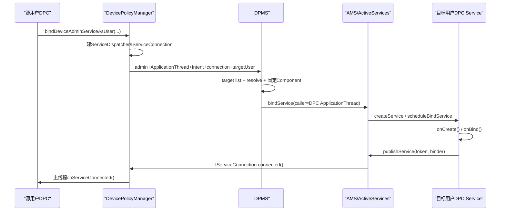
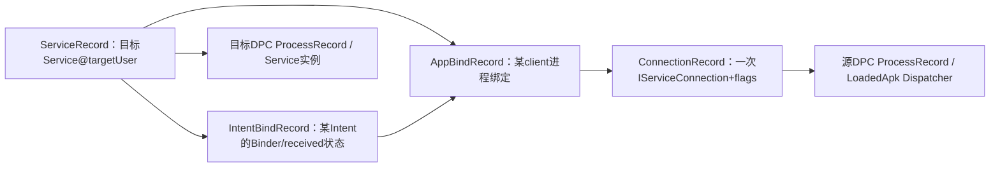
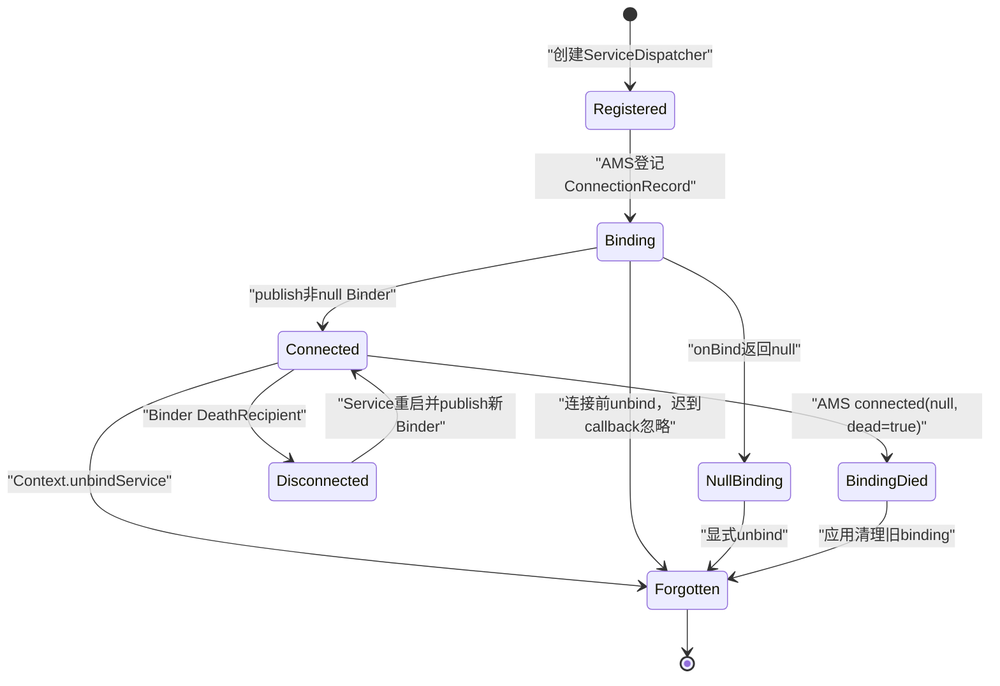

# 第 342 章 Android 企业 Bind Device Admin Service As User：客户端 Dispatcher、AMS 连接、Service 发布、死亡与解绑链

> 源码基线：Android 11 / API 30 / `android-11.0.0_r48`。第341章确认哪些Owner可跨用户bind；本章从一次合法调用继续向下，直到目标Service的`onBind()`返回Binder、DPC主线程收到回调，再追进程死亡、重连和unbind。仅做macOS源码阅读，不编译。

## 1. 这条API解决什么问题

同一企业DPC分别运行在Device Owner user和affiliated secondary user中，两边需要实时双向IPC。`bindDeviceAdminServiceAsUser()`在严格Owner关系下建立普通Bound Service连接，而不是发广播或复制数据。

## 2. 它最终仍是标准Service模型

通过DPMS特殊授权和跨用户选择后，下游复用AMS `ActiveServices`、目标进程`Service.onBind()`、`IServiceConnection`与客户端`ServiceConnection`。所以生命周期规则与普通bind相通。

## 3. 特殊之处集中在入口

普通应用不能随意跨user绑定且通常拿不到`BIND_DEVICE_ADMIN`；DPMS验证DO/PO同包、affiliation和目标Service，再以system身份请求AMS，同时保留真实DPC ApplicationThread作为client。

## 4. 四个阶段

阶段一客户端创建ServiceDispatcher；阶段二DPMS做跨用户安全净化；阶段三AMS建ServiceRecord/AppBindRecord/ConnectionRecord并启动目标进程；阶段四Binder发布后反向回调DPC。

## 5. bind返回值不是连接回调

boolean只反映同步请求是否被框架接受；`onServiceConnected()`一定是后续异步事件。即使返回true，目标进程仍可能刚准备启动、尚未执行onCreate/onBind。

## 6. ServiceConnection运行在哪个线程

DPM客户端明确把`mContext.getMainThreadHandler()`传给dispatcher，所以`onServiceConnected()`、`onServiceDisconnected()`、`onBindingDied()`和`onNullBinding()`被切回调用DPC进程主线程。

## 7. 真正业务Binder在哪条线程

ServiceConnection回调在主线程，但之后调用远端业务AIDL时，会进入目标DPC进程Binder线程池，除非目标Stub自行切线程。不能把“拿Binder的回调在main”误写成“所有RPC在main”。

## 8. 两个用户意味着两个UID

同package在user 0与user 10的Linux UID不同，通常为`userId * PER_USER_RANGE + appId`。服务端AIDL看到的`Binder.getCallingUid()`是源用户DPC UID，可用来区分对端实例。

## 9. 同包不是同进程

两边APK签名与package可相同，但各有独立Application、进程、数据目录、权限状态和生命周期。Binder对象才是跨边界能力，不应共享Java singleton假设。

## 10. 本章主要源码文件

入口在DevicePolicyManager/DPMS；客户端dispatcher在LoadedApk与ContextImpl；服务调度在AMS/ActiveServices；目标生命周期在ActivityThread；记录结构包括ServiceRecord、AppBindRecord、IntentBindRecord和ConnectionRecord。

## 11. 完整调用总图

## 12. 客户端先拒绝parent DPM

公开API调用`throwIfParentInstance()`。managed-profile parent facade不能借parent身份发起这条Owner-to-Owner通信。

## 13. ServiceConnection应非null

方法参数注解NonNull，但客户端没有在DPM方法首行显式require；`getServiceDispatcher()`最终以conn作为map key和dispatcher对象。按契约传null属于调用错误，不能依赖服务端补救。

## 14. getServiceDispatcher做了什么

ContextImpl委托LoadedApk，以`Context outerContext + ServiceConnection`为key查`mServices`。不存在就创建`ServiceDispatcher`，存在则验证Context和Handler完全一致后复用。

## 15. 为什么需要Dispatcher

AMS只认识跨Binder的`IServiceConnection.Stub`，应用写的是Java `ServiceConnection`。Dispatcher的InnerConnection把系统Binder callback桥接成应用主线程Runnable。

## 16. InnerConnection持WeakReference

Stub只弱引用ServiceDispatcher，避免系统持有callback Binder就无限强保活整套Context/connection。但LoadedApk注册表在正常bound期间仍强持有dispatcher。

## 17. Dispatcher保存泄漏现场

构造时创建`ServiceConnectionLeaked`并填充调用栈，Context销毁时若仍绑定，框架可报告最初注册位置。跨用户bind也需要像普通bind一样成对释放。

## 18. 同一connection复用有约束

用同一个ServiceConnection与同一Context再次bind会取回已有dispatcher；若Handler/Executor不同会RuntimeException。DPM固定main Handler，避免线程策略漂移。

## 19. Activity token来自DPM Context

客户端向DPMS传`mContext.getActivityToken()`；Application Context通常null，Activity Context可能携带token。AMS会把非null token关联到Activity service-connections holder，Activity销毁可参与清理。

## 20. 真实ApplicationThread也被传入

`mContext.getIApplicationThread()`代表源DPC进程的ActivityThread Binder。DPMS没有用system_server自己的ApplicationThread替换它，这是下游识别真实client process的关键。

## 21. prepareToLeaveProcess

Intent跨Binder前调用`serviceIntent.prepareToLeaveProcess(mContext)`，检查/整理URI、ClipData等跨进程语义。它不替代DPMS对目标package和service permission的专用验证。

## 22. target user最终变成整数

客户端取`targetUser.getIdentifier()`。与前章一样，长期保存UserHandle有ID复用风险；发起bind前应核对serial与Owner关系。

## 23. DPMS第一组参数校验

服务端require admin、caller ApplicationThread、Intent和IServiceConnection；target必须不同于calling user。相同user应使用普通Context.bindService，而不是跨用户企业API。

## 24. Intent至少指定package或component

两者都没有时Preconditions抛IllegalArgumentException。允许package-only是为了在目标Owner包内按IntentFilter解析，但最终仍会被固定为唯一component。

## 25. target list在真实bind时重算

DPMS调用`getBindDeviceAdminTargetUsers(admin)`并contains目标。查询列表后到bind之间若Owner/同包/affiliation发生变化，真实调用会按新状态SecurityException。

## 26. target list三重门

目标user必须有不同user中的DO；必须有与DO相同package的Profile Owner；必须affiliated。DO可枚举多个合格secondary，secondary PO只会看到DO user。

## 27. 目标Owner package是绑定边界

通过列表后，DPMS在锁内取`getOwnerPackageNameForUserLocked(targetUserId)`。后续resolve出的service必须属于这个package，不能借Owner关系绑定同user第三方服务。

## 28. DPMS清除Binder身份

解析Service和调用AMS前clear calling identity。这样跨用户/`BIND_DEVICE_ADMIN`相关底层权限以system_server身份完成，而不是要求源DPC本身持有系统signature权限。

## 29. createCrossUserServiceIntent先resolve

PMS在target user中按Intent和resolved MIME type解析Service；找不到Service或目标user未运行导致resolve为空时，记录error并返回null，DPMS返回false。

## 30. package不符直接SecurityException

ResolveInfo的ServiceInfo.packageName必须等于目标Owner package。package-only Intent若过滤器误命中其他包，也会被挡住。

## 31. exported服务的保护要求

如果目标Service exported，必须声明`android.permission.BIND_DEVICE_ADMIN`；否则SecurityException。该signature权限表明这是专用于Device Admin跨用户连接的受保护入口。

## 32. non-exported分支

r48条件只在`serviceInfo.exported && permission不等于BIND_DEVICE_ADMIN`时拒绝，因此non-exported Service不会因缺该permission在DPMS预检被拒；system身份的后续AMS bind可达，但产品实现仍应遵守公开文档的保护建议。

## 33. Intent会被原地固定component

helper调用`rawIntent.setComponent(info.serviceInfo.getComponentName())`再返回同一对象。局部变量名叫sanitizedIntent，但后续传原`serviceIntent`仍是已净化对象。

## 34. 为什么必须固定component

resolve与真正AMS bind之间包状态可能变化；显式component避免system_server凭高权限在第二次解析时意外绑定另一个Service，收窄TOCTOU风险。

## 35. DPMS传给AMS的callingPackage

它使用`mContext.getOpPackageName()`，即system_server系统Context的包名，通常是`android`，而不是源DPC package。源DPC身份另由ApplicationThread保存。

## 36. AMS看到两套身份

Binder callingUid因DPMS clear identity是SYSTEM_UID；`callerApp=mAm.getRecordForAppLocked(caller)`却解析为源DPC ProcessRecord。权限/跨user解析与连接归属/OOM关系因此使用不同身份来源。

## 37. 这种混合是有意的能力代理

system身份跨user并通过目标Service保护门，真实DPC进程则成为连接client、接收callback并影响目标进程重要性。若全部换成system client，会错误地让system_server拥有业务连接生命周期。

## 38. flags仍受真实caller限制一部分

ActiveServices用`callerApp.info.uid`计算`isCallerSystem`，因此DPC不能使用`BIND_SCHEDULE_LIKE_TOP_APP`、`BIND_ALLOW_WHITELIST_MANAGEMENT`、`BIND_ALLOW_INSTANT`等仅system-client flag。

## 39. 另一些permission检查看到SYSTEM_UID

如`BIND_TREAT_LIKE_ACTIVITY`和background-activity-start flag调用AMS calling permission检查，可能基于当前Binder system身份。DPC应只使用公开允许的bind flags，不能靠代理路径试探内部特权位。

## 40. AMS先查真实caller进程

`getRecordForAppLocked(caller)`若找不到，抛SecurityException，防止伪造/过期ApplicationThread建立无归属连接。源DPC进程已死亡时，即便DPMS权限检查通过也无法bind。

## 41. Activity token可让bind归属Activity

token非null时AMS向ATMS查询connections holder；未知token返回0，DPMS映射false。Activity结束时框架可据holder移除相关connection，Application Context则没有这一层归属。

## 42. ActiveServices再次handleIncomingUser

`retrieveServiceLocked()`用当前Binder callingPid/Uid处理target user。这里调用来自system_server system身份，因此跨user门通过；普通DPC若直接调AMS不会拥有同样路径。

## 43. ServiceMap按目标user分区

target user经过处理后，ActiveServices取对应`ServiceMap`，按component或Intent FilterComparison查ServiceRecord。相同component名在不同user有独立记录与进程。

## 44. PMS再次解析Service

没有现成ServiceRecord时，AMS仍调用PackageManagerInternal resolve目标组件并构造ServiceInfo。DPMS预解析负责企业安全边界，AMS解析负责标准Service生命周期，两层都不能省。

## 45. association allowlist使用系统代理身份

AMS校验`validateAssociationAllowedLocked(callingPackage, callingUid, targetPackage, targetUid)`；这里callingPackage通常android、callingUid为SYSTEM_UID，而不是DPC包/UID。企业same-package边界已由DPMS先行保证。

## 46. ServiceLookupResult三态

找不到Service返回null，bind结果0；找到但标准权限/association拒绝可能返回record=null，bind结果-1；正常得到ServiceRecord继续建连接。

## 47. DPMS负值映射缺口

普通Context.bindServiceCommon遇`res<0`会抛SecurityException；r48 DPMS却直接判断`bindService(...) != 0`。因此理论上的-1也被映射true，这是boolean成功证据的实现缺口。

## 48. 为什么通常不容易触发-1

DPMS已经校验目标Owner package、service及BIND_DEVICE_ADMIN，并用SYSTEM_UID进入AMS，常见permission failure被提前消除。但防御性代码仍不应把true提升为连接完成证明。

## 49. permissions review边界

若目标package仍需旧式runtime permission review，ActiveServices可能记录binding却暂不启动service，并仅在caller foreground时拉起review UI。源DPC前后台状态取自callerApp。

## 50. 创建AppBindRecord

AMS调用`ServiceRecord.retrieveAppBindingLocked(intent, callerApp)`，得到目标Service+Intent与源DPC ProcessRecord的绑定关系；同一client/Intent可复用记录。

## 51. 四类服务记录关系图

## 52. ConnectionRecord保存什么

它记录AppBindRecord、可选Activity holder、IServiceConnection、flags、clientUid、clientProcessName和clientPackageName，并跟踪procstats association及serviceDead。

## 53. clientUid来自真实DPC

构造参数使用`callerApp.uid`，所以ConnectionRecord知道源用户真实UID；但clientPackageName传入的callingPackage是system Context包名android，二者在该代理路径可能不匹配。

## 54. 多张索引同时登记

connection加入ServiceRecord按callback Binder分组的connections、AppBindRecord.connections、可选Activity holder、client ProcessRecord.connections，以及ActiveServices全局mServiceConnections。

## 55. 为什么需要全局mServiceConnections

后续`unbindService(IServiceConnection)`只拿到callback Binder，AMS靠这张表找出所有ConnectionRecord并逐项移除。

## 56. 进程重要性关联

有bound connection时，目标service进程的OOM优先级可受client活动、flags等影响；AMS更新LRU/OomAdj。跨用户不意味着服务进程脱离常规进程治理。

## 57. BIND_AUTO_CREATE的作用

flags包含AUTO_CREATE时，若目标Service进程未运行，`bringUpServiceLocked()`负责启动；没有AUTO_CREATE时，binding记录可以存在但系统不一定仅为它创建目标进程。

## 58. DPM不会替调用者补AUTO_CREATE

flags原样传递。若业务要求立即获得Binder，DPC应显式选择合适公开flag；否则true可能只是登记了一个等待已有Service运行的连接。

## 59. 目标进程启动后的Service创建

AMS调度ActivityThread `handleCreateService()`：创建目标user应用Context、Application、Service实例，attach后调用`service.onCreate()`并用token登记。

## 60. onCreate还没有业务Binder

Service只完成实例初始化；真正给client的IBinder来自后续`onBind(Intent)`。不要在日志中把onCreate等同onServiceConnected。

## 61. requestServiceBindingLocked

Service进程和thread可用，且该Intent尚未requested或正在rebind时，AMS提升execute计数，调用目标ApplicationThread `scheduleBindService(token,intent,rebind,procState)`。

## 62. scheduleBindService是oneway式调度

请求进入目标进程ActivityThread消息队列，AMS不能在同一Java调用栈同步拿到onBind结果。bind API早已返回或即将返回。

## 63. 目标主线程执行onBind

ActivityThread `handleBindService()`从token取Service，设置Intent classloader/enter-process状态；非rebind调用`s.onBind(intent)`。应用不应在onBind做长I/O阻塞主线程。

## 64. onBind返回IBinder或null

非null通常是AIDL Stub/自定义Binder；null合法，表示binding machinery成功但Service不提供接口。两者都会通过`publishService()`回到AMS。

## 65. publishService使用ServiceRecord token

AMS验证token确为ServiceRecord，按Intent FilterComparison找到IntentBindRecord；首次publish保存binder并标requested/received。

## 66. 一个Binder可广播给多个connections

AMS遍历ServiceRecord所有connections，只对Intent FilterComparison匹配者调用`c.conn.connected(name,binder,false)`。同一binding的多个client共享onBind返回Binder。

## 67. Service已发布时可快速回调

新client bind到已运行且`b.intent.received`的Service，AMS在登记ConnectionRecord后直接调用IServiceConnection.connected，不再等待一次新的onBind。

## 68. 仍然不是应用主线程直接调用

AMS对IServiceConnection的Binder调用抵达源DPC Binder线程；InnerConnection再调用dispatcher.connected，后者向main Handler post RunConnection。

## 69. queued callback先检查forgotten

RunConnection执行`doConnected()`时若`mForgotten=true`，直接忽略。DPC在callback到达前unbind，不会随后又收到迟到onServiceConnected。

## 70. Dispatcher按Component维护active connection

`mActiveConnections`从ComponentName映射到binder+DeathRecipient。若新binder与旧binder相同，重复connected被忽略；不同则替换代际。

## 71. 客户端直接linkToDeath

对非null service Binder，Dispatcher创建DeathMonitor并调用`linkToDeath`。目标进程若在此刻已死，RemoteException导致不登记且不回调connected。

## 72. 替换Binder的回调顺序

已有old而新binder不同，先unlink旧death并在锁外`onServiceDisconnected(name)`，之后若新binder可用再`onServiceConnected(name,newBinder)`。

## 73. 正常首次连接

old为null、dead=false、service非null时只调用`onServiceConnected`。DPC应在此保存类型化AIDL接口，并避免阻塞main thread。

## 74. onNullBinding场景

目标Service.onBind返回null时，AMS publish null；Dispatcher没有有效binder，最终调用`onNullBinding(name)`。bind同步boolean可以true，但永远没有业务接口。

## 75. Binder业务调用的身份

连接建立后DPC直接调用目标Binder，此时不再经过DPMS/AMS；目标Stub应依据Binder calling UID/user、协议token和方法权限鉴权，不能因首次bind受框架保护就信任所有未来参数。

## 76. UID核对要考虑shared UID

同appId/同package是预期，但shared UID或Owner变更会复杂化。服务可结合PackageManager按callingUid解析packages、预期target/caller user及自己的管理配置校验。

## 77. 不要信任Intent extras作为长期身份

Intent已由源DPC提供并被system转发；它适合连接参数，不是每次RPC不可伪造的caller证明。Binder kernel UID才是单次调用的基础身份。

## 78. 双向callback需要再注册Binder

若目标Service要主动推事件，可在AIDL方法接收源DPC callback Binder并linkToDeath。ServiceConnection只负责“client获service”，不会自动建立业务层反向接口。

## 79. 大数据不适合直接Binder搬运

Binder事务有大小限制。跨用户配置应使用小消息、分页、ParcelFileDescriptor或受控ContentProvider/文件协议，并在业务层处理中断与重试。

## 80. 连接true仍可能没有callback的原因

未用AUTO_CREATE、目标正在启动、permission review、进程启动失败、onCreate/onBind异常、onBind返回null、client先unbind或源进程死亡，都能让同步true与预期业务连接分离。

## 81. 目标Binder死亡的第一条通知链

客户端DeathMonitor运行在Binder线程，调用dispatcher.death，再向main Handler post command=1；`doDeath()`确认死亡binder仍是当前代际，移除映射、unlink并调用`onServiceDisconnected()`。

## 82. onServiceDisconnected不是主动unbind

它表示远端意外断开，binding记录可能仍存在。若AUTO_CREATE且系统重启目标Service，稍后可再次publish新Binder并回调onServiceConnected。

## 83. 业务层要清旧代理

收到disconnected后应把缓存AIDL设为null、失败/排队在途请求，并用connection generation拒绝迟到结果。旧Proxy对象即使还在Java字段里也无法恢复原Binder。

## 84. AMS也能发送dead连接事件

`bringDownServiceLocked()`会对尚存ConnectionRecord调用`connected(name,null,true)`，同时把serviceDead置true。这不是客户端DeathRecipient的同一入口。

## 85. r48 dead=true的回调组合

Dispatcher有old binder时先`onServiceDisconnected`，再因dead调用`onBindingDied`，最后因service为null还调用`onNullBinding`。这是按源码条件顺序得出的r48行为，不能只凭现代API直觉删掉最后一步。

## 86. onBindingDied的恢复策略

它通常表示系统认为原binding永久失效，应用应unbound并重新bind，而不是等同普通可自动重连的disconnected。实际重试还要先重新核对affiliation/Owner target list。

## 87. onNullBinding有两种来源

常见来源是Service.onBind正常返回null、dead=false；r48 generic doConnected在dead=true+null时也进入同一callback。业务应结合此前disconnected/bindingDied和自身代际判断。

## 88. 目标user停止会怎样

UserController强停目标user所有进程，目标DPC Service Binder死亡，源用户若仍运行便收到disconnected/dead链；连接无法跨目标user STOPPED状态继续提供RPC。

## 89. 源user停止会怎样

源DPC进程被杀，ActiveServices在`killServicesLocked(clientApp)`遍历其connections调用removeConnectionLocked；目标Service若无其他需要它的连接，可进入onUnbind/onDestroy。

## 90. affiliation失效不会制造死亡

IDs失去交集不会杀任一进程或Binder，DPMS也没有主动unbind既有connection。因此没有onServiceDisconnected可作为“策略撤销事件”，业务需要另行监听/轮询并主动断开。

## 91. 连接代际与死亡图

## 92. 正确解绑使用哪个API

DPM只提供特殊bind，没有特殊unbind；调用方使用当初获取DPM的同一个Context执行普通`unbindService(conn)`。LoadedApk以Context+ServiceConnection查dispatcher，换Context会报未注册。

## 93. 客户端先forget再通知AMS

ContextImpl先调用`LoadedApk.forgetServiceDispatcher()`，取得IServiceConnection后才调用AMS.unbindService。这样本地从解绑时刻起忽略迟到连接回调。

## 94. doForget做两件事

遍历所有active binders执行unlinkToDeath并清map，然后`mForgotten=true`。它不会调用应用的onServiceDisconnected，因为主动unbind本就不是异常断线通知。

## 95. 同一个conn可能代表多条connection

LoadedApk对同Context+ServiceConnection复用一个InnerConnection Binder；若拿它绑定多个Component，dispatcher按Component存多项，AMS全局表也可能对同callback Binder记录多条ConnectionRecord。

## 96. 一次unbind会移除这个callback的全部记录

AMS按IServiceConnection binder取clist并循环`removeConnectionLocked()`直到为空。因此复用同一个ServiceConnection做多次bind，会让解绑粒度变粗；企业代码宜一条逻辑连接一个conn对象。

## 97. BIND_DEBUG_UNBIND的诊断

带该flag时forget后把dispatcher放入mUnboundServices并记录解绑调用栈。再次对同Context+conn解绑会抛IllegalArgumentException并附首次解绑位置。

## 98. 未注册和Context失效错误

找不到dispatcher时，普通情况抛`Service not registered`；context为null路径抛Context no longer in use。解绑不是返回false的静默幂等操作。

## 99. AMS unbind更新多张索引

removeConnectionLocked从ServiceRecord、AppBindRecord、client ProcessRecord、Activity holder及mServiceConnections删除记录，停止procstats association并重新计算目标进程OOM状态。

## 100. 最后一个client离开会触发onUnbind

目标Service仍运行且某Intent binding不再有client时，AMS调度ActivityThread `handleUnbindService()`，目标主线程执行`Service.onUnbind(intent)`。

## 101. onUnbind返回true的语义

true让AMS记录`doRebind`；未来第一个client绑定相同Intent时调用`onRebind()`而不是再次onBind。false则未来通常重新onBind获取接口。

## 102. Service是否onDestroy取决于是否仍需要

若没有startService状态、AUTO_CREATE connections或其他保活原因，ActiveServices可bringDown并调目标Service.onDestroy；unbind本身不保证立即杀进程。

## 103. Context泄漏为何严重

忘记unbind会让LoadedApk registry、AMS ConnectionRecord、目标Service与OOM关联持续存在，还可能强持有Activity Context。跨用户连接同样会造成电量、内存和管理通道泄漏。

## 104. bind返回false的本地登记边界

客户端在得到服务端结果前已创建/登记dispatcher，方法自身没有在false分支显式forget。r48与普通bindServiceCommon结构相似；应用仍应遵循API契约管理conn，避免反复制造不同对象和泄漏现场。

## 105. 源进程崩溃能兜底server记录

即使应用没主动unbind，AMS在client ProcessRecord死亡时会移除connections；但这不是可接受的正常资源管理策略，且业务无法获得优雅flush/onUnbind时序保证。

## 106. 目标进程重启不是会话连续

新Service实例会重新onCreate/onBind并发布新Binder，内存认证、订阅和未提交事务都丢失。客户端应在新的onServiceConnected重新握手，而不是继续旧sessionId。

## 107. 推荐的连接状态机

维护IDLE/BINDING/CONNECTED/DISCONNECTED/REBINDING/UNBINDING；每次bind分配generation，回调校验当前conn+generation，策略或Owner变化先UNBINDING再重新查询target list。

## 108. 推荐的安全握手

连接后双方交换user serial、Owner package/version、协议版本、随机challenge和管理generation；服务端同时核对Binder UID对应预期source user/package。不要只检查一个客户端自报字符串。

## 109. 推荐的线程模型

ServiceConnection主线程只更新状态并把握手发到worker；目标Binder Stub快速校验后把I/O投递到受控executor。避免主线程互相同步调用形成跨进程死锁。

## 110. 推荐的重试模型

disconnected可指数退避等待系统自动重启或主动rebind；bindingDied先unbind再重新检查资格；SecurityException不自动快重试；user STOPPED则等待生命周期恢复。

## 111. 推荐的故障证据

同时记录DPMS target list、Intent最终component、bind boolean、AMS ServiceRecord/ConnectionRecord、目标onCreate/onBind/publish、源四类callbacks、Binder death和unbind generation。单边日志不足以还原链路。

## 112. macOS只读练习一：画身份表

沿DPMS clear identity到ActiveServices，分别列Binder callingUid、callerApp.uid、callingPackage、ConnectionRecord.clientUid/package、业务AIDL Binder.getCallingUid，解释哪些代表system代理、哪些代表真实DPC。

## 113. macOS只读练习二：追首次连接

从DPM getServiceDispatcher开始，依次找到DPMS resolve/setComponent、AMS ConnectionRecord、scheduleBindService、ActivityThread onBind、publishService、InnerConnection和主线程onServiceConnected。

## 114. macOS只读练习三：推演三种断线

分别模拟目标Binder进程crash、AMS `connected(null,true)`、源DPC主动unbind；按LoadedApk源码列出onServiceDisconnected/onBindingDied/onNullBinding是否出现及DeathRecipient如何清理。

## 115. macOS只读练习四：核对资源回收

追ContextImpl.unbindService、forgetServiceDispatcher、doForget、AMS.unbindServiceLocked、removeConnectionLocked、目标onUnbind/onDestroy，解释同conn多bind为何一次解绑可能全部移除。

## 116. 本章速查

DPMS负责“谁能跨user找哪个Owner Service”，AMS负责“哪个真实client进程与哪个ServiceRecord建立连接”，LoadedApk负责“把Binder callback切到应用主线程并监控业务Binder死亡”。

## 117. 复读修正一：AMS不是只看到DPC或只看到system

Binder UID/callingPackage来自system代理，callerApp和clientUid来自DPC ApplicationThread。正文已按用途拆分这套混合身份，避免把权限解析与OOM/连接归属混为一谈。

## 118. 复读修正二：负返回值可能被误报true

对照ContextImpl的`res<0`抛SecurityException，确认r48 DPMS仅用`!=0`；虽前置验证令该路径罕见，boolean仍不应作为强连接证据。

## 119. 复读修正三：死亡callback并非只有一种

客户端Binder DeathRecipient只触发onServiceDisconnected；AMS dead=true路径在r48 doConnected中还会顺序触发bindingDied和nullBinding。正文已按具体入口而非泛化文档描述。

## 120. 本章结论与下一章

bindDeviceAdminServiceAsUser是“DPMS能力代理+标准Bound Service”的组合：安全门在bind前，真实client与进程治理保留在AMS，业务Binder发布/死亡由LoadedApk异步交付；true、connected和业务ready是三个完成点，解绑必须成对。下一章将深入`setForceEphemeralUsers()`在split system user设备上的全局强制临时化、现有用户批量删除与新用户flag继承链。
