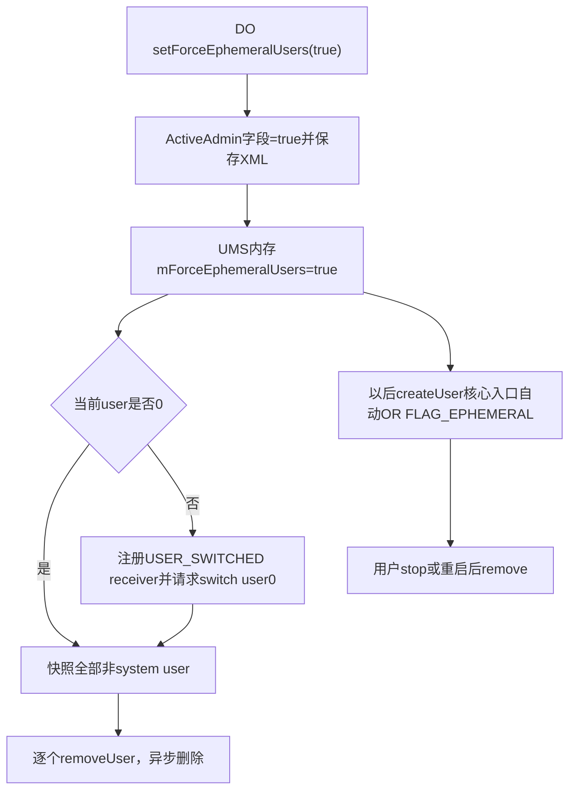
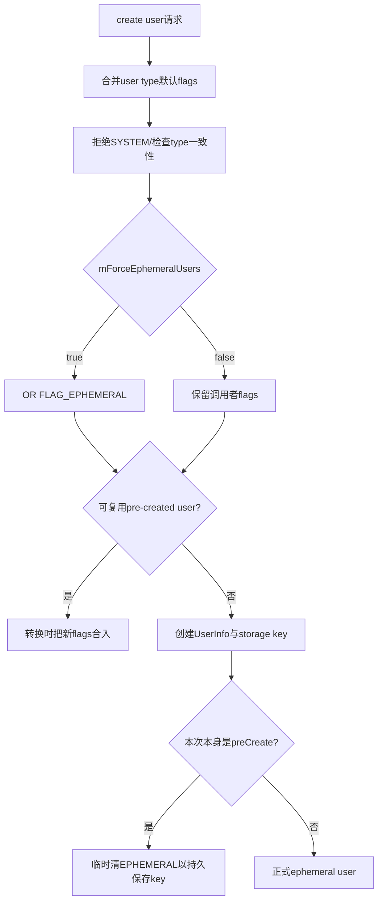
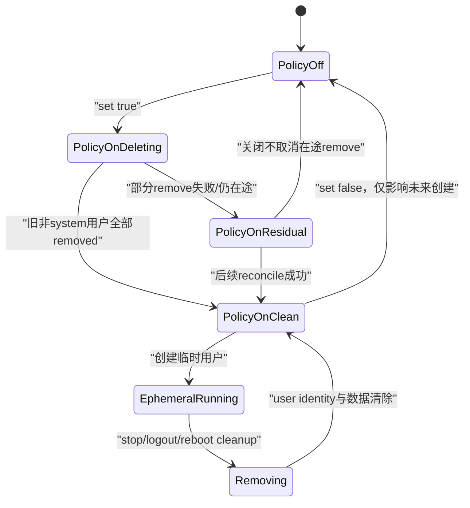

# 第 343 章 Android 企业 Force Ephemeral Users：全局临时化、现有用户批量删除、新用户继承与恢复边界链

> 源码基线：Android 11 / API 30 / `android-11.0.0_r48`。`setForceEphemeralUsers(true)`是隐藏的Device Owner策略，只支持split system user设备。它不会把既有UserInfo原地改成ephemeral，而是请求删除全部非system用户，并让以后创建的非system用户自动带FLAG_EPHEMERAL。仅做macOS只读分析，不编译。

## 1. ephemeral用户是什么

Ephemeral表示临时会话：用户停止完成后会触发remove，系统重启时也会被cleanup。它比“logout后锁CE”更强，目标是会话结束后销毁用户身份和数据。

## 2. force策略解决什么问题

共享终端希望每个登录用户天然是一次性会话，不依赖每个create调用者记得传MAKE_USER_EPHEMERAL。DO设置全局策略后，UMS在用户创建核心入口统一补flag。

## 3. 两个立即效果

策略从false切true时，一边更新未来创建规则，一边异步清除现有非system用户。两边没有事务包裹，可能出现未来规则已生效而旧用户仍在删除中的窗口。

## 4. false的效果不同

从true切false只停止“强制给新用户加ephemeral”，不会恢复已删除用户，也不会把现存ephemeral用户改成永久用户。

## 5. system user永远豁免

公开Javadoc和实现都排除user 0：UMS创建入口本就拒绝创建第二个FLAG_SYSTEM用户，批量删除也明确跳过USER_SYSTEM。

## 6. 为什么只支持split system user

非split形态的user 0同时承载人类主用户，无法在保留系统管理根的同时删除所有人类会话。split形态把system user与可登录full users分离，才适合全体临时化。

## 7. split不等于普通多用户开关

`UserManager.isSplitSystemUser()`读取只读系统属性`fw.system_user_split`，属于产品构建用户模型，不是Settings里用户可切换的开关，也不能运行时动态改。

## 8. 隐藏API

方法标记`@hide`，主要面向系统DPC/平台组件，不是普通第三方DevicePolicyManager公开SDK能力。阅读它仍有助于理解专用设备会话实现。

## 9. 参与组件

DPC经DPM/DPMS写Device Owner ActiveAdmin；DPMS通过UserManagerInternal推内存策略并发起removeAllUsers；UMS负责切user、快照、逐用户remove、创建flag和开机cleanup。

## 10. 三张不同的账

第一张是DPMS XML的desired policy，第二张是UMS `mForceEphemeralUsers`当前boot内存位，第三张是每个UserInfo的FLAG_EPHEMERAL。它们可能短暂或故障后不一致。

## 11. 总体执行图

## 12. 客户端parent实例被拒绝

DPM先`throwIfParentInstance("setForceEphemeralUsers")`。组织所有managed profile的parent facade不能设置这项全设备用户模型策略。

## 13. mHasFeature短路

DPMS若设备无device-admin feature直接return；此分支甚至早于who非null和DO校验。调用者不能把“没有异常”视为政策已应用。

## 14. true时先检查split

`forceEphemeralUsers && !userManagerIsSplitSystemUser()`立即抛UnsupportedOperationException。false不触发这一检查，所以非split设备可合法调用false。

## 15. admin必须是实际DO

在DPMS锁内通过`USES_POLICY_DEVICE_OWNER`取ActiveAdmin。Profile Owner、delegate或普通active admin都不能操作。

## 16. 同值有early return

只有`deviceOwner.forceEphemeralUsers != requested`才保存、推UMS和决定删除。再次set true不会重试先前失败的批量删除，也不会重新推一次UMS位。

## 17. desired字段先修改

代码先改ActiveAdmin内存boolean，再调用`saveSettingsLocked(callingUserId)`。true才写XML tag，false依赖默认值省略。

## 18. save失败不会向DPC报错

DevicePolicy settings写盘异常在内部日志/rollback，setter无结果码；后续仍推UMS并可能删除用户。当前boot可按true运行，重启却从旧XML恢复false。

## 19. UMS内存位第二步更新

`mUserManagerInternal.setForceEphemeralUsers(value)`只在mUsersLock内赋值，无磁盘写入。持久真相仍是Device Owner政策，system_server启动时由DPMS重新push。

## 20. 删除动作被移到DPMS锁外

锁内只设置`removeAllUsers=true`；退出锁后clean identity调用UMS。避免持有DevicePolicy大锁做用户切换/删除长链，但也使policy与删除之间存在并发窗口。

## 21. false不调用removeAllUsers

布尔从true改false时更新XML和UMS位，`removeAllUsers`局部量保持false。已存在的任何用户都不因此新增、恢复或转为persistent。

## 22. getter读哪张账

`getForceEphemeralUsers(admin)`验证DO后只返回ActiveAdmin字段，不查询UMS内存或实际用户列表。true不证明每个现有非system user已经消失。

## 23. 没有专用完成callback

setter返回void，框架不向DPC提供“所有旧用户删除完成”的回调或Future。DPC需观察USER_REMOVED、用户列表和serial收敛。

## 24. 也没有专用DevicePolicy event

r48该setter未见DevicePolicyEventLogger调用。XML变化会走通用DPM state changed，但审计系统若关心批量擦除应自行记录请求与结果。

## 25. system_server启动恢复

DPMS `onLockSettingsReady()`读取Device Owner admin；存在DO时把持久`forceEphemeralUsers`推给UMS。这样未来创建规则跨重启恢复。

## 26. 启动恢复不会再次removeAllUsers

该启动路径只set UMS位，没有调用removeAllUsers。框架依赖UMS开机cleanup删除所有已持久化的ephemeral用户，而非重新执行“删除全部非system”。

## 27. clearDeviceOwner会关闭UMS位

clearDeviceOwnerLocked把admin.forceEphemeralUsers=false并立即push UMS。此后新用户不再被全局强制临时化。

## 28. 退管不复活旧用户

已经删除的用户不可恢复，仍在的FLAG_EPHEMERAL用户也没有清flag代码；它们之后stop或下一boot仍会删除。

## 29. 当前user为0的批量路径

UMS `removeAllUsers()`读取`ActivityManager.getCurrentUser()`；若就是USER_SYSTEM，直接调用removeNonSystemUsers，无需等待切换广播。

## 30. 当前user非0的批量路径

先动态注册只监听ACTION_USER_SWITCHED的receiver，再调用ActivityManager.switchUser(USER_SYSTEM)。只有收到extra user handle=0才unregister并开始批量remove。

## 31. 为什么必须先切走

UMS removeUserUnchecked拒绝删除current user。先让user 0成为current/target，才能删除原先的人类会话用户。

## 32. switch请求返回值被忽略

`am.switchUser(USER_SYSTEM)`的boolean没有检查。若切换因UserController状态或产品限制返回false，receiver仍注册、批量删除不开始，setter也不会报告失败。

## 33. receiver没有timeout

源码未设置超时或失败注销。如果永远没有USER_SWITCHED到user0，receiver会继续存活；未来某次无关操作切回user0时又可能迟到触发批量删除。

## 34. receiver注册与switch顺序避免漏事件

先register再switch，防止快速切换广播先到导致无人接收。但这也让switch失败后的泄漏窗口更明显。

## 35. 只认USER_SWITCHED不是switch complete observer

receiver看到前台身份广播后开始remove，user0的CE解锁和BOOT_COMPLETED未必完成。删除旧用户只需要它不再是current，并不要求user0全部业务ready。

## 36. removeNonSystemUsers先做快照

在mUsersLock内遍历mUsers，把所有id!=0的UserInfo加入ArrayList，再释放锁逐个调用removeUser。避免锁内执行异步删除入口。

## 37. 快照包含哪些对象

它不筛enabled、partial、preCreated、profile、guest或already-removing，只排user0。不同状态会由每次removeUser内部进一步接受或拒绝。

## 38. 使用普通removeUser

批量方法调用的是UMS公开内部实现`removeUser(ui.id)`，不是`removeUserEvenWhenDisallowed()`。因此调用user的DISALLOW_REMOVE_USER/MANAGED_PROFILE restriction仍可能阻断。

## 39. restriction检查以system calling user为基准

DPMS已clean identity，UMS看到system UID/user0，再按目标是否managed profile选择restriction。base/system或有效限制可让部分remove返回false。

## 40. 每个remove返回值都被忽略

for循环不统计成功、失败或已removing，也没有重试与回调聚合。setForceEphemeralUsers返回时更早，因此“all existing users will be deleted”是期望，非同步完成保证。

## 41. remove本身仍是异步链

成功的remove先标removing/partial/disabled，请求stop；stop callback后发送有序USER_REMOVED，再在线程中清key、包状态、CE/DE与XML。批量只并列启动多条链。

## 42. 用户删除顺序不是事务

快照按mUsers内部顺序迭代，前一项remove返回后就请求下一项，并不等待最终擦除。多个用户STOPPING、broadcast和清理线程会重叠。

## 43. 新用户创建竞态

removeNonSystemUsers快照完成后又创建的user不在本轮列表；但UMS force位已经true，新user会带EPHEMERAL，最终仍会在stop或重启时删除，只是不保证立即消失。

## 44. 旧用户删除失败竞态

某旧user因restriction或状态返回false时，它原本并没有被改成ephemeral，可能继续作为persistent残留。全局force位只影响创建，不会补改既有UserInfo。

## 45. 同值true无法补救

因为DPMS字段已true，再调用true命中early return，不再removeAllUsers。DPC若发现残留，需要用其他有授权的remove流程治理，或先谨慎评估false→true重触发的副作用。

## 46. false→true可重新触发但非专用retry

切false会让新建窗口产生persistent风险，再切true又删除所有非system用户。它不是安全的单用户重试按钮，生产设计应避免用翻转策略修复某一失败项。

## 47. 用户创建核心入口统一加flag

UMS `createUserInternalUncheckedNoTracing()`完成user type默认flags与一致性检查后，在mUsersLock内读取mForceEphemeralUsers；true就`flags |= FLAG_EPHEMERAL`。

## 48. 作用于所有非system user type

代码没有只判断FULL_SECONDARY；full demo、guest、restricted和profile等走同一核心入口时都可能被补ephemeral，后续还受各type规则约束。

## 49. system用户为什么不会被误加

入口在读取force位之前已拒绝flags含FLAG_SYSTEM的创建请求。唯一user0在设备初始化路径建立，不经过“新建普通user并强制ephemeral”的场景。

## 50. 显式flag与强制flag是OR关系

调用者本来传MAKE_USER_EPHEMERAL与全局force同时存在不会产生新状态，只得到同一个bit。关闭force也不会覆盖调用者主动请求的ephemeral。

## 51. 新用户创建流程图

## 52. parent ephemeral还会向profile传播

真正构造UserInfo时，如果parent存在且parent.info.isEphemeral，代码再次OR FLAG_EPHEMERAL。即使全局force关闭，临时parent下的新profile也保持临时性。

## 53. parent继承与global force是独立来源

前者在持有packages/users锁构造阶段判断，后者更早读取全局位。任一为true都能使最终正式用户ephemeral。

## 54. pre-created用户为何特殊

预创建池提前准备UserInfo、包状态和存储key，但还不是可见真实用户。若它一开始就ephemeral，storage key不会被持久化，跨重启预热价值会丢失。

## 55. preCreate时强制清flag

即使全局force前面加了EPHEMERAL，真正创建pre-created UserInfo前仍执行`flags &= ~FLAG_EPHEMERAL`。所以池中对象本身暂时不是ephemeral。

## 56. 这不是绕过最终策略

普通create请求尝试复用池时，其入参flags已经按当前mForceEphemeralUsers补bit；`convertPreCreatedUserIfPossible()`把`preCreated.flags | flags`作为新flags，正式转换时重新得到EPHEMERAL。

## 57. 转换发生在低存储检查之前

创建入口先尝试转换合格pre-created user，若成功直接return；后面的DeviceStorageMonitor low-memory检查不执行。预创建的意义之一就是把工作前移。

## 58. 转换会保留原userId/serial

它修改name、flags、preCreated=false、convertedFromPreCreated=true和creationTime，写user/list并广播USER_ADDED。DPC应以返回的serial为准，不假定新请求一定分配全新ID。

## 59. 转换后ephemeral正常参与清理

一旦preCreated=false且flags含EPHEMERAL，stop收尾会auto remove；下次boot的cleanupPartialUsers也会匹配`isEphemeral && !preCreated`。

## 60. enable时现有pre-created池也在删除快照

removeNonSystemUsers只排user0，因此当前已有preCreated UserInfo也会被逐项removeUser尝试清理；之后系统仍可能按需求重新建立新的pre-created池。

## 61. pre-created remove是否成功仍未汇总

它可能已经停止、隐藏于普通列表或处于特殊状态，单项remove的结果照样被忽略。不能根据setter返回推定池已为空。

## 62. 创建UserInfo先标partial

新用户落盘初期`partial=true`，完成创建后再清。若创建在中间失败，开机cleanup会识别partial并同步清状态。

## 63. ephemeral storage key参数

StorageManager `createUserKey(userId,serial,userInfo.isEphemeral())`收到真实临时属性，可用不同持久策略管理密钥。这比只在UserController stop时删用户更早进入存储层语义。

## 64. DE与CE仍会正常准备

ephemeral不等于“完全不落盘”；创建时仍prepare DE/CE user data、安装包状态并运行应用。临时性体现在生命周期终点清除，而非全程只在RAM。

## 65. 数据仍可能写入物理存储

因此敏感设计不能把ephemeral等同不可恢复的即时secure erase。最终删除依赖文件系统、密钥销毁、硬件和介质实现，且异常链可能留下残余等待恢复清理。

## 66. 用户停止触发删除

第340章已追到`finishUserStopped()`：isEphemeral且非preCreated便调用removeUserEvenWhenDisallowed。显式stop、logout、切后台自动stop都可到达。

## 67. 切后台先阻止切回

`onEphemeralUserStop()`在内存UserInfo加FLAG_DISABLED；UserController随后stop。该flag防止删除前再次切回，不是最终数据销毁点。

## 68. reboot也会删除仍运行的ephemeral

UMS在PHASE_ACTIVITY_MANAGER_READY执行cleanupPartialUsers，条件包含`ui.isEphemeral() && !ui.preCreated`，不要求上次已正常STOPPED。

## 69. 开机cleanup为何同步更直接

此时旧用户进程本就不存在，方法把其标removing/partial后直接`removeUserState()`，不走正常stop callback与有序USER_REMOVED协调链。

## 70. 开机cleanup也清guestToRemove/partial

同一方法顺带处理创建/删除中断和待删guest。日志统一写“Removing partially created user”，不代表每个对象最初都因partial创建失败。

## 71. preCreated被明确排除ephemeral条件

池对象即使因异常带bit，只要preCreated=true，不因`isEphemeral && !preCreated`这项被删；OTA另有cleanupPreCreatedUsers全量清陈旧池。

## 72. 开机cleanup不发标准USER_REMOVED

从当前方法可见它直接removeUserState，没有`finishRemoveUser()`的ordered broadcast。依赖USER_REMOVED做企业账本的DPC必须在启动后重新枚举/核对serial。

## 73. 开机cleanup的removeUserState内容

依次尝试毁Storage key、清GateKeeper secure user ID、PMS per-user状态、CE/DE数据、UserManager内存/restriction、user list与user XML。

## 74. 单步失败多为继续

部分key/GateKeeper异常被记录后继续；更深I/O异常的恢复取决于组件实现。整体不是具备rollback的数据库事务。

## 75. “临时”完成证据

正常stop链可观察USER_REMOVED；crash/reboot链可能无此广播。最终证据应是userId→serial映射消失、用户目录/系统状态收敛，以及业务后台清单reconcile。

## 76. policy true与用户flag的时间关系

DPMS字段先true，UMS位随后true；两者之间极短窗口若有并发create，可能读取旧UMS false。方法持不同锁且无全局创建事务，应承认这一并发边界。

## 77. UMS位与创建检查在同一users锁

setUserManagerInternal和create入口读mForceEphemeralUsers都使用mUsersLock，因此一旦push完成，后续读写有清晰互斥顺序，不会看到撕裂boolean。

## 78. XML失败后的重启风险

当前boot新用户都临时、旧用户也可能被删；若policy XML没提交，重启后DPMS push false。已是ephemeral的用户会在boot cleanup删除，但重启后新建用户可能变persistent。

## 79. UMS push失败形态

LocalService同进程赋值无返回且逻辑简单，通常不会失败；真正风险更多来自DPMS没到onLockSettingsReady、system_server重启时序或策略持久化分叉。

## 80. 删除完成前关闭policy

如果true触发批量remove后立刻set false，在途remove不会被取消；尚未进入快照的新用户可能按false创建为persistent。策略翻转不具撤销先前副作用的语义。

## 81. enable不是安全擦除按钮

它面向用户模型政策，不提供wipeData级整机重置、完成证明或介质擦除认证。旧用户单项remove失败时仍可能保留，不能用于替代合规退役流程。

## 82. 与MAKE_USER_EPHEMERAL比较

MAKE_USER_EPHEMERAL只影响本次createAndManageUser；force policy影响所有创建入口并触发旧用户批量删除。局部临时会话优先用显式flag，全局共享设备模型才考虑force。

## 83. 与guest ephemeral比较

产品资源`config_guestUserEphemeral`可让guest天然临时；force更广，涵盖非guest full users与可能的profiles。两者最终都表现为UserInfo FLAG_EPHEMERAL。

## 84. 与setLogoutEnabled比较

Logout开关只暴露人机退出入口，普通用户logout后保留；force决定用户本身临时，任何stop都可升级为remove。两项组合才能实现“用户可主动退出且退出后销毁”。

## 85. 与wipeData比较

remove user只清该user空间，system user、设备全局配置、FRP/eUICC/adoptable storage等不按整机Factory Reset语义处理。force永远保留user0。

## 86. 与DISALLOW_ADD_USER比较

force不禁止创建，恰恰允许持续生成短期用户；DISALLOW_ADD_USER控制能否新增。专用设备可由DO内部创建API绕过部分用户限制，但容量/存储仍有各自门。

## 87. 与最大用户数的交互

旧用户异步removing期间可能仍占真实/近期ID与资源；新create可能暂时遇到MAX_USERS或storage不足。force true不保证可以无限连续创建会话。

## 88. 与最大运行用户数的交互

ephemeral属性不自动豁免max running users。后台start仍受第339章canStartMoreUsers前置门，切出/stop后才释放运行名额。

## 89. 与affiliation日志的交互

批量remove所有non-system用户会触发USER_REMOVED及DPMS affiliation/log收敛；删除unaffiliated用户可能discard device-wide logs。Force policy setter本身没有为日志保留特殊豁免。

## 90. 与Device Owner存续

策略只允许DO设置且保留user0；常规split模型的DO管理根应位于system user。若产品把Owner部署在异常非system形态，必须先审计removeAllUsers是否会把管理用户纳入快照。

## 91. 策略、用户与完成证据状态图

## 92. 推荐enable前检查

确认split system user、DO位于预期user、user0可切换、关键数据已同步、removal restrictions来源、所有non-system用户清单/serial、日志保留要求及失败恢复通道。

## 93. 推荐enable后第一阶段验证

读取getter只能确认desired；还要观察当前user切到0、UMS dumpsys force位、每个旧user进入removing以及新建测试用户UserInfo含EPHEMERAL。Mac阶段只读推演这些证据。

## 94. 推荐最终验证

等待所有旧serial失效、列表只剩预期system/pre-created状态、无partial/removing残留，并模拟一次临时user stop与一次重启恢复。不要仅等待setter返回。

## 95. DPC状态机字段

可记录policyGeneration、requestedAt、expectedOldSerials、switchToSystemObserved、perUserRemoveState、lastReconcileBootId和newUserEphemeralVerified。

## 96. removal restriction故障处理

若普通remove因restriction失败，先查询restriction source；DO自己设置的可清除，base/system来源不可强行覆盖。不要通过反复切policy掩盖原因。

## 97. switch失败故障处理

检查user0 UserInfo/supportsSwitchTo、UserController initialized/target、UI模式与系统日志；还要注意已注册receiver可能在未来迟到触发删除，必要的框架修复应加入timeout与显式unregister。

## 98. 迟到receiver的安全风险

管理员可能看到第一次enable“没效果”后做其他操作；数小时后某人切到user0，旧receiver突然删除所有non-system users。r48没有generation token判断这还是当前policy请求。

## 99. 改进实现应检查当前policy

receiver触发时可重新确认force仍true、请求generation匹配，再删除；switch false/超时应unregister并上报。当前源码没有这些补强，本章只提出设计建议。

## 100. 批量结果应聚合

理想接口应记录每个user remove boolean/callback，最终报告完全成功、部分失败及原因；r48 void setter+忽略返回无法直接给企业控制面强完成语义。

## 101. 创建竞态改进思路

若产品要求enable时刻后绝无persistent non-system user，可在UMS内将policy切换、阻止创建、快照删除做成受同一管理状态控制的阶段；当前DPMS→UMS分步存在小窗口。

## 102. false的迁移策略

关闭force后，要明确是否等待当前ephemeral用户自然结束，还是先创建新的persistent用户；不能把旧ephemeral用户原地升级成永久身份，因为源码无清flag API。

## 103. 用户数据迁移不要依赖ID

临时user删除后ID可回收；如需把允许保留的业务配置带到下一会话，应存放在user0/设备级受控服务或服务器，并用新serial/身份重新授权。

## 104. 隐私与可用性的权衡

ephemeral降低跨班次残留，但增加网络离线、批量删除失败、会话意外停止即丢数据和首次初始化成本。DPC需要持续同步而非退出时一次上传。

## 105. App层不能自行保证系统清除

清SharedPreferences或退出账号只影响单App；force ephemeral由UMS/PMS/Storage/GateKeeper共同清整个user。反过来，系统user外部服务器数据仍需业务删除策略。

## 106. stop前最后广播不可作唯一保存点

ACTION_USER_STOPPING/SHUTDOWN有超时和进程调度限制；临时user场景数据应随写随同步并保持幂等恢复，避免把关键上传塞到生命周期末尾。

## 107. reboot恢复的双重作用

DPMS从XML恢复future-create policy；UMS cleanup删除旧ephemeral/partial用户。若XML与当前boot内存曾分叉，重启既可能清旧会话，也可能改变之后新建用户规则。

## 108. dumpsys的只读线索

UMS dump打印`Force ephemeral users`和`Is split-system user`；DPMS ActiveAdmin dump打印forceEphemeralUsers。两者并列能发现desired/pushed分叉，但Mac无运行设备时只定位输出代码。

## 109. 源码检索入口

从DPMS setter搜索`setForceEphemeralUsers`，再搜UMS `mForceEphemeralUsers`只有赋值、创建读取与dump三处；批量链由`removeAllUsers`进入，boot链由`cleanupPartialUsers`进入。

## 110. 最小故障矩阵

至少覆盖非split true抛错、无feature静默return、save失败、switch false、restriction阻止某user、remove已在途、新user快照竞态、立即set false、system_server crash和reboot cleanup。

## 111. 安全回退原则

不确定删除是否完成时停止创建新长期会话，保持user0管理通道，按serial逐项reconcile；不要清除审计账本或复用旧ID映射，直到最终状态有证据。

## 112. macOS只读练习一：拆三张账

定位ActiveAdmin XML字段、UMS mForceEphemeralUsers和UserInfo flags，画出true、save失败、system_server重启、clear DO、set false时三者各自变化；不编译。

## 113. macOS只读练习二：推演批量删除

假设current=u10，库存有u0/u10/u11/profile12/preCreated13，逐步追receiver、switch target/current、快照和五次remove；再加入u11 restriction与switch false分支。

## 114. macOS只读练习三：追pre-created转换

从global force加EPHEMERAL开始，解释preCreate为何清flag、普通create如何把flag重新合入、转换后何时收到USER_ADDED，以及stop/reboot为什么会删除。

## 115. macOS只读练习四：核对两条删除终点

对比运行期ephemeral stop→removeUserEvenWhenDisallowed→USER_REMOVED→后台清理，和boot cleanupPartialUsers→直接removeUserState；列出广播、线程和完成证据差异。

## 116. 本章速查

true=持久desired、UMS future-create flag、尝试批量删旧用户；false=只停止未来强制；现有ephemeral不转永久；setter返回既不证明switch成功，也不证明任何旧user数据已擦除。

## 117. 复读修正一：既有用户不是原地临时化

初读Javadoc“all users should be ephemeral”容易写成给所有UserInfo补flag；全树确认实现是removeNonSystemUsers，只有之后create才在核心入口OR EPHEMERAL。

## 118. 复读修正二：批量remove并非强制无条件

方法名removeAllUsers看似绝对，实际逐项调用普通removeUser、受restriction影响且忽略boolean。正文已把它表述为best-effort批量提交。

## 119. 复读修正三：pre-created暂时清flag是有意设计

这不是force策略漏洞；注释说明为了持久storage key，正式转换时当前create flags会重新赋予EPHEMERAL。正文已区分池状态和真实用户状态。

## 120. 本章结论与下一章

Force Ephemeral Users把“未来创建统一临时化”与“现有非system用户best-effort删除”拼成一条非事务链；split模型、三张状态账、切user receiver、restrictions、pre-created和boot cleanup共同决定真实结果。下一章将深入`createAndManageUser`所用OverlayPackagesProvider，系统App required/disallowed/IME集合合并、资源overlay与快照裁剪算法。
