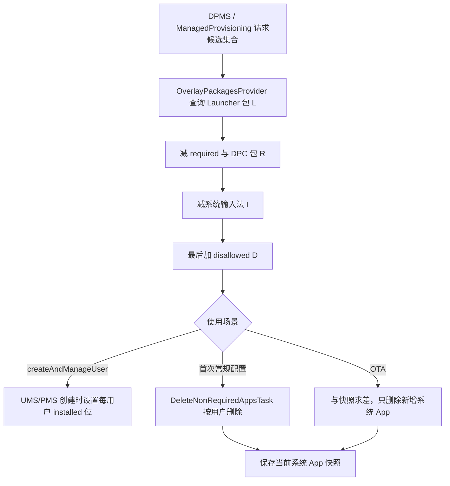
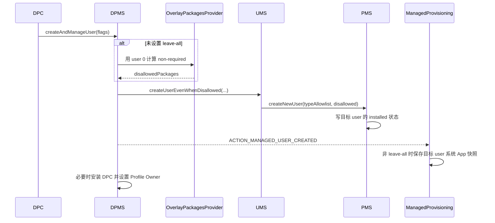
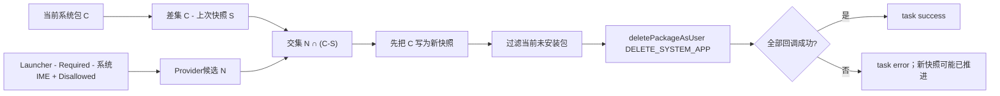

# 第 344 章 Android 企业 OverlayPackagesProvider：系统 App、Required/Disallowed、IME 例外、初始裁剪、快照与 OTA 差分链

> 源码基线：Android 11 / API 30 / `android-11.0.0_r48`。本章研究企业配置时“哪些预装应用留给新用户、哪些按用户隐藏，以及 OTA 后怎样只处理新增系统应用”。这里的删除通常改变某个用户的安装状态，不是从只读 system 分区物理删除 APK。仅在 macOS 上做源码只读分析，不编译。

## 1. 本章要回答什么

创建受管用户时，为什么有些预装应用一开始就看不到？系统升级新增一个带桌面图标的应用后，为什么它可能只从企业用户中消失？答案横跨 DPMS、`OverlayPackagesProvider`、UMS、PMS 和 ManagedProvisioning，不能只看一个“删除包”方法。

## 2. 先记住最终集合公式

把带 Launcher 入口的包记为 `L`，平台与厂商要求保留的包再加 DPC 自身记为 `R`，系统输入法记为 `I`，平台与厂商明确禁止的包记为 `D`，则候选集合是：

`NonRequired = ((L - R) - I) ∪ D`

运算顺序很重要：`D` 最后加入，因此最终具有最高优先级。

## 3. “non-required”不是包类型

它不是 manifest 标志，也不是 PackageManager 中永久保存的一种应用分类，而是本次 provisioning action、目标 user、资源 overlay、当前 Launcher/IME 查询结果与 DPC 包名共同计算出来的临时集合。

## 4. “system app”也不是“system 进程”

本章的系统应用主要由 `ApplicationInfo.FLAG_SYSTEM` 或 PMS 的 `PackageSetting.isSystem()`判断。它说的是包的来源/属性，不表示应用一定运行在 `system_server`，也不表示 UID 必然等于 `SYSTEM_UID`。

## 5. 三类 provisioning action

算法只接受 `ACTION_PROVISION_MANAGED_USER`、`ACTION_PROVISION_MANAGED_PROFILE` 和 `ACTION_PROVISION_MANAGED_DEVICE`。三者分别选择独立 required、disallowed、vendor-required、vendor-disallowed 数组；传其他 action 会抛 `IllegalArgumentException`。

## 6. 两种“首次处理”不要混为一谈

`createAndManageUser()` 的特殊链路在创建用户前把 disallowedPackages 交给 UMS/PMS，直接决定初始 installed 位；常规 ManagedProvisioning 首次配置则创建后运行 `DeleteNonRequiredAppsTask`，按 user 执行删除。两条路目标相似，时序和故障面不同。

## 7. OTA 是第三种处理

OTA 路径不是再次对所有包做首次清理。它先用快照找出“上次之后新增的系统应用”，然后仅在这批新增包里保留 non-required 候选，避免系统升级意外改变企业用户原有应用集合。

## 8. 五个关键参与者

DPMS 提供受保护的策略计算入口；`OverlayPackagesProvider` 做集合运算；UMS 创建用户并取得 user type allowlist；PMS 写每用户包安装状态；ManagedProvisioning 保存快照并在首次配置或 OTA 中执行按用户删除。

## 9. 两类配置来源

framework 自带 `required_apps_*` / `disallowed_apps_*`，设备厂商可通过资源 overlay 定制 `vendor_required_apps_*` / `vendor_disallowed_apps_*`。它们在运行时已经是合并后的 `Resources` 结果，而不是代码手工遍历多个 XML 文件。

## 10. 本章阅读入口

主入口是 `frameworks/base/services/devicepolicy/.../OverlayPackagesProvider.java`；创建链看 DPMS `createAndManageUser()`、UMS 创建核心与 PMS `Settings.createNewUserLI()`；快照链看 ManagedProvisioning 的 `NonRequiredAppsLogic`、`SystemAppsSnapshot` 和 `DeleteNonRequiredAppsTask`。

## 11. 全链路总图



## 12. getNonRequiredApps 的真实骨架

核心实现非常短，却包含整章最重要的优先级：

```java
Set<String> result = getLaunchableApps(userId);
result.removeAll(getRequiredApps(action, admin.getPackageName()));
result.removeAll(getSystemInputMethods(userId));
result.addAll(getDisallowedApps(action));
return result;
```

先减后加意味着 required 和 IME 都可能被最后的 disallowed 覆盖。

## 13. 第一步为什么从 Launcher 开始

默认目标是精简面向用户、会出现在桌面应用列表中的预装体验，而不是粗暴禁掉所有 framework 后台组件。没有 Launcher activity 的系统服务包默认不进入 `L`，除非它被资源明确放入 disallowed。

## 14. Launcher Intent 的构造

代码创建 `ACTION_MAIN` 并添加 `CATEGORY_LAUNCHER`，再按指定 user 调 `queryIntentActivitiesAsUser()`。因此这里寻找的是能响应标准桌面入口的 activity，而不是简单检查 manifest 是否声明过某个 activity。

## 15. 为什么包含 MATCH_UNINSTALLED_PACKAGES

算法还要看当前 user 已经处于未安装状态、但系统仍知道其包记录的应用，尤其是 OTA 和多用户场景。若只查询当前可见已安装 activity，可能漏掉需要纳入政策判断的预装包。

## 16. 为什么包含 MATCH_DISABLED_COMPONENTS

禁用 Launcher activity 不应让一个本来面向用户的预装应用逃离候选集合，所以查询包括 disabled components。这里是在判断“包具不具备桌面入口”，不是判断它此刻能不能成功启动。

## 17. Direct Boot 两种状态都查

同时使用 `MATCH_DIRECT_BOOT_AWARE` 与 `MATCH_DIRECT_BOOT_UNAWARE`，确保用户解锁前可运行和必须解锁后才可运行的 Launcher 应用都被考虑。Direct Boot 能力不构成企业裁剪豁免。

## 18. ResolveInfo 最后只留下包名

查询结果按 activity 返回，一个包可有多个 Launcher activity。实现把 `activityInfo.packageName` 放进 `ArraySet`，自然去重；后续策略粒度是 package，不是单个 component。

## 19. Launcher 候选不限于 system app

`getLaunchableApps()` 本身没有检查 `FLAG_SYSTEM`。不过其典型使用环境和后续删除 flag 面向系统应用；在 `createNewUserLI()` 中又明确只让 system package 初始安装。阅读时应区分“候选计算没有过滤”与“最终执行语义受调用场景约束”。

## 20. Required 集合由三部分组成

`getRequiredApps()` 合并 framework required 数组、vendor required 数组，并无条件加入 DPC 的 packageName。DPC 自身被保留是为了防止企业管理组件把自己的包从受管用户中裁掉。

## 21. DPC 用包名而非 receiver component

参数 `admin` 是 ComponentName，但这里只取 `admin.getPackageName()`。同一 DPC 包里有几个 DeviceAdminReceiver 不影响保留结果，保留单位仍是整个 APK 包。

## 22. AOSP managed-user required 默认值

r48 的 `required_apps_managed_user.xml` 包含 Settings、Contacts、Dialer、STK、Downloads provider/UI 和 DocumentsUI 等。它是默认产品基线；具体设备运行结果应以资源 overlay 合并后的数组为准，不能拿 AOSP 文件断言所有商用设备完全一致。

## 23. Vendor required 默认是空的

AOSP 的 `vendor_required_apps_managed_user` 空数组是一个定制插槽，并不表示某台 OEM 设备一定为空。Runtime Resource Overlay 或产品资源可把厂商设置、桌面或支持工具加入。

## 24. Disallowed 也分 framework 与 vendor

`getDisallowedApps()` 合并对应 action 的 platform 和 vendor 数组。AOSP managed-user 两个 disallowed 默认数组为空，但 managed-profile/device 的值以及 OEM overlay 都要分别核对。

## 25. Explicit disallowed 可以抓住无 Launcher 包

因为 `D` 是最后 `addAll()`，即便一个包没有 Launcher activity，也会进入最终集合。这就是显式黑名单与“面向用户应用自动裁剪”之间的关键区别。

## 26. Required 与 disallowed 冲突谁赢

代码注释明确说明：若误配为 required 与 disallowed，最终按 disallowed 处理。数学上它先被 `removeAll(R)` 移除，又被 `addAll(D)` 加回。

## 27. XML 注释与 Java 实现有冲突

r48 的部分 required XML 注释写着 required “takes precedence over disallowed”，但 Java 类注释与实际运算恰好相反。判断行为必须以可执行代码和测试为准；文档/资源注释可能滞后，这也是读源码不能只读注释的典型例子。

## 28. DPC 也不是绝对豁免

DPC 包会进入 required，但若 OEM 又把同包写入 disallowed，最后仍进入删除候选。这通常是产品配置错误，可能让后续管理建立失败，因此资源冲突应在构建前静态检查。

## 29. IME 例外从哪里来

Provider 通过 `InputMethodManagerInternal.get().getInputMethodListAsUser(userId)`取得该 user 的输入法列表，而不是读取一个固定 XML。输入法安装、user 状态和产品配置变化都会影响结果。

## 30. 只保护系统输入法

遍历 `InputMethodInfo` 后取 service 的 `ApplicationInfo`，仅 `isSystemApp()` 为真才加入例外集合。普通第三方输入法不会因为“它是 IME”就自动从候选集合移除。

## 31. 为什么要保护系统 IME

若把所有可用系统键盘裁掉，用户可能无法输入 Wi-Fi 密码、账号或工作数据，甚至无法完成配置。动态保护比写死一个包名更适应 AOSP LatinIME 与不同 OEM 输入法。

## 32. IME 豁免也会被 disallowed 覆盖

算法先 `removeAll(systemInputMethods)`，再加入 disallowed。产品确实可以显式禁掉某个系统 IME，但必须同时保证至少有另一条可用输入路径；框架这里不替 OEM 做“最后一个键盘”安全校验。

## 33. userId 影响两个动态查询

Launcher activity 和 IME 列表都按 user 查询，所以同一个系统镜像对 user 0、managed profile 与 secondary user 可能得到不同候选。资源数组相同，不代表最终集合相同。

## 34. 资源 action 选择是严格 switch

required、disallowed、vendor-required、vendor-disallowed 四个 getter 都独立按 action switch。若未来新增 provisioning action 却漏改其中一个 getter，会在运行时走 default 异常，而非安静套用某类旧数组。

## 35. 返回集合没有稳定顺序

实现使用 `ArraySet` 和集合运算，API 语义不承诺业务顺序。日志、测试和比较应按集合判断，不应依赖某个包总在第几个。

## 36. DPMS 对外暴露的隐藏桥

`DevicePolicyManager.getDisallowedSystemApps()` 是 `@hide`；Binder 到 DPMS 后先 `enforceCanManageProfileAndDeviceOwners()`，再调用 Provider。它服务于受信任的 ManagedProvisioning/系统组件，不是普通 DPC 可自由调用的公开 SDK 查询接口。

## 37. 方法名为什么容易误导

`getDisallowedSystemApps()` 实际返回的是 Provider 的 `getNonRequiredApps()`：既包含未在 required 中的 Launcher 应用，也包含 explicit disallowed。它不等于“资源 XML 里 disallowed 的包”，更不保证每个返回项已经通过 FLAG_SYSTEM 过滤。

## 38. 权限检查与 admin 角色检查不是一回事

该查询入口做的是 `enforceCanManageProfileAndDeviceOwners()` 的系统权限门，而 Provider 自身只把 admin 包名加入 required，并未验证这个 ComponentName 当下是不是目标 user 的 PO/DO。调用方必须在受控 provisioning 流程中提供正确 admin。

## 39. LEAVE_ALL_SYSTEM_APPS_ENABLED 的含义

这个 flag 表示跳过企业配置时的系统应用裁剪。它不是“把所有已被用户卸载的应用重新安装”，也不是忽略 user type allowlist；不同调用链里它主要决定是否产生 disallowed 删除集合和是否维护快照。

## 40. 先做一个小集合例子

若 `L={桌面A,设置,键盘}`，`R={设置,DPC}`，`I={键盘}`，`D={后台B,键盘}`，则先得到 `{桌面A}`，最后加入 D 成为 `{桌面A,后台B,键盘}`。后台B没有桌面入口仍被加入，键盘因 explicit disallowed 重新进入。

## 41. createAndManageUser 在创建前计算

DPMS 校验 system user 调用者和 DO 后，若没有 leave-all flag，调用：

```java
getNonRequiredApps(admin, UserHandle.myUserId(),
        ACTION_PROVISION_MANAGED_USER)
```

再把结果转成 `String[] disallowedPackages` 交给 UMS 创建新用户。

## 42. 这里为何是 UserHandle.myUserId

代码运行在 `system_server`，`myUserId()`通常是 user 0。新用户此时还不存在，无法对它查询 Launcher 与 IME。因此计算使用源系统用户的已知系统包视图，随后把名单应用给即将创建的用户。

## 43. 这是一个重要时间差

候选在新 user 创建前计算，新 user 自身的 package installed 状态和 IME 列表尚未形成。若产品对 user 0 与 secondary user 的 resolver 行为差异很大，应理解这里并非“创建后再对目标 user 精确重算”。

## 44. leave-all 时传 null

若设置 `LEAVE_ALL_SYSTEM_APPS_ENABLED`，DPMS 保持 `disallowedPackages=null`。PMS 的 `ArrayUtils.contains(null, name)`可按不包含处理；但系统包是否初始安装仍可能受 `userTypeInstallablePackages` 和 hidden-until-installed 约束。

## 45. UMS 再叠加 user type allowlist

UMS 从 `UserSystemPackageInstaller.getInstallablePackagesForUserType(userType)`取得允许该用户类型初始安装的系统包集合，再连同 disallowedPackages 调 `mPm.createNewUser()`。因此企业名单不是唯一过滤器。

## 46. PMS 的两个判断层次

`Settings.createNewUserLI()`先计算 `shouldMaybeInstall`：必须是 system、不能在 disallowed 中、不能 hidden-until-installed；再计算 `shouldReallyInstall`：还要满足 user type allowlist，除非 allowlist 为 null。

## 47. 真实源码片段

```java
boolean maybe = ps.isSystem()
        && !ArrayUtils.contains(disallowedPackages, ps.name)
        && !ps.getPkgState().isHiddenUntilInstalled();
boolean really = maybe
        && (skipPackageWhitelist || installable.contains(ps.name));
ps.setInstalled(really, userHandle);
```

这里设置的是每 user 包状态，不是删除 `PackageSetting`。

## 48. Disallowed 优先于 user type allowlist

即便包存在于用户类型允许集合，只要位于 disallowedPackages，`maybe` 已经是 false，后面没有机会变回 true。PMS 方法注释也明确写着 disallowed “takes precedence”。

## 49. 初始裁剪不是物理删除 APK

system APK 仍位于只读分区并被 PMS 全局扫描，其他 user 也可保持 installed。这里把目标 user 的 installed 位设为 false，使该用户无法像普通已安装应用那样使用它。

## 50. 为什么仍为所有包创建 app data 参数

循环会收集所有有效包的 volumeUuid、appId、seInfo 等并批量调用 installer 准备数据目录，即使某包 `shouldReallyInstall=false`。不要仅凭“创建了数据目录”推断该包对该 user 已安装；安装状态与底层目录准备是不同维度。

## 51. createAndManageUser 首次创建时序图



## 52. 创建广播发给谁

用户创建成功后，DPMS 构造显式 `ACTION_MANAGED_USER_CREATED`，指定 ManagedProvisioning 包，并以 `UserHandle.SYSTEM` 发送；Intent 携带新 userId 与 leave-all 布尔值，且加前台 receiver flag。

## 53. 广播发生在设 PO 之前

从源码顺序看，DPMS 先发广播，之后才检查 DPC 包是否对新用户可用、必要时 installExisting，再 setActiveAdmin/setProfileOwner。广播接收后的快照工作是异步线程，所以它与后续所有者建立可能并发，不要把代码书写顺序误读成完整任务完成顺序。

## 54. Listener 为什么使用 goAsync

`ManagedUserCreationListener` 不能在 BroadcastReceiver 主线程长时间做文件与 PackageManager 查询，于是调用 `goAsync()`，新建线程运行 controller，最后 `PendingResult.finish()`。

## 55. 线程被设为 MAX_PRIORITY

源码对新线程调用 `setPriority(Thread.MAX_PRIORITY)`。这是 Java 线程调度优先级提示，不等于实时调度保障，也不能保证它一定在 DPMS 后续设 PO 前完成。

## 56. Controller 只负责快照

`ManagedUserCreationController.run()` 对有效 userId 且非 leave-all 调 `takeNewSnapshot()`。它不再次调用 Provider，不遍历候选删除包；`createAndManageUser` 的初始裁剪已经在 PMS 创建阶段完成。

## 57. USER_NULL 会静默返回

广播若缺失或解析不到合法 user extra，controller 直接 return，不报 provisioning error。正常 DPMS 构造不会缺失，但诊断异常广播时应知道这里没有补救。

## 58. leave-all 为什么连快照也不建

快照的用途是未来 OTA 继续保持“新增非必需系统应用也被裁剪”的策略。既然首次选择保留全部系统应用，就不应留下一个让 OTA 路径突然开始删除的基线。

## 59. 快照存在哪里

`SystemAppsSnapshot` 使用 ManagedProvisioning 自己的 `context.getFilesDir()/system_apps_v2`。这是应用私有文件，不是 DPMS policy XML，也不是 PMS 的 package restrictions 文件。

## 60. 文件名为何用 user serial

文件名是 `userSerialNumber + ".xml"`，不是可复用的 userId。用户删除后同一个数值 userId 将来可能分配给另一用户，而 serial 单调标识用户世代，能避免旧快照误套给新身份。

## 61. 无效 userId 直接抛异常

`getUserSerialNumber(userId)`返回 -1 时，`getSystemAppsFile()`抛 `IllegalArgumentException`。调用方应只对真实存在的用户查询或写快照；这不同于 `getSnapshot()`对“文件不存在”返回空集合。

## 62. 快照记录什么

`Utils.getCurrentSystemApps()`调用 IPackageManager `getInstalledApplications()`，flags 包含 `MATCH_UNINSTALLED_PACKAGES` 与 `MATCH_HIDDEN_UNTIL_INSTALLED_COMPONENTS`，再只保留 `ApplicationInfo.FLAG_SYSTEM` 的 packageName。

## 63. “current”不等于桌面可见

快照包括没有 Launcher 的系统包、按 user 未安装但可通过 MATCH_UNINSTALLED 查到的系统包，以及 hidden-until-installed 匹配项。它是系统包基线，不是“用户此刻在桌面看到的应用列表”。

## 64. XML 结构很简单

根标签是 `system-apps`，每个包写成 `<item value="包名"/>`。读取后放入 `HashSet`，顺序无意义；诊断时关注集合内容与文件对应 serial，而不是行顺序。

## 65. 写入不是 AtomicFile

实现直接 `new FileOutputStream(file, false)`覆盖，再用 `FastXmlSerializer`写入。它没有临时文件、fsync/rename 与旧文件回滚；进程或存储在中途失败时，文件可能空或不完整。

## 66. 写失败只记录日志

`IOException` 被 catch 后 `ProvisionLogger.loge()`，方法不抛给上层，也没有成功布尔值。调用方可能继续把本次 provisioning 当成功，因此排查 OTA 异常要检查 ManagedProvisioning 日志和快照文件存在/完整性。

## 67. 读不到文件返回空集合

若文件不存在，`readSystemApps()`直接返回空 set；IO 或 XML parser 异常也只记日志，并返回迄今解析到的集合。这种“容错返回”方便流程继续，却使损坏快照看起来像系统新增了大量包。

## 68. hasSnapshot 只检查 exists

`hasSnapshot(userId)`不解析内容，只判断文件存在。因此空文件或损坏文件仍进入 `OTA_REMOVE_APPS` case，随后读取可能得到空/部分集合，扩大“新增系统应用”范围。

## 69. 旧快照目录迁移

`MigrateSystemAppsSnapshotTask` 把旧 `system_apps/<userId>.xml`迁到 `system_apps_v2/<serial>.xml`。它用正则解析旧文件名，若 user 已不存在则跳过，迁移成功与否写日志，最后删除旧目录内容。

## 70. 迁移为何必须查现存用户

旧文件名只有 userId，迁移时必须通过 UserManager 把它转换成当前 user 的 serial。若用户已删除就不能可靠绑定身份，因此跳过比把旧快照错误关联到新用户安全。

## 71. NonRequiredAppsLogic 的四宫格

它由两个布尔维度决定行为：是不是首次创建 `mNewProfile`，以及首次是否 leave-all 或 OTA 是否已有快照。组合成 NEW_PROFILE_LEAVE、NEW_PROFILE_REMOVE、OTA_LEAVE、OTA_REMOVE 四种 case。

## 72. 首次 + leave-all

`NEW_PROFILE_LEAVE_APPS` 返回空删除集合，`maybeTakeSystemAppsSnapshot()`也不写快照。以后 OTA 因没有快照继续走 OTA_LEAVE，不会突然应用默认裁剪。

## 73. 首次 + remove

`NEW_PROFILE_REMOVE_APPS` 获取 Provider 完整候选集合，不做 OTA 差分，并保存当前系统应用快照。它建立“从现在起只关注未来新增系统包”的基线。

## 74. OTA + 没有快照

`OTA_LEAVE_APPS` 返回空集合，也不补建快照。这是刻意的向后兼容：框架不能确定此用户首次配置时是否选择保留全部，不能仅因升级就擅自开始裁剪。

## 75. OTA + 有快照

`OTA_REMOVE_APPS` 先算完整 Provider 候选，然后将其与“本次比上次多出的系统应用”取交集，最后写新快照。老系统包即使当前看起来 non-required，也被 grandfathered，不在本轮删除范围。

## 76. OTA 新增集合公式

设当前系统应用集合为 `C`，上次快照为 `S`，Provider 候选为 `N`，则 OTA 真正删除候选为：

`DeleteOTA = N ∩ (C - S)`

先后实现是 `newSystemApps=C; removeAll(S); packagesToDelete.retainAll(newSystemApps)`。

## 77. 新增指“新包名进入系统集合”

差分以 packageName 集合为单位，不比较 versionCode、APK 内容、签名或组件变化。已有系统包仅升级版本不会成为新增；一个新包名出现在 system image 才会进入 `C-S`。

## 78. 为什么要 grandfather 旧包

升级前企业用户可能已经在使用某系统应用。OTA 若重新按新资源全量裁剪，会造成不兼容和数据/工作流中断；只处理新加入镜像的包能维持既有用户体验。

## 79. 资源策略更新不会追溯老包

如果 OTA 只是把一个早已存在的系统包新增到 disallowed overlay，它仍属于上次快照 `S`，所以不在 `C-S`，本轮不会删除。要实施追溯性清理，不能误以为改 overlay 就自动覆盖历史用户。

## 80. 从 system 变为非-system 的包

若包不再带 `FLAG_SYSTEM`，它不在当前 `C`，自然也不是新增系统应用。快照逻辑只解决系统镜像新增包的企业裁剪，不是通用包迁移或数据清理机制。

## 81. Delete task 的执行顺序

`run()`先取得待删除集合，马上调用 `maybeTakeSystemAppsSnapshot()`，然后过滤当前未安装包，最后才并行发起 `deletePackageAsUser()`。快照发生在删除请求和回调结果之前，这是理解失败恢复的关键。

## 82. 为什么先过滤未安装包

Provider 的显式 disallowed 可含当前不存在/未安装的包，Launcher 查询也使用 MATCH_UNINSTALLED。task 用 `getPackageInfoAsUser(package, 0, userId)`过滤 NameNotFound 或 null，避免对本就不可用的包发无意义删除。

## 83. 删除 API 与 flag

代码调用：

```java
mPm.deletePackageAsUser(packageName, observer,
        PackageManager.DELETE_SYSTEM_APP, userId);
```

对 system app，这通常是把该 APK 对指定 user 恢复为未安装/不可用状态，而非从只读 system 分区抹掉文件。

## 84. 多包删除是异步的

task 为每个包发起删除，共用一个 `PackageDeleteObserver`，内部 `AtomicInteger`初始化为包数。每个成功 callback 减一，降到零时才调用 `success()`。

## 85. 任一失败立即 error

某 callback 的 returnCode 不是 `DELETE_SUCCEEDED` 时，observer 记录警告并调用 `error(0)`，且该分支不递减计数。其他已经发出的删除不会被取消，它们的 callback 仍可能随后到达。

## 86. 回调竞态要谨慎描述

observer 自身没有“已失败”布尔门；如果失败发生前其他成功已把计数减到 1，失败不再减到 0，因此该 observer 不会因后续成功自然到零。但 Abstract task/上层如何抵御重复终态仍需结合其实现和调用环境分析，不能只凭此类断言整个 provisioning 一定只收到一次回调。

## 87. 快照先推进带来的重试盲区

OTA 中新包已经写入新快照，之后删除若失败，下次 OTA 计算 `C-S` 时它不再算新增，可能不会由这条差分链自动重试。日志和 provisioning error 因此非常重要，失败不能仅靠“下次升级再说”。

## 88. 写快照失败的另一种后果

若删除成功但快照覆盖失败，旧快照仍缺少本次新包。下次运行它可能再次进入新增集合；由于包已按 user 未安装，`removeNonInstalledPackages()`会过滤掉，通常不会重复删除，但会增加无效计算并掩盖快照健康问题。

## 89. 空候选也可能写快照

在 should-delete case 中，即使 Provider/OTA 交集最终为空，task 仍先调用 `takeNewSnapshot()`，然后直接 success。这是合理的：没有需要删的包，也要把本次系统版本建立为下一次 OTA 的比较基线。

## 90. 首次删除与 createAndManageUser 的差异总结

前者创建后逐包异步删除，存在 observer、部分成功和快照先写等窗口；后者在 PMS 建立新 user 包状态时一次计算 installed 位，不运行逐包 delete。看到相同 non-required 算法时，必须继续追调用者才能知道真实副作用。

## 91. OTA 集合与状态图



## 92. 一个完整 OTA 例子

上次 `S={设置,旧桌面,键盘}`，升级后 `C` 多了 `{新桌面,后台工具}`。若 Provider `N={新桌面,后台工具,旧桌面}`，则删除交集只有两个新包；`旧桌面`虽在 N 中，因已在 S 被保留。

## 93. 明确 disallowed 的旧包仍会 grandfather

把上一例的旧桌面写进本次 vendor-disallowed，N 仍包含它，但 OTA retainAll 只留 `C-S` 中的新包。disallowed 的“最高优先级”只发生在 Provider 内部，不能越过 OTA 外层差分过滤。

## 94. “最高优先级”必须说明作用域

在 Provider 集合运算中，D 胜过 required/DPC/IME；在 PMS 创建阶段，disallowed 胜过 user type allowlist；但在 OTA 总流程里，候选还必须是新增 system app。不要把局部优先级扩大成“无论何时都删除”。

## 95. 包没有 Launcher 为什么仍可能被删

只有两条路：它被 explicit disallowed 加入，且在当前执行场景满足其余外层条件；首次常规配置不做新旧差分，OTA 则还必须是新系统包。后台组件不会仅因“不是 required”自动被捕获。

## 96. 包有 Launcher 为什么仍可能保留

它可能位于 framework/vendor required、就是 DPC 包、是系统 IME，或在 OTA 中属于旧快照成员；还可能 task 过滤时已对该 user 未安装。要逐层排查，不能只看 Launcher 图标。

## 97. 输入法被删的排查顺序

先确认 IMMS 列表是否包含它及 `isSystemApp()`是否为真，再查四个 disallowed overlay 是否显式加入；随后判断是首次还是 OTA，并核对快照。常见原因不是“IME 保护没执行”，而是 explicit disallowed 在后面把它加回。

## 98. DPC 不可用的排查顺序

检查 admin 包是否准确加入 required、是否被 disallowed 冲突覆盖、是否被 user type allowlist/hidden-until-installed 排除。`createAndManageUser()`后 DPMS 还会用 `installExistingPackageAsUser()`补装 DPC，但若产品配置自相矛盾，不能依赖补装掩盖问题。

## 99. 新用户缺少系统 App 的三层原因

第一层是企业 disallowed/non-required；第二层是 user type system-package allowlist；第三层是 hidden-until-installed。`dumpsys package`只看到 installed=false 时，必须回看创建输入，不能都归咎于 OverlayPackagesProvider。

## 100. 快照文件不存在不一定是故障

若首次明确 leave-all，设计上就不创建快照；OTA 也会继续保留。只有预期采用 remove-apps 策略却没有文件，才需调查早期广播、文件写失败、ManagedProvisioning 数据被清除或迁移问题。

## 101. 快照为空比不存在更危险

不存在让 `hasSnapshot=false`，OTA 安全地走 leave；空但存在让 `hasSnapshot=true`，所有当前系统包都像“新增”。由于还会与 Provider N 取交集，不会删全部系统包，但可能对大量 Launcher non-required 包执行意外清理。

## 102. ManagedProvisioning 数据清除的影响

应用私有快照被清除后，既有用户 OTA 进入“无快照就保留”的兼容分支，未来新增系统应用不再自动裁剪。这不会自动从 DPMS policy XML 重建，因为快照属于另一套状态账。

## 103. 删除用户后的遗留文件

serial 文件名阻止误关联，即使旧文件暂留，也不会被新 userId 世代复用。但磁盘清理是否及时仍应查 ManagedProvisioning 的用户删除维护逻辑；“安全不误用”和“没有垃圾文件”是两个问题。

## 104. 多用户之间快照独立

每个 user serial 对应自己的快照。某个 managed profile 完成 OTA 裁剪，不代表 secondary managed user 已同步；它们的当前包视图、首次 leave-all 选择与快照存在性都可能不同。

## 105. 资源 overlay 测试应检查冲突

构建侧至少验证 required∩disallowed、vendor required∩vendor disallowed、DPC/IME 与 disallowed 的冲突，并针对三种 action 分别算集合。只看单个 XML 文件很容易漏掉 framework 与 vendor 合并后的交叉冲突。

## 106. 单元测试最值得覆盖的集合律

测试应证明：required 从 Launcher 集移除；DPC 自动 required；system IME 被移除；non-system IME不豁免；disallowed 最后加回并能包含无 Launcher 包；非法 action 抛异常；不同 user 查询结果隔离。

## 107. OTA 测试最值得覆盖的状态律

四个 case 都要测：首次 leave、首次 remove、OTA 无快照 leave、OTA 有快照 remove；还要测 `retainAll(C-S)`、空/损坏快照、快照先于删除、失败后新快照已包含包的恢复策略。

## 108. 日志与现场证据

关注 ManagedProvisioning 的 “Deleting package [...] as user”、删除失败警告、snapshot IO/XML 错误和迁移日志；结合 `dumpsys package <pkg>` 的 per-user installed 状态、`dumpsys user` 的 userId/serial 关系以及资源合并结果还原决策。

## 109. 不要把安装状态等同于文件状态

对 user 10 删除 system app 后，`/system/...apk`仍存在，user 0 仍可安装并运行；PackageManager 只是让 user 10 的 package state 不再 installed。若排查只执行 `find /system`，会误判“删除没有生效”。

## 110. 不要把 snapshot 当成删除清单

快照保存的是所有当前 system packageName 基线，不是上一轮删掉的包，也不记录 required/disallowed 原因。它只能回答“包名上次是否已经在系统集合中”，不能直接解释“为什么保留”。

## 111. 本章最重要的分层思维

先算 Provider 候选 N，再看场景：创建时与 user type allowlist 合并写 installed，首次 task 全量执行 N，OTA task 执行 `N∩(C-S)`；最后才看逐包当前安装状态和删除结果。按这四层走，复杂现象会变成可验证的集合问题。

## 112. macOS 只读练习一：复算 Provider 集合

在源码根目录执行 `sed -n '60,180p' frameworks/base/services/devicepolicy/java/com/android/server/devicepolicy/OverlayPackagesProvider.java`，手写 L、R、I、D 四集合及运算顺序。再找出 Java 注释与 required XML 注释关于冲突优先级的矛盾；只读，不修改资源。

## 113. macOS 只读练习二：追创建 installed 位

用 `rg -n "getNonRequiredApps|createNewUserLI|shouldMaybeInstall|shouldReallyInstall" frameworks/base/services`定位 DPMS、UMS、PMS 三段，再画出 `disallowedPackages` 与 `userTypeInstallablePackages` 如何共同决定 installed。特别标注计算候选时使用的是 `UserHandle.myUserId()`。

## 114. macOS 只读练习三：验证 OTA 公式

阅读 `NonRequiredAppsLogic.java`，自设 `S={a,b,c}`、`C={a,b,c,d,e}`、`N={b,d,f}`，逐行执行 `removeAll` 与 `retainAll`，答案应为 `{d}`。然后解释为什么 b 被 grandfather、f 为什么因不在当前系统集合而消失。

## 115. macOS 只读练习四：审计快照故障窗口

顺序阅读 `DeleteNonRequiredAppsTask.run()` 与 `SystemAppsSnapshot.writeSystemApps()`，记录“计算、写快照、过滤未安装、发删除、异步回调”五个时点。分别推演空快照文件、写失败、某个删除失败对下一次 OTA 的影响；不运行 provisioning、不改文件。

## 116. 本章检查题

请口头回答：为什么 disallowed 能压过 required 与系统 IME，却不能在 OTA 中删除一个上次快照已有的旧包？为什么 leave-all 不等于忽略 user type allowlist？为什么创建时 installed=false 不代表 system APK 文件被删除？能答清这三问，就掌握了主链。

## 117. 复读修正一：纠正“只处理系统 App”表述

初读类名和 API 名容易写成 Provider 先枚举全部 system app。复核源码后应精确表述为：Provider 从 Launcher resolver 结果起步且本身不检查 FLAG_SYSTEM，再加入 explicit disallowed；系统属性过滤分别发生在 IME 豁免、PMS 初始安装和 ManagedProvisioning 当前系统快照等位置。

## 118. 复读修正二：纠正“required 永远优先”表述

资源 XML 注释可能让人认为 required 赢，但真实 Java 运算和类注释显示 disallowed 最后加入。进一步限定作用域：这是 Provider 内的冲突结论；OTA 外层还会用新增系统包差分过滤，不能把它写成跨所有时序的绝对删除权。

## 119. 复读修正三：纠正“首次都由 Delete task 删除”表述

`createAndManageUser()`先算名单交给 UMS/PMS，初始 installed 位直接为 false；随后发给 ManagedProvisioning 的专用 listener 只负责非 leave-all 快照。常规 managed profile/device 首次 provisioning 才使用 `DeleteNonRequiredAppsTask`逐包异步删除，两条链必须分开画。

## 120. 本章结论与下一章

本章把四层账闭合了：资源与动态查询生成 N，用户类型与 disallowed 决定创建 installed，快照 S 维持 OTA 兼容，delete callback反映执行结果。下一章继续进入 `UserSystemPackageInstaller` 与 user type system-package allowlist，解释 whitelist/blacklist mode、SystemConfig 配置、静态 overlay 冲突以及它怎样在 OverlayPackagesProvider 之前决定不同用户类型能获得哪些系统包。
