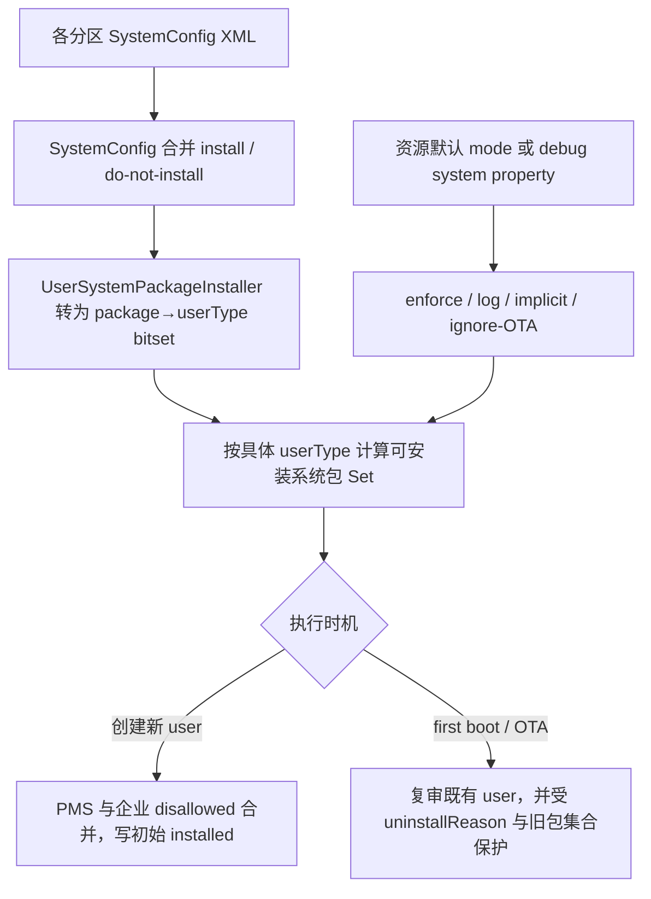
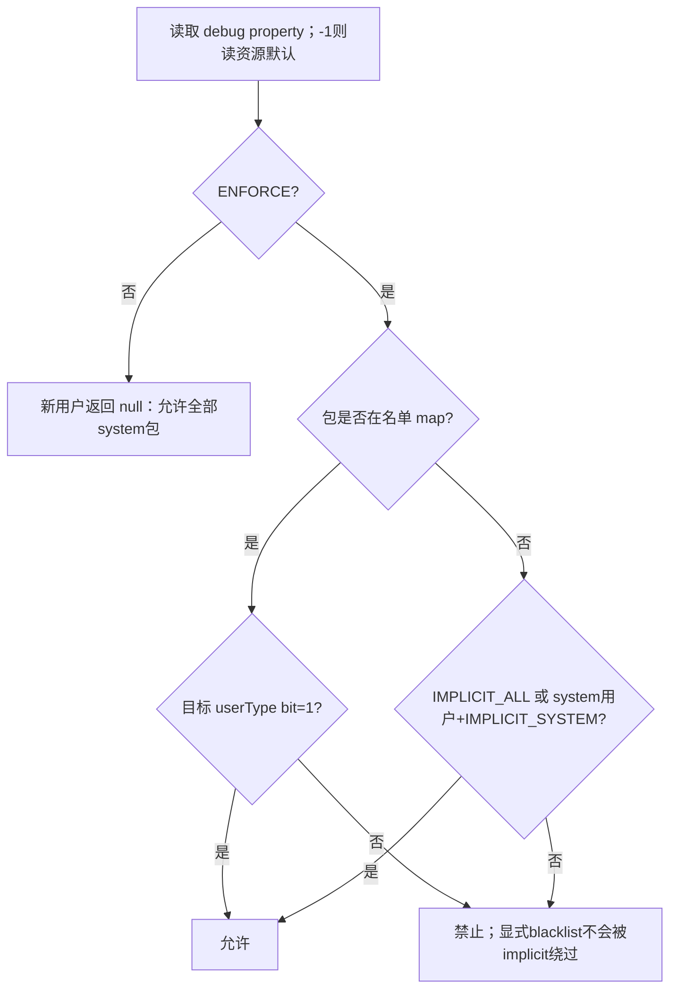
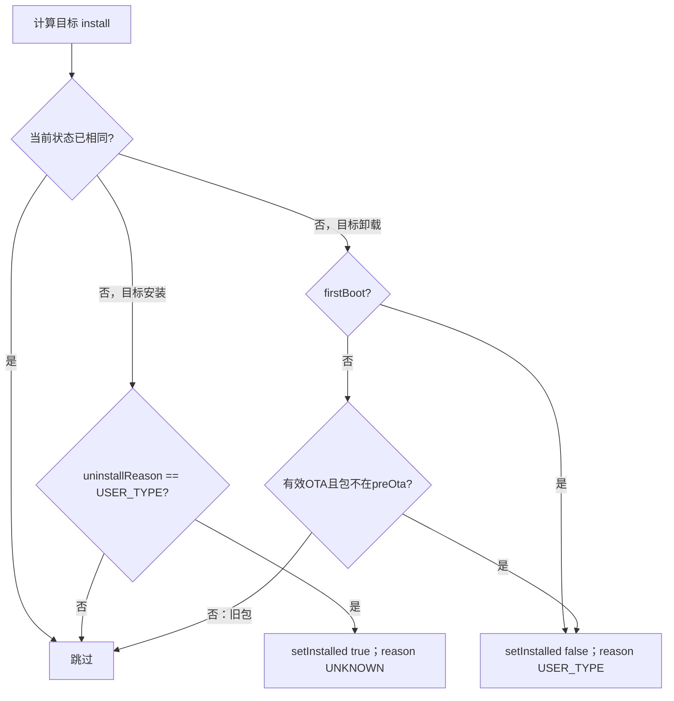

# 第 345 章 Android 企业 UserSystemPackageInstaller：用户类型系统包名单、模式位、SystemConfig、初始安装与 OTA 修复链

> 源码基线：Android 11 / API 30 / `android-11.0.0_r48`。本章承接第344章，研究在企业 required/disallowed 之前，更底层的“某类用户原则上能否初始获得某个系统包”。源码仍使用 whitelist/blacklist 旧术语，本文在解释中也称允许/禁止名单。仅在 macOS 上只读分析，不编译、不改系统属性。

## 1. 本章解决什么问题

为什么壁纸备份包只给 full user，不给 managed profile？为什么一个包不在任何配置中，在某些产品仍会自动安装？OTA 修改名单后，已有用户为何有时恢复包、有时又不追溯删除？答案集中在 `UserSystemPackageInstaller`。

## 2. 它与第344章是什么关系

第344章的 OverlayPackagesProvider 计算企业 provisioning 的 non-required/disallowed；本章按 user type 计算所有系统包的基础可安装集合。新用户创建时两者同时进入 PMS：user type allowlist 给出“可装”，企业 disallowed 再做更严格排除。

## 3. 新用户最终公式

对每个 PackageSetting，PMS 要求：它是 system app、不是 hidden-until-installed、不在企业 disallowed 中，并且 user type 集合为 null 或包含真实 packageName。任意一项失败，目标 user 的 installed 初始为 false。

## 4. 这里的“安装”仍是按用户状态

APK 已被系统镜像携带并由 PMS 全局扫描；Installer 决定某 user 的 `PackageSetting.installed`。它不从 `/system`、`/product` 或 `/vendor` 删除文件，也不意味着其他用户同步改变。

## 5. 配置入口不是 required_apps XML

本章使用 SystemConfig `<install-in-user-type>`，其子标签为 `<install-in>` 和 `<do-not-install-in>`。它与企业资源数组、privapp permissions、默认权限授予都不是同一套配置。

## 6. 三种包名单状态

某 manifest package 对某 user type 可以显式允许、显式禁止，或全局从未被任何 user type 条目提及。禁止覆盖允许；“完全未提及”的命运由 mode 的 implicit 标志决定。

## 7. 禁止与未提及不同

被 `<do-not-install-in>`明确提及的包会进入内部 map，即使位掩码最终是 0；未提及包根本不在 map。implicit 模式只放行“不在 map”的包，因此不会绕过显式 blacklist。

## 8. 两个执行时机

新 user 创建时，UMS 调 `getInstallablePackagesForUserType()`并交给 PMS；首次开机或系统升级时，PMS 调 `installWhitelistedSystemPackages()`复审已经存在的所有 user。普通每次开机不会全量改状态。

## 9. 为什么 OTA 要保守

名单更新可能想让新系统包不进入某类用户，但不能轻易拿走企业/用户过去一直使用的旧包。源码因此允许 OTA 按名单处理“镜像新包”，却不卸载升级前已经存在且已安装的旧包。

## 10. 主源码位置

核心文件是 `frameworks/base/services/core/java/com/android/server/pm/UserSystemPackageInstaller.java`；配置解析在 `frameworks/base/core/java/com/android/server/SystemConfig.java`；示例/平台清单在 `frameworks/base/data/etc/preinstalled-packages-platform*.xml`。

## 11. 总体数据流图



## 12. SystemConfig 从哪里读

SystemConfig 会扫描系统配置目录中的 XML；解析 switch 对 `install-in-user-type`注明任何允许提供 permission/config 的目录都可声明。具体产品可能从 system、vendor、product 等分区合并，不能只看 platform 示例文件。

## 13. 顶层 package 必填

`readInstallInUserType()`先读取 `package` attribute；为空时只写 warning 并返回，不建立条目。配置拼写错误不会在此直接阻止系统启动，却可能让 implicit 策略意外接管该包。

## 14. install-in 子标签

每个 `<install-in user-type="..."/>`把字符串加入 package 的允许 Set。相同值通过 `ArraySet`去重；它可以是具体 user type，也可以是 FULL、SYSTEM、PROFILE 三个 base type。

## 15. do-not-install-in 子标签

每个 `<do-not-install-in user-type="..."/>`进入独立禁止 map。后续 Installer 先合并允许位，再清除禁止位，所以不同 XML 文件之间的禁止同样能覆盖允许。

## 16. 未识别子标签如何处理

parser 对未知子标签写 warning，继续解析同一顶层块。它不把整个配置文件判为失败；因此 typo 可能只丢失某一条规则，日志审计很重要。

## 17. user-type 为空如何处理

install 或 do-not-install 子项缺少 user-type 时写 warning 并 continue。package 其他合法子项仍可进入 map，不是整包原子提交。

## 18. platform XML 是文档也是配置

`preinstalled-packages-platform.xml`前半段详细解释系统内建 user types、base type 和例子，后面真实配置如 SettingsProvider 对 SYSTEM/FULL/PROFILE 安装，WallpaperBackup 只对 FULL 安装。

## 19. FULL 不是某一个用户类型

Installer 调 UMS 判断每个具体 type 是否为 full subtype，把所有匹配 type 的 bit OR 到 FULL 位集合。SECONDARY、GUEST、DEMO 等可同时被一条 FULL 规则覆盖。

## 20. PROFILE 同样是基类

PROFILE 展开到所有 profile subtype，包括标准 managed profile 和产品自定义 profile type。若只想给某一种 profile，应直接写完整具体 user type 名称。

## 21. SYSTEM 也可能有多个 subtype

SYSTEM 指所有 `isUserTypeSubtypeOfSystem()`为真的类型，不应机械等同于数值 user 0。split/headless system user 产品模型仍应按 UserTypeDetails 属性理解。

## 22. 具体 type 与 base type可并用

同一 package 能允许 FULL，再禁止具体 GUEST；最终 GUEST 对应 bit 被清掉，其他 full subtype 保留。这是用宽泛基类加少量例外表达产品策略的主要方式。

## 23. 无效 user type 会怎样

`getTypesBitSet()`先查三种 base，再二分查找排序后的具体 type；两者都找不到就写 warning，该字符串不贡献任何 bit。若一个条目只有无效 type，允许结果可能变为 0 而被初步忽略。

## 24. 为什么先排序 user types

构造器把 UserTypeDetails map 的 key 复制到数组并排序。此后数组下标就是 bit 位置，`Arrays.binarySearch()`可稳定把 type 名映射为 mask；dump legend也依赖同一顺序解释数字。

## 25. bitset 为什么用 long

每个 package 用一个 long 表示在哪些 user type 安装，节省大量 Set 存储与交集开销。构造器只允许最多 `Long.SIZE`即64种 user type，超过就抛 `IllegalArgumentException`。

## 26. r48 位移实现的潜在边界

源码多处写 `(1 << idx)`而不是 `(1L << idx)`，左操作数是 int，idx≥32 时会按 int 位宽循环后再提升为 long。虽然现实产品远少于32种 type，但“只检查不超过64”与实现安全范围并不完全一致，定制大量类型时需源码测试验证。

## 27. SystemConfig 数据被 getAndClear

Installer 构造时调用 `getAndClearPackageToUserTypeWhitelist/Blacklist()`，方法返回原 map 并把 SystemConfig 字段替换成空 map。注释要求只调用一次，避免保留低效的 Set 结构并形成两个可变真相源。

## 28. 允许规则先转 bitset

遍历 allow map，将 type Set 展开成 bits；只有结果非0才 `put(package,bits)`。也就是说仅包含无效 type 的 allow 条目不会单凭自身留在结果 map。

## 29. 禁止规则后清 bits

对每个 deny package 算 `nonTypesBitSet`。若 package 已在结果中，就保存 `oldBits & ~denyBits`；这精确实现 blacklist 对任何来源 allow 的覆盖。

## 30. 纯 blacklist 也要保留 key

包从未 allow、但 denyBits 非0时，结果放入 `package→0L`。这样 implicit 模式通过 `containsKey()`知道它已被明确提及，不会把它当成“未知包”重新放行。

## 31. 全部被 blacklist 仍保留 key

若 package 原有 bits 被 deny 全清成0，map也不删除它。这是 OEM 完全禁止某个 AOSP 包的合法表达，0值与“map没有该 key”具有完全不同的策略含义。

## 32. android 包是强制例外

无论配置内容，最后执行 `result.put("android", ~0L)`，让 framework package 对所有 user type 必需。产品 blacklist 不能在这一步之后再次覆盖它。

## 33. 配置使用 manifest packageName

map key对应 `AndroidPackage.getManifestPackageName()`，而真正交给 PMS 创建逻辑的 Set 使用 `pkg.getPackageName()`。包重命名/迁移语义下两者可能不同，源码有意在判断后转换。

## 34. 普通 system package 判断

计算可安装集合时遍历 PackageManagerInternal 全部包，先跳过非system；再用 manifest name 查名单。普通 data app 不由本机制决定，它们也不会在新 user 创建时自动作为 system package安装。

## 35. 自动生成 RRO 的特殊判断

若系统包是 overlay 且 manifest name 以 `.auto_generated_rro_product__`或`.auto_generated_rro_vendor__`结尾，`shouldInstallPackage()`不用它自身名字，而改查 `overlayTarget`。

## 36. 为什么 RRO 跟随 target

自动生成 overlay通常是目标包资源的一部分。如果目标包不属于某 user type，却把 overlay 单独安装没有意义；反之 target 被允许时，overlay也应跟随，而无需每个构建生成名都写名单。

## 37. 只有特定后缀自动跟随

普通手写 RRO 不因 `pkg.isOverlay()`就自动采用 target；还必须命中两个自动生成后缀。产品不要把所有 overlay 都假设为目标包同策略。

## 38. 配置合并不是最后一个文件覆盖

SystemConfig 对同 package 的 Set 做累积，Installer再全局应用 deny 覆盖 allow。不同分区的规则组合成集合，不应按“vendor 文件最后读取，所以覆盖 platform 整块”理解。

## 39. 名单 map 的静态生命周期

注释说明 SystemConfig 状态只在 first boot 或 system update 更新；运行时改源 XML 不会像设置项那样即时重算。开发上常用 mock-upgrade 属性触发，但本学习环境只读，不实际设置。

## 40. 接下来进入 mode

名单只描述“被提及包”对哪些 type 允许；mode 决定是否 enforce、是否只记录问题、未提及包是否隐式允许、OTA是否忽略。它是可组合 bit flags，不是单选枚举。

## 41. mode 的两个来源

`getWhitelistMode()`先读持久 debug property `persist.debug.user.package_whitelist_mode`，默认 -1；只要不是 -1就覆盖设备资源，否则读 `Resources.getSystem().getInteger(config_userTypePackageWhitelistMode)`。

## 42. 0：DISABLE

mode 0 没有 enforce、log、implicit 或 ignore-OTA 位。新 user 的 getter返回 null，PMS解释为所有非hidden system package都允许；若 OTA 发生，复审仍可尝试撤销过去由 user-type 机制造成的未安装。

## 43. 1：ENFORCE

只设 enforce 时，未在 map 的系统包被隐式视为禁止；只有目标 type bit为1的包进入可安装 Set。配置必须接近完整，否则大量系统包可能缺失并触发严重日志。

## 44. 2：LOG

log 位用于报告未列入名单等问题，本身不启用安装限制。新 user仍得到 null allowlist；但 first boot/OTA 调用会先执行检查和日志，再根据 enforce/upgrade条件决定是否改状态。

## 45. 4：IMPLICIT_WHITELIST

当 enforce 与 bit4组合，任何完全不在 map 的 system package对所有 user type隐式允许；已在 map但目标 bit为0的包仍禁止。适合名单尚未覆盖所有系统包时渐进启用。

## 46. 8：IMPLICIT_WHITELIST_SYSTEM

当 enforce 与 bit8组合，完全未提及包只对 system subtype隐式允许，对其他 full/profile type仍隐式禁止。它为本地开发保住 user 0，同时要求次要用户/资料使用明确名单。

## 47. 16：IGNORE_OTA

bit16让 `isConsideredUpgrade = isUpgrade && !ignore`变为false，升级时不做 user-type 包状态复审。它不影响新 user 创建时 enforce 计算，也不能单独恢复已有包。

## 48. -1 与 -1000 不是普通 flags

-1表示使用设备默认，只用于 property fallback和shell参数；-1000是 shell 的“未指定/使用当前模式”哨兵。`modeToString()`对它们单独处理，不能拿负数直接按 bit flags解释业务。

## 49. AOSP r48 默认是13

`config.xml`默认写13，即1+4+8：enforce开启、所有未提及包隐式允许、system用户隐式允许。由于 bit4已经覆盖所有 user，bit8在这一组合中不再增加实际放行范围；显式 map/blacklist仍有效。

## 50. 常见组合的直觉

1是完整严格名单；5是 enforce+全用户 implicit，主要对“已明确配置的包”做 type差异；9是 enforce+只给system implicit；0关闭并允许OTA尝试恢复；16若从未启用可近似完全关闭且忽略OTA，具体仍应按各bit逐项判断。

## 51. mode 决策图



## 52. enforce 关闭为何返回 null

`getInstallablePackagesForUserType()`在非enforce直接返回 null，而不是返回所有包名。PMS用 null 作为“skipPackageWhitelist”哨兵，避免扫描构建大 Set，也清楚区分“全部允许”和“空集合全部禁止”。

## 53. 空 Set 与 null 的巨大差别

null表示此过滤器不限制；空 Set表示 enforce有效但没有任何 system package通过（后续仍有 `android`强制位，实际通常不至于完全空）。调用方绝不能把二者都当成“没有配置”。

## 54. implicitlyWhitelist 如何计算

它等于 `implicit-all`，或“implicit-system 且目标 userType 是 system subtype”。判断依据是 user type属性，不是传入的具体 userId；同类型用户得到同一基础 Set。

## 55. 每次 getter 都遍历系统包

拿到特定 type 的 manifest whitelist后，方法通过 PackageManagerInternal `forEachPackage()`遍历所有包，只加入 system 且 `shouldInstallPackage()`为真的真实 packageName。

## 56. userWhitelist 是目标 type 的显式位集合

`getWhitelistedPackagesForUserType()`遍历 package→bits map，只要 `userTypeMask & bits !=0`就加入 manifest name。0L key自然不会进入任何 type 的显式集合。

## 57. implicit 判断先要求 key 不存在

核心返回式是：

```java
(implicitlyWhitelist && !map.containsKey(policyName))
        || userWhitelist.contains(policyName)
```

这正是“未知包可隐式允许，明确禁止包不可”的源码证据。

## 58. 新 user 创建调用点

UMS完成 user XML初步记录、创建存储 key并准备CE/DE后，调用 `getInstallablePackagesForUserType(userType)`，再 `mPm.createNewUser(userId, set, disallowedPackages)`。

## 59. 与企业 disallowed 的交集关系

PMS先要求不在 disallowed，再要求 Set包含。等价于：`InitiallyInstalled = SystemPackages ∩ TypeAllowed - EnterpriseDisallowed - HiddenUntilInstalled`，其中 Set为null时 TypeAllowed视为全集。

## 60. blacklist 与企业 disallowed 是两套禁止

SystemConfig blacklist针对所有该user type，属于产品包布局；企业 disallowed针对具体 provisioning action和DPC配置。两者任一命中都能让新用户不安装，但配置来源、可观测性和OTA维护链不同。

## 61. uninstallReason 的作用

PMS新用户创建时，若包本可由基础条件安装、仅仅因为 type Set不包含而未安装，写 `UNINSTALL_REASON_USER_TYPE`；如果因非system、enterprise disallowed或hidden等其他原因，写 UNKNOWN。

## 62. 为什么要精确记录原因

未来 OTA 名单放开时，Installer只自动恢复“当初确实由自己按用户类型拿掉”的包。若用户主动卸载、企业策略排除或其他机制导致未安装，不应被一次系统升级擅自装回。

## 63. Enterprise disallowed 不记 USER_TYPE

回看 `shouldMaybeInstall`与`shouldReallyInstall`：只有 maybe为true但really为false才记 USER_TYPE。disallowed让maybe先为false，因此 uninstallReason UNKNOWN，后续本章机制不会把它当作自己可恢复的状态。

## 64. hidden-until-installed 也不记 USER_TYPE

它同样让 maybe为false。这类包等待显式安装触发，不应因user-type名单变化自动出现。

## 65. 初始创建对所有 system package写状态

`Settings.createNewUserLI()`遍历 PackageSetting，对有pkg对象的每个条目调用 `setInstalled(really,userId)`。新 user没有历史状态，所以这是建立按用户安装基线，而不是对已有用户做差异迁移。

## 66. first boot 复审为什么存在

system user在 UMS创建新用户逻辑之前已经存在；严格名单仍需在设备首次启动时作用于它。`installWhitelistedSystemPackages(firstBoot=true,...)`负责现有用户，包括user 0。

## 67. PMS 何时调用复审

PMS完成包扫描和相关初始化后，在发布 package service前调用私有 `installWhitelistedSystemPackages()`，由 UMS转给 Installer。若返回true，PMS调度写所有用户 package restrictions和全局settings。

## 68. ordinary boot 不复审状态

方法仍先取得mode并检查配置问题，但若既不是有效upgrade也不是firstBoot，随即return false，不遍历用户改installed。这避免每次开机因临时配置/状态差异改变用户环境。

## 69. first boot 非enforce直接返回

首次启动若未启用 enforce，检查之后return false，不需要把“默认已安装”的系统包逐个重复写一遍。upgrade则不同，因为关闭enforce可能需要撤销旧enforce留下的USER_TYPE未安装状态。

## 70. 复审遍历哪些用户

循环 `mUm.getUserIds()`，为每个现存user按其 UserInfo.userType取得 allowlist，再遍历每个 PackageSetting。不是只处理当前前台用户，也不是只处理新创建用户。

## 71. 复审只处理 system package

pkg为空或 `!pkg.isSystem()`直接跳过。名单里误写普通data app不会通过这条链安装/卸载，配置检查会把“存在但非system”列为warning。

## 72. 目标 install 布尔值

当 allowlist为null或包含真实包名，且 package不是hidden-until-installed时，目标为installed；否则目标为uninstalled。企业 OverlayPackagesProvider不参与这次全局first boot/OTA复审。

## 73. 状态相同直接跳过

若当前 `pkgSetting.getInstalled(userId)==install`，不改reason也不写日志。名单匹配不代表每次OTA都会刷新该包的uninstallReason。

## 74. 状态不同还要过保护门

`shouldChangeInstallationState()`对“准备安装”和“准备卸载”采用不同规则。目标布尔不等于一定执行，这是很多粗略文章最容易漏掉的一层。

## 75. 准备安装的唯一允许原因

只有当前 uninstallReason等于 `UNINSTALL_REASON_USER_TYPE`才返回true。名单机制尊重用户卸载和其他策略，不把所有未安装系统包强制复活。

## 76. 恢复后 reason 重置

真正setInstalled(true)后写 `UNINSTALL_REASON_UNKNOWN`。这表示user-type导致的未安装已被撤销；以后再看状态不能继续把旧reason当历史审计记录。

## 77. first boot 准备卸载

目标为false时，只要 `isFirstBoot`就允许状态变化。这样预先存在的system user也能在出厂首次启动建立正确user-type包布局。

## 78. OTA 准备卸载

只有 `isUpgrade && !preOtaPkgs.contains(pkgName)`，即包不在升级前包集合中，才允许卸载。因此旧的已安装系统包即使现在被blacklist，也不会被这条OTA链追溯拿走。

## 79. preExistingPackages 从哪里来

PMS在升级扫描前后维护 `mExistingPackages`，它来自原Settings中已有PackageSetting名字；调用复审时作为pre-Ota集合传入，之后清空。这里不是 ManagedProvisioning 的 per-user serial XML快照。

## 80. 两套 OTA 差分不要混淆

本章用PMS全局 `mExistingPackages`判断镜像新包；第344章用ManagedProvisioning私有的“当前system apps按user快照”判断企业用户新增系统包。两者存储位置、生命周期与删除执行者不同，虽然都贯彻“旧包不追溯删”。

## 81. 新系统包在 OTA 中的处理

若它不应安装到某user type，当前可能因扫描默认状态为installed，复审发现目标false且preOta没有该包，于是setInstalled(false)并记USER_TYPE。它对其他允许的user type可保持installed。

## 82. 旧包新增 blacklist 的处理

目标虽变false，但preOta包含它，`shouldChangeInstallationState()`返回false，原installed状态保留。新建用户会遵循新blacklist，旧用户被grandfather，因此同类型不同世代用户可能暂时不同。

## 83. 旧包新增 allow 的处理

若旧用户当前未安装且reason正是USER_TYPE，目标变true便可恢复；是否是OTA新包不重要。若reason为USER、UNKNOWN或其他值，则保护门拒绝自动安装。

## 84. 关闭 enforce 的“撤销”语义

mode 0时 getter返回null，升级复审把目标视为安装全部非hidden系统包；以前因USER_TYPE未安装的包可恢复。它依旧不会恢复其他原因的未安装，故“关闭功能”不等于所有用户状态完全回到出厂。

## 85. ignore-OTA 的持久影响

若设置bit16，升级被视为无效，不进入复审；过去因USER_TYPE未安装的旧包即使名单已允许，也继续未安装。新创建user仍按当前enforce与implicit flags计算，可能与老用户不同。

## 86. firstBoot 与 ignore-OTA 可同时存在

ignore位只修改 `isConsideredUpgrade`，不屏蔽 firstBoot。若同时是firstBoot且enforce，仍会复审；不能把bit16解释为“永远不运行Installer”。

## 87. upgrade 时非enforce仍可能运行

源码只对“firstBoot且非enforce”提前return；有效upgrade即便enforce关闭仍遍历，目的是撤销过去按名单未安装的包。这个细节说明mode 0和mode16行为并不相同。

## 88. 方法返回值不是“发生过修改”

只要进入用户/包复审循环，末尾就return true，即使每个状态都相同。PMS因此仍可能调度写restrictions/settings。它更接近“执行了复审，需要安排持久化”，不是精确changed bit。

## 89. 状态写入与内核映射

复审直接在 PackageSetting上setInstalled/setUninstallReason，随后PMS统一调度持久化。新user创建链还会在未安装时写kernel mapping；两条路径的外围持久化细节不同，不应只截同一setInstalled行判断完整副作用。

## 90. OTA 保守策略的代价

产品修复了一条错误allow规则后，已存在用户的旧包不会自动卸载；而新用户立即按新规则。兼容性得到保护，但安全/合规性若要求追溯移除，需要另一个明确、可审计且处理用户数据的迁移机制。

## 91. 首次启动与 OTA 状态图



## 92. 配置检查何时运行

`installWhitelistedSystemPackages()`一开始总调用 `checkWhitelistedSystemPackages(mode)`；只有既无log又无enforce才完全跳过检查。检查与真正是否firstBoot/upgrade是两个决策，普通boot在相应mode下也可能产生日志。

## 93. warnings 检查什么

对map中所有曾被allow/最终全deny仍保留的package，检查它是否不存在、存在但非system、或是自动生成RRO。它们说明配置条目可疑，却不等于系统包遗漏名单。

## 94. 为什么自动生成 RRO 是 warning

这类包策略应跟随overlay target，显式把生成包名写名单既脆弱又多余。生成后缀可能随构建变化，直接配置会让名单与实际镜像不稳定。

## 95. errors 检查什么

遍历所有system package的manifest name，若完全不在名单keySet且不是自动生成RRO，就报告“not whitelisted for any user types”。它检查的是名单覆盖完整性，而非某个具体type是否合理。

## 96. implicit-all 为什么可能跳过 errors

若开启implicit-all且未开启log，未知包按设计会对所有人放行，代码直接不做遗漏errors。若同时开启log，仍报告这些潜在缺口，便于逐步完善配置。

## 97. wtf 与 error 的选择

存在遗漏时，`doWtf = !isImplicitWhitelistMode(mode)`；严格非implicit模式会 `Slog.wtf`，implicit模式只 `Slog.e`。这是严重日志，不等同于Java抛异常或立即停止开机。

## 98. 名单问题 shell 命令

UserManager shell支持 `report-system-user-package-whitelist-problems`，可选 verbose、critical-only和指定mode。它调用同一检查逻辑，适合在设备构建验证阶段审计；本macOS源码学习只定位实现，不实际连接设备。

## 99. critical-only 如何处理log位

dump时若要求critical-only，会把mode中的LOG位清掉后再计算errors，排除仅因log模式显示的问题。DEVICE_DEFAULT和NONE哨兵也会先解析为资源默认或当前mode。

## 100. dumpsys 中的主表

Installer dump打印当前mode含 enforced/logged/implicit/ignore OTAs标签、数字到user type的legend，以及每个package对应的type索引。读bitset时必须和同一次dump的legend配对。

## 101. 为什么 dump 显示 manifest name

内部map就是policy manifest name到bits，真正可安装Set才转换成实际packageName。若包经历rename，dump与PackageManager查询名看起来不同并不一定是配置没有命中。

## 102. 新用户缺包的排查四步

先确认mode是否enforce；再看package是否system/hidden；然后按manifest name与RRO target规则查type bit和implicit；最后查第344章企业disallowed。不要一看到installed=false就只改一份XML。

## 103. 老用户与新用户不一致的排查

确认是否刚发生OTA、包是否在preOta、老用户uninstallReason以及ignore-OTA位。旧已安装包grandfather、旧非USER_TYPE卸载包不恢复，都是有意保护，不一定是状态损坏。

## 104. 配置更名的风险

名单以字符串绑定manifest package/user type。包改manifest name、user type重命名或自定义type未被UserTypeFactory加载，都可能让旧规则失效；implicit模式会决定失效后是放行还是拒绝。

## 105. blacklist 的静态安全检查

应计算每个package allow bits减deny bits，并特别标出0L、android强制覆盖、无效type、仅blacklist未allow以及base type与具体type冲突。只肉眼看单文件无法发现跨分区deny。

## 106. mode 的产品安全检查

验证资源值与debug property实际优先级；量产设备不应意外留一个persist.debug override改变策略。还要明确13这类组合中implicit-all会使“完整名单”检查与严格性弱化。

## 107. 最重要的单元测试

覆盖deny胜allow、纯deny key阻止implicit、FULL/PROFILE/SYSTEM展开、具体type例外、android全type、自动RRO跟target、manifest name到真实packageName转换，以及invalid type不产生bit。

## 108. 最重要的OTA测试

构造preOta old/new包与不同uninstallReason，验证：旧installed黑名单包不卸载，新黑名单包卸载；USER_TYPE旧未装包可恢复，用户/其他原因未装包不恢复；ignore-OTA不复审；mode0有效OTA可撤销旧USER_TYPE状态。

## 109. 与第344章的优先级总表

user-type deny先决定基础Set；企业disallowed在PMS的shouldMaybeInstall中优先于Set；hidden-until-installed也可排除；OTA时两套机制各自只处理“新包”并保护历史，但一套用PMS preOta全局集合，另一套用ManagedProvisioning per-user快照。

## 110. 术语迁移时要忠于版本

新Android版本可能改用allowlist/denylist命名、结构或模块位置。本文严格描述r48的 whitelist/blacklist API与字段；阅读其他版本应重新搜索调用点，不能只替换术语就假定行为未变。

## 111. 本章心智模型

把它看成“产品镜像中的系统包 × 用户类型”矩阵：SystemConfig生成显式矩阵，mode填充未知格，RRO继承target，android强制全1；新user直接采用矩阵，first boot建立既有user基线，OTA只修复USER_TYPE缺失并禁止新镜像包。

## 112. macOS 只读练习一：解析一份矩阵

打开 `frameworks/base/data/etc/preinstalled-packages-platform.xml`，把 SettingsProvider 与 WallpaperBackup 写成“package→SYSTEM/FULL/PROFILE”表；再结合本源码中的标准UserTypeDetails，说明managed profile为何命中前者而不命中后者。只读，不修改XML。

## 113. macOS 只读练习二：手算 mode

阅读 `config_userTypePackageWhitelistMode`及五个bit getter。假设包p完全未提及，分别计算mode 1、5、9、13下system subtype与managed profile是否安装；再假设p存在0L key，重算并解释implicit为何不放行。

## 114. macOS 只读练习三：追新用户最终条件

用 `rg -n "getInstallablePackagesForUserType|shouldMaybeInstall|UNINSTALL_REASON_USER_TYPE" frameworks/base/services/core/java/com/android/server/pm`串起UMS、Installer、PMS。画出system、hidden、enterprise disallowed、type Set四道门，并标出哪一种失败才记录USER_TYPE。

## 115. macOS 只读练习四：推演 OTA

设升级前包集合 `{oldA,oldB}`，升级后新增`newC`；oldA现已blacklist但installed，oldB从旧名单放开且未安装，reason分别尝试USER_TYPE与USER，newC对该type禁止。逐行执行 `shouldChangeInstallationState()`，写出每个包最终状态，不运行mock-upgrade。

## 116. 本章检查题

为什么0L key不等于没有key？为什么mode0与mode16关闭效果不同？为什么OTA能把过去因USER_TYPE未装的旧包恢复，却不能把新blacklist的旧已安装包卸载？为什么enterprise disallowed不会被本章OTA恢复？

## 117. 复读修正一：名单不是只在创建时使用

初读UMS调用点容易得出“只决定新用户”。复核PMS启动链后应补充：first boot负责既有system user建立基线，OTA负责新镜像包和可安全恢复的USER_TYPE状态；普通boot则不做状态复审。

## 118. 复读修正二：enforce关闭不等于完全不执行

新user确实在非enforce时拿到null并安装全部system包；但有效OTA仍可能进入循环，用all-packages目标恢复过去因USER_TYPE未安装的包。只有ignore-OTA等条件让升级复审也跳过，因此不能把mode0简单写成“类完全不工作”。

## 119. 复读修正三：OTA不是双向全量同步

OTA安装侧只恢复reason为USER_TYPE的包；卸载侧只处理preOta不存在的新包。它刻意不把已有用户强行变成当前矩阵的精确副本，这种非对称性正是保护用户选择与升级兼容性的关键。

## 120. 本章结论与下一章

现在可以完整解释新用户系统包来源：SystemConfig矩阵和mode生成type allowlist，PMS再叠加hidden与企业disallowed；已有用户则由first boot/OTA保守复审。下一章继续研究 user type 定义本身：`UserTypeFactory`、`UserTypeDetails`、`config_user_types.xml`、默认flags/restrictions、maxAllowed/per-parent、badge与自定义类型如何成为本章bitset和UMS创建校验的基础。
