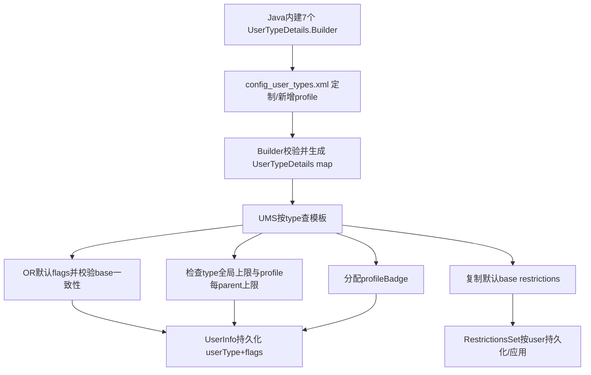
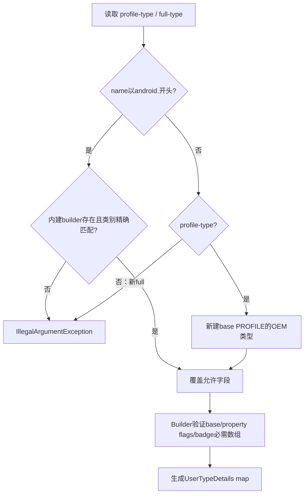
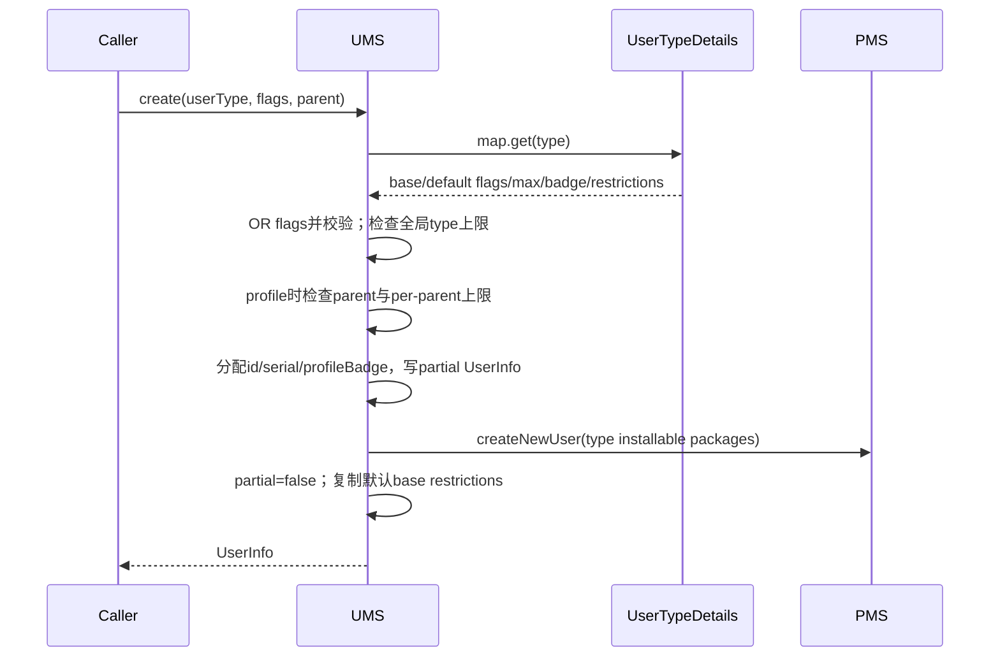

# 第 346 章 Android 企业 UserTypeFactory / UserTypeDetails：用户类型定义、定制、Flags、限制、数量、Badge 与创建校验链

> 源码基线：Android 11 / API 30 / `android-11.0.0_r48`。第345章把 user type 当成系统包矩阵的列，本章打开这列本身：类型名从哪里来、怎样绑定 FULL/PROFILE/SYSTEM 基类、怎样限制数量和赋予默认 restriction/badge。AOSP 配置明确警告自定义能力在 r48 测试有限，产品定制必须谨慎。仅做 macOS 源码只读学习。

## 1. 为什么从 flags 升级到 user type

旧代码用 `FLAG_GUEST`、`FLAG_MANAGED_PROFILE` 等零散位推断用户类别，组合容易非法且难扩展。Android 11 以稳定字符串 `userType`描述语义类别，同时保留 flags 表示三种基础性质和运行/属性状态。

## 2. UserTypeDetails 是类型模板

它不是某个用户实例，而是“这一类用户”的设备级定义：名称、base type、默认 property flags、全局/每parent数量上限、默认restrictions和profile badge资源。

## 3. UserInfo 是用户实例

每个真实 user有 id、serial、flags、`userType`字符串、profileGroupId、profileBadge等。创建时从 UserTypeDetails复制默认flags/restrictions，但之后实例状态与模板可分别演化。

## 4. 三种 base property

UserInfo只允许四种基础组合：SYSTEM、SYSTEM|FULL、FULL、PROFILE。它们分别对应headless user0、普通人类user0、非profile人类用户和挂在parent下的profile。

## 5. type 与旧属性flag并存

managed profile的模板是base PROFILE再加默认 `FLAG_MANAGED_PROFILE`；guest是base FULL再加FLAG_GUEST。前者决定结构类别，后者保留兼容API所需属性。

## 6. Factory 的职责

`UserTypeFactory.getUserTypes()`先创建七个AOSP Builder，再读取系统资源 `config_user_types.xml`修改或新增允许的类型，最后逐个build成不可变UserTypeDetails map。

## 7. UMS 何时加载

UserManagerService构造早期执行 `mUserTypes = UserTypeFactory.getUserTypes()`，随后读取用户XML并构造 UserSystemPackageInstaller。一次 system_server生命周期内使用这张map，不在每次创建时重解析资源。

## 8. 七个内建类型

r48定义 PROFILE_MANAGED、FULL_SYSTEM、FULL_SECONDARY、FULL_GUEST、FULL_DEMO、FULL_RESTRICTED、SYSTEM_HEADLESS。它们覆盖标准手机、split/headless system user、访客、演示、受限用户和工作资料。

## 9. config XML 默认是空的

AOSP `frameworks/base/core/res/res/xml/config_user_types.xml`根节点内没有真实定制条目，长注释给出语法和风险警告。OEM可通过资源定制替换其内容；裸AOSP使用Java Builder默认值。

## 10. 本章源码入口

读 `UserTypeFactory.java`看默认与XML解析，读 `UserTypeDetails.java`看不可变模型和Builder验证，最后读 UMS 的创建核心、`canAddMoreProfilesToUser()`、badge getters和user version 9迁移。

## 11. 类型定义到用户实例总图

## 12. Managed profile 默认模板

名称是 `android.os.usertype.profile.MANAGED`，base为PROFILE，默认property flag为MANAGED_PROFILE，每个parent最多1个，并配置企业公文包图标、plain/no-background badge、三组label和亮/暗色。

## 13. Managed profile 默认 restrictions

Factory显式 `setDefaultRestrictions(null)`，即类型模板本身不加base restriction。工作资料的隔离与企业策略来自profile结构、PackageManager、DPM等更多机制，不能用“默认restriction为空”推断它无管控。

## 14. Full secondary 默认模板

base为FULL，类型自身数量无限，默认restriction禁止outgoing calls与SMS。这里“无限”只表示type-specific hard limit，没有绕过设备总体max users、存储或策略限制。

## 15. Guest 默认property flags

base为FULL，并带FLAG_GUEST；若资源 `config_guestUserEphemeral=true`还默认带FLAG_EPHEMERAL。guest是否临时因此是产品资源决定，不应只根据“guest”名称断言一定销毁。

## 16. Guest 默认数量

`mMaxAllowed=1`，即设备上最多一个未进入排除状态的FULL_GUEST。旧guest若已标 `guestToRemove`或正在removing，可不计入类型数量，为替换会话留出空间。

## 17. Guest 默认 restrictions

先继承secondary的禁止通话/SMS，再加入禁止配置Wi-Fi和禁止未知来源安装。UMS启动时把它复制到可由 `setDefaultGuestRestrictions()`修改并持久维护的guest默认Bundle。

## 18. Demo 默认模板

base FULL、property flag DEMO、type上限无限、无默认restriction。实际demo能力还受全局demo mode、DevicePolicy和Setup流程控制，模板只提供最底层类型属性。

## 19. Restricted 默认模板

base FULL、property flag RESTRICTED、type上限无限、模板restriction为null。注释明确 `createRestrictedProfile()`另有hardcoded restrictions，说明某类用户的全部行为不一定都在UserTypeDetails声明。

## 20. Full system 模板

base直接是SYSTEM|FULL，没有额外property flags。它代表普通非headless设备的user0：既是特殊系统用户，也是可供人类交互的full user。

## 21. Headless system 模板

base仅SYSTEM，不是FULL，代表headless user0只承担系统管理根，首个人类用户另建为full user。许多“能否有profile/能否切换”判断因base差异而改变。

## 22. Builder 的默认值

未设置时，maxAllowed和maxAllowedPerParent都是-1无限、property flags为0、restrictions为null、enabled=true、label和badge资源为0/null。name与base type必须显式设置。

## 23. enabled 在 r48 未接线

UserTypeDetails保存mEnabled并提供 `isEnabled()`，但源码TODO写明currently unused。配置parser也没有读取enabled属性，所以不能靠它在r48禁用一种用户类型。

## 24. label 同样未接线

mLabel与getter存在，Factory只对managed profile设0，TODO说明未使用。用户设置页实际显示名称还涉及其他资源/前端逻辑，不应把这个字段当完整UI名称来源。

## 25. base type 构建校验

Builder只接受FULL、PROFILE、SYSTEM或FULL|SYSTEM四种精确值。0、PROFILE|FULL、PROFILE|SYSTEM等组合在 `createUserTypeDetails()`中触发 `Preconditions.checkArgument`。

## 26. property flags 的禁止集合

默认property flags不能包含PRIMARY、ADMIN、INITIALIZED、QUIET_MODE、FULL、SYSTEM或PROFILE。这些要么是实例/运行状态，要么属于base type，不能由类型属性混入。

## 27. 允许哪些默认property flags

GUEST、RESTRICTED、MANAGED_PROFILE、EPHEMERAL、DEMO等可作为模板默认属性。DISABLED虽然不在forbiddenMask中技术上可传，但XML不提供flags定制入口，内建模板也不这样做；产品不能据此假设公开支持任意组合。

## 28. getDefaultUserInfoFlags 做什么

返回 `mDefaultUserInfoPropertyFlags | mBaseType`。UMS创建时把结果OR进调用者flags，确保type必需的base/property位无法通过少传flags绕过。

## 29. 调用者flags仍可加实例属性

例如DevicePolicy创建user可请求EPHEMERAL/DEMO等，UMS再与type默认合并并做一致性检查。模板不是完整最终flags，运行策略如force-ephemeral也会随后补位。

## 30. checkUserTypeConsistency 的范围

UMS检查guest/demo/restricted/profile标志至多一个，并检查PROFILE与FULL、PROFILE与SYSTEM互斥。它避免明显结构冲突，但不是每一种语义组合的完备规则引擎。

## 31. SYSTEM 用户不可动态创建

即使传入FULL_SYSTEM或SYSTEM_HEADLESS有效type，默认flags包含SYSTEM，创建核心明确拒绝“indicated SYSTEM user”。这两种模板用于初始化/迁移user0，不是创建第二个system user。

## 32. system user 默认 restrictions 另走资源

UserTypeDetails文档明确：类型default restrictions不适用未正式创建的SYSTEM user。fallback创建user0时读取 `config_defaultFirstUserRestrictions`，dump system type时也展示这份资源。

## 33. restriction Bundle 的防别名

`getDefaultRestrictions()`通过UserRestrictionsUtils.clone返回副本；`addDefaultRestrictionsTo()`merge到调用者Bundle。消费者不应拿到内部对象后原地篡改类型模板。

## 34. default restrictions 是创建时默认

XML注释明确：更新type定义会影响运行时模板属性，但不会把新default restrictions追加入既有用户。它们只在用户创建时复制到base restrictions。

## 35. XML定制的根节点

parser要求文档根为`user-types`。其一级子元素只识别 `profile-type`与`full-type`；未知元素写warning并skip整个tag。

## 36. name 是唯一必填属性

缺name的type条目写warning并跳过。名称是map key和持久UserInfo.userType值，必须在产品生命周期中保持稳定。

## 37. android. 前缀被保留

若name以`android.`开头，只能修改Factory已经提供的AOSP type。找不到同名builder就抛IllegalArgumentException，OEM不能伪造一个新“android.*”类型。

## 38. 修改AOSP类型还要元素类别一致

`profile-type`只能修改base精确为PROFILE的内建类型；`full-type`只能修改base精确为FULL的内建类型。类别写错会抛异常，而不是自动转换base。

## 39. 为什么system类型不能这样改

FULL_SYSTEM的base是FULL|SYSTEM，不等于精确FULL；HEADLESS base是SYSTEM。它们既不满足profile-type也不满足full-type校验，正符合XML注释“system users cannot be customized here”。

## 40. OEM新类型只允许profile

非android.名称若元素为profile-type，Factory创建新Builder并固定base PROFILE；若是full-type则直接抛“Creation of non-profile user type is not currently supported”。r48不能用此XML自由创建新full user类别。

## 41. 自定义profile不是managed profile别名

`isManagedProfile()`按名称调用 `UserManager.isUserTypeManagedProfile(mName)`，只有标准MANAGED名为真。新OEM profile虽base PROFILE，却不会自动获得所有专门针对managed profile写死的feature、DPM或数量逻辑。

## 42. profile可定制的属性

一级属性支持max-allowed-per-parent、icon-badge、badge-plain、badge-no-background；子元素支持default-restrictions、badge-labels、badge-colors、badge-colors-dark。

## 43. full type可定制什么

parser对full-type不处理profile专属属性，子元素只认可default-restrictions。XML文档也明确full user目前只允许改默认限制，不能改maxAllowed、base或flags。

## 44. XML不能改全局 maxAllowed

虽然Builder有setMaxAllowed，Factory parser没有对应attribute。内建guest=1等全局type上限在r48不能通过config_user_types.xml任意覆盖。

## 45. XML不能改默认flags

parser同样不暴露setDefaultUserInfoPropertyFlags。OEM定制只能在源码级新增Builder逻辑，不能在这份资源中把custom profile直接标成guest/demo/ephemeral。

## 46. default-restrictions 是覆盖而非叠加

遇到子元素时读出新Bundle并 `builder.setDefaultRestrictions()`，替换内建默认。若想保留secondary原有no_sms/no_outgoing_calls并增加一项，XML必须把所有希望保留的限制都写全。

## 47. 不写元素才保留默认

若条目只改badge或数量，未出现default-restrictions，Builder保留Java默认Bundle。空的 `<default-restrictions/>`则显式替换成空集合，两者语义不同。

## 48. 整数解析失败的强度

max-allowed-per-parent用`Integer.parseInt`；NumberFormatException被记录后重新抛。外层只catch XML parser/IO异常，不catch运行时NumberFormatException，因此坏整数可能让UserManagerService构造失败，而非安静使用默认。

## 49. resource属性无效时

只要属性文本存在，`getAttributeResourceValue(..., ID_NULL)`取不到就把0交给Builder，可能清掉原badge资源。定制时资源引用拼写错误不一定立即以明确配置异常失败。

## 50. typeName.intern 的细节

Factory调用`typeName.intern()`却未把返回值赋回；自定义name不因此保证引用就是intern对象。但map与后续判断使用String.equals，创建入口验证后又正确 `userType = userType.intern()`，通常不影响语义，只是源码细节。

## 51. XML定制决策图

## 52. Badge 的三种图形资源

iconBadge用于叠加到应用图标；badgePlain用于独立badge；badgeNoBackground用于无背景变体。managed profile默认三者齐备，但Builder的强制校验并未逐项要求plain/no-background非0。

## 53. hasBadge 的唯一开关

只要mIconBadge不是Resources.ID_NULL就返回true。即使plain/no-background缺失，类型仍被视为badged；这解释了为什么产品资源完整性测试不能只依赖Builder是否成功。

## 54. Builder强制哪些badge数据

hasBadge时要求badgeLabels非null且非空、badgeColors非null且非空，否则checkArgument失败。dark colors可缺失；缺失时构造器把light colors数组作为dark数组。

## 55. badge-labels/colors 数组解析

parser只读取子 `<item res="..."/>`；未知子元素写warning并skip，缺res的item被忽略。若最后数组为空且iconBadge有效，build阶段失败。

## 56. 颜色存的是resource ID

`getBadgeColor()`返回带@ColorRes注解的ID，不是已经解析的ARGB值。调用UI需要再通过Resources解析，文档注释与部分方法文字不要混淆。

## 57. profileBadge 是数组索引

每个UserInfo持久保存profileBadge，用它选择label/light color/dark color。相同parent下同一种type的多个profile应尽量获得不同index，便于视觉区分。

## 58. Badge index 怎样分配

创建badged且有parent的用户时，UMS调用 `getFreeProfileBadgeLU(parentId,userType)`，收集同type、同profileGroup且未removing用户占用的索引，从0开始找最小空位。

## 59. 不同profile type可复用index

占用集合要求 `ui.userType.equals(userType)`，所以同一parent下不同custom profile type都可以拿profileBadge=0；它们本就有各自badge资源数组，不需要全局唯一。

## 60. removing profile释放index

正在删除的user被排除，新的同type profile可复用其index。若旧profile UI/回调尚未完全消失，短窗口内可能看到相同颜色的两代对象，身份仍应以userId/serial区分。

## 61. 数组长度不够怎样处理

getBadgeLabel/Color使用 `Math.min(index,length-1)`，超出后重复最后一个样式，不抛越界。max-per-parent可大于颜色数量，但后面的profiles将共享最后颜色/label。

## 62. 负index怎样处理

数组为空/null或badgeIndex<0返回ID_NULL；正常创建从0分配。损坏/手工迁移的负值不会数组越界，而会失去对应资源。

## 63. dark colors 的fallback

若dark数组缺失、为空或index<0，getter回退 `getBadgeColor(index)`；构造器通常已把null dark替为light数组。XML提供较短dark数组时，仍按dark最后一项clamp，不逐项回退light。

## 64. Badge getter 有跨用户权限门

UMS查询另一个profile group的badge资源会走manage/interact权限检查；同组交互可较宽。badge是UI元数据，但仍与用户身份相关，不是任意App无条件跨user读取。

## 65. type name 持久化在哪里

UMS每用户XML根标签写 `type="userInfo.userType"`，同时写flags和profileBadge。开机读取后intern type字符串，再构造UserInfo。

## 66. 为什么flags也要持久化

type提供模板和分类，但ADMIN、INITIALIZED、DISABLED、QUIET_MODE、EPHEMERAL等可在实例生命周期变化；仅靠type无法恢复这些状态。base/property默认也保留在flags供旧API与快速判断。

## 67. 配置更新不会改持久type字符串

既有用户仍引用原name查新mUserTypes map。如果OEM删除/改名一个已有custom type，getUserTypeDetails会返回null，许多类型能力、badge和包矩阵失去依据；稳定命名和升级迁移是OEM责任。

## 68. user version 9 的迁移

旧用户没有userType时，UMS按flags转换：SYSTEM+FULL→FULL_SYSTEM，SYSTEM-only→SYSTEM_HEADLESS，其余调用 `UserInfo.getDefaultUserType(flags)`映射标准类别。

## 69. 非法旧flags 会阻止迁移

`getDefaultUserType()`抛IllegalArgumentException时被包装为IllegalStateException；源码TODO讨论delete/crashloop。框架不凭猜测选择一个类型，因为错误分类会破坏隔离与包布局。

## 70. 迁移后还要检查设备定义

得到type name后必须在mUserTypes存在，否则同样IllegalStateException。注释明确OEM自定义类型的升级逻辑由OEM负责，AOSP只识别标准旧flag组合。

## 71. 迁移会OR当前默认flags

找到UserTypeDetails后执行 `flags |= getDefaultUserInfoFlags()`并写回用户XML。它补齐base/legacy property位，但不会清除旧的额外flags。

## 72. 后续改模板flags不会自动迁移

XML本就不能改flags；源码产品若改变Builder默认，只有明确user version升级逻辑才可靠更新既有UserInfo。创建时默认与既有实例持久flags是两张账。

## 73. fallback user0 如何选type

用户列表缺失需要单用户fallback时，根据 `UserManager.isHeadlessSystemUserMode()`选择SYSTEM_HEADLESS或FULL_SYSTEM，OR模板默认flags，再创建id0 UserInfo。

## 74. user0额外实例flags

fallback基础flags还含SYSTEM、INITIALIZED、ADMIN、PRIMARY；headless模式的合法性/primary语义有其他初始化规则。可见类型模板只贡献结构base，系统首用户还需特殊启动属性。

## 75. 创建入口先查type是否存在

`mUserTypes.get(userType)`为null时记录错误并返回null，不回退为FULL_SECONDARY。陌生类型不能仅靠传一组看似合法flags创建。

## 76. 合并默认flags后再校验

UMS先 `flags |= userTypeDetails.getDefaultUserInfoFlags()`，再check consistency。这样调用者无法通过漏传PROFILE把profile type伪装full，也会暴露调用者额外flags与模板冲突。

## 77. force ephemeral 在类型校验之后

通过type/base检查且确认非SYSTEM后，UMS在mUsersLock内根据全局force策略补EPHEMERAL。force不是UserTypeDetails属性，却能覆盖所有后续新非system用户类型。

## 78. pre-created eligibility 依赖type属性

UMS只对适合预创建的非profile等类型复用预建user，判定使用UserTypeDetails。custom profile即使结构合法，也不会走无parent的pre-created full user优化链。

## 79. 全局 type 数量上限

`canAddMoreUsersOfType()`读取mMaxAllowed；-1立即允许，否则统计同userType的存活实例。创建profile也先经过这个全设备上限，再经过per-parent上限。

## 80. 类型计数排除谁

统计排除guestToRemove、mRemovingUserIds和preCreated；其他尚未标removing的partial用户可能仍计数。失败创建/清理窗口因此可能暂时占用名额，直到状态收敛。

## 81. 设备总体用户上限是另一道门

非guest、非profile、非demo full user还要检查 `UserManager.getMaxSupportedUsers()`；guest/profile/demo走各自规则。type无限不能绕过所有系统资源限制。

## 82. profile 每parent上限

isProfile时调用 `canAddMoreProfilesToUser(userType,parentId,false)`，读取mMaxAllowedPerParent并统计该parent profile group中同type数量。标准managed profile默认1。

## 83. Parent 必须存在且canHaveProfile

公开检查先取parent UserInfo，再调用 `canHaveProfile()`；headless/system/profile等组合有自己的资格。仅提供一个有效parentId并不足以创建profile。

## 84. Managed profile 还需feature

标准managed profile额外要求设备有 `FEATURE_MANAGED_USERS`。custom profile因 `isManagedProfile()`为false不会自动走这条专用feature检查，OEM必须验证其完整支持边界。

## 85. allowedToRemoveOne 参数

预检查API可假设即将移除一个现有同type profile，把count减1，用于替换流程评估。真正创建核心传false，不会在旧profile尚未移除时凭空预留名额。

## 86. managed profile 对总体max的特例

per-parent检查后，标准managed profile允许“设备当前只有一个用户”这一特殊情形，或要求移除后alive users少于全局max。目的是即使max users很小也能给唯一人类用户添加工作资料。

## 87. debug最大资料数覆盖

仅在 `Build.IS_DEBUGGABLE`且type是标准managed profile时，`persist.sys.max_profiles`可覆盖模板per-parent默认。量产user build和custom profile不使用该property。

## 88. 创建时分配badge的条件

只有type.hasBadge且parentId不是USER_NULL才分配。一个错误地以无parent路径创建的badged type不会获得正常group索引，随后结构校验通常应在更早的profile创建规则阻止这种情况。

## 89. 默认restrictions应用时点

用户包/存储基本创建成功并将partial改false后，UMS构造restrictions Bundle；guest复制mGuestRestrictions，其他type调用addDefaultRestrictionsTo，再写mBaseUserRestrictions。

## 90. 这不是创建前事务条件

restrictions在用户目录、key、PMS user状态之后应用。若此后流程失败，用户删除补偿与持久化要处理已经分散的状态；UserTypeDetails不是原子数据库schema。

## 91. 创建校验与实例化时序图

## 92. Guest restriction 的特殊可变层

Factory提供初值，但UMS `initDefaultGuestRestrictions()`只在持久mGuestRestrictions为空时merge；管理员之后可setDefaultGuestRestrictions。新guest取这张可变账，不是每次重新读UserTypeDetails。

## 93. 已有guest不随默认修改

setDefaultGuestRestrictions改变未来guest默认，当前guest的base restrictions已是独立实例，不自动重写。和XML default restriction更新不追溯的原则一致。

## 94. Base restriction 不是有效restriction全部

实例还有DevicePolicy local/global等来源，UMS计算effective restrictions后应用。类型默认只是base层初值；后续用户/设备政策能增加、部分接口能调整基础层。

## 95. Custom profile 的系统包矩阵

第345章会把它作为一个独立type bit；若SystemConfig只写PROFILE base，则它自动命中所有profile允许包。若产品需要差异，再用具体custom type和do-not-install规则覆盖。

## 96. Custom profile 的企业能力不自动继承

大量Framework代码使用 `UserManager.isUserTypeManagedProfile(name)`而非只看isProfile。新type能有parent、badge和包集合，却未必能走ManagedProvisioning、Profile Owner或Settings工作资料UI，必须逐消费者审计。

## 97. Type属性更新对既有badge可生效

用户持久的只是type name和profileBadge index；badge getter每次用当前mUserTypes模板解析资源。因此OTA更新badge数组/资源后，既有profile可显示新样式，而无需改UserInfo。

## 98. max更新只影响未来创建判断

若把managed profile上限从2降为1，现有两个profile不会被UserTypeFactory删除；后续canAdd返回false。类型定义是准入规则，不是主动收敛清理任务。

## 99. 删除type定义的风险更大

既有UserInfo.userType仍是旧字符串，getUserTypeDetails变null，badge查询返回ID_NULL/日志，subtype判断为false，SystemPackageInstaller也难以产生正确mask。OEM升级必须先迁移或长期保留定义。

## 100. 修改base type并不受支持

XML不能改已有类型base；AOSP type的element类别还会验证精确base。把一个既有profile原地变full会破坏parent、UID包状态和restrictions等不变量，框架刻意不开放。

## 101. 修改max-per-parent的现实限制

虽然XML允许managed profile改为2，文件顶部醒目标注“后果 largely untested”。DPM、Launcher、Settings、CrossProfile、badge数组和CTS都可能仍假设一个标准工作资料，不能只看UMS通过就宣称产品支持。

## 102. Badge数组也要配合上限

上限2但只给1个颜色/label不会崩溃，第二个会clamp复用最后样式；这可能造成UI难以区分。配置验证应要求数组长度至少覆盖预期并发profile数，而非满足“非空”最低校验。

## 103. Dump 能看到什么

UserManagerService dump会输出每种UserTypeDetails的name、base、enabled、max、默认flags、restrictions与badge资源长度；system type显示config_defaultFirstUserRestrictions。注释提醒输出不可作为稳定机器协议解析。

## 104. 现场排查 type不存在

先看用户XML的type字符串，再看当前资源合并后的config_user_types和Factory内建map；确认OTA是否更名/移除了OEM type。不要直接把type字段改成managed profile，因为Owner、包状态和profile group也需一致迁移。

## 105. 现场排查无法新建profile

依次检查type存在、base PROFILE、parent存在且canHaveProfile、标准managed feature、type全局max、per-parent max、debug override、全局max users和remove/preCreated计数状态。

## 106. 现场排查badge错误

核对type.hasBadge的icon资源、三类资源数组、UserInfo.profileBadge、同parent同type占用情况以及资源overlay；index超过数组时源码会复用最后项，不是随机选色。

## 107. Factory测试最小集合

应测内建7类默认值、AOSP type合法覆盖、错误element类别、新android.*名拒绝、新profile成功、新full拒绝、default restriction替换、invalid int传播、badge缺label/color构建失败。

## 108. UMS测试最小集合

应测invalid type、flags冲突、SYSTEM type不可创建、type/per-parent/global上限、removing/preCreated计数、parent资格、profileBadge复用、default restriction只在创建时复制和user version9迁移。

## 109. 跨版本阅读提醒

用户类型框架在后续Android持续演进，custom full type、enabled字段、配置schema或公开API可能变化。本章结论限定r48；升级源码时从Factory parser和Builder校验重新核对，不要只看同名XML。

## 110. 与前两章合并理解

UserTypeDetails先定义“是什么用户”；UserSystemPackageInstaller据type生成基础系统包集合；OverlayPackagesProvider再在企业配置中裁掉non-required。类型、产品包矩阵、企业策略是三层，不应塞进一张名单。

## 111. 本章心智模型

把UserTypeDetails看成只读模板，把UserInfo看成持久实例：模板决定创建默认和未来准入/UI解析，实例记录id/serial/type/flags/badge及运行变化。模板更新可以改变动态查询，却不会自动重写所有实例数据和限制。

## 112. macOS 只读练习一：画七类模板表

阅读UserTypeFactory七个`getDefaultType*()`，列出name、base、property flag、max、per-parent、default restrictions、badge。特别比较FULL_SYSTEM与SYSTEM_HEADLESS、FULL_SECONDARY与FULL_GUEST。

## 113. macOS 只读练习二：推演XML覆盖

阅读`config_user_types.xml`示例。假设secondary只写空default-restrictions、managed profile把max改2且badge colors只有1项、新增`com.example.profile`；说明哪些Java默认被覆盖、第二个profile显示什么颜色、哪些managed专属检查不会自动继承。

## 114. macOS 只读练习三：追创建准入

用`rg -n "getDefaultUserInfoFlags|canAddMoreUsersOfType|canAddMoreProfilesToUser|getFreeProfileBadgeLU" UserManagerService.java UserTypeDetails.java`按执行顺序画门禁图；区分type全局上限、每parent上限和设备总上限。

## 115. macOS 只读练习四：审计升级兼容

阅读userVersion<9迁移和每用户XML type写读代码。推演OEM把custom profile重命名、删除或改变badge资源后的后果，并写出安全迁移需要保留的userId、serial、profileGroup、flags、Owner与包状态证据；不修改XML。

## 116. 本章检查题

为什么type=PROFILE不等于managed profile？为什么default restriction更新不影响既有用户，而badge资源更新可能影响？为什么max降低不删除旧profile？为什么custom full type在r48 XML中被拒绝？

## 117. 复读修正一：可定制不等于已完整支持

XML语法允许新增profile和提高managed profile数量，但文件自己标注该能力largely untested。源码只证明Factory/UMS基础结构接受，不能推导所有DPM、SystemUI、Settings和应用生态都正确支持。

## 118. 复读修正二：UserTypeDetails不是全部用户政策

restricted profile有额外hardcoded restrictions，guest使用可变mGuestRestrictions，system user使用config_defaultFirstUserRestrictions，DPM还有local/global限制。模板default Bundle只是创建base层，不能作为最终有效权限表。

## 119. 复读修正三：模板更新不是实例迁移

动态badge/max/subtype查询会使用当前模板，但UserInfo持久type/flags、已有base restrictions和Owner/包状态不会自动全部改写。OEM改变type定义必须逐字段设计升级路径，不能依赖一次资源overlay完成结构迁移。

## 120. 本章结论与下一章

第346章闭合了“类型定义→创建校验→实例持久化→badge/restriction消费”链，也揭示custom profile不等同managed profile。下一章进入`UserRestrictionsUtils`与UMS RestrictionsSet，系统梳理base、DevicePolicy local/global、effective restrictions、source归因、持久化、传播和执行者，解释类型默认限制怎样成为多来源限制账本的一层。
