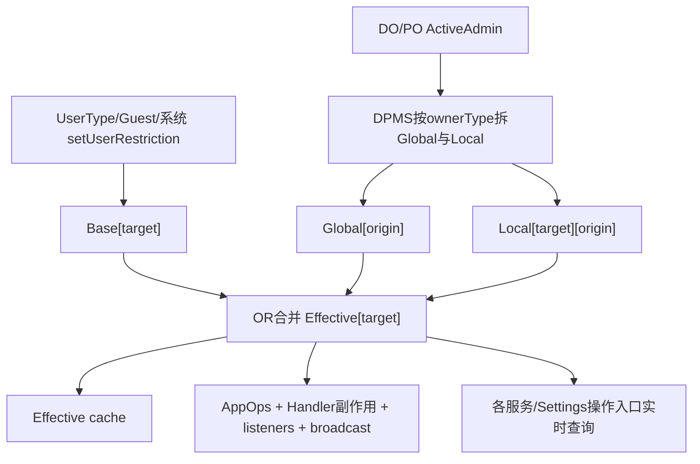
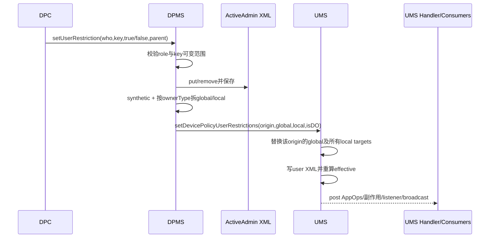
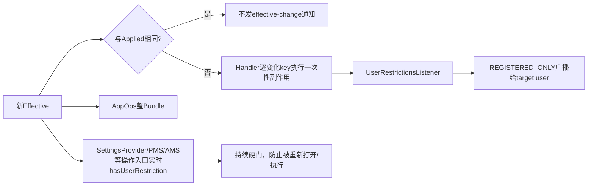

# 第 347 章 Android 企业 UserRestrictionsUtils / RestrictionsSet：基础、本地、全局、有效限制、来源、持久化与执行链

> 源码基线：Android 11 / API 30 / `android-11.0.0_r48`。本章承接第346章的类型默认restriction，追它进入UMS后怎样与Device Owner/Profile Owner策略合并、缓存、落盘、广播并由各服务执行。限制是多来源布尔OR账本，不是一个管理员可覆盖的单值。仅做macOS只读分析，不编译。

## 1. 本章要解决什么

`hasUserRestriction()`返回true时，到底是系统默认、DO还是PO设置的？PO清除自己的限制后为何仍为true？一个限制设置后为何有时立刻关闭开关，有时只是Settings按钮变灰？需要同时理解四张UMS账和外部消费者。

## 2. restriction 是字符串布尔键

UserManager定义如`no_config_wifi`、`no_install_apps`的常量，Bundle中true表示限制存在。它不是通用任意key-value政策；UserRestrictionsUtils维护合法key白名单，语义基本是“禁止某能力”。

## 3. 一个正向命名例外

大多数键以DISALLOW开头，但`ALLOW_PARENT_PROFILE_APP_LINKING`是允许式语义，仍被放进相同布尔集合。阅读merge时不能仅凭key前缀解释业务，必须看常量文档与消费者。

## 4. 第一张账：base restrictions

`mBaseUserRestrictions`按目标userId保存系统/用户管理层的基础限制，包括UserTypeDetails创建默认、guest默认、first user资源以及拥有MANAGE_USERS的系统调用设置。它不包含DO/PO策略。

## 5. 第二张账：DevicePolicy global

`mDevicePolicyGlobalUserRestrictions`的key是“策略来源userId”，value是该来源对所有用户生效的Bundle。多个来源的global Bundle会mergeAll为一个设备范围集合。

## 6. 第三张账：DevicePolicy local

它是二层结构：`targetUserId → RestrictionsSet(originatingUserId → Bundle)`。同一目标用户可同时受自己PO、另一个组织所有profile的parent策略及DO本地策略影响。

## 7. 第四张账：effective cache

`mCachedEffectiveUserRestrictions`缓存每个用户的最终OR集合，按需计算。调用者读取的是这张逻辑结果，不应把它当可直接修改的政策源。

## 8. 还有第五张 applied 账

`mAppliedUserRestrictions`记上次已提交传播的effective集合，用于计算哪些key发生true↔false变化，避免重复执行副作用、listener和广播。

## 9. 最终公式

对目标user u：

`Effective(u) = Base(u) ∪ Merge(Global所有来源) ∪ Merge(Local[u]所有来源)`

merge只复制值为true的key，因此这是单调OR；没有“后写false覆盖先写true”。

## 10. 主要源码入口

数据结构看`RestrictionsSet.java`，合法键、分类和副作用看`UserRestrictionsUtils.java`，状态机看UMS的`setDevicePolicyUserRestrictionsInner()`、`computeEffectiveUserRestrictionsLR()`、`updateUserRestrictionsInternalLR()`；owner分拆看DPMS `pushUserRestrictions()`。

## 11. 多来源账本总图

## 12. RestrictionsSet 的基本形状

内部是`SparseArray<Bundle>`，key通常是userId。类注释故意保持抽象：它既可表示“限制作用于哪个user”，也可表示“限制由哪个user设置”，含义由外围容器决定。

## 13. 只存非空Bundle的设计

构造器拒绝空Bundle，`updateRestrictions()`遇到null或size为0会删除对应key。这样`mergeAll()`和XML不会充满无意义用户条目。

## 14. false-valued key是一个细节

`isEmpty()`只看Bundle size，不看true值；一个`{no_sms=false}`仍被视为非空并可存入RestrictionsSet，但merge时不会产生有效限制。DPMS清除策略会remove key，UMS base setter则putBoolean(false)，两条写法并不完全相同。

## 15. null与空在比较中相等

`UserRestrictionsUtils.areEqual()`把null和size=0 Bundle视为相等，减少“没有条目”和“空条目”的无效变更。但含一个false key的Bundle size非0，可能与null比较为不同，即使二者effective都没有true限制。

## 16. update不克隆Bundle

RestrictionsSet直接保存传入对象，getter也直接返回内部Bundle。UMS注释因此反复要求不得原地修改已存Bundle；更新base时必须clone后替换，否则cache与source可能共享对象，变化检测会失效。

## 17. merge 的规则

`merge(dest,in)`遍历in的key，只把`getBoolean(key,false)==true`写到dest。它不复制false，不删除dest已有true，并检查dest不能就是in本身。

## 18. mergeAll 返回新对象

RestrictionsSet创建新Bundle，再依次merge每个来源。源Bundle不被修改；不同来源顺序对纯布尔OR结果没有影响。

## 19. moveRestriction 的迁移用途

它遍历所有user来源，把某key从当前RestrictionsSet移到目标set的同userId下，并清理变空Bundle。UMS版本升级用它把历史local规则迁到global分类，保留来源归因。

## 20. XML结构

RestrictionsSet外层自定义tag内，每个来源写`<restrictions_user user_id="...">`，内部再写`<restrictions key="true".../>`。read遇到malformed直到文档结束仍未闭合会抛XmlPullParserException。

## 21. 合法键集合是硬编码的

`USER_RESTRICTIONS`列举网络、包管理、用户、调试、音视频、位置、显示、跨profile等键。新增UserManager常量若忘记加入这里，isValid、序列化与apply循环都不会完整支持。

## 22. 唯一性在类加载时检查

`newSetWithUniqueCheck()`把字符串数组转Set并要求size不变。若源码误列重复值，Preconditions.checkState会在类初始化时失败，而不是静默去重掩盖维护错误。

## 23. 未知restriction如何记录

isValidRestriction根据Binder callingUid查包名；core UID或system app查询未知key时通常Slog.wtf，其他来源Slog.e，然后返回false。服务API一般直接拒绝/忽略该key。

## 24. “未知”不是自动扩展点

Bundle即使手工放入陌生key，writeRestrictions会warning且不写，apply循环也只遍历合法Set。OEM新增限制必须同步常量、合法集合、分类、持久化和消费者，不能只发一个自定义字符串。

## 25. NON_PERSIST 特例

r48把`DISALLOW_RECORD_AUDIO`列为不由UserRestrictionsUtils写入XML的restriction。它可以在当前运行状态参与effective，但依赖策略源在恢复时重新推送；看到重启行为必须继续核对DPMS自身持久账和启动push。

## 26. XML只写true

合法key只有值为true才成为attribute；false不写。读取遍历所有合法key，只对存在attribute按Boolean.parseBoolean放入Bundle，因此运行时false占位重启后通常消失。

## 27. Base的来源之一：类型默认

第346章创建用户尾部把UserTypeDetails或guest默认Bundle写入`mBaseUserRestrictions`。这些restriction来源查询会归为SYSTEM，而不是PO/DO。

## 28. Base的来源之二：first user资源

fallback user0读取`config_defaultFirstUserRestrictions`并写base。这是system user的创建默认，不走UserTypeDetails default restriction。

## 29. Base的来源之三：UserManager setter

`setUserRestriction(key,value,userId)`要求MANAGE_USERS，验证key后clone旧base、putBoolean新值并调用统一更新链。它不修改任何ActiveAdmin，也不能清除owner来源的同名true。

## 30. Base的来源之四：历史策略迁移

DPMS升级旧版本限制时，把owner可控制的key迁入ActiveAdmin，不能控制或例外key保留在base，再通过UserManagerInternal写回。这解释了某些限制显示SYSTEM来源却历史上由旧DeviceAdmin流程产生。

## 31. DPMS先保存owner原始请求

DPM `setUserRestriction()`校验角色/parent后，在对应ActiveAdmin.userRestrictions中true时put、false时remove，保存DPMS XML，然后push给UMS。ActiveAdmin是owner desired policy账。

## 32. ActiveAdmin会加入synthetic restriction

`getEffectiveRestrictions()`复制userRestrictions、移除deprecated key，再把`disableCamera`映成DISALLOW_CAMERA、`requireAutoTime`映成DISALLOW_CONFIG_DATE_TIME。不同DPM API可在UMS层汇聚成相同restriction。

## 33. synthetic导致getter与执行集合可能不同

`getUserRestrictions(who)`返回ActiveAdmin.userRestrictions原Bundle，而push使用getEffectiveRestrictions。通过disableCamera产生的camera限制可能在UMS effective/source中存在，却不一定出现在该原始userRestrictions getter中。

## 34. DO能否设置所有合法键

不能。`canDeviceOwnerChange()`排除IMMUTABLE_BY_OWNERS：record audio、wallpaper、OEM unlock。合法restriction集合比某种owner的授权集合更大。

## 35. PO授权更窄

标准PO还不能设置DEVICE_OWNER_ONLY，并且若不在system user，不能设置PRIMARY_USER_ONLY集合。角色校验发生在DPMS保存前，不能靠UMS后续分类绕过。

## 36. 组织所有工作资料parent例外

组织所有managed profile的PO通过parent instance可设置专门global/local白名单。它不是普通PO全部能力提升，只允许UserRestrictionsUtils列出的少数键。

## 37. global/local是谁决定

ActiveAdmin分别调用`getGlobalUserRestrictions(ownerType)`与`getLocalUserRestrictions(ownerType)`，内部对每个true key使用UserRestrictionsUtils.isGlobal/isLocal过滤。一个key在一次ownerType下只落一边。

## 38. DO的PRIMARY_USER_ONLY会全局化

PRIMARY_USER_ONLY名字是历史角色授权分类：secondary user PO不能设，而DO设置时isGlobal为true，应用到所有用户。不要把名字误读为“只影响user0”。

## 39. DO的GLOBAL_RESTRICTIONS

调音量、蓝牙分享、日期时间、系统错误框、后台运行、麦克风/设备静音、相机等，DO设置时被放入global；PO在允许设置的上下文通常落local，作用目标不同。

## 40. PROFILE_GLOBAL始终全局

ENSURE_VERIFY_APPS、禁止飞行模式、全局禁止未知来源属于不论谁合法设置都全局的集合。isGlobal表达执行范围，can*Change另行表达谁有权设置。

## 41. DEVICE_OWNER_ONLY也始终global

禁止用户切换、禁止配置Private DNS被isGlobal无条件归为global；标准PO先被授权检查挡住。COPE parent能设置其中被组织所有白名单允许的Private DNS。

## 42. 其余合法策略通常local

`isLocal()`就是`!isGlobal()`。local的目标通常是owner所在user；COPE parent实例的某些local restriction目标是个人parent user，而来源仍是managed profile userId。

## 43. DPMS push的DO形状

DO取自己的global Bundle，并在local RestrictionsSet中用`originatingUserId`作为target加入DO local Bundle。也就是DO本地策略只作用DO user，全局策略作用所有user。

## 44. 普通PO push形状

PO global Bundle通常只含PROFILE_GLOBAL等特例；local以PO userId为target。来源与目标相同，但UMS仍用二层结构保存，以统一支持跨parent情况。

## 45. COPE parent push形状

先加入PO自身global/local，再把parent ActiveAdmin的global merge进global；parent-local以`getProfileParentId(profileUserId)`为target加入local。来源参数仍是profile userId，所以source归因能指出管理者所在资料用户。

## 46. push是按origin全量替换

DPMS每次为一个origin构造当前global和完整local target set交给UMS，不是发送单key增量。UMS会找出新set和旧set涉及的所有target，并删除本次已缺失的旧origin Bundle。

## 47. 如何发现被清除的local target

`getUpdatedTargetUserIdsFromLocalRestrictions()`先加入新local中的targets，再扫描UMS现有local map：若某target仍有该origin、但新set不含target，也加入更新列表以执行删除。

## 48. 空Bundle代表删除来源条目

更新每个target时，新local拿不到Bundle就用空Bundle；RestrictionsSet.update因此删除`originatingUserId` key。其他origin在同target下的Bundle不受影响。

## 49. DeviceOwnerUserId的归因用途

UMS另存`mDeviceOwnerUserId`。当前push来自DO时赋origin；同user后来以PO身份push且原值相同则重置USER_NULL，避免把PO来源误标为DO。

## 50. policy set调用不是最终生效点

DPMS先保存ActiveAdmin，再push UMS；UMS还要更新global/local、持久化相关用户XML、重算effective并异步传播。DPM API返回时，Handler中的设置副作用与广播可能尚未完成。

## 51. DPMS到UMS时序图

## 52. global更新存在哪里

UMS的global RestrictionsSet按origin保存；写user XML时，只写“该userId作为origin的global Bundle”。因此来源user自己的XML承载它发出的全局限制。

## 53. local更新存在哪里

每个target user XML写该target完整`RestrictionsSet(origin→Bundle)`。`writeAllTargetUsersLP(origin)`虽参数名/调用上下文容易看错，实际遍历所有target，只有包含该origin时才写目标user文件。

## 54. 原地同user优化

若更新local target列表只有origin自己，UMS一次writeUserLP(origin)即可同时写该user的global与local。跨parent或多target时分别写origin global和受影响target文件。

## 55. user XML使用AtomicFile

UMS `writeUserLP()`用AtomicFile startWrite/finishWrite，异常failWrite，相比第344章ManagedProvisioning快照直接FileOutputStream更能抵御半写。它仍不是跨多个user XML的全局事务。

## 56. 跨target写入可部分成功

一个COPE push可能写profile来源文件和parent target文件，逐文件执行；中途异常会各自日志/回滚单文件，但没有把前面成功文件整体撤回。内存本boot已更新，重启恢复可能暴露跨文件不一致窗口。

## 57. 旧格式local迁移

读取user XML若有新`RestrictionsSet` local tag就使用；若只有legacy单Bundle，则构造`new RestrictionsSet(id, legacyBundle)`，把target自身也视为origin。两种格式同时出现会Slog.wtf并优先新格式。

## 58. 读取global的归属

每个user文件的global Bundle以该文件id写入`mDevicePolicyGlobalUserRestrictions[id]`。启动后DPMS也会push当前owners，使UMS账与ActiveAdmin desired重新对齐。

## 59. 用户删除时清哪些账

删除target会移除base/applied/cache和整个local[target]；随后遍历其他targets删掉以该user为origin的local，再移除global[origin]。若任何跨用户来源变化，触发全用户重新应用。

## 60. 删除target与删除origin不同

同一user可能同时是限制承受者和策略来源。清理必须处理两个轴；只删除SparseArray外层target会让它在其他用户上留下幽灵owner限制。

## 61. computeEffective的common case

取base后若global为空且local[target]为空，直接返回base对象以减少分配。正因cache可能与base共享Bundle，代码严禁调用者原地改source对象。

## 62. 有owner策略时才clone

global或local非空时clone base，再依次merge global和local.mergeAll。最终不保留每个key的来源信息，只保留true集合；来源需要另查原始三张账。

## 63. false不能解除别人的true

某PO删除自己的key，只会让它从该origin Bundle消失。若base、DO global或另一个PO local仍为true，effective继续true，不产生false传播。

## 64. cache只存非空集合

Cached也用RestrictionsSet，空effective会导致update删除entry；下次get仍发现null并重新计算。语义正确，只是“无任何限制”没有正缓存。

## 65. getUserRestrictions返回副本

公开服务clone effective后返回，避免Binder客户端修改UMS内部缓存。相反内部RestrictionsSet getter不clone，仅供遵守锁和所有权纪律的服务代码。

## 66. hasUserRestriction会查effective

LocalService先验证key，再读effective。它不是只看base，也不是只看调用者DPC的ActiveAdmin；UI判断应使用它了解真实是否受限。

## 67. hasUserRestrictionOnAnyUser

验证key后枚举排除dying的users，逐个查effective。Settings全局kill-switch等场景用它判断任何用户是否施加相关限制。

## 68. getUserRestrictionSource是bit OR

它调用sources列表，把SYSTEM=1、DO=2、PO=4按位OR。返回6表示同时有DO和PO，不代表一个新的“混合管理员”类型。

## 69. sources列表保留enforcing user

更丰富API返回`EnforcingUser(userId, source)`；base使用USER_NULL+SYSTEM，local/global按origin id返回DO或PO。这比单bit能定位哪个资料用户的owner在施加限制。

## 70. 如何判断DO与PO来源

RestrictionsSet比较origin userId与`mDeviceOwnerUserId`：相等标DO，否则标PO。它不保存ComponentName；同user下具体哪个admin需再回DPMS Owners/ActiveAdmin查询。

## 71. source查询先看effective shortcut

若当前restriction根本不生效，直接返回空列表；否则分别检查base、target local和all global来源。它可能返回多个同source类型的EnforcingUser，调用者不应假定最多一项。

## 72. applied 与effective cache不同

cache回答“现在算出来是什么”；applied回答“上次传播链认为已经应用了什么”。策略变更先计算effective，再用applied作prev，最后更新applied副本。

## 73. 为什么Applied必须复制

代码存`new Bundle(effective)`，避免后续source/cache对象变化篡改历史比较基线。否则new和prev指同一对象，会看不到差异。

## 74. Base更新如何落盘

若newBase与旧base不同，UMS scheduleWriteUser延迟写user XML；owner更新路径则在mPackagesLock内较直接写相关文件。内存生效与磁盘完成仍有时序差。

## 75. global变化为何影响所有user

UMS先清空全部effective cache，再post任务向AMS取得runningUserIds，只对当前运行用户重算和应用。非运行user在以后start时会走apply链。

## 76. local变化只重算targets

若global未变但local变，遍历updatedLocalTargetUserIds调用apply。即便一个target不在前台，它的per-user设置/消费者状态仍可被更新；global路径则显式只处理running users。

## 77. global与local同时变化时

globalChanged分支优先调用apply-for-all，不再单独遍历local targets；全局任务清cache并重算所有running users，覆盖运行target。非运行target启动时结合两类新账计算。

## 78. systemReady之前AppOps跳过

`mAppOpsService==null`时不post `setUserRestrictions`；UMS systemReady/用户启动的重新apply负责建立状态。不能把早期一次push中未通知AppOps误认为策略已永久丢失。

## 79. AppOps通知是整Bundle

对每个user把完整effective、固定token交给AppOpsService，而非逐key增量。AppOps内部根据支持的restriction映射限制相关op。

## 80. AppOps通知可能早于副作用任务

UMS先post AppOps runnable，再在propagate中post apply/listener/broadcast runnable；都走mHandler通常保持入队顺序，但它们是异步，API调用栈不等待执行完成。

## 81. effective相同就不传播

`propagateUserRestrictionsLR()`用areEqual比较new与prevApplied，相同则不post副作用、listener或broadcast。比如PO移除一个仍被DO global保持的key，来源变了但effective没变，因此没有ACTION_USER_RESTRICTIONS_CHANGED。

## 82. 来源变化与effective变化是两回事

上述情况下source查询会变化，DPM desired也变化，但用户能力没有变化。依赖审计来源的组件不能只监听effective-change广播，需从策略事件/DPMS状态获取。

## 83. Handler副作用只遍历变化key

UserRestrictionsUtils对整个合法Set比较new/prev，只有true↔false才调用`applyUserRestriction()`。未变化restriction不重复执行开关修改。

## 84. 有副作用的代表：数据漫游

变为true时把单SIM和所有active subscription的DATA_ROAMING写0；清除限制时不主动恢复，因为系统不知道限制前用户本来是否关闭。

## 85. 位置分享与配置位置不同

DISALLOW_SHARE_LOCATION变true直接把该user LOCATION_MODE关；DISALLOW_CONFIG_LOCATION变true则清全局kill switch并由Settings写入门阻止用户配置。两个key语义与执行点不同。

## 86. 调试限制的范围

DISALLOW_DEBUGGING_FEATURES变true且target是user0时关闭ADB与ADB Wi-Fi Global settings；对非system user不做这项global关闭。操作入口仍需检查restriction防止重新打开。

## 87. 后台运行限制

DISALLOW_RUN_IN_BACKGROUND变true时，如果target既不是current user也不是user0，调用AMS stopUser。若目标当前前台，setter不会立即停它；切后台后的其他生命周期消费者还会执行限制。

## 88. 安全启动是双向写

DISALLOW_SAFE_BOOT无论true或false都把SAFE_BOOT_DISALLOWED写1/0。源码注释指出它与多数不能安全恢复原设置的限制不同，撤销时可明确反向更新。

## 89. 飞行模式限制

变true时若当前正开飞行模式，会先写AIRPLANE_MODE_ON=0并向ALL users发ACTION_AIRPLANE_MODE_CHANGED(state=false)。撤销时不自动打开飞行模式。

## 90. App控制限制的清理副作用

DISALLOW_APPS_CONTROL或DISALLOW_UNINSTALL_APPS发生任意true/false变化时，PMS移除该user所有非system package suspensions与distracting restrictions并flush。switch没有newValue判断，清除策略时也执行幂等清理。

## 91. 传播与消费者组合图

## 92. 一次性副作用不等于持续 enforcement

把设置改为关闭只是当下收敛；若ADB或Settings数据库可被其他路径再次写，必须在写入口检查restriction。源码注释明确提醒同步维护SettingsProvider的受限设置判断。

## 93. isSettingRestrictedForUser 的桥

UMS Binder入口只允许SYSTEM_UID调用，再交UserRestrictionsUtils按setting名、目标值和真实callingUid判断。SettingsProvider以此阻止不被允许的Global/Secure/System设置写入。

## 94. 降低能力通常仍允许

例如LOCATION_MODE写OFF、ADB写0、飞行模式写0、Doze写0、未知来源写0通常直接return false“不阻止”；restriction防止重新启用危险能力，而不妨碍用户主动收紧。

## 95. SYSTEM/ROOT特殊例外

Always-on VPN配置对system/root放行；亮度、日期时间、屏幕超时、Private DNS等setting对SYSTEM_UID放行。例外是系统服务维持设备所需，不等于普通system app UID都自动放行。

## 96. checkAllUser 的例子

LOCATION_GLOBAL_KILL_SWITCH写非0时检查任意user的DISALLOW_CONFIG_LOCATION，因为这个setting是global。其余多数setting按指定user查询effective。

## 97. Settings UI禁用不是唯一防线

标准Settings会依据restriction隐藏/禁用入口，但SettingsProvider写入门、PMS/AMS等服务端检查才抵御其他客户端。审计一项restriction必须找所有消费者，不能只截图UI。

## 98. 广播的性质

`ACTION_USER_RESTRICTIONS_CHANGED`以target UserHandle发送，并带`FLAG_RECEIVER_REGISTERED_ONLY`，只有已注册动态receiver收到；没有逐key/new-old extra，接收者需重新查询完整effective。

## 99. listener先于广播

同一Handler runnable内先执行apply副作用，再复制并调用内部UserRestrictionsListener数组，最后发广播。listener异常若未自行处理可能影响后续流程；Binder包装的公共listener捕获RemoteException。

## 100. 公共listener不能注销

UMS注释说Binder `addUserRestrictionsListener`唯一客户端是SettingsProvider的静态永久listener，因此未支持unregister。LocalService内部listener API则可add/remove，二者不要混淆。

## 101. 清restriction通常不恢复旧值

位置、漫游、飞行模式、Doze等被强制关闭后，撤销限制不知道原始值，通常留给用户重新开启。effective false表示“现在允许操作”，不表示“恢复政策前状态”。

## 102. 两个未知来源限制的联动

local与global unknown-sources共同决定INSTALL_NON_MARKET_APPS setting：任一仍true就写0，只有另一restriction也false时才写1。它是少数显式考虑同类两张restriction的反向更新逻辑。

## 103. Base无法被owner清除

PO/DO `setUserRestriction(false)`只移除自己的ActiveAdmin key。若类型默认base仍true，effective不变，source仍含SYSTEM。DPC getter返回自己已清除并不代表用户限制已经解除。

## 104. 一个完整多来源例子

user10 base禁止SMS，DO user0 global禁止camera，PO user10 local禁止camera和config-wifi。user10 effective三项；user0 effective至少camera。PO清camera后user10仍因DO global受限，只有source从DO+PO变成DO。

## 105. 现场排查步骤

先查effective，再查getUserRestrictionSources；SYSTEM来源回看type/guest/first-user/base迁移，DO/PO来源回看ActiveAdmin与global/local分类；最后定位apply副作用和真正服务端消费者。

## 106. 持久化排查步骤

核对来源user XML的global、target user XML的local RestrictionsSet和base tag，再核对DPMS policy XML。多文件写不是事务，重启后DPMS push应重建owner账；NON_PERSIST键还要看启动恢复路径。

## 107. 数据结构测试重点

覆盖null=empty、false-key差异、update空删除、merge只OR true、move后清空、XML多origin、malformed抛错、getEnforcingUsers按deviceOwnerUserId分类，以及不克隆对象的所有权约束。

## 108. 状态机测试重点

覆盖base/global/local三层、多个origin、global变化只重算running users、非运行user启动补apply、effective不变但source变化不广播、用户删除清target与origin两个轴。

## 109. 执行测试重点

对有副作用key验证true/false非对称，SettingsProvider验证危险方向被阻止而安全方向放行，PMS/AMS消费者验证不依赖UI；同时检查ACTION广播只在effective变化时出现。

## 110. 命名上的陷阱

“UserManager set restriction”可能指base setter，也可能指DPM最终push进UMS；“global”指作用范围，不等于数据存于Settings.Global；“local”指目标user范围，不等于只在本进程内存。

## 111. 本章心智模型

把每个来源看成只能提交true集合的透明胶片：base贴在目标user，local由target+origin定位，global铺到所有user；effective是叠加后的黑区。移走一张胶片只有在没有其他胶片覆盖时，能力才真正恢复。

## 112. macOS只读练习一：手算三层集合

阅读UMS `computeEffectiveUserRestrictionsLR()`，自设base、两个global origin和两个local origin Bundle，手算user0/user10 effective；再让一个origin清key，说明何时effective不变、source列表却变化。只读，不修改XML。

## 113. macOS只读练习二：追COPE parent分流

从DPMS `setUserRestriction(parent=true)`追到`pushUserRestrictions()`，选择AIRPLANE_MODE、CONFIG_WIFI、CAMERA三个键，按organization-owned ownerType查isGlobal/isLocal，标出origin profile user和target parent user。

## 114. macOS只读练习三：审计传播顺序

阅读`updateUserRestrictionsInternalLR()`与`propagateUserRestrictionsLR()`，画出cache、AppOps post、Applied更新、apply副作用、listener、broadcast时序；解释API返回为何不等于所有副作用完成。

## 115. macOS只读练习四：找一个持续硬门

选择ADB、位置、Private DNS或未知来源，先找applyUserRestriction的一次性收敛，再找`isSettingRestrictedForUser()`与SettingsProvider调用点。写出“设置restriction→关闭现状→阻止重新开启→清除后不自动恢复”的完整推演。

## 116. 本章检查题

为什么PO写false不能覆盖DO true？为什么source变化可能没有restrictions-changed广播？为什么global restriction保存在来源user文件却作用全部用户？为什么清除restriction通常不会恢复原设置？

## 117. 复读修正一：Restriction不是单一Bundle

初读UserManager API容易写成“后设置覆盖前设置”。复核UMS后必须明确三类source账和二层local结构，effective只做true OR；false只撤销本来源，任何其他来源仍可维持限制。

## 118. 复读修正二：生效不全靠apply switch

UserRestrictionsUtils只对少数key做状态收敛，许多key没有switch case，却由PackageManager、Settings、AMS等在操作入口查询。没有一次性副作用不代表restriction无效，反之只改setting也不足以构成持续安全门。

## 119. 复读修正三：缓存、Applied与持久账要分开

cache是可失效的计算结果，Applied是传播比较基线，base/local/global是内存source，user XML与ActiveAdmin XML是跨重启desired。诊断不能拿任意一张账代替全部，更不能原地修改共享Bundle。

## 120. 本章结论与下一章

第347章闭合了restriction从owner请求、范围分类、多来源OR、XML恢复到异步传播和服务端硬门的完整链。下一章继续深入`DevicePolicyManager.setUserRestriction()`逐键能力矩阵，比较DO、普通PO、system-user PO、组织所有managed-profile parent实例以及synthetic/deprecated限制，并整理关键restriction的真实消费者。
