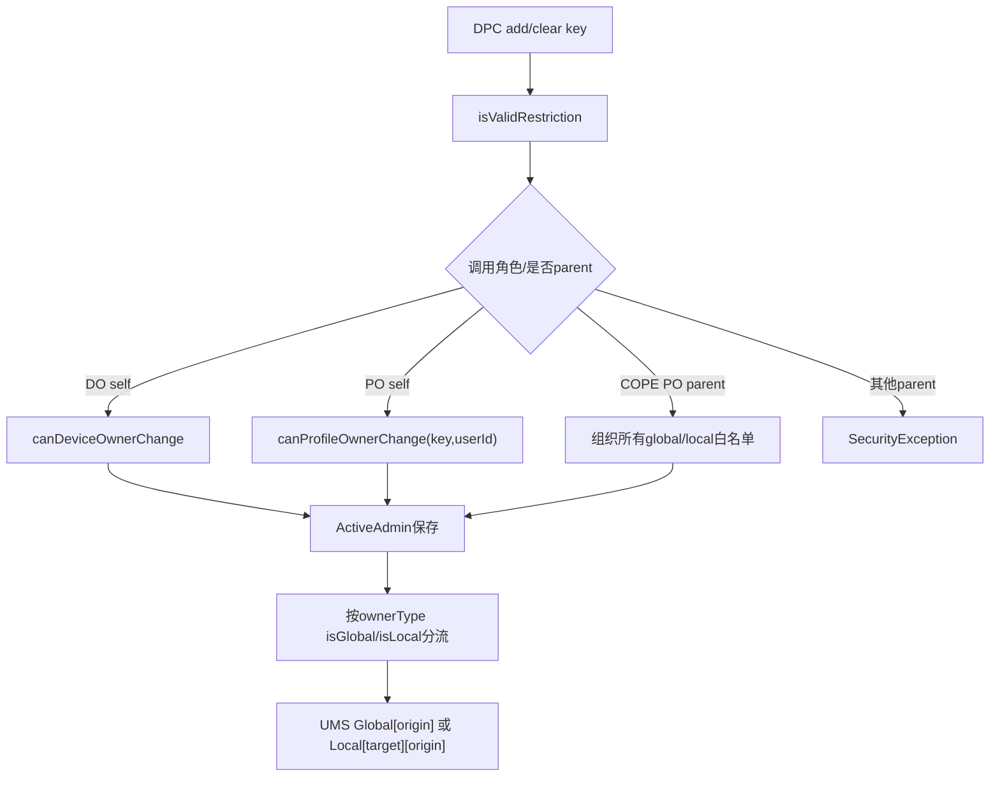
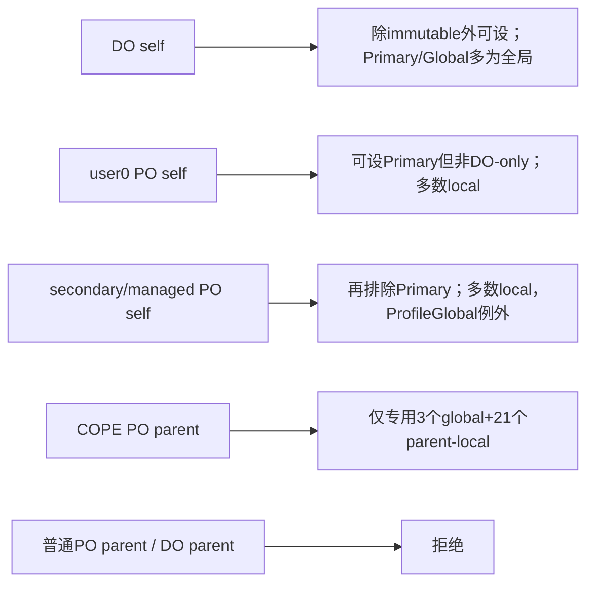
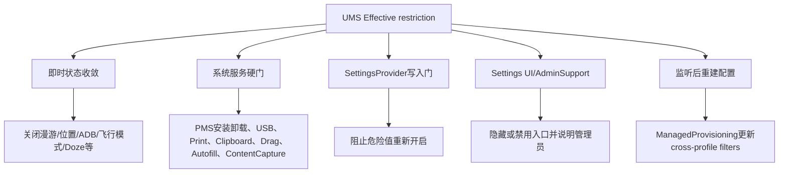

# 第 348 章 Android 企业 DevicePolicy 用户限制：逐键角色矩阵、全局/本地、Synthetic、Deprecated 与关键消费者链

> 源码基线：Android 11 / API 30 / `android-11.0.0_r48`。第347章解释UMS怎样合并限制，本章站在DPC入口回答“谁能设置哪个key、作用到谁、谁真正执行”。权限矩阵与作用范围矩阵是两步，常量Javadoc还可能使用primary user历史术语，判断r48行为应以DPMS和UserRestrictionsUtils实现为准。仅做macOS只读分析。

## 1. 本章为什么要做矩阵

`addUserRestriction()`表面只接ComponentName与key，但DO、user0上的PO、secondary/managed-profile PO、组织所有profile的parent instance能力不同；同一个camera键由DO设置是全局，由普通PO设置则是local。

## 2. 两个独立问题

第一问是caller是否允许改变该key，由`canDeviceOwnerChange`、`canProfileOwnerChange`或COPE专用白名单回答；第二问是允许后归入global还是local，由`isGlobal(ownerType,key)`回答。

## 3. 合法key不等于owner可设置

UserRestrictionsUtils.USER_RESTRICTIONS包含系统内部、用户默认和DevicePolicy共用键。record-audio、wallpaper、OEM-unlock虽合法，却在IMMUTABLE_BY_OWNERS中，DO/PO通过本API都不能改。

## 4. 能设置不等于对该用户有现实效果

部分key文档明确对managed profile无效，或只在managed profile有意义。例如亮度限制写入profile local账可能为true，但profile没有独立屏幕亮度，消费者不会产生预期效果。

## 5. global不等于Settings.Global

restriction global表示对所有users合并生效；其消费者可能是PackageManager、Bluetooth、AMS或SettingsProvider。反过来local restriction也可能修改物理设备共享资源，需看具体硬件/UI模型。

## 6. primary历史术语要小心

UserManager不少Javadoc说“profile owner on primary user”；r48授权代码实际检查`userId == UserHandle.USER_SYSTEM`。在普通手机两者常同为user0，在headless system user模型不能无条件等同。

## 7. Parent instance 是另一政策面

普通managed-profile PO只能管资料自身；只有organization-owned managed profile的PO能用`getParentProfileInstance()`调用有限restriction集合，目标可能是个人parent或全设备。

## 8. clear只清本owner

`clearUserRestriction()`传enabled=false，DPMS从当前ActiveAdmin Bundle移除key。它不向UMS提交一个能压过别人true的false，其他系统/DO/PO来源仍可维持effective。

## 9. getter也只看本admin

DPM `getUserRestrictions(admin)`返回该ActiveAdmin原始userRestrictions，而不是目标user所有effective限制。想看系统+全部owners的结果应使用UserManager；想看来源应使用restriction sources API。

## 10. 核心源码位置

客户端API在DevicePolicyManager，服务入口与push在DevicePolicyManagerService，矩阵集合在UserRestrictionsUtils，常量语义在UserManager，真实消费者散布于PackageInstaller/PMS、AMS/WMS、USB、Clipboard、Print和各manager service。

## 11. 授权与范围双矩阵图

## 12. 客户端没有parent主动拒绝

add/clear直接把`mParentInstance`传Binder，不像很多DPM方法先`throwIfParentInstance()`。parent合法性完全由DPMS结合owner角色与key白名单裁决。

## 13. admin不能为空

DPMS入口`Objects.requireNonNull(who)`，随后验证key。普通调用者不能用null冒充delegate；user restriction API没有delegate scope替代DO/PO身份。

## 14. 未知key的结果

isValidRestriction返回false时DPMS直接return，不抛“非法key”异常。系统调用未知key会有严重日志；DPC不能根据“方法没抛”断言策略已保存。

## 15. ActiveAdmin能力要求

`getActiveAdminForCallerLocked(...USES_POLICY_PROFILE_OWNER,parent)`最终要求调用者是符合owner政策的active admin。普通legacy device admin即使声明uses-policy也不能使用现代user restriction能力。

## 16. DO self路径

`isDeviceOwner(who,callingUser)`为true时走DO授权，parent必须false；若DO通过parent实例调用，明确抛IllegalArgumentException，而非把策略重定向到某个parent。

## 17. DO不可变三项

IMMUTABLE_BY_OWNERS包含DISALLOW_RECORD_AUDIO、DISALLOW_WALLPAPER、DISALLOW_OEM_UNLOCK。它们由系统用户模型或专用服务控制，不允许DPC用通用restriction API设置。

## 18. DO其余合法key原则上可写

`canDeviceOwnerChange()`只有上述排除，没有按SDK文档再细分。但“能写”与“有效”仍分开，例如SHARE_INTO_MANAGED_PROFILE文档说DO设置无效果。

## 19. PO self的第一层排除

PO同样不能改IMMUTABLE三项，也不能改DEVICE_OWNER_ONLY的DISALLOW_USER_SWITCH和DISALLOW_CONFIG_PRIVATE_DNS。

## 20. PO self的第二层排除

若PO所在userId不是USER_SYSTEM，还不能改PRIMARY_USER_ONLY集合。也就是secondary full user PO和managed-profile PO共享这道限制。

## 21. user0 PO的特殊宽度

PO恰在user0时绕过PRIMARY_USER_ONLY排除，可设置Bluetooth、USB、factory reset、add user、SMS、安全启动等历史primary能力；但DEVICE_OWNER_ONLY与IMMUTABLE仍禁止。

## 22. user0不自动等于DO

它仍以OWNER_TYPE_PROFILE_OWNER分类。比如camera属于GLOBAL_RESTRICTIONS：DO设置变global，user0 PO设置仍local到user0；角色而非数值userId决定这一范围差异。

## 23. secondary full-user PO

只能设置既非immutable、非DO-only、非primary-only的键。它的普通local策略作用自身；少数PROFILE_GLOBAL键仍会被分到全设备范围。

## 24. managed-profile PO

授权函数与secondary PO相同，但消费者语义差异很大。工作资料PO可限制资料包安装、剪贴板导出、Autofill等；对亮度、壁纸等没有profile现实资源的键可能无效果。

## 25. COPE parent不是复用canProfileOwnerChange

parent=true时，DPMS要求该ActiveAdmin是organization-owned managed profile PO，并调用专门的`canProfileOwnerOfOrganizationOwnedDeviceChange()`；它只看两个COPE集合的并集。

## 26. COPE parent global三项

可全局设置DISALLOW_AIRPLANE_MODE、DISALLOW_CONFIG_DATE_TIME、DISALLOW_CONFIG_PRIVATE_DNS。它们通过parent ActiveAdmin保存，push时merge入profile origin的global Bundle。

## 27. COPE parent local第一组：连接配置

可作用个人parent的CONFIG_BLUETOOTH、CONFIG_LOCATION、CONFIG_WIFI、SHARE_LOCATION、BLUETOOTH及BLUETOOTH_SHARING。部分控制配置UI，部分控制能力本身，不能互相替代。

## 28. COPE parent local第二组：移动网络与物理接口

包括CONFIG_CELL_BROADCASTS、CONFIG_MOBILE_NETWORKS、CONFIG_TETHERING、DATA_ROAMING、USB_FILE_TRANSFER、MOUNT_PHYSICAL_MEDIA。

## 29. COPE parent local第三组：数据与调试

包括CONTENT_CAPTURE、CONTENT_SUGGESTIONS、DEBUGGING_FEATURES、SAFE_BOOT。它们目标是个人parent，但来源仍是工作资料user中的PO。

## 30. COPE parent local第四组：通信和音频

包括OUTGOING_CALLS、SMS、UNMUTE_MICROPHONE以及CAMERA。camera在DO模式会global，但COPE ownerType没有命中DO条件，因此这里是parent-local。

## 31. COPE parent不能设置所有普通PO key

例如MODIFY_ACCOUNTS、INSTALL_APPS、AUTOFILL、PRINTING不在parent专用并集，parent调用会SecurityException；PO仍可在非parent实例按普通规则限制工作资料自身。

## 32. COPE parent也不能禁止user switch

USER_SWITCH是DO-only且未列入organization-owned global集合；parent PO不能获得等同全设备DO的用户生命周期控制权。

## 33. 保存true与false的差别

enabled=true在ActiveAdmin Bundle putBoolean(true)，false直接remove。DPMS不保留false占位，因此owner desired XML只表达它正在施加的true集合。

## 34. 每次成功调用都有策略事件

保存后写ADD_USER_RESTRICTION或REMOVE事件，strings包含key及是否parent；SecurityLog启用时还记录admin包、userHandle和key。事件表示owner请求成功处理，不保证所有异步消费者已完成。

## 35. sendChangedNotification的角色

`saveUserRestrictionsLocked()`依次保存DPMS settings、push UMS并发DPM state changed通知。它与UMS的ACTION_USER_RESTRICTIONS_CHANGED是不同广播/观察面。

## 36. 原始Bundle与effective restrictions

push前ActiveAdmin复制原Bundle、移除deprecated，并加入synthetic camera/date。故owner getter、DPMS XML、UMS source Bundle可能有差异，诊断应标注查看的是哪一层。

## 37. Synthetic camera

若ActiveAdmin.disableCamera为true，push自动加入DISALLOW_CAMERA。`setCameraDisabled()`与`addUserRestriction(CAMERA)`可汇聚为同一UMS限制，但原始字段和事件来源不同。

## 38. Synthetic date/time

若ActiveAdmin.requireAutoTime为true，push加入DISALLOW_CONFIG_DATE_TIME。旧`setAutoTimeRequired`政策通过restriction持续阻止用户关闭自动时间配置。

## 39. Synthetic也按ownerType分流

DO的camera/date落GLOBAL_RESTRICTIONS→全局；普通PO的同key通常local；COPE parent ActiveAdmin会按organization-owned ownerType决定date为global、camera为parent-local。

## 40. Deprecated两项

r48 DPMS从effective owner restriction中过滤DISALLOW_ADD_MANAGED_PROFILE与DISALLOW_REMOVE_MANAGED_PROFILE。它们可能仍存在于历史ActiveAdmin Bundle/getter，却不会由这条owner push进入UMS。

## 41. ADD_MANAGED_PROFILE的替代控制

DPMS在有DO时会通过UserManager base restriction确保禁止添加managed profile；这是SYSTEM/base来源，不再作为ActiveAdmin owner restriction。清DO后的迁移/清理需看专门生命周期。

## 42. REMOVE_MANAGED_PROFILE的替代语义

用户删除权限已有owner保护和更明确的remove flows；deprecated key被忽略避免旧策略与现代managed profile removal规则重复或冲突。

## 43. Managed profile默认restriction

新/升级managed profile PO会默认获得DISALLOW_BLUETOOTH_SHARING；新owner还通常设置DISALLOW_INSTALL_UNKNOWN_SOURCES，旧owner是否补设取决于迁移setting。它们被记在ActiveAdmin，不是UserTypeDetails base。

## 44. 默认限制有already-set账

ActiveAdmin保存`defaultEnabledRestrictionsAlreadySet`，只补新增默认集合，防每次启动重新加回管理员已清除的默认restriction。默认值一旦交给owner，后续可按授权清除。

## 45. Unknown sources的升级兼容

新PO直接加local unknown-sources；旧PO仅在历史`UNKNOWN_SOURCES_DEFAULT_REVERSED`标志表明需要时补设，再清迁移setting。避免OTA擅自改变旧资料行为。

## 46. PRIMARY_USER_ONLY完整理解

集合含Bluetooth、USB、tether/network/factory reset/add user、cell/mobile、physical media、SMS/fun/safe boot/create windows/data roaming/airplane等。名字描述secondary PO授权限制，DO设置它们时isGlobal会应用所有users。

## 47. DEVICE_OWNER_ONLY完整理解

只有USER_SWITCH与CONFIG_PRIVATE_DNS。两者isGlobal无条件为true；普通PO不能写，COPE parent只通过专用白名单获得Private DNS，仍不能user switch。

## 48. GLOBAL_RESTRICTIONS完整理解

ADJUST_VOLUME、BLUETOOTH_SHARING、CONFIG_DATE_TIME、SYSTEM_ERROR_DIALOGS、RUN_IN_BACKGROUND、UNMUTE_MICROPHONE、UNMUTE_DEVICE、CAMERA。只有ownerType=DO时全局，PO self时local。

## 49. PROFILE_GLOBAL完整理解

ENSURE_VERIFY_APPS、AIRPLANE_MODE、INSTALL_UNKNOWN_SOURCES_GLOBALLY无论合法owner类型都global。但AIRPLANE_MODE又在PRIMARY集合，secondary PO先被授权挡住；分类不能替代授权。

## 50. 未列入特殊集合的默认范围

通过授权后都是local。例如INSTALL_APPS、UNINSTALL_APPS、CONFIG_WIFI、CROSS_PROFILE_COPY_PASTE、AUTOFILL、PRINTING等通常只影响owner自身或COPE明确parent target。

## 51. 五角色能力示意图

## 52. 第一个消费者族：应用安装

PackageInstallerService创建session时直接检查目标user的DISALLOW_INSTALL_APPS，命中抛SecurityException。该限制连DO/PO自身发起安装也可能阻止，UserManager Javadoc明确提示这一点。

## 53. 安装restriction与unknown sources不同

INSTALL_APPS禁止安装总体操作；INSTALL_UNKNOWN_SOURCES只禁止开启/使用未知来源路径，可信商店/ADB语义另有权限；UNKNOWN_SOURCES_GLOBALLY把后者扩到所有users。

## 54. 第二个消费者族：应用卸载

PMS deletePackage检查DISALLOW_UNINSTALL_APPS，异步observer返回DELETE_FAILED_USER_RESTRICTED；它与per-package blockUninstall是两道不同门，前者全user，后者具体包。

## 55. APPS_CONTROL比卸载更宽

DISALLOW_APPS_CONTROL用于阻止启停、清数据、force-stop等控制路径；与UNINSTALL_APPS变化时UMS还清理非system suspension/distracting restrictions。应分别测试每个PMS入口。

## 56. 账号限制

MODIFY_ACCOUNTS阻止用户UI/普通调用添加删除账号，但N以后PO/DO仍可通过AccountManager管理API操作。它是用户能力限制，不是让系统管理者也失去管理通道。

## 57. Wi-Fi配置不等于关闭Wi-Fi

CONFIG_WIFI主要阻止用户在Settings更改接入点，文档说对managed profile无效果；它不自动关闭无线，也不等于禁止所有网络连接。

## 58. Bluetooth两层restriction

CONFIG_BLUETOOTH只禁止Settings配置，不阻止开关/使用；DISALLOW_BLUETOOTH禁止使用并应阻止开启。产品策略要按目标选择，不能用前者宣称蓝牙完全禁用。

## 59. Bluetooth消费者不只UI

Settings BluetoothEnabler与权限请求页面查询restriction；完整硬执行还涉及Bluetooth服务/权限路径。只看到开关变灰不能证明后台API全被阻断，需继续追目标版本蓝牙栈。

## 60. USB文件传输有服务端门

UsbDeviceManager用UserManager restriction决定USB数据传输是否允许，Settings UsbBackend也检查并展示admin support。物理共享端口使“local user restriction”可能改变当前设备USB功能。

## 61. Tethering与network reset

CONFIG_TETHERING限制用户配置共享网络，NETWORK_RESET禁止重置网络设置。它们是不同操作面；禁tether不自动清现有所有网络配置，具体收敛由Connectivity/Settings消费者决定。

## 62. Mobile config与data roaming

CONFIG_MOBILE_NETWORKS阻止网络选择/APN等配置；DATA_ROAMING变true时UMS还主动把所有active subscription与单SIMsetting写0。清除后不自动恢复漫游。

## 63. Airplane mode是全局硬件状态

合法owner设置后global，UMS发现当前开启会立即关闭并发全用户广播；SettingsProvider阻止再次写1。COPE parent、DO和user0 PO的授权路径不同，最终设备效果相同。

## 64. Private DNS只给DO/COPE parent

CONFIG_PRIVATE_DNS是DO-only集合成员，标准PO self无权；组织所有parent专用global名单明确放行。SettingsProvider阻止非SYSTEM_UID修改mode/specifier。

## 65. 用户创建相关三键

ADD_USER阻止一般新用户，ADD_MANAGED_PROFILE在owner push中deprecated但可作为base使用，REMOVE_USER控制删除用户/自身。创建API还可能有“evenWhenDisallowed”系统内部例外，restriction不是物理不可能。

## 66. REMOVE_MANAGED_PROFILE的文档遗留

常量仍在合法集合和UserManager API，但DPMS ActiveAdmin effective过滤它。不要从“常量存在且DPM方法接受不抛”推导owner策略会进入UMS。

## 67. USER_SWITCH的例外管理通道

普通用户切换UI/流程会受全局restriction；UserManager Javadoc明确DO仍可调用DevicePolicyManager.switchUser。全局禁止针对用户能力，不应锁死管理者恢复通道。

## 68. RUN_IN_BACKGROUND

DO设置时global，意味着所有users effective都含；PO设置时local。UMS在restriction变true且目标非current/user0时请求stopUser，未来user lifecycle也检查。

## 69. DEBUGGING_FEATURES

设在user0时UMS关闭ADB/无线ADBsetting，SettingsProvider阻止重新开启；COPE parent可对个人侧设置。对非user0local restriction不会通过一次性分支关闭全局ADB，仍可能限制该user的其他调试入口。

## 70. SAFE_BOOT

DO设置因PRIMARY分类全局；user0 PO/COPE parent能按各自路径设置。UMS双向维护SAFE_BOOT_DISALLOWED，清除时可明确恢复允许状态。

## 71. FACTORY_RESET

secondary PO不能设，DO设置为global，user0 PO可local。恢复出厂是设备级操作，实际FactoryReset UI/Recovery入口必须读取对应有效restriction，不能只靠一个Settings按钮。

## 72. CREATE_WINDOWS

通过AppOpsManager restriction映射影响SYSTEM_ALERT_WINDOW与TOAST_WINDOW等op；DO设置全局，user0 PO可local，secondary PO无权。它针对非应用窗口，不禁止普通Activity应用窗口。

## 73. SYSTEM_ERROR_DIALOGS

DO设置global，PO设置local；当进程崩溃/ANR时系统不展示错误对话框并按关闭应用处理。managed profile没有独立系统错误UI时文档说无效果。

## 74. Camera两套API汇流

`setCameraDisabled()`通过ActiveAdmin.disableCamera synthetic加入restriction，通用add(CAMERA)直接存Bundle；两者任一使该admin effective camera=true。清一个API不一定解除另一个字段形成的同key。

## 75. Camera范围由owner角色决定

DO synthetic/直接camera都global；普通PO local；COPE parent camera local到个人parent。DPC不能只看“camera key存在”判断全设备范围。

## 76. 麦克风三个概念

UNMUTE_MICROPHONE阻止重新取消麦克风静音，ADJUST_VOLUME限制音量调整，RECORD_AUDIO是系统内部后台用户限制且owner不可改。它们不是同一权限或AppOps概念。

## 77. UNMUTE_DEVICE

与DevicePolicy master-volume mute相关，DO设置global、PO local；用户不能把设备主音量取消静音。它不同于按应用音频播放权限。

## 78. Wallpaper两键

DISALLOW_WALLPAPER是隐藏、managed profile等系统模型用且owner immutable；DISALLOW_SET_WALLPAPER可由owner限制用户改壁纸，但DO/PO自身仍能管理壁纸。不要混用。

## 79. SET_USER_ICON

阻止用户更改头像，DO设置仅对其target user local，因为它不在global分类。头像是per-user数据，不需要全设备禁止。

## 80. CROSS_PROFILE_COPY_PASTE是单向导出门

ClipboardService从source user复制到related profiles前查source restriction；命中时把跨profile clip设null，防止粘贴旧内容。它阻止从受限source导出，不自动阻止向该profile导入。

## 81. Drag-and-drop也要检查

WMS DragState同样查询source user的CROSS_PROFILE_COPY_PASTE。只修Clipboard而漏跨窗口drag会形成数据通道，因此restriction消费者必须覆盖多种交互机制。

## 82. OUTGOING_BEAM

阻止NFC Beam向外发送资料，属于local数据外泄控制。NFC硬件开关与支付/读卡不因此全部禁止；Android Beam功能存在性还受产品版本影响。

## 83. SHARE_INTO_MANAGED_PROFILE

只在managed profile PO设置时有意义，控制个人侧到资料侧的默认cross-profile intent filters；明确不阻止PO用`addCrossProfileIntentFilter()`显式允许的路径。

## 84. 该键的执行是异步重配filters

DPMS注册UserRestrictionsListener，检测effective true变化后向ManagedProvisioning发显式`ACTION_DATA_SHARING_RESTRICTION_CHANGED`，由其更新内建filters。它不是UMS apply switch中的直接操作。

## 85. ALLOW_PARENT_PROFILE_APP_LINKING

这是正向允许键：设在managed profile后，parent中匹配http/https host的activity可处理profile链接。它证明restriction Bundle不能统一按“true=更少能力”做通用UI文案。

## 86. UNIFIED_PASSWORD

只对managed profile有效，禁止与parent统一锁屏challenge；设置本身不会自动建立独立密码，PO仍需引导ACTION_SET_NEW_PASSWORD并检查状态。

## 87. AUTOFILL

AutofillManagerService把DISALLOW_AUTOFILL注册为包更新/服务刷新策略的一部分，按user禁用Autofill服务。DO设置是local target，不是全设备，因为它不在global集合。

## 88. CONTENT_CAPTURE

ContentCaptureManagerService监听restriction并刷新per-user服务；COPE parent可限制个人侧。它针对屏幕内容为智能服务采集，不等同于禁止MediaProjection截图。

## 89. CONTENT_SUGGESTIONS

限制系统内容建议/选区等基于屏幕内容功能，与ContentCapture是相邻但独立服务。COPE parent名单同时包含两者，产品应分别验证消费者。

## 90. PRINTING

PrintManagerService在Binder调用上下文按calling user查restriction并拒绝打印能力，Settings也禁用打印页面；DPMS某些policy打印路径同样检查。它是local restriction，DO只影响target user。

## 91. 关键消费者分层图

## 92. UI restriction与硬门必须同时看

Bluetooth、USB、Printing等Settings页面会展示“由管理员停用”，但服务端仍需检查。若某key只有UI消费者，其他App可能绕过；若只有硬门，用户体验又可能不断失败无解释。

## 93. Admin support归因

Settings常调用RestrictedLockUtils查询enforced admin；底层source可有SYSTEM/DO/PO多个来源。UI可能只能展示一个代表admin，不能据此断言唯一来源。

## 94. no-effect不是no-source

例如managed profile上CONFIG_BRIGHTNESS可能有效Bundle/source均为true，却没有独立亮度可限制。API层状态正确、业务层无效果并不矛盾，文档必须保留作用域条件。

## 95. 物理设备能力与user范围落差

USB、飞行模式、蓝牙等硬件常共享；Framework通过global分类、current/primary UI或服务端实现把user政策映射到设备状态。local并不保证硬件完全隔离。

## 96. clear后的残留状态

漫游、位置、ambient display等true时被关闭，clear只允许用户重新操作，不恢复旧值；cross-profile filters可能重建，safe boot双向写。每个key的撤销语义需按消费者确认。

## 97. 多API汇聚时的清除陷阱

camera/date有synthetic来源；unknown sources有local/global两键；remove操作有restriction和blockUninstall。清一个表面相似政策后，另一来源/另一机制仍可维持结果。

## 98. Owner transfer的影响

ActiveAdmin transfer会保留userRestrictions/parentAdmin并替换DeviceAdminInfo；新owner组件继承desired策略。UMS来源只记录origin user与DO/PO类型，不记录旧组件，审计组件迁移需看DPMS transfer日志。

## 99. Owner清除的push要求

移除DO/PO时必须push空global/local删除UMS origin账；仅删除ActiveAdmin XML而不通知UMS会在当前boot留下限制。正常DPMS owner生命周期负责同步，异常恢复需核对两套账。

## 100. 默认managed profile限制可被清

BLUETOOTH_SHARING/UNKNOWN_SOURCES默认写到PO ActiveAdmin，不是immutable base。PO可按授权clear；already-set账防系统下次启动把它当“从未设置”再次强加。

## 101. 角色矩阵测试方法

对每个特殊集合至少测DO、user0 PO、secondary PO、managed PO、COPE parent五列，期望success/SecurityException；成功后再检查UMS global/local target，而不只看DPM getter。

## 102. 重叠集合必须测交叉

AIRPLANE_MODE同时属于PRIMARY、PROFILE_GLOBAL和COPE global；CONFIG_DATE_TIME属于GLOBAL和COPE global；PRIVATE_DNS属于DO-only和COPE global。最终结果取决于授权+ownerType分类组合，不是任一集合单独决定。

## 103. Consumer测试方法

先通过UMS base或mock建立effective，不依赖DPMS角色；验证服务端操作失败、UI禁用、setting危险方向被拦和清除后的非恢复。这样把“策略准入”和“限制执行”测试解耦。

## 104. 现场排查SecurityException

确认who是否真实DO/PO、是否parent、是否organization-owned，再按immutable/DO-only/primary-only/COPE并集查key。不要先怀疑Binder权限或UserManager缓存。

## 105. 现场排查set成功但无效果

先查ActiveAdmin getter与UMS sources/effective，再确认global/local target是否正确，最后查key对该user type是否有现实语义及具体服务消费者。三层证据缺一不可。

## 106. 现场排查范围过大

检查ownerType是否DO以及key是否PRIMARY/GLOBAL/PROFILE_GLOBAL/DO-only；尤其DO设置Bluetooth、SMS、camera等常全局，而同key由PO设置可能local。

## 107. 现场排查清除后仍受限

列出base、其他global/local origins、synthetic字段和相邻restriction；若effective已false但setting仍关闭，判断是否属于“不自动恢复旧值”，而不是继续清除无关政策。

## 108. 源码注释冲突的处理

常量Javadoc是产品语义首选说明，但角色/范围若与实现不一致，应以r48可执行的can*/isGlobal和消费者为事实，并在文档标注版本与模型差异，不能悄悄融合成不存在的行为。

## 109. 版本升级风险

后续Android可能调整COPE集合、deprecated键、默认managed restriction或消费者位置。OEM/DPC升级target SDK和平台时应重新生成能力矩阵，不把r48白名单长期写死在业务端。

## 110. 与第347章的分工

第347章回答“多个来源怎样合并和传播”；本章回答“DPMS允许哪个角色制造这些来源、key落global还是local、最终谁执行”。两章合起来才能解释策略结果。

## 111. 本章心智模型

把每个key放进四张标签表：合法性、角色授权、ownerType作用范围、消费者/撤销语义。只有四张都匹配，才能从DPC调用推导真实设备行为。

## 112. macOS只读练习一：手做五角色矩阵

从UserRestrictionsUtils五个特殊集合选择AIRPLANE_MODE、CAMERA、INSTALL_APPS、PRIVATE_DNS、RECORD_AUDIO，列DO、user0 PO、managed PO、COPE parent的“允许/拒绝+global/local target”。逐行用can*与isGlobal验证。

## 113. macOS只读练习二：追synthetic冲突

阅读ActiveAdmin `getEffectiveRestrictions()`，假设同一DO先setCameraDisabled(true)，再add(CAMERA)，随后只clearUserRestriction(CAMERA)。写出原始Bundle、disableCamera字段、push后的UMS key和最终camera状态。

## 114. macOS只读练习三：追三个硬消费者

用rg分别追INSTALL_APPS到PackageInstallerService、USB_FILE_TRANSFER到UsbDeviceManager、CROSS_PROFILE_COPY_PASTE到ClipboardService/DragState，记录检查userId、失败方式和是否还有Settings UI提示。

## 115. macOS只读练习四：审计撤销

选择DATA_ROAMING、SAFE_BOOT、SHARE_INTO_MANAGED_PROFILE三键，从add到apply/consumer再到clear，比较“保留关闭值”“双向恢复setting”“异步重建filters”三种不同撤销模型；不执行设备命令。

## 116. 本章检查题

为什么user0 PO能设置Bluetooth却不等于DO？为什么DO设置camera是global而PO是local？为什么ADD_MANAGED_PROFILE可作为base却被ActiveAdmin过滤？为什么清camera restriction后setCameraDisabled仍可能维持camera禁用？

## 117. 复读修正一：PRIMARY_USER_ONLY不是作用范围名

初读名称容易写成“只作用primary”。源码实际把它用于限制非user0 PO授权，同时DO设置时isGlobal为true；user0 PO设置又通常按PROFILE_OWNER分类local。文档已按角色与范围两步拆开。

## 118. 复读修正二：成功保存不证明消费者有效

某key可通过角色检查并出现在effective，但UserManager Javadoc可能声明对managed profile或DO无效果。必须找到目标user type对应消费者，不能用Bundle=true替代行为验证。

## 119. 复读修正三：通用restriction API不是唯一政策源

camera/date synthetic、managed profile默认限制、base restriction、per-package block、cross-profile显式filters都能与同类key叠加。排查与清除必须枚举相邻机制，不能反复调用clear同一个ActiveAdmin key。

## 120. 本章结论与下一章

第348章建立了r48用户限制的五角色×global/local×consumer矩阵，并解释synthetic/deprecated/default限制。下一章进入DevicePolicy Settings写盘与恢复：`DevicePolicyData`/`ActiveAdmin` XML、Journaled/Atomic写法、load/save失败、schema迁移、boot push、state-changed通知及跨UMS双账一致性。
