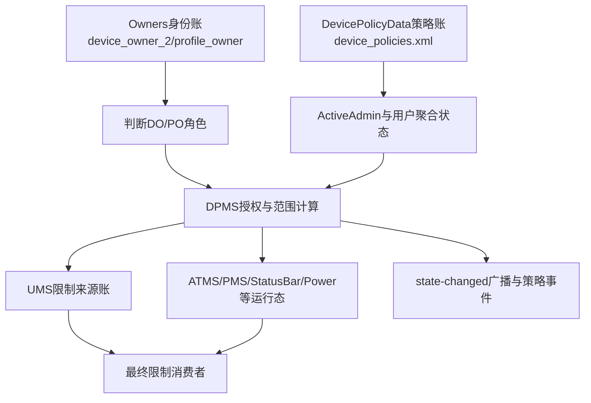
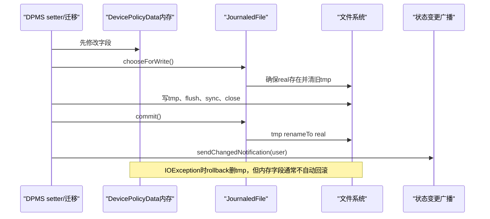
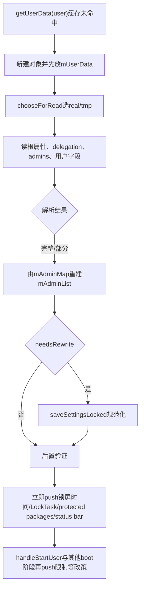

# 第 349 章 Android 企业 DevicePolicyData / ActiveAdmin XML：JournaledFile 写盘、加载迁移、Boot 恢复、通知与双账一致性链

> 源码基线：Android 11 / API 30 / `android-11.0.0_r48`。本章只做 macOS 源码阅读，不编译、不启动模拟器。第348章已经说明策略怎样进入 `ActiveAdmin`，本章继续回答：这些策略怎样保存到 `device_policies.xml`，重启后怎样恢复；`Owners` 与 `DevicePolicyData` 为什么是两本账；文件写成功、内存更新、运行态下发和广播通知为什么不是同一件事。

## 1. 本章先建立一个总认识

DPMS 的持久化不是“一份 XML 保存全部企业状态”。r48 至少要同时理解所有者身份文件、每用户策略文件、UMS 用户限制文件以及少量独立迁移元数据；它们有各自的锁、写盘机制和恢复时机。

## 2. 两本核心账分别回答什么

`Owners` 回答“谁是 Device Owner、谁是各用户的 Profile Owner”；`DevicePolicyData` 回答“这个用户有哪些 ActiveAdmin，它们分别设置了哪些政策，以及该用户还有哪些聚合状态”。前者是角色身份账，后者是策略内容账。

## 3. 身份正确不保证策略内容正确

如果 `device_owner_2.xml` 仍认定 A 是 DO，但相应用户的 `device_policies.xml` 丢失或无法解析，DPMS 可以知道“DO 是 A”，却可能找不到 A 的 `ActiveAdmin` 政策内容。很多能力随后会失败、回默认值或记录 `wtf`，不能用身份文件存在推断策略完整。

## 4. 策略内容正确也不保证身份正确

反方向同样成立：`device_policies.xml` 里可以残留某组件的 `<admin>` 及政策，但若 `Owners` 不再把它认作 DO/PO，它只可能按普通 Active Admin 身份参与允许的旧式政策，不能凭残留 XML 获得所有者特权。

## 5. 第三本账是 UMS 限制来源

第347章看到的 UserManagerService global/local/base restrictions 是已经推给 UMS 的运行与持久来源账。`ActiveAdmin.userRestrictions` 是管理员 desired state；UMS 保存的是经过 synthetic、deprecated 过滤和 global/local 分流后的来源状态，二者不是字节级镜像。

## 6. 第四类状态在消费者服务里

LockTask 包列表会下发到 ATMS，protected packages 会下发到 PMS，status bar 状态会下发到 StatusBar，maximum-time-to-lock 会影响 PowerManager。即使 DPMS 内存和 XML 都正确，消费者尚未恢复时，设备行为仍可能短暂或长期不同。

## 7. 本章的四层模型

后面统一用四层定位：①磁盘 XML；②DPMS 内存对象；③跨服务运行态；④广播/事件观察面。一次 setter 可能只保证其中部分层已经完成，不能把方法返回当成四层共同提交。

## 8. 核心源码位置

主文件是 `frameworks/base/services/devicepolicy/java/com/android/server/devicepolicy/DevicePolicyManagerService.java`，`JournaledFile` 在 `frameworks/base/core/java/com/android/internal/util/JournaledFile.java`，所有者身份文件由同目录 `Owners.java` 维护。

## 9. 本章关注的版本边界

`JournaledFile` 已标记 deprecated，源码建议新代码用 `AtomicFile`；但 r48 的 DPMS 仍使用它保存 `device_policies.xml`。后续版本可能改存储结构，因此本章的失败语义必须绑定 r48，不能直接套到新 Android。

## 10. 先看总链，而不是先背 XML tag

最重要的不是记住几十个标签，而是看清：谁触发保存、内存何时先变、临时文件怎样提交、何时发通知、重启怎样解析、解析后哪些政策立即 push、哪些等启动阶段另外恢复。

## 11. 四层账本总图



## 12. DevicePolicyData 是每用户容器

`mUserData` 是 `SparseArray<DevicePolicyData>`，key 为 userId，并由 DPMS 全局锁保护。每个对象只代表一个用户，不能看到一个 `DevicePolicyData` 就认为里面都是设备级状态；某些字段即使语义全局，也可能约定存放在 system/DO user 对象中。

## 13. 它保存管理员集合的两种视图

`mAdminMap<ComponentName, ActiveAdmin>` 便于按组件查找，`mAdminList` 便于稳定遍历与聚合。加载时先填 map，解析结束后再用 `mAdminMap.values()` 重建 list；保存时则遍历 list 写 `<admin>`。

## 14. mRemovingAdmins 不写盘

`mRemovingAdmins` 是当前进程内的删除过渡状态，不在保存逻辑中。系统在移除管理员过程中崩溃，不能靠该列表在下次启动自动精确续跑，恢复要依赖组件、Owners 状态和专门清理流程重新判断。

## 15. DevicePolicyData 的用户级字段

它含失败密码次数、password owner、setup complete、paired、provisioning state、permission policy、delegation map、已接受 CA、LockTask 包与特性、status bar、affiliation IDs、检索时间戳、初始化 Bundle、密码 token 等。

## 16. 有些字段是聚合结果而非某个 admin 的字段

例如 `mLockTaskPackages`、`mLockTaskFeatures`、`mStatusBarDisabled` 位于用户容器顶层。setter 可能根据有权的 owner 写这里，而不是放进每个 `ActiveAdmin`；诊断时必须先判断字段属于 admin 节点还是 `<policies>` 根的直接子节点。

## 17. ActiveAdmin 才是单组件政策主体

`ActiveAdmin` 持有 `DeviceAdminInfo info`，并保存密码复杂度、相机、截屏、账户、信任代理、允许包名单、用户限制、VPN、组织文案、跨资料策略等大量字段。一个用户可有多个普通 admin，但最多只有相应 Owners 规则认可的 DO/PO。

## 18. Parent ActiveAdmin 是嵌套策略面

COPE 的 parent instance 不是另一个独立广播接收器。`getParentActiveAdmin()` 使用相同 `DeviceAdminInfo` 懒创建 `isParent=true` 的嵌套对象，写在当前 admin 的 `<parent-admin>` 内，读取时递归构造。

## 19. Parent 数据不会单独出现在 mAdminMap

顶层 map 仍以真实 DeviceAdminReceiver 组件为 key。parent 对象只能通过所属 profile owner 的 `ActiveAdmin.parentAdmin` 到达，所以它的生命周期、写盘和删除都依附外层 admin。

## 20. DeviceAdminInfo 不是单纯政策值

它描述 receiver 元数据与声明的 uses-policies。保存时 `<policies>` 也会记录这组声明；加载时普通 Device Admin 与 DO/PO 对它采用不同信任规则，这是防止应用升级偷偷扩大普通管理员能力的重要兼容设计。

## 21. 文件路径按用户拆分

`getPolicyFileDirectory(userId)` 对 user0 使用注入器返回的 `/data/system/`，其他用户使用 `Environment.getUserSystemDirectory(userId)`，通常对应 `/data/system/users/<id>/`。最终文件名固定为 `device_policies.xml`。

## 22. 临时文件名

`makeJournaledFile()` 以真实路径和 `base + ".tmp"` 构造 `JournaledFile`。因此会看到 `device_policies.xml` 与 `device_policies.xml.tmp`，它们是同一份策略账的真实/临时两代，不是两个独立 schema。

## 23. user0 路径是兼容历史布局

system user 没有与其他用户完全相同的目录布局，是历史兼容结果。阅读删除、备份或厂商脚本时不要机械拼成 `/data/system/users/0/device_policies.xml`；应跟随 `getPolicyFileDirectory()`。

## 24. Owners 使用另一组路径

`Owners` 的全局文件是 `device_owner_2.xml`，各用户 Profile Owner 使用对应用户目录中的 `profile_owner.xml`，并保留旧 `device_owner.xml` 的迁移读取。它们不嵌入 `device_policies.xml`。

## 25. Owners 使用 AtomicFile

`Owners.FileReadWriter` 以 `AtomicFile.startWrite()` 开始，成功 `finishWrite()`，IOException 时 `failWrite()`。这与策略文件使用 `JournaledFile` 的提交细节不同，所以“DPMS 都有备份文件”是错误概括。

## 26. 策略文件没有 AtomicFile 的 .bak 语义

`JournaledFile` 只有 real 与 temp。读取时 real 优先；两者都存在就把 temp 当作未完成写入并删除。没有再尝试解析旧 backup 的路径，解析损坏 real 时也不会自动回退到 temp。

## 27. getUserData 是懒加载入口

`getUserData(userId)` 先在 `mUserData` 查找；没有时创建 `DevicePolicyData`，先放进 SparseArray，再调用 `loadSettingsLocked()`。因此同一次递归访问能找到对象，但也意味着加载异常后这个部分填充对象已经成为缓存值。

## 28. 为什么先放缓存再 load

加载结束可能触发 `needsRewrite -> saveSettingsLocked()`，保存又会调用 `getUserData()`。若对象未先入缓存，就会重复创建/加载甚至递归。先 append 是为这条重入链提供同一对象。

## 29. 懒加载不是每次 getter 都读盘

一旦 `mUserData` 已有对象，普通访问只返回内存，不重新解析文件。手工修改 XML 后若不重启或不触发明确的 cache reset，DPMS 不会自动看到变化；这也是禁止把直接改文件当正常管理 API 的原因。

## 30. USER_STARTED 有一次显式 cache reset

r48 接收 `ACTION_USER_STARTED` 时会在锁内 `mUserData.remove(userHandle)`，随后 `handlePackagesChanged()` 等路径可重新加载。这个动作不是任意时刻的热重载协议，且外部直接改文件仍存在并发与校验风险。

## 31. user0 加载还更新 StateCache

当 `getUserData(USER_SYSTEM)` 首次加载后，代码用 `mUserSetupComplete` 更新 `mStateCache.setDeviceProvisioned()`。这里名字容易误导：缓存值来自 system-user setup complete 这一 DPMS 数据，而不是重新读取所有 Provisioning 状态。

## 32. removeUserData 的删除边界

删除非 system user 时，DPMS 清 owner/cache、移除内存数据并删除该用户 `device_policies.xml`。它拒绝删除 user0 数据；而删除真实文件是否成功、其他服务是否已清理，还要分别看日志与用户删除总流程。

## 33. XML 根节点

策略文件根是 `<policies>`。根属性保存 restrictions provider、setup-complete、device-paired、provisioning config applied、provisioning state、permission policy 等非默认值；admin、delegation 与用户聚合字段作为子节点。

## 34. 默认值省略是 schema 的重要部分

大部分 `false`、`0`、`-1`、null 或空集合不会写入。读取依赖 Java 字段初始化值恢复默认，因此判断缺 tag 时不能说“数据丢了”，要先查该字段默认值与是否用缺失表达默认。

## 35. 省略规则不完全统一

例如 `mLockTaskFeatures` 在对象中默认 `LOCK_TASK_FEATURE_GLOBAL_ACTIONS`，保存条件却是“不等于 LOCK_TASK_FEATURE_NONE 才写”，因此默认 global-actions 会显式落盘。不能凭一般的“默认省略”推断每个字段。

## 36. delegation 的扁平写法

`mDelegationMap` 是 package 到多个 scope 的映射，但 XML 每个 `<delegation>` 只保存一组 `delegatePackage/scope`。同一包有三个 scope 就写三个平级节点，加载时再聚合并去重。

## 37. admin 的基本外形

保存循环的核心可压缩为：

```java
out.startTag(null, "admin");
out.attribute(null, "name", ap.info.getComponent().flattenToString());
ap.writeToXml(out);
out.endTag(null, "admin");
```

组件名决定加载时到 PackageManager 重新解析哪个 DeviceAdminReceiver，内部政策由 `ActiveAdmin.writeToXml()` 输出。

## 38. 组件名不是永久可信的对象快照

加载不会仅按 XML 重建一个“幽灵 admin”，而是调用 `findAdmin()` 查当前安装包、receiver 及 `BIND_DEVICE_ADMIN` 要求。组件被卸载、改名或权限不再满足时，该 admin 会被跳过。

## 39. 普通 DA 的政策声明以历史同意为准

`shouldOverwritePoliciesFromXml()` 对既非 PO 也非 DO 的 admin 返回 true，随后 `info.readPoliciesFromXml()` 用磁盘中用户当时同意的 uses-policies 覆盖当前 manifest 解析结果，防止应用更新后悄悄新增政策能力。

## 40. DO/PO 的政策声明用当前 manifest

对 Owners 已认可的 PO/DO，该函数返回 false，不用旧 XML 覆盖当前 `DeviceAdminInfo`。因此 `<policies>` 虽仍被写出，但加载时它对 owner 与普通 DA 的作用不同，不能把 tag 存在理解成所有角色都使用磁盘声明。

## 41. ActiveAdmin 字段按非默认值写

以相机为例，`disableCamera=true` 才写 `<disable-camera value="true">`；false 不写。密码字段通常只有不同于各自 DEF 常量才写；列表则依据 null/empty 的语义决定是否写外层节点。

## 42. 反向默认值尤其容易看错

`disableBluetoothContactSharing` 默认 true，代码只在它为 false 时写 tag。缺失此 tag 表示“禁用蓝牙联系人共享”为真，而不是 false；阅读 XML 必须回到字段初始化，不能统一用布尔缺失=false。

## 43. null 与 empty 列表需要保真

允许 Accessibility/IME 等名单里，null 常表示“不限制”，empty 表示“只允许动态追加的系统项”。写辅助函数对 null 直接不写，对 empty 会写空外层节点，从而让重启后仍能区分两种状态。

## 44. calendar 包名单还有显式 null tag

Cross-profile calendar packages 使用专门的 `cross-profile-calendar-packages-null` 表达 null，因为其历史/读取语义需要显式保留。不同字段的 null 编码方式不统一，迁移工具必须逐 schema 处理。

## 45. UserRestrictions 由专用工具序列化

`ActiveAdmin.userRestrictions` 交给 `UserRestrictionsUtils.writeRestrictions()`；它只保存允许持久化的已知限制。不能假设 Bundle 中每个临时/未知 key 都原样出现在 XML。

## 46. default-enabled restrictions 是迁移记忆

`defaultEnabledRestrictionsAlreadySet` 记录系统已替该 PO 补过哪些默认 restriction。它不是 effective restriction 本身，而是防止下一次升级/启动再次把管理员主动清掉的默认值加回来。

## 47. ParentAdmin 递归保存

外层 admin 非 null 的 parent 对象会写 `<parent-admin>`，内部再次走 `writeToXml()`。递归深度由代码约束：parent 对象读取到另一个 parent tag 会判非法，避免无限嵌套。

## 48. 一个简化 XML 形状

```xml
<policies setup-complete="true">
  <delegation delegatePackage="com.example.delegate" scope="cert-install"/>
  <admin name="com.example.dpc/.AdminReceiver">
    <policies>...</policies>
    <disable-camera value="true"/>
    <user-restrictions>...</user-restrictions>
    <parent-admin>...</parent-admin>
  </admin>
  <lock-task-features value="16"/>
</policies>
```

它只展示层级，不代表所有字段和数值；实际排查应以当前 r48 常量与生成文件为准。

## 49. saveSettingsLocked 运行在 DPMS 锁内

方法名与调用约定表明它要求持有 `getLockObject()`。XML 序列化、fsync 和 rename 都可能在锁内发生，因此大文件或慢存储会拉长其他 DevicePolicy Binder 调用等待时间。

## 50. 每次 save 创建新的 JournaledFile

`makeJournaledFile()` 每次返回新对象。`JournaledFile.mWriting` 只能阻止同一实例重复 `chooseForWrite()`，不能跨两次 save 提供全局互斥；真正串行化依靠 DPMS 锁，而不是 JournaledFile 自身。

## 51. 保存与提交流程图



## 52. chooseForWrite 为什么先建空 real

若 real 不存在，它尝试 `createNewFile()`。目的是写 tmp 期间让 `chooseForRead()` 看到 real 已存在，从而不会把尚未完成的 tmp 当成有效文件提升；这是一种读写代际协议。

## 53. createNewFile 失败被忽略

`JournaledFile` 捕获该 IOException 后继续返回 tmp。随后 FileOutputStream 可能仍成功或失败；若 real 仍不存在而进程在 tmp 写一半时崩溃，下次 read 会把唯一 tmp 选作输入并尝试 rename，因此此处不具备强事务保证。

## 54. 旧 tmp 会先被删除

开始新写前若 tmp 存在就调用 delete，返回值未检查。删除失败后对同一路径打开 FileOutputStream 通常会截断或失败，具体结果受文件系统影响；源码没有把“旧 tmp 删除成功”作为显式前置条件。

## 55. 真正内容写入 tmp

DPMS 用 `FileOutputStream(file, false)` 与 `FastXmlSerializer` 写完整文档。结束时调用 `endDocument()`、`flush()`，再 `FileUtils.sync(stream)`，然后 close；只有这些完成后才 `journal.commit()`。

## 56. sync 的意义

flush 只把 Java/用户态缓冲交给下层，`FileUtils.sync()` 尝试让数据到持久介质。它降低断电丢失窗口，但不能把多文件更新变成事务，也不能保证目录项 rename 在所有故障模型下绝对持久。

## 57. commit 只做 renameTo

`JournaledFile.commit()` 清 `mWriting`，随后执行 `mTemp.renameTo(mReal)`。关键点是它没有检查或返回 rename 的 boolean；调用方因此无法确认新代确实替换 real。

## 58. rename 失败可能仍走成功通知

只要前面没抛被捕获的异常，commit 即使静默 rename 失败，`saveSettingsLocked()` 仍继续 `sendChangedNotification()`。因此该广播严格来说表示保存流程走完了成功分支，不是可验证的磁盘 durability acknowledgement。

## 59. rename 失败后的下次读取

若旧 real 仍存在且新 tmp 也存在，`chooseForRead()` 选择 real 并删除 tmp，于是旧策略胜出；若 real 不存在而 tmp 存在，则选择 tmp 并尝试提升为 real。结果取决于两文件存在组合。

## 60. IOException 的 rollback

DPMS 捕获 `XmlPullParserException | IOException`，记录日志、关闭 stream，并在仍处于 writing 状态时 `rollback()` 删除 tmp。real 应保持旧代，但内存对象已在 setter 里先改变，代码通常不会把字段恢复成旧值。

## 61. 内存成功与磁盘失败的分叉

例如 setter 先把 `ActiveAdmin.disableCamera=true`，save 失败后当前进程里的 getter 仍可能返回 true，后续 push 也可能按 true 工作；重启却从旧 real 恢复 false。这是现场“当时有效，重启丢失”的典型链。

## 62. RuntimeException 不在保存 catch 集合

序列化数据若触发 `IllegalStateException`、`IllegalArgumentException` 等运行时异常，`saveSettingsLocked()` 的指定 catch 不会兜住。它可能越过正常 rollback 与通知路径，最终由更外层 Binder/系统服务异常处理；不能把所有保存失败都归为日志后继续。

## 63. 文件成功也不等于消费者成功

很多 setter 在 save 前后还调用其他服务。跨服务 Binder 异常、异步 handler 或消费者重启都可能让 XML 已是新值而运行态仍旧；保存方法本身没有一个通用循环把所有 ActiveAdmin 政策全部重新下发。

## 64. 通知只在 save 成功分支发送

正常序列化并 commit 后才调用 `sendChangedNotification(userHandle)`。IOException rollback 分支不发；`needsRewrite` 引发的成功保存也会发，即便没有 DPC 在此刻主动调用 setter。

## 65. 通知的 Intent

它发送 `DevicePolicyManager.ACTION_DEVICE_POLICY_MANAGER_STATE_CHANGED`，带 `FLAG_RECEIVER_REGISTERED_ONLY`，并以受影响 user 发送。广播没有告诉接收方具体哪个 admin、哪个字段或旧新值。

## 66. REGISTERED_ONLY 的含义

只有当时已注册的 receiver 能收到，manifest 静态接收器不会因它被冷启动。它更像进程内/在线组件刷新提示，不是可重放审计日志，也不能用于崩溃后恢复事务。

## 67. state changed 与 policy event 不同

DevicePolicyEventLogger/SecurityLog 记录特定 API 事件；state-changed 是宽泛刷新信号。某 setter 可写事件、保存 XML、push 服务，三者发生顺序和失败边界不同，审计时不能用其中一个替代另外两个。

## 68. state changed 与 UMS restriction changed 也不同

用户限制变化还可能触发 UMS 的 restriction listener / `ACTION_USER_RESTRICTIONS_CHANGED`。若 ActiveAdmin 文件保存了同值或某个来源变化但 effective 不变，两类通知的发生条件可能不同。

## 69. loadSettingsLocked 先 chooseForRead

real 存在时永远读 real，并删除同时存在的 tmp；real 不存在且 tmp 存在时读 tmp，并尝试 rename 到 real；二者都不存在则返回 real 路径，打开后产生 FileNotFoundException。

## 70. 文件不存在是正常初始状态

`FileNotFoundException` 被单独静默捕获，因为新用户或从未设置策略的用户本来就没有文件。此时保留 `DevicePolicyData` 构造默认值，不应在日志里制造误报警。

## 71. 根标签必须是 policies

解析器先找首个 start tag，并要求名字是 `policies`。错误根会抛 `XmlPullParserException`，进入通用失败日志；没有容忍任意外层包裹节点。

## 72. 根属性先恢复

解析 setup、paired、provisioning state、permission policy 等；布尔属性大多只有字符串精确为 `true` 才置真，数字通过 `Integer.parseInt()`。坏数字会中断后续整个顶层解析。

## 73. 旧 delegation 属性触发迁移

pre-O 的 delegated cert installer 与 app restrictions manager 曾作为根属性保存。r48 读取后转换进 `mDelegationMap` 的现代 scope 列表，并设置 `needsRewrite=true`，稍后重写成平级 `<delegation>` 节点。

## 74. 开始读子节点前只清部分集合

代码清空 LockTask 包、admin list/map、affiliation IDs、owner installed certs、protected packages。它没有统一 `new DevicePolicyData` 替换所有字段；正常懒加载对象是新建的，所以其他字段靠构造默认。

## 75. 重复对旧对象 load 的风险

若未来或测试直接对已污染对象再次调用 load，未被显式清空的集合/标志可能保留旧值，尤其解析中途失败时更复杂。r48 正常主链通过新对象或先 remove cache 降低此风险，但该方法本身不是完整“覆盖式反序列化器”。

## 76. admin 加载先重新验证组件

对 `<admin name>` 调 `findAdmin(..., throwForMissingPermission=false)`。找不到或不合格时不会盲信 XML；合法时才创建新的 `ActiveAdmin` 并读取内部字段，最后放入 `mAdminMap`。

## 77. 单个 admin 的 RuntimeException 被隔离

每个 admin 块外围有 `catch (RuntimeException)`，失败会记录“Failed loading admin”并继续顶层循环。设计目标是一个坏 admin 尽量不拖垮其他 admin 和用户级字段。

## 78. 隔离不是完全无副作用回滚

`ActiveAdmin` 在异常前已解析的字段留在局部对象中，但由于 put map 在 read 完成之后，失败对象通常不会加入 map。不过解析器位置是否已越过完整 admin 取决于异常点，后续顶层循环可能从嵌套位置继续，容错不是事务解析。

## 79. 已知顶层数字坏会终止整文件

顶层 `Integer.parseInt/Long.parseLong` 抛出的 NumberFormatException 由外层 catch 捕获，后续节点不再读取。前面已经装入 map/集合的内容仍保留，形成“前半份新值+后半份默认值”的部分状态。

## 80. 未知顶层 tag 可跳过

不认识的 tag 只记录 warning，并调用 `XmlUtils.skipCurrentTag(parser)`。这提供基本的向前兼容：新版本额外节点被旧版看到时，不必必然终止整个文件。

## 81. 已知 tag 坏与未知 tag 的区别

未知 tag 可以整体跳过；已知 tag 若属性缺失导致 NPE、数字非法或内部恢复抛受捕获异常，则常终止余下文件。schema 演进应优先新增可跳过节点，并为属性默认/校验设计兼容路径。

## 82. 外层 catch 的范围

它捕获 `NullPointerException`、`NumberFormatException`、`XmlPullParserException`、`IOException`、`IndexOutOfBoundsException` 并记录失败。没有 backup parse 或恢复旧对象的动作，所以异常后继续使用当前部分填充的 policy。

## 83. 解析失败不会自动删坏 real

`chooseForRead()` 只根据存在性选择，不验证 XML。坏 real 仍保留，下次进程重启还会再次失败；除非后续正常 setter/迁移成功重写，或专门修复文件。

## 84. load 结束会重建 adminList

不论正常还是外层 catch 后，代码都执行 `policy.mAdminList.addAll(policy.mAdminMap.values())`。因此后续聚合只看到成功进入 map 的 admin；解析失败的 admin 不会以半对象出现在 list。

## 85. needsRewrite 会在加载后保存

遇到旧 delegation 或旧 active-password 指标时，解析结束后调用 `saveSettingsLocked()`，把内存中的现代形状写回。这是读时 schema 迁移，不需要 DPC 主动改政策。

## 86. 迁移与解析失败的组合风险

`needsRewrite` 若在文件前部已被置 true，而后面又发生外层解析异常，函数仍会走到 rewrite。这样可能把“已解析前半+默认后半”的部分状态固化；源码没有用“全文件解析成功”布尔值阻止 rewrite，排查损坏文件时要特别警惕。

## 87. 迁移保存可能发 state-changed

因为 rewrite 直接走 `saveSettingsLocked()`，成功后也会发送 DPM state changed。接收方看到广播不一定意味着用户刚改政策，可能只是启动期间把旧 schema 规范化。

## 88. validatePasswordOwner 是后置修正

解析/重建 list 后调用 `validatePasswordOwnerLocked(policy)`，确认记录的 password owner UID 仍对应使用 reset-password 政策的 active admin；无效时将其重置并可能保存，避免持久旧 UID 永久占位。

## 89. load 后立即恢复 MaximumTimeToLock

`updateMaximumTimeToLockLocked(userHandle)` 聚合当前 admin 的最大锁屏时间并推向 PowerManager/相关缓存。它说明 load 不只是反序列化，也包含部分运行态恢复副作用。

## 90. load 后立即恢复 LockTask

代码调用 `updateLockTaskPackagesLocked()` 与 `updateLockTaskFeaturesLocked()`，分别下发到 ActivityManager/ActivityTaskManager。即使没有 owner app 正在运行，磁盘政策也能在加载时重新成为系统运行态。

## 91. 加载与启动恢复图



## 92. Protected packages 的立即恢复

`updateUserControlDisabledPackagesLocked()` 把顶层列表交给 `PackageManagerInternal.setDeviceOwnerProtectedPackages()`。第329章提到这是 PMS 单一运行列表；任意用户 load 都会调用，因而多用户空列表覆盖问题要结合调用顺序审计。

## 93. StatusBar 只在 true 时恢复

load 末尾仅当 `mStatusBarDisabled` 为 true 才调用 `setStatusBarDisabledInternal(true,user)`。false 不主动下发“启用”，默认服务初始化通常负责正常状态；若存在旧运行态残留，不能假设本函数必做双向校正。

## 94. load 没有一次性 push 所有 ActiveAdmin 政策

相机、截屏、用户限制、网络日志、force ephemeral、会话消息等有各自消费者和恢复时机。看到 load 末尾几个 update 不应推导“这里统一恢复全部 DPM 政策”。

## 95. Owners 在构造期更早加载

DPMS 构造过程中注册 restriction listener 后调用 `loadOwners()`。这先建立 DO/PO 身份并向 UserManagerInternal、PackageManagerInternal、AM/ATMS、AppOps 等发布 owner 身份；具体 `DevicePolicyData` 则继续懒加载。

## 96. 为什么身份必须更早可用

后面加载 admin 时要调用 `shouldOverwritePoliciesFromXml()` 判断组件是不是 DO/PO；授权、用户 managed 标记和 AppOps 也需要早期知道 owner。若反过来先按普通 DA 读 policies，安全语义会不同。

## 97. onLockSettingsReady 首先加载 user0 策略

该阶段先迁移旧用户限制，再 `getUserData(USER_SYSTEM)`，清理旧用户、补 profile owner 默认限制并 `handleStartUser(USER_SYSTEM)`。所以 system user 的 DevicePolicyData 在 LockSettings ready 阶段明确进入内存。

## 98. handleStartUser 推用户限制

`handleStartUser(userId)` 更新 screen capture、调用 `pushUserRestrictions(userId)`、更新密码质量缓存并启动 owner service。`pushUserRestrictions` 访问 DevicePolicyData，因此其他用户通常在启动相关路径上完成懒加载与限制恢复。

## 99. force ephemeral 在另一个启动片段恢复

`onLockSettingsReady()` 取得 DO ActiveAdmin 后，将 `forceEphemeralUsers` 推给 UserManagerInternal，同时把开始/结束用户会话消息推给 ActivityManagerInternal。这些不在 `loadSettingsLocked()` 通用尾部。

## 100. keep-uninstalled 也单独恢复

该阶段读取 Device Owner 的 keep-uninstalled packages，非 null 时交给 PMS。它再次证明恢复分散于功能代码：仅审查 load 末尾会漏掉重要 policy。

## 101. Owner Service 启动不负责所有恢复

`handleStartUser()` 最后启动 DO/PO 持久服务，是让 DPC 获得运行机会；系统政策本身不能依赖 DPC 收到回调后才生效，否则 DPC 未解锁、崩溃或未响应会造成安全窗口。

## 102. Owners 的 legacy 文件迁移

`Owners.load()` 优先尝试旧 `device_owner.xml`；成功后分别写现代 device owner 与各 user profile owner 文件，再删除 legacy。迁移是多文件顺序操作，不是一个覆盖所有文件的原子事务。

## 103. Owners 读取严格度与 DevicePolicyData 不同

现代 Owners `FileReadWriter` 遇到未知二级 tag 会返回 false 终止该文件读取，而 DevicePolicyData 顶层未知 tag 会 warning 后 skip。两种 schema 的向前兼容策略不同，不能把一个文件的容错结论套到另一个。

## 104. Owners 写空状态会删除文件

`shouldWrite()` 为 false 时直接删除对应 owner 文件；DevicePolicyData 即使没有 admin，也可能因为 setup/provisioning 等用户状态仍需存在。文件不存在在两套账里的含义不同。

## 105. 双账提交没有共同事务

设置或迁移 owner 时，Owners identity、ActiveAdmin policy、UMS restrictions、PackageManager managed bits 等按代码顺序分别改变。中途崩溃可能留下身份已提交但 policy 未提交，或 policy 已保存而运行消费者未更新。

## 106. Ownership transfer 为何需要独立元数据

转移 DO/PO 涉及旧新组件、Owners 身份和 ActiveAdmin 内容的跨文件改变，普通 Journaled/Atomic 单文件协议无法覆盖。DPMS 使用 transfer metadata 标记进行中状态；启动若仍发现元数据，就调用 `revertTransferOwnershipIfNecessaryLocked()` 回滚。

## 107. 回滚也不是时间倒流

专门恢复流程只能按已记录信息重新设置 owner/admin；转移期间已经发出的广播、日志、外部服务观察和应用副作用不可能全部撤销。所谓 revert 是让核心持久状态重新一致，不是全系统 ACID rollback。

## 108. 现场排查“重启后策略消失”

按顺序核对 setter 前后字段、保存日志、real/tmp 存在组合、XML 是否含 tag、启动解析异常、admin 组件能否被 `findAdmin()` 找到、是否被 Owners 认作 owner，以及对应功能是否在 boot 阶段重新 push。

## 109. 现场排查“XML 对但行为错”

先确认 DPMS 已加载的是同一 user 的最新对象，再追该政策的运行消费者；检查 load 是否立即 push、handleStartUser 是否调用、Binder 下发是否失败、服务后来是否重启覆盖，以及 UMS effective 是否被其他来源影响。

## 110. 现场排查“广播到了但磁盘还是旧值”

重点怀疑 JournaledFile commit 的 rename boolean 未检查，或观察的是错误 user 的文件。广播只能证明控制流到达成功分支；应比较 real/tmp、mtime、内容与日志，不能把广播当 fsync/rename 成功凭证。

## 111. 本章心智模型

把 DPMS 持久化想成“身份索引 + 每用户政策文档 + 外部派生账”。启动时先用身份索引决定谁可信，再懒加载政策文档，最后按功能分批重建外部运行态；任何跨文件/跨服务组合都不是单次原子提交。

## 112. macOS只读练习一：画出两个文件的字段归属

只用 `rg` 和编辑器，分别阅读 `Owners.java` 的 `DeviceOwnerReadWriter/ProfileOwnerReadWriter` 与 DPMS 的 `saveSettingsLocked()`。把 owner component、owner userId、system update policy、disableCamera、LockTask packages、delegation 六项放入正确文件，并说明原因。

## 113. macOS只读练习二：手推 JournaledFile 崩溃矩阵

列出 real/tmp 的四种存在组合，逐行写 `chooseForRead()` 选择、删除与 rename 动作；再加入“tmp 写到一半崩溃”“commit rename 静默失败”两场景，判断下次启动可能读到新代、旧代、半文件还是 FileNotFound。

## 114. macOS只读练习三：构造部分解析思维实验

假设 XML 前部有 legacy delegation，随后一个顶层 long 属性写成 `abc`，后面还有第二个 admin。沿 `needsRewrite`、外层 catch、adminMap 重建与 save 顺序写出最终内存/磁盘可能内容，解释为什么这不是全有或全无解析。

## 115. macOS只读练习四：追一项启动恢复

任选 `DISALLOW_CAMERA`、LockTask packages 或 force ephemeral，从文件字段开始，追 `getUserData/loadSettingsLocked`、对应 boot/start 方法、跨服务调用和最终消费者。标注每一步所在进程、锁/线程、是否同步以及失败后哪一层仍保留旧状态。

## 116. 本章检查题

为什么 `device_owner_2.xml` 存在不代表 DO 政策完整？为什么 save IOException 后当前进程可能仍表现为新政策？为什么未知 tag 常可跳过而坏数字会丢掉后半文件？为什么收到 state-changed 不能证明 rename 成功？

## 117. 复读修正一：JournaledFile 不是标准备份恢复

初读 real/tmp 容易误称“双文件备份”。源码明确 real 优先且两者并存时删除 tmp，解析 real 失败也不退回 tmp；它只是未完成写代协议，可靠性弱于带受检 finish/fail 语义的完整事务想象。

## 118. 复读修正二：loadSettingsLocked 不是纯读取

它可能迁移并重写文件、验证 password owner、下发 LockTask/protected packages/最大锁屏时间/status bar，因而有文件和跨服务副作用。测试它时不能只断言反序列化对象，也要隔离这些依赖。

## 119. 复读修正三：Boot 恢复不是一个函数

Owners 构造期加载身份，user0 在 LockSettings ready 加载，其他用户按访问/启动懒加载；部分政策在 load 尾部 push，restriction 在 handleStartUser push，force ephemeral 与会话消息又在 onLockSettingsReady 单独恢复。文档已按时间线拆开，避免“读 XML 后全部生效”的误解。

## 120. 本章结论与下一章

第349章完成了 r48 DevicePolicy 持久化四层模型：Owners 管身份，DevicePolicyData/ActiveAdmin 管每用户 desired，JournaledFile 管单文件代际，boot 功能路径分批重建运行态，跨账无共同事务。下一章专门深入 `Owners/OwnerInfo`：现代与 legacy 文件、managed bits、向 PMS/AM/AppOps 发布身份、所有权建立/清除/转移的提交顺序与崩溃恢复。
