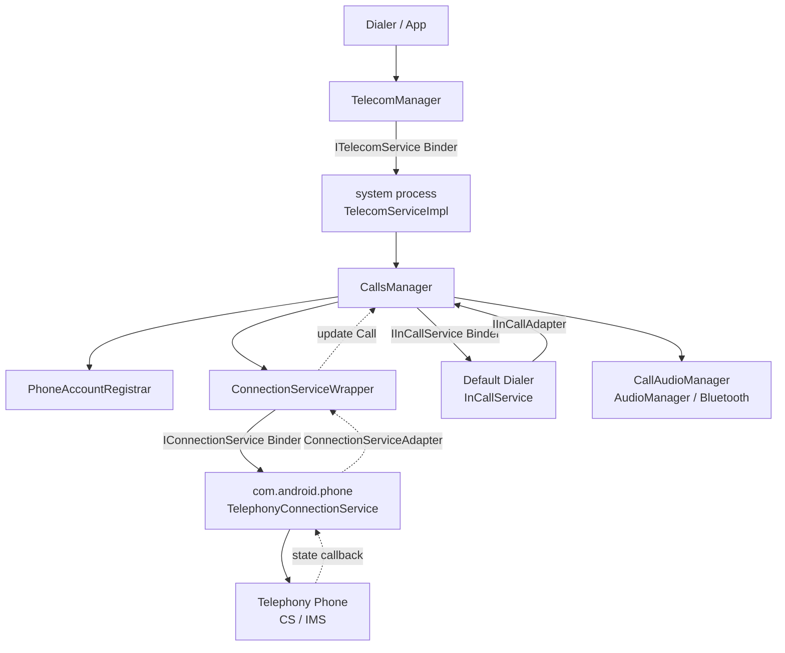
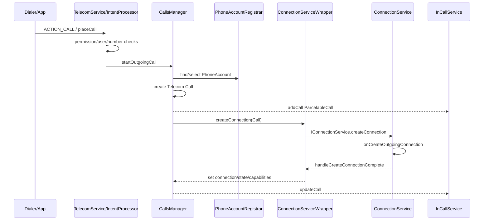
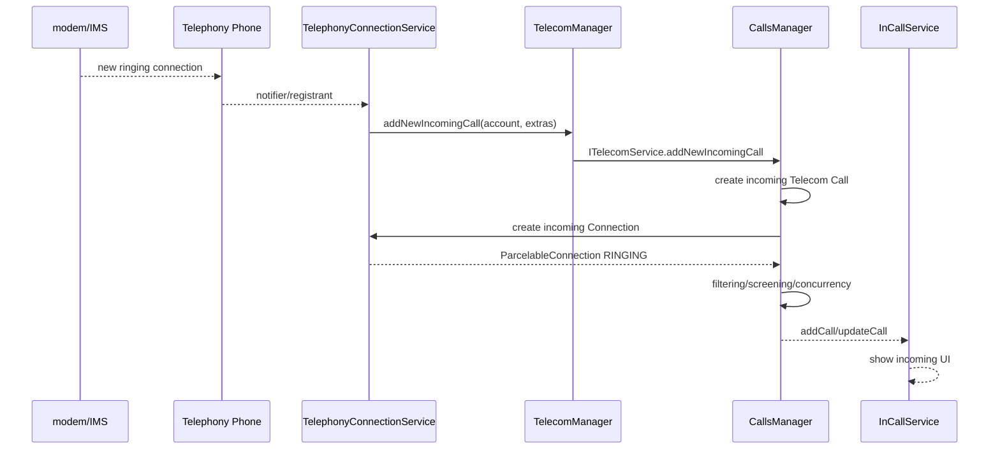
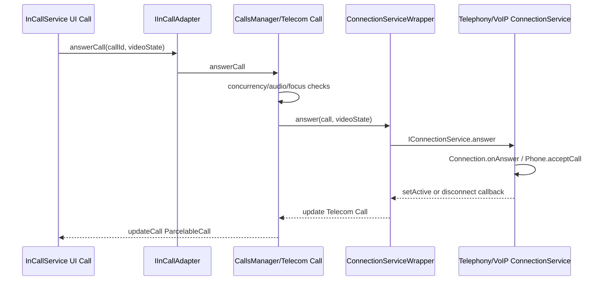

# 35 Android Telecom、CallsManager 与 InCallService

> 源码版本：Android 11 / API 30 / `android-11.0.0_r48`  
> 学习方式：macOS 只读源码，不要求编译  
> 前置章节：[17 Service 与跨进程组件](./17-Service与ContentProvider跨进程组件.md)、[28 音频系统](./28-Android音频系统AudioFlinger与AudioPolicy.md)、[34 Telephony 与 RIL](./34-Android电话系统TelephonyFramework与RIL.md)

Telecom 是 Android 的“统一通话编排层”。它不负责 LTE 驻网或直接向基带下 `dial` 命令，而是把蜂窝电话、SIP/VoIP、自管理通话等不同来源统一成 `Call`，选择 `PhoneAccount` 和 `ConnectionService`，绑定 InCallService 展示 UI，并协调铃声、焦点、通话音频路由、蓝牙和通话记录。

本章回答：

1. `ACTION_CALL` 或 `TelecomManager.placeCall()` 怎样变成一条 Telecom Call？
2. Telecom Call、ConnectionService Connection、Telephony Connection 有何区别？
3. PhoneAccount 怎样决定电话走哪张 SIM 或哪个 VoIP 服务？
4. 来电怎样从 Telephony 反向进入 Telecom 并显示界面？
5. InCallService 为什么只负责 UI/控制，不拥有真实通话？
6. 接听、挂断、保持、蓝牙切换怎样往返 ConnectionService？

---

## 1. 总体架构



---

## 2. Telecom、Telephony、Dialer 再区分一次

```text
Telecom：统一 Call 模型与编排
Telephony：蜂窝/IMS Phone、SIM、RIL、基带
Dialer/InCallService：拨号和通话用户界面
```

默认 Dialer 可以被用户更换；Telecom 仍是系统可信中枢。TelephonyConnectionService 只是 Telecom 可选择的一种 ConnectionService。

---

## 3. Android 11 的进程模型

`packages/services/Telecomm` 虽然是一个 core system APK，但其 application 和核心 `TelecomService` 声明 `android:process="system"`，所以主要 TelecomSystem/CallsManager 运行在 system process。

其他角色：

- 默认 Dialer/InCallService：Dialer 自己的进程。
- TelephonyConnectionService：`com.android.phone`。
- 第三方 VoIP ConnectionService：对应 App 进程。
- 蓝牙/音频系统：各自服务进程或 system_server/native 服务。

看到“Telecomm APK”不能直接推断所有代码运行在独立 `com.android.server.telecom` 进程。

---

## 4. 核心源码入口

```text
frameworks/base/telecomm/java/android/telecom/TelecomManager.java
frameworks/base/telecomm/java/android/telecom/PhoneAccount.java
frameworks/base/telecomm/java/android/telecom/PhoneAccountHandle.java
frameworks/base/telecomm/java/android/telecom/ConnectionService.java
frameworks/base/telecomm/java/android/telecom/Connection.java
frameworks/base/telecomm/java/android/telecom/InCallService.java
frameworks/base/telecomm/java/android/telecom/InCallAdapter.java
frameworks/base/telecomm/java/android/telecom/ParcelableCall.java

packages/services/Telecomm/src/com/android/server/telecom/TelecomSystem.java
packages/services/Telecomm/src/com/android/server/telecom/TelecomServiceImpl.java
packages/services/Telecomm/src/com/android/server/telecom/CallsManager.java
packages/services/Telecomm/src/com/android/server/telecom/Call.java
packages/services/Telecomm/src/com/android/server/telecom/PhoneAccountRegistrar.java
packages/services/Telecomm/src/com/android/server/telecom/ConnectionServiceWrapper.java
packages/services/Telecomm/src/com/android/server/telecom/InCallController.java
packages/services/Telecomm/src/com/android/server/telecom/CallAudioManager.java

packages/services/Telephony/src/com/android/services/telephony/TelephonyConnectionService.java
packages/services/Telephony/src/com/android/services/telephony/TelephonyConnection.java
packages/services/Telephony/src/com/android/services/telephony/PstnIncomingCallNotifier.java
```

---

## 5. TelecomSystem

`TelecomSystem` 是 Telecom 核心对象图的组装入口，创建或连接：

- CallsManager。
- PhoneAccountRegistrar。
- TelecomServiceImpl。
- InCallController。
- CallAudioManager、Ringer。
- ConnectionServiceRepository。
- MissedCallNotifier、CallLogManager。
- screening/redirection 等辅助模块。

它维护共享 `SyncRoot`，大量 Telecom 操作在同一锁下保持 Call 集合和状态一致。

---

## 6. TelecomServiceImpl

`TelecomServiceImpl` 实现 `ITelecomService.Stub`，是 `TelecomManager` 的系统端入口，负责：

- 身份和权限校验。
- package/UID/user 检查。
- PhoneAccount 注册查询。
- placeCall/addNewIncomingCall。
- 默认 Dialer、call capable accounts。
- 通话状态和系统管理 API。

它是 Binder 边界，不是所有呼叫状态机逻辑；通过锁后主要委托 CallsManager 等对象。

---

## 7. CallsManager

CallsManager 是核心编排者，维护当前 `Call` 集合，并处理：

- outgoing/incoming/unknown call。
- PhoneAccount 选择。
- 创建 Connection。
- 并发、保持、前台/响铃 Call 规则。
- listener 通知。
- InCall UI 绑定。
- 音频、铃声、通话记录协调。
- screening、redirection、handover。

它不直接发 RIL 命令，真实通话动作交给 ConnectionService。

---

## 8. Telecom Call 是中枢对象

`com.android.server.telecom.Call` 保存：

- Telecom callId。
- handle（如 `tel:` URI）。
- state。
- target PhoneAccountHandle。
- ConnectionServiceWrapper。
- capabilities/properties。
- parent/children/conferenceable calls。
- video provider/state。
- disconnect cause。
- caller info、extras。

Call 是 Telecom 对一通电话的权威视图，但底层通话仍由 ConnectionService/Telephony 维持。

---

## 9. 四种容易同名的对象

| 对象 | 所在层 | 作用 |
|---|---|---|
| Telecom `Call` | system process | 跨通话实现的统一系统模型 |
| Framework `Connection` | ConnectionService 进程 | 服务端对真实连接的抽象 |
| Telephony `TelephonyConnection` | com.android.phone | 把 Telephony Phone Connection 适配为 Telecom Connection |
| InCallService `Call` | Dialer 进程 | `ParcelableCall` 的客户端 UI 模型 |

它们会互相同步，但不是同一个 Java 对象跨进程共享。

---

## 10. CallId 也不是全局唯一业务 ID

Telecom 为 Call 分配 ID；ConnectionServiceWrapper 用 `CallIdMapper` 把 Telecom Call 映射为传给远端 ConnectionService 的字符串 ID；InCallController 再把 ParcelableCall 交给 UI。

底层 Telephony 还有 modem call index。各 ID 只在相应连接/会话内有效，不能把 Telecom callId 当 RIL call index。

---

## 11. Call 状态

常见状态：

```text
NEW
CONNECTING
SELECT_PHONE_ACCOUNT
DIALING
RINGING
ACTIVE
ON_HOLD
DISCONNECTING
DISCONNECTED
ABORTED
AUDIO_PROCESSING / SIMULATED_RINGING（特定流程）
```

状态迁移由 CallsManager 统一设置和通知。ConnectionService 报告的 Connection state 会被转换，但两边状态枚举不应机械认为完全一一对应。

---

## 12. PhoneAccount

PhoneAccount 表示能承载电话的一项账户/能力，例如：

- SIM 1 蜂窝账户。
- SIM 2 蜂窝账户。
- SIP/VoIP 账户。
- self-managed calling account。

包含：

- PhoneAccountHandle。
- label/address/subscription address。
- capabilities。
- supported URI schemes。
- icon、extras。
- enabled 状态。

它不是 SIM 卡对象，但 Telephony 会为 subscription 注册对应 PhoneAccount。

---

## 13. PhoneAccountHandle

由：

```text
ComponentName（哪个 ConnectionService）
ID（该服务内账户标识）
UserHandle
```

组成。它既告诉 Telecom 绑定哪个服务，也标识服务中的具体账户。

同一个 ConnectionService 可提供多个 PhoneAccount；同一个用户和工作资料的账户也必须隔离。

---

## 14. PhoneAccountRegistrar

负责：

- 注册/注销和持久化 PhoneAccounts。
- 按 user 查询 call capable accounts。
- 默认 outgoing account。
- SIM call manager。
- enabled、scheme、capability 过滤。
- subscription/account 变化通知。

CallsManager 选择账户时依赖它。账户存在不等于 enabled，也不等于支持当前 URI scheme/video/emergency。

---

## 15. 默认 Dialer 与 ROLE_DIALER

Android 10+ 使用 RoleManager 管默认 Dialer。默认 Dialer通常提供：

- 拨号 UI。
- `InCallService`。
- 通话记录/未接来电 UI。
- `ACTION_DIAL`/`ACTION_CALL` 用户体验。

系统还可能绑定 system InCallService、car mode InCallService、non-UI InCallService。并非永远只绑定一个 UI 服务。

---

## 16. 拨号入口的差异

```text
ACTION_DIAL：只打开拨号界面，通常不直接发起通话
ACTION_CALL：请求呼叫普通号码，需要 CALL_PHONE
ACTION_CALL_PRIVILEGED：系统/特权拨号器，可处理更高权限号码
ACTION_CALL_EMERGENCY：只允许紧急号码的特权入口
TelecomManager.placeCall：通过 ITelecomService 发起
```

普通 App 不能用 `ACTION_CALL` 绕过紧急呼叫保护。

---

## 17. UserCallActivity 与 CallIntentProcessor

Telecomm manifest 中 `UserCallActivity` 接收用户发起的 call Intent，并交给 `UserCallIntentProcessor`/`CallIntentProcessor`。其工作包括：

- 校验 action/data。
- 当前 user 和 calling package。
- 规范化 handle。
- 转到 outgoing call 流程。

某些入口通过 system process trampoline，以确保 TelecomSystem 可用和调用身份正确。

---

## 18. NewOutgoingCallIntentBroadcaster

Android 11 仍包含 outgoing call broadcast/重写相关兼容流程，同时受权限、默认 Dialer和紧急号码限制。

它可能允许受信任组件取消或重写普通号码，但紧急呼叫不会交给普通应用任意拦截/改写。

新版本引入的 CallRedirectionService 是更结构化的重定向机制，本工程两类兼容路径可能并存。

---

## 19. Outgoing Call 总体时序



UI 可在底层 Connection 创建完成前就看到 CONNECTING/SELECT_PHONE_ACCOUNT 状态。

---

## 20. startOutgoingCall 做什么

CallsManager 的 outgoing 流程会判断：

- handle 和 scheme。
- 是否 emergency。
- 指定/默认 PhoneAccount。
- 是否要用户选择账户。
- 当前 Call 数量和并发能力。
- 是否需要断开/保持其他 Call。
- video、TTY、handover 等条件。
- call redirection/screening 策略。

它创建的是 Telecom Call，之后才进入 `placeOutgoingCall` 和 ConnectionService 创建。

---

## 21. SELECT_PHONE_ACCOUNT

双卡或多个 VoIP 账户且没有可自动决定的默认项时，Call 进入 `SELECT_PHONE_ACCOUNT`。InCall UI 展示账户选择，用户通过 InCallAdapter 回传 PhoneAccountHandle，然后继续 createConnection。

因此“点击拨号后没立即 DIALING”可能是等待账户选择，不是 Telephony 卡住。

---

## 22. ConnectionService 是什么

`android.telecom.ConnectionService` 是通话实现对 Telecom 的标准服务接口。实现者负责创建和控制 `Connection`：

- `onCreateOutgoingConnection()`。
- `onCreateIncomingConnection()`。
- `onCreateUnknownConnection()`。
- conference、handover 等。

蜂窝实现是 TelephonyConnectionService；VoIP App 也可实现 managed/self-managed ConnectionService。

---

## 23. ConnectionServiceWrapper

Telecom 不能直接持有远程 Connection 对象。`ConnectionServiceWrapper`：

- 按 ComponentName/user 绑定服务。
- 持有 `IConnectionService` Binder。
- 用 CallIdMapper 管 ID。
- 发 create/answer/reject/hold/disconnect 等命令。
- 接收 `IConnectionServiceAdapter` 回调。
- 在 service death 时断开相关 Calls。

它是 Telecom Call 与远端 ConnectionService 的 Binder 桥。

---

## 24. CreateConnectionProcessor

CallsManager 通过 CreateConnectionProcessor 尝试候选 ConnectionService/PhoneAccount，处理：

- 服务绑定。
- 超时。
- connection manager/原始账户。
- 失败后尝试其他候选。
- emergency fallback。

所以 createConnection 失败不一定立即终止；Processor 可能继续下一个服务。

---

## 25. Connection 创建完成

ConnectionService 的 `onCreateOutgoingConnection()` 返回 `Connection` 后，基类把 state、address、capabilities、properties、video provider、extras 等封装成 `ParcelableConnection` 回给 Telecom。

这只表示 Connection 对象建立，不等于远端电话已接通。初始状态可能是 DIALING、INITIALIZING 或 DISCONNECTED。

---

## 26. 双向适配器

```text
Telecom → ConnectionService：IConnectionService
ConnectionService → Telecom：IConnectionServiceAdapter
Telecom → InCallService：IInCallService
InCallService → Telecom：IInCallAdapter
```

每组都是“状态向一边推、用户动作向另一边回”的双向 Binder 协议。不要只追单方向调用。

---

## 27. TelephonyConnectionService

它把 PhoneAccountHandle 映射到 Telephony Phone/subscription，创建：

- TelephonyConnection。
- IMS/CS 对应连接包装。
- emergency connection。

outgoing 时调用 Phone.dial；incoming 时找到已有 ringing Telephony Connection 并包装，而不是再拨一次号。

这就是第 34 章 Telephony 主链与 Telecom 汇合的位置。

---

## 28. Telecom Call 到 RIL/IMS

```text
Telecom Call
 → ConnectionServiceWrapper Binder
 → TelephonyConnectionService
 → TelephonyConnection
 → GsmCdmaPhone/ImsPhone
 → GsmCdmaCallTracker 或 ImsPhoneCallTracker
 → Radio HAL/modem 或 IMS service
```

Telecom 不需要知道 CS 的 DriverCall 或 IMS SIP session，只消费 Connection 的统一状态。

---

## 29. TelephonyConnection 状态同步

TelephonyConnection 监听底层 internal Connection/Call，转换为 Telecom Framework `Connection`：

```text
Telephony DIALING → Connection.setDialing()
Telephony ACTIVE  → Connection.setActive()
Telephony HOLDING → Connection.setOnHold()
Telephony DISCONNECTED → setDisconnected(cause) + destroy()
```

ConnectionService 基类通过 adapter 把变化送回 Telecom Call，再由 CallsManager 通知 InCallService。

---

## 30. 来电如何进入 Telecom



基带发现来电和 UI 响铃之间还经过筛选、账户、并发和 Connection 创建。

在 Android 11 的 Telephony 实现中，更精确的桥接者是 `PstnIncomingCallNotifier`：它监听每个 Phone 的 new ringing/unknown connection，找到对应 `PhoneAccountHandle`，组装 extras，再调用 `TelecomManager.addNewIncomingCall()`。Telecom 接收并建立 Call 后，才反向请求 `TelephonyConnectionService.onCreateIncomingConnection()`，后者从 Phone 当前 ringing connection 中找到同一通来电并包装成 `TelephonyConnection`。这不是“通知一次后又创建第二通来电”，而是把既有底层连接接入 Telecom 模型。

---

## 31. addNewIncomingCall 的信任边界

调用者必须拥有/关联相应 PhoneAccount，并通过权限、user、account capability 校验。普通 App 不能冒充任意 SIM 账户注入系统来电。

Self-managed ConnectionService 有独立规则，且其 UI/音频责任与 managed call 不同。

---

## 32. IncomingCallFilter

来电显示前可能经过：

- blocked number。
- CallScreeningService。
- DND/系统策略。
- direct-to-voicemail/contact 信息。
- carrier/connection service extras。

过滤是异步并带超时的。不能让一个无响应的筛选服务永久阻塞来电。

---

## 33. CallScreeningService

被授权的 screening service 可对来电建议：

- allow。
- reject。
- silence。
- skip call log/notification 等受控选项。

它不拥有通话，只在规定时间窗口内给 Telecom 决策。紧急号码和系统安全规则优先。

---

## 34. Ringer

Telecom `Ringer` 协调：

- ringtone。
- vibration。
- audio focus/volume policy。
- DND、静音、用户设置。
- 多来电和 call waiting。

Call 进入 RINGING 不保证扬声器一定出铃声；可能被 screening、DND、silent ringing、已有通话或外设策略抑制。

---

## 35. InCallController

监听 CallsManager 的 Call 增删和变化，负责：

- 解析应绑定的 InCallService。
- bind/unbind。
- 建立 `IInCallService` adapter。
- 发送 `setInCallAdapter`、`addCall`、`updateCall`。
- car mode/default dialer/system UI 选择。
- service death 和重连。

它是 Telecom 与通话 UI 的桥，不负责画按钮。

---

## 36. InCallService

Dialer 实现 `android.telecom.InCallService`。绑定后 Framework 在其进程维护 `Phone` 和 UI `Call` 对象，并回调：

- `onCallAdded()`。
- `onCallRemoved()`。
- `onCallAudioStateChanged()`。
- `onCanAddCallChanged()`。
- `onSilenceRinger()`。

UI 读取 Call Details/state/capabilities 并展示，不应自行推测底层 modem 状态。

---

## 37. ParcelableCall

Telecom Call 不能直接跨 Binder。`ParcelableCallUtils` 根据目标 InCallService 权限和能力创建 `ParcelableCall`，包含可公开的：

- id、state。
- handle/handle presentation。
- account handle。
- capabilities/properties。
- parent/children/conferenceable IDs。
- video state/provider。
- disconnect cause、extras。

不同 InCallService 可能获得不同敏感字段，不是完整 server Call 的内存复制。

---

## 38. UI Call 是快照驱动模型

InCallService 侧 Call 收到 `ParcelableCall` 更新自身字段并触发 callbacks。它的 setter/control 方法通过 InCallAdapter 回 Telecom。

因此：

```text
UI 显示状态 = 最近一次 ParcelableCall 快照
真实权威状态 = Telecom Call + ConnectionService
```

Binder 延迟或 UI 主线程阻塞时，屏幕可能短暂落后。

---

## 39. 接听动作往返



按钮点击成功发出不代表对端/网络已完成接听；最终 ACTIVE 由 Connection 状态回传证明。

---

## 40. 挂断、拒接、保持

UI 动作：

```text
disconnect → Connection.onDisconnect
reject     → Connection.onReject
hold       → Connection.onHold
unhold     → Connection.onUnhold
playDtmfTone/stopDtmfTone
```

Telecom 先检查 Call 状态和 capability，再转发。ConnectionService 可能异步完成或失败，状态仍需反向更新。

---

## 41. Capability 与 Property

```text
CAPABILITY_*：当前允许执行什么，如 HOLD、MERGE_CONFERENCE、SUPPORTS_VT
PROPERTY_*：Call/Connection 是什么，如 WIFI、EMERGENCY、SELF_MANAGED
```

UI 应依据 capability 决定是否启用按钮，而不是看到 ACTIVE 就假定能 hold。capability 可在通话过程中动态变化。

---

## 42. Conference

会议关系用 parent/children 表示。ConnectionService 可：

- 把两个 Connections conference。
- 新建 Conference 对象。
- 设置 conferenceable connections。
- split、merge、swap。

Telecom 将其映射为父 Call/子 Calls，再用 IDs 发送给 InCallService。会议能力由 ConnectionService/网络决定。

---

## 43. ConnectionService Focus

多 ConnectionService 并存时，`ConnectionServiceFocusManager` 管理哪个服务获得通话 focus，通知 gained/lost focus，并协调切换。

它不同于 AudioManager audio focus：前者是 Telecom 内服务级通话控制焦点，后者是系统音频播放/录音仲裁。

---

## 44. Self-managed ConnectionService

声明 self-managed PhoneAccount 的 VoIP 实现承担更多责任，包括自己的通话 UI，仍需向 Telecom 注册以协调系统通话、音频和并发。

它不等于完全绕开 Telecom。系统仍执行权限、并发、紧急通话和其他管理策略。

Managed 与 self-managed 的 InCallService 展示行为、音频责任和 API 限制不同。

---

## 45. CallAudioManager

监听 Call 集合和状态，协调：

- 是否进入 call audio mode。
- audio focus。
- route state machine。
- mute。
- ringing、tone。
- Bluetooth/Wired/Earpiece/Speaker。
- proximity/wake lock 相关模块。

它编排通话音频，但 PCM/voice path 的实际混音和硬件路由仍由 AudioService/AudioPolicy/Audio HAL/modem 完成。

---

## 46. Audio Mode

常见 AudioManager mode：

```text
MODE_NORMAL
MODE_RINGTONE
MODE_IN_CALL
MODE_IN_COMMUNICATION
```

蜂窝通话常使用 IN_CALL，VoIP 常使用 IN_COMMUNICATION，但实现和当前 Call 类型会影响选择。

mode 是全局音频策略提示，不是音量 stream，也不是 route。

---

## 47. CallAudioModeStateMachine

根据 ringing、active、holding、audio processing、VoIP 等 Call 状态，在无通话/铃声/通话音频模式间切换，处理 focus acquire/abandon 和 AudioManager mode。

Call 进入 ACTIVE 与音频 mode 切换存在异步窗口。诊断“接通后短暂没声”需同时看 Call state 和 audio state machine。

---

## 48. CallAudioRouteStateMachine

管理 route：

- earpiece。
- speaker。
- wired headset。
- Bluetooth。
- streaming 等本版本能力。

输入包括用户请求、设备插拔、蓝牙连接、Call 类型和支持 route；输出是 `CallAudioState` 和底层 Audio/Bluetooth 操作。

选择 Bluetooth 不等于 SCO 瞬间建立，需等待蓝牙状态回调。

---

## 49. 蓝牙通话路径

```text
InCall UI 请求 Bluetooth route
 → InCallAdapter/CallsManager
 → CallAudioRouteStateMachine
 → BluetoothRouteManager/Headset profile
 → HFP SCO 建立
 → AudioPolicy/Audio HAL/modem voice path
 → route confirmed
```

A2DP 媒体连接不等于 HFP/SCO 通话音频可用。结合第 31 章理解。

---

## 50. 有线耳机、听筒与扬声器

route 可用性由硬件设备状态和当前 Call 决定。插入有线耳机通常改变 baseline route；用户开免提是显式请求；移除设备要 fallback 到安全 route。

UI 不应仅改变图标，必须等 `onCallAudioStateChanged()` 的权威 route 更新。

---

## 51. 静音

InCallAdapter `mute(boolean)` 到 Telecom，CallAudioManager 再操作 AudioManager/音频系统，并广播新的 CallAudioState。

mute 通常影响上行麦克风，不等于把下行音量调零，也不等于网络 hold。

隐私指示和录音占用还由 AudioService/AppOps 等层管理。

---

## 52. Proximity Sensor

通话靠近耳朵时关闭屏幕由 `ProximitySensorManager` 等协调 PowerManager proximity wake lock。是否启用取决于：

- Call 是否活跃。
- route 是否 earpiece/wired 等。
- UI 是否 foreground。
- keyboard/屏幕方向等条件。

免提或蓝牙时通常不应因脸靠近而关屏。

---

## 53. DTMF

拨号盘按键在通话中产生 DTMF：

```text
UI playDtmfTone
 → InCallAdapter
 → ConnectionServiceWrapper
 → Connection.onPlayDtmfTone
 → Telephony Phone/RIL 或 IMS session
```

本地 `DtmfLocalTonePlayer` 可同时播放反馈音，但本地听到声音不证明网络端已收到 DTMF。

---

## 54. Video Call

Connection 提供 video state 和 VideoProvider，Telecom 用 `VideoProviderProxy`/Binder 转给 InCall UI，实现 camera、surface、session modify request/response、quality 等控制。

视频媒体通常由 IMS/ConnectionService 实现，Telecom 只代理能力和状态，不编解码每帧视频。

可结合第 29、30 章理解 Camera/Codec/Surface，但不要假设视频帧经过 CallsManager。

---

## 55. Handover

Handover 将通话从一个 PhoneAccount/ConnectionService 转移到另一个，例如特定 IMS/VoIP 场景。需要：

- source/destination account 能力。
- 创建 handover Connection。
- source/destination 状态协调。
- audio/UI 连续性。
- 失败回滚。

它不是简单把 Call 的 PhoneAccountHandle 字段替换掉。

---

## 56. Call Redirection

CallRedirectionService 可在规定条件下：

- 保持原号码。
- 重定向新号码。
- 取消普通 outgoing call。

Telecom 绑定 role holder，设置超时，并严格限制紧急号码和权限。重定向后仍需重新验证 handle/account/能力。

---

## 57. 通话并发规则

CallsManager 判断能否增加/接听 Call，考虑：

- ringing/active/holding 数量。
- ConnectionService capability。
- managed/self-managed 冲突。
- emergency call 优先级。
- DSDS/DSDA、同卡并发能力。
- conference 和 handover。

接听新来电可能先 hold 或 disconnect 当前 Call。UI 不能自行决定并发策略。

---

## 58. Emergency 优先级

紧急呼叫会影响：

- PhoneAccount 选择。
- 其他 Call 的断开/保持。
- redirection/screening 限制。
- radio/Telephony emergency 流程。
- location 和音频策略。

普通 VoIP/self-managed 服务不能阻止系统发起紧急呼叫。应从 Telecom 一直追到 Telephony emergency dial，而不是只检查号码字符串。

---

## 59. Call 状态为什么可能短暂不一致

同一时刻有：

```text
modem/IMS 状态
Telephony internal Connection
Framework Connection
Telecom Call
ParcelableCall / UI Call
屏幕 View state
```

状态经多个 Binder/Handler 队列传播。短暂差异正常；长期卡住则找最后一层成功更新和下一层缺失 callback。

---

## 60. DisconnectCause

Telecom `DisconnectCause` 统一表示：LOCAL、REMOTE、BUSY、REJECTED、MISSED、ERROR、RESTRICTED、OTHER 等，并可携带 label/description/tone/reason。

Telephony 底层还有 precise disconnect cause、IMS reason、RIL call fail cause。映射会损失细节，UI 应使用 Telecom cause，诊断则向下看原始 cause。

---

## 61. ConnectionService 死亡

远端 ConnectionService Binder 死亡时，ConnectionServiceWrapper：

- 清理 service interface。
- 通知/断开关联 Calls。
- 解除 CallId mapping。
- 触发 UI 状态和通话记录收敛。

不能让 Call 永远停在 DIALING/ACTIVE。Telephony/IMS 真实通话是否仍存在还需相应服务恢复或网络清理。

---

## 62. InCallService 死亡

默认 Dialer InCallService 崩溃不应直接挂断真实通话。InCallController 可解除绑定并重绑合适服务，重新发送当前 Calls 快照。

这体现 UI 与通话 ownership 分离：UI 丢失，Telecom/ConnectionService 的 Call 仍可继续。

---

## 63. Call Log

Call 断开后 `CallLogManager` 根据方向、disconnect cause、时长、号码 presentation、account 等写通话记录。

未接、拒接、被拦截、外拨失败的类型不同。写入还涉及用户、权限、异步任务和联系人数据。

Call 从集合移除不等于通话记录已经同步写完。

---

## 64. Missed Call Notification

未接来电由 MissedCallNotifier 生成通知，可触发回拨/短信/清除。多用户和默认 Dialer变化要正确选择通知用户和组件。

若来电曾 RINGING 但 UI 没出现，仍可能产生未接通知；诊断要分开 InCall UI 绑定和 notifier。

---

## 65. 多用户

PhoneAccounts、默认 Dialer、InCallService 和 Calls 有 UserHandle。Telecom 核心在 system process，但不能把个人用户通话信息交给其他用户/工作资料。

切换用户时当前真实通话可能继续，UI/账户可见性和绑定服务则要重新评估。

---

## 66. 权限与角色

主要保护：

- `CALL_PHONE`。
- `MANAGE_OWN_CALLS`。
- `BIND_CONNECTION_SERVICE`。
- `BIND_INCALL_SERVICE`。
- `READ/WRITE_CALL_LOG`。
- default Dialer role。
- PhoneAccount ownership。
- system/privileged emergency 权限。

实现 ConnectionService 不等于能管理其他服务的 Calls；实现 InCallService 也不自动成为默认通话 UI。

---

## 67. 电话号码隐私

Telecom 处理号码、联系人、通话账户、disconnect reason 和录音/视频状态。ParcelableCall 会按 presentation/权限隐藏号码；日志使用 `Log.pii` 等脱敏。

分享 dumpsys/bugreport 前应移除号码、姓名、account ID 和通话时间线等敏感内容。

---

## 68. 主线程与 Telecom 锁

Telecom 使用全局 SyncRoot 保护 Calls 和关系。Binder 入口、Service callback 常切入统一线程/锁语义。

规则：

- 持锁时不做不可控长耗时。
- 远程 Binder 调用需要考虑重入和死亡。
- 异步 completion 回来时重新验证 Call 是否仍存在/current。
- 不凭旧 callback 修改新 generation 的 Call。

---

## 69. Log Session

Telecom 使用 `android.telecom.Log` 的 session/subsession 串联跨异步调用日志。一个 callId 加 session ID、ComponentName、user 能帮助追踪完整链。

只按时间搜索 `setActive` 容易混入多通电话；应围绕 callId/session 筛选。

---

## 70. 常见问题分层诊断

| 症状 | 优先检查 |
|---|---|
| 点击拨号没反应 | Intent/permission、TelecomService、handle、outgoing processing |
| 卡在选择 SIM | PhoneAccount 候选/default/enabled、用户选择 callback |
| 卡在 DIALING | createConnection、Telephony/IMS dial、底层状态回传 |
| 来电有基带日志但无 UI | addNewIncomingCall、filter、InCallController bind、Dialer 崩溃 |
| 点击接听仍 RINGING | InCallAdapter、CSW answer、Connection/Phone accept、state callback |
| ACTIVE 但没声音 | CallAudio mode/route、AudioPolicy、SCO、modem voice path |
| 蓝牙按钮亮但耳机没声 | HFP/SCO 是否真正 connected、route confirmation |
| 挂断后 UI 不消失 | bottom disconnect callback、Telecom state、InCall update/remove |
| 通话正常但无记录 | disconnect cause、CallLogManager async write、user/permission |
| ConnectionService 崩溃 | Binder death、相关 Calls disconnect、重绑定/底层残留 |

---

## 71. dumpsys telecom

可选真机：

```bash
adb shell dumpsys telecom
```

重点看：

- current Calls、callId、state、handle 脱敏值。
- PhoneAccount、target account、ConnectionService。
- parent/children/conference。
- capabilities/properties。
- audio route/mute/mode。
- InCallServices 绑定。
- call event log/session timeline。

同时结合：

```bash
adb shell dumpsys phone
adb shell dumpsys audio
adb shell dumpsys bluetooth_manager
```

---

## 72. 源码路线一：Telecom 启动

```text
packages/services/Telecomm/src/com/android/server/telecom/components/TelecomService.java
packages/services/Telecomm/src/com/android/server/telecom/TelecomSystem.java
packages/services/Telecomm/src/com/android/server/telecom/TelecomServiceImpl.java
packages/services/Telecomm/src/com/android/server/telecom/CallsManager.java
```

练习：画出运行进程、Binder service、SyncRoot 和核心对象图。

---

## 73. 源码路线二：外拨

```text
packages/services/Telecomm/src/com/android/server/telecom/components/UserCallActivity.java
packages/services/Telecomm/src/com/android/server/telecom/CallIntentProcessor.java
packages/services/Telecomm/src/com/android/server/telecom/CallsManager.java
packages/services/Telecomm/src/com/android/server/telecom/CreateConnectionProcessor.java
packages/services/Telecomm/src/com/android/server/telecom/ConnectionServiceWrapper.java
```

练习：追 ACTION_CALL → Telecom Call → PhoneAccount → createConnection。

---

## 74. 源码路线三：Telephony 汇合

```text
packages/services/Telephony/src/com/android/services/telephony/TelephonyConnectionService.java
packages/services/Telephony/src/com/android/services/telephony/TelephonyConnection.java
packages/services/Telephony/src/com/android/services/telephony/PstnIncomingCallNotifier.java
frameworks/opt/telephony/src/java/com/android/internal/telephony/GsmCdmaPhone.java
frameworks/opt/telephony/src/java/com/android/internal/telephony/GsmCdmaCallTracker.java
```

练习：从 onCreateOutgoingConnection 追到 CS/IMS dial，再从 Telephony ACTIVE 反向追回 Telecom。

---

## 75. 源码路线四：来电

搜索：

```text
addNewIncomingCall
processIncomingCallIntent
onCreateIncomingConnection
onSuccessfulIncomingCall
IncomingCallFilter
onCallAdded
```

练习：标出 Telephony、Telecom、screening 和 Dialer 四个进程/组件边界。

---

## 76. 源码路线五：InCall UI

```text
packages/services/Telecomm/src/com/android/server/telecom/InCallController.java
packages/services/Telecomm/src/com/android/server/telecom/ParcelableCallUtils.java
packages/services/Telecomm/src/com/android/server/telecom/InCallAdapter.java
frameworks/base/telecomm/java/android/telecom/InCallService.java
frameworks/base/telecomm/java/android/telecom/InCallAdapter.java
```

练习：追 addCall/updateCall，以及 answer 动作反向返回 ConnectionService。

---

## 77. 源码路线六：音频

```text
packages/services/Telecomm/src/com/android/server/telecom/CallAudioManager.java
packages/services/Telecomm/src/com/android/server/telecom/CallAudioModeStateMachine.java
packages/services/Telecomm/src/com/android/server/telecom/CallAudioRouteStateMachine.java
packages/services/Telecomm/src/com/android/server/telecom/bluetooth/BluetoothRouteManager.java
```

练习：从 UI 选 Bluetooth 追到 HFP/SCO 和 CallAudioState 确认，区分 mode、route、mute、focus。

---

## 78. 推荐八组只读练习

1. **对象对照**：Telecom Call、Framework Connection、TelephonyConnection、UI Call。
2. **ID 对照**：Telecom callId、CS callId、Telephony Connection、modem index。
3. **外拨链**：Intent → PhoneAccount → ConnectionService → CS/IMS。
4. **来电链**：modem → addNewIncomingCall → filter → InCallService。
5. **双向 Binder**：IConnectionService/Adapter 与 IInCallService/Adapter。
6. **状态传播**：底层 ACTIVE 到 UI ACTIVE 的所有队列。
7. **音频四问**：mode、focus、route、mute 分别由谁控制。
8. **故障纸算**：为“有来电铃声但无 UI”和“UI ACTIVE 但无声”列不同证据。

---

## 79. 初学者最容易混淆的十八点

1. Telecom 不等于 Telephony。
2. Telecom APK 核心在 Android 11 通常运行于 system process。
3. Dialer UI 不拥有真实通话。
4. Telecom Call、Connection、Telephony Connection、UI Call 不是同一对象。
5. PhoneAccount 不是 SIM 卡对象。
6. PhoneAccountHandle 同时含 Component、账户 ID、User。
7. ConnectionService 创建完成不等于通话接通。
8. ACTION_DIAL 不等于 ACTION_CALL。
9. SELECT_PHONE_ACCOUNT 不是 DIALING 卡死。
10. 来电先有底层 Connection，再 addNewIncomingCall 进入 Telecom。
11. InCallService 可崩溃重绑，真实通话仍继续。
12. 按下接听不等于已 ACTIVE。
13. capability 与 property 含义不同。
14. ConnectionService focus 不等于 audio focus。
15. audio mode、route、mute、volume 不是同一状态。
16. A2DP 不等于 HFP/SCO 通话音频。
17. Telecom disconnect cause 可能已丢失底层精确原因。
18. Call 从 UI 消失不等于 CallLog 已同步写完。

---

## 80. 自测题

1. Telecom、Telephony、Dialer 如何分工？
2. Android 11 Telecom 核心通常运行在哪个进程？
3. CallsManager 的核心职责是什么？
4. 四种 Call/Connection 对象有什么区别？
5. PhoneAccountHandle 包含哪三部分？
6. 为什么外拨 Call 会停在 SELECT_PHONE_ACCOUNT？
7. ConnectionServiceWrapper 解决什么问题？
8. createConnection 成功为何不等于接通？
9. 来电从 Telephony 怎样进入 Telecom？
10. InCallService 怎样接收状态、怎样发送动作？
11. 点击 answer 后最终成功证据是什么？
12. ConnectionService 和 InCallService 死亡后影响有何不同？
13. CallAudio mode 与 route 有何区别？
14. 蓝牙媒体已连接为何通话仍可能无声？
15. capability 与 property 有何区别？
16. ACTIVE 但无声应跨哪些层诊断？

---

## 81. 自测答案

1. Telecom 统一编排 Call；Telephony 实现蜂窝/IMS；Dialer/InCallService 展示并发送用户动作。
2. system process；Telecomm 是 core APK，但核心服务声明 `android:process="system"`。
3. 管 Call 集合、账户/服务选择、并发、状态、UI、音频和辅助策略协调。
4. 分别是系统统一模型、服务端真实连接抽象、蜂窝适配、Dialer 快照模型。
5. ConnectionService ComponentName、服务内账户 ID、UserHandle。
6. 多个账户可用且没有默认项，需要 UI 请求用户选择。
7. 绑定远端 ConnectionService、映射 IDs、双向转发控制与状态、处理死亡。
8. 只建立了 Connection 抽象；网络可能仍在 DIALING 或已失败。
9. Telephony 发现 ringing connection，调用 addNewIncomingCall；Telecom 创建 Call 并请求 incoming Connection。
10. IInCallService 收 ParcelableCall；IInCallAdapter 把 answer/disconnect/route 等动作送回 Telecom。
11. ConnectionService/Telephony 回报 Connection ACTIVE，逐层更新到 Telecom/UI。
12. CS 死亡影响真实 Call 控制并会断开关联 Calls；UI 死亡通常重绑，不直接挂断。
13. mode 是全局通话/铃声音频策略，route 是听筒/扬声器/有线/蓝牙输出路径。
14. 通话需要 HFP/SCO，不是 A2DP 媒体 Profile。
15. capability 是能做什么，property 是它具有什么性质。
16. Telecom Call、CallAudio 状态机、AudioManager/AudioPolicy、HFP/SCO、Audio HAL/modem voice path。

---

## 82. 本章结论

一条蜂窝外拨完整链可以压缩为：

```text
Dialer ACTION_CALL / TelecomManager.placeCall
 → TelecomServiceImpl
 → CallsManager 创建 Telecom Call
 → PhoneAccountRegistrar 选择 SIM/账户
 → ConnectionServiceWrapper
 → TelephonyConnectionService
 → TelephonyConnection
 → GsmCdmaPhone / ImsPhone
 → CallTracker / IMS service / RIL / modem
 → Connection state callback
 → Telecom Call
 → ParcelableCall
 → InCallService UI
```

读任何 Telecom 问题固定问：

```text
当前观察的是哪一层 Call/Connection？
callId 属于 Telecom、ConnectionService，还是 modem？
选中了哪个 PhoneAccount、哪个 User、哪个 ConnectionService？
用户动作是否已到 ConnectionService，底层完成 callback 是否回来？
权威 state/capability/property 在哪一层发生变化？
InCallService 是没收到快照，还是底层 Call 本身没变化？
音频问题属于 mode、focus、route、SCO，还是 modem voice path？
```

能逐项回答，就能把“电话界面没反应”拆成 Intent、Telecom、ConnectionService、Telephony、UI 和 Audio 六个可验证层次。
