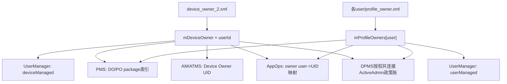
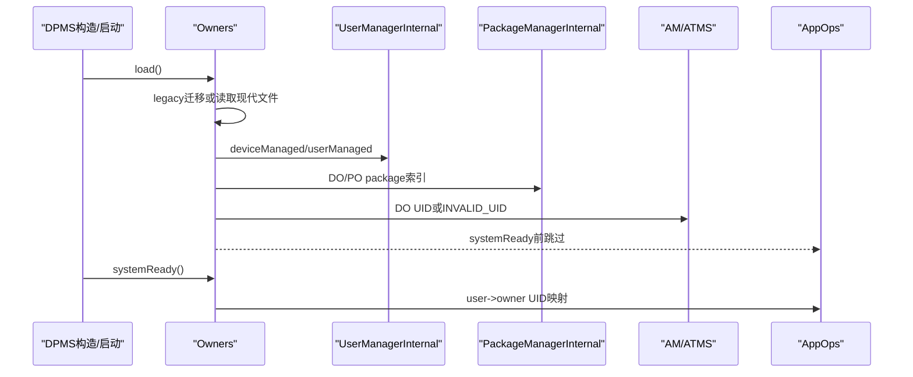
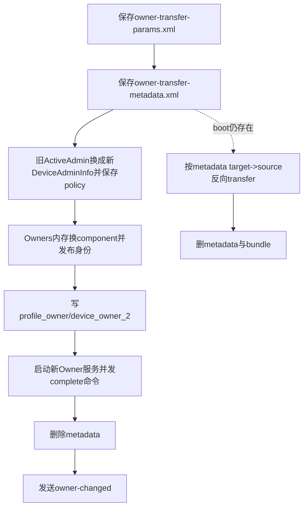

# 第 350 章 Android 企业 Owners / OwnerInfo：身份文件、Legacy 迁移、Managed Bits、身份发布、建立清除转移与崩溃恢复链

> 源码基线：Android 11 / API 30 / `android-11.0.0_r48`。本章只在 macOS 阅读源码，不编译。第349章把 Owners 称为“身份账”，本章把这本账完整展开：文件里到底保存什么、启动怎样发布身份、建立/清除所有者的顺序为何不是事务，以及 ownership transfer 的补偿日志能保证什么、不能保证什么。

## 1. Owners 的职责边界

`Owners` 保存全局唯一 Device Owner、每用户至多一个 Profile Owner，以及系统更新政策、冻结期记录和待处理 OTA 信息。它不保存相机、密码、名单等绝大多数具体政策，那些仍在每用户 `DevicePolicyData/ActiveAdmin`。

## 2. 为什么单独做身份账

许多系统服务在具体政策尚未加载前就必须知道哪些 UID/包拥有管理身份，例如 AppOps、PackageManager、ActivityManager。将小而关键的 owner 索引提前加载，可以避免解析每个用户庞大的政策文件才能回答身份问题。

## 3. Owners 是线程安全组件

类注释说明单个方法内部以私有 `mLock` 保护；但多个方法组合的完整性仍由调用者保证。DPMS 通常还持有自己的 `getLockObject()`，形成“外层 DPMS 锁 + 内层 Owners 锁”的固定调用方向。

## 4. 两把锁不是分布式事务

锁只能阻止当前进程并发穿插，不能让磁盘、UMS、PMS、AppOps 与广播共同提交。持锁期间进程崩溃，已经完成的外部调用和尚未写入的文件仍会分叉。

## 5. 三个主要文件名

旧格式是 `/data/system/device_owner.xml`；现代全局文件是 `/data/system/device_owner_2.xml`；每个用户的 PO 文件是其 user-system 目录中的 `profile_owner.xml`。名字里的“device owner”文件还保存系统更新信息，不只是一个组件名。

## 6. device_owner_2.xml 的内容

它可包含 `<device-owner>`、紧随其后的 `<device-owner-context userId>`、`<system-update-policy>`、`<pending-ota-info>`、`<freeze-record>`。是否有 DO 与是否需要该文件不是完全等价：系统更新相关状态也可能要求保留文件。

## 7. profile_owner.xml 的内容

每个用户文件只有该用户 `<profile-owner>` 的 `OwnerInfo`。不存在 PO 时 `shouldWrite()` 为 false，写方法会删除现有文件；它不会保存其他用户的 PO，也不保存具体 ActiveAdmin 政策。

## 8. 内存核心字段

`mDeviceOwner` 与 `mDeviceOwnerUserId` 组成 DO 身份；`mProfileOwners` 是 userId 到 OwnerInfo 的 map。DO userId 在没有 DO 时为 `USER_NULL`，不能只检查 userId 而忽略 OwnerInfo 是否非 null。

## 9. OwnerInfo 的最小身份

它保存展示名 `name`、包名 `packageName`、精确 receiver 组件 `admin`，再加 restriction 迁移标志、remote bugreport URI/hash、organization-owned 标志。它是角色元数据，不是完整 DPC 配置。

## 10. 先看整体数据流

文件加载形成 OwnerInfo，OwnerInfo 再被翻译成各服务需要的包/UID/managed boolean；API 建立、清除、转移则反方向修改内存、发布身份并另行写盘。理解这两条方向比背 XML 属性重要。

## 11. 身份账与消费者图



## 12. OwnerInfo 同时保存 package 与 component

现代写法总写 package，admin 非 null 时再写 flatten 后的 component。package 适合向只关心应用级身份的 PMS/AppOps 发布；component 用于定位准确 DeviceAdminReceiver。

## 13. package-only 兼容构造

旧文件可能只有包名。兼容构造会创建 `new ComponentName(packageName, "")`，这不是一个真实 receiver 类名，而是“只有包级信息”的占位；后续迁移/解析不能假装它等价于现代精确组件。

## 14. 读取优先 component

`OwnerInfo.readFromXml()` 若 component 属性存在且能 unflatten，就用 component 构造；若格式坏则记录错误，最后回退 package-only 构造。于是身份可能保留包名，但 admin 精度已丢失。

## 15. owner name 不是授权依据

name 可为 null，也可能在 transfer DO 时被主动清成 null。授权使用 userId、component、package/UID；展示名只供 UI/诊断，不能用名字相同判断是否同一 owner。

## 16. userRestrictionsMigrated 的意义

它只说明旧 owner restrictions 是否已经从历史机制迁入现代 UMS/ActiveAdmin 表达。新建 DO/PO 直接置 true；从 legacy 文件读入通常置 false，稍后 DPMS 执行迁移并写回。

## 17. remote bugreport 元数据为何在 Owners

URI/hash 与 DO 身份和跨启动待分享流程绑定，需要在早期知道是否恢复 consent receiver/通知，因此放在 device owner 身份文件，而不是普通 ActiveAdmin 政策字段。

## 18. organization-owned 标志

DO 创建时恒为 true；普通 PO 创建为 false；COPE 转化后标记 PO 的 `isOrganizationOwnedDevice=true`。它决定 parent instance 等扩展能力，属于所有者角色属性。

## 19. 旧 canAccessDeviceIds 的兼容

读取时 `isOrgOwnedDevice = newAttr | legacyCanAccessDeviceIds`。这里使用位或对两个 boolean 求值，旧属性为 true 也被迁移理解为组织所有设备，避免升级后丢失能力语义。

## 20. 写回只写新 organization-owned 属性

现代 `writeToXml()` 在 true 时写 `isPoOrganizationOwnedDevice`，不再写 legacy `canAccessDeviceIds`。下一次规范写盘把旧表示收敛到新 schema。

## 21. Owners.load 的第一步

持锁后取得 legacy 文件路径，并用 `mUserManager.getUsers(true)` 获取包括部分用户在内的当前用户列表。这个列表决定现代模式下会尝试读取哪些 `profile_owner.xml`。

## 22. Legacy 文件具有优先级

只要旧文件存在，`readLegacyOwnerFileLocked()` 就返回 true，`load()` 进入迁移分支，而不会同时再读现代文件。即使旧文件解析内部报错，该函数最后仍返回 true，这是重要故障边界。

## 23. Legacy 解析错误仍可能遮住现代文件

旧文件存在但损坏时，函数捕获解析/IO异常、记录日志后返回 true；随后会按当前部分内存写现代文件并尝试删除旧文件。它不会回退读取可能完好的 `device_owner_2.xml/profile_owner.xml`。

## 24. Legacy 里的 DO 默认 user0

旧 `<device-owner>` 只有 name/package 时，迁移把 `mDeviceOwnerUserId` 设为 `USER_SYSTEM`。这是旧模型假设；现代格式用独立 context tag 才支持明确保存 DO 所在用户。

## 25. Legacy PO 可有 component 或只有 package

读取旧 `<profile-owner>` 时先尝试 component；缺失或坏格式就回退 package-only OwnerInfo，并把 `userRestrictionsMigrated=false`。迁移保留身份的优先级高于立即丢弃不完整条目。

## 26. Legacy 系统更新政策也迁移

旧文件中的 `<system-update-policy>` 会恢复到 `mSystemUpdatePolicy`，随后与 DO 一起写入 `device_owner_2.xml`。迁移不是只拆 DO/PO 组件。

## 27. Legacy 迁移写盘顺序

成功选择 legacy 分支后，先 `writeDeviceOwner()`，再遍历当前 profile owner keys 写各用户文件，最后删除 legacy。多个 AtomicFile 之间没有共同 commit。

## 28. 删除 legacy 失败会重复迁移

delete 返回 false 只记错误。下次 boot 旧文件仍优先，现代文件再次被遮住并重写；若期间现代状态已经变化，陈旧 legacy 甚至可能反向覆盖它。

## 29. 现代读取顺序

没有 legacy 时先读 `device_owner_2.xml`，随后遍历 UserManager 返回的每个 user 读取该 user 的 `profile_owner.xml`。磁盘上孤儿 user 目录若不在列表，不会在这一步被装入 map。

## 30. AtomicFile 的恢复能力

现代 Owners 用 `AtomicFile.openRead/startWrite/finishWrite/failWrite`，能在典型中断写场景保留上一代。但它只保护单个文件；DO 文件和多个 PO 文件之间仍不是原子集合。

## 31. FileReadWriter 的 root 规则

现代文件期望 `<root>`。解析按深度处理二级 tag；错误 root 记录并返回，未知二级 tag 让 `readInner()` 返回 false、立即终止当前文件，而不是像 DevicePolicyData 那样统一 skip。

## 32. 深于二级的节点通常由子解析器消费

`readInner()` 对 depth>2 返回 true，避免框架把 SystemUpdatePolicy 或 OwnerInfo 内部已消费/简单节点再次当顶层。真正复杂字段由相应 restore/read 方法负责移动 parser。

## 33. DO context 对顺序有要求

源码注释强调 `device-owner-context` 不应出现在 `device-owner` 之前。读取 DO tag 时 userId 先默认 user0，随后 context 覆盖；若 context 提前或缺失，可能留下默认值或无 owner 的 userId 组合。

## 34. context 数字坏的处理

userId parse 的 NumberFormatException 只在该分支内捕获并记录，文件读取继续，DO userId 保持此前默认/旧值。它比直接抛出终止整个文件更宽容，但可能把 owner 绑定到错误用户。

## 35. Freeze record 的校验

只有 start/end 都存在才解析；若 start 晚于 end，记录错误并同时清空。缺一个属性时不会构造半个有效区间，避免后续系统更新窗口使用反向日期。

## 36. pending OTA 与 update policy 共用全局文件

`DeviceOwnerReadWriter.shouldWrite()` 在 DO、system update policy 或 system update info 任一非 null 时为 true。freeze record 自身不参与这个条件，这是阅读删除行为时要注意的实现细节。

## 37. 仅有 freeze record 可能不触发保留

如果 DO/update policy/update info 全为空，即便内存 freeze start/end 非空，`shouldWrite()` 仍为 false 并删除文件。正常业务应维持相应不变量，但存储层本身没有把 freeze 独立视为写盘理由。

## 38. 写空状态是删除文件

FileReadWriter 在 `shouldWrite=false` 时删除真实文件，并只检查 delete boolean。它没有通过 AtomicFile 提交“空文档”，所以无 owner 的权威表达通常是文件不存在。

## 39. 删除失败只记录

内存已清 owner、运行服务已收到无 owner，但旧文件删除失败会在下次 boot 复活旧身份。调用方没有从 `writeToFileLocked()` 获得成功/失败返回值，这是身份账的重要持久性缝隙。

## 40. writeToFileLocked 不返回结果

无论 startWrite、序列化还是 finishWrite 是否 IOException，方法只日志处理。DPMS 的 set/clear API 随后通常继续广播并返回成功，因而 API 成功不是 owner 文件耐久提交凭证。

## 41. OwnerInfo 写出的属性

简化源码逻辑为：

```java
out.attribute(null, "package", packageName);
if (name != null) out.attribute(null, "name", name);
if (admin != null) out.attribute(null, "component", admin.flattenToString());
out.attribute(null, "userRestrictionsMigrated", String.valueOf(flag));
```

remote bugreport 与 org-owned 只在有值/true 时追加。

## 42. 属性缺失的默认语义

`userRestrictionsMigrated` 只有字符串 `true` 才为真；org-owned 新旧属性同样只认 true。旧 schema 缺属性自然得到 false，后续迁移流程据此补做工作。

## 43. load 后先设置 UserManager managed bits

读取完文件后，Owners 调 `setDeviceManaged(hasDeviceOwner())`，再对当前每个 user 调 `setUserManaged(userId,hasProfileOwner(userId))`。这些是 UserManagerInternal 运行标志，不是修改 UserInfo flags 的普通公开 API。

## 44. deviceManaged 与 userManaged 分开

有 DO 时全设备 managed=true；有 PO 时对应 user managed=true。一个设备可没有 DO但有 managed-profile PO，因而 deviceManaged 与某 userManaged 的组合不是简单相等。

## 45. 同用户 DO+PO 只告警

load 发现 DO user 同时也有 PO 时记录“不支持”，但不会在 Owners 层自动删除其中一个。系统继续处于异常双身份内存，后续 DPMS 清理/授权可能出现冲突。

## 46. pushToPackageManager 的形状

Owners 构造 `SparseArray<String>` 保存每 user 的 PO package，再传 DO userId、DO package 与该 map 给 `PackageManagerInternal.setDeviceAndProfileOwnerPackages()`。PMS 获得包级索引，不需要每项 policy。

## 47. PMS 为什么需要 owner 包

包删除、清数据、启停、安装状态、保护与系统包策略需要识别 owner 身份。若只在 DPMS Binder 授权时判断，PMS 自己的底层入口可能错误允许破坏 owner 包。

## 48. pushToActivityTaskManager 只发布 DO UID

它用 PMS 按 DO package+user 查 UID，找不到则 `INVALID_UID`，同时交给 ActivityTaskManagerInternal 和 ActivityManagerInternal。PO 不进入这两个单值 setter。

## 49. package 存在但 UID 查不到

身份文件仍可说有 DO，然而 AM/ATMS 收到 INVALID_UID。此时 DPMS owner 查询与依赖 UID 的运行特权分叉；常见原因包括包未安装到该 user、解析时序或损坏身份。

## 50. AppOps 发布被 systemReady 门控

`pushToAppOpsLocked()` 在 `mSystemReady=false` 时直接返回。启动初期 load 虽调用它，却不下发；之后 `Owners.systemReady()` 置 true 并再次 push，解决 AppOps 服务尚未就绪的时序。

## 51. 身份加载与发布时序图



## 52. AppOps 映射包含 DO 与所有 PO

代码为每个可解析 UID 建 `SparseIntArray<userId,uid>`；空映射传 null。与 AM/ATMS 不同，AppOps 同时知道多用户 PO，因为部分 op 授权需要区分每个 user 的 owner。

## 53. 同一 user 的 DO/PO 映射冲突

先 put DO，随后遍历 PO 对相同 userId 再 put，会覆盖 value。虽然 load 已告警同 user 双身份，但 AppOps 最终只能看到一个 UID，这说明异常状态在不同消费者中会被不同方式折叠。

## 54. setDeviceOwner 的前置条件

DPMS 先确认 feature、组件包安装、账户/ADB兼容、允许设置 owner，再要求该组件已是 active admin 且不在 removing 列表。Owners 本身不重复做这些安全检查，它信任 DPMS 调用者。

## 55. 先关闭备份服务

建立 DO 时在写 owner 之前调用 BackupManager 将 system user backup service 永久停用。若后续 owner 写盘失败，备份可能已经关闭但重启后没有 DO，形成跨服务非事务残留。

## 56. Owners.setDeviceOwner 先改内存

它构造 OwnerInfo、写 `mDeviceOwnerUserId`，设置 UserManager deviceManaged=true，并立即 push PMS、AM/ATMS、AppOps。这个方法本身不写 XML。

## 57. DPMS 随后才 writeDeviceOwner

`setDeviceOwner()` 返回后，DPMS 显式调用 `mOwners.writeDeviceOwner()`。因此内存/消费者身份发布先于 AtomicFile 写盘；进程恰在两步间崩溃，当前运行态曾有 DO，重启却可能仍无 DO。

## 58. write 失败不会让 setDeviceOwner 返回 false

Owners 写方法吞掉 IOException 并无结果，DPMS 接着 `updateDeviceOwnerLocked()`、设置只读系统属性、加禁止 managed profile 限制、广播 owner changed、启动 owner service，最终返回 true。

## 59. 所有权系统属性不可逆边界

`setDeviceOwnershipSystemPropertyLocked()` 可能设置只读属性以表明设备曾被管理。即使 owner 文件写失败或后来清除，属性语义也不是简单恢复 false；它用于防止把已管理设备伪装成从未配置。

## 60. DO 默认限制是另一份账

设置 DO 后通过 UserManager 加 `DISALLOW_ADD_MANAGED_PROFILE` base restriction。这不在 OwnerInfo 内；owner identity 成功而 restriction 写失败，或相反，都可能需要迁移/清除流程修复。

## 61. owner-changed 广播发生较晚

代码在身份内存发布、写盘尝试、update/system property 后发送 `ACTION_DEVICE_OWNER_CHANGED`。但由于前面写盘无 success 反馈，广播仍不能证明磁盘已持久。

## 62. Owner Service 最后启动

DPMS 用 owner package+user 启动 DeviceAdminServiceController。系统不等待该服务完成初始化才返回；建立 owner API 成功只表示请求链执行到这里，不表示 DPC 自己已处理后续工作。

## 63. setProfileOwner 的总体顺序

前置检查与 active admin 验证后先关闭目标 user 的 backup，Owners 内存设置 PO/managed bit并发布 PMS/AppOps，再写 `profile_owner.xml`，然后补 managed-profile 默认限制、发广播并启动 owner service。

## 64. PO 不发布给 AM/ATMS 单值

`Owners.setProfileOwner()` 不调用 `pushToActivityTaskManagerLocked()`，因为那条接口只表达 DO UID。它仍会进入 PMS map 与 AppOps user->UID map。

## 65. managed profile 默认限制发生在身份写盘后

PO 文件写尝试完成后，DPMS 才补 Bluetooth sharing、unknown sources 等默认 restrictions。中途失败可能留下 PO 已建立但默认政策不完整；already-set 迁移账用于后续补齐，但仍依赖政策文件保存。

## 66. setProfileOwner 的 false 分支

若目标是 profile 且 parent 上 `DISALLOW_ADD_MANAGED_PROFILE`，代码在关闭 backup 与设置 Owners 之前返回 false。定位失败顺序时要区分这个早退与写盘吞错后的 true。

## 67. mark organization-owned 是原地改再写

`markProfileOwnerOfOrganizationOwnedDevice(userId)` 找到 OwnerInfo 后将 flag=true，并直接 `writeProfileOwner()`；找不到只日志，但仍调用 write，可能因 shouldWrite=false 删除文件。

## 68. mark 不重新 push 包/UID

org-owned 只改变角色能力标签，package/component 未变，所以不调用 PMS/AppOps push。DPMS 授权查询直接读 Owners 内存即可看到新值；重启是否保留则取决于写盘。

## 69. clearDeviceOwner 的第一步是停服务

清除主链先停止 owner service，再把 ActiveAdmin 中相机、restrictions、默认迁移集合、force ephemeral、network logging 等关键字段清掉，并立即关闭 UMS force-ephemeral 运行态。

## 70. 清除策略内容先于清身份

它先保存 user 的 DevicePolicyData、重置 system-user 日志时间并保存，再 `clearUserPoliciesLocked()`、清 APN/应用限制/block-uninstall，之后才 `mOwners.clearDeviceOwner()`。

## 71. clearDeviceOwner 更新内存与消费者

Owners 将 DO/null、userId/USER_NULL，设置 deviceManaged=false，并 push PMS、AM/ATMS、AppOps。与建立一样，这一步只改内存和运行态，不写文件。

## 72. 随后 writeDeviceOwner 可能删除文件

若无 DO/update policy/update info，shouldWrite=false 会删除 `device_owner_2.xml`；若仍有系统更新状态则重写无 DO 的文件。删除/写失败都只日志，清除流程继续。

## 73. updateDeviceOwnerLocked 清理其他缓存

DPMS 随后刷新 owner-dependent 状态；再清 DO base restriction、停 Security/Network logging、删除 transfer bundle 并重新启用 backup。每一步都是独立副作用，没有统一回滚。

## 74. clear 的崩溃窗口之一

若 ActiveAdmin policy 已清并写盘，而 Owners 身份尚未清就崩溃，重启仍识别 DO，但它的大量政策已变默认。反之若身份文件已清，某些异步 application restrictions 尚未清，设备会短期残留旧限制。

## 75. 应用限制清除是后台异步

`clearApplicationRestrictions()` post 到 background handler，遍历目标 user 已安装包逐个清 Bundle。owner clear API 返回与广播发生时，这项工作可能尚未完成。

## 76. ActiveAdmin 最后还会被移除

外层 `clearDeviceOwner()` 在 `clearDeviceOwnerLocked()` 后调用 `removeActiveAdminLocked()`。因此清策略、清 owner 身份和移除 admin receiver 是三个步骤；中途崩溃可能留下普通 active admin 残影。

## 77. clearProfileOwner 的调用门

r48 公开 clear PO 路径要求调用 user 不是 managed profile，并且 user unlocked，再验证调用者就是 PO。managed-profile PO 的退管通常走 ManagedProvisioning/删除资料等其他系统流程，不能照搬普通 full-user clear API。

## 78. clearProfileOwner 的顺序

停止 owner service、清 admin 相机/restrictions/default账、清当前 IME 标志与 owner cert aliases并保存，再清用户政策和应用限制，随后 Owners remove PO+写文件，删 transfer bundle、启用 backup并重新应用 DO 的 managed-profile restriction。

## 79. removeProfileOwner 先清 managed bit

Owners 从 map 删除、`setUserManaged(userId,false)`，push PMS 与 AppOps；不触碰 AM/ATMS DO UID。文件删除由调用者下一步 `writeProfileOwner(userId)` 执行。

## 80. 用户删除路径也清 PO

第349章的 `removeUserData()` 会调用 Owners removeProfileOwner，再删除 policy 文件。用户生命周期清理与 DPC 主动 clear 的周边副作用不同，审计时需确认具体入口。

## 81. transferOwnership 的目的

它允许当前 DO/PO 把身份交给另一个包的支持 transfer receiver，同时让原有 `ActiveAdmin` 政策值整体继承，而不是清空后重新配置。传入 PersistableBundle 供新 owner 获取交接参数。

## 82. target 的严格前置条件

源与目标不能相同，也不能同包；目标 receiver 必须可解析、满足 active-admin 前置条件并在 manifest 声明支持 transfer。这样减少把 owner 交给不存在/外部存储/instant 等不稳定目标。

## 83. transferActiveAdmin 不是复制每个字段

它取得旧 `ActiveAdmin` 对象，调用 `adminToTransfer.transfer(incomingDeviceInfo)` 只替换外层与 parent 的 `DeviceAdminInfo`；其余政策字段留在同一对象上，天然完成政策继承。

## 84. map key 和 passwordOwner 随之更新

旧 component key 被移除，新 component 指向同一 ActiveAdmin；若 `mPasswordOwner` 等于旧 admin UID，则改为新 UID。随后先保存 `device_policies.xml` 并给新 admin 发 `ACTION_DEVICE_ADMIN_ENABLED`。

## 85. adminList 为什么仍正确

list 保存的是同一个 ActiveAdmin 对象引用，只修改其 `info`，无需替换 list 元素。map 则必须换 key，否则按新组件查询不到；这是对象身份与索引身份的区别。

## 86. transfer 的第一份辅助文件是参数 Bundle

`saveTransferOwnershipBundleLocked()` 在目标 user 目录以 AtomicFile 写 `owner-transfer-params.xml`。新 owner 之后通过 `getTransferOwnershipBundle()` 读取；正常 transfer 完成不会立即删除它，而清 owner/恢复失败等路径会处理。

## 87. 第二份辅助文件是 Metadata

全局 `/data/system/owner-transfer-metadata.xml` 保存 source component、target component、userId、adminType。它是“传输正在进行”的补偿日志；正常 postTransfer 删除，boot 仍存在就尝试反向 transfer。

## 88. prepareTransfer 的顺序

先保存 bundle，再保存 metadata，随后才修改 ActiveAdmin/Owners。若 bundle 成功而 metadata 失败，仍继续 transfer；若两者间崩溃，可能遗留参数文件却没有需回滚标记。

## 89. metadata 保存返回值被忽略

`saveMetadataFile()` 返回 boolean，但 `prepareTransfer()` 没检查。IOException 时方法删除文件并返回 false，主链仍执行所有权转移，因而源码注释宣称的 journal 原子性在该失败模式下并未兑现。

## 90. bundle 保存也没有反馈

bundle helper 返回 void；失败时日志、删 parameters real 并 `failWrite`，transfer 仍继续。新 owner 可已获得身份却读不到交接 Bundle，API 没有把它变成 transfer 失败。

## 91. Transfer 提交与补偿图



## 92. PO transfer 的身份步骤

政策文件先换 ActiveAdmin，再 `mOwners.transferProfileOwner(target,user)`。新的 OwnerInfo 保留 migration、remote bugreport 与 org-owned 标志，但 name 改成 target package；随后 push PMS/AppOps 并写 profile owner 文件。

## 93. DO transfer 的身份步骤

Owners 构造新 OwnerInfo，保留 migration、bugreport、org-owned 和同一 DO userId，但 name 明确设 null；然后 push PMS、AM/ATMS、AppOps并写 `device_owner_2.xml`。

## 94. transfer 不先停旧 owner service

这两个 transfer helper 启动新 owner service，但片段中没有先通过同一 helper 停旧 owner 服务。DeviceAdminServiceController 如何按 user/包切换与后续 package/admin 通知共同决定旧服务何时退出，不能仅凭 transfer 函数断言已同步停止。

## 95. 完成命令早于删除 metadata

主链 transfer 后向新 owner 发 `ACTION_TRANSFER_OWNERSHIP_COMPLETE`，随后 `postTransfer()` 才删除 metadata并发 owner-changed。若发送 complete 期间异常/重启，boot 可能反向回滚，而新 owner 已经观察过完成命令。

## 96. delete metadata 不检查结果

`deleteMetadataFile()` 直接 File.delete 不验证。正常 transfer 已完成但标记删失败，下次 boot 会误判为中断并尝试反向 transfer，造成“成功后又回滚”。

## 97. Boot 回滚的方向

metadata 记录 source=旧、target=新。恢复调用 `transfer...(metadata.targetComponent, metadata.sourceComponent)`，即把当前新 owner ActiveAdmin 政策重新绑定回旧组件，再更新 Owners 与写盘。

## 98. transferActiveAdmin 的幂等特判

若 outgoing 已不在 map 且 incoming 已在 map，函数认为没有需要 transfer 并 return。这使部分重复回滚可继续后续 Owners 切换，但如果 map 两边都不满足预期，空对象访问仍可能异常。

## 99. 损坏 metadata 的空值风险

boot 先只检查文件存在，再 `loadMetadataFile()`；该方法解析失败返回 null，而调用处马上访问 `metadata.adminType`，没有 null 检查。r48 中损坏但存在的文件可能在 LockSettings-ready 恢复阶段触发 NPE。

## 100. 未知 adminType 的残留风险

恢复只处理 profile-owner 与 device-owner 两个字符串。若 metadata 成功解析但 type 未知，两分支都不执行，也不删除文件；每次 boot 都会再次进入，直到文件修复/删除。

## 101. 回滚后更新 freeze record

无论两个合法分支之后，函数调用 `updateSystemUpdateFreezePeriodsRecord(true)`。DO 身份转移可能关联系统更新政策；回滚后重新校准冻结期记录，避免 owner 变化让记录停在不一致状态。

## 102. transfer 不是安全数据撤销

新 owner 继承所有 ActiveAdmin policy，包括 parentAdmin；旧 owner 包此前获取的证书授权、文件、日志副本或外部数据不会因 component 替换自动收回。API 转移的是平台管理身份和政策对象，不是应用私有数据所有权。

## 103. 普通 owner mutation 与 write 分离

Owners 的 set/clear/transfer 多数只改变内存并 push；调用者必须显式 `writeDeviceOwner/writeProfileOwner`。而 migration flag、remote bugreport、org-owned mark 等少数 setter 内部自己写。阅读调用点必须逐个确认，不能统一猜测。

## 104. 为什么这种 API 容易误用

方法名 `setDeviceOwner()` 看起来像完整持久操作，实际 Owners 版本不写盘；DPMS 同名 Binder 方法才组合校验、写盘、restriction、广播等。搜索源码时先看接收者类型，避免把两层同名函数混为一条保证。

## 105. 现场排查 owner“幽灵复活”

重点检查 clear 时真实文件 delete 是否失败、AtomicFile backup 是否恢复旧代、legacy 文件是否仍存在并具有优先级，以及 transfer metadata 是否误触发反向操作。只看当前 `dumpsys device_policy` 不足以证明下次 boot 状态。

## 106. 现场排查 owner“身份在但能力不在”

核对 OwnerInfo component/package/userId、包在目标 user 的 UID、ActiveAdmin map 是否存在、PMS/AM/ATMS/AppOps 收到的身份、DeviceAdminInfo 当前 manifest能力、以及政策文件是否成功加载。

## 107. 现场排查 set 返回成功但重启丢失

查 Owners AtomicFile 写日志与目录权限；由于 write 无返回值，true/广播/owner service 都可能发生在写失败后。再检查是否有 legacy 文件在下次 boot 优先覆盖现代结果。

## 108. 现场排查 transfer 后来回切换

同时检查 parameters、metadata、device owner/profile owner 文件和 device_policies admin component；比对 complete command、owner-changed、boot revert 日志的顺序，尤其确认 metadata delete 是否真正成功。

## 109. 测试应注入写盘失败

仅测正常 AtomicFile 会错过核心窗口。至少模拟 owner file start/finish失败、legacy delete失败、metadata save false、metadata delete失败和损坏 metadata，并断言内存、磁盘、managed bits、各服务身份是否分叉。

## 110. 多服务发布测试

建立/清除/转移 DO 时验证 UserManager、PMS、AM、ATMS、AppOps 五个观察面；PO 则验证 UserManager/PMS/AppOps。不要只断言 Owners getter，因为消费者可能尚未 systemReady 或 UID 解析失败。

## 111. 本章心智模型

Owners 是“小而早”的身份索引：文件恢复 OwnerInfo，OwnerInfo 发布成各服务需要的 boolean/package/UID；DPMS 再把它与 ActiveAdmin desired 连接。每次身份变化都应画出“内存→消费者→文件→政策/限制→广播”的具体顺序。

## 112. macOS只读练习一：还原三种 XML

阅读 `DeviceOwnerReadWriter/ProfileOwnerReadWriter/OwnerInfo`，手写一个 DO+system update、一个 organization-owned PO、一个只有 package 的 legacy PO 的最小 XML；标出哪个文件有 root、哪个字段缺失时默认 false。

## 113. macOS只读练习二：画建立与清除窗口

逐行阅读 `setDeviceOwner()` 与 `clearDeviceOwnerLocked()`，在每个外部调用后假设进程崩溃，记录 Owners内存、owner文件、DevicePolicyData、UMS限制、backup、PMS/AppOps 和广播的可能状态；全程不修改设备。

## 114. macOS只读练习三：手推 transfer 五个故障

分别假设 bundle写失败、metadata写失败、policy写后崩溃、owner文件写后崩溃、metadata删除失败，判断下次 boot 是否有回滚标记、回滚方向、新旧组件谁在 policy map/Owners 中，以及新 owner 是否可能已经收到 complete。

## 115. macOS只读练习四：验证身份发布差异

从 `pushToPackageManagerLocked/pushToActivityTaskManagerLocked/pushToAppOpsLocked` 出发，列 DO 与 PO 各自进入哪些服务、使用 package 还是 UID、找不到 package UID 时的值、AppOps 为何要等 systemReady。

## 116. 本章检查题

为什么 legacy 损坏仍可能遮住现代文件？为什么 Owners.setDeviceOwner 后还必须显式 write？为什么 PO 不发布到 AM/ATMS 单值？为什么 metadata 使用 AtomicFile 仍不能证明 transfer 一定可回滚？

## 117. 复读修正一：AtomicFile 只原子化单文件

初读容易把 Owners/transfer 都称为“原子所有权切换”。源码实际是多个 AtomicFile、DevicePolicy JournaledFile、内存发布和广播的顺序组合；metadata 只是补偿日志，且保存/删除结果还有未检查路径。

## 118. 复读修正二：Managed bits 是派生运行态

`setDeviceManaged/setUserManaged` 由 Owners load/set/clear 重新发布，不是 OwnerInfo XML 的独立真相。它们与文件分叉时，下次 load 会按身份账重建；当前 boot 则可能先表现为内存新状态。

## 119. 复读修正三：Transfer 继承政策不是复制快照

源码复用同一个 ActiveAdmin 对象，只替换 DeviceAdminInfo 与 map key，并更新 passwordOwner UID；parent info 一并替换。这样保留所有字段，也意味着旧政策完整交给新包，安全审计必须把继承范围看成默认全量。

## 120. 本章结论与下一章

第350章闭合了 r48 Owners 身份链：legacy/现代文件建立 OwnerInfo，启动发布 managed bits、package 与 UID；建立清除均先改内存/服务再独立写盘；transfer 用参数文件和补偿 metadata 尽力恢复但并非 ACID。下一章进入 ActiveAdmin 生命周期：receiver 解析、激活/移除、package 变化、pending removal、广播、UsageStats active-admin 包与崩溃残留清理。
