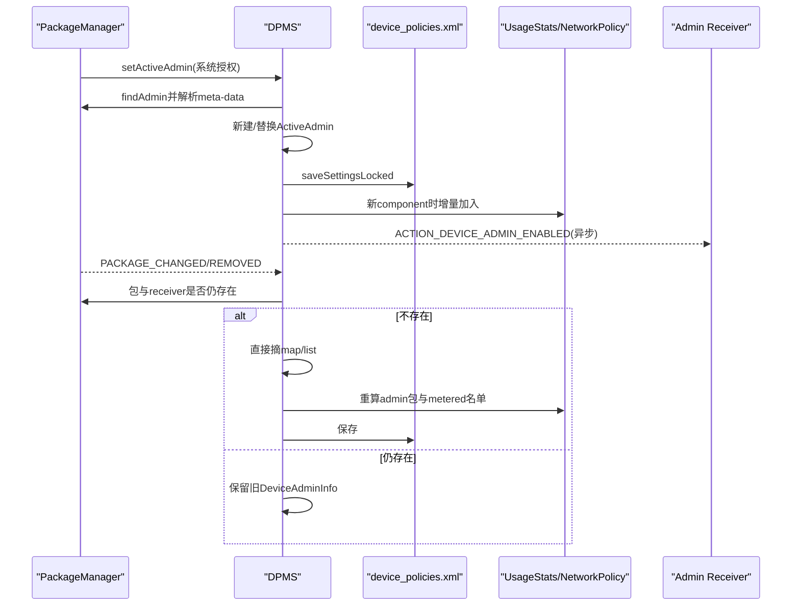
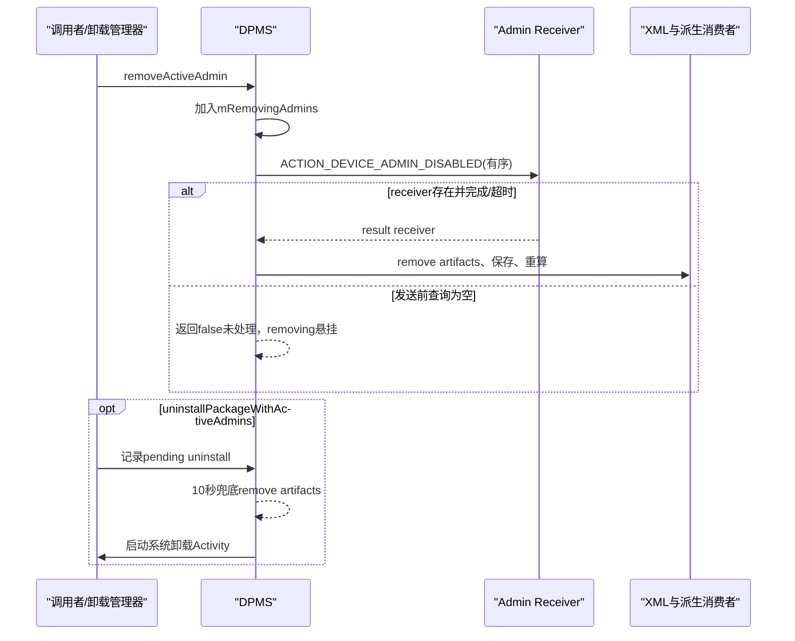

# 第 351 章 Android 企业 ActiveAdmin 生命周期：Receiver 解析、激活移除、Package 变化、广播、UsageStats 与崩溃残留链

> 源码基线：Android 11 / API 30 / `android-11.0.0_r48`。本章只做 macOS 源码阅读，不编译。第349—350章分别解释策略账和身份账，本章研究更底层的一层：一个 `DeviceAdminReceiver` 怎样成为 `ActiveAdmin`，怎样被刷新、移除、随包消失清理，以及这些变化怎样同步到 UsageStats、NetworkPolicy、UMS 与 XML。

## 1. ActiveAdmin 不是安装即获得

应用仅声明 `DeviceAdminReceiver` 和 meta-data 还不是 active admin。必须由系统授权流程调用 DPMS `setActiveAdmin()`，通过 receiver 解析与前置检查后，组件才进入该 user 的 `mAdminMap/mAdminList`。

## 2. ActiveAdmin 与 Owner 是两层身份

每个 DO/PO 必须先是 ActiveAdmin，但 ActiveAdmin 不一定是 DO/PO。普通 legacy admin 只能使用声明并被平台允许的旧 policies；Owner 再由第350章的 Owners 身份账赋予更高角色。

## 3. 激活单位是 ComponentName

同一包可以声明多个 receiver，每个组件可独立出现在 map。UsageStats 侧最终按包去重，但 DPMS policy 与广播目标仍精确到 component。

## 4. 数据属于目标 user

`setActiveAdmin(adminReceiver,refreshing,userHandle)` 对指定 user 的 DevicePolicyData 操作。相同组件名在 user0 与 user10 是不同 active admin 实例、不同 UID、不同 XML 节点。

## 5. Receiver 元数据的作用

`DeviceAdminInfo` 从 ActivityInfo 和 `android.app.device_admin` XML 读取 uses-policies、visible、supports-transfer-ownership 等声明。它是能力说明与组件信息，不保存运行中政策值。

## 6. ActiveAdmin 持有 DeviceAdminInfo

ActiveAdmin 的 `info` 连接“这个组件是谁/声明什么能力”与“它实际设置了什么值”。包升级改变 manifest 后，旧内存 info 不一定立即重建，必须看 load/refresh/package-change 路径。

## 7. mAdminMap 与 mAdminList 的分工

map 按 ComponentName 查调用者，list 用于聚合和广播遍历。任何生命周期修改都应保持两者一致；只改一个会造成 getter、聚合和持久化看到不同集合。

## 8. mRemovingAdmins 是第三种过渡状态

组件仍在 map/list，但已发出 disabled 广播等待清理时，ComponentName 进入 `mRemovingAdmins`。它防止重复移除与同组件重新激活，却不写入 XML。

## 9. 生命周期不只有 active/inactive 两态

至少要区分：已声明未激活、active、refresh 替换中、removing 等回调、artifacts 已摘除、包卸载中、owner 身份仍在/已清。很多竞态来自把它压成一个 boolean。

## 10. 核心源码范围

入口与状态机在 `DevicePolicyManagerService.java` 的 `findAdmin/setActiveAdmin/removeActiveAdmin/removeAdminArtifacts/handlePackagesChanged`；声明解析在 `DeviceAdminInfo`；app standby 消费者在 `UsageStatsService/AppStandbyController`。

## 11. 生命周期总图

```mermaid
stateDiagram-v2
    [*] --> "Receiver已安装未激活"
    "Receiver已安装未激活" --> "ActiveAdmin已写盘": "setActiveAdmin"
    "ActiveAdmin已写盘" --> "ActiveAdmin已写盘": "refreshing替换对象"
    "ActiveAdmin已写盘" --> "Removing(仅内存)": "removeActiveAdminLocked"
    "Removing(仅内存)" --> "Artifacts已删除": "DISABLED有序广播回调"
    "ActiveAdmin已写盘" --> "Artifacts已删除": "包/receiver消失直接清理"
    "Removing(仅内存)" --> "Artifacts已删除": "卸载10秒兜底"
    "Artifacts已删除" --> [*]
```

## 12. setActiveAdmin 需要系统管理权限

Binder 入口先要求 `MANAGE_DEVICE_ADMINS`，再要求跨 user 权限。普通 DPC 不能自行静默激活；正常用户确认界面或系统 provisioning 组件代表系统调用。

## 13. findAdmin 也检查跨 user

它先 `enforceFullCrossUsersPermission(userHandle)`，再清 Binder identity 查询目标 user 的 receiver。解析使用系统身份，不会让调用 app 自己的可见性/权限限制误挡 PackageManager 查询。

## 14. 查询 flags 包含 Direct Boot 两类

`GET_META_DATA` 读取声明，同时匹配 direct-boot-aware/unaware 和 disabled-until-used 组件。管理员是否能在用户未解锁阶段收某个广播仍取决于 receiver Direct Boot 属性和系统广播时机。

## 15. 未知 receiver 直接异常

ActivityInfo 为 null 时抛 `IllegalArgumentException("Unknown admin")`。DPMS 不创建占位 ActiveAdmin，避免将任意字符串持久化成安全主体。

## 16. BIND_DEVICE_ADMIN 是关键保护

receiver 应声明 `android.permission.BIND_DEVICE_ADMIN`，防普通应用伪造设备管理广播。缺失时日志警告；当调用要求 throw 且目标 targetSdk>M，findAdmin 抛异常。

## 17. 老 target 的兼容例外

对 targetSdk<=M 的旧 receiver，缺 BIND_DEVICE_ADMIN 在某些 `throwForMissingPermission=true` 路径仍只警告不抛。这是历史兼容，不代表现代 DPC 可省略权限；安全审计应把老 target 单独列为风险。

## 18. meta-data 解析失败返回 null

构造 `DeviceAdminInfo` 若 XMLPullParser/IOException，findAdmin 记录 bad admin 并返回 null。随后激活前置检查把 null 转为 IllegalArgumentException，不会保存半解析能力表。

## 19. ActiveAdmin 必须在内部存储

`checkActiveAdminPrecondition()` 要求 ApplicationInfo `isInternal()`。可移除外部存储上的包不能成为 admin，避免存储卸载时安全主体突然消失。

## 20. Instant app 被禁止

目标若是 instant app 直接异常。设备管理要求长期、可寻址且跨重启的包身份，与临时 instant 生命周期不兼容。

## 21. Removing 状态阻止重新激活

若 ComponentName 在 `mRemovingAdmins`，set/transfer 前置检查抛“Trying to set an admin which is being removed”。必须等 artifacts 清理或内存 cache 重建，不能用 refresh 抢回同一组件。

## 22. refreshing=false 的重复激活

已有 active admin 时且 refreshing=false，抛“already added”。这保护已有政策对象不被普通重复请求意外覆盖。

## 23. refreshing=true 的真实含义

它不是在原对象上重读 `DeviceAdminInfo`；代码创建一个全新的 `ActiveAdmin(info,false)`，只从旧对象保留 `testOnlyAdmin`，随后替换 map/list 中对象。

## 24. refresh 会清空既有政策值

因为没有复制相机、密码、restrictions、名单等字段，新对象回到默认。这个 privileged 入口通常用于受控 provisioning/恢复场景，不能把 refreshing 理解为无损 manifest refresh。

## 25. refresh 的 testOnly 例外

首次激活从 ApplicationInfo.FLAG_TEST_ONLY 计算；刷新时沿用旧 `testOnlyAdmin`。这样应用更新改变 testOnly flag 不会让已激活 admin 获得或失去仅测试清理能力。

## 26. 新对象先放 map

代码 `policy.mAdminMap.put(component,newAdmin)`，再遍历 list 找同 component。已有则 set replaceIndex，新组件则 add。整个片段在 DPMS 锁和 clean identity lambda 内，避免其他 policy 调用看到两步中间态。

## 27. 新激活才 enableIfNecessary

replaceIndex==-1 时把包从 disabled-until-used 等状态启用。refresh 已有 admin 不重复 enable，因为组件本来已在活动集合。

## 28. 新激活通知 UsageStats 增量加入

同一分支调用 `UsageStatsManagerInternal.onActiveAdminAdded(package,user)`。refresh 不调用，因为包集合没有新增。

## 29. 一个包多个 receiver 的去重

DPMS 每个新 component 都可能调用 onActiveAdminAdded，但 AppStandbyController 用 Set 保存 package，天然去重。移除一个 receiver 时 DPMS 会重算整个 user 的 admin 包集合，只有最后一个组件移除才真正消失。

## 30. XML 保存早于 enabled 广播

map/list 更新后先 `saveSettingsLocked(user)`，再发 `ACTION_DEVICE_ADMIN_ENABLED`。因此 DPC 收到 onEnabled 时，DPMS 内存与保存尝试已包含它；但第349章说明写盘错误无反馈，广播仍不等于耐久成功。

## 31. enabled 是普通显式广播

没有 result receiver 时 `sendAdminCommandLocked` 使用 `sendBroadcastAsUser()`，并不会等待 DPC onEnabled 执行结束。setActiveAdmin 返回也不能证明应用初始化完成。

## 32. 发送前会查询 receiver

方法先 `queryBroadcastReceiversAsUser()`；结果为空则返回 false，不发送。setActiveAdmin 忽略该 boolean，所以组件在检查与发送间变化时，admin 可已激活但收不到 enabled。

## 33. 广播允许后台启动 Activity

`BroadcastOptions.setBackgroundActivityStartsAllowed(true)` 为 device admin 系统命令放宽后台启动限制。它是显式特权广播，目标仍固定到 admin component。

## 34. foreground flag 的来源

demo mode、调用参数 inForeground 或特定 owner user lifecycle 命令可加 `FLAG_RECEIVER_FOREGROUND`。一般 setActiveAdmin enabled 调用未指定 foreground，不能假设所有 admin 广播都走前台队列。

## 35. enabled 回调失败不回滚激活

应用崩溃、receiver 查不到或广播未执行，都不会自动从 map/list 移除。平台把 active 身份提交与应用确认分开，DPC 必须把 onEnabled 设计为可重入初始化而非唯一提交点。

## 36. isAdminActive 只查 map

方法在权限检查后判断 `getActiveAdminUncheckedLocked()!=null`。removing admin 尚未摘除时仍返回 active；要区分过渡态必须另查 `isRemovingAdmin()`。

## 37. isRemovingAdmin 只查内存列表

它不读磁盘，进程重启后列表为空。重启并不会从 XML 继续等 disabled 回调，原 admin 会按 device_policies 重新加载为 active，除非包已消失或另有卸载流程继续。

## 38. hasGrantedPolicy 的两层判断

先要求组件仍 active，再看 `administrator.info.usesPolicy(policyId)`。这只是声明能力；现代 owner 的部分能力还由角色特判，普通 admin 又受 Q+ `DA_DISALLOWED_POLICIES` 限制，不能单独作为最终授权。

## 39. 普通 DA 的能力在加载时冻结

第349章说明重启加载普通 DA 时用 XML 中用户当时同意的 policies 覆盖当前 manifest。当前进程 package 更新若未重建 info，也会继续使用旧对象，防/兼容语义应结合两条链看。

## 40. package changed 不刷新 DeviceAdminInfo

`handlePackagesChanged()` 只检查 package 与 receiver 是否还存在；都存在就保留原 ActiveAdmin/info。它不会重新解析 uses-policies，也不会调用 refreshing setActiveAdmin。

## 41. package replace 的触发

PACKAGE_ADDED 且 `EXTRA_REPLACING=true` 走 handlePackagesChanged；PACKAGE_CHANGED 也走。若 receiver 仍存在，只刷新 owner service 连接，不替换 ActiveAdmin policy 元数据。

## 42. USER_STARTED 会先清 DevicePolicyData cache

用户启动广播路径把 `mUserData.remove(user)` 后再 `handlePackagesChanged(null,user)`；后者 getUserData 会从 XML 重载并重新解析 DeviceAdminInfo，因此跨 user start 能形成一次完整刷新。

## 43. package removal 直接摘 admin

若 packageInfo 或 receiverInfo 为 null，handlePackagesChanged 直接从 list/map 删除，不先发送 disable-requested 或 disabled，也不进入 mRemovingAdmins。

## 44. 为什么包消失不能等 onDisabled

receiver 已不存在，显式 disabled 广播没有目标。平台只能立即撤销政策主体并保存；DPC 不会获得清理回调，这也是应用卸载前系统 UI 要先走正常 deactivation 的原因。

## 45. 直接摘除后立即重算包集合

每删一个 admin 就 push UsageStats active admin packages，并 push NetworkPolicy metered-disabled packages。循环内可能重复 push；正确性优先于批量优化。

## 46. removed admin 后校验 passwordOwner

遍历结束只要删过 admin，就 `validatePasswordOwnerLocked(policy)`，防 password reset owner UID 指向已不存在组件。其他聚合政策各自由后续 save/push或消费者更新处理。

## 47. Package 变化还清 delegate

对 delegation map 检查 target package 是否已不安装；匹配则 remove。admin 与 delegate 任一删除都会保存 device_policies.xml。

## 48. owner 包变化会重启连接

如果 changed package 等于该 user owner package，调用 `startOwnerService(user,"package-broadcast")` 刷新 bound connection。即使 admin 被直接摘除，Owners 身份账可能仍指向该包，因此仍会尝试 owner service。

## 49. Owner 身份与 admin 消失可能分叉

正常 PMS 保护应阻止随意卸载 DO/PO 包；但损坏/包管理异常下，handlePackagesChanged 只清 ActiveAdmin，不同步 `mOwners.clear/remove`。这会留下第350章所说“身份在、政策主体不在”。

## 50. 直接摘除后在锁外 push restrictions

保存完成并退出 DPMS 锁后，如果 removedAdmin=true，调用 `pushUserRestrictions(user)`。相机 synthetic/restrictions 可能因此解除；放锁外避免在长跨服务链中继续持有主锁。

## 51. 激活与包变化时序图



## 52. 普通 remove 的入口条件

`removeActiveAdmin(component,user)` 先检查 feature、跨 user 权限与 user unlocked。不存在时直接 return，不将重复移除视为错误。

## 53. DO/PO 不能从普通入口移除

若组件仍是 Owners 认可的 DO/PO，只记录错误并 return。必须先走专门 clear owner 流程清身份和各类全局副作用，不能把它降成普通 admin 后遗留管理状态。

## 54. Admin 可移除自己

若目标 admin UID 等于 Binder caller UID，不额外要求 MANAGE_DEVICE_ADMINS；否则调用者必须有系统权限。DPC 可请求自我停用，但 owner 仍被上一节的角色门挡住。

## 55. removeActiveAdminLocked 先标 removing

查到 admin 且 component 不在列表时，先 add `mRemovingAdmins`，再向该 admin 发 `ACTION_DEVICE_ADMIN_DISABLED` 有序广播，附 result receiver。

## 56. 为什么先标记

有序广播可能跨进程、延时或回调重入。先标记能阻止第二次 removal 与重新激活，不让两个回调重复操作同一政策对象。

## 57. disabled 广播与 disable-requested 不同

Settings 在真正移除前可用 `getRemoveWarning()` 发 `ACTION_DEVICE_ADMIN_DISABLE_REQUESTED` 获取警告文本；它是 UI 提示阶段。`ACTION_DEVICE_ADMIN_DISABLED` 才是已决定移除后的 onDisabled 通知。

## 58. Disable-requested 是有序前台广播

Intent 固定组件并加 FOREGROUND，最终 result extras 返回调用者。管理员可提供说明，但不能通过结果否决系统；真正是否移除由 UI/调用者决定。

## 59. Disabled 结果回调清 artifacts

有序广播完成后，DPMS result receiver 调 `removeAdminArtifacts(component,user)`，随后若存在卸载请求再 `removePackageIfRequired()`。正常设计给 DPC 一次 onDisabled 清理机会。

## 60. 广播返回值未检查的缺口

`sendAdminCommandLocked()` 在 query 结果为空时返回 false；`removeActiveAdminLocked()` 忽略它。于是 removing 已加入，但 result receiver永不注册/回调，当前进程可能永久卡在 removing。

## 61. 组件仍在 map 所以政策仍有效

卡 removing 时 `isAdminActive` 仍 true，ActiveAdmin 仍参与密码/相机等聚合；只是不能再激活或重复正常移除。包变化或卸载 timeout 的直接 artifacts 清理可打破它，否则重启 cache 会恢复普通 active。

## 62. 有序广播超时不等于永不回调

receiver 存在但应用卡死时，AMS 广播队列通常在系统超时后推进并交付最终 result receiver，所以最终可清理；真正源码可见的确定缺口是“发送前 query 为空直接 return false且调用者不处理”。

## 63. mRemovingAdmins 不保存的后果

在 disabled 广播期间 system_server 崩溃，重启从 XML 看不到 removal intent，admin 重新成为 active。DPC 可能已经执行过 onDisabled，却又继续拥有政策；正常产品需让上层卸载/设置操作可重试。

## 64. removeAdminArtifacts 的第一步

重新在锁内查 ActiveAdmin；若已被包变化/timeout 先删，直接 return。这使多个清理路径基本幂等，不会对同一对象重复聚合。

## 65. map/list 同步摘除

找到 admin 后从 list remove 对象、从 map remove component。随后验证 passwordOwner，并按原 info 是否 uses global-proxy 决定重置代理。

## 66. 全局代理为什么单独清

global proxy 可能是跨 admin 聚合/单一所有者状态。移除施加该 policy 的 admin 后必须重算，而不是只删除 XML 节点；否则网络仍使用不存在管理员配置。

## 67. UsageStats 全量重算

`pushActiveAdminPackagesLocked(user)` 收集剩余 admin 的 package Set；没有任何 admin 时返回 null，AppStandbyController据此删除 user 的 active-admin 集合。

## 68. Active admin 对 App Standby 的意义

UsageStats 将集合交给 AppStandbyController，设备管理包作为 active admin 获得相应 standby 特殊处理，避免管理应用因待机桶限制无法及时工作。它不是 DPM policy 授权本身。

## 69. NetworkPolicy 的 metered 名单也重算

移除 admin 后 `pushMeteredDisabledPackagesLocked()` 聚合剩余管理员对 metered data disabled packages 的限制并异步下发。只删 admin 不重算会让包继续错误受限。

## 70. 保存发生在 artifacts 已摘除后

`saveSettingsLocked(user)` 把新 map/list 与聚合字段写盘；保存失败仍不把 admin 放回内存，形成当前 boot 已移除、重启旧 XML 复活的窗口。

## 71. 最大锁屏时间立即更新

保存后 `updateMaximumTimeToLockLocked(user)` 重新聚合剩余 admin 并下发。它与 restrictions push 分处锁内/锁外两个阶段。

## 72. removing 标记最后才清

锁内所有 artifacts、保存和最大锁屏更新之后才 `mRemovingAdmins.remove(component)`。如果中间运行时异常，标记可能残留；IOException 保存被内部吞掉则仍继续清标记。

## 73. User restrictions 在锁外重算

removeAdminArtifacts 返回锁外后无条件 `pushUserRestrictions(user)`，清除 admin 的 userRestrictions 及 synthetic camera/date 来源。UMS effective 仍可能被其他 owner/base 来源保持。

## 74. Screen capture 等政策去哪恢复

本函数明确更新 max lock、proxy、metered、restrictions，但并未在片段中逐一更新所有 ActiveAdmin 字段。其他功能可能有监听/单独清理或依赖后续 user start；审计移除语义要按 policy 查消费者，不能假设统一重算。

## 75. 移除日志晚于核心步骤

“Device admin removed” 在保存、聚合与清 removing 后打印；但 restrictions push 还在日志之后。现场看到该日志仍不能说所有跨服务副作用已经完成。

## 76. 卸载含 active admins 的专用入口

`uninstallPackageWithActiveAdmins(package)` 仅管理权限调用，先拒绝包含当前 PO/DO 的包，记录 `(package,user)` 到 `mPackagesToRemove`，再对该包每个普通 active admin 发起 remove。

## 77. 没有 admin 时立即拉起卸载 UI

如果目标包 active admin 列表为空，直接 `startUninstallIntent()`；它先从 pending Set 原子取走任务，再 force-stop 包并启动 `ACTION_UNINSTALL_PACKAGE` Activity。

## 78. 有 admin 时等待回调

每个 disabled result receiver 完成 artifacts 后调用 `removePackageIfRequired()`；只有该包已无 active admins 才启动卸载。多个 receiver 的最后一个清理者赢得 pending Set。

## 79. 十秒 timeout 是强制进度兜底

无论广播是否完成，Handler 10 秒后对初始 component 列表逐个 `removeAdminArtifacts()`，再启动卸载 UI。它绕过卡死 DPC，避免设备管理员阻止用户永久卸载普通应用。

## 80. timeout 与正常回调可竞态

两边都可能调用 artifacts；方法先查 map，后到者见 null return。卸载 pending Set 也只允许第一次启动，基本避免重复 UI，但回调与 timeout 的日志顺序可能交错。

## 81. 包广播直接清理是第三条路径

正常 remove result、卸载 timeout、PACKAGE_REMOVED/receiver missing 都能摘 admin。它们是否发 onDisabled、是否使用 removing、是否触发卸载不同，却最终汇聚到 map/list/XML与派生集合更新。

## 82. 包被替换时权限消失的边界

handlePackagesChanged 的 receiverInfo 查询只检查存在，不重新校验 `BIND_DEVICE_ADMIN`。当前进程旧 info 可继续保留；下次 DevicePolicyData 重载时 `findAdmin(...throw=false)` 对缺权限旧 target 甚至可能只警告并构造 info，版本兼容需单独审计。

## 83. 加载时 admin 坏只跳该项

第349章的 load 对每个 admin 捕获 RuntimeException。包不存在、receiver坏或 XML字段异常可让组件未进入 map；加载结束后 policy聚合只看成功项，但 Owners 身份可能仍指向被跳过的 owner。

## 84. Boot 时 ActiveAdmin packages 异步全量发布

`loadAdminDataAsync()` 投递到 SystemServer init thread pool，遍历所有 users，调用 `setActiveAdminApps(Set/null,user)`；之后才通知 UsageStats `onAdminDataAvailable()`。

## 85. UsageStats 有启动等待闩锁

AppStandbyController 在设备支持 Device Admin 时会等待 admin data available，带超时。目的是在进行 standby 决策前拿到管理包集合，减少把 DPC 错当普通闲置应用。

## 86. 全量发布会触发用户懒加载

`getActiveAdminPackagesLocked(user)` 调 `getUserData(user)`；boot 异步遍历因此可能解析多个 user 的 device_policies.xml，并产生第349章所述 load 后 push 副作用。

## 87. onActiveAdminAdded 是增量快路径

运行中新激活不必重新扫描所有 users，只向 AppStandby Set add package；删除/包变化则全量 set 当前 user，避免一个包多 receiver 的引用计数问题。

## 88. NetworkPolicy 也有 data available

同一异步任务先推所有 users 的 metered restricted packages，最后通知 NetworkPolicyManagerInternal onAdminDataAvailable。它与 UsageStats 各有自己的准备时序。

## 89. 异步初始化不是构造完成屏障

DPMS 服务可已发布，而 init thread pool 任务尚未完成；消费者通过 latch/回调协调。排查开机短暂 standby/metered 异常要看任务是否运行与是否超时，不只看 XML。

## 90. Set 为 null 与 empty 的处理

DPMS 没有 admin 时返回 null；AppStandbyController 收到 null 会 remove user entry。非空 admin list 经过 package 去重后不应产生 empty Set，这里的 null 是明确“无管理包”。

## 91. 普通移除与卸载时序图



## 92. 广播线程与 DPMS Handler

sendOrderedBroadcast 的 final result receiver 指定 `mHandler`，所以 artifacts 清理回调回到 DPMS handler 所在线程，再取得 DPMS 锁。它不是在 DPC 的 Binder/广播线程直接修改 system_server 状态。

## 93. 锁内发送广播的重入考虑

removeActiveAdminLocked 在 DPMS 锁内调用 sendOrderedBroadcast，但发送本身异步，final receiver稍后执行。Java synchronized 可重入但跨线程必须等锁释放，避免 DPC回调同步穿透当前修改。

## 94. testOnly admin 的生命周期

testOnly 标志仅首次按包 FLAG_TEST_ONLY 固化，refresh保留，XML也持久化。Shell/测试专用 owner/admin 清理路径会依赖它，发布版应用不能靠更新 manifest 临时伪装测试 admin。

## 95. remove warning 不是强安全钩子

DPC 可返回用户提示，不能无限阻止移除；系统管理权限、普通自移除和卸载 timeout 都由平台控制最终状态。企业合规应依赖 owner角色和 provisioning，而非把 warning 当防卸载机制。

## 96. Owner 包保护在别处执行

generic remove 只通过 `isDeviceOwner/isProfileOwner` 拒绝，package uninstall 又显式拒绝 owner 包；PMS 还消费 Owners包索引。多层防护是纵深设计，但身份账与ActiveAdmin分叉时各层答案可能不同。

## 97. Policy 保存失败的双向风险

激活保存失败：当前 boot active，重启消失；移除保存失败：当前 boot inactive，重启复活。两者都可能已经发广播/改变 UsageStats，证明“内存先变+写盘无反馈”是通用模式。

## 98. Package 直删的保存失败

包已不存在时 admin 当前内存被摘，save失败后重启仍从旧 XML尝试加载；findAdmin 又会因包不存在跳过，所以通常不会真正复活，但坏节点仍持续留在磁盘并每次产生解析/警告。

## 99. Receiver 暂时不可查询的风险

组件在 package replace 的短窗口若查询返回 null，handlePackagesChanged 可能直接删除 admin并保存；后续 PACKAGE_ADDED不会自动重新激活。包管理广播时序通常避免该问题，但源码状态机本身没有“暂时 missing”墓碑与自动恢复。

## 100. Removing 与 package direct removal 交叉

若 admin 已在 mRemovingAdmins，随后包广播直接从 map/list摘除，并不清 removing。之后 disabled result 回调调用 artifacts见 admin null return，也不会清标记；当前进程同 ComponentName 可能继续被前置检查视为 removing。

## 101. user restart 会清这类悬挂标记

USER_STARTED 删除整个 DevicePolicyData cache，mRemovingAdmins 随对象消失。若 map已保存为无 admin，新对象保持 inactive；若保存失败且包又恢复，旧 XML可把 admin重新加载为 active。

## 102. UsageStats 不保存 component 粒度

它只接 package Set。因此一个包中仍有任意 active receiver就继续享有 standby admin待遇；这与 DPMS按组件授权是有意的粒度差异。

## 103. Metered policy 要按 admin policy 聚合

不像 UsageStats只关心包身份，NetworkPolicy push读取剩余ActiveAdmin的 meteredDisabledPackages。移除一个组件可能改变限制，即便同包另一个 admin仍在。

## 104. 现场排查“无法重新激活”

同时查 map/list与 `mRemovingAdmins`；确认 disabled广播是否实际发送、query是否为空、result是否回调、package direct removal是否留下标记，以及 user cache是否重建。不要只看 XML中有没有 `<admin>`。

## 105. 现场排查“onEnabled没收到”

先看 admin是否已在 map/XML，再查 receiver query、Direct Boot/user状态、组件 enabled状态和广播队列。onEnabled缺失不自动代表激活失败，反之收到也不保证写盘成功。

## 106. 现场排查“卸载按钮卡住”

区分 owner包明确禁止、普通admin等待disabled、receiver query为空导致removing悬挂、以及专用uninstall入口的10秒兜底是否调度。普通 Settings UI流程未必调用强制卸载API。

## 107. 现场排查“DPC被待机限制”

检查 init thread pool 是否推 active admin package、UsageStats admin-data latch是否超时、user/package Set是否正确，以及组件是否被package-change意外摘除；不要用 owner身份文件替代 UsageStats实际集合。

## 108. 生命周期测试矩阵

至少覆盖首次激活、重复非refresh、refresh丢政策、新组件enabled查询为空、自移除、系统移除、owner拒绝、包消失、receiver消失、多个receiver同包、system_server在removing中崩溃。

## 109. 故障注入测试

分别让 save激活失败、save移除失败、disabled receiver卡死/不可查询、package replace短暂missing、UsageStats初始化超时，记录四层：DPMS内存、XML、派生服务、DPC广播。

## 110. 源码阅读固定问题

每条路径都问：谁有权限触发？Component还是package粒度？先改内存还是先写盘？广播是否有result？返回值是否检查？运行派生集合何时全量重算？重启能否知道操作正在进行？

## 111. 本章心智模型

ActiveAdmin 是“可持久政策主体”，receiver只是它的当前代码入口。激活提交主体后才通知代码；普通移除先通知代码再删除主体；包消失则跳过通知直接删除。三条顺序不同，失败恢复自然不同。

## 112. macOS只读练习一：对照激活与refresh

阅读 `setActiveAdmin()`，列出首次激活和refresh两列：new ActiveAdmin、testOnly、map/list、enableIfNecessary、UsageStats、save、enabled广播。任选三个政策字段说明refresh后为何回默认。

## 113. macOS只读练习二：手推removing悬挂

假设receiver在前置find后被disable，queryBroadcastReceivers返回empty。沿 boolean返回值、mRemovingAdmins、map/list、isAdminActive、isRemovingAdmin、再次激活与重启写出结果，并找出源码中缺少的处理分支。

## 114. macOS只读练习三：比较三种删除

用表格比较正常disabled回调、uninstall十秒timeout、PACKAGE_REMOVED直接摘除：是否发onDisabled、是否标removing、是否重算UsageStats/metered/restrictions、何时保存、能否启动卸载。

## 115. macOS只读练习四：追AppStandby保护

从 DPMS `onActiveAdminAdded/setActiveAdminApps/onAdminDataAvailable` 追到 UsageStatsService 与 AppStandbyController，标出增量Set、boot全量Set、latch、null清user，以及一个包多个receiver的去重结果。

## 116. 本章检查题

为什么 refreshing 不是无损刷新？为什么 removing admin仍可能 isAdminActive=true？为什么包消失不发 onDisabled？为什么一个 receiver 移除后其包仍可能留在 UsageStats active-admin Set？

## 117. 复读修正一：激活成功与onEnabled完成分开

源码先内存/保存，再无result异步广播；发送函数false也未被set入口处理。文档因此不再把onEnabled称为激活提交确认，而把它定位为已提交后的应用通知。

## 118. 复读修正二：包更新并不自动refresh政策对象

package broadcast只验证package/receiver存在并刷新owner service；完整DeviceAdminInfo重建常在cache重载或显式refresh。且显式refresh会新建默认ActiveAdmin，二者都不能简化成“升级后自动无损重读manifest”。

## 119. 复读修正三：removing不是可恢复日志

它仅是内存防重标志；system_server崩溃会忘记，包直删与回调交叉还可能留下悬挂值。真正状态仍由map/list XML、包存在性和上层卸载请求共同恢复。

## 120. 本章结论与下一章

第351章闭合了ActiveAdmin生命周期：严格解析receiver后先提交激活再通知；普通移除先标removing并等disabled回调；包消失/卸载timeout可直接摘除；UsageStats与NetworkPolicy维护派生集合，所有步骤仍受写盘和广播竞态影响。下一章深入 DeviceAdminReceiver 广播协议：密码、安全、用户生命周期、bugreport/network/security日志回调的选择、前台标志、结果回调和有序/无序边界。
