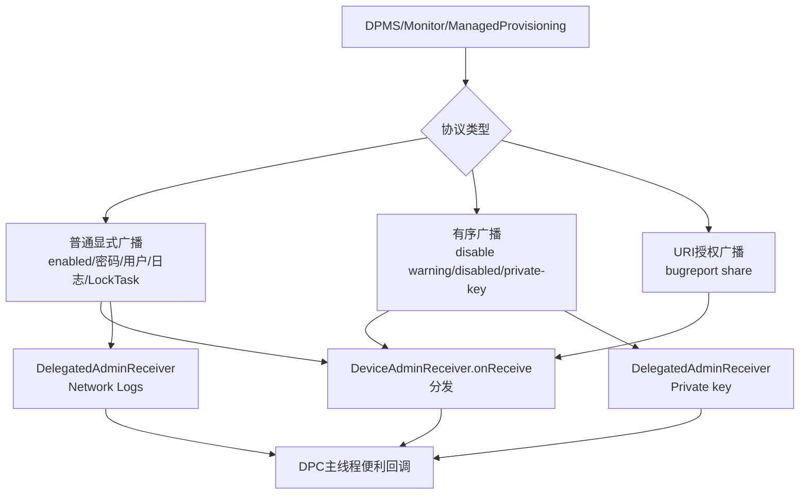
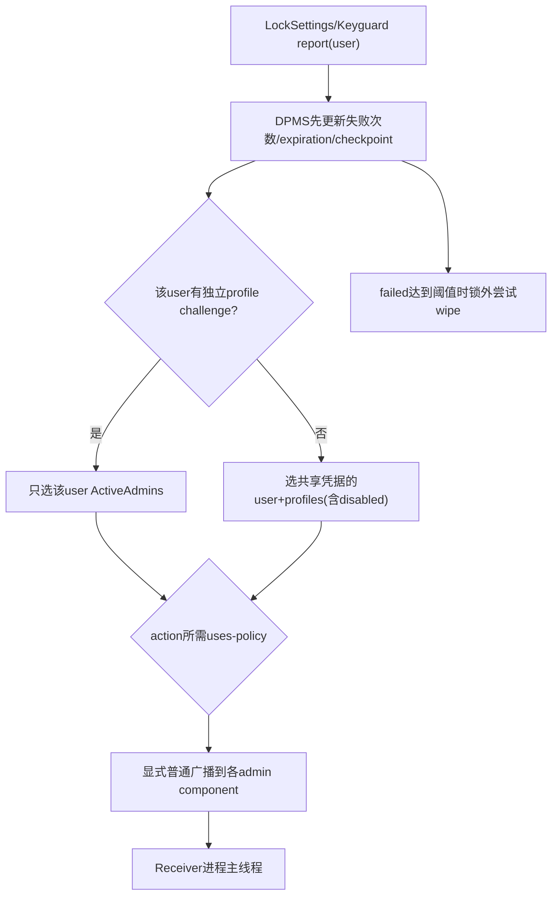
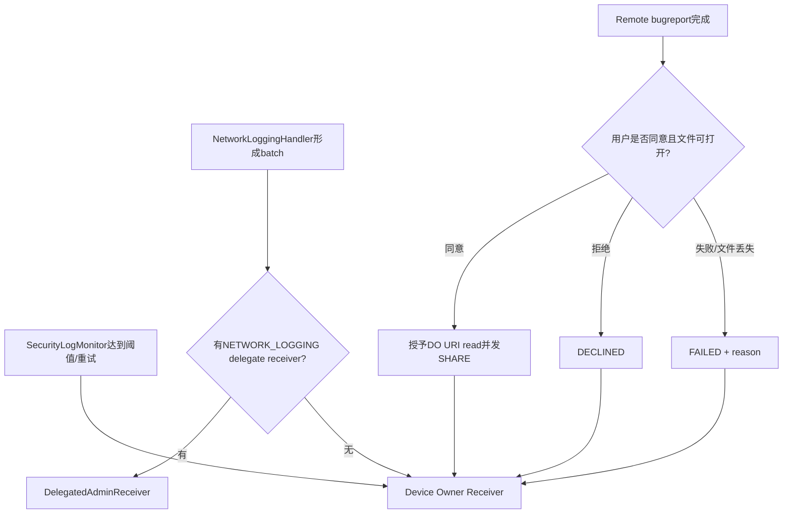

# 第 352 章 Android 企业 DeviceAdminReceiver 广播协议：密码、用户、日志、Bugreport、私钥、LockTask 与失败边界链

> 源码基线：Android 11 / API 30 / `android-11.0.0_r48`。本章只在 macOS 阅读源码，不编译。第351章解释 ActiveAdmin 何时收 enabled/disabled，本章把 `DeviceAdminReceiver` 的其余回调按协议拆开：谁选择目标、广播是否有序、extra怎样解释、应用回调是否能影响系统结果，以及丢广播后真实政策为何仍不能依赖 DPC 自己恢复。

## 1. DeviceAdminReceiver 是协议适配器

它继承 `BroadcastReceiver`，统一在 `onReceive()` 按 action 解包参数，再调用 `onPasswordChanged/onNetworkLogsAvailable` 等便利回调。DPC 通常覆写便利回调，不应重写 onReceive 后自行复制分发器。

## 2. 回调默认几乎都是空实现

平台把广播视为通知，而不是要求每个 DPC 必须实现的接口。未覆写时系统照常推进；真正安全政策保存在 system_server 与相关服务中，不依赖应用回调返回后才生效。

## 3. 回调运行在应用主线程

和普通 BroadcastReceiver 一样，`onReceive` 在进程主线程执行，长网络/磁盘工作会阻塞广播并可能触发 ANR。需要持续工作时应快速交给 Job/Service，并遵守后台执行限制。

## 4. 显式目标是主要安全边界

DPMS 多数 admin 命令设置精确 ComponentName；receiver 又应由 `BIND_DEVICE_ADMIN` 保护。这样普通应用难以伪造系统管理回调，也不会把敏感 extra 广播给所有监听者。

## 5. 不是所有 action 都由 DPMS 发送

profile provisioning complete 主要由 ManagedProvisioning 发；密码事件由 LockSettings/Keyguard 向 DPMS report 后再分发；日志由各 monitor/handler 触发；bugreport来自远程报告状态机。读 action 常量还必须追实际生产者。

## 6. 广播通知不等于业务提交

enabled、密码、日志、用户事件大多无结果回调，send 后即继续。DPC 收到、处理完成或向服务器上传成功，都不是系统 API 返回的组成部分。

## 7. 少数协议依赖有序结果

disable-requested 用 result extras 返回警告；disabled 用 final receiver决定何时删 admin；choose-private-key-alias 用 result data 返回 alias。必须逐 action 判断，不能统一称“DeviceAdmin广播都是无序”。

## 8. 一个 action 可能有不同接收基类

Network Logs 与 private-key selection 可发给 `DelegatedAdminReceiver`；它只分发这两种能力。DO/PO receiver 使用 `DeviceAdminReceiver`，二者默认实现与错误语义不同。

## 9. Extra 是协议而非便利数据

密码与用户生命周期依赖 `Intent.EXTRA_USER`，network logs依赖 token/count，bugreport依赖hash/failure code，transfer依赖PersistableBundle。缺失时基类常给 null、-1或0，并不统一抛异常。

## 10. 本章的阅读方法

每个广播固定回答六问：生产者、目标角色、目标user/component、普通或有序、extra/默认、回调返回是否影响平台。最后再看重试与丢失边界。

## 11. 广播协议总图

## 12. onReceive 的分发顺序

实现是一串 action `if/else if`。每个已知 action只进入一个分支；未知 action没有回调也没有基类 warning。若子类错误覆写 onReceive 且不调用 super，全部便利回调都会失效。

## 13. Enabled 的语义

`ACTION_DEVICE_ADMIN_ENABLED` 直接调用 `onEnabled(context,intent)`。第351章已证明 DPMS 先把 ActiveAdmin 放入内存并尝试保存，再发普通显式广播；onEnabled 是提交后通知。

## 14. onEnabled 可以设置政策

回调执行时组件已 active，因此可以调用需要 admin 身份的 DPM API。应用应让初始化幂等，因为首次广播可能丢失、进程可重启，owner transfer 还会给新组件再发 enabled。

## 15. createAndManageUser 的 enabled extras

创建并管理用户时 DPMS 可把初始化 `PersistableBundle` 包入 enabled Intent。它只供目标 DPC 初始化新用户，不意味着所有激活路径都有 Bundle；普通 setActiveAdmin 通常没有。

## 16. Pending enabled 的重发

createAndManageUser 会在 `DevicePolicyData.mAdminBroadcastPending` 保存待发标志；user start时 `maybeSendAdminEnabledBroadcastLocked()` 重试，成功发送后清 init bundle/标志并保存。这比普通首次激活多一层跨重启补偿。

## 17. send返回false与pending

该路径把 `clearInitBundle = sendAdminCommandLocked(...)`，只有发送函数找到 receiver并提交广播才清 pending。普通 setActiveAdmin 忽略 boolean，因此两种 enabled 的可靠性承诺不同。

## 18. Disable-requested 的警告协议

Settings/系统调用 `getRemoveWarning()` 发 `ACTION_DEVICE_ADMIN_DISABLE_REQUESTED` 有序前台广播。基类调用 `onDisableRequested()`，非 null 文本放入 result extras 的 `EXTRA_DISABLE_WARNING`。

## 19. 警告不能否决移除

返回值只是 UI 要展示的 CharSequence。最终是否移除由用户/系统流程决定，DPC 没有 veto boolean；普通 admin 也不能靠卡住 receiver永久阻止专用卸载入口。

## 20. Disable-requested 的 final receiver

DPMS final receiver读取整份 result extras并通过 RemoteCallback返回请求方。DPC若返回 null，基类不创建 warning字段；调用方仍会获得 null/空结果并继续UI。

## 21. Disabled 的清理协议

`ACTION_DEVICE_ADMIN_DISABLED` 同样使用有序广播，但便利 `onDisabled()` 无返回值。真正使用 final result的是DPMS：广播链结束后删除ActiveAdmin artifacts。

## 22. onDisabled 返回后的权限边界

文档说明回调返回后不再能调用受保护 DPM能力。源码实际在 final receiver随后摘 map/list；回调执行期间对象仍 active，这给应用一个短暂清理窗口。

## 23. Receiver查不到的移除缺口

第351章发现 send方法在query为空时返回false，remove调用者未处理，final receiver也不会运行。该缺口属于发送协议前置失败，而不是DPC onDisabled超时。

## 24. Password Changed 的生产者

系统可信调用 `reportPasswordChanged(userId)`，DPMS先清 failed attempts、更新密码有效checkpoint与expiration日期并保存，再向符合 `USES_POLICY_LIMIT_PASSWORD` 的管理员发 changed。

## 25. Changed 发生在状态更新后

DPC回调查询密码质量、expiration或失败次数时应看到新状态。保存失败仍可能让当前内存新、重启旧；广播本身不是持久化确认。

## 26. Password Failed 的生产者

`reportFailedPasswordAttempt(user)` 要求跨user/BIND_DEVICE_ADMIN等系统权限，先递增并保存失败次数，再计算最严格wipe阈值，向声明 `USES_POLICY_WATCH_LOGIN` 的目标发 failed。

## 27. Failed 广播早于 wipe 执行

DPMS在锁内发送通知，退出锁后若达到阈值再调用 `wipeDataNoLock()`。DPC可能收到failed时擦除请求尚未完成；达到阈值也可能因restriction/权限检查使wipe失败并记录warning。

## 28. Password Succeeded 不是每次解锁都发

只有 `mFailedPasswordAttempts != 0` 或 `mPasswordOwner >= 0` 才清状态、保存并发 success。因此它表示“失败/旧password owner状态后的首次成功”，不是普遍的每次解锁审计回调。

## 29. Biometric 不走三类密码广播

failed/successful biometric report在r48只写SecurityLog的认证尝试，未增加DPM failed-password计数，也不发 `ACTION_PASSWORD_FAILED/SUCCEEDED`。不能用这些回调统计所有生物识别尝试。

## 30. Password Expiring 是定时通知

boot、日期/时间或alarm路径进入 `handlePasswordExpirationNotification()`，只选择声明 EXPIRE_PASSWORD、timeout>0、expiration>0且进入grace窗口的admin。

## 31. Expiring 有两个时间来源

Intent自动附 `expiration` long，基类实际回调主要从 extra UserHandle分发；DPC也可用 DPM getter读取expiration。文档建议通知用户并在 password changed时撤销提示。

## 32. Expiring 会继续安排下一次检查

遍历发送后调用 `setExpirationAlarmCheckLocked()`。用户一直不改密码时通常每天重发；一次广播丢失不代表永远没有后续通知。

## 33. 密码广播的用户 extra

DPMS统一放 `Intent.EXTRA_USER=UserHandle.of(credentialUser)`，基类直接 `getParcelableExtra` 传给新版三参数回调。它不验证非 null，协议依赖系统生产者正确填充。

## 34. 旧回调兼容桥

三参数 `onPasswordChanged/Failed/Succeeded/Expiring` 默认调用已deprecated的两参数版本。旧DPC只覆写老方法仍能工作；新DPC应覆写带 UserHandle 的版本区分parent/profile。

## 35. 覆写新版不会自动调用旧版

若子类覆写三参数方法而不调用 super，旧两参数实现不会执行，这是正常Java动态分派。迁移代码不应同时把业务分别塞进两版造成重复或遗漏。

## 36. Separate challenge 决定发送范围

目标user有独立资料密码时，只向该user相关admin发送；没有独立challenge时，向共享这把凭据的本人及profiles中相应policy admin发送。

## 37. Disabled profile也可能在范围内

选择使用 `getProfileIdsWithDisabled()`，再按separate challenge过滤。工作资料当前被停用不等于其admin永远不关心共享parent密码；广播能否实际启动receiver仍受user运行/Direct Boot约束。

## 38. Extra user与receiver user可不同

共享challenge时，receiver运行在profile user，`Intent.EXTRA_USER`可能指parent credential user。DPC必须比较 `Process.myUserHandle()`，不能把进程user当事件user。

## 39. 密码事件按uses-policy筛选

changed用LIMIT_PASSWORD，failed/succeeded用WATCH_LOGIN，expiring用EXPIRE_PASSWORD。ActiveAdmin存在不代表会收到全部密码广播，manifest/历史同意政策声明决定普通admin入选。

## 40. 密码通知都是无结果发送

DPMS不等待DPC处理，也不根据返回修改wipe或expiration。管理员能观察、提醒和调用自己获权API，但不能在回调中阻止系统记账。

## 41. 密码事件路由图

## 42. LockTask Entering 的目标

ATMS通过内部接口通知DPMS某user进入lock task，DPMS遍历该user admin list，只向真实DO或PO发送 entering，不向普通admin或delegate发送。

## 43. Entering 的 package extra

Bundle放 `EXTRA_LOCK_TASK_PACKAGE`，基类取String传 `onLockTaskModeEntering(context,intent,pkg)`。源码未在基类校验非空，异常调用可能传null，正常生产者应给被锁定包。

## 44. LockTask Exiting 没有package参数

退出只调用 `onLockTaskModeExiting()`；DPMS没有把旧pkg传给便利回调。DPC需要自己保存进入时上下文，不能期待退出Intent总能提供包。

## 45. LockTask 广播前还调整StatusBar

进入时LockTaskController接管status bar，DPMS暂时取消自己status-bar policy；退出再恢复。广播通知和UI运行态调整同处一条方法，但DPC返回不控制StatusBar。

## 46. LockTask 事件会写PolicyEvent

对每个入选owner记录 enabled boolean与pkg。事件日志与应用广播是两个观察面；广播丢失不等于平台没记录模式变化。

## 47. 用户生命周期回调只给Device Owner

DPMS内部receiver监听 USER_ADDED/REMOVED/STARTED/STOPPED/SWITCHED，将它们转换为 DeviceAdminReceiver action，固定发给当前DO ActiveAdmin。

## 48. 生命周期 extra 的含义

每次创建 Bundle，放 `Intent.EXTRA_USER` 为发生事件的目标user。广播本身运行在DO所在user，目标user可能是另一个secondary/profile。

## 49. 生命周期广播加前台标志

`sendDeviceOwnerUserCommand()` 调 generic send 时 `inForeground=true`，因此加 `FLAG_RECEIVER_FOREGROUND`。这提高调度优先级，不改变BroadcastReceiver主线程时限。

## 50. User Added 的发送顺序

收到基础 USER_ADDED 后先通知DO，再在锁内pause设备级日志以等待affiliation。DO回调发生是异步的，通知提交与日志pause不相互等待。

## 51. User Removed 在清DPMS数据前通知

DPMS先发DO user-removed命令，再在锁内检查被删user affiliation、`removeUserData()`，必要时丢日志并恢复。DPC看到回调时平台清理可能尚未完成，extra user对象也已进入删除流程。

## 52. User Started 的次序

先发DO命令，然后可能发admin enabled，再移除该user DevicePolicyData cache、处理packages与personal-app suspension。广播异步，所以DPC回调与cache重载可并行交错。

## 53. User Stopped 的次序

先通知DO；若是managed profile，再更新personal-app suspension。owner service controller的stop还由SystemService lifecycle `handleStopUser()`执行，DeviceAdminReceiver回调与长期owner service不是同一通道。

## 54. User Switched 只是观察通知

DPMS转发当前切入user，不等待DO确认，不提供阻止switch的结果。真正switch授权由restriction、AMS与设备政策在请求前判断。

## 55. User Unlocked 没有对应便利action

DPMS监听 USER_UNLOCKED用于pending enabled、personal-app suspension和owner service等内部恢复，但 DeviceAdminReceiver r48没有 `onUserUnlocked` 分支。DPC若需要解锁持续工作主要依赖owner service/自己的系统允许机制。

## 56. 生命周期通知不是可重放队列

generic admin命令不保存pending；receiver不存在/发送失败通常不补发。DPC应在启动后查询当前 users/state，而不是只靠自安装以来的事件流重建权威数据库。

## 57. Profile provisioning complete 的生产者

ManagedProvisioning在最终化阶段向指定DPC发 `ACTION_PROFILE_PROVISIONING_COMPLETE`，基类调用 `onProfileProvisioningComplete()`。它不由generic DPMS sendAdminCommand主链生成。

## 58. Provisioning complete 不等于服务器配置完成

API文档明确 provisioning不等待DPC服务器交互。回调表示平台配置流程完成，DPC仍需自行等待网络/账号/后台数据，并在适当时启用managed profile。

## 59. 回调需要manifest filter

DPC receiver必须声明该action，且应是启动provisioning时指定的admin。与DPMS某些直接setComponent广播不同，ManagedProvisioning有自己的resolve/最终receiver确认流程。

## 60. Ready for user initialization 已废弃

`onReadyForUserInitialization()`还在类中，但r48 onReceive分发串没有相应 action分支。它是历史device initializer遗留，现代DPC不应依赖。

## 61. Pending System Update 的生产者门

只有持 `NOTIFY_PENDING_SYSTEM_UPDATE` 且来自system user的更新服务可调用DPMS。它把 `SystemUpdateInfo` 存到Owners全局文件，同值时不重复通知。

## 62. 同值抑制依赖内存比较

`Owners.saveSystemUpdateInfo()` 用 Objects.equals；不变返回false。变化时先改内存并尝试AtomicFile写，然后返回true，即便内部写失败无反馈，广播仍会发。

## 63. Update extra 的清空语义

Intent放首次available的wall-clock receivedTime；`info==null`放-1，表示当前没有pending update。基类默认也是-1，DPC要结合getPendingSystemUpdate确认详情。

## 64. Update 先发DO

clean identity后，若有DO就设置其component并发到DO user；不检查DO user是否在runningUserIds。显式broadcast能否拉起由user运行状态与平台规则决定。

## 65. Update 只发运行中PO

随后从AMS取running user IDs，仅对这些user存在的PO发送。停着的profile owner不会在本轮收到；pending info仍在Owners，之后可通过getter查询，但源码片段未见在PO启动时自动补发同一通知。

## 66. Update Intent 被复用

同一个Intent逐次 `setComponent()` 给DO与多个PO，发送时Binder会序列化当前状态。单线程循环中可用，但异步接收顺序不保证等同发送顺序。

## 67. System update callback适用于DO/PO

基类不验证接收者角色，只解extra调用便利方法；安全边界在DPMS目标选择和receiver保护。手工伪造无权限广播应被manifest权限挡住。

## 68. Security Logs Available 的生产者

SecurityLogMonitor在pending日志达到阈值、forced或retrieve rate-limit到期时允许取数，并调用 `sendDeviceOwnerCommand(ACTION_SECURITY_LOGS_AVAILABLE,null)`。

## 69. Security日志有重试节奏

允许retrieve时设置下次notification时间；未取日志可在间隔后再次通知。它是边沿+重试提示，不保证每批只收到一次，也不在Intent中携带日志本身。

## 70. Security日志只给DO

generic sendDeviceOwnerCommand仅对Network Logs特殊解析delegate；Security action直接回退DO component。r48没有 security-logging delegated receiver通道。

## 71. Affiliation 会暂停通知与取数

设备出现unaffiliated users时 monitor被pause，文档说明直到全体重新affiliated才收回调。DPC不能把长时间没广播简单解释为无安全事件。

## 72. Network Logs Available 的生产者

NetworkLoggingHandler形成非空batch后构建 extras：`long batchToken`和`int count`，在不持handler锁时通知DPMS，避免回调DPMS造成锁反转。

## 73. Network token是取数句柄

DPC用token调用retrieve；取到后该批及更旧批次延迟删除。token不是日志时间戳，也不能跨logging关闭/affiliation失效永久使用。

## 74. Network Logs 优先delegate

sendDeviceOwnerCommand看到该action先 `resolveDelegateReceiver(DELEGATION_NETWORK_LOGGING,action,doUser)`；能解析就发delegate，解析不到才发DO receiver。

## 75. Delegate必须声明匹配receiver

resolve过程结合delegation map、包安装、intent filter与BIND_DEVICE_ADMIN。一个包可用 `DelegatedAdminReceiver` 接收，不需要成为ActiveAdmin；但委托本身仍由DO授予并可撤销。

## 76. Delegate默认实现会抛异常

DelegatedAdminReceiver的network/private-key便利方法默认 `UnsupportedOperationException`，不同于DeviceAdminReceiver的空实现。声明filter却不覆写回调会让receiver执行异常，DPC必须实现所声明能力。

## 77. Network extra 缺失默认值

两种receiver基类都以token=-1、count=0解包，而公开契约期望count>=1。基类不主动拒绝；受信生产者正常给合法值，测试/兼容代码仍应防御异常参数。

## 78. 日志广播不等于日志交付

Intent只通知“可取”，实际数据通过DPM Binder返回并有affiliation、enabled、rate-limit、token等检查。receiver完成不自动确认消费，也不会让batch立刻删除。

## 79. Bugreport request 的异步状态机

DO请求后DPMS启动remote bugreport service、注册完成/用户同意receiver、显示系统通知并设置timeout。最终有declined、share、failed三类DeviceAdmin回调。

## 80. 用户同意是强制边界

报告完成但尚未接受时，URI/hash写入OwnerInfo并显示通知；只有用户接受后才尝试向DO分享。DO不能仅凭request获得文件。

## 81. Bugreport Sharing Declined

若服务仍active就停止、取消timeout/完成receiver，清accepted与持久URI/hash，再发 `ACTION_BUGREPORT_SHARING_DECLINED`。回调只是告知DO用户拒绝，不提供重写同意的结果。

## 82. Bugreport Share 的Intent能力

DPMS构造精确DO component Intent，设置data+MIME、hash extra和 `FLAG_GRANT_READ_URI_PERMISSION`，通过UriGrantsManager显式授予目标包，然后发送。

## 83. Share callback如何取文件

基类把hash传 `onBugreportShared()`；文件URI仍从 `intent.getData()`取得，不能把hash当路径。临时URI授权的生命周期与进一步复制保存由DPC自行管理。

## 84. 分享前先验证文件可打开

DPMS先用ContentResolver打开PFD；URI缺失或文件已不可用会转为 `BUGREPORT_FAILURE_FILE_NO_LONGER_AVAILABLE`，不发share。

## 85. Bugreport Failed 的两个原因

完成过程失败默认code 0；文件不再可用code 1。基类缺extra时默认code 0，DPC应把未知/默认作为可重试失败而非证明具体底层原因。

## 86. 分享finally总清持久URI/hash

无论share发送成功或FileNotFound，finally重置accepted并清Owners中URI/hash。普通广播无ack，因此DPC没收到时平台也可能已忘记可分享文件引用。

## 87. Bugreport回调不走generic预查询

declined/failed经 `sendDeviceOwnerCommand`直接 `sendBroadcastAsUser`；share也直接send。没有 `queryBroadcastReceivers` boolean与补发队列，DO receiver配置错误可能静默错过最终状态。

## 88. Remote bugreport timeout

超时Runnable进入失败清理、停止服务并通知DO。timeout与完成/同意receiver需通过AtomicBoolean与handler callback协调；DPC不应假设request后必有share，必须处理failed/declined。

## 89. Bugreport跨重启恢复有限

OwnerInfo持久URI/hash让boot completed时恢复用户同意通知；“采集中”的AtomicBoolean与已注册receiver不是完整持久状态。重启能恢复已完成待同意，不等于续跑任意中间采集。

## 90. Bugreport/日志/更新都不是同一审计面

Security logs是环形安全事件，Network logs是批次token，Bugreport是用户同意后的文件能力，SystemUpdate是pending元数据。虽然都通过receiver回调，存储、重试和权限完全不同。

## 91. 日志与Bugreport路由图

## 92. Private Key Alias 的调用来源

KeyChain需要客户端证书时通过系统入口让owner/delegate选择alias。DPMS要求system caller，接收请求app UID、目标URI、预选alias和响应Binder。

## 93. Alias chooser 的角色优先级

先找请求所处user的Profile Owner；若没有且caller是system user，再找Device Owner。secondary非system user没有PO时不会跨到DO，直接向响应返回null。

## 94. Cert-selection delegate再覆盖owner

找到基础aliasChooser后，DPMS尝试解析 `DELEGATION_CERT_SELECTION` receiver；存在就把Intent component改为delegate，否则发owner。这里delegate与network delegate类似但scope不同。

## 95. Alias 是有序前台广播

Intent带请求UID/URI/alias/response Binder并加FOREGROUND，通过 `sendOrderedBroadcastAsUser()`；final receiver读取 `getResultData()`，再回调原始Binder response。

## 96. DeviceAdminReceiver如何返回alias

基类调用 `onChoosePrivateKeyAlias()`，将返回String用 `setResultData(chosenAlias)`写入有序广播结果。null表示继续默认picker，`KEY_ALIAS_SELECTION_DENIED`表示拒绝用户选择。

## 97. Delegate返回协议相同

DelegatedAdminReceiver也解同样extras并setResultData。它默认抛UnsupportedOperationException，所以委托包必须真正实现；final receiver在广播异常/无结果时通常得到null。

## 98. Response Binder extra不是普通DPC API

Intent还携带 `EXTRA_CHOOSE_PRIVATE_KEY_RESPONSE`，但基类便利回调并不使用它；真正返回由DPMS final receiver统一完成，避免DPC直接随意多次调用系统响应。

## 99. Alias回调不能长时间联网

调用方正在等待选择结果，receiver又在主线程/有序链。DPC应本地快速决策；超时会拖慢KeyChain认证流程，最终可能按null失败或显示picker。

## 100. Transfer Ownership Complete

新owner在ActiveAdmin/Owners切换后收到 action，基类取 `PersistableBundle` 传 `onTransferOwnershipComplete()`。第350章已说明complete可能早于metadata删除，随后崩溃仍可能反向回滚。

## 101. Affiliated Profile Transfer Complete

若profile transfer后user仍affiliated，DPMS另向DO发送 action，extra UserHandle指被转移profile。它用于协调先转PO再转DO的双实例管理应用流程。

## 102. Transfer回调都是普通广播

`sendProfileOwnerCommand/sendDeviceOwnerCommand`没有有序result，DPC不能用返回确认接受。平台完成/回滚依赖自己的metadata，不依赖新owner callback成功。

## 103. sendDeviceOwnerCommand 的特殊分流只有Network

r48函数仅在 action==NETWORK_LOGS_AVAILABLE时解析delegate，其余action都使用Owner component。不要因private-key也支持delegate就以为它经过同一函数；private-key有独立选择代码。

## 104. Generic sendAdminCommand 会先query

密码、enabled、disabled、LockTask等走generic helper，先query匹配receiver，找不到返回false；owner command helper则直接send。不同发送器的失败可观察性不一致。

## 105. Owner changed 广播不是DeviceAdminReceiver回调

`ACTION_DEVICE_OWNER_CHANGED/PROFILE_OWNER_CHANGED`用include-background普通广播发给对应user，未set admin component；DeviceAdminReceiver onReceive也没有这两个分支。它面向系统/相关监听者，而非便利回调协议。

## 106. Background execution的区别

owner-changed显式加 INCLUDE_BACKGROUND；生命周期admin命令加FOREGROUND；generic普通命令用BroadcastOptions允许后台activity start；sendActiveAdminCommand没有统一这些flags。每条广播的后台行为必须看具体helper。

## 107. 现场排查“回调没有触发”

先确定生产者是否执行，再查目标角色/component/user、uses-policy/delegation、receiver filter和BIND_DEVICE_ADMIN、user是否running/unlocked、发送helper是否query返回false，最后才查应用onReceive。

## 108. 现场排查“extra为null或默认”

核对是否真由系统显式广播、是否经过正确action；基类对UserHandle无默认保护、日志token用-1/count0、update time用-1、bugreport reason默认0。DPC应记录原Intent并防御异常值。

## 109. 现场排查“重复通知”

Security logs设计会重试，password expiration会周期重发，system update同值才抑制，network每batch新token，用户生命周期可能随重启/事件再次发生。业务端应按稳定ID/state幂等，而非按action只处理一次。

## 110. 现场排查“通知到了但数据取不到”

Network token可能因affiliation/关闭logging/批次淘汰失效，Security日志受rate limit和pause，Bugreport URI可能过期，pending update可能已被新info替换。通知是时点能力提示，不是永久数据副本。

## 111. 本章心智模型

把DeviceAdminReceiver当“多协议复用的显式广播端口”，而不是一个统一事务callback。每个action拥有独立生产者、目标集合、extra、重试和结果语义；权威状态始终在对应system service。

## 112. macOS只读练习一：做广播矩阵

从DeviceAdminReceiver所有action选 enabled/disabled、四个password、五个user、LockTask、update、三类bugreport、两类logs、private-key、transfer，列生产者、角色、user、是否有序、extra、是否重试和返回值用途。

## 113. macOS只读练习二：追共享凭据密码事件

假设parent user0、managed profile10共享密码，二者各有不同uses-policy admins。分别对changed/failed/succeeded/expiring沿 `sendAdminCommandForLockscreenPoliciesLocked` 写出receiver user与EXTRA_USER，并再切换profile独立challenge比较。

## 114. macOS只读练习三：比较两种委托

阅读 `sendDeviceOwnerCommand()`、`choosePrivateKeyAlias()`与DelegatedAdminReceiver，比较NETWORK_LOGGING和CERT_SELECTION的delegate解析、回退owner、普通/有序广播、默认回调、结果数据及失败表现。

## 115. macOS只读练习四：手推Bugreport四时序

分别推演“完成前接受”“完成后接受”“用户拒绝”“文件已丢失”，记录AtomicBoolean、URI/hash Owners持久化、notification、URI grant、发给DO的action/reason及finally清理；不执行真实bugreport。

## 116. 本章检查题

为什么password succeeded不是每次解锁都发？为什么User Removed回调不代表DPMS已清完user数据？为什么Network Logs可发delegate而Security Logs不行？为什么收到Bugreport Share仍必须从Intent data读取URI？

## 117. 复读修正一：并非所有回调都由DPMS统一helper发送

Profile provisioning由ManagedProvisioning，private-key有独立有序协议，bugreport share含URI grant，owner-changed不是admin便利action。文档已按真实生产者拆分，避免把generic sendAdminCommand的flags和query语义套到全部广播。

## 118. 复读修正二：密码事件的目标不是简单calling user

共享challenge会跨profile group发送，receiver所在user与EXTRA_USER可不同；successful又只在先前失败/passwordOwner存在时发，biometric不进入该计数。文档已把凭据模型与用户模型分开。

## 119. 复读修正三：日志回调只是短期取数提示

Security可重试但受pause/rate limit，Network token受batch生命周期和affiliation约束；广播不携带日志、不确认消费。DPC必须幂等取数并处理token失效，而不是把回调本身当审计记录。

## 120. 本章结论与下一章

第352章建立了r48 DeviceAdminReceiver广播矩阵：普通通知、有序结果、URI能力和delegate分流各自独立；密码按凭据共享组、用户事件只给DO、日志与bugreport有不同重试/同意边界。下一章深入 DeviceAdminServiceController：常驻owner service的resolve、bind、backoff、package/user生命周期、连接死亡和它与一次性Receiver广播的职责分工。
