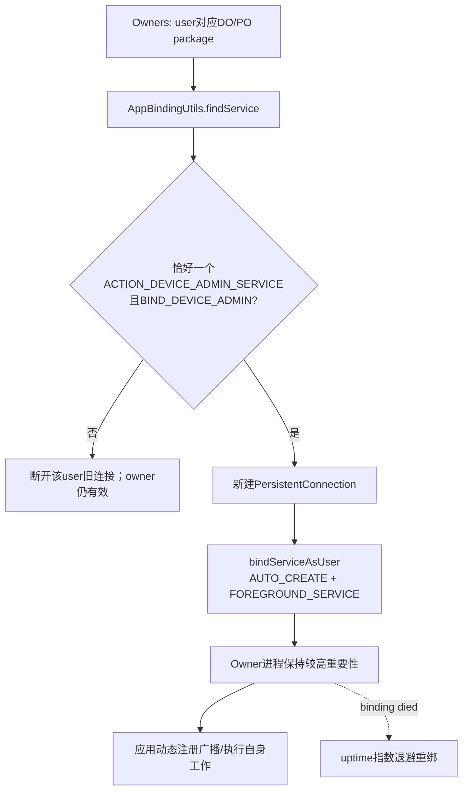
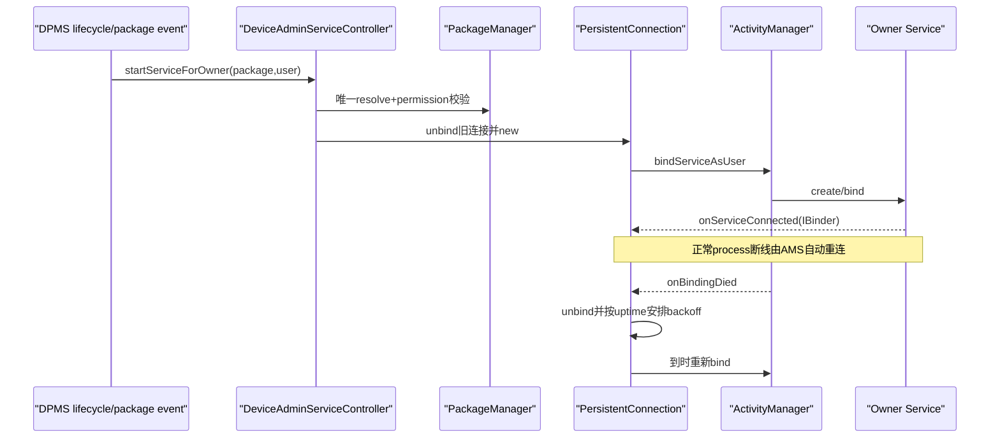

# 第 353 章 Android 企业 DeviceAdminServiceController：常驻 Owner 服务解析、绑定退避、用户/包生命周期与 Receiver 分工链

> 源码基线：Android 11 / API 30 / `android-11.0.0_r48`。本章只在 macOS 阅读源码，不编译。第352章研究一次性 `DeviceAdminReceiver` 广播，本章研究DO/PO可选的 `DeviceAdminService`：系统为何长期绑定它、怎样唯一解析、连接怎样死亡重试，以及它为什么不是第二套DevicePolicy Binder API。

## 1. DeviceAdminService 解决什么问题

Android O以后，manifest隐式广播受到后台限制。DO/PO可声明一个常驻绑定Service，让其进程在owner user运行时尽量保持活动，再由进程动态注册receiver接收需要的隐式广播。

## 2. 它是可选能力

owner包没有该Service仍然是合法DO/PO，所有DPM政策、显式DeviceAdminReceiver回调照常工作。Controller找不到服务时只断开旧连接，不清owner身份。

## 3. 只有Owner包会被绑定

DPMS从Owners身份账取得给定user的DO或PO component，再用其package解析Service。普通ActiveAdmin即使声明同action也不会触发这套常驻连接。

## 4. 连接粒度是user

Controller的 `SparseArray<DevicePolicyServiceConnection>` 以userId为key，一个user最多一个连接。不同users里的同一DPC包拥有不同进程/UID语境与独立连接状态。

## 5. DO与PO异常同user时DO优先

`getOwnerComponent(user)`先判断DO userId，再判断PO。第350章所说同user双owner本就不支持；若异常存在，常驻Service选择DO包，不会同时绑定两个。

## 6. Service不是广播Receiver

Receiver在一个action到来时短暂运行；Service通过AMS绑定保持进程重要性。Service本身不会自动收到DeviceAdminReceiver便利回调，应用仍需receiver或动态广播监听器。

## 7. Service也不是前台通知服务

系统使用 `BIND_FOREGROUND_SERVICE` 绑定，提高hosting process调度/重要性；DPC不需要因此调用startForeground或显示自己的常驻通知。它和应用主动启动foreground service是不同机制。

## 8. Binder接口为空

`IDeviceAdminService.aidl` 在r48没有方法，`DeviceAdminService`只返回一个空Stub。system_server不通过它请求业务操作，绑定本身就是主要功能。

## 9. 为什么仍转换为AIDL接口

通用 `PersistentConnection<T>`需要把IBinder保存成类型T，Controller用 `IDeviceAdminService.Stub.asInterface()`。未来可扩展接口，但r48代码没有读取getServiceBinder调用业务方法。

## 10. 核心源码位置

`DeviceAdminServiceController.java`负责owner解析与每user连接；`PersistentConnection.java`负责AMS连接、死亡和退避；`AppBindingUtils.java`负责唯一Service校验；app基类在`DeviceAdminService.java`。

## 11. Owner Service总体图



## 12. Action常量

Service声明intent-filter `android.app.action.DEVICE_ADMIN_SERVICE`。Controller用 `Intent(action).setPackage(ownerPackage)`查询，再把解析出的精确component用于bind。

## 13. setPackage不是最终绑定目标

查询阶段限制owner包但允许PackageManager返回具体ServiceInfo；通过校验后PersistentConnection构造显式Component Intent。最终AMS不会再次按action在多个包中选择。

## 14. 必须恰好一个Service

查询结果0个返回null；超过1个也视为错误并全部忽略，即使只有一个exported。一个owner包只能声明一个匹配Service，避免系统随意选择。

## 15. 多个Service不是主备

AppBindingUtils不会按priority、enabled或类名选最佳；size>1直接失败。DPC若想模块化，应只暴露一个协议Service，在其进程内自行协调。

## 16. 必须精确使用BIND_DEVICE_ADMIN

ServiceInfo.permission必须等于 `android.permission.BIND_DEVICE_ADMIN`，缺失或其他权限都返回null。这样只有系统等持签名权限调用者能绑定。

## 17. Receiver和Service使用同一保护权限

两者都要求BIND_DEVICE_ADMIN，但manifest组件类型和用途不同。receiver保护显式管理广播；service保护长期Binder连接，不能只在其中一处声明。

## 18. AppBindingUtils不验证Owner身份

它只是通用包内Service解析器；真正“包是DO/PO”由DPMS调用前确定。直接复用findService不能给任意包授予owner进程重要性。

## 19. 错误详情被Controller丢弃

findService传新StringBuilder但注释为ignore error message。AppBindingUtils对多Service/错误permission会Log.e；0个Service仅debug（且DEBUG=false），现场可能只能从dumpsys看不到连接。

## 20. 组件enabled状态依赖PM查询

query flags为0，通常只返回当前user可用/enabled且符合Direct Boot状态的Service。DPC可用PackageManager禁用自己的Service，Controller下次解析不到就断开。

## 21. DPC为何应主动禁用不用的Service

基类文档建议不需长期前台时disable组件，减少常驻内存和重启压力。owner身份与政策不受影响，需要时再enable并依靠package-changed触发重连。

## 22. Direct Boot边界

user start早于unlock时会尝试startOwnerService；若Service非directBootAware且CE尚锁，解析/绑定可能失败。unlock回调再次start，给普通Service第二次机会。

## 23. startServiceForOwner先清Binder身份

Controller用DPMS Injector `binderClearCallingIdentity()`包住解析与绑定，防建立owner的外部调用者UID影响PackageManager/AMS权限。finally恢复原identity。

## 24. Controller有自己的锁

Service解析、连接map替换、bind/unbind在 `mLock` 下串行。PersistentConnection内部还有另一把锁，形成Controller容器状态与单连接状态两层同步。

## 25. DPMS主锁与Controller锁分开

DPMS通常先读取Owner component，再调用Controller；Controller不在连接回调中反向调用大量DPMS政策。分锁降低长AMS绑定阻塞DevicePolicy API的范围，但跨组件仍非事务。

## 26. 找不到Service会断旧连接

即使此前已连上，只要本次resolve为null，`disconnectServiceOnUserLocked()`会unbind并从map移除。这使包更新删除/禁用Service及时释放进程。

## 27. 重新start总会重建连接

若已有connection，即便component相同也先unbind再new connection。注释说明package更新时旧binding可能已死，强制重建比复用旧对象可靠。

## 28. 强制重建也重置退避历史

新PersistentConnection的next backoff从初值开始，旧对象计数与scheduled runnable被取消。因此user unlock/package broadcast等显式start会清掉反复崩溃积累的退避。

## 29. resolve发生在断旧连接之前

Controller先findService，再检查existing。若新解析失败则断旧；若成功再断并创建。不会先制造无连接窗口后才知道新component是否合法，但实际unbind/rebind仍有短暂间隔。

## 30. map先put再bind

新connection放入 `mConnections[user]` 后调用bind。bindService失败时map仍持对象，dumpsys可显示“bound但未connected”的异常状态。

## 31. 绑定与重绑定时序图



## 32. 绑定flags的组合

PersistentConnection固定加 `BIND_AUTO_CREATE`，子类返回 `BIND_FOREGROUND_SERVICE`。前者让AMS在需要时创建目标进程/Service，后者让绑定关系按foreground-service级重要性处理。

## 33. 这不是startService

Controller方法名叫startServiceForOwner，但实现只bind，不调用Context.startService。Service生命周期由绑定引用决定，最后一个连接unbind后AMS可销毁它。

## 34. DeviceAdminService.onBind是final

基类禁止子类替换Binder，始终返回内部空IDeviceAdminService Stub。DPC若需要自己的业务Binder，应另建Service，不能在这个系统协议Service覆写onBind。

## 35. DPC可覆写哪些生命周期

它仍可覆写Service的onCreate/onDestroy等普通生命周期来注册/注销动态receiver，但onBind已final。初始化应可重复，因为package更新、unlock或崩溃都可能重建Service。

## 36. onServiceConnected 的迟到保护

回调取得PersistentConnection锁，若 `mBound=false`说明此前已unbind，记录warning并忽略，不把迟到Binder重新写回已停止连接。

## 37. Connected时记录什么

增加connected计数，置isConnected=true，记录uptime，转换并保存AIDL接口，随后安排stable check。没有调用DPC业务方法或“ready”ack。

## 38. isBound与isConnected不同

bound表示客户端期望并已向AMS发起绑定；connected表示收到有效onServiceConnected。启动、重试或失败窗口可以bound=true、connected=false。

## 39. mShouldBeBound是意图状态

显式bind置true，显式unbind置false。退避Runnable执行时先检查它，避免Controller已经stop却被旧scheduled任务重新绑定。

## 40. mService只用于状态保存

r48 Controller没有读取 `getServiceBinder()`并调用接口。Binder为null/死亡主要反映连接健康和进程重要性，而非丢失某个进行中的system_server RPC。

## 41. 普通onServiceDisconnected

目标进程被kill等情况下AMS会调disconnected，PersistentConnection清connected/service/stable check，但不自己增加backoff或显式bind；注释说明AMS会自动重连同一binding。

## 42. 为什么Disconnected不退避

一次正常进程回收不等于崩溃循环，AMS保留binding并负责拉起。Controller若也schedule会与AMS双重重绑；所以只记录计数并等待新connected。

## 43. onBindingDied的含义

AMS放弃这条binding，例如package更新或进程反复崩溃，会调用该回调。此时PersistentConnection不能继续等AMS，必须自己unbind并定时建立新binding。

## 44. BindingDied迟到也会忽略

若mBound已false，记录warning return，防stop后死亡回调安排幽灵重连。它不检查Controller map是否仍指向自己，主要依赖旧对象显式unbind取消状态。

## 45. scheduleRebind先解绑

它调用unbindLocked清旧binding、connected/service与stable runnable，但不把 `mShouldBeBound`置false；然后按nextBackoff安排handler任务。

## 46. 指数退避公式

安排当前delay后，把 `next=min(max,next*increase)`。默认初始1小时、倍数2、上限1天；连续binding died会按1h、2h、4h、8h、16h、24h…。

## 47. 默认退避为何很长

常驻owner反复崩溃会造成电量和系统负载；普通断线仍由AMS快速自动重连，只有AMS明确放弃时才进入小时级自助重试。

## 48. Settings可配置的四项

Global `device_policy_constants`支持initial backoff、increase、max与stable threshold。解析坏字符串记录错误并使用能读到的defaults。

## 49. 参数下限

initial至少5秒，increase至少1，max至少initial。stable threshold没有相同下限校正，负值会让connected后的stable check几乎立即满足并重置backoff。

## 50. 退避时间使用uptime

重连时间为 `SystemClock.uptimeMillis()+delay`，Handler `postAtTime`。设备deep sleep期间uptime不增长，所以“1小时”更接近累计awake uptime，墙钟等待可能更长。

## 51. Stable connection的重置

connected后在默认2分钟阈值安排check；若到时仍bound且connected，nextBackoff重置初值。短暂连上又快速binding died不会获得重置。

## 52. stable check不是健康RPC

空AIDL没有ping业务逻辑；稳定只定义为ServiceConnection持续connected达到时长。DPC主线程死锁但进程/Binder尚在，可能仍被视为稳定。

## 53. 显式start也重置backoff

bind()调用 `bindInnerLocked(resetBackoff=true)`，且Controller每次new对象。package广播、unlock等重新start会绕开剩余长退避，这对更新后快速恢复很重要。

## 54. 显式stop取消重试

unbind置shouldBeBound=false，remove backoff/stable callbacks、调用Context.unbindService、清connected，再由Controller从map删除。之后旧Runnable即使竞态执行也检查should=false退出。

## 55. 初次bind返回false的缺口

`bindServiceAsUser()`返回false时只Log.e；代码此前已置mBound=true，既不改回false，也不schedule backoff。于是对象显示bound但永不connected，等待下一次显式start重建。

## 56. 失败不是onBindingDied

没有成功建立binding就不会必然收到binding-died回调，不能指望指数退避修复。Direct Boot不匹配、组件禁用/不可导出或AMS拒绝都可能落入该窗口。

## 57. stop对“假bound”仍调用unbind

初次bind false但mBound=true，后续Controller stop会调用Context.unbindService；若系统从未登记connection，Context可能抛 `IllegalArgumentException`，PersistentConnection没有catch。正常framework语义需测试确认具体Context实现是否保留失败注册。

## 58. 这里应谨慎描述而非断言必崩

源码足以证明mBound未回滚和无重试，但unbind失败是否抛取决于Context/LoadedApk对失败binding的登记。文档不把潜在异常写成必现，只列为需要故障注入验证的r48边界。

## 59. Controller不检查conn.bind结果

PersistentConnection.bind返回void，Controller没有成功反馈，也不会删除map。DPMS lifecycle继续完成，owner API不会因可选Service绑定失败而失败。

## 60. Service失效不影响政策权威

相机、restriction、日志采集等仍在system_server执行；DPC进程不常驻只影响其动态监听/自行业务。设计上不能让安全政策依赖这条脆弱连接。

## 61. User Start触发连接

DPMS `handleStartUser()`先恢复screen capture、restrictions与密码缓存，再 `startOwnerService(user,"start-user")`。政策先恢复，DPC常驻进程后启动。

## 62. User Unlock再次重连

`handleUnlockUser()`无条件start。若start阶段已连接，也会先unbind再bind；这让CE依赖Service在解锁后重建，但会产生一次正常连接抖动。

## 63. 为什么不只在Unlock启动

directBootAware owner可能需要在锁屏启动阶段运行，且DO/PO政策相关事件可能早于unlock。双触发兼容两类Service。

## 64. User Stop显式断开

`handleStopUser()`调用stop，取消backoff并移除map。类注释也要求user stop必须unbind，防停用profile仍靠绑定保持进程。

## 65. User Removed通过Stop/清理收敛

用户删除通常先stop，再DPMS removeUserData/Owners。Controller没有持久连接账；system_server重启后只会为实际存在且start的owner user重建。

## 66. Set Device Owner后的启动

身份写盘、限制与owner changed等步骤后，DPMS调用startServiceForOwner(owner package,user,"set-device-owner")。可选Service失败不改变setDeviceOwner返回true。

## 67. Set Profile Owner后的启动

PO建立、默认restrictions与广播之后再启动Service。DPC可能先收到profile-owner changed/onEnabled类广播而Service连接尚未完成，不能依赖固定跨通道顺序。

## 68. Clear Owner先停Service

clearDeviceOwnerLocked/clearProfileOwnerLocked一开始就stop，再清政策与身份。这样DPC进程不会因owner绑定继续常驻并在退管过程中动态监听系统事件。

## 69. Stop不会杀死整个应用

unbind只释放这条连接；若包还有Activity、Receiver、Job或其他Service，进程可继续存在。它也不撤销应用数据与普通权限，完整退管由后续清理处理。

## 70. Transfer启动新owner Service

ActiveAdmin与Owners组件换成target并写盘后，transfer helper调用startServiceForOwner(target package,user)。Controller发现旧connection就unbind，再解析/绑定新包。

## 71. Transfer不要求target声明Service

支持ownership transfer由DeviceAdminReceiver meta-data判断；DeviceAdminService仍可选。target无Service会断旧source连接，但transfer本身继续成功。

## 72. Package Changed触发重解析

第351章handlePackagesChanged若变更包等于owner package，调用startOwnerService。即使同component，Controller也强制新resolve与connection，专门处理package update使旧binding死亡的问题。

## 73. Package Added replacing触发同一路径

APK更新的PACKAGE_ADDED with replacing会进入handlePackagesChanged，给刚安装新版本的Service重新绑定。onBindingDied退避和package广播显式重启可能竞态，但旧connection unbind会取消其runnable。

## 74. Package Removed的异常身份情况

正常PMS保护owner包不可卸载；若包确实消失，handlePackagesChanged仍看到Owners package匹配并start，findService null后断连接。Owners身份可能继续残留，ServiceController不负责清身份。

## 75. Service组件enable/disable广播

PACKAGE_CHANGED带owner package会重新resolve。DPC主动disable service后系统断开；重新enable后系统重建，符合基类文档建议。

## 76. 一user一连接的后果

同owner包不能声明多个Service；同user也不能为DO/PO各保持一个。Controller map设计与Owners正常不变量一致，异常双owner被折叠。

## 77. BackgroundThread Handler

Controller使用 `new Handler(BackgroundThread.get().getLooper())`。ServiceConnection callbacks通过bindServiceAsUser的handler参数投递到system_server后台线程，退避/stable runnable也在该Looper。

## 78. 它不是DPMS主Handler

DPMS main handler处理许多广播/alarms；Owner Service连接用共享BackgroundThread，减少连接回调阻塞DPMS主Looper，但也会与其他系统后台任务共享队列。

## 79. Controller锁跨bind调用

start在mLock内调用conn.bind，后者会进入Context/AMS Binder。若远端慢，其他user的Service start/stop也等待同一Controller锁；连接按user存储但容器锁是全局一个。

## 80. 回调不获取Controller锁

PersistentConnection ServiceConnection只取自身mLock，不更新Controller map。这样避免AMS回调与start持Controller锁时直接互锁；旧对象是否仍在map由显式unbind迟到保护解决。

## 81. 三层状态图

```mermaid
stateDiagram-v2
    [*] --> "Controller无entry"
    "Controller无entry" --> "shouldBound+bound,未connected": "start/new/bind"
    "shouldBound+bound,未connected" --> "connected": "onServiceConnected"
    "connected" --> "bound,未connected": "onServiceDisconnected; AMS自动重连"
    "connected" --> "rebindScheduled,未bound": "onBindingDied"
    "rebindScheduled,未bound" --> "bound,未connected": "backoff到时"
    "bound,未connected" --> "rebindScheduled,未bound": "后续binding died"
    "connected" --> "Controller无entry": "user stop/clear/no service"
    "rebindScheduled,未bound" --> "Controller无entry": "显式stop取消"
```

## 82. Backoff计数只在对象生命周期内

connected/disconnected/died计数与next backoff都不持久化。system_server重启、package事件强制new或unlock重启会归零，不能用于长期SLA统计。

## 83. Dumpsys输出

Controller dump在有连接时打印Owner Services、user、component、bound/connected、剩余reconnect、next backoff、三类计数和connected duration。无entry时整个section不输出。

## 84. actionForLog没有进入连接对象

start/stop参数只用于debug文本；DEBUG常量false时通常看不到。它不影响backoff、bind flags或dumpsys，因此“start-user/package-broadcast”等不是状态机原因码持久记录。

## 85. Constants也会dump

DPMS dump可打印当前 `mConstants` 四个DAS值，方便对照理论backoff。但Controller在构造时保存传入对象引用，动态更新存在特殊边界。

## 86. Global settings observer会替换DPMS常量对象

`DevicePolicyConstantsObserver.onChange()`执行 `mConstants=loadConstants()`。它不是修改原对象字段，因为常量字段final，而是换成新实例。

## 87. Controller持有旧常量引用

Controller构造器把当时的 `DevicePolicyConstants` 存入自己的final字段；observer后来替换DPMS字段时没有通知Controller。因此运行时改Global setting不会影响Controller随后new的connection。

## 88. Dump可能显示与实际不同的值

DPMS常量dump读取新 `mConstants`，Controller实际构造connection读取旧引用。r48现场用settings调参时可能看到dump已变、Owner Service backoff仍按启动初值。

## 89. 重启system_server后配置才统一

新DPMS先load Global constants，再构造Controller，二者引用同一新对象。若用于测试退避，修改setting后需重启相应服务/系统才能让r48 Controller采用。

## 90. 这是源码推论需版本限定

结论来自r48的对象引用与observer赋值；后续版本可能让Controller动态读或更新。文档不将它泛化为Android永远行为。

## 91. Receiver与Service职责对照

Receiver是系统显式事件协议，有action/extras/少数result并受广播时限；Service是空Binder长连接，只提高owner进程存活以便应用动态监听。一个不能替代另一个。

## 92. 有Service也不能保证不被杀

基类文档明确重内存压力下进程仍可能被杀，之后AMS或backoff重启。DPC必须把权威配置持久化，并让动态receiver注册在每次Service创建时恢复。

## 93. 没Service也能收显式Admin广播

DeviceAdminReceiver由显式component发送，系统可以为广播启动DPC进程；常驻Service主要帮助接收O+受限的隐式广播和持续自行业务，不是onPassword/onNetwork等便利回调的前置。

## 94. Service进程活着也不保证广播实现正确

动态receiver可忘记注册、被代码注销或主线程阻塞；绑定只说明Service Binder connected。system_server没有业务ping验证DPC健康。

## 95. 绑定不是安全政策执行通道

DO设置restriction后UMS/PMS等直接执行，即使Service断开仍有效。DPC不应在Service onDestroy里“撤销”政策，也不能把重连当政策重下发的唯一触发。

## 96. App自己disable Service的竞态

组件状态变化广播与现有binding断开顺序可能交错；Controller收到package broadcast后resolve null并unbind。若disable后立即enable，多个package events可能反复重建，但最后一次resolve决定连接。

## 97. Crash loop的资源保护

AMS先尝试管理正常重启；当binding died才由PersistentConnection指数退避。双层策略避免一崩即等1小时，也避免AMS放弃后system_server疯狂bind。

## 98. 稳定两分钟后的下一次死亡

stable check已把next重置1小时，因此下一次binding died从初值开始；计数仍累计但不参与delay。稳定阈值衡量连接持续时间，不衡量应用业务成功。

## 99. increase=1的效果

允许最小1，设置1会固定每次initial delay，不指数增长；max仍至少initial。用于测试可缩短，但r48动态引用问题仍需重启验证。

## 100. max与乘法溢出边界

代码先double乘再强转long并Math.min max；极端settings值可能产生饱和/转换异常语义。常规配置受下限但未见合理上限，生产不应写夸张值。

## 101. findService的RemoteException

IPackageManager查询异常被吞并返回null，Controller据此会断开现有连接。虽然注释说不应发生，短暂PMS通信问题也会被当作“没有Service”，且没有自动retry直到下次start触发。

## 102. 多Service配置的恢复

包升级误加第二个匹配Service会立即断连接；修复APK并发package changed后重新resolve唯一Service即可恢复，不需要重建owner。

## 103. Permission配置错误的恢复

错误permission同样只影响可选Service。修manifest并更新包触发重新start；DeviceAdminReceiver自身仍需单独检查其receiver permission，二者不会互相补偿。

## 104. 现场排查“Owner进程不常驻”

先确认user存在并running、Owners确实在该user、包声明恰好一个action Service、permission精确、组件enabled/DirectBoot可见，再看Controller dump的entry/bound/connected/backoff。

## 105. 现场排查“显示bound却不connected”

区分正常异步连接窗口、onServiceDisconnected等AMS重连、backoff scheduled状态，以及初次bind false留下的假bound。查system log的“Binding ... failed”与后续显式start事件。

## 106. 现场排查“一直一天后重试”

查看Died计数、next backoff、stable duration；确认DPC是否在两分钟内反复binding died、Global参数实际是否被Controller采用，以及package/unlock是否本应重建并重置对象。

## 107. 现场排查“包更新后未恢复”

确认PACKAGE_ADDED replacing/PACKAGE_CHANGED是否到DPMS、Owner身份仍匹配package、handlePackagesChanged是否调用startOwnerService、唯一Service解析是否成功；不要只等PersistentConnection自己处理更新。

## 108. 测试解析矩阵

覆盖0/1/2个Service、错误permission、disabled、不同user安装、DirectBoot aware/unaware和PMS RemoteException，断言旧connection是否被断以及owner身份是否保持。

## 109. 测试连接矩阵

覆盖bind返回false、connected、normal disconnected+AMS reconnect、binding died一次/多次、stable后死亡、stop与scheduled runnable竞态、迟到connected/died。

## 110. 测试生命周期矩阵

依次模拟set DO/PO、user start、unlock、package update、Service disable/enable、transfer、clear、user stop，验证每次是否强制new、backoff是否重置、旧runnable是否取消。

## 111. 本章心智模型

把Controller看成“每running owner user一条可选进程保活binding”。Owner身份决定候选包，AppBindingUtils决定唯一组件，PersistentConnection处理AMS状态；任何失败都不改变DPM政策权威。

## 112. macOS只读练习一：手写合法manifest

阅读DeviceAdminService与AppBindingUtils，写一个最小Service声明：action、BIND_DEVICE_ADMIN、enabled/directBootAware取舍；再故意加第二个Service，说明为何即使priority不同也全部被忽略。

## 113. macOS只读练习二：手推三种断线

分别对onServiceDisconnected、onBindingDied、bindServiceAsUser=false画mBound/mShouldBeBound/isConnected/rebindScheduled/nextBackoff变化，标明谁负责下一次重连及哪条路径没有自动retry。

## 114. macOS只读练习三：计算退避

用默认1h、×2、max24h、stable2m计算连续7次binding died的delay；再假设第3次连接稳定3分钟后死亡，重新计算。说明uptime在deep sleep下如何影响墙钟时间。

## 115. macOS只读练习四：追一次包更新

从DPMS PACKAGE_ADDED replacing进入handlePackagesChanged、startOwnerService、findService、旧connection unbind、new bind与迟到callback，记录DPMS锁、Controller锁、PersistentConnection锁和BackgroundThread边界。

## 116. 本章检查题

为什么IDeviceAdminService没有方法仍有价值？为什么normal disconnected不进入指数退避？为什么初次bind false比binding died更难自动恢复？为什么修改device_policy_constants后dump值可能与Controller行为不一致？

## 117. 复读修正一：常驻不是不可杀

BIND_FOREGROUND_SERVICE提高进程重要性，但基类文档仍允许重内存压力杀进程；AMS自动重连与binding-died退避是恢复机制。文档已避免把“always running”字面化为进程永不死亡。

## 118. 复读修正二：Package更新必须由上层显式重建

PersistentConnection注释明确不负责组件可能变化的package update；DPMS package广播每次强制unbind/new。文档已把它与普通进程disconnect的AMS自动重连分开。

## 119. 复读修正三：动态常量存在旧引用

observer替换DPMS mConstants实例，Controller保留构造时final引用；因此后续new connection仍读旧值。该结论已标为r48源码推论，并要求用重启/故障注入验证，不泛化到后续Android。

## 120. 本章结论与下一章

第353章闭合了Owner常驻Service链：唯一Service+权限解析、每user显式绑定、正常断线由AMS恢复、binding died按uptime指数退避，user/package/owner事件强制重建；空AIDL说明它是保活而非政策RPC。下一章深入 DevicePolicyManagerService并发模型：Binder线程、DPMS主锁、clean identity、Handler/BackgroundThread、跨服务调用与死锁/TOCTOU审计方法。
