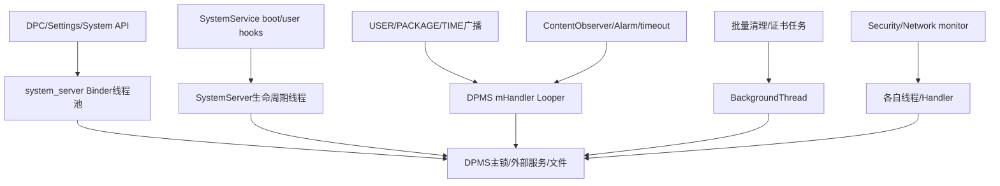
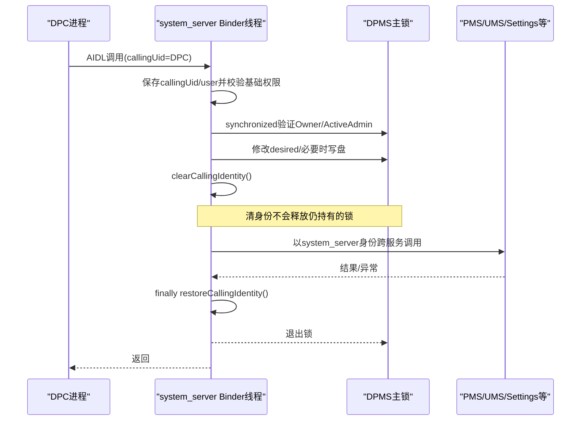
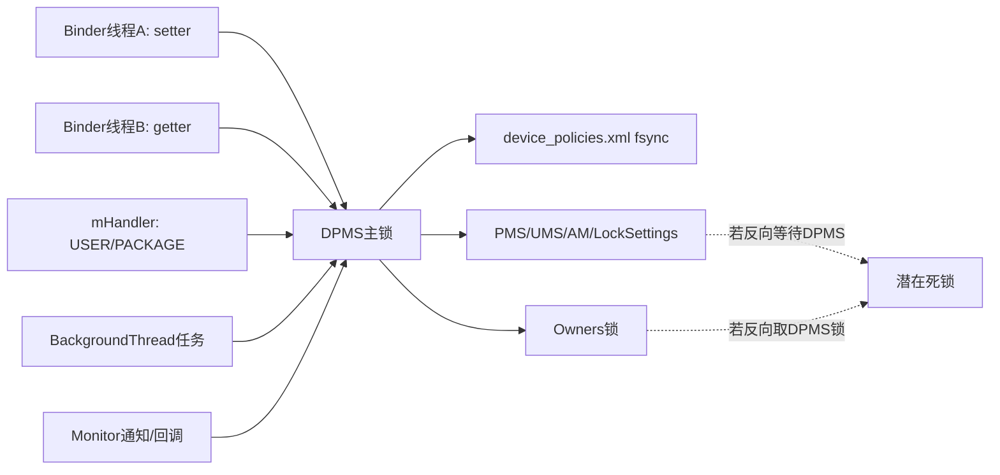

# 第 354 章 Android 企业 DevicePolicyManagerService 并发模型：Binder线程、主锁、Clean Identity、Handler、跨服务死锁与TOCTOU审计链

> 源码基线：Android 11 / API 30 / `android-11.0.0_r48`。本章只做 macOS 源码阅读，不编译。前面几章不断遇到“先改内存、再写盘、再跨服务”的窗口，本章统一解释DPMS代码究竟在哪些线程运行、主锁保护什么、清Binder身份不改变什么，以及怎样系统化发现死锁、锁外陈旧快照和异步竞态。

## 1. DPMS不是单线程Service

`DevicePolicyManagerService`继承 `IDevicePolicyManager.Stub`，公开DPM调用由system_server Binder线程池并发执行。两个DPC、Settings和系统组件可以同时进入不同方法，不能用源码上下顺序推断运行顺序。

## 2. 还有非Binder入口

SystemService boot/user生命周期、注册广播、ContentObserver、Alarm、BackgroundThread任务、Security/Network monitor都能进入DPMS。即使没有任何DPC调用，内部状态仍可能变化。

## 3. Lifecycle负责发布Binder

`Lifecycle.onStart()`将服务发布为 `Context.DEVICE_POLICY_SERVICE`；boot phase与start/unlock/stop user直接调内部方法。这些调用不经过AIDL权限边界，却仍必须遵守同一锁规则。

## 4. OEM可以替换DPMS实现类

Lifecycle从 `config_deviceSpecificDevicePolicyManagerService`反射构造BaseIDevicePolicyManager子类，空配置才用AOSP实现。OEM源码审计要确认实际类是否覆写线程/锁行为。

## 5. BaseIDevicePolicyManager是AIDL Stub

它继承 `IDevicePolicyManager.Stub`，又声明boot/user内部抽象方法。故同一个对象同时面对跨进程Binder线程和SystemServer本地调用。

## 6. mHandler来自构造线程Looper

Injector返回 `Looper.myLooper()`，构造器据此new Handler。AOSP SystemServer通常在其主Looper构造服务；精确线程仍应看实际启动上下文/测试Injector，不能把字段名当绝对证明。

## 7. 注册广播明确投递到mHandler

DPMS `registerReceiverAsUser(...,mHandler)`，因此用户、包、时间等主receiver不在任意广播Binder线程执行，而排入该Handler Looper。

## 8. ContentObserver也用mHandler

Setup与device-policy-constants observers在同一Handler构造，设置变化回调与广播/部分timeout串行排队，但仍会与Binder线程并发。

## 9. mBackgroundHandler是系统BackgroundThread

证书监控、清应用restrictions等I/O或批量工作使用共享BackgroundThread Handler。它不是DPMS独占线程，队列可能被其他system_server后台任务影响。

## 10. Monitor还有自己的线程与锁

SecurityLogMonitor、NetworkLoggingHandler、Owner Service PersistentConnection分别有monitor/handler/私有锁。跨这些对象调用时必须画锁顺序，不能只搜DPMS synchronized。

## 11. 多入口并发图

## 12. 主锁不是this

实际对象是 `mLockDoNoUseDirectly`，通过 `getLockObject()`取得。源码刻意命名禁止直接使用，所有核心状态应统一走该入口。

## 13. 为什么不synchronized(this)

独立私有锁避免外部拿到service对象后意外参与锁，也让LockGuard为该锁建立系统级顺序索引。审计时搜索 `synchronized(this)`不能代表DPMS主锁。

## 14. LockGuard安装

构造锁时使用 `LockGuard.installNewLock(INDEX_DPMS,doWtf=true)`。每次 `getLockObject()`先调用 `LockGuard.guard(INDEX_DPMS)`，尝试发现违反已知系统锁顺序的获取。

## 15. LockGuard是诊断不是互斥本身

真正互斥仍由Java `synchronized(lockObject)`提供。LockGuard警告/WTF帮助发现潜在死锁，不会自动重新排序或取消危险调用。

## 16. getLockObject还记录耗时

它用StatLogger统计LockGuard.guard耗时，dumpsys可辅助观察guard成本。这个统计不是锁持有时长，也不是等待主锁总时长。

## 17. ensureLocked的作用

许多`...Locked` helper开头调用 `ensureLocked()`，用 `Thread.holdsLock(mLockDoNoUseDirectly)`检查当前线程，未持有就 `Slog.wtfStack`。

## 18. ensureLocked不抛异常

它记录WTF后继续执行，不是强制前置条件。线上代码若误调用仍可能发生数据竞态，不能因有ensureLocked就认为线程安全已由runtime保证。

## 19. GuardedBy同样是静态约定

`@GuardedBy("getLockObject()")`供人、lint和测试理解，不在运行时自动加锁。调用链每一层仍需检查实际synchronized覆盖范围。

## 20. Java intrinsic可重入

持DPMS锁的方法可以再调用另一个也`synchronized(getLockObject())`的方法，同线程不会自锁。例如setMasterVolumeMuted持锁后调用setUserRestriction再次取同一锁。

## 21. 可重入不代表推荐深嵌套

多层锁让持锁范围、外部调用和异常路径难读，事件日志还可能在内外层重复。审计应展开完整调用树，不只看最外层synchronized。

## 22. 主锁保护的核心账

`mUserData`、每user DevicePolicyData/ActiveAdmin、NetworkLogger与许多policy聚合状态由它保护。Owners有自己的锁，Cache/monitor可能有独立同步策略。

## 23. getUserData自己会加锁

缓存未命中时在主锁内创建并加载XML，且load末尾可能跨服务push。看似简单getter可能包含文件I/O与远程调用，不能在性能分析中按O(1)处理。

## 24. 持锁读返回对象的风险

拿到ActiveAdmin/DevicePolicyData引用后退出锁，对象仍存在但字段可被别的线程修改或从map摘除。锁外只能把不可变值/明确快照当依据，不应继续修改共享对象。

## 25. Binder线程流程总原则

通常先读取calling UID/user、校验参数与权限，在锁内验证角色并更新desired，再清身份调用系统服务，最后锁外写event。真实方法并不全部严格遵守同一模板，要逐条核对。

## 26. Binder calling identity是线程局部

Binder驱动在处理跨进程调用的当前线程记录caller UID/PID。`Binder.clearCallingIdentity()`临时让下游看到system_server身份，只影响当前线程的Binder身份，不切换线程。

## 27. Clean identity不释放锁

在`synchronized`内部调用 `binderWithCleanCallingIdentity`，主锁仍然持有。它解决权限代理问题，不解决死锁、慢调用或锁竞争。

## 28. Clean identity也不自动授权业务

DPMS必须在clear之前验证原caller是DO/PO/delegate。若先clear再调用依赖`getCallingUid()`的授权helper，就会把system UID误当原调用者。

## 29. 先保存caller信息

常见正确写法先取callingUid/userId/package并在锁内验证，再clear identity执行PMS/UMS/Settings操作。异步post更必须显式捕获user/component，不能在线程里再读Binder caller。

## 30. Restore必须走finally

手写模式保存token，try执行，finally restore；Injector的 `binderWithCleanCallingIdentity`封装同一保证。异常路径漏restore会污染复用Binder线程后续调用身份。

## 31. 身份与锁时序图

## 32. 为什么需要clean identity

DPC本身通常无权直接写Global Settings、调用隐藏PMS或跨user操作；DPMS已验证policy授权后，以system身份代表它完成受控动作。这是权限代理，不是绕过审计。

## 33. 不清身份的典型错误

下游服务看到DPC UID后会SecurityException，或按DPC app-op/user做出错误决策。单元测试若mock服务不校验身份，可能漏掉线上失败。

## 34. 清身份过早的典型错误

角色检查、calling package一致性、target SDK兼容或事件admin attribution可能变成system身份，造成越权或错误日志。源码阅读要标出clear精确边界。

## 35. Handler任务天然没有原DPC身份

post的Runnable在system_server Looper执行，原Binder身份不会跨消息保留。任务需要的caller数据必须作为值捕获；重新调用`Binder.getCallingUid()`通常只得到system/当前本地身份。

## 36. 广播回调也不是原事件发送者身份

DPMS receiver运行在自己的Handler，授权依据应来自受保护action、sending user和系统内部状态，不应把当前Binder caller当广播生产者。

## 37. 锁内文件I/O是r48事实

`saveSettingsLocked()`写XML、flush、fsync、rename都在主锁调用约定内。它保证一个user政策序列化时不会被另一Binder线程同时改，但慢存储会阻塞全部需主锁的DPM调用。

## 38. 文件锁住的是内存快照一致性

持锁可确保遍历adminList/delegation时结构不变；不能让Owners文件、UMS XML与消费者状态共同原子。第349—350章的多账窗口仍存在。

## 39. IOException被吞后锁照常释放

save内部日志/rollback并返回，外层synchronized正常退出；内存desired通常保留。并发线程随后会看到新值，即使磁盘仍旧。

## 40. fsync期间Binder线程被占用

调用线程不只等待锁，还亲自做I/O。高频setter可能耗Binder pool容量；这解释为何多数DPM策略不适合被应用高频轮询写入。

## 41. Owners是嵌套第二把锁

DPMS持主锁时经常调用 `mOwners`，后者再取私有mLock。常见顺序是DPMS→Owners；Owners内部不应在持锁时回调DPMS形成反向顺序。

## 42. Owners持锁还会push服务

set/clear/load在Owners锁内调用UserManagerInternal、PMS、AM/ATMS或AppOps。即使无反向DPMS回调，也扩大锁持有与跨服务风险。

## 43. LocalServices不等于无风险

Java直接调用没有Binder切换，但目标可能持自己的锁或同步回调。死锁审计必须追实现，不能看到Internal接口就认为调用瞬时安全。

## 44. 远程Binder调用更需谨慎

`mIPackageManager/IActivityManager`可能阻塞、抛RemoteException或间接等待另一个持锁线程。持DPMS锁跨进程时，应查目标是否可能反向调用DPMS。

## 45. 源码没有全面禁止锁内远调

r48不少方法在锁内clear identity后直接调用PMS/LockSettings/UMS。设计依赖已知锁顺序和目标行为，而不是统一“永不持锁调用外部服务”的规则。

## 46. NoLock命名表达高风险动作

wipe、账户查询等方法用`NoLock`后缀，并在调用前只锁内取授权/快照，真正RecoverySystem、AccountManager或用户删除在锁外执行。

## 47. wipeData的快照模式

入口锁内取得ActiveAdmin并验证初步能力，退出锁后决定目标/flags并调用wipeDataNoLock；后者清身份、重查restriction，再执行wipe/删user，避免Recovery/UMS长操作持主锁。

## 48. 锁外快照会变旧

从解锁到外部操作之间admin可能被移除、restriction或owner关系变化。方法通过再次检查部分restriction降低风险，但无法获得全局原子快照；这是主动用TOCTOU换死锁安全。

## 49. hasIncompatibleAccounts显式禁止锁内

建立Owner前需要AccountManager特性查询，注释写“DO NOT CALL WITH DPMS LOCK HELD”。它先在锁外取accounts，再短暂回锁查test-only admin，随后继续异步future/外部查询。

## 50. 分段加锁是常见折中

锁内只读必要policy，锁外慢调用，再回锁提交时应复验决定条件。若没有复验，就要记录竞态是否可接受、是否由更外层 provisioning串行保证。

## 51. wtfIfInLock的r48实现错误

该helper声称检查DPMS锁，却调用 `Thread.holdsLock(this)`；实际锁是 `mLockDoNoUseDirectly`。除非代码恰好`synchronized(this)`，它检测不到持有主锁。

## 52. 这不改变真正互斥

错误只让“NoLock方法被锁内调用”的诊断WTF失效；synchronized与LockGuard仍按实际对象工作。不能据此说DPMS完全无锁，只能说这道自检不可信。

## 53. ensureLocked与wtfIfInLock不要混淆

ensureLocked正确检查mLockDoNoUseDirectly；wtfIfInLock检查this。一个验证“必须持有”，一个本想验证“必须不持有”，r48可靠性不同。

## 54. NoLock审计必须人工沿调用栈

不能依赖运行warning。搜索所有调用点，确认进入前是否已退出`synchronized(getLockObject())`，以及嵌套helper是否又取得主锁后调用外部动作。

## 55. setUserRestriction是锁内长链

入口锁内验证角色、改ActiveAdmin Bundle，`saveUserRestrictionsLocked`再写policy文件、push UMS并显式发changed通知。且r48的`saveSettingsLocked()`成功分支自身已经发过同一DPM state-changed，因此这条helper可能连续发送两次宽泛通知；它们都不携带具体key。整个链结束后才锁外写PolicyEvent/SecurityLog。

## 56. 锁外事件日志的意义

把DevicePolicyEventLogger放锁外降低持锁时间与日志依赖死锁风险；但另一个线程可能已改变同一policy后事件才写，日志顺序不一定等于最终状态顺序。

## 57. 状态与事件不是同一事务

policy保存失败仍可能写event；进程在解锁后写event前崩溃又可能状态已变但无event。审计不能用event数量精确重放DevicePolicyData。

## 58. Generic admin广播常在锁内发起

sendAdminCommandLocked先PackageManager query，再send broadcast。发送本身异步，但query/AMS提交可阻塞；final result稍后在Handler回调并重新取锁。

## 59. 异步广播避免直接重入

DPC onReceive在另一个进程/主线程，不能在send调用栈同步执行回DPMS；它之后发Binder请求时要竞争主锁。系统final receiver也排mHandler，通常等当前锁释放。

## 60. 有序广播仍不是持锁等待应用

DPMS提交有序broadcast后返回，不在主锁里同步等DPC完成。移除artifacts由result receiver未来执行，形成mRemovingAdmins过渡态。

## 61. resolveDelegateReceiver的快照模式

先在主锁内复制delegate package列表，退出锁后查询PMS receiver。委托可能在两步间撤销/包更新，旧receiver仍可能收到一次通知。

## 62. 为什么不全程持锁

PMS query是跨服务调用，且delegate list只需一个小快照。源码接受短TOCTOU窗口换取缩短DPMS锁持有；安全影响由receiver permission和取数据时再次授权限制减轻。

## 63. TOCTOU不一定可利用

收到Network Logs available不等于能retrieve；Binder取数时会重新检查当前delegation/owner。陈旧通知最多泄露token/count是否敏感仍需评估，权威操作有二次门更安全。

## 64. bindDeviceAdminService也有多段检查

先计算允许target users，再锁内取target owner package，退出锁清identity解析并请求AMS bind。期间affiliation/owner/package可变化，是第342章指出的跨用户绑定窗口。

## 65. Sanitized值必须真正使用

该路径创建`sanitizedIntent`判null，却在r48调用AMS时传原`serviceIntent`。这是逻辑/TOCTOU审计示例：仅验证派生安全对象不够，最终sink必须使用它。

## 66. ContentObserver明确承认小竞态

Owner设置默认IME前在pending set标记“下一次变化由owner触发”，但setting通知异步，队列中可能已有用户变化通知。源码注释承认无法完全避免，认为实际影响小。

## 67. pending标记由主锁保护

Owner setter与Observer都在锁内访问user ID set，避免结构竞态；但无法给SettingsProvider异步事件建立全序，这说明锁只能保护本服务数据。

## 68. Async清ApplicationRestrictions

clear owner时把遍历所有包清restrictions post到BackgroundThread，API继续清身份并返回。Runnable运行时owner状态已变，期间新安装包或新restriction写入可能与清理交错。

## 69. 后台任务需要幂等

逐包写null可重复，但快照的installed packages和执行时集合可能不同。下一次退管/包事件是否补齐要单独分析，不能把post成功当清理完成。

## 70. Handler timeout也是并发参与者

remote bugreport timeout、admin卸载10秒兜底、profile-off alarms都可能与正常完成回调竞态。代码用removeCallbacks、AtomicBoolean或“对象已不存在return”实现幂等收敛。

## 71. AtomicBoolean只保护单个标志

remoteBugreport的active/accepted可跨Handler/receiver安全读写，但URI/hash在Owners锁、notifications在外部服务，整个状态机仍非一个原子对象。

## 72. 多锁状态机要写不变量

例如active=false后不应继续接受finished；URI非null表示完成待同意；receiver注册与notification应匹配。只看AtomicBoolean线程安全无法证明组合正确。

## 73. SecurityLogMonitor有独立ReentrantLock

它在自己的线程保护pending logs与retrieve许可，释放monitor锁后才调用DPMS发送广播，并明确检查不应持NetworkLoggingHandler锁回调DPMS，避免锁反转。

## 74. NetworkLoggingHandler主动检查锁

notifyDeviceOwner前若 `Thread.holdsLock(this)`就wtf并return。它体现跨组件调用前释放私有锁的正确模式，比DPMS错误wtfIfInLock更可靠。

## 75. 回调DPMS前先释放producer锁

通用原则：在monitor锁内形成immutable Bundle/快照，解锁后调用DPMS；否则DPMS可能回调retrieve又取monitor锁，形成AB-BA。

## 76. 主锁竞争图

## 77. Getter也可能被慢setter阻塞

即使只读isAdminActive/getPolicy，仍需主锁；另一个线程可能正在fsync或跨服务。DPC不应假设getter永远低延迟，更不应在UI主线程高频同步调用。

## 78. Binder池并发不能消除单锁瓶颈

多线程只允许锁外阶段并行，核心policy账最终串行。线程数增加不能提升fsync临界区吞吐，还可能让更多Binder线程排队。

## 79. 长调用还可能耗尽Binder线程

若多个入口分别在锁前/锁外等待下游服务，system_server Binder pool可被占用。性能诊断需同时看锁等待、Binder transaction和文件I/O，不只看CPU。

## 80. RemoteException的处理不统一

不少internal remote标注“shouldn't happen”后返回默认或继续；有些转IllegalStateException，有些吞掉。异常后内存、磁盘和消费者是否已部分更新要按调用顺序判断。

## 81. RuntimeException会自动释放Java锁

synchronized退出由JVM保证，但业务补偿不自动发生。字段已改、save未做或identity已由finally恢复，形成的部分状态仍存在。

## 82. binderWithClean lambda内抛异常

Binder.withCleanCallingIdentity会恢复身份再传播异常；外层是否catch决定API结果。它比手写token更不易漏restore，但不提供policy rollback。

## 83. 锁内返回集合要注意别名

服务内部List/Bundle若直接返回给本地调用者可被锁外修改；AIDL跨进程通常Parcel复制，但LocalService/单测直接调用不一定。实现应优先defensive copy，审计getter需查实际返回对象。

## 84. RestrictionsSet不clone的教训

第347章已看到UMS内部对象别名要求“不原地改”。DPMS同样应在锁内替换/复制Bundle，再跨服务传递；否则另一个线程可能在消费者遍历时修改。

## 85. Cache有自己的并发契约

DevicePolicyCache/StateCache供其他system_server组件快速读取，通常内部同步或volatile；setter在主锁更新cache不代表reader也取DPMS锁。要分别读Cache实现的可见性保证。

## 86. 发布顺序影响无锁reader

如果先写文件/外部服务、后更新cache，短窗reader看到旧值；反过来则cache新但消费者旧。源码经常选择功能特定顺序，没有全局线性化点。

## 87. Boot阶段也会争锁

Binder服务在onStart已publish，而重要policy直到LOCK_SETTINGS_READY加载。理论上早期caller可能进入；功能门、依赖服务phase和主锁共同决定行为，不能假设publish等于fully ready。

## 88. loadAdminDataAsync刻意异步

LOCK_SETTINGS_READY后把所有user ActiveAdmin/NetworkPolicy数据推送交SystemServerInitThreadPool，boot继续。UsageStats/NetworkPolicy用onAdminDataAvailable协调，但其他caller可能在任务完成前观察中间态。

## 89. AppOps owner发布有phase门

Owners.load早期调用push但systemReady=false会跳过，LOCK_SETTINGS_READY再Owners.systemReady真正发布。这里用显式phase状态而非主锁阻止过早跨服务。

## 90. Phase方法不全在一个大锁内

onLockSettingsReady分段获取主锁、调用getUserData/清用户/注册observer/跨服务，再回锁处理DO。这样缩短某些临界区，但启动状态对并发reader可分阶段可见。

## 91. User start与package broadcast会交错

两者都在mHandler时通常串行，但Binder setter可同时进。USER_STARTED先删mUserData cache，package处理重新load；setter若在前后竞争由主锁建立顺序，保存结果依具体先后。

## 92. 删除cache不是取消旧引用

另一个线程若先在锁内拿到DevicePolicyData后退出并长期使用，remove SparseArray不能使对象失效。设计应避免锁外保留可变policy对象。

## 93. User removal的异步外部清理

UMS user删除、DPMS广播接收、removeUserData与磁盘目录删除分阶段发生。userId/serial复用保护需要UserManager层保证，DPMS单锁不能覆盖跨服务全生命周期。

## 94. 跨服务事务应采用补偿而非假锁

Ownership transfer用metadata恢复，用户创建失败发remove，package卸载有timeout。这些是显式补偿，因为不可能拿一把Java锁覆盖进程崩溃和多个服务持久化。

## 95. 补偿标志也要可靠写盘

第350章metadata save返回值未检查说明补偿自身会失败。并发/故障审计必须把“先写journal再操作”的成功结果作为前置，而不是只看注释意图。

## 96. TOCTOU审计第一步：列判定与动作

例如“caller仍是owner”“target仍affiliated”“包仍安装”是判定；bind/uninstall/wipe是动作。标出二者之间释放了哪些锁、清了身份、调用了哪些服务。

## 97. 第二步：寻找二次校验

动作入口若再次查restriction/owner/delegation，可缩小窗口；只使用旧Component/List则接受陈旧状态。二次校验也要在正确user和identity下执行。

## 98. 第三步：判断最坏影响

陈旧通知与陈旧wipe授权风险不同。按数据泄露、权限提升、拒绝服务、仅多一次广播分类，决定是否需要事务token、版本号或锁内动作。

## 99. 死锁审计第一步：编号所有锁

至少记录DPMS、Owners、UMS/PMS内部、monitor、Controller/PersistentConnection锁。对每个调用边画“持A取B”，寻找A→B与B→A环。

## 100. 第二步：标出远程/回调边

Binder调用看不到目标内部锁，broadcast/observer/future可能稍后反向调用。把“可能回调DPMS”作为边，不能因源码当前行没有synchronized就忽略。

## 101. 第三步：优先快照后解锁

在A锁内复制必要primitive/String/immutable集合，释放A后调用B；若要提交结果，再回A并比较版本/当前身份。成本是TOCTOU，需要二次校验。

## 102. 锁顺序不是越少越好

完全锁外改共享对象会数据竞争；全程持锁跨Recovery/PMS又会死锁。正确边界取决于操作是否可回滚、下游是否反调、判定是否必须原子。

## 103. 现场排查ANR/卡DPM

抓system_server traces，找Binder线程阻塞在mLockMonitor、fsync、PMS/UMS Binder或AccountManager future；同时看持锁线程调用栈，不要只盯发起DPC进程。

## 104. 现场排查身份错乱

在clear前后记录Binder.getCallingUid/user、保存的callingUid变量与下游看到的UID；确认finally restore。异步Runnable里若重新读calling UID是高风险信号。

## 105. 现场排查“偶现授权通过后失败”

寻找锁外窗口内owner transfer、affiliation变化、package replace、user stop。对比首次授权与动作sink的实际target/component，确认是否复验。

## 106. 现场排查“事件顺序反了”

PolicyEvent多在锁外、广播异步、Background任务延后；用同一线程/锁提交顺序和磁盘mtime辅助，而非按logcat时间单独重建事务。

## 107. 单元测试线程模型

不仅单线程调用setter，还应用两个线程卡住下游mock，在另一线程发getter/clear/package event，验证锁等待、最终desired与事件顺序。

## 108. 死锁测试

让mock PMS在DPMS持锁调用时同步回调DPMS，验证LockGuard/WTF或测试超时；再改为快照锁外模式比较。注意r48 wtfIfInLock不能作为唯一断言。

## 109. Identity测试

mock下游记录Binder calling UID，分别在正常、异常、nested clean identity、Handler post后验证system/原caller；随后复用同一测试线程确认identity已恢复。

## 110. TOCTOU测试

在授权后用barrier暂停，另一线程transfer owner/revoke delegate/remove package，再恢复动作；断言sink是否使用旧对象、是否二次拒绝以及最坏影响是否符合设计。

## 111. 本章心智模型

DPMS是一台“多线程入口、单主锁核心账、多个外部派生系统”的协调器。主锁给内存顺序，clean identity给权限代理，Handler给延迟执行；三者都不提供跨服务事务。

## 112. macOS只读练习一：标一条setter线程图

任选setUserRestriction或setCameraDisabled，从AIDL Binder线程开始，标calling UID、每次主锁、save fsync、UMS/PMS调用、广播、PolicyEvent与返回；判断哪一步是内存线性化点、哪一步可能阻塞。

## 113. macOS只读练习二：审计一个NoLock方法

阅读wipeDataWithReason→wipeDataNoLock及所有调用点，列锁内快照、锁外复验、clean identity、外部服务与异常补偿；再指出`wtfIfInLock()`为何检查错对象。

## 114. macOS只读练习三：画锁顺序图

选择Owners.setDeviceOwner、NetworkLoggingHandler通知、DeviceAdminServiceController start三条链，列DPMS/Owners/monitor/Controller/PersistentConnection/AMS锁边，检查是否存在反向回调可能。

## 115. macOS只读练习四：构造TOCTOU

以resolveDelegateReceiver或bindDeviceAdminServiceAsUser为例，在锁内判定后暂停，模拟撤委托/transfer/package update，再恢复PMS/AMS动作；说明二次授权在哪个真正敏感API发生或缺失。

## 116. 本章检查题

为什么clearCallingIdentity不减少主锁竞争？为什么getUserData可能是慢调用？为什么NoLock方法仍可能有TOCTOU？为什么LockGuard/ensureLocked/wtfIfInLock三者的r48可靠性不同？

## 117. 复读修正一：Handler不等于全服务单线程

广播与observer虽排mHandler，AIDL仍在Binder池、BackgroundThread与monitor也并发。文档已避免用“DPMS主线程”概括所有方法，并要求从每个入口追实际Looper。

## 118. 复读修正二：Clean identity不是锁或事务

它只替换当前线程下游Binder看到的身份；不切线程、不释放Java锁、不回滚状态。文档已把权限代理、互斥和持久化三种机制彻底分开。

## 119. 复读修正三：NoLock诊断在r48失效

`wtfIfInLock()`检查this而实际锁是mLockDoNoUseDirectly，因此不能作为证明。文档保留源码事实并将所有NoLock安全结论改为人工调用栈/并发测试验证。

## 120. 本章结论与下一章

第354章建立了DPMS并发审计法：Binder与多种内部线程汇入主锁，文件和跨服务扩大临界区；clean identity只做代理；快照锁外避免死锁却引入TOCTOU；补偿处理跨服务崩溃。下一章深入 DevicePolicyCache/DeviceStateCache：无Binder快速读取、锁与可见性、更新来源、user清理、默认值和缓存与真实policy分叉。
