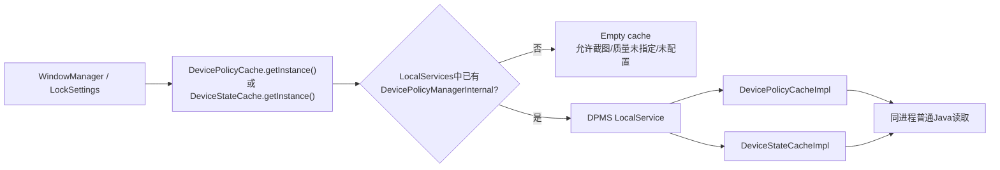
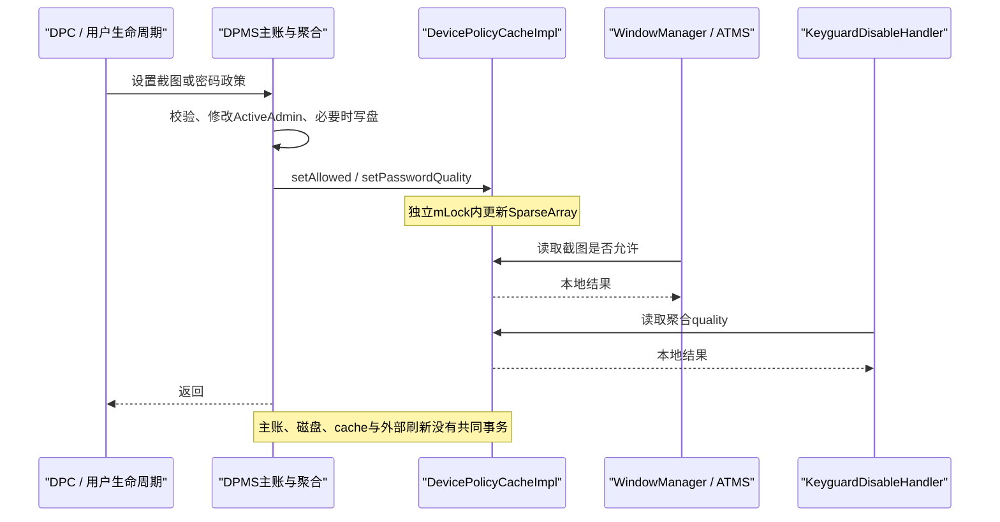
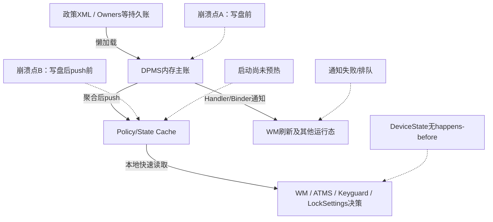

# 第 355 章 Android 企业 DevicePolicyCache / DeviceStateCache：无 Binder 快速读取、同步、默认值、清理与缓存分叉链

> 源码基线：Android 11 / API 30 / `android-11.0.0_r48`。本章只在 macOS 上阅读源码，不编译。上一章说明了 DPMS 主锁与跨服务死锁；这一章研究它为 WindowManager、LockSettings 等高频或敏感调用准备的“小型本地副本”，并特别审计 Android 11 实现中真实存在的可见性边界。

## 1. 先给缓存下定义

这里的 cache 不是把任意 `DevicePolicyManager` API 结果都记住，而是 DPMS 主动维护的极小派生状态：屏幕截图是否允许、聚合密码质量，以及设备是否已完成配置。它只回答接口明确定义的三个问题。

## 2. 为什么系统服务不直接调公开 DPM

公开 `DevicePolicyManager` 最终通常走 `IDevicePolicyManager` Binder。system_server 内的 WindowManager 若持自己的全局锁再同步进入 DPMS，而 DPMS 又持主锁回调 WindowManager，就可能形成锁顺序反转；本地缓存用于切断这条同步调用边。

## 3. “无 Binder”不等于“无调用”

消费者仍会调用 Java 方法，只是 `getInstance()`通过 `LocalServices`拿到同一 system_server 进程中的对象引用，随后普通虚方法调用。没有 Parcel、Binder 驱动、目标 Binder 线程和远程异常。

## 4. 两个抽象接口的位置

`DevicePolicyCache.java`和 `DeviceStateCache.java`位于 `frameworks/base/core/java/android/app/admin/`，属于隐藏 framework API；具体实现位于 `frameworks/base/services/devicepolicy/...`，把跨模块可见的契约与 DPMS 私有写端分开。

## 5. Policy 与 State 为什么分开

源码注释把前者定义为管理员政策的副本，把后者定义为“不直接属于 admin policy”的设备状态。分类不是线程机制差异的保证，而是避免把设备配置阶段与某个 ActiveAdmin 所有权混在一起。

## 6. r48实际只有三个查询

`DevicePolicyCache`公开 `isScreenCaptureAllowed()`和 `getPasswordQuality()`；`DeviceStateCache`只有 `isDeviceProvisioned()`。实现中的 setter、user removal 和 dump 都不是抽象读接口的一部分，只有 DPMS 具体类可直接使用。

## 7. getInstance先找DPM内部服务

两个抽象类都调用 `LocalServices.getService(DevicePolicyManagerInternal.class)`，存在时再通过其受保护 getter 取得具体 cache。它不是静态字段直接指向实现，而是经 DPMS 发布的 local-service 门面。

## 8. LocalServices只在system_server内有意义

应用进程没有 DPMS 注册进去的同一张 LocalServices 表，隐藏类也不是给普通 app 使用的跨进程捷径。源码里的主要消费者都在 `frameworks/base/services` 的 system_server 组件中。

## 9. 何时发布DevicePolicyManagerInternal

DPMS 构造期间创建 `mPolicyCache`和 `mStateCache`，注册广播后执行 `LocalServices.addService(DevicePolicyManagerInternal.class, mLocalService)`。从此其他系统服务的 `getInstance()`才能取到真实实现。

## 10. 发布前的空实现

若 local service 尚不存在，Policy 空实现返回“允许截图”和 `PASSWORD_QUALITY_UNSPECIFIED`，State 空实现返回“未配置”。这避免空指针，却意味着启动顺序过早的读取会得到保守程度不同的默认值。

## 11. 获取路径图



## 12. 空实现不是一次性缓存

`getInstance()`每次都重新查询 LocalServices，并没有把第一次得到的 Empty 对象永久保存到静态变量。晚些时候 DPMS 发布完成后，后续调用可以转而拿到真实实现。

## 13. 不要长期保存过早结果

若消费者在 DPMS 发布前把 `DevicePolicyCache.getInstance()`返回值存成 final 字段，它就可能永久持有 Empty 实例。r48主要消费者按需调用 getInstance；测试 Injector 保存 mock 是受控场景。

## 14. mPolicyCache的存储结构

实现用一个 `SparseBooleanArray mScreenCaptureDisabled`和一个 `SparseIntArray mPasswordQuality`，key 都是 userId。稀疏数组适合非连续、小规模整数用户编号，避免 `HashMap<Integer,...>`装箱。

## 15. 为什么字段保存disabled而接口问allowed

DPMS 的持久政策是 `disableScreenCapture`，所以实现内部存“禁用”；读接口为 WindowManager 直接回答“允许”。读取时先取 disabled 再取反，命名方向不同必须跟到表达式，不能凭 setter 名猜结果。

## 16. Policy cache使用独立锁

两个数组都标注 `@GuardedBy("mLock")`，每个读、写和删除方法都 `synchronized (mLock)`。这是 cache 自己的锁，不是 DPMS 的 `mLockDoNoUseDirectly`。

## 17. 同锁提供什么保证

同一 user 的 setter 返回后，随后取得 cache 锁的 reader 会看到更新；两个数组的单次方法操作也不会与删除交叉到一半。Java monitor 同时提供互斥和 happens-before 可见性。

## 18. 同锁不提供跨方法快照

消费者若先读截图再读密码，中间 DPMS 可以更新其中之一；接口没有“同时读取两个值”的事务。当前消费者各取单一值，因此实现没有额外版本号或组合对象。

## 19. cache锁为何不能复用DPMS主锁

消费者使用缓存正是为了不进入 DPMS 核心锁。若 getter 改拿 DPMS 主锁，WindowManager 持锁读取时仍可能重建死锁边；独立小锁把临界区限制为稀疏数组访问。

## 20. 小锁也可能短暂竞争

它不是 lock-free。DPMS 写端和 WindowManager 读端可能等待同一 `mLock`，但临界区没有 XML、Binder 或复杂聚合，预期持有时间很短。

## 21. 截图默认值的精确含义

`SparseBooleanArray.get(userHandle)`在 key 不存在时返回 false，即“没有记录 disabled”；方法取反后返回 true。因此未装载、用户未知或已删除的普通调用默认允许截图。

## 22. ownerCanAddInternalSystemWindow例外

真实表达式是：

```java
return !mScreenCaptureDisabled.get(userHandle)
        || ownerCanAddInternalSystemWindow;
```

即使政策禁用，拥有添加内部系统窗口能力的窗口仍可被视为允许。这个布尔值由窗口所有者能力传入，不存入 cache。

## 23. 例外不是调用者任意开关

普通 app 不能直接调用隐藏接口并让 WindowManager相信它传了 true；`WindowState`使用创建窗口时计算的 `mOwnerCanAddInternalSystemWindow`。审计应继续追该字段来源，而不是把方法参数当公开绕过点。

## 24. setScreenCaptureAllowed的反向写入

setter 接受 allowed，却执行 `mScreenCaptureDisabled.put(userHandle, !allowed)`。例如 DPMS 聚合出 disabled=true，会调用 allowed=false，数组最终保存 true。

## 25. updateScreenCaptureDisabled是推送桥

DPMS helper 先同步更新 cache，再 post Handler 调 `IWindowManager.refreshScreenCaptureDisabled(userHandle)`。cache 值和刷新通知不是同一步，刷新失败只写日志，不撤销 cache。

## 26. 政策setter何时调用桥

`setScreenCaptureDisabled()`在主锁内修改 ActiveAdmin、保存设置，再计算 parent 或本 user 作为 affectedUserId，调用 update helper。只有值变化时执行；相同值不会重复刷新。

## 27. 用户启动也重建截图cache

`handleStartUser(userId)`调用聚合 getter `getScreenCaptureDisabled(null,userId,false)`，再推入 cache。这样重启后从 XML 加载的 ActiveAdmin 政策能恢复到运行时快速副本。

## 28. parent政策为何需要affectedUserId

组织所有的 managed profile 可以通过 parent admin 影响父用户截图。setter 不能简单用 Binder calling user 作为 key，而要在 `parent=true`时取 profile parent id。

## 29. 聚合与单admin值不同

cache 保存的是受影响用户所有相关 admin 的聚合结果，而不是刚才那个 admin 的布尔值。r48 setter 把本次 `disabled`直接交给 helper，阅读时需验证角色/聚合规则是否保证该变化足以代表结果；启动路径则显式重新聚合。

## 30. 一个值得审计的收紧/放宽差异

若一个 admin 从 disabled=true 改 false，而其他 admin 仍禁用，直接把 false 推入 cache 会错误放宽。应结合 DPMS 对 `getActiveAdminsForAffectedUserLocked`的多 admin 模型和具体允许设该政策的角色测试，不能仅因持久 getter会聚合就假定 cache setter也聚合了。

## 31. WindowState的消费点

`WindowState.isSecureLocked()`先看窗口自身 `FLAG_SECURE`；否则只要 DevicePolicyCache 判定截图不允许，也把窗口视为 secure。DPM禁截图因此进入每个窗口的安全属性判断。

## 32. FLAG_SECURE与DPM是或关系

app 自己设 FLAG_SECURE 即安全，不依赖 DPM；app 没设时 DPM仍可让它安全。缓存默认允许只意味着 DPM这一支不增加限制，不会清掉 app 自己的 FLAG_SECURE。

## 33. Assist数据也使用同一政策

`ActivityTaskManagerService.isAssistDataAllowedOnCurrentActivity()`先在全局锁内找到顶部 activity/user，释放锁后调用 cache，传例外参数 false。禁截图同时会阻止当前 activity 的 assist context 数据。

## 34. ATMS刻意在全局锁外读

代码先保存 `userId`并退出 `synchronized(mGlobalLock)`，随后读 cache。即使 cache 本地且独立锁很短，锁外读取仍进一步避免 ATMS lock→cache lock 与其他路径形成嵌套。

## 35. WindowState读点可能处于WM锁中

`isSecureLocked`可从复杂 WindowManager 路径调用；缓存接口存在的核心价值就是不反向同步进入 DPMS。不能把它替换成 `DevicePolicyManager.getScreenCaptureDisabled()`而不重新做锁图分析。

## 36. password quality存什么

每个 user key 保存 `getPasswordQuality(null,user,false)`的聚合质量常量，即所有影响该用户屏幕锁的 admin 中最严格的 quality，不包含长度、字母、复杂度等其他要求。

## 37. quality不是密码实际强度

它描述 DPM 要求的政策级别，不是当前凭据的 `PasswordMetrics`，也不回答密码是否满足要求。Keyguard消费者只需要知道“DPM是否要求某种密码”。

## 38. 未命中quality默认值

`SparseIntArray.get(userId, PASSWORD_QUALITY_UNSPECIFIED)`显式指定默认值。空实现也返回同一常量，所以从接口值本身无法区分“DPMS尚未发布”“用户未装载”和“确实没有质量要求”。

## 39. updatePasswordQualityCacheForUserGroup

helper 先决定要遍历的用户：传 `USER_ALL`取所有用户，否则取该 user 的 profiles；然后为每个 currentUserId 调完整聚合 getter，再写对应 key。

## 40. 为什么按profile group重算

统一 challenge 时 managed profile 政策可影响 parent；profile 也可能显式设置 parent password policy。一个 admin 的 quality 变化可能改变同组多个 user 的聚合值，所以不能只更新调用 user。

## 41. 系统用户启动时装载所有用户

`handleStartUser(0)`特意传 `USER_ALL`，注释说明要缓解异步 onStartUser 与 keyguard 在用户切换时读取之间的竞态。它用更早的全量预热换取可预测性。

## 42. 非系统用户启动只重算profile组

后续 user start 传自身 id，`getProfiles(userId)`通常返回同 profile group 的成员。具体包含关系由 UserManager 决定，阅读 cache helper不能自行假定列表只包含managed profile。

## 43. 密码policy setter触发重算

`setPasswordQuality()`在值变化时先改 ActiveAdmin，重置不再适用的约束、更新密码有效性 checkpoint，再重算 group cache，最后保存 settings。cache 更新位于 DPMS 主锁和 clean identity 区间内。

## 44. 分离挑战变化也触发重算

`DevicePolicyManagerInternal.reportSeparateProfileChallengeChanged()`在主锁内更新最大锁屏时间并重算 group。因为 unified/separate challenge 会改变哪些 admin 参与某用户聚合，这比单纯 quality setter更能说明 cache 是派生值。

## 45. admin移除也必须触发

ActiveAdmin artifacts 清理路径会调用 group 重算，否则已删除 admin 的严格质量会留在 cache。源码审计任何新增修改密码政策的路径，都应查它是否最终到达这个 helper。

## 46. user removal先重算再删除key

`removeUserData(userHandle)`先 `updatePasswordQualityCacheForUserGroup(userHandle)`，再 `mPolicyCache.onUserRemoved(userHandle)`。前一步尝试让同组其他成员摆脱被删 user 的影响，后一步删除被删 user 自己的两个 key。

## 47. Policy缓存更新时序



## 48. KeyguardDisableHandler如何使用quality

其 Injector 调 `DevicePolicyCache.getInstance().getPasswordQuality(userId)`，只要不等于 `PASSWORD_QUALITY_UNSPECIFIED`就认为 DPM requires password。它无需知道具体 admin 或完整密码约束。

## 49. 这个布尔化会丢信息

quality 的数值强弱在此消费者中被压成“是否 unspecified”。这符合禁用 keyguard token 的决策，但不能把该用法复制到需要判断复杂度、长度或合规性的功能。

## 50. Keyguard决策还有真实安全状态

普通 app token 只有在 DPM不要求密码且 keyguard本身不secure时才能禁用；系统 lock-task token只要求DPM不要求密码。cache只是决策的一个输入，不独自开启/关闭锁屏。

## 51. userId仍是关键边界

错误 key 会把另一个用户的 policy用于当前锁屏或截图。调用点必须基于窗口展示用户、顶部activity用户、profile parent映射等业务语义，而不是一律使用当前进程 user 0。

## 52. onUserRemoved删除哪些内容

实现同步删除 `mScreenCaptureDisabled`与 `mPasswordQuality`中相同 userHandle 的条目。它没有清其他用户的条目，也没有全量 clear API。

## 53. 删除后默认可能放宽

一旦 key 被删，截图回到允许，quality回到 unspecified。这对已真正删除的用户没有直接窗口；若错误地过早调用或 userId 很快复用，默认窗口就需要结合用户创建/start预热时序审计。

## 54. userId复用为何仍需serial思维

cache只以 int userId为key，没有 user serial。UMS通常在彻底删除流程中管理复用，但 cache自身不能识别“旧10号”和“新10号”；正确性依赖生命周期回调先清旧、再为新用户重建。

## 55. dump也应取得锁

r48 `DevicePolicyCacheImpl.dump()`直接调用两个 SparseArray 的 `toString()`，没有 `synchronized(mLock)`，尽管字段标注受锁保护。这是诊断读取与并发写的潜在竞态，不能用“只是dump”把线程规则自动豁免。

## 56. dump竞态的影响级别

通常表现为诊断输出不一致，而非政策执行绕过；但 `SparseArray`并非为无锁并发读写设计。审计报告应准确标成可观测性/健壮性问题，不夸大为已证明的权限提升。

## 57. DeviceStateCacheImpl只有一个boolean

字段 `mIsDeviceProvisioned`初始 false，setter 接受 provisioned，getter直接返回。它没有 per-user map，因为定义专指 USER_SYSTEM 的设备已配置状态。

## 58. 注释明确USER_SYSTEM

setter 文档写“Update the device provisioned flag for USER_SYSTEM”。这不是任意用户的 USER_SETUP_COMPLETE cache；其他用户完成Setup不会直接改变此字段。

## 59. provisioned来源不是Global setting直读

cache 推送值来自 DPMS 的 `DevicePolicyData`中 user 0 的 `mUserSetupComplete`。SetupContentObserver会读 `Settings.Secure.USER_SETUP_COMPLETE`并把只升不降的状态写回DPMS账，再更新cache。

## 60. 首次加载user0时初始化

`getUserData(0)`若缓存未命中，会加载 XML；加载完成后调用 `mStateCache.setDeviceProvisioned(policy.mUserSetupComplete)`。因此真实 state cache可能在 local service已发布后一段时间才从默认false变成持久值。

## 61. local service发布早于每用户主账的懒加载

构造器先 add local service，再 `loadOwners()`；每user DevicePolicyData仍通常懒加载。消费者非常早地读 state cache时，可能命中真实实现但仍得到字段初始false，而不是 Empty 实现。

## 62. Setup observer更新路径

设置变化后 `updateUserSetupCompleteAndPaired()`遍历用户；发现 Secure值非0且DPMS账仍false，就把账置true。若是user0，同时把 state cache置true，然后保存 XML。

## 63. 正常路径是单向锁存

方法只在设置为非0时把 `mUserSetupComplete`从false变true，不响应设置被重置为0。注释说明不信任其他应用重置它，因此正常设备配置完成后状态保持true。

## 64. debug force路径可以回退

`forceUpdateUserSetupComplete()`只在 debuggable build生效，会读取当前Secure值，把DPMS账和state cache同时设为true或false，再保存。这是测试例外，证明字段类型允许回退，不代表生产正常路径会回退。

## 65. DeviceState读端没有synchronized

r48 getter只是：

```java
public boolean isDeviceProvisioned() {
    return mIsDeviceProvisioned;
}
```

没有取得 `mLock`，字段也没有声明 `volatile`。

## 66. 写端加锁不够建立可见性

setter在 `synchronized(mLock)`内写，但 reader不获取同一monitor。按Java内存模型，单独的写端锁不能让无锁reader必然观察到最新值；布尔读写虽不会撕裂，却可能读陈旧值。

## 67. GuardedBy与实现发生矛盾

字段标注 `@GuardedBy("mLock")`，getter却不遵守。注解不自动插入锁，也不让字段变volatile。文档应如实记录这是r48源码边界，而不是笼统宣称 DeviceStateCache线程安全。

## 68. 为什么“通常能工作”不是证明

线程启动、Handler队列、Binder和其他同步操作可能偶然带来可见性，CPU cache也常很快传播；但不存在接口级 happens-before 就不能以现场大多正确替代内存模型保证。

## 69. 最小修复思路有两类

对单boolean可把字段声明 `volatile`，或让 getter也 `synchronized(mLock)`；前者更符合高频轻量读。这里只做源码学习，不修改AOSP，但阅读者应知道正确保证需要哪一条边。

## 70. dump同样无锁读取state

`DeviceStateCacheImpl.dump()`直接拼接字段，没有取得锁。对单boolean不会结构损坏，但仍可能显示陈旧值；它与Policy dump的风险性质不同。

## 71. 陈旧false的安全后果

LockSettings在尚未provisioned时延后永久禁用 escrow token，给未来 Device Owner配置留机会。若完成配置后仍读陈旧false，结果更可能是延迟清除escrow数据，扩大保留窗口。

## 72. 陈旧true的后果

正常生产路径从false到true单向，跨线程陈旧通常是false；debug force回退或测试可产生读旧true，可能让LockSettings过早执行不可逆的 escrow data销毁。因此force路径更需要可见性测试。

## 73. LockSettings为什么需要快速state

`disableEscrowTokenOnNonManagedDevicesIfNeeded()`处于锁屏凭据初始化/管理路径，先排除managed user、device managed、尚未配置和automotive，最后才永久销毁 escrow data。同步回调DPMS既有锁风险，也会把敏感路径绑在DPMS响应时间上。

## 74. DeviceStateCache不是设备管理身份账

它只缓存 provisioned，不告诉调用者是否有DO、某user是否managed或affiliated。LockSettings另外通过 `UserManagerInternal.isUserManaged/isDeviceManaged`读取这些状态。

## 75. 多个本地数据源仍非事务

LockSettings依次读取 UserManagerInternal managed状态和 DeviceStateCache provisioned状态；两者之间 ownership可以变化。无Binder缓存减少死锁，不让跨服务判定成为原子快照。

## 76. DPMS主账与cache的关系

主账是 `DevicePolicyData`/`ActiveAdmin`等完整对象，cache是由它聚合、复制出的派生值。授权和政策写入仍应落主账，不能让消费者反向修改cache充当政策setter。

## 77. cache不是持久化层

两个实现都不写文件。system_server重启后字段和SparseArray从默认值开始，依赖DPMS XML加载、用户生命周期和observer重新推送恢复。

## 78. cache也不是事件队列

多次写同一key只保留最后值，没有变化序列、ack或重试状态。WindowManager刷新失败后不会靠cache自动再次通知；消费者下次主动读取才会看到当前副本。

## 79. cache setter返回不表示磁盘成功

例如屏幕截图路径先改ActiveAdmin并尝试 `saveSettingsLocked`，该保存方法捕获I/O异常而不向上传失败，随后仍可推cache。于是运行时限制可能已生效，重启后却从旧XML恢复。

## 80. 磁盘成功也不表示cache已更新

若进程在save完成后、cache setter前崩溃，本次运行没有机会发布，但下次启动可从磁盘重建。两者的先后窗口要根据具体setter逐行画，不能用“保存政策”概括。

## 81. cache成功也不表示外部重算完成

截图路径的WindowManager refresh异步post；cache已经新值时，某些预先计算的surface/capture状态可能尚未刷新。反过来，refresh RemoteException后cache仍保持新值。

## 82. getter没有版本或时间戳

消费者无法询问值来自哪次政策、是否已完成boot预热或与磁盘同代。默认值与真实“无限制”编码相同，使接口简单，但诊断必须联合DPMS dump、用户状态和日志。

## 83. fail-open与fail-closed并不统一

Policy空/未命中对截图和密码要求是偏放宽：允许截图、无DPM密码；State空值false却让LockSettings延后破坏性清理，属于对未来管理更保守。默认策略取决于消费者风险，不是cache统一原则。

## 84. 启动窗口要分别分析

“DPMS已发布”“user0数据已加载”“handleStartUser完成全量密码预热”“各用户截图已推送”“WindowManager refresh已执行”是五个不同节点。系统启动不能压成一个cache ready布尔值。

## 85. 四层分叉图



## 86. LocalServices避免的是跨进程边

它没有自动避免锁嵌套。消费者仍可能持WM锁再取policy cache锁，而DPMS持主锁再取cache锁；只要没有反向 cache锁→WM锁同步路径，环通常不成立，但新增代码必须重新检查。

## 87. 当前policy setter的锁顺序

常见写端是 DPMS主锁→policy cache锁，截图随后异步通知WM。读端只取cache锁，不再同步取DPMS主锁；这形成单向嵌套，正是缓存设计的关键。

## 88. 不要在cache getter里回源

若未命中时 getter同步调用DPMS计算“准确值”，就会恢复 cache锁/WM锁→DPMS主锁的危险边，并把冷启动默认窗口变成阻塞。r48选择明确默认值和push模型。

## 89. 不要在持cache锁时同步通知消费者

set方法当前只修改数组并返回；WindowManager refresh在锁外由DPMS post。若实现改为锁内回调WM，WM又读cache会因Java锁可重入只对同线程安全，跨Binder回调和其他锁仍可能死锁。

## 90. SparseArray不是并发容器

Policy实现正确依赖外部monitor保护；不能因为只有单个put/get就去掉锁。其内部key/value数组扩容、移动和size更新是多个步骤，无锁并发可能读到不一致结构。

## 91. boolean原子不等于可见

State字段的单次boolean读取不会出现“半个值”，但原子性只解决撕裂，不解决reader何时看到writer。理解这一点能避免把 `volatile`、`synchronized`和“CPU一次能读完”混为一谈。

## 92. 测试policy cache的基础矩阵

至少覆盖未知user默认、allowed/disabled互换、internal-system-window例外、不同user隔离、password默认/更新、onUserRemoved恢复默认，以及两个线程交替读写不抛异常。

## 93. 测试state cache的可见性

可用两个长期线程和barrier反复让writer调用setter、reader调用getter，检测陈旧读；但并发测试未复现不能证明正确。静态JMM分析已经指出缺少happens-before，测试只帮助展示风险。

## 94. 测试启动默认窗口

在LocalService注册前读取一次、注册后再读；再模拟真实实现已发布但user0尚未加载，最后调用getUserData(0)。断言三个阶段分别经过Empty、真实默认false、持久值。

## 95. 测试密码预热竞态

让keyguard在 system user `handleStartUser`全量循环前读取目标user，再在循环后读取；确认前者可能unspecified、后者为聚合值，并验证消费者是否会把第一次结果不可逆地固化。

## 96. 测试截图多admin聚合

建立两个能影响同一affected user的admin：A、B都禁用，然后逐个放宽。每步同时比较完整 `getScreenCaptureDisabled(null,...)`与cache allowed，最容易发现直接推本次boolean造成的分叉。

## 97. 测试统一/分离challenge

给parent与profile设置不同quality，切换 separate challenge，等待 local-service report路径重算，检查组内每个user cache与完整getter一致；还要覆盖切换时user未started的情况。

## 98. 测试user删除与复用

删除profile前记录父/子quality，执行removeUserData后确认父组重算、子key默认；再以相同整数id构造新user，读取start前后值，避免旧条目跨代泄漏。

## 99. 测试save失败

让JournaledFile写盘失败但setter继续，比较DPMS内存、cache、WindowManager决策与磁盘旧值；重建service后检查cache是否回退。这个测试刻画“当前运行正确、重启丢失”而非只断言异常日志。

## 100. 测试刷新失败

让 `IWindowManager.refreshScreenCaptureDisabled`抛RemoteException，确认Handler只记录警告，cache仍是新值；随后直接调用 WindowState式读取与依赖refresh的路径，区分pull和push消费者。

## 101. dumpsys怎么读

DPMS dump输出“Device policy cache”下两个SparseArray和“Device state cache”下provisioned值。它是观测瞬间的派生副本，不是XML权威账；还要注意r48 dump本身未按字段注解取锁。

## 102. 排查截图政策不生效

依次比较ActiveAdmin XML/内存聚合 getter、cache disabled map、窗口mShowUserId、owner internal-window例外和WM refresh日志。只看DPC setter返回值无法定位是持久账、key映射、cache还是消费者问题。

## 103. 排查keyguard仍可禁用

比较完整password quality与对应user cache，检查 unified challenge改变是否报告、system user启动全量预热是否完成、userId是否映射到profile parent。不要误拿当前密码实际secure状态代替DPM quality。

## 104. 排查escrow过早或迟迟不清

同时记录UserManager managed/device-managed、DPMS user0 setup账、Secure USER_SETUP_COMPLETE、state cache dump和调用线程。若值偶现陈旧，重点检查r48无volatile读，而不是只怀疑Settings observer。

## 105. 新增缓存字段的准入问题

先问消费者是否确有死锁/高频需求、结果能否压成小型不可变值、默认值风险、所有写路径、boot预热、user删除、owner transfer和dump/test。找不全更新源的cache比一次较慢的正确查询更危险。

## 106. 新增字段应定义一致性契约

至少写清setter返回后的可见性、是否允许短暂陈旧、未加载默认、跨多个字段是否原子、崩溃后由谁恢复。仅写“cache of policy”不能指导调用者处理不可逆动作。

## 107. 不可逆决策需更谨慎

截图每次可重新判定，短暂陈旧后果相对可恢复；销毁escrow data不可逆。使用最终一致cache执行破坏性动作时，应结合保守默认、二次确认或明确同步保证评估。

## 108. 可把cache看成物化视图

主账类似数据库表，聚合helper类似视图计算，SparseArray/boolean是物化结果，用户启动和setter是增量刷新触发器。任何漏触发、错误key或计算顺序都会让物化视图与主表分叉。

## 109. 但它没有数据库事务

没有统一commit log、版本号、校验和或自动重建调度器；只是普通Java字段与手写push。这个类比用于理解派生关系，不能据此假定ACID能力。

## 110. 源码审计固定清单

对每个cache值列：权威来源、聚合公式、默认值、所有writer、所有reader、锁/happens-before、boot恢复、user/owner/package清理、磁盘失败、异步通知和不可逆后果。逐列核对比只读实现类可靠。

## 111. 本章心智模型

这两个cache是system_server内“避免反向Binder和大锁”的小型push副本：Policy cache用独立锁可靠发布两个per-user值；State cache在r48仅有user0 provisioned布尔，但读端缺少同步，必须把潜在陈旧作为真实实现边界。

## 112. macOS只读练习一：画截图缓存链

用 `rg -n "updateScreenCaptureDisabled|isScreenCaptureAllowed" frameworks/base`找全写读点；从DPC setter画到ActiveAdmin、XML、cache、Handler、IWindowManager、WindowState和ATMS，标出affected user、主锁、cache锁及异步边。

## 113. macOS只读练习二：验证密码组聚合

阅读 `updatePasswordQualityCacheForUserGroup`、`getPasswordQuality`和 `reportSeparateProfileChallengeChanged`，构造parent+managed profile统一/分离challenge表；逐格写出参与admin、完整getter和cache预期值。

## 114. macOS只读练习三：做JMM审计

对比两个Impl的每个字段、getter、setter与dump，画出monitor获取关系；说明Policy值为何有happens-before，State值为何没有，并分别提出volatile和同步getter两种最小修正及性能差异。

## 115. macOS只读练习四：重建启动时间线

从DPMS构造、LocalServices.addService、getUserData(0)、SetupContentObserver注册、handleStartUser到消费者首次读取，列每一时刻Empty/真实cache/预热值；指出哪个默认值会放宽政策、哪个会延迟破坏性动作。

## 116. 本章检查题

为什么LocalServices不等于跨进程Binder？为什么写端synchronized而读端无锁仍不保证可见？为什么quality cache不是当前密码强度？为什么截图cache更新和WindowManager刷新不是同一事务？

## 117. 复读修正一：不是所有cache都“线程安全相同”

初读容易被两个Impl相同的 `mLock`注释误导。逐方法复读后已明确：Policy的数组读写都取锁；State的setter取锁但getter/dump不取，字段非volatile，不能把注解当运行时保证。

## 118. 复读修正二：provisioned不是Global值直接镜像

本章已把来源限定为user0 `DevicePolicyData.mUserSetupComplete`：正常observer从Secure设置只做false→true锁存，首次懒加载从XML恢复，debug force才可按设置回退；Global DEVICE_PROVISIONED observer主要触发ownership property处理。

## 119. 复读修正三：默认值不是统一fail-open

允许截图与quality unspecified会放宽DPM限制；provisioned=false却让LockSettings保留escrow以等待可能建立DO。已按具体消费者后果解释默认，不再用“cache缺失一律安全”这类含混表述。

## 120. 本章结论与下一章

第355章完成了三条小型物化视图的全链审计：接口经LocalServices提供无Binder读，Policy cache独立加锁并按user推送，State cache存在r48可见性缺口；主账、磁盘、cache与外部刷新均无共同事务。下一章进入 `DevicePolicyManagerInternal`：system_server内部能力面、调用者、锁边界、Owner/限制/跨profile接口及隐藏信任边界。
