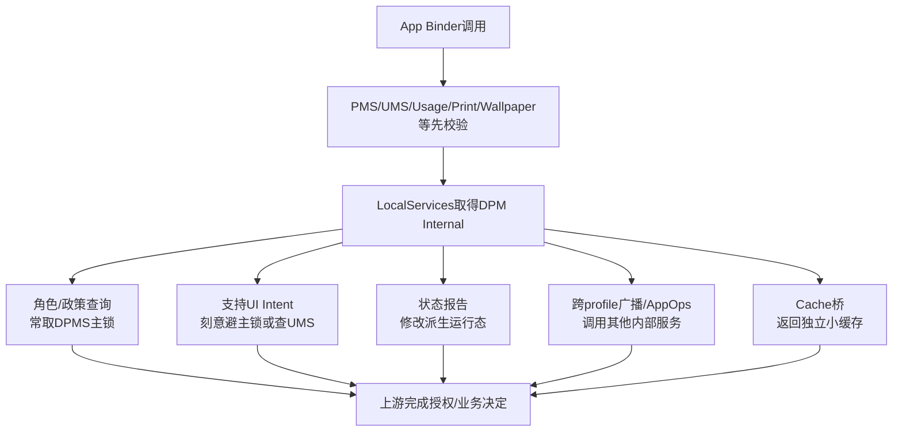
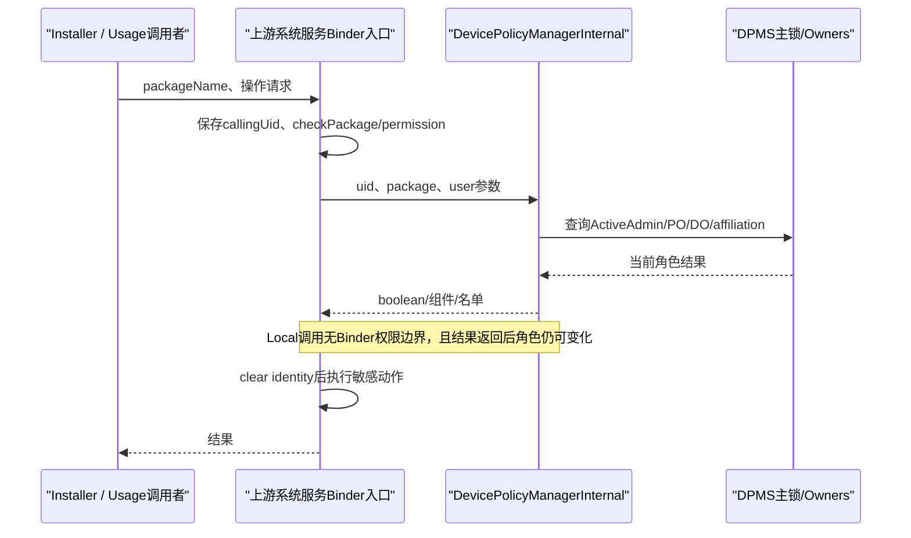
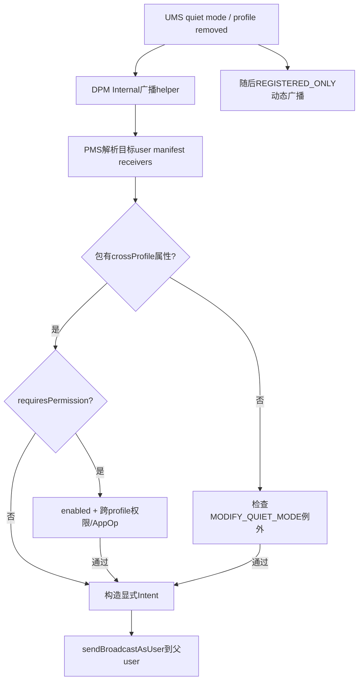

# 第 356 章 Android 企业 DevicePolicyManagerInternal：本地能力面、调用者、锁边界、回调与隐藏信任链

> 源码基线：Android 11 / API 30 / `android-11.0.0_r48`。本章只在 macOS 上阅读源码，不编译。上一章只研究三个无 Binder cache 查询；本章扩大到 `DevicePolicyManagerInternal` 的完整本地接口，重点区分“同进程”与“可在任意锁下安全调用”这两个完全不同的概念。

## 1. 它是什么

`DevicePolicyManagerInternal`是 system_server 内部 Java 接口，由DPMS的 `LocalService`实现并注册进 `LocalServices`。它让其他系统服务获取企业身份/政策信息或通知DPMS状态变化，不通过公开DPM Binder门面。

## 2. 它不是什么

它不是给系统app使用的隐藏Binder，也不是公开 `IDevicePolicyManager` 的一一映射。应用进程拿不到同一LocalServices对象；接口只挑选system_server组件需要的能力。

## 3. 接口文件先写了维护警告

类注释明确：若要向PM/UM/AM等低层服务暴露DPMS信息，通过Internal并不安全，可能造成锁顺序反转；应考虑 `DevicePolicyCache`。这句警告是本章最重要的阅读入口。

## 4. 同进程只省掉Binder机制

调用是普通Java方法，没有Parcel、Binder驱动和Binder线程切换；但被调用方法仍可能拿DPMS主锁、读文件、调用PMS/UMS、清Binder身份或回调别的系统服务。

## 5. 发布位置

DPMS构造时执行：

```java
LocalServices.addService(DevicePolicyManagerInternal.class, mLocalService);
```

其他服务随后用类型作为key取得同一个LocalService实例。

## 6. mLocalService是内部类

`LocalService extends DevicePolicyManagerInternal`是DPMS非静态内部类，可直接访问 `mOwners`、`mUserManager`、主锁和私有helper。它不是独立数据层，很多方法只是把调用直接折回外层DPMS。

## 7. 接口能力可分五类

第一类角色/政策查询，第二类管理员支持UI，第三类状态变更报告，第四类跨profile名单/广播，第五类AppOps重置与cache桥。不同类别的锁、身份和副作用完全不同。

## 8. 没有统一权限检查器

Internal调用方被假定为可信system_server代码，所以方法通常不执行公开API那套Manifest permission、calling package/AppOps校验。安全性依赖调用点先验证外部Binder caller并传入真实uid/package/user。

## 9. 可信不等于参数永远正确

来自应用的uid、packageName和userId常由上游服务传进来。若上游遗漏 `checkPackage(uid,package)`、跨user权限或identity保存，LocalService不会自动替它补齐所有边界。

## 10. 调用总览



## 11. isActiveAdminWithPolicy

该方法在DPMS主锁内调用 `getActiveAdminWithPolicyForUidLocked(null,reqPolicy,uid)`。它回答完整UID是否有指定admin policy，而非只按包名或appId判断。

## 12. reqPolicy不是任意权限字符串

参数是 `DeviceAdminInfo` policy常量，如DEVICE_OWNER、PROFILE_OWNER。传错常量会得到与调用方意图不同的角色判断，接口不额外限制允许查询的集合。

## 13. shared UID语义

判断以uid查ActiveAdmin；共享同一uid的包可能共享这项身份效果。上游若同时接受packageName，应另外验证package与uid绑定，不能把返回true自动归因给任意声称的包。

## 14. NetworkStats的消费

`NetworkStatsAccess`用DEVICE_OWNER把访问提升到整机级，用PROFILE_OWNER提升到本user级。这里DPMS查询位于网络统计授权决策中，错误角色判断会直接扩大数据可见范围。

## 15. UsageStats的消费

普通usage observer权限门允许system、Profile Owner或 `OBSERVE_APP_USAGE`权限；它把外部Binder callingUid传给Internal，再由DPMS核角色。清身份必须发生在角色判断之后。

## 16. Permission与Notification消费

PermissionManager用它识别PO，Notification policy access也把callingUid送进来。Internal方法只回答admin事实，上游仍负责其余权限、包名和API特定约束。

## 17. isActiveSupervisionApp

它先以PROFILE_OWNER policy按uid找到ActiveAdmin，再读取资源 `config_defaultSupervisionProfileOwnerComponent`，解析为ComponentName并与admin receiver组件精确相等。

## 18. Supervision是身份与资源双门

仅安装匹配包不够，仅成为任意PO也不够；必须是active admin且组件等于资源配置。资源OTA/OEM定制因此会改变谁获得UsageStats的supervision替代权限。

## 19. 空资源处理

代码检查 `supervisionString == null`，但Android资源 `getString()`通常以非null字符串或NotFoundException表现；空字符串会解析为null，随后 `admin.info.getComponent().equals(null)`安全返回false。

## 20. 调用时拿主锁

资源读取和Component解析也在DPMS锁内完成。虽计算很短，UsageStats若持自己的锁调用仍需按接口警告画锁顺序。

## 21. Widget provider getter

`getCrossProfileWidgetProviders(profileId)`在主锁内找该user的Profile Owner、加载DevicePolicyData、取对应ActiveAdmin，再返回跨资料小组件包名单。

## 22. 无PO与空名单同结果

不是PO用户、admin对象缺失、字段null或empty都返回 `Collections.emptyList()`。调用方无法只凭结果区分“没有管理资料”和“PO明确未允许任何provider”。

## 23. getter可能触发懒加载

它调用 `getUserDataUnchecked(profileId)`，未载入时可能读XML并执行加载后的push。因此注释说“takes DPMS lock”只是最低风险描述，冷路径不一定是纯内存O(1)。

## 24. 返回了内部可变List

非空时直接 `return admin.crossProfileWidgetProviders;`，没有 defensive copy或unmodifiable包装。锁释放后AppWidget持有ActiveAdmin内部List引用。

## 25. 可变引用的风险

当前AppWidget只调用 `contains()`，但接口契约没有强制只读；未来调用者若add/remove，会绕过DPMS主锁、保存和事件日志，直接篡改内存主账并制造并发读写。

## 26. 公开Binder getter的复制差异

同类公开getter对system_server自身调用时显式new ArrayList，以防本地Binder优化泄露对象；Internal getter反而直接返回。这说明“跨进程Parcel会复制”与“本地Java引用”必须分别审计。

## 27. Widget listener注册

AppWidgetService在systemReady后调用 `addOnCrossProfileWidgetProvidersChangeListener(this)`；LocalService在DPMS主锁内懒创建ArrayList，并用contains避免同一对象重复注册。

## 28. 没有remove listener

接口没有注销方法。system_server长期单例服务通常与进程同寿命，但测试重复构造、模块重启或未来短生命周期listener会被LocalService强引用保留。

## 29. 通知先复制listener

`notifyCrossProfileProvidersChanged`在锁内复制listener列表，退出锁后逐个直接回调。这样listener重入DPMS时不持主锁，降低死锁并避免遍历期间修改原列表。

## 30. listener列表null窗口

通知代码直接 `new ArrayList<>(mWidgetProviderListeners)`，没有null判断。若DPC在AppWidget注册listener前改变名单，理论上会NPE；正常SystemServer启动顺序可能缩小窗口，但代码本身未建立显式前置条件。

## 31. 单个listener异常会中断后续

回调循环没有try/catch。任一listener RuntimeException会终止通知并沿setter调用栈上抛；目前通常只有AppWidget，但健壮接口应明确异常隔离策略。

## 32. packages参数是快照

DPC add/remove在主锁内变化后new ArrayList，再锁外通知，所以传入packages不是ActiveAdmin原List。listener可以改自己的快照，不会直接改主账。

## 33. 通知不是持久化ACK

setter先修改、saveSettingsLocked、再通知；save内部I/O失败不向上传递，listener仍可能看到新内存列表。system_server重启后它又会从旧XML回退。

## 34. createShowAdminSupportIntent的特殊锁要求

接口注释说不取DPMS锁、可在任意处调用；实现还明确记录它会被AM持锁调用，因此不能再拿DPMS主锁，否则可能重现AM↔DPMS反向锁环。

## 35. 它读取Owners自己的线程安全接口

方法直接查profile owner；没有则查device owner且要求DO user等于目标user。Owners内部有独立锁，所以“无DPMS主锁”不等于“完全无锁”。

## 36. 支持Intent的优先顺序

同user优先Profile Owner，再同user Device Owner；都没有且 `useDefaultIfNoAdmin=true`时生成不带具体admin的支持页面，否则返回null。

## 37. Intent只是解释UI入口

结果指向 `Settings.ACTION_SHOW_ADMIN_SUPPORT_DETAILS`并带user/admin extra，用于说明“谁限制了操作”。它不授予解除政策能力，也不重新执行被阻止动作。

## 38. createUserRestrictionSupportIntent

该方法清Binder identity后向UserManager查询restriction sources，再根据唯一source构造PO/DO支持Intent。多个source时返回不指定admin的页面，system source时返回null。

## 39. 为什么要清identity

调用方可能正在处理某app Binder请求；查询跨user限制来源需要system_server权限。finally恢复身份，避免污染复用线程。

## 40. 清身份不改变入参user

方法仍使用调用方传来的userId与restriction。上游必须确保app有权针对该user发起操作；Internal不会因clear identity自动校验原caller范围。

## 41. 多source丢失归因

当同一限制由多个来源设置，代码选择通用页面，并留TODO希望优先返回calling user管理员。当前实现不把所有管理员列表传给UI。

## 42. system source压过并存Owner

若唯一返回source类型为SYSTEM，就不展示admin，即使注释承认还可能同时由owner强制。精确结果依赖UMS sources列表如何合并与排序。

## 43. isUserAffiliatedWithDevice没有取得主锁

LocalService直接调用外层 `isUserAffiliatedWithDeviceLocked(userId)`，但自己没有 `synchronized(getLockObject())`；该私有helper内部也没有统一取主锁。与公开 `isAffiliatedUser()`先加锁再调用形成明显差异。

## 44. Locked命名在这里确实不能当保证

helper依次读Owners、Profile Owner和两个user的 `mAffiliationIds`；`getUserData()`会在各次调用内部短暂取锁，却在返回对象后再读集合，没有把整段判定包进一个主锁临界区。Java不会因方法名带Locked自动同步。

## 45. affiliation是动态且非原子判定

DO user和有DO设备的system user直接true；其他user/profile需PO且其IDs与user0集合有交集。LocalService路径可能组合不同瞬间的Owner与集合值，返回后也会继续变化，不能缓存为session永久授权。

## 46. canSilentlyInstallPackage

它先拒绝null package，然后要求callerUid所属user已affiliated，并要求该uid是带PROFILE_OWNER policy的active admin；满足才允许上游走静默安装/卸载语义。

## 47. packageName参数实际未被使用

r48方法除null检查外不比较 `callerPackage`与admin包或uid。真实授权完全来自callerUid；上游PackageInstaller需先做AppOps `checkPackage(callingUid,callerPackageName)`。

## 48. 这个忽略为何危险

若未来调用者直接传未经uid绑定的非null字符串，Internal仍可能返回true。接口Javadoc写“calling package”，实现却只信uid，形成必须由所有调用点补齐的隐含契约。

## 49. PackageInstallerService调用较完整

uninstall先取得Binder callingUid，执行cross-user权限，并对非shell/root做 `mAppOps.checkPackage`，然后才问Internal。允许时清身份调用PMS删除。

## 50. PackageInstallerSession再次动态判断

安装结果通知前用installerUid和InstallSource package调用Internal；注释明确installer可能transfer，所以不能早早缓存。这避免session创建时是Owner、提交时已撤权仍沿用旧结论。

## 51. 两次内部查询不是原子授权

affiliation helper本身未统一持主锁，随后 `isActiveAdminWithPolicy`才单独取主锁；两者之间Owner可转移、IDs可改、admin可移除。方法最终是近实时组合判断，不是单一线性化授权快照。

## 52. 角色查询链图



## 53. reportSeparateProfileChallengeChanged

这是通知而非查询。LockSettings发现managed profile统一/分离凭据变化后，通过Handler异步取得Internal并调用它，避免LSS持锁同步进入DPMS。

## 54. LockSettings为什么post

源码注释直说直接调用DPM会死锁，且DPMS不要求报告同步发生。它先离开LockSettings关键调用链，再在mHandler线程执行LocalService。

## 55. LocalService内部做什么

它在clean identity下取DPMS主锁，更新maximum time to lock并重算同profile group密码quality cache，退出后写 `SEPARATE_PROFILE_CHALLENGE_CHANGED`事件。

## 56. 事件读取可能是另一个时刻

事件boolean通过 `isSeparateProfileChallengeEnabled(userId)`再次读取LockSettings状态。报告处理与日志值不在同一跨服务事务，快速连续切换可能让日志描述较新的状态。

## 57. 异步报告存在排队窗口

凭据模式已改变而DPMS quality cache尚未重算时，Keyguard可能短暂读旧值。上一章的cache预热/一致性分析在此得到真实生产者例子。

## 58. getPrintingDisabledReasonForUser

PrintManager发现printing受限后调用Internal取得本地化提示。方法先在DPMS主锁内再次确认 `DISALLOW_PRINTING`，再找PO包，否则退到DO包。

## 59. 持锁调用UserManager

它在DPMS锁内调用 `mUserManager.hasUserRestriction`，随后还查PackageManager和Resources。接口文件已警告低层服务锁顺序；这个实现本身也增加DPMS→UMS/PMS边。

## 60. packageName可能为null

若restriction为true但PO/DO包都不存在，代码仍把null传给 `pm.getPackageInfo(packageName,0)`；标准PM通常抛/失败方式需实测，catch只捕NameNotFoundException，没有显式null保护。

## 61. label查询失败返回null

找不到包、ApplicationInfo或label都记录错误并返回null。PrintManager因此可能不显示toast，但仍start/finish adapter并阻止打印。

## 62. UI文本来自SystemUI Context

方法通过当前ActivityThread的SystemUiContext资源格式化 `printing_disabled_by`。这避免使用DPC自定义文本，也让语言/资源来自系统界面配置。

## 63. PrintManager的null假设

它直接从LocalServices取dpmi并在printing disabled分支调用，未做null检查。正常启动依赖DPMS local service已发布；在无device-admin feature或异常测试环境需验证服务仍构造/发布。

## 64. cache两个protected桥

`getDevicePolicyCache()`与 `getDeviceStateCache()`只是返回DPMS字段。它们故意protected，调用者应使用两个Cache类的公共静态getInstance，而非直接依赖Internal。

## 65. State getter Javadoc链接小错误

`getDeviceStateCache()`注释最后写“Use DevicePolicyCache.getInstance”，语义应是 `DeviceStateCache.getInstance()`。这是文档拷贝错误，不改变实现路由。

## 66. getAllCrossProfilePackages

LocalService直接调用公开DPMS实现；该实现会执行 `enforceAcrossUsersPermissions()`，再按Binder calling user的profile group聚合各PO名单并追加默认资源名单。

## 67. Internal不总是绕过Binder身份语义

普通Java调用仍运行在当前线程，若该线程正在处理外部Binder，`Binder.getCallingUid/UserId`仍是原app。于是公开helper中的permission和calling-user逻辑会影响Internal结果。

## 68. Handler线程调用会是system身份

同一方法若从system_server Handler本地调用，calling user通常是system user。结果可能聚合user0 profile group。Internal接口未显式传userId，因此行为依赖调用线程身份。

## 69. CrossProfileApps的调用背景

服务在处理app Binder调用时先验证package，再调用Internal名单getter；保留原Binder identity让DPMS按calling profile group聚合。若上游过早clear identity，结果会错误切到user0组。

## 70. 聚合名单可能重复

admin名单用ArrayList逐项addAll，随后再add默认名单，没有最终去重。调用方主要用contains，重复不影响布尔结果，但列表大小/日志不代表唯一package数。

## 71. 默认名单来自两组资源

`getDefaultCrossProfilePackages()`用HashSet合并platform和vendor数组，再转ArrayList，因此默认部分去重但顺序不稳定。不要依赖其返回顺序做UI或持久diff。

## 72. 返回列表是新对象

聚合helper创建新ArrayList，默认getter也创建Set/List，因此这些接口不像widget getter那样泄露ActiveAdmin内部列表；调用者修改只影响自己的返回对象。

## 73. broadcastIntentToCrossProfileManifestReceiversAsUser

UMS在quiet-mode可用性和managed-profile removed时调用它，把模板Intent定向发送给父用户中具跨profile能力的manifest receiver。

## 74. 参数做非空检查

Intent和parentHandle为空立即NPE；userId来自parentHandle。接口信任调用者选择正确parent，不自行确认目标真是某profile父用户。

## 75. 先查询manifest receivers

通过IPackageManager按目标user解析模板Intent和固定flags，然后逐个取component package。query是Binder调用，即使LocalService本身是同进程对象也会跨到PMS接口/服务路径。

## 76. 每个receiver变成显式Intent

实现new Intent复制模板，setComponent到解析结果并加 `FLAG_RECEIVER_INCLUDE_BACKGROUND`，随后 `sendBroadcastAsUser`。原Intent不会被修改，避免多个receiver互相污染。

## 77. requiresPermission=true的门

包必须声明crossProfile属性、在目标user enabled，并由CrossProfileAppsInternal确认拥有跨profile permission/app-op；另外具有 `MODIFY_QUIET_MODE`的包也可通过OR分支。

## 78. requiresPermission=false的门

crossProfile属性存在即可，不要求enabled检查，因为check helper在false时提前true；OR分支还允许MODIFY_QUIET_MODE包。managed-profile removed使用此模式，接收范围明显更宽。

## 79. 属性判断按包不是receiver

代码从ResolveInfo取package，再用PackageManagerInternal.getPackage(packageName).isCrossProfile。某包只要包级属性满足，解析出的对应显式receiver就可进入后续门。

## 80. isPackageEnabled的callingUid细节

它在clear identity前保存 `Binder.getCallingUid()`，随后用该uid作为PMS filterCallingUid查询目标user PackageInfo。调用者身份可能影响包可见性过滤，即使操作已临时切system身份。

## 81. 广播没有receiverPermission参数

最终sendBroadcastAsUser未指定接收权限；安全边界由预先解析/属性/权限判断和显式component组成。若判断与发送之间包被替换，仍存在TOCTOU，需要PMS组件身份/安装代际一起分析。

## 82. RemoteException只包围解析循环

PMS query失败会记录warning并停止发送，不重试。单个sendBroadcast运行时异常没有同样catch，可能中断后续receiver。

## 83. 顺序不应作为协议

解析列表顺序决定发送循环，但每次是独立广播且目标进程调度异步。多个包观察到的处理完成顺序没有全局保证。

## 84. profile状态广播双车道

UMS先用Internal发给符合能力的manifest receiver，随后给原Intent加REGISTERED_ONLY再发动态receiver。两车道接收者、flags与时间不同，不能把它们当一条有序广播。

## 85. 跨profile广播图



## 86. getProfileOwnerAsUser

LocalService直接调用外层公开方法。该方法是否要求跨user权限、如何使用Binder calling identity，应看外层实现；Internal接口本身的Javadoc没有标锁或权限。

## 87. CrossProfileApps用途

服务用目标profile的PO component判断目标包是否为profile owner等特殊角色。它在自己的Binder授权流程中使用返回值，不应把ComponentName直接当可启动且签名未变的证明。

## 88. LauncherApps用途

LauncherApps也查询profile owner组件来决定展示/权限行为。profile在查询后被删除或owner转移时结果立即陈旧，调用方敏感动作前需重新解析当前组件。

## 89. supportsResetOp

只对 `OP_INTERACT_ACROSS_PROFILES`且CrossProfileAppsInternal服务存在时返回true。AppOpsService据此把该op的reset责任委托给DPM。

## 90. 为什么不能普通reset

部分默认跨profile包由资源预授权；全局reset app-ops后，它们应恢复到DPM定义的allowed，而普通包回到op默认值。DPM掌握这张默认名单。

## 91. resetOp的前置约定

Javadoc说调用方先确保supportsResetOp为true；实现仍只验证op类型，不检查CrossProfileAppsInternal非null。服务在两次调用间消失理论上可NPE，正常LocalService生命周期通常稳定。

## 92. reset模式计算

package在默认跨profile名单中则MODE_ALLOWED，否则 `AppOpsManager.opToDefaultMode(OP_INTERACT_ACROSS_PROFILES)`；随后调用CrossProfileAppsInternal为指定user设置。

## 93. AppOps锁边界

AppOps reset流程若持自身锁调用DPM，而DPM再调用CrossProfileAppsInternal/AppOps相关路径，可能形成反向环。需要看 `deferResetOpToDpm`实际持锁范围，接口特殊委托不自动保证安全。

## 94. reset不是全profile group一次完成

Internal接受单package和单user，批量循环由AppOps上层驱动。中途异常可让部分包/user已恢复、其余未处理，没有共同事务。

## 95. isDeviceOrProfileOwnerInCallingUser

Wallpaper用它让当前user的DO/PO不受 `DISALLOW_SET_WALLPAPER`限制。方法分别按调用线程Binder user查询DO和PO包名。

## 96. package与uid校验在Wallpaper

Wallpaper先取得callingUid的所有packages并确认包含callingPackage，再调用Internal。这个上游检查弥补Internal只按包名比较Owner、未接收uid的接口设计。

## 97. calling user依赖identity时机

若Wallpaper在调用前clear identity，Internal会把calling user看成system user，可能错误匹配user0 owner。源码正确地在clear identity查询UMS restriction之前先完成Owner判断。

## 98. 包名相等不验证签名代际

Owner账和PMS安装状态有各自生命周期；Internal只比较String。系统通常禁止随意替换Owner包且PMS校验caller package/uid，但审计不能只凭名字断言签名连续性。

## 99. LocalServices缺失处理不统一

NetworkStats、Usage、Wallpaper等多处先判dpmi null并走非Owner路径；PrintManager禁用分支和UMS helper更依赖服务必然存在。启动顺序和feature-disabled设备应分别测试。

## 100. 缓存Internal实例也有时机风险

AppWidget在初始化时取得一次，null就不会注册listener；UsageStats使用lazy getter，可在DPMS晚发布后恢复。不同消费者对服务发布顺序的容忍度不同。

## 101. LocalServices没有Binder死亡

对象与system_server同进程；进程死亡时双方一起消失，不需要linkToDeath。局部服务被测试移除/替换时，已有字段仍持旧对象，不会收到死亡通知。

## 102. 方法运行线程属于调用者

没有Binder调度，因此Usage Binder线程、LockSettings Handler、AppOps线程或UMS线程会直接执行DPMS LocalService代码。分析线程安全必须从每个调用点向内延伸。

## 103. clearCallingIdentity仍然有意义

同进程普通调用没有新Binder边界来覆盖原calling身份；若上游线程正在处理app Binder，原UID会继续传播。LocalService在需要代表system访问UMS/PMS时仍必须clear/restore。

## 104. 反向回调是主要危险

DPMS持主锁调用UMS/PMS，而这些服务持自己锁调用Internal取DPMS主锁，就形成环。cache、Handler post、锁内快照后锁外调用是三种常见拆环方式。

## 105. API注释并非都准确完整

只有少数方法明确写takes/does not take DPMS lock；其余需读实现。getStateCache的Javadoc还链接错类，说明不能把注释当唯一证据。

## 106. 列表所有权审计

每个List返回/回调都问：空时是否共享immutable singleton、非空是否live view、是否copy、调用者能否修改、修改是否需锁/持久化。Widget getter与cross-profile聚合正好给出两种相反答案。

## 107. 参数所有权审计

broadcast明确copy Intent；listener packages是setter制作的ArrayList快照；resetOp直接使用String/user；support Intent每次new。可变Bundle/Intent/List跨本地接口若不copy，比跨Binder更容易共享状态。

## 108. 授权审计三问

上游是否验证原Binder caller？package是否与uid绑定？clear identity发生在角色查询之前还是之后？canSilentlyInstall与wallpaper两个调用点展示了正确补齐Internal窄接口的方式。

## 109. 锁审计三问

调用者进来时持什么锁？LocalService会取DPMS/Owners/UMS/PMS哪把锁？它会同步回调谁？不要因方法只有一行delegate就停止展开。

## 110. 失败审计三问

LocalService缺失时默认允许还是拒绝？RemoteException/RuntimeException是否中断批处理？结果是提示UI、授权boolean还是不可逆操作？风险等级由消费者决定。

## 111. 本章心智模型

DevicePolicyManagerInternal是一组“由可信system_server调用者共同维护边界”的本地能力，而不是天然安全层：它保留调用线程/identity，常进入DPMS主锁，也可能再跨UMS/PMS/AppOps；Cache才是为特定无锁回源读场景设计的窄副本。

## 112. macOS只读练习一：建立方法矩阵

读取 `DevicePolicyManagerInternal.java`和DPMS `LocalService`，为每个abstract方法标查询/通知/广播、是否取DPMS锁、是否清identity、是否跨其他服务、返回对象是否copy；对无法从一层证明的项写“继续追helper”。

## 113. macOS只读练习二：审计静默安装

从PackageInstallerService.uninstall和PackageInstallerSession结果通知追 `canSilentlyInstallPackage`，标AppOps checkPackage、callingUid/user、affiliation、admin policy、clear identity和最终PMS动作；解释Internal为何不使用packageName仍暂时安全。

## 114. macOS只读练习三：画LockSettings拆环

从 `notifySeparateProfileChallengeChanged`画Handler post、LocalServices、DPMS主锁、max lock/cache重算和事件日志；假设改成LSS锁内同步调用，画出可能的LSS→DPMS与DPMS→LSS反向边。

## 115. macOS只读练习四：验证可变对象边界

对比widget getter、widget listener packages、getAllCrossProfilePackages和broadcast Intent四条路径，指出哪一个泄露ActiveAdmin live List、哪几个是快照；设计一个只读测试证明修改返回List是否污染DPMS内存。

## 116. 本章检查题

为什么LocalService调用仍要clearCallingIdentity？为什么PM持锁调用Internal可能死锁？为什么canSilentlyInstall的package参数未使用却依赖上游checkPackage？为什么返回live List比Binder返回List更危险？

## 117. 复读修正一：Internal不是Binder本地优化版

复读全部abstract与实现后已按能力面分类；不少方法调用公开DPMS helper、UMS/PMS或CrossProfileApps，并保留当前Binder caller identity。文档已删除“只是免序列化”的过窄理解。

## 118. 复读修正二：无DPMS主锁不等于无锁

support Intent刻意避主锁以供AM持锁调用，但仍读取Owners内部同步状态；broadcast不取DPMS主锁却跨PMS和其他LocalServices。文档已按实际锁/调用边描述，而非二元标成安全。

## 119. 复读修正三：信任边界在调用链两端共同完成

Internal通常不执行公开权限门。PackageInstaller与Wallpaper分别用AppOps checkPackage或UID包数组绑定caller，再让DPMS判断Owner；清identity发生在判断之后。文档已把这些上游步骤纳入授权结论。

## 120. 本章结论与下一章

第356章完成了DevicePolicyManagerInternal全能力审计：同进程调用保留线程、锁和Binder身份，低层服务反调DPMS会有锁反转；角色查询必须由上游补package/uid边界，通知与跨profile广播又带异步、TOCTOU和对象所有权问题。下一章深入Cross-Profile Widget Providers：DPC名单、AppWidget父资料映射、RemoteViews/点击Intent、生命周期刷新和live List边界。
