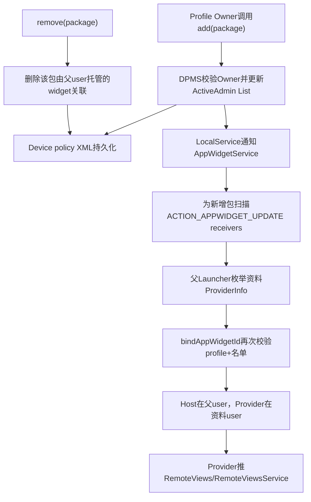
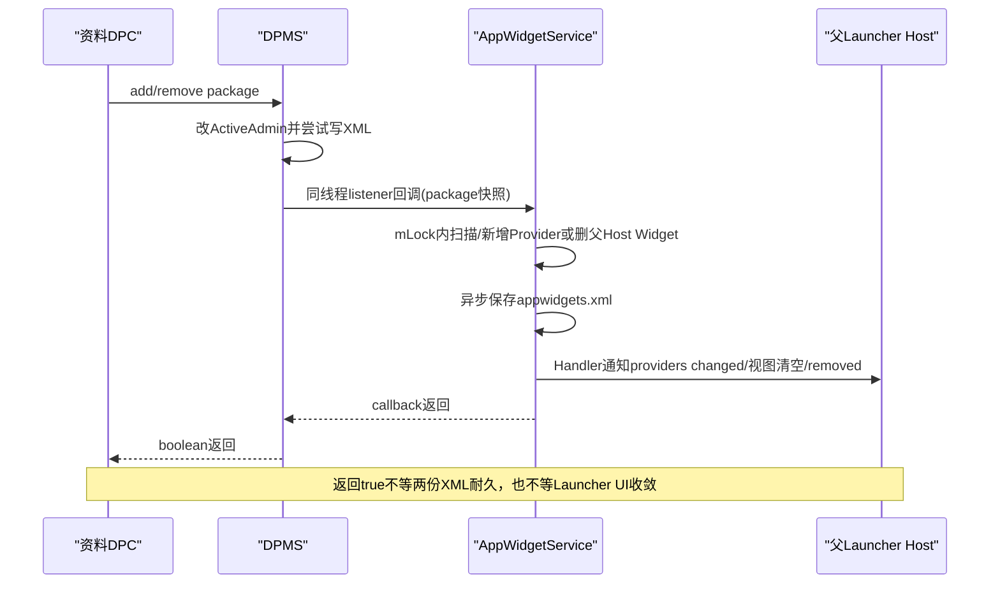
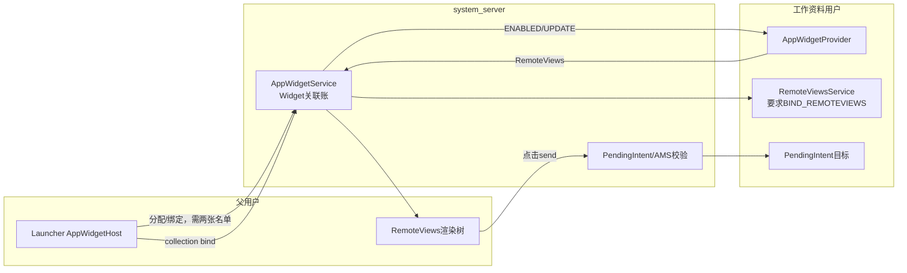

# 第 357 章 Android 企业 Cross-Profile Widget Providers：名单、绑定、RemoteViews、遮罩、撤权与跨用户能力链

> 源码基线：Android 11 / API 30 / `android-11.0.0_r48`。本章只在 macOS 上阅读源码，不编译。前两章分析了DPMS本地接口和live List边界；本章把这条名单一路追到AppWidgetService，回答“父用户为何能显示工作资料组件、撤销后删什么、quiet/locked时为何只遮罩，以及名单绝不等于任意跨用户权限”。

## 1. 先描述产品场景

工作资料中的应用可以声明 `AppWidgetProvider`。默认情况下，父用户桌面不能枚举和绑定这些跨user provider；Profile Owner把包加入名单后，父用户的Launcher才可把该包在资料user中的widget添加到自己的host。

## 2. 方向只有profile到parent

目标是“provider运行在managed profile，host运行在其parent”。不是资料桌面反向添加父用户widget，也不是两个任意profile互相展示。

## 3. 名单粒度是package

DPC传入packageName，一个包内零个、一个或多个AppWidgetProvider组件整体获得候选资格。接口不能只允许其中某个receiver component。

## 4. 名单不是安装器

加入不存在或未安装的包不会下载/安装应用；AppWidget刷新该包时查不到 `ACTION_APPWIDGET_UPDATE` receiver，就没有Provider对象可展示。

## 5. 名单不是跨profile通用许可

它只参与AppWidget provider枚举/绑定及已有跨profile widget清理，不授予启动任意Activity、读资料数据、跨user ContentProvider、Service或普通Broadcast权限。

## 6. 公开API三件套

`addCrossProfileWidgetProvider`、`removeCrossProfileWidgetProvider`和 `getCrossProfileWidgetProviders`位于DevicePolicyManager；客户端先 `throwIfParentInstance`，再经IDevicePolicyManager Binder进入DPMS。

## 7. parent DPM实例不能调用

COPE等API有 `getParentProfileInstance()`形式，但这三个方法明确拒绝parent instance。名单属于资料Owner自己的ActiveAdmin字段，作用却由AppWidget解释为向parent开放。

## 8. 默认是空名单

公开文档写明默认没有包被允许。ActiveAdmin字段初始null；Internal getter把null和empty都映成空集合，因此默认父桌面看不到资料provider。

## 9. 全链概览

## 10. DPMS写端取得calling user

add/remove开头用 `UserHandle.getCallingUserId()`确定保存哪个user的DevicePolicyData。Binder caller若是资料DPC，key就是managed profile userId。

## 11. admin必须属于calling UID

主锁内 `getActiveAdminForCallerLocked(admin, USES_POLICY_PROFILE_OWNER)`既验证Component是active admin，也验证其uid等于Binder callingUid，不能拿另一个DPC的Component改名单。

## 12. USES_POLICY_PROFILE_OWNER的实际语义

r48 `isActiveAdminWithPolicyForUserLocked`明确写“DO always has PO power”，所以这个特殊policy允许DO、普通PO和组织所有PO，而非只允许managed-profile PO。

## 13. 公开文档与执行门有落差

Javadoc说由managed profile的Profile Owner调用；服务端却没有额外 `enforceManagedProfile`或只PO判断。阅读授权必须同时记录文档意图与实际reqPolicy展开结果。

## 14. DO写入为何可能无效果

AppWidget读取Internal名单时只用 `mOwners.getProfileOwnerComponent(profileId)`定位admin，没有回退Device Owner。因此DO可写入并持久化自己的字段，但这条跨资料读取不会把DO字段作为有效名单。

## 15. 角色落差不是立即越权

DO能调用setter不等于父桌面获得DO user外的widget；真正执行门在Internal getter与profile-parent检查。更接近“成功返回但无消费效果”的实现/文档不一致。

## 16. add的null到List转换

字段null时创建ArrayList；若不含packageName就add、制作changedProviders快照、保存XML。已有同值返回false且不重复保存/通知。

## 17. 不校验package是否存在

DPMS不查PMS、不校验provider receiver、不绑定签名，也不要求字符串非空。名单是包名desired policy，真实安装和组件资格由AppWidget扫描时决定。

## 18. 重复项被contains抑制

正常API不会加入同一字符串两次；但损坏XML或内部live List被修改可能制造重复。加载helper只是逐项读属性，不在此处显式去重。

## 19. null package边界

服务端没有 `Objects.requireNonNull(packageName)`；ArrayList可保存null，但XML attribute写入和AppWidget包扫描未按null设计。客户端注解也未给packageName标NonNull，应把null当健壮性测试而不是支持语义。

## 20. remove的返回语义

字段null/empty立即false；只有 `providers.remove(packageName)`成功才制作快照、保存并通知。ArrayList.remove只移除第一个相等项，异常重复可能残留。

## 21. 事件日志与变化返回

add即使重复也写ADD事件；remove在null/empty处提前return不写事件，而非空但目标不存在会写REMOVE事件后返回false。事件数量不能直接等于真实名单变化次数。

## 22. 保存顺序

内存List先变，`saveSettingsLocked(userId)`再写JournaledFile；I/O失败被内部捕获，setter仍可继续通知并返回true。运行态和重启态可能分叉。

## 23. XML表示

非空List写 `<cross-profile-widget-providers>`，每项作为 `<provider value="...">`；null和empty都省略整个tag。磁盘无法区分“从未设置”与“明确清空”。

## 24. 加载表示

遇到tag时new ArrayList并读所有provider值；未遇到保持null。加载本身不会通知AppWidget，AppWidget通过启动状态装载和后续监听共同恢复。

## 25. 公开getter的null归一化

DPMS字段null/empty时返回null；DevicePolicyManager客户端把null转成 `Collections.emptyList()`。DPC看到的API契约始终NonNull List。

## 26. Binder复制与本地调用分支

DPMS getter若判断callingUid是system_server自身，会new ArrayList；否则返回内部List给Binder序列化。跨进程Parcel本来会复制，本地Binder优化分支额外防止Java引用泄露。

## 27. Internal getter反而返回live List

AppWidget调用的 `DevicePolicyManagerInternal.getCrossProfileWidgetProviders(profileId)`非空时直接返回ActiveAdmin字段。AppWidget目前只contains，未修改它，但接口所有权仍是不安全边界。

## 28. Internal只承认Profile Owner

它先从Owners取profileId的PO Component，再从该user的DevicePolicyData取相同ActiveAdmin。PO身份账和ActiveAdmin账任一缺失都返回空。

## 29. profileId注释比实现更严格

接口注释说非managed profile返回空；实现没有显式 `UserInfo.isManagedProfile`，而是以“是否有Profile Owner”代替。secondary user若有PO，理论上可返回字段，但AppWidget parent检查仍阻止无parent方向。

## 30. AppWidget何时取得Internal

`AppWidgetServiceImpl.onStart()`一次性从LocalServices取得DPM Internal，随后注册listener。若DPMS当时未发布，字段保持null且本方法不见后续重试，跨profile查询会持续deny。

## 31. 正常启动顺序是一项隐含依赖

SystemServer通常先启动DevicePolicy再AppWidget；源码仍用null表达device policy可选。测试/OEM改启动顺序时，应验证listener是否注册和字段是否永久为空。

## 32. Listener注册持DPMS锁

AppWidget把自身注册到LocalService列表；重复同一对象被contains抑制，没有remove接口。两个system_server单例预计同寿命，但测试重建需清LocalServices和listener状态。

## 33. DPC变化后的通知快照

add/remove在DPMS主锁内new ArrayList(changed list)，锁外调用 `notifyCrossProfileProvidersChanged`。传给AppWidget的是值快照，不是刚才所说的Internal getter live List。

## 34. listener回调也在原调用线程

LocalService不是Handler分发；DPC Binder线程在setter保存后直接执行AppWidget callback。DPMS先复制listener并释放主锁，但调用仍同步占用DPC请求。

## 35. listener列表的r48空指针窗口

若名单在任何listener注册前改变，notify直接 `new ArrayList<>(null)`可NPE。正常启动排序不构成代码级null检查，测试应显式覆盖。

## 36. AppWidget callback先找parent

`onCrossProfileWidgetProvidersChanged(userId,packages)`调用SecurityPolicy.getProfileParent；若返回的parentId等于userId，什么也不做，只有真实profile→parent关系进入处理。

## 37. getProfileParent的未知值

UserManager找不到parent时返回 `UNKNOWN_USER_ID=-10`，它与userId通常不等，callback反而可能进入处理并以-10作为parentId。后续删除host匹配不到，但这是值得做的删除profile竞态测试。

## 38. callback持AppWidget主锁

它在 `mLock`内扫描Provider、查PMS更新组件、删除Widget、安排保存与Host通知。虽然DPMS主锁已释放，DPC Binder线程仍可能在AppWidget锁上等待。

## 39. 先收集旧package集合

callback遍历 `mProviders`中属于profile user的所有Provider，将其package加入ArraySet。注意这不只收集先前白名单包，也可能包含AppWidget已因同user用途加载的其他provider。

## 40. 对新名单逐包刷新

每个package先从previousPackages移除，再调用 `updateProvidersForPackageLocked(package,userId,null)`扫描该包的AppWidget receiver，新增、刷新或清掉已失效component。

## 41. 新增名单不保证providersChanged

包不存在、没有合法provider或Provider信息与当前完全相同，都可能false；名单已持久，但Host不一定收到providers changed callback。

## 42. previousPackages剩余项被撤销

未出现在新名单的package逐项调用 `removeWidgetsForPackageLocked(pkg,profileId,parentId)`。它不会从全局mProviders删除该包Provider，只删除其由parent user host的widget关联。

## 43. 为什么保留Provider对象

同一个资料user内的host仍可能使用自己user的provider；白名单只控制跨到parent的关系。删除Provider对象会误伤同user widget和组件目录。

## 44. 撤销删除的精确方向

helper筛provider package+provider user，再 `deleteWidgetsLocked(provider,parentUserId)`；只有host user等于parent的Widget被断开。其他host关系不动。

## 45. deleteWidgets不是正常DPC disabled广播

它从provider/host/mWidgets摘关联、把Host收到的RemoteViews置null、清widget.provider/host引用并prune；没有走 `deleteAppWidgetLocked`那套provider deleted/disabled广播完整协议。

## 46. 父Host收到空视图

删除前调用 `updateAppWidgetInstanceLocked(widget,null,false)`安排Host视图清空，然后removeWidget又安排appWidget removed callback。具体客户端回调到达顺序受CallbackHandler队列影响。

## 47. 撤权是破坏现有绑定

不是只阻止未来枚举：原父桌面widget记录被删除。以后重新加白名单需要用户/Launcher重新分配和绑定，旧appWidgetId关系不会自动复活。

## 48. 保存与Host通知是异步

若providersChanged或removedCount>0，调用 `saveGroupStateAsync(userId)`并schedule hosts providers changed。callback返回不等AppWidget XML耐久或Launcher已经刷新选择器。

## 49. removedCount可能大于真正删除

previousPackages来自profile全部Provider包；某包不在名单但从未有parent-host widget，也计入removedCount并触发save/notify。这个数字不是被删Widget数。

## 50. 写入到可见性的时序

## 51. Provider枚举入口

Launcher等调用 `getInstalledProvidersForProfile(category,profileId,package)`；服务先验证profile是calling user自身或其profile且enabled，再在锁内遍历ProviderInfo。

## 52. Instant app不能枚举

若caller UID首个包被PMS判为instant app，返回空列表。跨profile名单不会覆盖instant-app限制。

## 53. category与package过滤先执行

Provider须非zombie、widgetCategory匹配、可选packageName相等；随后还要provider的profileId精确等于请求值并过跨profile白名单。

## 54. 同user不需DPC名单

SecurityPolicy中 `profileId == callerId`直接true。同user正常AppWidget行为不由cross-profile名单收紧。

## 55. 只有parent caller可跨到profile

profile与caller不同，则 `getProfileParent(profileId)`必须等于calling user；资料user想枚举parent provider会得到false，兄弟profile也不通过。

## 56. profile必须enabled

`isEnabledGroupProfile`还检查UserInfo存在且 `isEnabled()`；它没有检查running、unlocked或 `isQuietModeEnabled()`。因此quiet与disabled不是同一门，quiet主要由已有Provider的masked状态处理，不能写成“quiet必然导致此处返回false”。

## 57. 枚举每次重新读名单

`isProviderWhiteListed`调用DPM Internal getter再contains(package)，没有在AppWidget维护独立名单副本。live List未被缓存到字段，因此DPC撤销后新枚举可立即看到当前DPMS内存值。

## 58. Internal缺失时deny

若mDevicePolicyManagerInternal为null，跨profile判断返回false。同user分支已提前true，所以device-admin可选设备的普通widget不受影响。

## 59. ProviderInfo为clone

加入结果时 `cloneIfLocalBinder(info)`，避免同进程Binder调用者持有/修改服务内部AppWidgetProviderInfo。与DPMS Internal live List形成鲜明对比。

## 60. bindAppWidgetId再次校验

即使Launcher先枚举过Provider，真正bind仍重新检查profile关系、enabled和包名单，防止名单在选择器展示后、用户确认前被撤销。

## 61. callingPackage先绑UID

`mAppOpsManager.checkPackage(Binder.getCallingUid(),callingPackage)`阻止Launcher伪造别的host包名。跨profile名单并不免除host身份校验。

## 62. Host还需绑定权限

caller必须拥有signature `BIND_APPWIDGET`，或其包被AppWidget自己的 `mPackagesWithBindWidgetPermission`授权。这张host bind名单与DPC provider名单是两张独立白名单。

## 63. 两张名单不要混淆

DPC名单回答“资料里的哪些provider包可跨给parent”；AppWidget bind permission名单回答“parent里的哪个host包可免signature权限绑定widget”。两者任一不满足都失败。

## 64. appWidgetId必须属于caller Host

lookup以appWidgetId、callingUid和callingPackage查未绑定Widget，别人分配的id不能被抢占。provider白名单不改变id所有权。

## 65. provider UID按目标profile解析

服务用package+providerProfileId查uid，构造 `(uid,ComponentName)` ProviderId。相同包名在parent与profile是不同UID/user身份，不会因字符串相同混成一个provider。

## 66. component必须真实注册

lookupProvider找不到组件就false；safe mode中的第三方zombie也拒绝新绑定。包级名单不能把普通BroadcastReceiver伪装成AppWidgetProvider。

## 67. bind成功建立跨user三元组

Widget包含父user Host、资料user Provider和appWidgetId/options；分别加入host.widgets、provider.widgets和全局mWidgets，成为后续update、删除和持久化的关联账。

## 68. 首个Widget触发enabled

若provider.widgets从0变1，向资料user的provider component发 `ACTION_APPWIDGET_ENABLED`；随后立即发UPDATE和注册周期更新alarm/broadcast。

## 69. 白名单不直接启动provider进程

add只让AppWidget扫描组件；真正bind/enable/update或后续RemoteViewsService才可能拉起资料应用。名单setter返回不表示provider已运行。

## 70. options由服务复制

若options非null用cloneIfLocalBinder，否则new Bundle，并补默认host category。跨profile资格不允许host通过共享Bundle引用修改服务账。

## 71. AppWidget持久化分user

每个user的 `appwidgets.xml`保存属于该user的providers、hosts，以及“由该user host”的widgets。跨profileWidget的Widget关系主要写在父host user文件，同时引用资料provider tag。

## 72. 加载必须装完整profile group

注释明确host和provider可能位于不同user，只有所有相关用户文件的providers/hosts都加载后，才能用tag把Widget重新关联。单独读父文件不足以还原跨资料关系。

## 73. 两份持久账无共同事务

DPMS XML保存provider package名单；AppWidget XML保存实际绑定。它们用不同线程/AtomicFile时机，崩溃可出现名单已加但无Widget、Widget仍在而名单已撤的恢复窗口。

## 74. r48启动恢复没有重验DPM名单

`loadGroupWidgetProvidersLocked()`扫描enabled profile group的全部AppWidget receiver；`bindLoadedWidgetsLocked()`只按providerTag/hostTag重连并addWidget，没有调用 `isProviderWhiteListed`。所以旧XML中的跨profile关系不会在装载这一刻重新核对当前名单。

## 75. Provider更新只发给真实user

Provider enable/update广播使用 `provider.info.getProfile()`，即资料UserHandle。父Launcher只是Host，不把DPC/Provider代码迁移到parent进程。

## 76. RemoteViews跨进程传给Host

资料provider调用update，AppWidget按provider uid/package和widget关系查权，再把RemoteViews经Host callback交给父Launcher。Host渲染受RemoteViews允许的操作集合限制，而不是执行任意provider Java代码。

## 77. RemoteViews仍可携带能力

它可设置PendingIntent点击和collection adapter等；这些能力由PendingIntent creator身份、AppWidget/AMS执行校验和目标user共同约束。DPC名单只允许组件作为widget来源，不替代这些下游检查。

## 78. 点击不是“父user直接启动资料组件”简写

Host触发RemoteViews封装的PendingIntent；系统按PendingIntent记录的creator/target/user处理。应追PendingIntent创建处和AMS，而不是假定Launcher获得任意跨user startActivity权限。

## 79. Collection widget使用RemoteViewsService

父Host需要绑定资料provider的RemoteViewsService时调用 `bindRemoteViewsService`；服务先确认appWidgetId可被该host/provider访问，并确认Widget已有Provider。

## 80. Service必须与provider同包

Intent component package必须等于Widget provider package，阻止白名单provider借AppWidgetService让父Host绑定资料user中任意其他包Service。

## 81. Service还必须同user存在

`enforceServiceExistsAndRequiresBindRemoteViewsPermission(component,providerUserId)`精确在资料user查询ServiceInfo，避免同包在parent中的component被错误绑定。

## 82. Service必须要求BIND_REMOTEVIEWS

该signature权限让普通应用不能冒充可由AppWidgetService绑定的RemoteViewsService。包名相同检查本身不够，permission是第二道门。

## 83. AMS绑定仍用caller app记录

AppWidget清identity调用AMS bind，但传入原host的IApplicationThread/activityToken/connection；目标user固定provider user。身份代理和连接归属是混合模型，不能描述为DPMS在绑定。

## 84. Service引用按Widget计数

成功后以 `(providerUid, FilterComparison(intent))`映射appWidgetIds；最后一个引用删除时绑定工厂可被销毁。撤销名单删除Widget也会触发引用计数清理。

## 85. 跨user运行图

## 86. profile locked时不删除Widget

AppWidget在profile/parent锁定时设置provider.maskedByLockedProfile，保留Host/Provider/Widget关系，向父Launcher推系统生成的遮罩RemoteViews。

## 87. quiet mode同样遮罩

收到MANAGED_PROFILE_AVAILABLE/UNAVAILABLE后reload masked state；quiet时显示带work badge的灰化图标和打开quiet-mode对话框的PendingIntent，而非把DPC名单撤销。

## 88. package suspended也遮罩

provider包被暂停时maskedBySuspendedPackage=true；若由platform policy暂停，点击打开admin support；其他suspender则用SuspendedAppActivity解释。

## 89. 三种遮罩是OR关系

Provider保存locked、quiet、suspended三个boolean，任一个true就isMasked。选择点击行为时优先suspended，再quiet，最后locked，不是按最后发生原因。

## 90. 原RemoteViews没有丢

Widget同时保存views和maskedViews，`getEffectiveViewsLocked`优先masked。解除全部遮罩只清maskedViews，再把原views重新通知Host，不必让provider立即重建。

## 91. 遮罩内容由system_server创建

服务加载provider图标、做disabled色彩、使用系统layout，并为每个appWidgetId生成PendingIntent。资料provider不能伪造这张系统遮罩来改变解锁/quiet提示。

## 92. masked PendingIntent requestCode

代码用widget.appWidgetId作为requestCode并FLAG_UPDATE_CURRENT，减少同一系统package内不同widget点击Intent互相覆盖；Intent自身的data/component等仍决定PendingIntent identity规则。

## 93. 锁定点击可能无Intent

KeyguardManager若无法创建confirm credential Intent，onClickIntent为null；遮罩仍显示但点击不做恢复动作。UI存在不保证能立即解锁资料。

## 94. profile stop的保留策略

onUserStopped移除host和provider都在该user的普通Widget；跨资料情形host在parent、provider在stopped profile，因此Provider和Widget关系可保留，让父Host继续显示masked视图。

## 95. 停止资料不等撤销名单

停止/quiet/locked是可恢复可用性状态，采用mask；DPC remove名单是授权撤回，采用delete跨profileWidget。两条生命周期不能混用。

## 96. profile删除则最终清账

用户删除会触发AppWidget对该user providers/hosts、跨userWidget和持久文件的清理；DPC policy文件也被删除。精确完成点跨UMS/AppWidget/DPMS多个异步阶段。

## 97. provider包卸载

包广播让AppWidget remove/update Provider并删除关联Widget；DPMS名单仍可能保留包名，因为名单按desired string持久。将来同名包重装是否重新可见取决于签名/Owner policy是否仍在和组件扫描。

## 98. 名单不绑定签名

ActiveAdmin只存packageName，不存证书摘要。系统包替换通常受PMS签名规则保护，但卸载后由不同签名同名包重装的政策继承风险应结合安装权限、profile管理和PMS签名数据评估。

## 99. 撤销与在途update竞态

AppWidget callback持mLock删除Widget；provider同时发update也需mLock查关系。锁给本服务内顺序，但已排入Host CallbackHandler的旧RemoteViews可能先/后于removed通知到达。

## 100. 撤销与在途PendingIntent

已渲染RemoteViews中的PendingIntent可能已交给Host；删除Widget不会自动取消由provider创建的所有PendingIntent。未来Host view移除降低入口，但已取得能力对象的生命周期要按PendingIntent记录另审。

## 101. 撤销与RemoteViewsService连接

deleteWidgets路径调用removeWidget→服务引用计数递减，最后引用时请求destroy factory；但实际ServiceConnection/AMS解绑和进程状态是异步运行边界，不与DPC setter形成事务。

## 102. saveGroupStateAsync的崩溃窗口

DPC remove返回前AppWidget内存关系已删，但appwidgets.xml可能尚未落盘。若system_server立即崩溃，旧XML仍含绑定；而r48装载又不重验白名单，只要Host/Provider tag仍可解析，该跨profile Widget就可能复活。这应以故障注入直接验证并作为一致性缺口处理。

## 103. DPMS写失败的相反窗口

若名单remove只改内存且DPMS XML仍旧允许，AppWidget当前运行删除Widget；重启后旧名单又恢复，但旧Widget是否恢复还取决于AppWidget XML是否已保存删除，形成四种组合。

## 104. 现场排查“列表看不到工作Widget”

依次检查calling user确为parent、profile存在/enabled、Internal非null、PO Component和ActiveAdmin一致、名单包含包、包在profile安装、receiver响应APPWIDGET_UPDATE、provider非external/zombie且category匹配。

## 105. 排查“能看到但绑定失败”

重点比较枚举到bind之间名单/quiet变化，检查Launcher callingPackage↔UID、BIND_APPWIDGET或host grant、appWidgetId归属、provider UID/component和safe mode。

## 106. 排查“撤销后图标还在”

确认DPC remove实际返回true、listener已注册、callback parentId、previousPackages、Host callback队列与Launcher本地缓存；区分系统遮罩、旧截图和真实仍绑定Widget。

## 107. 排查“重启后又回来”

同时查看device_policies.xml名单和各profile group的appwidgets.xml，结合前次save失败日志/进程崩溃点。只看一个dumpsys不能证明两份账同代。

## 108. 测试角色落差

分别以managed-profile PO、secondary-user PO、system-user DO调用add；比较公开getter、Internal getter、AppWidget跨profile枚举和实际bind。用结果区分文档意图、DPMS授权和最终执行门。

## 109. 测试live List

测试线程取得Internal非空List后尝试add哨兵值，再从DPMS内存/公开getter读取；这能证明引用泄露。生产修复应返回copy或unmodifiable，而不是要求调用方自律。

## 110. 测试撤权完整性

一个资料包建立两个provider，父Host与资料Host各绑定；remove包后断言只删父Host关系、资料内Widget保留，RemoteViewsService引用正确减少，持久化重启后不复活。

## 111. 本章心智模型

Cross-profile widget是两用户间一条受限“UI投影”：PO package名单打开provider候选，AppWidget再用parent关系、profile enabled、host bind权、组件和RemoteViewsService权限逐层收紧；quiet/lock用mask保持关系，撤名单则破坏父Host绑定。

## 112. macOS只读练习一：追名单双账

用 `rg -n "crossProfileWidgetProviders|onCrossProfileWidgetProvidersChanged" frameworks/base`，画ActiveAdmin字段、device policy XML、listener快照、AppWidget Provider/Widget和appwidgets.xml；标出两个异步保存点与四种崩溃组合。

## 113. macOS只读练习二：手算绑定矩阵

建立caller为parent/profile/兄弟profile，target为same user/managed profile/secondary，profile enabled/disabled，DPC包名单有/无，Host有BIND_APPWIDGET/本地grant的矩阵；逐格代入两个SecurityPolicy方法和bind流程。

## 114. macOS只读练习三：审计撤权

从remove API进入DPMS notify，再展开previousPackages、updateProviders、removeWidgets、deleteWidgets和Host callbacks；分别列父Host、资料Host、provider broadcasts、RemoteViewsService、PendingIntent与磁盘的最终/在途状态。

## 115. macOS只读练习四：追遮罩优先级

阅读reload/mask/unmask方法，构造locked+quiet+suspended八种组合，写出effective RemoteViews、badge和点击Intent；再说明为何remove whitelist不是第四个masked boolean，而是删除Widget关系。

## 116. 本章检查题

为什么包名单不等于组件名单？为什么父Launcher还需自己的bind权限？为什么profile stop只mask而撤名单删除？为什么Internal live List危险但listener packages快照较安全？

## 117. 复读修正一：PO文档不等于reqPolicy只认PO

逐层展开后确认r48 `USES_POLICY_PROFILE_OWNER`也接受DO；但Internal消费只查PO且AppWidget只允许profile→parent。文档已把“可调用setter”和“能产生跨资料效果”分开，未把角色落差误报成越权。

## 118. 复读修正二：撤权删内存关系但重启不复验名单

callback保留资料Provider，只删除其由parentId托管的Widget，避免误伤资料内同user Widget；更关键的是启动按tag重连时不复验DPM名单。因此正文已同时修正“撤权彻底删除Provider”和“重启自然会按政策裁剪”两个误解。

## 119. 复读修正三：白名单不直接授权点击与Service

RemoteViews点击仍走PendingIntent/AMS，collection Service还需同provider包、同profile user和BIND_REMOTEVIEWS。正文已把名单限定为AppWidget候选/绑定门，不把它扩张成通用跨user能力。

## 120. 本章结论与下一章

第357章闭合了DPC名单到父Launcher UI投影的完整链：包级desired policy持久化后同步通知AppWidget，枚举与bind重复校验，跨userWidget另行持久；quiet/locked/suspended遮罩可恢复，remove名单定向删除父Host关系，但异步保存后崩溃可因启动不复验名单而复活。下一章深入AppWidgetService的跨user状态加载、Provider/Host/Widget tag关联、AtomicFile保存、备份恢复和资料删除一致性链。
