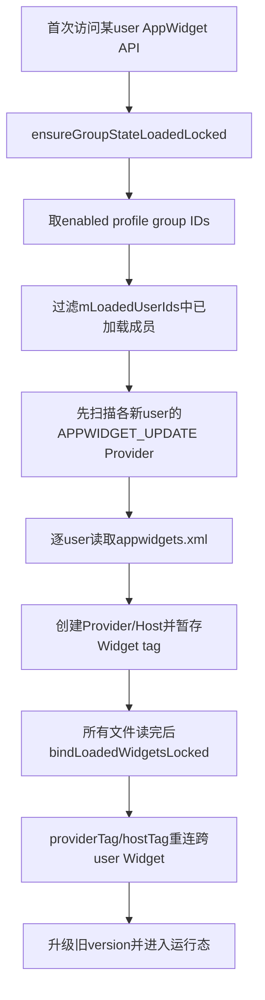
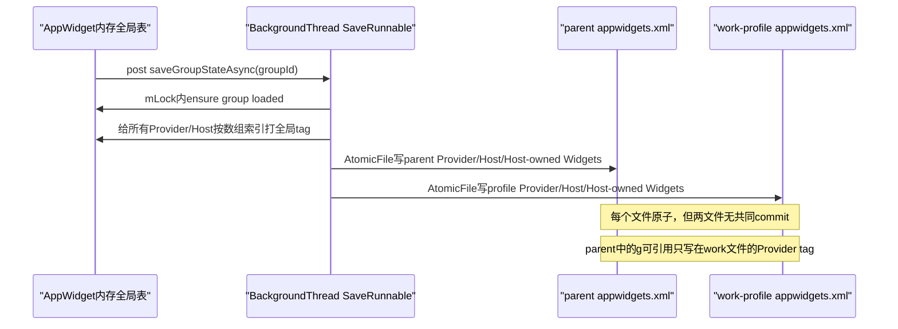
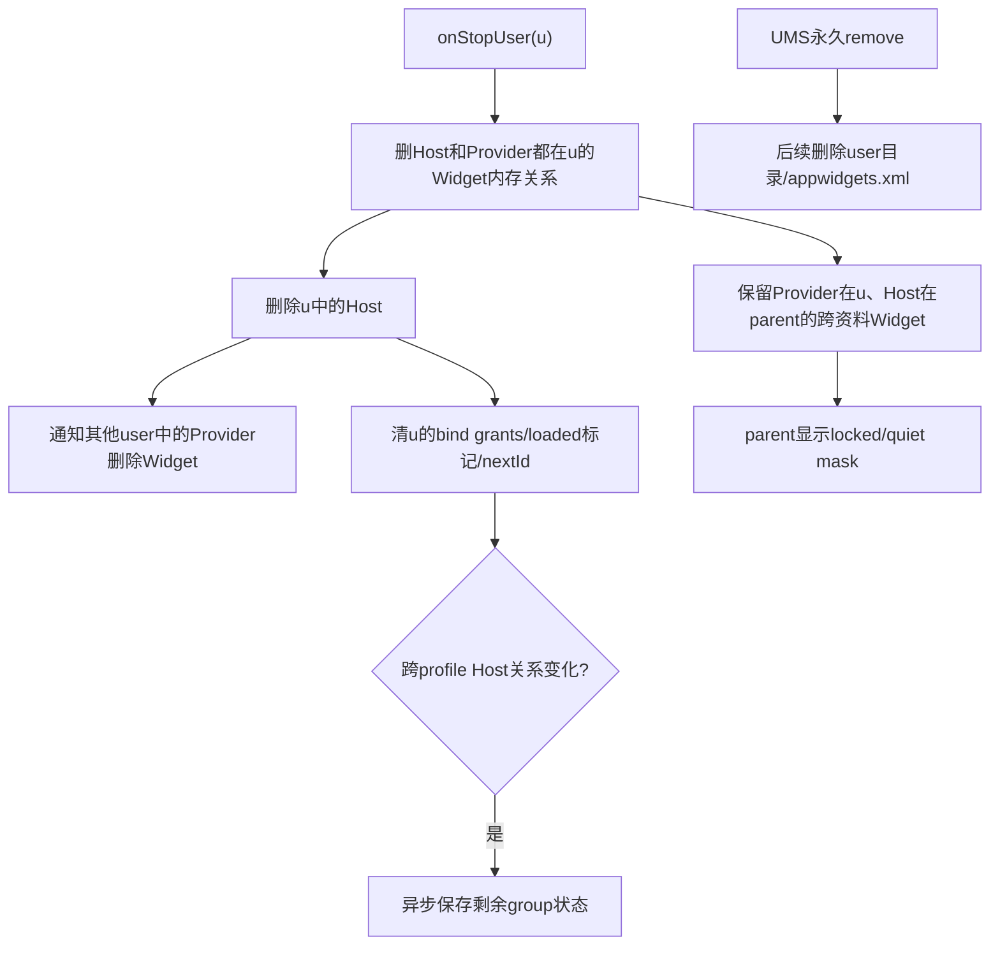

# 第 358 章 Android AppWidget 跨用户状态：加载、全局 Tag、AtomicFile、备份恢复与用户删除一致性链

> 源码基线：Android 11 / API 30 / `android-11.0.0_r48`。本章只在 macOS 上阅读源码，不编译。上一章发现跨资料Widget由两份政策/运行账共同维持，本章深入AppWidget自己的持久化：为何每user一个XML却必须整profile group加载、全局tag怎样跨文件引用、单文件Atomic为何仍挡不住跨文件代际错配，以及备份恢复为何刻意排除却又可能夹带跨user关系。

## 1. 内存中的四张表

AppWidgetService核心是 `mProviders`、`mHosts`、`mWidgets`和 `mPackagesWithBindWidgetPermission`。Provider代表声明组件，Host代表Launcher等宿主，Widget把appWidgetId、Host、可选Provider、options和RemoteViews关联起来。

## 2. ProviderId包含UID

ProviderId由完整uid和ComponentName组成；相同包/类安装在parent与profile会因user位不同成为两个Provider，跨user绑定不会把它们合并。

## 3. HostId也包含UID

HostId由uid、hostId和packageName组成。hostId只在某host包/uid命名空间内有意义，不是全设备唯一身份。

## 4. appWidgetId按user分配

`mNextAppWidgetIds`以userId保存下一个编号。Widget持久化在Host所属user文件，因此同一整数id可在不同user出现，必须连Host user解释。

## 5. 文件位置

每个user写 `/data/system/users/<userId>/appwidgets.xml`，源码用 `Environment.getUserSystemDirectory(userId)`构造。它是系统用户DE目录，不是provider app私有文件。

## 6. user0旧路径迁移

若新文件不存在且user0，`getSavedStateFile`尝试把旧 `/data/system/appwidgets.xml` rename到新路径。rename结果被忽略，失败后仍返回指向新文件的AtomicFile。

## 7. 单文件由AtomicFile保护

每个user独立 `AtomicFile.startWrite/finishWrite/failWrite`，写坏时尽量保留旧完整文件。它不让profile group多个文件一起commit。

## 8. 为什么必须按group理解

跨资料Widget的Host在parent文件、Provider在profile文件；Widget记录引用两边tag。只恢复某一个user文件，无法把hostTag与providerTag同时解析成对象。

## 9. 整体加载图

## 10. 加载是惰性的

服务启动不立刻读所有user文件；多数API在 `ensureGroupStateLoadedLocked(userId)`中首次装载。首次调用可能包含PMS扫描和多文件XML I/O，不能当纯Map查询。

## 11. 默认要求user unlocked

普通ensure先要求目标user running+unlocking/unlocked；若目标是parent仍锁定的managed profile也抛IllegalStateException。系统停止/保存路径可以显式关闭这项门。

## 12. group取enabled成员

SecurityPolicy先找group parent，再调用UserManager `getEnabledProfileIds(parent)`。disabled profile不进入本轮新成员数组，其旧文件也不会在这次一起读写。

## 13. mLoadedUserIds是装载闩锁

已存在user被替换成 `LOADED_PROFILE_ID=-1`并跳过；只有新成员继续。它记录“尝试纳入内存”，不是“XML已成功且完整验证”的证明。

## 14. 先标loaded再读盘

代码在扫描Provider和读XML之前就 `mLoadedUserIds.put(profileId,profileId)`。后续解析失败不会在同一错误路径把标记删除，普通后续ensure不会自动重试。

## 15. 新增profile可增量加载

若parent已加载，后来新profile enabled，只把新成员放进newProfileIds；现有内存Provider/Host/Widget保留。注释说loadGroupState只适合初始化且假设数据结构空，与这种增量调用之间需格外关注tag冲突。

## 16. 加载前清旧tag

`clearProvidersAndHostsTagsLocked()`把当前所有Provider/Host tag设为-1，再为新文件中的实体赋tag。tag是一次序列化/装载过程的临时编号，不是稳定数据库主键。

## 17. Provider先从PMS扫描

`loadGroupWidgetProvidersLocked(newProfileIds)`查询每user所有 `ACTION_APPWIDGET_UPDATE` receiver，排external storage、disabled和解析失败组件，先建立真实Provider对象。

## 18. 启动扫描不查DPM跨资料名单

所有enabled group provider都会入mProviders，DPM名单只在跨profile枚举/bind时查。旧XML的跨userWidget重连也没有名单复验，这是上一章的复活窗口根因。

## 19. XML根tag与version

正常文件根为 `<gs version="1">`，CURRENT_VERSION=1。缺失或坏version被NumberFormatException分支转为0，随后只执行keyguard Host迁移升级。

## 20. p记录Provider

Provider只保存pkg、class、全局tag和可选info_tag，不保存uid；加载按当前PMS重新解析canonical包名、uid、Receiver和AppWidgetProviderInfo。

## 21. Provider签名没有持久绑定

读代码留TODO询问是否检查与旧包相同签名。普通PMS安装规则提供一层保护，但AppWidget XML自身没有证书摘要证明组件代际连续。

## 22. Provider必须仍可解析

canonical package找不到、uid<0或ReceiverInfo缺失就continue。非safe mode下若预扫描也没建立Provider，后续无法用tag重连对应Widget。

## 23. safe mode zombie Provider

safe mode允许创建最小Provider占位并标zombie，避免第三方暂不可用时被永久裁掉；退出safe mode/包恢复后可reify。zombie不能接受新bind。

## 24. h记录Host

Host保存pkg、hostId和tag，uid按当前PMS查询。包不存在时Host标zombie，非safe mode直接不加入；safe mode保留UNKNOWN_UID占位。

## 25. b记录Host bind授权

`<b packageName>`表示该user中无需signature BIND_APPWIDGET的host包grant。加载只在包当前安装、uid>=0时恢复，不存在包的grant不会保留等待未来安装。

## 26. g记录Widget

保存appWidgetId、restoredId、hostTag、可选providerTag以及尺寸/category/restoreCompleted options。RemoteViews内容和PendingIntent不写入此XML。

## 27. 未绑定Widget没有p

Host已分配appWidgetId但尚未选择Provider时，g只有h。加载后providerTag=-1；bindLoaded当前发现provider null就continue，因而这种未绑定id不会重新加入内存Widget关系。

## 28. Widget先暂存不马上连接

读g时构造Widget和LoadedWidgetState，只记录hostTag/providerTag。必须等待所有user文件读完，才知道跨user另一侧实体是否已出现。

## 29. nextId在解析时推进

每个g调用 `setMinAppWidgetIdLocked(userId,id+1)`，即使后来tag无法绑定也可能推进counter，避免重新分配碰撞旧持久id，但会留下编号空洞。

## 30. bindLoaded按tag线性查找

先findProviderByTag，缺失直接跳过；再findHostByTag，缺失也跳过；都存在才把Widget加入两侧widgets列表和全局mWidgets。

## 31. tag不带user维度

find方法只比较整数tag，不再校验XML中期望的user。正确性依赖同一保存代际对整个内存全局表统一编号，及各user文件引用同一套编号。

## 32. 保存前统一编号

`tagProvidersAndHosts()`按当前全局ArrayList索引给所有Provider和Host编号；随后才循环enabled profile IDs逐文件写。这让跨user引用在同一完整保存轮次中可对齐。

## 33. Provider写到自身user文件

每个文件只serialize `provider.getUserId()==userId`且shouldBePersisted的Provider。shouldBePersisted要求有Widget或infoTag非空，未使用普通Provider通常不落盘。

## 34. Host写到自身user文件

Host不论widgets是否为空都会被写入，只要仍在mHosts；pruneHost会在无Widget且无callbacks时删除空Host，活跃callback Host可持久化。

## 35. Widget写到Host user文件

过滤条件是 `widget.host.getUserId()==userId`，不看Provider user。跨资料Widget因此只在parent Host文件写g，其中p指向profile文件里Provider的全局tag。

## 36. grant写到授权user文件

mPackagesWithBindWidgetPermission按Pair(userId,package)过滤写b。它与DPC跨profile provider名单完全不同，后者在DPMS XML。

## 37. 保存流程图

## 38. 多文件写是顺序best effort

每个profile逐个startWrite/finishWrite；某文件失败只log并继续下一文件，不回滚已成功文件。一次保存可以得到不同代际组合。

## 39. tag代际错配风险

若parent新文件成功、profile仍旧文件，parent g里的providerTag可能在旧profile文件指向另一个Provider或不存在。加载只按整数找，不比较g预期Component，因此存在误连/丢连风险。

## 40. AtomicFile解决不了跨文件引用

AtomicFile保证某一个XML旧或新完整，不保证互相引用的两文件同代。需要group journal、稳定复合ID或加载时Component/user复验才能解决跨文件一致性。

## 41. 保存异步且不合并

`saveGroupStateAsync`每次都post一个SaveStateRunnable到共享BackgroundThread，没有remove/去重。多个变化会排多次全量保存，执行时都写当时最新内存快照。

## 42. 返回不等耐久

bind/delete/policy listener通常在post后即返回；进程崩溃可丢最后变化。队列里旧Runnable不会写“旧捕获状态”，因为它执行时才持锁读当前表，但仍增加I/O次数。

## 43. SaveRunnable关闭unlock门

执行时调用 `ensureGroupStateLoadedLocked(mUserId,false)`，注释允许user正在stop或已remove。这样保存不会因锁屏状态抛错，但也可能对生命周期已变化的group重新装载文件。

## 44. removed user的异步竞态

Runnable排队后user被删除，UMS返回的enabled group和目录状态可能变化；代码没有generation token取消旧保存。最终文件目录通常由UserManager删除流程清理，但时序需实测。

## 45. 每次保存都重新取enabled group

发起时group成员与执行时可能不同。刚disabled的profile文件不会更新，旧内容留盘；重新enable后增量加载可能读旧代tag。

## 46. finishWrite的完成范围

只有当前user AtomicFile成功commit；没有fsync所有group目录后的统一完成通知。dumpsys内存正确也不能证明所有XML已同代。

## 47. 读循环的version变量

`loadGroupStateLocked`只有一个 `int version`，每读一个文件都用返回值覆盖；并未累积“任一失败”或验证各文件version一致。

## 48. 前失败可被后成功覆盖

profile A解析返回-1，profile B随后返回1，最终version=1，于是继续bind部分LoadedWidgetState；A已在异常前加入的Provider/Host/Widget临时项也可能部分留存。

## 49. 最后失败才触发全局clear

若循环最后一个文件返回-1，代码清mWidgets、mHosts和每个Provider.widgets。Provider对象本身仍保留，mPackagesWithBindWidgetPermission等状态也未在该else全部清空。

## 50. 文件不存在不改变version

openRead IOException只log，version保持上一个值；默认初值0。完全无文件会执行bind空列表和version0→1升级，而不是视为错误。

## 51. 文件顺序影响失败结果

profileIds顺序决定哪个parse结果最后覆盖。相同一组坏/好文件换顺序，可能部分加载或全clear，这不是理想的确定性恢复策略。

## 52. parse异常捕获范围

read捕获NPE、数字、XML、IO、越界并返回-1，比较宽；但异常前对mProviders/mHosts/grants和outLoadedWidgets的增量修改不回滚。

## 53. failed user仍标loaded

ensure在读盘前已标记所有newProfileIds。即使最后clear，mLoadedUserIds仍含它们；后续普通API看到newMemberCount=0，不会再次尝试修好的XML。

## 54. user stop才移除该loaded标记

`onUserStopped(userId)`删除对应mLoadedUserIds项；再次unlock/调用才可重载。仅替换文件或修复包不会自动重走整个group读取。

## 55. version升级只看最后结果

若各文件版本不同，performUpgrade只接收最后一个version；它目前仅迁移user0 keyguard Host，但结构设计仍没有逐文件upgrade记录。

## 56. CURRENT_VERSION不接受未来版本

performUpgrade最终若version不等1抛IllegalStateException。read对version>1并不先拒绝，异常可沿ensure调用栈传播，而不是安全保留未知数据。

## 57. Provider tag赋值前提

读p时从预扫描mProviders查对象；非safe mode下若对象为null，随后 `provider.tag=...`会NPE，被整文件catch为-1。注释continue路径没有覆盖这一对象缺失。

## 58. tag重复没有检测

XML可给两个Provider相同tag，find返回mProviders中第一个匹配者；Host同理。解析不维护seen集合或拒绝重复引用。

## 59. 跨文件安全审计重点

应验证tag存在、唯一、user/component期望、Host文件中的Widget确实只指允许group成员。r48主要依赖系统私有文件权限和正常写路径，不做强schema校验。

## 60. onUserStopped的第一轮清理

遍历mWidgets，若Host在停止user且Provider为空或也在该user，直接从全局/两侧列表摘除，不向即将被杀的Host/Provider发完整回调广播。

## 61. 跨user Widget分类处理

Host在停止user、Provider在别user时，第一轮不删；第二轮删除该user Host时通过deleteHostLocked正常通知另一profile Provider。Provider在停止user、Host在parent时则保留，供parent显示masked。

## 62. 为什么停止资料保留Provider

注释明确Host会显示masked Widget。停止不是删除，未来资料解锁要复用原appWidgetId/绑定，不应把父桌面布局永久清除。

## 63. 停止parent的效果

parent Host被删除，跨资料Provider失去Widget并收到deleted/可能disabled广播；parent停止后其Host内存状态需靠文件在下次启动恢复。

## 64. grants随stop从内存移除

停止user会删该user的host bind grants、loaded标记和nextId counter。文件通常仍在，重新加载可恢复b和根据Widget推进counter。

## 65. 仅cross-profile变化时安排保存

第二轮删除Host若其widgets非空才置crossProfileWidgetsChanged并post save。两端都在停止user的本地Widget直接drop，依赖原文件保留供下次恢复，不写“删除”。

## 66. onStop不是onRemove

SystemService只覆写 `onStopUser`，没有专门onUserRemoved回调。用户永久删除的目录/文件最终由UMS存储清理；AppWidget内存主要借stop路径摘除。

## 67. 删除parent时注释承认不保存

代码写“Nothing will be saved if the group parent was removed”。排队save用被删userId重新取group，结果可能无文件写；剩余profile稍后的用户删除/生命周期负责最终清账。

## 68. User stop/remove时序图

## 69. RemoteViews不持久化

重启加载只恢复关系/options；Provider在handleUserUnlocked时收到ENABLED/UPDATE重新提供视图。旧RemoteViews、maskedViews、PendingIntent和sequence状态不是XML恢复来源。

## 70. handleUserUnlocked初始化

确保group state、重载masked状态，再对属于解锁user且有Widget的Provider发ENABLE、UPDATE并注册周期更新。关系恢复和内容恢复是两个完成点。

## 71. 备份桥的作用

AppWidgetService在onStart向 `AppWidgetBackupBridge`注册WidgetBackupProvider，BackupManager按package请求参与者和byte[]状态，并通知restore start/state/finish。

## 72. backup格式独立

备份根是 `<ws version="2" pkg="...">`，不是直接复制appwidgets.xml。它只序列化与指定包相关的Provider/Host/Widget子图并重新编号tag。

## 73. participants先跳过跨user Widget

`getWidgetParticipants`遍历Widget，要求Host user==目标user且Provider为空或同user；跨资料Host/Provider分居两user时不把两包列为参与者。

## 74. packageNeeds预检同样排跨user

若指定包在该user没有任何同userWidget关系，getWidgetState返回null。只有跨资料Widget的Launcher/provider不会单独触发其Widget备份。

## 75. 预检通过后的序列化落差

一旦包因某个同userWidget通过预检，后续Provider、Host和Widget序列化循环没有再次调用 `isProviderAndHostInUser`。同包同时参与的跨userWidget可能被一起写进ws。

## 76. Provider选择可跨user

Provider若属于backedupPackage/user，或它被该user中的backedupPackage Host托管，就会写p；后一条件允许Provider实际位于另一个profile user。

## 77. Host选择也可能跨关联

Host若属于backedupPackage/user，或它正托管目标user中backedupPackage的Provider就会写h。选择围绕包关系，不是再次强制两端同user。

## 78. Widget循环缺少user过滤

只要Host是backedupPackage/user，或Provider是backedupPackage/user就serialize g。因此“participants跳过跨user”不能证明最终ws永不包含跨user关系。

## 79. 备份tag是局部ordinal

选中的Provider从0编号，Host也从0独立编号；g的p/h分别在各自列表索引空间解释。它与持久文件全局ArrayList tag不是同一代编号。

## 80. backup不保存RemoteViews

与常规XML一样只备份身份关系、id/options，不备份实时视图或Provider数据。应用自己的数据由其常规backup负责。

## 81. restoreStarting清临时账

新系统restore pass清mPrunedApps、按Provider/Host积累的ID remap通知。install-time restore之间可保留pruned集合，避免同包重复清理。

## 82. restore先验version和pkg

ws版本大于2或根pkg与调用packageName不等就return；finally仍无条件post saveGroupStateAsync，即使未恢复任何Widget。

## 83. restore Provider固定到当前user

读p时 `findProviderLocked(component,userId)`，找不到就创建UNKNOWN_UID zombie，但ProviderId的Component没有原user字段；注释写backup/restore只用于parent profile。

## 84. 夹带跨user关系可能被折叠

若ws因前述落差含资料Provider，restore会在当前restore user中查/建同名Component，而非重建原profile user身份，可能丢失或改变跨user拓扑。

## 85. Host缺包也建占位

getUidForPackage可返回负值，仍用该uid/hostId/pkg lookupOrAddHost；后续PACKAGE_ADDED可resolve Host UID。restore不要求所有应用已经安装。

## 86. oldId必须重新分配

每个新祖先Widget用 `incrementAndGetAppWidgetIdLocked(userId)`分配新id，restoredId保存旧id；Host/Provider稍后通过RESTORED广播得到old→new数组。

## 87. 去重键包含三元组

`findRestoredWidgetLocked`要求restoredId、HostId和ProviderId都相等；同一oldId在不同Host/Provider关系可分别存在。

## 88. prune意图

注释声称某包restore前要清它托管的所有Widget，以及其他Host中由它提供的Widget，再根据备份重建，避免当前状态与祖先状态叠加。

## 89. prune实现与注释不完全相符

判断使用 `host.hostsPackageForUser(pkg,userId)`，不是 `host.isInPackageForUser(pkg,userId)`；它问的是“这个Host是否托管名为pkg的Provider”，不能普遍识别“Host本身属于pkg”。

## 90. 可能保留旧Host Widget

当恢复Launcher包，而它托管的Provider都不是Launcher同名包时，hostsPackageForUser(launcherPkg)为false；provider也不是launcherPkg，旧Widget不会被prune，随后祖先Widget可能并存。

## 91. prune的provider空引用边界

一旦Host集合条件因另一Widget为true，循环中的未绑定Widget也可进入if，随后无null检查执行 `provider.widgets.remove(widget)`。含未绑定id的混合Host值得做NPE测试。

## 92. restore异常捕获较窄

外层只捕XmlPullParserException和IOException；坏数字、越界ordinal、NPE等RuntimeException不会在此catch转成安全失败，虽finally仍post保存，但异常可传播到backup流程。

## 93. restore不是事务

解析过程中边读边prune、创建占位和Widget；后面XML错误不会回滚前面修改。finally异步保存可能把部分恢复状态固化。

## 94. restoreFinished统一发ID映射

按Provider发送显式 `ACTION_APPWIDGET_RESTORED`，按Host包发送 `ACTION_APPWIDGET_HOST_RESTORED`，携oldIds/newIds；每条记录用notified避免同一controller内重复。

## 95. 未安装Host暂不通知

Host uid==UNKNOWN_UID时restoreFinished跳过；Package added后的其他路径需负责补通知。finish本身不保证所有参与应用都已收到映射。

## 96. Provider broadcast的目标user

restoreFinished统一构造 `UserHandle(userId)`发送；这再次体现restore模型假设关系在同一user，不能正确表达原跨资料Provider user。

## 97. backup不是跨设备工作资料迁移协议

公开企业工作资料创建/移除有独立政策与安全边界；WidgetBackupController刻意以owner profile同user关系为主，不能用它承诺跨profile UI投影会在新设备自动还原。

## 98. 恢复ID完成不等内容完成

RESTORED广播只让应用更新appWidgetId映射；Provider仍需按新id推RemoteViews，Host仍需重新attach callback。视觉恢复是后续过程。

## 99. 四种耐久层

应区分DPMS跨profile名单XML、AppWidget每user关系XML、Backup ws blob、Provider/Host应用自身backup数据。四者没有统一快照或commit顺序。

## 100. 排查重启错绑

记录parent/profile XML中p/h/g tag，核对同一整数对应Component/user，比较文件mtime和Atomic backup；若某轮只写一文件，重点怀疑跨代tag错配。

## 101. 排查解析后全空

看每个profile的读取顺序和最后一个read返回值，确认是否最后文件parse=-1触发clear；同时检查mLoadedUserIds是否已阻止重试。

## 102. 排查“部分组件还在”

前文件失败后后文件成功会覆盖version=-1，异常前加入对象也不回滚。分别dump Providers、Hosts、Widgets和grants，不要只看Widget数量。

## 103. 排查stop后桌面布局

区分Host/Provider同user的内存drop（文件保留）、Host停止导致跨profile关系删除/通知，以及Provider停止但parent Host保留并mask三类。

## 104. 排查restore重复Widget

比较mPrunedApps、prune判断中host.hostsPackageForUser与预期host.isInPackageForUser，查看同restoredId但Host/Provider不同的对象和restore调用包顺序。

## 105. 测试跨文件崩溃

让parent AtomicFile finish后、profile start/finish前中断，调整mProviders排序后重启；验证providerTag是丢失、误连还是安全拒绝，并检查当前源码没有Component交叉验证。

## 106. 测试文件顺序依赖

准备一个坏XML和一个好XML，交换profileIds顺序；断言一种可能部分bind、另一种clear。该测试直接证明单一version覆盖策略的非确定性。

## 107. 测试loaded闩锁

首次让XML解析失败，原地修复文件后再次ensure，确认不会重读；再触发onUserStopped清标记并unlock，验证何时真正恢复。

## 108. 测试backup跨user夹带

让同一Launcher包同时有同userWidget和资料Provider Widget；预检因此通过，再解析getWidgetState byte[]，检查ws是否包含跨user关系以及restore如何把Provider映射到userId。

## 109. 测试prune语义

Host包A托管Provider B和一个未绑定id，restore A；验证旧B Widget是否按注释被删、未绑定id是否触发provider null问题，以及祖先Widget是否重复。

## 110. 改进方向一：稳定引用

跨文件g应保存provider `(userId,package,class)`和Host稳定复合键，tag只作压缩索引并在加载时交叉验证；这样不同代文件至少不会静默连到错误对象。

## 111. 本章心智模型

AppWidget持久化是一张“按user分片、用本轮全局ordinal跨片连边”的图数据库：单片Atomic但整图不原子；加载又边解析边修改且用最后version决策。backup则另取包相关子图，预检和序列化过滤不完全一致。

## 112. macOS只读练习一：手算两个XML

构造parent Host H、profile Provider P和Widget G，再各加一个同user Widget；按tagProvidersAndHosts顺序写出两个appwidgets.xml的p/h/g，解释为何parent g能引用profile p，以及调换Provider数组顺序后的新tag。

## 113. macOS只读练习二：模拟坏文件顺序

逐行执行loadGroupStateLocked：先坏后好、先好后坏、一个不存在三种组合；记录version、outLoadedWidgets、mProviders/mHosts增量、最终bind/clear和mLoadedUserIds。

## 114. macOS只读练习三：画stop与remove矩阵

列Host/Provider分别在parent/profile/同user，停止parent、停止profile、永久删除profile三组场景；标内存关系、provider广播、Host callback、mask、异步save和user目录删除。

## 115. macOS只读练习四：审计backup子图

构造包A既有同userWidget又Host跨资料Provider B；从participants、packageNeeds、Provider/Host/Widget序列化到restore user映射逐步打勾，找出预检排除与实际ws夹带的落差。

## 116. 本章检查题

为什么每个AtomicFile成功仍可能错绑？为什么Widget写在Host文件？为什么前坏后好不一定clear？为什么“participants跳过跨user”不足以证明byte[]不含跨userWidget？

## 117. 复读修正一：tag不是稳定ID

tag由每次保存时全局ArrayList索引生成，跨user文件只在同一完整轮次内对齐；读取只按整数查且无user/component复验。文档已删除“AtomicFile保证整组一致”的误解。

## 118. 复读修正二：解析失败不是统一全有或全无

唯一version被每个文件覆盖，异常前对象不回滚，loaded标记又提前写入；所以结果取决于文件顺序，可部分加载、全clear且不自动重试。文档已按真实控制流分类。

## 119. 复读修正三：backup注释与序列化过滤不同

participants和预检确实跳过cross-user，但预检通过后实际p/h/g循环未重复该过滤；restore又按单user重建。另发现prune使用hostsPackageForUser而非Host自身包判断，故不能把注释中的替换语义当实现保证。

## 120. 本章结论与下一章

第358章完成AppWidget跨user关系的耐久与恢复审计：每user AtomicFile通过全局临时tag组成非原子图，加载用最后version且提前loaded造成部分态；stop保留可恢复资料投影，remove依赖更外层目录清理；backup子图还存在跨user过滤与prune落差。下一章深入AppWidget Provider发现与元数据解析：receiver资格、XML尺寸/category、updatePeriod、configure、resize、preview与包更新迁移链。
