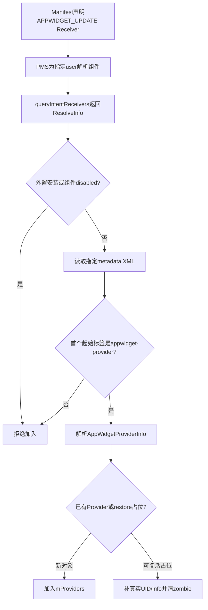
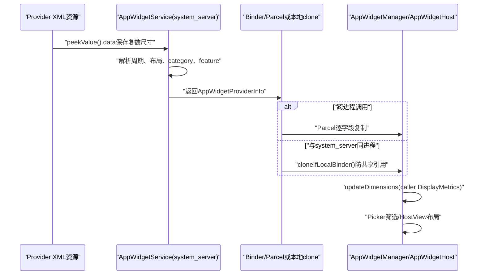
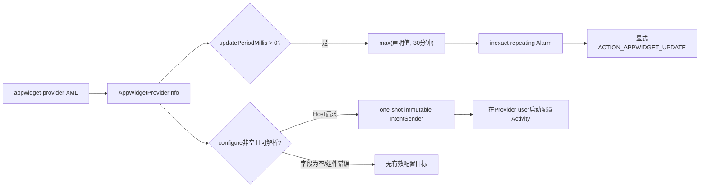

# 第 359 章 Android AppWidget Provider：发现、元数据解析、尺寸换算、周期调度与包更新迁移链

> 源码基线：Android 11 / API 30 / `android-11.0.0_r48`。本章继续采用 macOS 只读方式，不编译。上一章解决“Widget状态怎样落盘和跨用户重连”，本章回到Provider的出生与变化：系统如何从PMS发现Receiver，怎样把`appwidget-provider` XML解析成`AppWidgetProviderInfo`，四个尺寸为何先保留复数编码再由客户端换算，更新周期为何声明1分钟却至少30分钟，以及APK升级、备用metadata与本地Binder复制中有哪些容易忽略的一致性缺口。

## 1. 本章先回答什么

把一个桌面Widget写进XML并不等于系统一定承认它。Provider必须先作为能响应`ACTION_APPWIDGET_UPDATE`的Receiver被PMS解析，再通过AppWidgetService的二次资格过滤与metadata解析，最后才进入`mProviders`。本章跟踪这条“声明→发现→规范化→消费→刷新”链。

## 2. 三层对象不要混为一谈

第一层是APK中的Manifest与XML资源；第二层是`system_server`内保存的`AppWidgetProviderInfo`，尺寸仍可能是Android复数编码；第三层是Host进程收到并调用`updateDimensions()`后的对象。相同字段名在不同层的单位和生命周期并不完全相同。

## 3. 主入口文件

重点源码为`frameworks/base/services/appwidget/java/com/android/server/appwidget/AppWidgetServiceImpl.java`、`frameworks/base/core/java/android/appwidget/AppWidgetProviderInfo.java`、`AppWidgetManager.java`和`AppWidgetHost.java`。属性定义还要对照`frameworks/base/core/res/res/values/attrs.xml`。

## 4. Manifest是第一张索引

Provider组件本质上是一个`BroadcastReceiver`。它通过intent-filter声明接收`android.appwidget.action.APPWIDGET_UPDATE`，再用`<meta-data>`把键`android.appwidget.provider`指向XML资源；服务不是扫描所有XML文件，而是先按广播能力查询Receiver。

## 5. 一个最小声明模型

```xml
<receiver android:name=".WeatherWidget">
    <intent-filter>
        <action android:name="android.appwidget.action.APPWIDGET_UPDATE" />
    </intent-filter>
    <meta-data
        android:name="android.appwidget.provider"
        android:resource="@xml/weather_widget_info" />
</receiver>
```

这只是便于理解的骨架。最终是否可用还取决于组件/应用启用状态、安装位置、目标user、Direct Boot匹配、XML根节点及资源能否解析。

## 6. XML是第二张说明书

典型XML根节点为`<appwidget-provider>`，内部声明最小宽高、可缩放下限、初始布局、刷新周期、配置Activity、预览图、category和feature。它描述Provider能力，不保存任何具体`appWidgetId`或某个Host实例的状态。

## 7. 发现发生在group加载时

`loadGroupWidgetProvidersLocked(profileIds)`遍历启用的profile id，对每个user查询`ACTION_APPWIDGET_UPDATE` Receiver，汇总后逐个调用`addProviderLocked()`。因此同一包安装在parent与managed profile会得到不同uid、不同ProviderId。

## 8. 发现也发生在包变化时

首次group加载不是唯一入口。PACKAGE_ADDED、PACKAGE_CHANGED、外部应用可用、locale/config变化及显式provider-info切换，都可能重解析Provider。理解Widget元数据必须同时看“初次加入”和“在位更新”。

## 9. 发现不等于实例化Receiver

查询只拿到`ResolveInfo/ActivityInfo`，不会创建应用进程，也不会执行`AppWidgetProvider.onReceive()`。只有后续显式更新、启用、删除等广播到来时，AMS才按普通Receiver机制启动或复用目标进程。

## 10. Provider发现总图



## 11. queryIntentReceivers先清Binder身份

服务端用`Binder.clearCallingIdentity()`后调用PackageManager查询，最终在`finally`恢复身份。这样查询权限和user可见性以系统服务身份执行，而不是被某个Host调用者残留的uid左右。

## 12. GET_META_DATA不可缺

查询flags包含`PackageManager.GET_META_DATA`，否则`ActivityInfo.metaData`和后续`loadXmlMetaData()`所需信息可能不完整。AppWidget发现不是只确认组件名，还必须拿到XML资源映射。

## 13. MATCH_DEBUG_TRIAGED_MISSING的意图

源码注释说明：系统确实需要包已存在且完成解析才能知道它是否提供Widget，因此追加`MATCH_DEBUG_TRIAGED_MISSING`。这个内部flag服务于包缺失/解析诊断边界，不应理解成“允许不存在的Provider正常工作”。

## 14. Direct Boot双匹配是有条件的

若目标是“parent已解锁的profile”，查询同时加`MATCH_DIRECT_BOOT_AWARE`与`MATCH_DIRECT_BOOT_UNAWARE`。原因是非加密感知Host可能仍展示一个尚未解锁profile里的Widget；这只是让Provider记录可见，实际内容仍可能被锁定遮罩。

## 15. 普通user并非无条件双匹配

双flag只在`isProfileWithUnlockedParent(userId)`成立时追加。阅读时不要把它概括成“AppWidget总是忽略Direct Boot状态”；不同user、parent锁状态和服务加载时机仍会影响查询结果。

## 16. 共享库依赖也随查询返回

flags还包含`GET_SHARED_LIBRARY_FILES`。源码注释指出，引用共享库的Widget需要把依赖一起装载。它关系到Provider资源是否能正确构造，并非只是为了在选择器展示一个包名。

## 17. RemoteException退化为空列表

`queryIntentReceivers()`捕获`RemoteException`后返回`Collections.emptyList()`。这会让调用层表现成“没有Receiver”，不会在此处重试或把异常抛给Host；包更新路径随后甚至可能据此裁掉旧Provider。

## 18. addProviderLocked第一道过滤

若应用带`ApplicationInfo.FLAG_EXTERNAL_STORAGE`，直接返回false。AppWidget需要在启动早期与持久状态中稳定存在，Android 11这条实现不接受装在外部存储的Provider。

## 19. 第二道过滤是ActivityInfo启用态

初次添加还调用`ri.activityInfo.isEnabled()`。应用、组件或user级enabled override共同形成的解析结果为disabled时，不加入Provider集合。这里检查的是PMS给出的有效启用态，而非只读Manifest原始`android:enabled`。

## 20. 没有显式exported过滤

`addProviderLocked()`没有直接判断`activityInfo.exported`，也没有在这里强制Receiver声明某个权限。不要凭常见Manifest模板补出不存在的服务端条件；PMS查询和后续由系统发送的显式广播才是实际边界。

## 21. ProviderId为什么是uid加组件

`ProviderId`由完整uid与`ComponentName(package,class)`组成。同一组件名在两个user的Linux uid不同，因此不会碰撞；包升级若uid不变，可复用原Provider对象和其Widget关系。

## 22. metadata默认键

标准键是`AppWidgetManager.META_DATA_APPWIDGET_PROVIDER`，值为`android.appwidget.provider`。`parseProviderInfoXml()`通常用它读XML，但Android 11还支持Provider运行时切换到自定义metadata键。

## 23. infoTag是备用说明书指针

旧Provider若持有非空`infoTag`，包更新时先用该键解析；失败才回退标准键。这让应用可选择一套替代尺寸/布局描述，同时保证替代资源失效时仍有默认说明书可尝试。

## 24. infoTag与实际键有细微差别

API传`metadataKey == null`时实际解析标准键，但保存到`provider.infoTag`的仍是null。null表达“使用默认值”，而不是把标准键字符串持久化；相等判断也依赖这个语义。

## 25. loadXmlMetaData返回null即失败

指定键不存在、不是XML资源或不可加载时，parser可能为null。服务记录warning并返回null；初次发现会放弃该Provider，包更新则可能进入后面的裁剪逻辑。

## 26. try-with-resources关闭解析器

`XmlResourceParser`放在try-with-resources中，因此正常和受捕获异常路径都会close。这个资源生命周期比后面的`TypedArray`更稳健，因为TypedArray的`recycle()`没有放进finally。

## 27. 解析器先跳过空白和注释

循环持续`parser.next()`，直到首个`START_TAG`或文档结束。XML声明、空白、注释不影响结果；真正被检查的是遇到的第一个元素名称。

## 28. 根标签必须精确匹配

首个元素名不是`appwidget-provider`就返回null。代码没有搜索后续同名节点，也不接受自定义外层容器；把正确节点包在另一个根元素内同样失败。

## 29. 空文档的处理方式

若直接到`END_DOCUMENT`，随后`parser.getName()`不会等于目标字符串，因此同样返回null。它不会创建一份全默认字段的ProviderInfo。

## 30. 先写身份字段

新建`AppWidgetProviderInfo`后先写`provider=providerId.componentName`与`providerInfo=activityInfo`。前者是广播目的组件，后者保留Receiver/ApplicationInfo，供profile、label、icon和资源加载使用。

## 31. 资源必须来自Provider应用

系统先按Provider uid取userId，再用`getApplicationInfoAsUser(package,0,userId)`获得目标user应用，之后`getResourcesForApplication(app)`。不能用`system_server`自己的Resources解释第三方包资源id。

## 32. 获取资源时也清身份

这段PackageManager访问再次清除Binder调用身份并在finally恢复。尤其跨profile场景，目标资源属于Provider user，不能让Host user的普通调用身份决定能否加载。

## 33. obtainAttributes完成主题化取值

`resources.obtainAttributes(attrs, R.styleable.AppWidgetProviderInfo)`把XML属性映射到framework styleable索引。这里用Provider Resources解析引用、整数和字符串，是字段进入服务端对象的集中位置。

## 34. minWidth/minHeight格式定义并不对称地显式

`attrs.xml`中`minResizeWidth/minResizeHeight`明确写`format="dimension"`，而`minWidth/minHeight`仅引用同名attr，没有在这段重复format。最终attr定义与aapt校验仍需顺着全局声明看，不能只截这几行断言必填性。

## 35. parser并未强制四个尺寸必填

服务端使用`peekValue()`；`minWidth/minHeight`缺失就写0，resize下限缺失则分别回退minWidth/minHeight。即使开发文档把某字段视为应提供，实现这里也没有“缺失即拒绝”的判断。

## 36. 为什么不用getDimensionPixelSize

服务端不应该按`system_server`显示环境提前把Provider尺寸定死。它取`TypedValue.data`，保存单位、尾数等复数编码，留给真正使用它的Host/Manager按自身`DisplayMetrics`转换。

## 37. 原始data不是普通dp整数

例如XML的`110dp`进入`info.minWidth`时，在服务端并不保证等于十进制110。它是`TYPE_DIMENSION`的complex data；若在dump或调试器中直接当像素/厘米解释，会得到怪异数值。

## 38. resize缺省继承基础尺寸

`minResizeWidth`缺失就取原始`minWidth` data，`minResizeHeight`缺失就取`minHeight` data。继承发生在单位转换前，因此同一份编码随后按相同metrics换算，避免跨层先舍入一次。

## 39. updatePeriodMillis只读整数

解析使用`getInt(...,0)`，0表示不注册框架周期更新。它不是“一次也不更新”：新增实例、开机、包升级或应用自己的Job/Alarm仍可触发RemoteViews更新。

## 40. initialLayout缺省是0

`getResourceId(initialLayout,0)`没有在解析阶段校验资源一定是布局。0会继续存入ProviderInfo，真正创建HostView或加载RemoteViews时才可能暴露错误；因此“被发现”不等于“能正常渲染”。

## 41. initialKeyguardLayout也是可缺省

该字段缺失时为0。Android 11仍保留keyguard category和初始锁屏布局字段，但具体Host是否支持、是否使用它是另一层策略，Provider声明不强迫设备锁屏接受。

## 42. configure先按字符串拼组件

`configure`属性读成字符串后，代码用Provider包名与该字符串构造`ComponentName`。解析阶段不查询这个Activity是否存在、是否enabled、是否exported；所以XML解析成功不代表配置页一定可启动。

## 43. configure类名的包归属被固定

无论字符串写什么，组件package都取Provider组件的package。这表达配置Activity应在同一APK；若类名拼错，将留下一个不可解析的显式组件，而不是自动跨包查找。

## 44. label取的是Receiver标签

代码调用`activityInfo.loadLabel(pm).toString()`，不是读取appwidget-provider XML里的label属性。选择器显示文本可来自Receiver label或应用label回退，之后公开`loadLabel()`还会trim。

## 45. label空值有潜在例外

若`loadLabel()`异常地返回null，这里的直接`toString()`会抛`NullPointerException`。catch只列出IOException、NameNotFoundException和XmlPullParserException，因此这个运行时异常不会按注释所说统一退化成null。

## 46. icon也来自Receiver

`info.icon=activityInfo.getIconResource()`。实际`loadIcon()`若资源加载失败可回退`providerInfo.loadIcon(pm)`；字段保存的是资源id，不是在服务端提前解码出的Drawable。

## 47. previewImage是可选资源id

缺失时为0，`loadPreviewImage()`调用通用loadDrawable但不允许默认icon回退，加载失败返回null。Host/Picker可自行决定用Provider icon或占位图，服务不会替它合成预览。

## 48. autoAdvanceViewId缺省为-1

这是一个视图资源id，指示Host可自动推进的子View。-1代表无目标；它只是Host提示，不能保证某个Launcher会执行自动翻页。

## 49. resizeMode是位标志

0为none、1为horizontal、2为vertical，两者可按位或成3。声明resizeMode并不会修改`minWidth`；Host同时参考默认尺寸、resize下限、网格和自身政策决定可拖动范围。

## 50. widgetCategory也是位标志

home_screen=1、keyguard=2、searchbox=4，可组合。缺省为HOME_SCREEN而非0，这保证未声明category的传统Widget仍可进入桌面Provider列表。

## 51. category筛选采用交集

服务端列举Provider时判断`(info.widgetCategory & categoryFilter) != 0`。请求过滤值和声明值只要有任意共同位就通过，不要求两者完全相等，也不要求Provider覆盖过滤器的所有位。

## 52. widgetFeatures是Host提示

Android 11定义reconfigurable=1与hide_from_picker=2。attrs注释明确说这些是给Host的hints，不会自动改变行为；例如可重新配置仍需真实configure Activity和Host主动提供入口。

## 53. 元数据到Host的三阶段



## 54. TypedArray正常路径会recycle

所有字段读取完后调用`sa.recycle()`。但它不在finally中；一旦`loadLabel().toString()`或其它未捕获运行时操作在中途失败，TypedArray可能未回收到池。这是健壮性问题，不应误说成每次解析都泄漏Java堆对象。

## 55. catch范围与注释不一致

注释说客户端传入导致的任何错误都不应让system进程致命，但代码仅捕获三种checked exception。`Resources.NotFoundException`、类型不符导致的运行时异常或NPE仍可能外溢；审计时应以catch列表为准。

## 56. parse失败的初次结果

`parseProviderInfoXml()`拿不到有效info就返回null，`addProviderLocked()`也返回false，不加入`mProviders`。这不是zombie占位；zombie主要服务于safe mode或恢复时尚不知道真实uid的对象。

## 57. 恢复占位可以原地复活

若按真实ProviderId没找到，添加逻辑还用`UNKNOWN_UID+ComponentName`查找恢复占位。现有对象是zombie且当前非safe mode时，会补真实id、清zombie并替换info，保留此前恢复建立的关系。

## 58. 非zombie已有对象不会在add中覆盖

初次扫描如果找到已存在且非zombie对象，`addProviderLocked()`不会把新解析info赋回去。正常包升级需要走`updateProvidersForPackageLocked()`；这说明同名方法“add”并不承担完整refresh职责。

## 59. Provider进入集合仍没有实例

`mProviders.add(provider)`只登记可选组件。只有Host分配id并绑定后，`provider.widgets`才非空；周期Alarm、ENABLED和UPDATE等行为也依赖是否出现首个实例。

## 60. 尺寸转换由客户端触发

`AppWidgetManager.getInstalledProvidersForProfile()`遍历返回列表并调用`info.updateDimensions(mDisplayMetrics)`；`getAppWidgetInfo()`也如此。Provider变化回调则在`AppWidgetHost.onProviderChanged()`中调用同一方法。

## 61. mDisplayMetrics来自调用Context

`AppWidgetManager`构造时保存`context.getResources().getDisplayMetrics()`。因此转换依赖Host/调用方的资源配置，而不是Provider APK或服务端进程当前屏幕环境。

## 62. updateDimensions改写原对象

方法直接覆盖四个int字段，没有“已转换”标志。对同一个对象调用两次会把第一次得到的普通像素整数再次当complex data解码，结果错误；框架依赖每份服务端原始对象只在消费边界转换一次。

## 63. 注释写dp，函数返回pixel size

Android 11源码注释写“Converting complex to dp”，公开字段文档也说dp，但实际调用`TypedValue.complexToDimensionPixelSize()`，其契约明确返回pixels。这里存在文档/注释与可执行代码的张力，分析单位时应以函数实现和调用者布局语境为准。

## 64. 不能把服务端dump与客户端值直接对比

服务端dump若输出转换前data，Host调试器看到的是转换后整数；两者数值不同不必然说明包更新失败。先确认对象是否已经越过`updateDimensions()`边界，再比较同一单位。

## 65. Parcel路径逐字段正确

`writeToParcel()`按minWidth、minHeight、minResizeWidth、minResizeHeight写入，Parcel构造器以相同顺序读出。正常第三方Launcher跨进程调用时，四个尺寸不会因Parcel本身互换。

## 66. 本地Binder为什么仍要复制

若`Binder.getCallingPid()==Process.myPid()`，返回同一个ProviderInfo会让调用者的`updateDimensions()`直接污染服务端缓存。因此`cloneIfLocalBinder()`先clone，模拟跨进程Parcel天然提供的对象隔离。

## 67. r48 clone存在宽度错拷

源码写成`that.minResizeWidth = this.minResizeHeight;`，而正确直觉应为`this.minResizeWidth`。所以当宽高下限不相等，本地Binder副本会在转换前把最小可缩放宽度改成高度。

## 68. 这个缺陷的影响范围

它影响调用者与AppWidgetService同PID的`getAppWidgetInfo()`、Provider列表和相关本地复制路径；普通应用跨进程走Parcel时不触发该clone分支。不能概括成“所有Android 11 Launcher都会丢失minResizeWidth”。

## 69. 这是源码审阅的好例子

只看字段注释会认为宽高均正常；只看Parcel也会得出正确结论；必须继续追到服务端为本地Binder做的防御复制，才发现分支特有错误。真实调用链往往比单个类更能决定Bug是否可见。

## 70. 周期注册只在值大于0

`registerForBroadcastsLocked()`首先判断`provider.info.updatePeriodMillis > 0`。负值与0都不建PendingIntent和Alarm；服务也不会把负值纠正为30分钟。

## 71. 一个Provider只有一份周期PendingIntent

Alarm对应Provider而非每个Widget实例，Intent extra携带该Provider当前所有`appWidgetIds`。五个实例不是五个独立定时器；Provider一次`onUpdate()`可批量刷新。

## 72. PendingIntent运行在Provider user

使用`PendingIntent.getBroadcastAsUser(..., provider.info.getProfile())`创建，并把Intent显式指向Provider组件。这保证跨资料Host绑定的更新广播仍送到Provider所属user。

## 73. requestCode固定但组件参与身份

requestCode为1，Intent component不同仍可区分Provider PendingIntent。`FLAG_UPDATE_CURRENT`允许已有等价PendingIntent更新`EXTRA_APPWIDGET_IDS`，避免新增/删除实例后Alarm仍携带旧数组。

## 74. alreadyRegistered是调度闩锁

进入方法先看`provider.broadcast != null`。无论这次`getBroadcastAsUser()`是否更新extras，只有此前未注册才真正调用AlarmManager设置重复Alarm，避免每绑定一个实例就重排首次触发。

## 75. Android 11生产下限是30分钟

常量`MIN_UPDATE_PERIOD = DEBUG ? 0 : 30*60*1000`。非DEBUG系统取`Math.max(declared,MIN_UPDATE_PERIOD)`；XML写60000毫秒仍按至少30分钟调度。

## 76. ProviderInfo保留声明值

下限只用于计算Alarm period，并没有回写`provider.info.updatePeriodMillis`。因此API/日志可能仍显示60000，而Alarm实际为1800000；“元数据值”和“生效调度值”必须分开观察。

## 77. 首次触发不是立即执行

触发时间为`elapsedRealtime()+period`。实例绑定过程中另有显式UPDATE广播负责首次内容；周期Alarm从一个完整period之后开始，而不是用0延迟代替初次更新。

## 78. 使用elapsed realtime wakeup

Alarm类型为`ELAPSED_REALTIME_WAKEUP`，基于开机后经过时间，不受用户修改墙上时钟直接影响；到期可唤醒设备。但它仍受AlarmManager整体节能、批处理和系统状态影响。

## 79. 重复Alarm是不精确的

调用`setInexactRepeating()`，系统可合并唤醒以省电。30分钟是请求周期下限，不是承诺每次精确到某一毫秒；Widget不应把它当严格计时器或业务交易时钟。

## 80. Alarm设置被post到锁外

源码先在锁内固定“首次注册”与PendingIntent，再把`AlarmManager.setInexactRepeating()`post到`mSaveStateHandler`。注释强调在锁外设置；这降低持有`mLock`时跨服务调用的风险。

## 81. post也带来短暂时间窗

`provider.broadcast`已经非空但Alarm任务尚未执行时，状态看似注册完成。若极端情况下随后取消/包变化与异步任务交错，需要结合Handler顺序和cancel路径判断，而不能把字段非空等同于AlarmManager已落地。

## 82. 包更新会重排周期

若Provider已有实例且元数据重解析成功，代码先`cancelBroadcastsLocked()`再`registerForBroadcastsLocked()`。即使周期没变也重新从现在加period，源码注释明确接受这一行为，因为紧接着会发送一次UPDATE。

## 83. 0变正与正变0都被覆盖

取消旧广播后按新info注册：从0改成正数会新建Alarm；从正数改成0则只取消、不重建。这是包更新让XML周期生效的真正路径。

## 84. 周期更新不是唯一更新源

新增实例、包替换、系统恢复、Host选项改变和应用主动调用`updateAppWidget()`都有自己的链。排查“为什么30分钟内收到两次UPDATE”时，必须先识别广播来源，而不是立即判定Alarm重复。

## 85. configure IntentSender先验证Widget访问权

Host调用`createAppWidgetConfigIntentSender()`时，服务校验callingPackage属于调用uid，再用`lookupWidgetLocked()`确保调用者能访问该id。无效id与尚未绑定Provider分别抛不同`IllegalArgumentException`。

## 86. Intent flags会剥离不可变系统位

服务计算`secureFlags = intentFlags & ~Intent.IMMUTABLE_FLAGS`，不让调用者注入某些不可修改的内部flag。随后由系统创建one-shot、immutable、cancel-current的Activity PendingIntent。

## 87. 配置页在Provider user启动

`PendingIntent.getActivityAsUser()`目标user是`provider.getUserId()`，Intent携带`EXTRA_APPWIDGET_ID`并显式setComponent到`info.configure`。跨profile Host不能把配置Activity偷换到Host user。

## 88. 周期与配置两条消费链



## 89. configure为空时服务端没有显式拒绝

方法没有先判断`provider.info.configure == null`，而是直接`intent.setComponent(null)`。这会让Intent失去显式组件；框架API的正常使用应只在Provider声明配置页时请求，审计定制Host时需确认它先判空，避免产生意外隐式解析或启动失败。

## 90. Package广播是刷新触发器

AppWidgetService的包接收器解析added、changed、removed、external available等事件。added/changed走`updateProvidersForPackageLocked()`，永久removed走Host/Provider删除；替换安装的remove阶段通常等后续add再统一更新。

## 91. 更新查询被限定到包

方法构造`ACTION_APPWIDGET_UPDATE`并`intent.setPackage(packageName)`，只枚举该包在指定user的候选Receiver。仍通过统一`queryIntentReceivers()`拿metadata、Direct Boot和共享库flags。

## 92. keep集合决定谁存活

更新方法创建`HashSet<ProviderId> keep`。本轮成功识别的新Provider或成功重解析的旧Provider进入keep；扫描结束后，该包/user下不在keep的所有旧Provider被删除。

## 93. 更新路径只显式拒绝外置安装

与`addProviderLocked()`相比，外层更新循环先拒绝external storage，却没有同样显式调用`activityInfo.isEnabled()`；不过新增候选仍经`addProviderLocked()`二次检查。已有对象怎样出现在查询结果中，主要由PMS解析结果决定。

## 94. 旧Provider成功时原地换info

找到相同ProviderId并解析成功后，代码把`provider.info=parsed.info`，保留Provider对象、widgets集合、tag等关系。这样APK升级无需重新分配appWidgetId或让Host重新绑定。

## 95. 活跃实例会清RemoteViews缓存

成功更新且`provider.widgets.size()>0`时，每个`widget.views`被设为null，再调度`providerChanged`回调。Host应据新info重置视图，不能继续假设旧RemoteViews布局与新元数据兼容。

## 96. Host先获知Provider变化

`scheduleNotifyProviderChangedLocked(widget)`通过Host callback传新ProviderInfo，`AppWidgetHost.onProviderChanged()`先换算尺寸再`resetAppWidget()`。这是Host侧重新创建默认视图/布局语义的重要信号。

## 97. 随后再向Provider发UPDATE

循环通知Host后，服务调用`sendUpdateIntentLocked(provider, appWidgetIds)`。Provider应用应为现有实例提交一份适配新APK的RemoteViews；这解释了包升级后短暂默认/空内容窗口。

## 98. 解析失败会从keep缺席

已有Provider的`parseProviderInfoXml()`返回null时不会`keep.add(providerId)`。扫描后的prune会删除它及其Widget关系；这不是“保留旧的最后已知良好元数据”。

## 99. providersUpdated仍会置true

已有Provider分支无论解析成功与否，末尾都把`providersUpdated=true`。它表示这次包刷新涉及Provider并可能需要保存/通知，不严格等价于“新info成功安装”。

## 100. 查询暂时失败也可能表现为删除

若统一查询因RemoteException退化为空列表，keep为空，后续会裁掉该包/user的旧Provider。这里缺少“查询失败”和“确实无Receiver”的独立状态；这是错误退化与破坏性刷新耦合的审计点。

## 101. 删除Provider会连带删除Widget

`deleteProviderLocked()`取消周期广播、删除该Provider关联的Widget并从`mProviders`移除。它不是只从Picker隐藏；Host与Provider的运行关系也会解除并进入相应通知/清理流程。

## 102. 包永久删除还清Host

`removeHostsAndProvidersForPackageLocked(package,user)`先删Provider，再删除同包同user的Host。因为相关Widget已被处理，注释说明无需再担心向已消失Provider发送DISABLE。

## 103. locale变化也要重解析label

配置变化若包含locale，服务复制已安装Provider列表再逐包刷新。之所以先copy，是`updateProvidersForPackageLocked()`可能删除Provider，直接遍历原列表会发生索引和漏项问题。

## 104. locked user会被跳过

locale刷新时会避开尚未unlock的user或parent锁定的profile。资源标签在解锁/后续加载阶段再恢复；不能因为系统语言变化就无条件读取所有加密profile资源。

## 105. 显式updateAppWidgetProviderInfo的调用权

应用调用该API时，服务先确认组件package属于调用uid，再以`Binder.getCallingUid()+ComponentName`查Provider。应用只能切换自己的Provider元数据，不能替另一个包改Picker尺寸或配置入口。

## 106. 相同infoTag会直接no-op

`Objects.equals(provider.infoTag, metadataKey)`成立就返回，连XML内容是否在原资源id下变化都不重读。因此“同一个metadata键的资源内容刚被动态覆盖”并不是这个API可观察的常规模型；APK更新会走包刷新。

## 107. 自定义键解析失败抛给调用者

显式API与后台包扫描不同：无效键或XML返回null时抛`IllegalArgumentException`，不会悄悄回退标准键。回退逻辑存在于`parseProviderInfoXml(oldProvider)`的包更新路径。

## 108. 切换info不会重置widget.views

显式API替换info后，为每个Widget调度providerChanged，再用现有`widget.views`调用完整`updateAppWidgetInstanceLocked()`。这与包升级路径先置views=null不同，意图是只切换描述配置时继续展示当前内容。

## 109. infoTag需要持久化

更新完成后`saveGroupStateAsync(userId)`，Provider记录会保存非默认infoTag；服务重启后才能继续先用该备用键。若只改内存而不落盘，下次加载会错误回到默认说明书。

## 110. Provider列表通知覆盖整个group

显式切换末尾调用`scheduleNotifyGroupHostsForProvidersChangedLocked(userId)`。同profile group中的Host会获知可用Provider描述变化，Picker缓存不应只更新发起调用的那个应用进程。

## 111. 一条可复用的排错顺序

先确认PMS能否按目标user查询到Receiver，再看external/enabled过滤；然后验证metadata键、根标签与资源user；再区分服务端complex尺寸和客户端转换值；最后检查Alarm的实际下限、Host回调与包刷新keep/prune。按层定位比只盯`onUpdate()`有效。

## 112. macOS只读练习一：还原发现资格

在源码根目录执行`rg -n "loadGroupWidgetProvidersLocked|queryIntentReceivers|addProviderLocked" frameworks/base/services/appwidget/java/com/android/server/appwidget/AppWidgetServiceImpl.java`，按调用顺序写出查询flags、external/enabled过滤、ProviderId构造和metadata解析四步；只阅读，不执行编译或改动源码。

## 113. macOS只读练习二：建立字段表

对照`parseAppWidgetProviderInfo()`与`frameworks/base/core/res/res/values/attrs.xml`，手工列出四列：XML属性、服务端缺省值、是否保留资源id/complex data、最终消费者。重点核对resize缺省继承、category默认HOME_SCREEN与autoAdvance默认-1。

## 114. macOS只读练习三：验证单位与复制分叉

用`rg -n "updateDimensions|cloneIfLocalBinder|minResizeWidth" frameworks/base/core/java/android/appwidget frameworks/base/services/appwidget/java/com/android/server/appwidget/AppWidgetServiceImpl.java`追踪跨进程Parcel和同进程clone两条路，解释为什么前者宽度正确、后者在r48可能把最小宽度变成最小高度；不要运行设备或模拟器。

## 115. macOS只读练习四：推演一次失败升级

静态阅读`updateProvidersForPackageLocked()`，假设旧Provider有两个Widget，而新APK保留Receiver却把XML根标签写错。画出parse返回null→不进keep→prune→deleteProvider的状态变化，并标出这与“继续保留旧info”的直觉为何不同。

## 116. 复读修正一：不是所有Receiver都要求exported=true

初稿最容易套用“隐式广播Receiver必须exported”的笼统规则；复读确认AppWidgetService本身没有这一显式资格判断，且实际更新为系统发出的显式组件广播。因此本章只陈述源码边界，不把Manifest经验写成服务端硬条件。

## 117. 复读修正二：所谓dp转换实际返回像素

继续追到`TypedValue.complexToDimensionPixelSize()`后，确认返回值契约为pixel size。于是正文把源码注释与执行事实并列，而没有重复“字段最终一定是纯dp整数”的不准确说法；同时提醒同一对象不可二次转换。

## 118. 复读修正三：clone缺陷不是全局缺陷

复核Parcel构造与`writeToParcel()`后，四字段顺序一致；错误只来自`cloneIfLocalBinder()`触发的`AppWidgetProviderInfo.clone()`。正文因此限定到同PID调用，不把影响夸大到所有跨进程Host。

## 119. 本章心智模型

Provider不是“一个XML文件”，而是一条受user、PMS查询、组件状态、资源解析、Binder复制、Host metrics和包生命周期共同约束的缓存记录。声明值可以被缺省、换算、周期下限和Host政策再次解释，失败刷新还可能删除旧关系。

## 120. 下一章入口

ProviderInfo只说明“Widget能长什么样”，真正绑定还要解决appWidgetId由谁分配、Host凭什么绑定、跨profile怎样授权、options何时初始化，以及ENABLED/UPDATE/DELETED/DISABLED广播的先后。下一章沿分配与绑定事务继续追踪完整实例生命周期。
