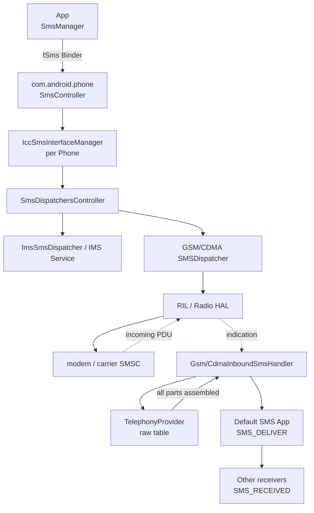
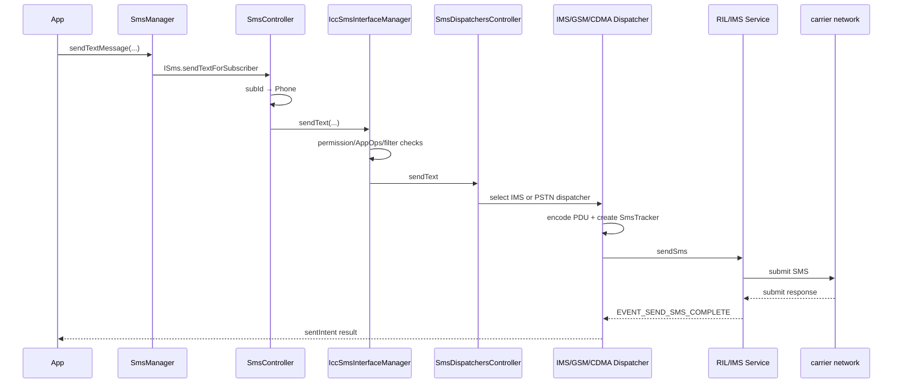
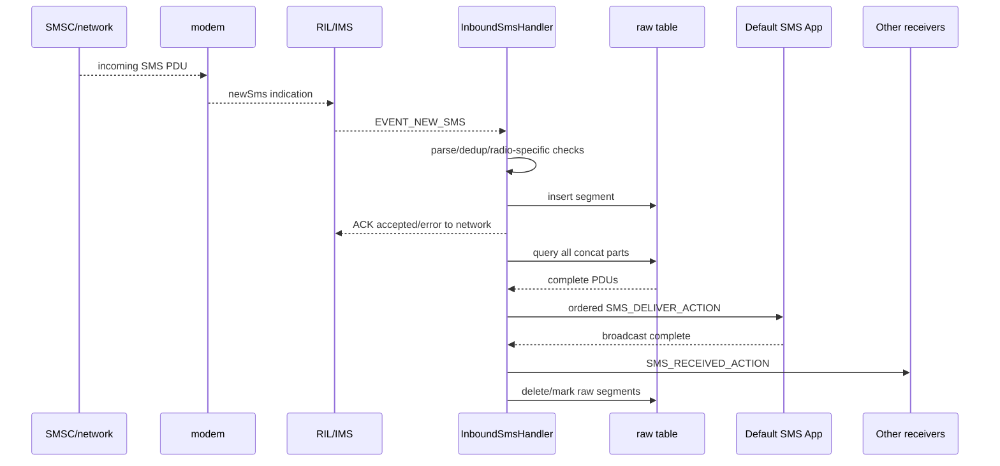

# 36 Android 短信系统、SmsManager 与 InboundSmsHandler

> 源码版本：Android 11 / API 30 / `android-11.0.0_r48`  
> 学习方式：macOS 只读源码，不要求编译  
> 前置章节：[16 Broadcast](./16-Broadcast广播注册与分发.md)、[22 存储与数据库](./22-Android存储文件系统与数据持久化.md)、[34 Telephony 与 RIL](./34-Android电话系统TelephonyFramework与RIL.md)

短信看起来只是“发送一段文字”，实际包含字符编码、分段、订阅选择、发送权限和限额、CS/IMS 路由、RIL 异步响应、状态报告、入站 PDU、重复检测、分片持久化、WAP Push、默认短信应用、受保护广播和数据库写入。

本章把两条主线彻底分开：

```text
发送：App → SmsManager → Telephony → IMS/RIL → 网络
接收：网络/modem → RIL → InboundSmsHandler → raw 表 → 默认短信 App
```

---

## 1. 总体架构



---

## 2. 关键进程

- 发送 App、sent/delivery PendingIntent receiver：App 进程。
- `SmsController`、Dispatcher、InboundSmsHandler：`com.android.phone`。
- Radio HAL：vendor service 进程。
- modem/baseband：独立固件/处理器。
- TelephonyProvider：系统 provider 进程配置决定，负责 SMS/MMS 数据库。
- 默认短信应用：其自身进程。

短信 PDU 不会从 modem 直接广播给所有 App；Telephony 先完成协议和安全处理。

---

## 3. 核心源码入口

```text
frameworks/base/telephony/java/android/telephony/SmsManager.java
frameworks/base/telephony/java/android/telephony/SmsMessage.java
frameworks/base/telephony/java/com/android/internal/telephony/ISmsImplBase.java

frameworks/opt/telephony/src/java/com/android/internal/telephony/SmsController.java
frameworks/opt/telephony/src/java/com/android/internal/telephony/IccSmsInterfaceManager.java
frameworks/opt/telephony/src/java/com/android/internal/telephony/SmsDispatchersController.java
frameworks/opt/telephony/src/java/com/android/internal/telephony/SMSDispatcher.java
frameworks/opt/telephony/src/java/com/android/internal/telephony/ImsSmsDispatcher.java
frameworks/opt/telephony/src/java/com/android/internal/telephony/gsm/GsmSMSDispatcher.java
frameworks/opt/telephony/src/java/com/android/internal/telephony/cdma/CdmaSMSDispatcher.java

frameworks/opt/telephony/src/java/com/android/internal/telephony/InboundSmsHandler.java
frameworks/opt/telephony/src/java/com/android/internal/telephony/gsm/GsmInboundSmsHandler.java
frameworks/opt/telephony/src/java/com/android/internal/telephony/cdma/CdmaInboundSmsHandler.java
frameworks/opt/telephony/src/java/com/android/internal/telephony/InboundSmsTracker.java
frameworks/opt/telephony/src/java/com/android/internal/telephony/WapPushOverSms.java

packages/providers/TelephonyProvider/src/com/android/providers/telephony/SmsProvider.java
packages/providers/TelephonyProvider/src/com/android/providers/telephony/MmsSmsDatabaseHelper.java
```

---

## 4. SMS、MMS、RCS 不一样

| 类型 | 主要承载 | 特点 |
|---|---|---|
| SMS | 蜂窝短信信令或 IMS SMS | 短文本/二进制 TPDU，可能分段 |
| MMS | WAP Push 通知 + HTTP 下载上传 | 图片、音视频、长内容，使用移动数据/网络 |
| RCS | IMS/IP 消息服务 | 聊天、回执、媒体等，运营商与客户端实现相关 |

“短信 App”可以同时展示三者，但底层协议和源码路径不同。本章主讲 SMS，并说明 WAP Push 如何引出 MMS。

---

## 5. PDU、TPDU 与短信内容

PDU 是协议数据单元，包含的不只是正文：

- 服务中心信息。
- originating/destination address。
- protocol identifier。
- data coding scheme。
- timestamp。
- user data header。
- user data。
- status report flags 等。

`SmsMessage` 负责把 GSM/CDMA 格式解析成统一 API 对象。不能把收到的 byte[] 直接当 UTF-8 字符串。

---

## 6. GSM 7-bit、8-bit、UCS-2

常见编码：

- GSM 7-bit default alphabet：英文等字符效率高。
- 8-bit data：二进制/端口短信等。
- UCS-2：中文和无法用 GSM alphabet 表达的字符，通常每字符 2 字节。

编码决定单段容量。一个特殊字符可能让整条消息从 7-bit 切到 UCS-2，段数突然增加。

---

## 7. 为什么 160 字会变少

典型单段：

```text
GSM 7-bit：最多约 160 septets
UCS-2：最多约 70 characters
```

Multipart 需要 UDH 保存拼接信息，占用 user data，因此每段可用正文更少，常见约：

```text
7-bit multipart：153 septets/段
UCS-2 multipart：67 characters/段
```

扩展表字符可能消耗两个 septets；实际应使用 `SmsManager.divideMessage()`，不要只按 Java `String.length()` 切割。

---

## 8. Java 字符与短信字符不是一回事

Java String 使用 UTF-16 code units。Emoji 可能是 surrogate pair，多 code point grapheme 也可能由多个 code units 组成。

短信编码器关心 GSM alphabet/UCS-2、字节和 UDH，不等于 UI 显示的“字符数”。错误切割可能拆开 surrogate pair 或组合字符。

---

## 9. SmsManager 的订阅语义

```java
SmsManager.getDefault()
SmsManager.getSmsManagerForSubscriptionId(subId)
```

双卡设备应优先明确 subId。默认 SmsManager 需要解析 default SMS subscription；若未设置且需要用户选择，系统可能走 SIM pick 流程或失败。

subId 不是 slotId。切卡/默认订阅变化后旧 SmsManager 的目标语义需重新确认。

---

## 10. 发送 API

```java
sendTextMessage(destination, scAddress, text,
                sentIntent, deliveryIntent)

sendMultipartTextMessage(destination, scAddress, parts,
                         sentIntents, deliveryIntents)

sendDataMessage(destination, scAddress, destinationPort,
                data, sentIntent, deliveryIntent)
```

方法返回 `void` 不表示发送成功。结果通过 PendingIntent 异步返回。

---

## 11. sentIntent 与 deliveryIntent

```text
sentIntent：本机发送栈/网络接受发送请求后的结果
deliveryIntent：远端网络返回状态报告后的结果
```

sent success 不等于对方手机已显示消息；delivery report 也取决于网络、对端和请求标志，不保证总能返回。

Multipart 可以每段各有 PendingIntent，所以可能收到多个 sent/delivery 结果。

---

## 12. 发送入口完整链



---

## 13. SmsController

`SmsController` 是 `ISms` 系统服务实现，运行在 Telephony 进程。它负责：

- 根据 subId 找 Phone。
- 取得每个 Phone 的 IccSmsInterfaceManager。
- 默认订阅和 SIM pick。
- 对外 Binder API。
- Premium SMS policy 查询设置。
- IMS SMS format/能力等查询。

它是多卡路由入口，不负责编码每个 PDU。

---

## 14. IccSmsInterfaceManager 名字为何容易误导

历史上它管理 SIM 卡上的 SMS 和发送接口，如今还承担 App 发送 Binder 请求的 per-Phone 权限/调度入口。

它负责：

- SEND_SMS/AppOps/package 检查。
- destination filter。
- carrier privileges/系统特殊 API。
- 调用 SmsDispatchersController。
- 读写 ICC SMS 记录。

发送一条普通短信并不意味着正文先写进 SIM 卡存储。

---

## 15. 发送权限

普通 App 需要 `SEND_SMS` 运行时权限；服务端还核对 calling package/UID、AppOps。部分 API 仅 carrier privileged、默认短信 App、系统或 IMS 实现可用。

权限授予也不一定能绕过：

- 短码/Premium SMS 用户确认。
- 发送频率限制。
- 企业/用户限制。
- FDN、服务状态、SIM 状态。
- 运营商策略。

---

## 16. 发送限额与确认 UI

`SMSDispatcher` 使用 `SmsUsageMonitor` 检查单位时间内发送数量和目标号码类别。短码可能分类为 free、standard、possible premium、premium。

超额或 premium 情况可弹系统确认，而不是立即发送。确认是安全边界，不能由 App 自己伪造“用户已同意”。

---

## 17. SmsTracker

每个发送段构造成 Tracker，保存：

- destination、PDU/SMSC。
- sent/delivery PendingIntent。
- message ref。
- retry count。
- app/package attribution。
- multipart state。
- persist URI/status。
- format、expectMore 等。

Tracker 是一次发送段的 Framework 状态，不是网络端消息永久 ID。

---

## 18. Multipart 发送

长消息分成多个 segment，每段带 concat UDH：

```text
reference number
sequence number
total count
```

接收端以这些信息重组。各段可能独立成功/失败/重试；“整条消息成功”需要应用层综合所有 sent results。

reference number 位数有限，必须同时结合地址、时间、subId 等避免把不同消息错误拼接。

---

## 19. SmsDispatchersController

统一协调：

- GSM dispatcher。
- CDMA dispatcher。
- IMS dispatcher。
- inbound handlers。
- IMS registration/format。
- retry 和 format conversion。

上层 IccSmsInterfaceManager 不必自己决定所有 radio technology 细节。

---

## 20. CS/PSTN SMS 与 IMS SMS

```text
传统 SMS：通过 modem/RIL 的 GSM/CDMA SMS 命令
IMS SMS：通过 ImsService/ImsSmsImplBase 发送
```

SmsDispatchersController 根据 IMS 可用、format、网络和 retry 条件选择。IMS 失败后是否 fallback 到 PSTN 由错误码、网络能力和策略决定，不是所有失败都重试另一条路。

---

## 21. ImsSmsDispatcher

它连接 IMS manager/service，维护：

- IMS registration/availability。
- sms format（3gpp/3gpp2）。
- token → SmsTracker。
- `sendSms()`。
- `onSendSmsResult()`。
- `onSmsReceived()` 和 ack。
- retry/fallback。

IMS token 是 IMS service 会话关联值，不等于 RIL serial 或 TP message reference。

---

## 22. GSM SMS 发送

GsmSMSDispatcher 将地址、正文、UDH、status report request 编成 3GPP submit PDU，通过 CommandsInterface：

```text
sendSMS / sendSMSExpectMore
```

RIL 调 Radio HAL，modem 返回 messageRef/errorCode 等。Dispatcher 处理 `EVENT_SEND_SMS_COMPLETE`。

发送下一段使用 expectMore 可能优化无线信令，但不改变各段独立响应语义。

---

## 23. CDMA SMS 发送

CdmaSMSDispatcher 使用 3GPP2/CDMA bearer data 格式，通过 `sendCdmaSms` 等接口。

Android 统一 SmsManager API，但底层 PDU、地址、状态报告、teleservice 和错误映射不同。不能把 GSM TPDU parser 用到 CDMA PDU。

---

## 24. 发送完成与错误

sentIntent 常见结果包括：

- RESULT_OK。
- generic failure。
- radio off。
- null PDU。
- no service。
- limit exceeded。
- FDN failure。
- short code/premium denial。

extras 还可能含 errorCode/message URI 等。App 应按每段结果处理，不能只捕获 Java exception。

---

## 25. Retry

临时失败可延迟重试。Tracker 记录 retry count；GSM 重发可能设置 TP-RD、复用/处理 message reference，避免 SMSC 误认为全新消息。

是否重试取决于 error 类型、service state、IMS fallback 和最大次数。永久错误应尽快通知 sentIntent。

---

## 26. Delivery Status Report

发送时请求状态报告后，SMSC/网络稍后发 status report PDU。GsmSMSDispatcher/CDMA 路径依据 message reference 找 pending delivery Tracker，更新数据库状态并触发 deliveryIntent。

状态报告可能晚到、重复或永远不到。App 不能无限持有强引用等待。

---

## 27. 短信数据库发送记录

根据 persist flag、调用者是否默认短信 App及 API 路径，Framework/默认 App 会把 outgoing message 写入 `content://sms`，从 outbox/sent/failed 等类型迁移。

网络发送成功和数据库写入成功是两件事。短信发出但 UI 记录异常，应分开看 Dispatcher 与 SmsProvider。

---

## 28. 入站总体链



对普通可接受消息，`dispatchNormalMessage()` 成功写 raw 后返回 `RESULT_SMS_HANDLED`，GSM/CDMA handler 随即向 modem/network ACK；它不会等待默认短信 App 完成广播和 inbox 写入。特殊消息、解析/存储错误、IMS 路径有各自 ACK API 和 cause，但同样不能把网络 ACK 理解成 UI 交付完成。

三个完成点要分开：

| 完成点 | 证明什么 | 不证明什么 |
|---|---|---|
| Network ACK | Telephony 已接受/持久化该 PDU，网络通常无需重传 | 默认 App 已收到、已写 inbox |
| Ordered broadcast complete | 默认 App及通知 receiver 的本轮交付完成，raw 可清理 | 用户已经阅读 |
| Inbox row/notification | 默认 App 已建立用户可见记录/通知 | 对方发送端一定收到 delivery report |

---

## 29. RadioIndication 到 InboundSmsHandler

GSM：

```text
RadioIndication.newSms
 → RIL new GSM SMS registrants
 → GsmInboundSmsHandler EVENT_NEW_SMS
```

CDMA 类似但使用 CDMA indication/handler。IMS 入站由 `ImsSmsDispatcher.onSmsReceived()` 进入相应 handler，并通过 IMS callback ack。

---

## 30. InboundSmsHandler 状态机

典型状态：

```text
StartupState
IdleState
DeliveringState
WaitingState
```

- Idle 等新消息。
- Delivering 解析、存 raw、重组、发广播。
- Waiting 等 ordered broadcast 完成，期间新消息可排队。
- 状态机持 wake lock，避免处理/广播中 suspend。

---

## 31. GsmInboundSmsHandler

处理 3GPP 特有逻辑：

- type 0 SMS。
- USIM data download。
- voicemail MWI。
- class 0。
- storage availability。
- GSM ack cause。

最终普通消息调用基类 `dispatchNormalMessage()` 进入 raw table/重组流程。

---

## 32. CdmaInboundSmsHandler

处理 3GPP2 特有 teleservice、broadcast、voicemail、WAP teleservice、重复消息和 CDMA cause codes。

部分 CDMA WAP 消息的分段格式和端口信息与 GSM UDH 不同，需要先转换/重组，再交 WapPushOverSms。

---

## 33. 为什么先写 raw 表

入站分片写 TelephonyProvider `raw` 表有三个目的：

- 进程崩溃/重启后不丢未完成 Multipart。
- 收齐前可跨时间保存多个 segment。
- ordered broadcast 处理期间保存待交付状态。

raw 表是 Telephony 的临时收件流水，不是用户短信收件箱 `content://sms/inbox`。

---

## 34. InboundSmsTracker

封装一个入站段：

- PDU。
- timestamp。
- destination port。
- originating/display address。
- reference number。
- sequence/count。
- 3gpp/3gpp2 format。
- subId/phoneId、message body 等。

它生成 raw 表 selection，用于查询同一 Multipart 的所有段和删除已处理段。

---

## 35. Multipart 重组

当 `count > 1` 时查询相同地址、reference、count、subId 等条件的 rows，验证 sequence 范围，把 PDU 放到正确 index。

只有 `cursorCount == messageCount` 才继续 dispatch。未收齐就保留 raw rows，等待下一段。

到达顺序可以乱序；sequence number 才决定正文拼接顺序。

---

## 36. 重复检测

modem/网络重发可能导致相同 PDU 多次到达。Handler 在 raw 表中按地址、reference、sequence/count、PDU 等检查 duplicate。

重复检测必须谨慎：条件过宽会丢合法消息，过窄会让用户看到重复。message reference 会循环复用，不能单独当永久唯一 ID。

---

## 37. SmsBroadcastUndelivered

Phone 进程启动时扫描 raw 表：

- 找已收齐但未成功广播的 Multipart，重新触发处理。
- 清理超过有效期仍不完整的旧 segments。

这为崩溃、关机或 Direct Boot 阶段提供恢复能力。raw row 存在不等于用户永远会看到消息。

---

## 38. 用户锁定状态

File-Based Encryption 下用户未解锁时，credential-encrypted 数据和普通 App 组件可能不可用。

InboundSmsHandler 有 user locked 分支，保留 raw 数据并按允许方式显示有限通知/处理；用户解锁后 `SmsBroadcastUndelivered` 继续交付。

Direct Boot aware 与数据库存储域必须一起分析。

---

## 39. 默认短信应用

Android 通过 SMS role/历史默认 SMS package 选择唯一有权完整管理 SMS/MMS 数据的应用。`SmsApplication` 查找满足组件要求的包：

- SMS_DELIVER receiver。
- WAP_PUSH_DELIVER receiver。
- respond-via-message service。
- SENDTO activity 等。

成为默认短信 App 不只是有一个 BroadcastReceiver，而是一组组件和角色授权。

---

## 40. SMS_DELIVER 与 SMS_RECEIVED

```text
SMS_DELIVER_ACTION：显式/受保护地先交默认短信 App，由其写 inbox、通知用户
SMS_RECEIVED_ACTION：之后向有权限的普通接收者通知收到短信
```

普通 receiver 不能 abort 后阻止默认 App 收到消息，因为默认 App 投递在前。其他 App 通常也无权修改系统 SMS Provider。

---

## 41. 为什么默认 App 负责写 inbox

Android 将用户可见短信数据库的主要所有权交给默认 SMS App：它收到 SMS_DELIVER 后写 `content://sms/inbox`、更新 thread、发通知。

Telephony raw 表只保证传输和重组。若默认 App 崩溃/写库失败，网络接收可能已成功，但用户收件箱仍异常。

---

## 42. Ordered Broadcast 完成

InboundSmsHandler 发受保护 ordered broadcast，并用 result receiver 等待完成，再清理 raw rows、释放 wake lock、处理下一条。

Receiver 应快速返回；长耗时使用合适异步机制，但仍受 Broadcast 超时约束。默认 App 卡住可能阻塞短信交付队列。

---

## 43. WAP Push

端口寻址短信到 WAP Push 端口后，Handler 重组 user data，交 `WapPushOverSms` 解码 WSP header/content type。

常见用途：

- MMS notification indication。
- provisioning/特殊 push。

MMS 通知不是完整图片内容；默认 MMS App 随后按 content-location 通过网络下载 PDU。

---

## 44. WAP_PUSH_DELIVER

WapPushOverSms 根据 MIME type、应用 ID、权限和默认 MMS App 发送 `WAP_PUSH_DELIVER_ACTION`，之后可能有相应 received 通知。

接收组件和 permission 随 MIME 类型不同。不能把所有 data SMS 都当 MMS。

---

## 45. Port-addressed Data SMS

UDH 可指定 destination port。InboundSmsHandler 对非 WAP Push data SMS 发送 `DATA_SMS_RECEIVED_ACTION`，URI 类似：

```text
sms://localhost:<port>
```

它不是普通文本 SMS_DELIVER；接收方需声明匹配 scheme/port 和权限。

---

## 46. Class 0 SMS

Flash/Class 0 短信按规范可立即显示，通常不自动持久保存。Handler/默认 UI 特殊处理。

它仍需安全过滤和用户可控展示，不能因“立即显示”绕过所有权限/拦截规则。

---

## 47. Type 0 SMS

GSM type 0 是 silent SMS，设备应确认接收但不向用户显示/存储正文。它用于网络场景，不等于普通 App 可发送隐形跟踪消息而不受限制。

GsmInboundSmsHandler 在 radio-specific dispatch 阶段识别并消费。

---

## 48. Voicemail MWI

Message Waiting Indicator 可通过特殊 SMS/DCS 更新语音信箱等待状态，可能不作为普通短信展示。

Phone/records/notification 根据 set/clear 和 count 更新。不要把所有收到 PDU 都预期进入 inbox。

---

## 49. Cell Broadcast 不是点对点 SMS

紧急警报/小区广播使用 CellBroadcast 接口与独立 handler/provider/app，虽然 RadioIndication 和 PDU 概念相似，但不是 InboundSmsHandler 的普通点对点消息路径。

本章不展开灾害预警完整链，排查时先看 indication 类型。

---

## 50. Visual Voicemail SMS

VisualVoicemailSmsFilter 识别运营商发给 VVM 客户端的特殊 SMS/data SMS，根据 settings、prefix、port、originating number 过滤并定向通知 Visual Voicemail service。

命中后可能不进入普通短信 UI。过滤配置来自 carrier/客户端注册，不应误判为短信丢失。

---

## 51. App-specific SMS Retriever 类能力

`AppSmsManager` 可生成 token，让包含 token 的入站 SMS 只投递给请求 App，用于验证码等流程，减少常规 SMS permission 暴露。

它是一次性/限时 token 匹配，不等于 App 获得读取全部短信权限。

---

## 52. 号码拦截

InboundSmsHandler 调 `BlockChecker`/BlockedNumberContract 判断 originating address。被拦截短信可能不交默认 App或采用特定记录策略。

号码规范化、presentation、Emergency/unknown sender 等会影响匹配。拦截发生在 raw/重组之后的具体位置要按本版本流程看。

---

## 53. Spam 与 Carrier Filter

CarrierMessagingService 可参与入站过滤和出站发送：

- carrier app 有特权时先处理。
- 可允许、丢弃或下载到应用。
- 有超时/fallback，避免服务不响应卡死。

厂商/默认 App 还可有自己的 spam 分类，但不能把所有过滤都归于 InboundSmsHandler。

---

## 54. CarrierMessagingService 发送

发送时若 carrier app 可处理，Dispatcher 可能先绑定 CarrierMessagingService；它返回 SEND_STATUS_OK、RETRY_ON_CARRIER_NETWORK 或 ERROR。

请求 retry on carrier network 时才回到 RIL/IMS 路径。carrier service 调用成功不等于短信已由网络送达，仍需标准结果语义。

---

## 55. 入站 ACK

modem/IMS 需要 Framework 确认 PDU 是否被接受，以决定网络是否重传。ACK cause 取决于：

- PDU 是否可解析。
- 存储是否可用。
- 是否成功写 raw。
- radio technology。
- 特殊 message 类型。

ACK 网络与用户 App 是否已经看到通知不是同一个完成条件。普通消息在 raw insert 成功后通常先 ACK，之后才等待 Multipart 收齐和广播。

---

## 56. WakeLockStateMachine

InboundSmsHandler 继承/使用 WakeLockStateMachine 语义：处理新 PDU、数据库和广播时持 wake lock，回 Idle 后延迟释放，避免 CPU 在异步流程中 suspend。

如果 ordered receiver 长时间不完成，WakeLock 和消息队列都会受影响，所以广播有严格超时和完成协议。

---

## 57. SmsProvider 数据模型

`content://sms` 常见 type：

```text
inbox
sent
draft
outbox
failed
queued
```

字段包括 address、body、date、date_sent、read、seen、status、type、thread_id、sub_id、creator 等。

Provider 还暴露受限 raw/ICC 等 URI；权限和 default SMS role 决定可读写范围。

---

## 58. Thread 与 Canonical Address

SMS/MMS 会按参与者归入 conversation thread。MmsSmsDatabaseHelper 维护 canonical addresses 和 threads。

同一联系人不同号码、号码规范化、国家码、群发/MMS participants 会影响 thread_id。不要用 display name 作为稳定会话键。

---

## 59. 日期字段

SMS 数据库常见：

```text
date：本地接收/记录时间，毫秒
date_sent：服务中心/发送相关时间，毫秒
PDU service center timestamp：协议内时间
```

不同来源、时区和设备墙钟可能造成顺序差异。Multipart 各段也可能 timestamp 不同。

---

## 60. 多卡短信

发送必须选择 subId；接收入站 tracker/Intent/database 记录 subscription/phone 信息。默认 App 应展示 SIM 来源，并在回复时选择正确订阅。

卡被移除后历史消息的 subId 仍可能指向非 active subscription，不能直接转换成当前 slot。

---

## 61. FDN 与 SMSC

Fixed Dialing Number 可限制允许拨打/发送的号码，失败映射到 FDN result。SMSC address 通常由 SIM/网络配置，App 参数 `scAddress=null` 使用默认值。

错误 SMSC 会导致发送失败，但普通 App通常不应随意修改 SIM SMSC。

---

## 62. Emergency SMS

某些网络/地区支持 emergency SMS 或特殊号码，但能力、权限、路由和法规依赖设备与运营商。不能用普通 `SEND_SMS` 假设拥有紧急通信特权。

紧急场景优先遵循平台/运营商实现，不在业务 App 中硬编码绕过策略。

---

## 63. RIL/HAL 死亡与短信

Radio HAL 死亡后 pending RIL SmsTracker 会收到 radio unavailable/generic failure并触发 sentIntent；恢复后新消息可继续。

网络可能已经接受但 response 丢失，盲目重试存在重复风险。协议 message reference和 SMSC duplicate handling只能降低，不能让所有故障完全 exactly-once。

---

## 64. 短信没有严格 exactly-once

分布式链路可能在“网络已接受、手机未收到确认”时重试，所以发送端/接收端都可能见到重复或不确定状态。

系统通过 TP-RD、message reference、raw duplicate detection 降低重复，但业务验证码/指令仍应设计 idempotency、有效期和一次性 token。

---

## 65. 权限与隐私

敏感权限/角色：

- SEND_SMS、RECEIVE_SMS、READ_SMS。
- RECEIVE_WAP_PUSH、RECEIVE_MMS。
- default SMS role。
- carrier privileges。
- AppOps。

短信包含验证码、金融和私人通信。日志不得输出完整 address/body/PDU；bugreport、数据库导出和 raw table 都需脱敏。

---

## 66. 常见症状分层诊断

| 症状 | 优先检查 |
|---|---|
| send API SecurityException | SEND_SMS/runtime permission、AppOps、package/UID |
| sentIntent no service | subId/Phone、SIM、ServiceState、IMS/PSTN 可用性 |
| 单段成功长短信失败 | 编码、divideMessage、每段结果、reference/retry |
| sent success 对方未收到 | delivery report、SMSC/网络/对端，不等于本地失败 |
| modem 有 incoming 但 App 无消息 | Handler、raw insert、parts、filter、default App broadcast |
| 长短信缺一段 | raw 表 count/sequence/ref/address、网络是否补发 |
| 重复短信 | 网络重传、duplicate selection、崩溃恢复、message ref 复用 |
| 默认 App 收到但 inbox 没记录 | 默认 App写 SmsProvider 失败/权限/数据库 |
| MMS 只有通知不下载 | WAP Push 已到，检查网络、APN、content-location、MMS App |
| 重启后才出现旧短信 | raw 表恢复、用户解锁、SmsBroadcastUndelivered |

---

## 67. dumpsys 与只读观察

可选真机：

```bash
adb shell dumpsys isms
adb shell dumpsys phone
adb shell dumpsys carrier_config
adb shell dumpsys activity broadcasts
adb shell dumpsys role
```

不同构建的 dump service 名可能不同。也可从 bugreport 看 RILJ/SMSDispatcher/InboundSmsHandler 日志。

不要在未授权设备查询或导出 `content://sms`；即便有 shell 能力也应遵守隐私边界。

---

## 68. 源码路线一：发送入口

```text
frameworks/base/telephony/java/android/telephony/SmsManager.java
frameworks/opt/telephony/src/java/com/android/internal/telephony/SmsController.java
frameworks/opt/telephony/src/java/com/android/internal/telephony/IccSmsInterfaceManager.java
frameworks/opt/telephony/src/java/com/android/internal/telephony/SmsDispatchersController.java
```

练习：从 subId 追到具体 Phone，并标出权限/AppOps/短码检查。

---

## 69. 源码路线二：PDU 与分段

```text
frameworks/base/telephony/java/android/telephony/SmsMessage.java
frameworks/base/telephony/java/com/android/internal/telephony/SmsHeader.java
frameworks/base/telephony/java/com/android/internal/telephony/gsm/SmsMessage.java
frameworks/opt/telephony/src/java/com/android/internal/telephony/SMSDispatcher.java
```

练习：选中文、英文、Emoji 三条文本，比较 encoding、segment count、UDH 和每段容量。

---

## 70. 源码路线三：IMS/RIL 发送

```text
frameworks/opt/telephony/src/java/com/android/internal/telephony/ImsSmsDispatcher.java
frameworks/opt/telephony/src/java/com/android/internal/telephony/gsm/GsmSMSDispatcher.java
frameworks/opt/telephony/src/java/com/android/internal/telephony/cdma/CdmaSMSDispatcher.java
frameworks/opt/telephony/src/java/com/android/internal/telephony/RIL.java
```

练习：追 SmsTracker → token/serial → send result → sentIntent，区分 IMS token、RIL serial、messageRef。

---

## 71. 源码路线四：入站

```text
frameworks/opt/telephony/src/java/com/android/internal/telephony/InboundSmsHandler.java
frameworks/opt/telephony/src/java/com/android/internal/telephony/gsm/GsmInboundSmsHandler.java
frameworks/opt/telephony/src/java/com/android/internal/telephony/InboundSmsTracker.java
packages/providers/TelephonyProvider/src/com/android/providers/telephony/SmsProvider.java
```

练习：从 EVENT_NEW_SMS 追 raw insert、multipart query、SMS_DELIVER、SMS_RECEIVED 和 raw delete。

---

## 72. 源码路线五：WAP Push

```text
frameworks/opt/telephony/src/java/com/android/internal/telephony/WapPushOverSms.java
frameworks/base/telephony/common/com/android/internal/telephony/SmsApplication.java
packages/providers/TelephonyProvider/src/com/android/providers/telephony/MmsProvider.java
```

练习：说明 SMS PDU、WAP Push PDU、MMS notification 和实际 MMS content 的四层关系。

---

## 73. 源码路线六：崩溃恢复

```text
frameworks/opt/telephony/src/java/com/android/internal/telephony/SmsBroadcastUndelivered.java
frameworks/opt/telephony/src/java/com/android/internal/telephony/InboundSmsHandler.java
packages/providers/TelephonyProvider/src/com/android/providers/telephony/MmsSmsDatabaseHelper.java
```

练习：构造“已存 raw、尚未广播时进程崩溃”的纸面场景，追重启后的重新扫描与清理。

---

## 74. 推荐八组只读练习

1. **发送对象图**：SmsManager、SmsController、IccManager、Controller、Dispatcher、Tracker。
2. **ID 对照**：subId、IMS token、RIL serial、TP messageRef、concat ref。
3. **编码纸算**：7-bit、扩展字符、中文、Emoji 的分段差异。
4. **结果对照**：sent 与 delivery 分别证明什么、不证明什么。
5. **入站链**：PDU → raw → multipart → default App → observers。
6. **特殊短信**：普通、data port、WAP Push、class 0、type 0、MWI。
7. **恢复链**：进程死亡、用户未解锁、缺段过期。
8. **隐私审计**：列出 address、body、PDU、ICCID/subId 的脱敏点。

---

## 75. 初学者最容易混淆的十八点

1. SMS、MMS、RCS 不是同一协议。
2. PDU 不是 UTF-8 正文。
3. Java 字符数不等于短信编码长度。
4. Multipart 每段容量小于单段容量。
5. subId 不等于 slotId。
6. sendTextMessage 返回不表示成功。
7. sent success 不等于对方收到。
8. delivery report 不保证一定返回。
9. SmsTracker、IMS token、RIL serial、messageRef 不是同一个 ID。
10. IMS SMS 失败不总能 fallback 到传统 SMS。
11. 入站 modem indication 不直接发给所有 App。
12. raw 表不是用户 inbox。
13. Multipart 可以乱序到达。
14. 网络 ACK 不等于默认 App 已展示通知。
15. SMS_DELIVER 先给默认 App，SMS_RECEIVED 才通知其他 receiver。
16. WAP Push MMS 通知不是完整 MMS 内容。
17. 不是所有 PDU 都进入普通收件箱。
18. SMS 网络无法提供绝对 exactly-once 语义。

---

## 76. 自测题

1. 短信发送和接收各自的主链是什么？
2. SmsController 与 IccSmsInterfaceManager 如何分工？
3. 为什么中文短信比英文更容易分段？
4. 为什么 Multipart 每段不是 160/70？
5. sentIntent 与 deliveryIntent 有何区别？
6. SmsTracker 中有哪些关键状态？
7. IMS token、RIL serial、messageRef、concat ref 各做什么？
8. InboundSmsHandler 为什么先写 raw 表？
9. 长短信段乱序怎样正确重组？
10. raw 表与 inbox 谁负责写？
11. SMS_DELIVER 与 SMS_RECEIVED 的顺序和对象是什么？
12. 用户未解锁时短信怎样避免丢失？
13. WAP Push 与 MMS 下载有何关系？
14. 网络为什么可能产生重复短信？
15. 默认短信 App 崩溃为何不等于 modem 没收到短信？

---

## 77. 自测答案

1. 发送经 ISms/Dispatcher 到 IMS/RIL；接收经 indication/Inbound Handler/raw/broadcast 到默认 App。
2. Controller 按 subId 路由；Icc manager 是 per-Phone 权限和 dispatcher 入口并管理 ICC SMS。
3. 英文常用 7-bit，中文通常用 UCS-2，每字符占用更多 user data。
4. concat UDH 占用每段空间。
5. sent 表示本地/网络提交结果；delivery 是后续远端状态报告。
6. PDU、目标、PendingIntents、retry、message ref、multipart、package attribution 等。
7. 分别匹配 IMS 请求、RIL 请求、发送/状态报告、Multipart 分片。
8. 支持分片跨时间重组、崩溃恢复和可靠广播交付。
9. 按 sequence number 放入数组，收齐 count 个后拼接。
10. Telephony 写 raw；默认短信 App 收 SMS_DELIVER 后写 inbox。
11. DELIVER 显式先给默认 App，完成后 RECEIVED 通知其他有权限 receiver。
12. raw 数据留在可恢复路径，解锁后 SmsBroadcastUndelivered 扫描重发。
13. WAP Push 携带 MMS notification/content-location，MMS App再通过网络下载内容。
14. 网络在接收不到 ACK 或响应丢失时重传；message ref 也会循环复用。
15. PDU 可已由 Telephony 接收并存 raw，但默认 App 的 Binder/broadcast/数据库环节失败。

---

## 78. 本章结论

普通发送：

```text
SmsManager
 → ISms/SmsController
 → per-Phone IccSmsInterfaceManager
 → SmsDispatchersController
 → IMS/GSM/CDMA Dispatcher + SmsTracker
 → ImsService 或 RIL/Radio HAL/modem
 → async send result
 → sentIntent
 → later status report
 → deliveryIntent
```

普通接收：

```text
network/modem
 → RadioIndication 或 IMS callback
 → Gsm/CdmaInboundSmsHandler
 → parse/special type/dedup
 → raw table
 → multipart complete
 → filter/block/WAP decision
 → SMS_DELIVER to default App
 → SMS_RECEIVED to observers
 → raw cleanup and state-machine idle
```

读短信问题时固定问：

```text
这是发送、提交报告、状态报告，还是入站消息？
使用哪个 subId、3gpp/3gpp2 format、IMS/PSTN 路径？
文本采用什么编码，分成几段，每段哪个 ID？
当前完成的是 sent、delivery、network ACK，还是 App 数据库写入？
入站 PDU 是否写入 raw，分片是否收齐，过滤在哪层发生？
默认短信 App 是否收到 SMS_DELIVER 并成功写 inbox？
```

回答这些问题，就能把“短信没收到”拆成无线接收、PDU、持久化、重组、过滤、广播和默认 App 七个可验证阶段。
