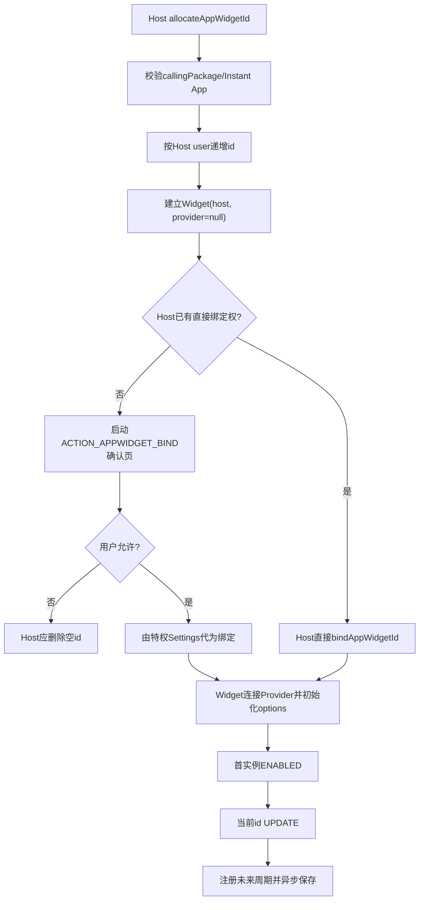
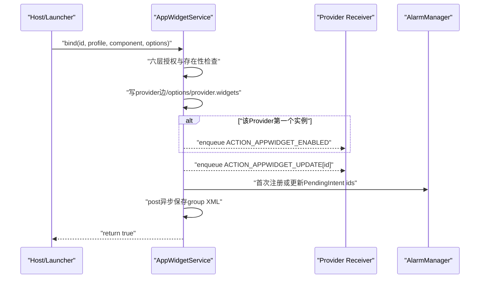
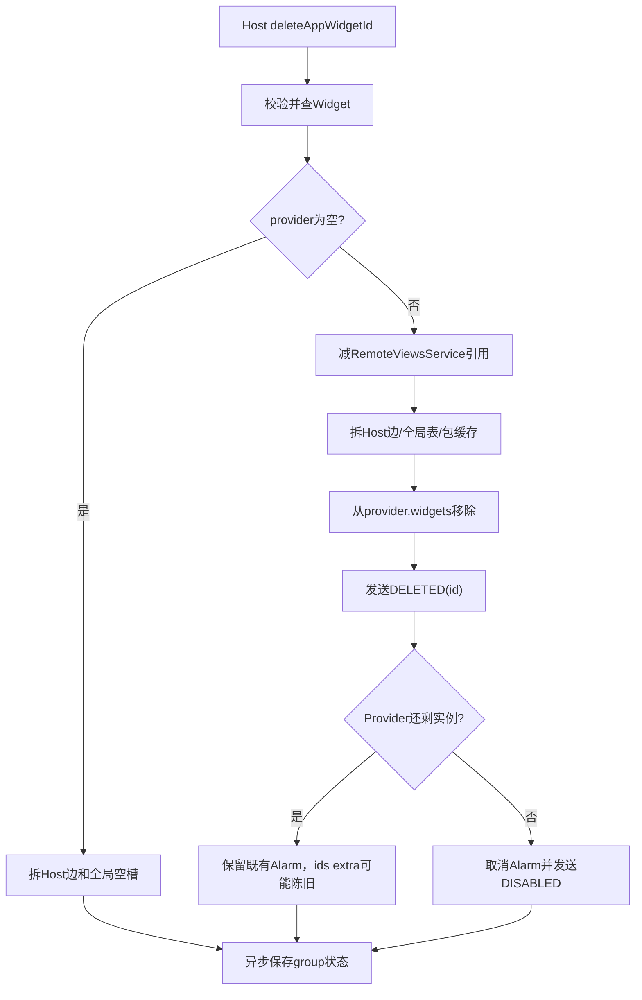

# 第 360 章 Android AppWidget实例：ID分配、绑定授权、Options与生命周期广播事务链

> 源码基线：Android 11 / API 30 / `android-11.0.0_r48`。本章只在macOS阅读源码，不编译。上一章得到可用Provider目录，本章把一个选择器条目变成真实实例：Host先申请尚未绑定的id，直接授权或经Settings确认后把它连到Provider，再初始化options、触发ENABLED/UPDATE；删除时则拆RemoteViewsService、Host、全局Widget和Provider四边，并根据是否最后一个实例发送DELETED/DISABLED。

## 1. Provider与Widget不是同一个对象

Provider代表一个Receiver组件，可对应多个实例；Widget代表一个`appWidgetId`，连接一个Host和零或一个Provider。Host刚分配id时Provider仍为null，所以“已分配”不等于“已绑定”。

## 2. 绑定为何拆成两步

Host需要先拿id才能把它放进绑定确认Intent、配置Activity和自己的数据库；系统又不能在用户尚未同意时直接连Provider。因此分配建立空槽，绑定再填Provider，这两个步骤之间天然存在可取消和可崩溃窗口。

## 3. 本章核心对象图

`HostId(uid,hostId,package)`标识Host，`ProviderId(uid,ComponentName)`标识Provider，`Widget`持`appWidgetId/host/provider/options/views`。同一个整数id必须放在Host所属user语境中解释。

## 4. 客户端分配入口

`AppWidgetHost.allocateAppWidgetId()`调用`IAppWidgetService.allocateAppWidgetId(mContextOpPackageName,mHostId)`。HostId不是Framework替Launcher生成的随机值，而是Host应用构造`AppWidgetHost`时选择并长期复用的整数命名空间。

## 5. 服务先核对包与uid

`mSecurityPolicy.enforceCallFromPackage(callingPackage)`最终用AppOps `checkPackage(Binder.getCallingUid(),package)`，阻止调用者冒充另一个包创建Host记录。它验证uid—包关系，不表示该包已获得绑定任意Provider的权力。

## 6. Instant App不能当Host

分配与startListening都检查`isInstantAppLocked()`。Instant App分配时返回`INVALID_APPWIDGET_ID`，不会创建Host/Widget；其短暂安装与存储模型不适合持久桌面实例。

## 7. INVALID_APPWIDGET_ID是0

公开常量值为0，正常服务永不把0作为成功id。客户端还可能在服务不存在时返回-1，因此调用者应按API语义验证结果，不要假设所有非零负数都是可用id。

## 8. 分配前加载整个profile group

服务在主锁内调用`ensureGroupStateLoadedLocked(userId)`，先恢复现有Host/Provider/Widget和id上界。否则重启后的首次分配可能复用磁盘已有id，破坏Host数据库引用。

## 9. id计数器按Host user保存

`mNextAppWidgetIds`是`SparseIntArray<userId,int>`。跨profile绑定时id仍属于Host user，而不是Provider profile；Provider user只决定Receiver与资源在哪个user运行。

## 10. 从空槽到实例总图

## 11. fresh user首个实现值为何可能是2

若计数器不存在，代码先放`INVALID+1`即1，再由`incrementAndGetAppWidgetIdLocked()`加1并返回2。API没有承诺id从1开始或连续，这个r48实现细节不能写进Host业务逻辑。

## 12. 重启后也允许出现空洞

加载每个持久Widget时用`setMinAppWidgetIdLocked(user,id+1)`抬高计数器，后续分配又执行加1，因此可能跳过一个值。删除也不回收旧id；单调且不冲突比连续更重要。

## 13. Host不存在就创建

服务用真实calling uid、hostId和callingPackage构造HostId，再`lookupOrAddHostLocked()`。同包可创建多个hostId，它们有各自Widget列表与callbacks，但仍受同uid身份约束。

## 14. 空Widget只连接Host

新对象写`appWidgetId`与`host`，加入`host.widgets`和全局`mWidgets`；此时`provider/options/views`尚未设置。`addWidgetLocked()`看到provider为null时不会把包加入`mWidgetPackages`。

## 15. 分配也会异步保存

`saveGroupStateAsync(userId)`在返回id前只是向Handler post保存任务，不等待`AtomicFile.finishWrite()`。调用成功表示内存槽已创建，不是磁盘durability确认。

## 16. Host数据库与系统XML没有共同事务

Launcher通常还要把id、屏幕位置写自己的数据库。任一侧先落盘后崩溃，都可能出现系统有空id但Launcher无记录，或Launcher有id而系统状态未保存；启动清理必须能容忍孤儿。

## 17. 绑定API返回boolean

`AppWidgetManager.bindAppWidgetIdIfAllowed()`把Host包、id、目标profile、Provider组件和可选options交给服务。false表示这次未完成绑定，原因可能是无授权、坏id、错误profile、包不存在、Provider不存在、重复绑定或safe mode。

## 18. false不等于只缺用户确认

Launcher常在false后启动`ACTION_APPWIDGET_BIND`，但若真正原因是Provider卸载或id已失效，确认页也无法修复。因此稳健Host要在返回/Activity结果后重新校验ProviderInfo和id，而不是无限重试确认。

## 19. 第一层是profile关系

锁外先调用`isEnabledGroupProfile(providerProfileId)`：目标必须是调用user本身，或其直接profile，并且处于enabled状态。它不允许任意两个同组成员相互绑定，也不允许child反向访问parent。

## 20. parent到profile是有方向的

`isParentOrProfile(parentId,profileId)`用calling user作为parent候选；相同user直接通过，否则要求`getProfileParent(profileId)==callerId`。managed profile里的Host不能借此把Provider指到个人parent。

## 21. 第二层是跨资料Provider名单

若Provider不在calling user，包名必须位于DPM为该profile配置的cross-profile widget providers名单。只检查包名，不代表包内任意组件自动有效；后面仍按uid+ComponentName查真实Provider。

## 22. 同user不需要DPM名单

`isProviderInCallerOrInProfileAndWhitelListed()`在profileId等于caller user时直接true。不要把企业跨profile白名单误当所有Widget绑定的统一Picker白名单。

## 23. 第三层是Host绑定权

进入主锁后检查调用者拥有签名级`BIND_APPWIDGET`，或者其`(callingUserId,callingPackage)`存在用户授予的bind whitelist。Provider被DPM允许跨资料，并不能替Host补上这项绑定授权。

## 24. 两种白名单不要混名

DPM名单回答“个人Host能否看/绑工作资料中的某Provider包”；`mPackagesWithBindWidgetPermission`回答“某Host包能否绕过每次用户确认直接绑定”。它们的管理者、键、持久化和撤销效果都不同。

## 25. bind grant按Host user查

`isCallerBindAppWidgetWhiteListedLocked()`用`UserHandle.getCallingUserId()`与Host callingPackage查Pair。跨profile时也不是按Provider user查，因为被授予直接绑定能力的是发起绑定的Host应用。

## 26. grant只对已安装包有效

查询或设置grant都会先`getUidForPackage(package,user)`；不存在就返回false或直接不改。XML加载时也会处理保存的授权集合，但运行API不会为一个尚未安装的名字预授权。

## 27. 管理grant需要特殊权限

`hasBindAppWidgetPermission()`和`setBindAppWidgetPermission()`要求`MODIFY_APPWIDGET_BIND_PERMISSIONS`。普通Launcher不能自己勾选“永久允许”后直接写系统账，必须借系统确认Activity。

## 28. Settings确认页扮演什么角色

`AllowBindAppWidgetActivity`由`ACTION_APPWIDGET_BIND`启动，读取id、Provider组件、profile和options，并用`getCallingPackage()`确定请求Host。用户点允许后，它以自身特权身份再次调用绑定服务。

## 29. 为什么Settings能绑定别人的id

`lookupWidgetLocked()`的访问策略除Host/Provider本人外，还允许拥有`BIND_APPWIDGET`且与Host或Provider同user的调用者访问。Settings因此能处理Launcher拥有的空Widget，而非篡改HostId成为Launcher。

## 30. 确认页默认返回取消

`onCreate()`先`setResult(RESULT_CANCELED)`；只有参数完整、用户点正向按钮且服务返回bound=true，才把id放入结果并改为RESULT_OK。异常被记录后仍结束页面。

## 31. “始终允许”是另一项写操作

正向点击后，Settings比较复选框与当前grant，不同则调用`setBindAppWidgetPermission(mCallingPackage,alwaysAllowBind)`。一次绑定批准与长期Host白名单是两个状态变化。

## 32. 绑定失败仍可能处理复选框

设置grant的代码位于`if (bound)`之外。只要参数有效且用户点了正向按钮，即使这次绑定因竞态失败，也可能改变Host未来直接绑定权；不要把RESULT_OK与grant变化强绑定。

## 33. 跨profile确认有user键细节

确认页初始化复选框时调用带`mProfile.getIdentifier()`的查询，而正向点击后的再次比较与写入都用无userId重载，落到Activity当前user。跨profile场景中“初始展示查Provider profile、最终比较/写Host当前user”的不对称值得审计；服务实际绑定白名单按调用Host user消费。

## 34. Host必须处理取消后的空id

API文档明确：绑定Activity返回RESULT_CANCELED，应删除先前分配的appWidgetId。系统确认页本身并不持有Launcher Host身份去替它完成常规清理。

## 35. 不清理会留下什么

空Widget仍在`mWidgets`和Host列表并可能持久化，但provider为null，所以没有ENABLED/UPDATE/DELETED广播，也没有周期Alarm。大量取消却不删会让Host状态和XML积累无用槽。

## 36. 第四层是Widget访问检查

服务查找id时使用calling uid/package。普通直接绑定通常命中“这是我的Host”；Settings确认则命中特权同user规则。坏id记录error并返回false，不抛给Launcher。

## 37. 已绑定id不能改Provider

若`widget.provider != null`直接返回false。绑定不是“替换Provider”API；要更换组件，应删除旧实例、让Provider收到删除生命周期，再分配并绑定新id。

## 38. 第五层是目标包uid

服务按`providerComponent.packageName+providerProfileId`查询uid。包未安装返回false；调用者不能传一个来自user10的uid，因为uid完全由服务按目标user重新求得。

## 39. 第六层是ProviderId精确存在

用该uid和完整ComponentName查`mProviders`。包内存在别的Widget Receiver不够，组件类必须就是上一章成功发现并解析的Provider。

## 40. safe mode拒绝第三方zombie

Provider为zombie时绑定返回false，避免在safe mode把新实例连到尚未验证/不可运行的第三方占位。已恢复关系可能以遮罩或占位形式保留，但不接受新的主动绑定。

## 41. 所有门通过才写关系

真正commit的第一步是`widget.provider=provider`，然后初始化options、把Widget加入`provider.widgets`、更新包缓存/遮罩，再发广播和调度Alarm。前面的false路径不会半写Provider边。

## 42. options为null会新建Bundle

服务不让成功绑定后的`widget.options`保持null：调用者未传就创建空Bundle。后续`updateAppWidgetOptions()`可以直接`putAll()`，Provider也可稳定接收Bundle。

## 43. 本地Binder要复制options

若调用者与服务同PID，`cloneIfLocalBinder(options)`做Bundle clone，避免后续调用者修改同一个Bundle对象污染服务缓存。跨进程Binder本身已Parcel复制，所以直接使用收到的服务端副本。

## 44. Bundle复制只是浅复制

源码注释承认本地clone为shallow copy。Android 11标准options主要是基本类型，通常够用；若定制代码塞入可变嵌套对象，本地调用仍可能共享内部引用。

## 45. Host category有强制默认

options不含`OPTION_APPWIDGET_HOST_CATEGORY`时，服务写HOME_SCREEN。它描述这个具体实例所在Host类别，不等于ProviderInfo声明的`widgetCategory`能力集合。

## 46. 调用者显式category不会被纠正

若Bundle已含该键，服务不校验是否与Provider声明、目标UI或已知flag匹配。授权层已筛Provider可见性，具体Host仍需提供合理options。

## 47. 四个尺寸options也是实例态

`OPTION_APPWIDGET_MIN/MAX_WIDTH/HEIGHT`描述Host当前给该实例的尺寸范围，文档单位为dips。它们不同于ProviderInfo XML的默认/resize尺寸；前者可随网格和旋转变化。

## 48. 绑定时不补四个尺寸

服务只确保host category，未传的宽高不会从ProviderInfo自动复制。Launcher通常在放置/测量时构造Bundle或随后调用`updateAppWidgetOptions()`。

## 49. options更新采用合并

`updateAppWidgetOptions()`对现有Bundle执行`putAll(options)`，没有先clear。只传宽度会保留旧高度/category；若想去掉某键，不能假设缺省字段会自动删除。

## 50. options变化会发专用广播

合并后服务发送显式`ACTION_APPWIDGET_OPTIONS_CHANGED`，携带单个id和完整当前options，再异步保存。`AppWidgetProvider.onReceive()`只有两个extra都存在才转调`onAppWidgetOptionsChanged()`。

## 51. getOptions也防本地共享

查到有效Widget/options时返回`cloneIfLocalBinder(widget.options)`，跨进程则依赖Parcel；查不到返回`Bundle.EMPTY`。调用者不能用返回Bundle直接改服务端状态，必须走update API。

## 52. 连接Provider后更新包缓存

`onWidgetProviderAddedOrChangedLocked()`按Provider user把包名加入`mWidgetPackages`。这个缓存回答某包是否拥有已绑定Widget，不包含只分配未绑定的Host空槽。

## 53. 绑定时立刻应用遮罩

若Provider因profile locked/quiet/suspended而masked，服务为新Widget生成遮罩RemoteViews；否则清旧mask。授权成功不保证Host立刻看到Provider的真实内容。

## 54. 提交与生命周期时序图

## 55. widgetCount在加入后计算

`provider.widgets.add(widget)`后取size；等于1说明这是从0到1的转换。只有这个边沿发送ENABLED，第二、第三个实例不会重复onEnabled。

## 56. ENABLED先于当前UPDATE入队

代码先`sendEnableIntentLocked(provider)`，再`sendUpdateIntentLocked(provider,new int[]{id})`。这是调用/入队顺序；两者都是普通显式广播，bind返回不等待Receiver处理完成。

## 57. UPDATE只带新id

绑定时立即UPDATE数组只包含当前实例，不把Provider的所有旧实例一起刷新。Provider的`onUpdate()`必须尊重传入子集，不能每次都假设数组等于完整库存。

## 58. 周期PendingIntent带全量ids

紧接着`registerForBroadcastsLocked(provider,getWidgetIds(provider.widgets))`，周期更新extra改为该Provider当前所有实例。即时更新和未来周期更新的id集合语义不同。

## 59. Alarm只在首份有效周期时真正设置

若Provider已有broadcast，`FLAG_UPDATE_CURRENT`只刷新ids extra，不再次set repeating Alarm；首实例或包更新取消后重建才安排任务。周期为0则始终无框架Alarm。

## 60. save排在广播之后

绑定内存提交、ENABLED/UPDATE入队和Alarm注册之后才`saveGroupStateAsync()`。Provider可能先收到广播并保存自己的id数据，而system_server在XML真正落盘前崩溃，重启后该id关系消失。

## 61. true不是Provider绘制完成

bind返回true只表示服务端授权检查通过并已建立内存关系、安排后续动作。Provider进程可能尚未启动，RemoteViews还可能为空，Host也未必完成配置Activity。

## 62. 配置不是绑定事务的一部分

若ProviderInfo有configure，Host在绑定后另行启动配置页。配置成功/取消不会回滚`bindAppWidgetId()`内部；Host根据Activity result决定保留或调用delete。

## 63. 文档说取消会收到DELETED的条件

配置文档说取消时Provider收到DELETED，实际机制是Host在取消路径删除那个已绑定id。若定制Host忘记delete，服务不会因Activity RESULT_CANCELED自动知道并发送广播。

## 64. AppWidgetProvider只是广播适配器

`AppWidgetProvider`继承BroadcastReceiver，在`onReceive()`按action和extras调用空的hook方法。所有能力都可用普通Receiver实现；这个类不持久保存实例，也不替应用自动生成RemoteViews。

## 65. UPDATE会过滤坏extra

只有extras非null、`EXTRA_APPWIDGET_IDS`非null且长度大于0才调用`onUpdate()`。伪造空数组不会进入业务hook，这主要是健壮性过滤而非完整安全边界。

## 66. DELETED适配成单元素数组

服务每删一个Widget发一条带单id的广播；`onReceive()`取出id后调用`onDeleted(context,new int[]{id})`。应用hook虽接数组，在常规这条实现中每次通常只有一个元素。

## 67. ENABLED/DISABLED没有id

它们表示Provider整体从0↔非0转换，不针对某个实例，所以适合初始化/释放共享资源。具体实例数据仍应在onUpdate/onDeleted按id维护。

## 68. Receiver回调不等于事务ACK

`sendBroadcastAsUser()`只发送，不使用有序结果或等待应用确认。Provider抛异常、被force-stop或稍后才启动，都不会让bind返回false或自动回滚Widget关系。

## 69. 广播目标固定在Provider user

ENABLED、UPDATE、DELETED、DISABLED Intent都setComponent到Provider Receiver，并`sendBroadcastAsUser(...,provider.info.getProfile())`。跨profile Host的user不会收到这些Provider生命周期回调。

## 70. 发送前清除Binder身份

`sendBroadcastAsUser()`清调用身份后由system_server发送，再恢复。Provider看到的是系统调度的受保护AppWidget协议，而不是让Launcher uid直接跨user广播。

## 71. Host开始监听不是绑定前提

分配和绑定可以在Host callbacks为null时完成。startListening只注册`IAppWidgetHost`并补发pending updates；Host界面暂不可见不会阻止Provider更新在服务端缓存。

## 72. startListening按HostId找或建Host

调用校验包/Instant App后，用calling uid+hostId+package `lookupOrAddHostLocked()`，再写callbacks。若Host尚无Widget，也会临时存在；stop后无Widget且callbacks null就被prune。

## 73. pending update为何需要序号

Host不可见期间可能错过RemoteViews、ProviderInfo、collection data或removed callback。服务按request id收集、排序后返回，并推进`lastWidgetUpdateSequenceNo`，避免重连无限重复同一历史。

## 74. 只为客户端提交的id补发

AppWidgetHost.startListening()从本地`mViews`键生成ids数组。服务对每个请求id读取该Host的pending状态；它不是无条件把Host所有持久Widget全量推给客户端。

## 75. stopListening只断callback

服务把`host.callbacks=null`并更新AppOps Widget可见性，不删除Widget或Provider关系。桌面Activity暂时停止与用户删除Widget是两种完全不同的生命周期。

## 76. Host无Widget才可prune

`pruneHostLocked()`要求`host.widgets.size()==0 && callbacks==null`。只要还有一个Widget，即使Launcher进程死、callback为空，Host记录仍要保留以承接RemoteViews与重启恢复。

## 77. AppWidgetHost.deleteAppWidgetId先删本地View

客户端在`synchronized(mViews)`中移除id后再Binder调用服务。若Binder抛RemoteException，本地View已消失而系统关系可能仍存在；这里同样没有跨进程回滚。

## 78. 服务删除先验证访问

`deleteAppWidgetId(callingPackage,id)`校验包并按uid/package查Widget；找不到就静默返回。Host重复删除是幂等式no-op，不会因第二次调用收到异常。

## 79. 删除空id不会通知Provider

空Widget的provider为null。服务仍从Host/global表删除并保存，但跳过DELETED/DISABLED和Alarm逻辑。这正是绑定取消后及时清理的安全路径。

## 80. 删除绑定id先减RemoteViewsService引用

`deleteAppWidgetLocked()`首先调用`decrementAppWidgetServiceRefCount(widget)`。若这是某collection Service Intent的最后一个引用，会绑定服务并调用`IRemoteViewsFactory.onDestroy()`清Provider侧工厂缓存。

## 81. Factory销毁本身是异步边界

服务通过ServiceConnection等机制通知远端，不与Widget XML删除构成共同事务。Provider进程不可用时清理可能失败，但系统仍继续拆Widget主关系。

## 82. Host边先拆

接着从`host.widgets`移除并尝试prune Host。`widget.host`字段没有立刻置null，后续removed callback与debug仍能引用原Host对象。

## 83. 全局表随后移除

`removeWidgetLocked()`从`mWidgets`删除、更新`mWidgetPackages`包缓存，并调度Host的appWidgetRemoved callback。该callback通过Handler异步送达，不在主锁内直接调用Host Binder。

## 84. 包缓存按最后一个同包实例清理

`onWidgetRemovedLocked()`会扫描是否还有同Provider包的其它Widget；只有没有时才从对应Provider user的`mWidgetPackages`移除包名。它按包聚合，不按Receiver组件聚合。

## 85. Provider边最后拆

若provider非null，从`provider.widgets`移除。只有provider非zombie才发送生命周期广播；safe mode/恢复占位不会尝试唤醒一个不可用Receiver。

## 86. 每个绑定实例先DELETED

正常删除总会先发送该id的ACTION_APPWIDGET_DELETED，即便它是最后一个。Provider可先清实例级数据，再在后续DISABLED释放共享资源。

## 87. 最后一个实例再DISABLED

移除后`provider.widgets.isEmpty()`成立时，服务取消未来周期并发送ACTION_APPWIDGET_DISABLED。于是最后一次删除的入队顺序是DELETED→取消Alarm→DISABLED。

## 88. 删除状态机

## 89. 一个容易漏看的周期ids问题

常规`deleteAppWidgetLocked()`在仍有实例时没有显式再次调用`registerForBroadcastsLocked()`刷新PendingIntent中的id数组；已有周期PendingIntent可能继续携带被删id，直到其它注册/包变化更新extras。Provider API通常应容忍收到已失效id。

## 90. 最后实例取消是post执行

`cancelBroadcastsLocked()`先把`provider.broadcast=null`，再post AlarmManager.cancel与PendingIntent.cancel。内存已表示无注册，但外部Alarm取消尚未完成，存在短暂异步窗口。

## 91. 删除保存也晚于广播入队

`deleteAppWidgetId()`在完整拆除后才post保存。Provider可能已经收到DELETED/DISABLED，而崩溃使旧XML在重启后恢复该关系；跨应用回调与系统持久化没有exactly-once保证。

## 92. deleteHost会批量走相同删除

`deleteHostLocked()`从后向前处理Host全部Widget，每个调用`deleteAppWidgetLocked()`，最后移除Host并清callbacks。因此各Provider分别收到DELETED，某Provider最后实例被清时收到DISABLED。

## 93. deleteAllHosts按calling uid而非包

服务遍历`mHosts`，删除`host.id.uid==Binder.getCallingUid()`的所有Host；方法本身没有callingPackage参数。共享uid下多个包的Host可能一起被删除，这是隐藏/特权语境需要留意的身份粒度。

## 94. Provider包卸载不是常规删除

`deleteProviderLocked()`走`deleteWidgetsLocked()`清关系、推空RemoteViews并取消Alarm，但注释说Receiver已不存在，无需DISABLED；也不会向消失组件发送正常DELETED。应用主动卸载与用户从桌面移除的协议不同。

## 95. deleteWidgetsLocked会把字段置null

包删除路径把Widget从Host/global表移除后设`widget.provider=null`、prune Host，再设`widget.host=null`。这比常规Host删除更彻底，且Host先收到空Views/removed信号来清UI。

## 96. Provider如何查询自己的ids

`getAppWidgetIds(component)`先校验component包属于调用uid，再用calling uid+component找Provider，返回其`provider.widgets` ids。跨user Host不改变Provider查询身份；Provider在自己user看到所有由不同Host绑定的实例。

## 97. Host如何查询自己的ids

`getAppWidgetIdsForHost(callingPackage,hostId)`用calling uid+hostId+package精确查Host并返回其列表。它可包含同user和允许的profile Provider实例，但不会泄露同包另一个hostId的Widget。

## 98. isBoundWidgetPackage是派生缓存

`mWidgetPackages`只在Widget有Provider时加入，并在最后一个同包关系删除时移除。它是运行态加速索引，不是授权来源；缓存错误不能凭自身创造一个有效Widget关系。

## 99. options与ProviderInfo单位要分开

ProviderInfo尺寸在上一章经历complex→调用方像素整数的实现链，而options宽高文档明确是dips并由Host提供。相同“width”字样不代表可直接逐值比较，需看消费者是否还会换算。

## 100. 生命周期广播可能比Host UI早

bind先发Provider广播，Host通常之后才启动configure或创建`AppWidgetHostView`。Provider不能假设onEnabled/onUpdate到来时Launcher已经把最终位置、尺寸和配置结果写好。

## 101. Provider应把id当外部句柄

id可能因取消、Host数据库恢复、系统备份映射、包变化或异步持久化窗口失效。Provider保存业务数据时应能处理重复UPDATE、迟到DELETED、未知id和恢复后的old→new映射。

## 102. ENABLED不是应用进程首次创建

它表示这个Provider当前实例集合从0变1，不是APK第一次安装、进程第一次启动或Receiver对象第一次构造。进程可在多个广播间死亡并重建，而实例集合仍非空。

## 103. DISABLED也不是组件disabled

它表示实例集合从1变0，不会修改PMS的component enabled setting，也不会从Provider列表删除组件。下一次重新绑定首实例仍会再次ENABLED。

## 104. DELETED不保证紧随用户手势

删除可能来自Launcher操作、Host整体删除、user/profile清理或政策撤权；某些Provider消失路径甚至不发DELETED。业务若需要强一致清账，不能只依赖一个理想的人机路径。

## 105. 主锁覆盖的是内存线性化点

allocate、bind、delete都在`mLock`内修改四张表，阻止两个Binder线程同时把同一空id绑定两次。但广播、Alarm、Handler callback和磁盘保存跨出锁，完整外部效果不是单一原子事务。

## 106. clean identity不等于释放锁

发送广播、查PMS时即使清除Binder身份，当前线程仍可能持`mLock`。identity只改变下游权限主体，不提供线程切换、内存可见性或故障回滚。

## 107. bind的TOCTOU边界

profile/DPM名单检查发生在进入主锁前，随后Provider与Widget在锁内确认。政策名单可能在两步间变化；第357章的撤权监听会再删除不允许关系，但这不是与bind共享的一次跨服务事务。

## 108. grant撤销不删除既有Widget

`setBindAppWidgetPermission(...,false)`只从授权Set移除并保存，影响未来直接bind。它没有遍历删除该Host已经绑定的实例；一次性用户同意产生的关系继续存在。

## 109. DPM跨profile撤权会删除既有关系

这与普通bind grant不同：cross-profile Provider名单变化会通知AppWidgetService，后者删除parent Host托管的不再允许资料Widget。两个“白名单撤销”的后果不可互换。

## 110. 一套故障推演模板

对每个动作依次标记：调用者身份→主锁内表变化→异步Host callback→Provider广播→Alarm→XML→Host数据库。若崩溃发生在任意箭头之间，分别写出重启后哪一侧可能多一条或少一条记录。

## 111. 推荐的阅读断点

分配看916行附近，绑定看1103行附近，删除看965与`deleteAppWidgetLocked()`，广播看2368行附近，授权看SecurityPolicy 3761行后，确认UI看`packages/apps/Settings/.../AllowBindAppWidgetActivity.java`，客户端清理看`AppWidgetHost.java`。

## 112. macOS只读练习一：画出空id

执行`rg -n "allocateAppWidgetId|incrementAndGetAppWidgetIdLocked|addWidgetLocked" frameworks/base/services/appwidget/java/com/android/server/appwidget/AppWidgetServiceImpl.java`，静态推演fresh user连续分配三次以及重启加载最大id后的下一次结果，并解释为何Host绝不能依赖连续编号；不编译、不运行模拟器。

## 113. macOS只读练习二：列绑定六道门

逐行阅读`bindAppWidgetId()`与SecurityPolicy，把enabled group、DPM跨profile名单、BIND_APPWIDGET/Host grant、Widget访问权、目标包uid、Provider存在/zombie写成表格；为同user Launcher和parent→managed profile各走一遍。

## 114. macOS只读练习三：对比两种授权

只读对照`AllowBindAppWidgetActivity.java`、`mPackagesWithBindWidgetPermission`和`getCrossProfileWidgetProviders()`，说明一次Settings确认、始终允许Host绑定、企业允许某资料Provider三者的主体与撤销效果，并找出跨profile查询/写grant的user参数不对称。

## 115. macOS只读练习四：推演最后实例删除

从`AppWidgetHost.deleteAppWidgetId()`追到`deleteAppWidgetLocked()`，假设Provider有两个实例并先后删除：记录RemoteViewsService引用、Host/global/provider列表、DELETED、周期PendingIntent和DISABLED每一步，特别检查第一次删除后周期extra是否被刷新。

## 116. 复读修正一：绑定确认不是服务自动弹窗

服务只返回false，不负责启动UI；Launcher显式发`ACTION_APPWIDGET_BIND`，Settings再以特权身份代绑。正文据此把“授权判断”和“用户交互”分成两个调用，而不是虚构一条同步系统对话框链。

## 117. 复读修正二：配置取消不会自动回滚

配置Activity结果只返回给Host，AppWidgetService没有监听RESULT_CANCELED。只有Host随后delete，Provider才得到DELETED/DISABLED；正文把API文档的可见效果补全为实际责任链。

## 118. 复读修正三：仍有实例时周期ids可能陈旧

再次阅读常规删除路径，确认它只在最后实例时cancel，并未在非空时调用`registerForBroadcastsLocked()`更新PendingIntent extras。因此正文保留“Provider要容忍无效id”的实现级提醒，而不假定定时数组实时精确。

## 119. 本章心智模型

Widget实例是一条分阶段建立、分阶段拆除的跨进程关系：id先属于Host，授权成功后才连Provider；options是实例契约；0↔1边沿产生整体广播；所有外部副作用都围绕主锁内关系变化异步展开，没有跨Host数据库、Provider状态和系统XML的共同提交。

## 120. 下一章入口

实例关系建立后，Provider会提交RemoteViews。下一章继续追`updateAppWidget()`的完整/部分更新、bitmap内存上限、clone/merge语义、Host callback序号、进程离线补发，以及遮罩Views如何覆盖真实Views而不丢缓存。
