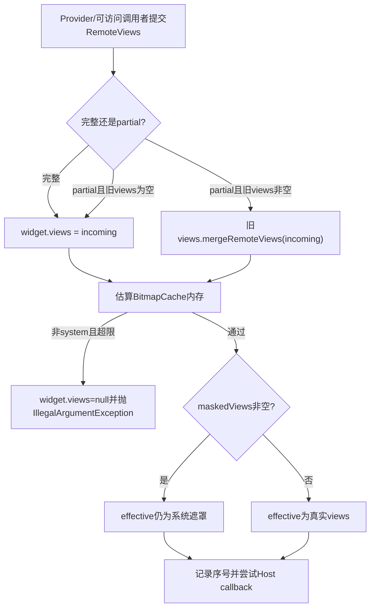
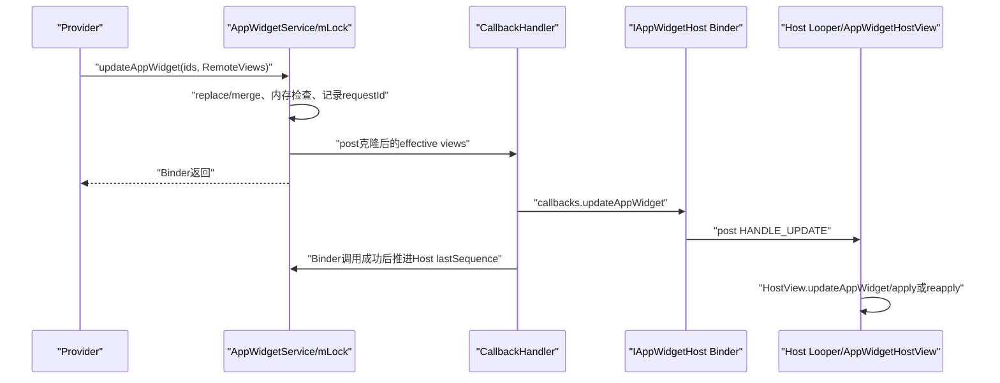
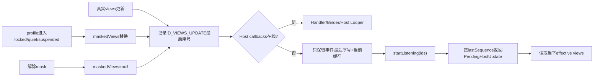

# 第 361 章 Android AppWidget RemoteViews：完整/部分更新、缓存、内存上限、遮罩与Host补发链

> 源码基线：Android 11 / API 30 / `android-11.0.0_r48`。本章只在macOS阅读源码，不编译。上一章建立Widget关系，本章追内容如何流动：Provider提交的RemoteViews怎样成为服务缓存，partial update怎样按Action合并，Bitmap上限何时破坏旧值，profile遮罩为何不覆盖真实缓存，以及Host在线、离线、Binder死亡和稍后createView时各从哪里得到内容。

## 1. RemoteViews不是截图

RemoteViews保存目标包、布局资源id和一组受限Action，Host进程反序列化后在自己的`AppWidgetHostView`中inflate/apply。Bitmap只是其中一种负载，服务缓存的是可跨进程执行的UI描述。

## 2. 三份Views状态

`Widget.views`是真实内容缓存，`Widget.maskedViews`是锁定、quiet或suspended时由系统生成的替代内容，`getEffectiveViewsLocked()`返回两者中当前应交给Host的一份。不要把遮罩误写成删除Provider内容。

## 3. 两类更新API

`updateAppWidget()`声明提交完整表示，服务直接替换缓存；`partiallyUpdateAppWidget()`声明提交增量，服务尝试把Action合进旧缓存。二者最终都给Host一次完整的effective RemoteViews快照，而非把增量原样永久排队。

## 4. 按id与按Provider更新

按id入口可传一个或多个appWidgetId；`updateAppWidget(ComponentName,views)`则精确查调用uid拥有的Provider，并遍历其全部实例做完整更新。两条路最后汇入`updateAppWidgetInstanceLocked()`。

## 5. 空数组直接no-op

服务发现ids为null或长度0就返回，甚至不会执行callingPackage校验。非空才验证包与uid并加载group状态；这属于快速退出，不产生任何缓存或回调。

## 6. 调用包先过AppOps

`enforceCallFromPackage()`保证callingPackage属于Binder uid。它防止伪装包名，但按id路径随后使用通用Widget访问策略，并没有单独比较“调用uid必须等于Provider uid”。

## 7. Javadoc与服务授权有落差

客户端文档说更新只对拥有Provider的uid有效；服务端`lookupWidgetLocked()`却允许Host本人以及同user持`BIND_APPWIDGET`的特权调用者访问。实现级审计不能只引用Javadoc得出Provider-only结论。

## 8. Host越权还是能力边界

Host本就控制自己的显示View，但经服务更新还会改变system_server缓存和离线补发内容。Android 11这条通用访问复用应被视为真实边界；是否符合产品预期需单独安全评审，不能擅自说一定是漏洞。

## 9. Provider批量入口更严格

`updateAppWidgetProvider(ComponentName,views)`先校验组件包属于调用uid，再以calling uid+ComponentName查Provider。找不到只记录warning；找到后更新Provider当前所有Widget。

## 10. 内容更新总图

## 11. 主锁是缓存提交点

服务在`mLock`中逐id查Widget并修改`widget.views`。同一实例的两个Binder更新不会同时merge，但多个id的一次批量调用不是错误可回滚的整体事务。

## 12. 无效id被静默跳过

数组里某id查不到或调用者不可访问时，不抛错也不阻止后面的id。调用方无法仅从void返回值知道实际更新了几个实例。

## 13. zombie关系不更新

实例、Provider或Host处于不可用占位状态时，`updateAppWidgetInstanceLocked()`条件失败并静默返回。它不缓存一份等恢复后再自动提交的新内容。

## 14. 完整更新直接换引用

非partial或旧views为null时执行`widget.views=views`，没有在此处clone。跨进程Binder已产生服务端对象副本，但批量循环中的多个Widget会收到同一个Java引用。

## 15. 传null可清真实内容

完整更新允许views为null，缓存被清空并通知Host null；HostView通常转到默认/错误视图。若当前被mask，effective仍是遮罩，真实内容只是在幕后变成null。

## 16. partial的正常分支

只有`isPartialUpdate && widget.views != null`才调用`mergeRemoteViews(newViews)`。它在现有完整表示上增删/追加Action，再把合并后的完整缓存交给Host。

## 17. 没有基线时实现没有忽略

Javadoc说未收到完整更新时partial会被忽略，但r48代码落入else并直接`widget.views=views`。这份本应增量的RemoteViews成为基线；正文以可执行分支为准，同时保留文档落差。

## 18. partial传null的两种结果

旧views非null时`mergeRemoteViews(null)`立即返回，内容不变但仍安排回调；旧views为null时else仍把null赋回并通知。它不是统一的no-op。

## 19. merge先复制增量

`RemoteViews.mergeRemoteViews()`先`new RemoteViews(newRv)`，因为合并会重写Action引用的BitmapCache。这样同一增量对象可被合进多个Widget，不会因第一次merge而破坏输入。

## 20. Action用unique key匹配

基础key包含action tag与viewId；反射Action还加入methodName和type等。相同View上的不同属性可以并存，相同属性的新Action才按mergeBehavior决定替换。

## 21. MERGE_REPLACE

默认行为是替换：若旧map已有相同key，先从旧Action列表移除，再追加新Action。最终apply时只留下最新setter语义。

## 22. MERGE_APPEND

append不删除旧Action，直接追加。例如某些累计滚动或集合操作需要保留前后命令；缓存会随多次partial增长。

## 23. MERGE_IGNORE

ignore表示新增量Action不进入合并后的缓存。r48服务随后发送的是`widget.getEffectiveViewsLocked()`而不是原始delta，因此`showNext/showPrevious`这类MERGE_IGNORE新命令在这条partial路径上会在到达Host前被丢掉；若旧缓存已有同key Action，旧Action仍保留。

## 24. “部分更新都会持久”不准确

客户端两个重载的Javadoc存在“API17后追加缓存”与“这些更新不缓存”的表述张力，还推荐用partial发送导航命令；但当前服务先merge再发送缓存，REPLACE/APPEND会缓存，IGNORE新Action则不被交付。真实结果必须按r48执行路径判断。

## 25. merge重建BitmapCache

合并末尾新建BitmapCache并让所有保留Action重新登记Bitmap。被替换Action独占的Bitmap可被裁掉，内存估算反映合并后的有效集合。

## 26. copy不是简单浅拷贝Action列表

RemoteViews复制构造器通过Parcel写读Action，避免直接共享可变Action对象；BitmapCache/Bitmap仍有专门复用机制。分析别名时要区分顶层RemoteViews、Action和Bitmap底层对象。

## 27. 批量完整更新存在顶层别名

服务把同一个incoming引用依次赋给所有目标Widget。若之后只对其中一个Widget做partial merge，它会原地修改这份RemoteViews，其他Widget的`views`字段也可能观察到合并结果。

## 28. 别名不一定立即更新另一个Host

partial只为被请求id安排callback；共享缓存虽已变化，另一个实例不会同步收到本次通知。但它下次`getAppWidgetViews()`、重连补发或其它通知时可能拿到被间接改变的内容。

## 29. updateAppWidgetProvider也会共享引用

Provider批量入口同样遍历实例并传同一views做完整更新，因此产生相同顶层别名。要修复需在服务缓存边界按实例clone或建立不可变契约，不能只改客户端重载。

## 30. 这是r48实现疑点而非API承诺

外部应用不应依赖实例缓存共享；正常设计应把每个Widget视为独立状态。本章把它限定为本地源码推导，未来版本/OEM分支需重新核对。

## 31. 内存上限怎样计算

服务启动时取默认Display真实宽高，设置`mMaxWidgetBitmapMemory=6*width*height`，即1.5屏×4 bytes/pixel。只在构造阶段计算，配置广播中未见重新计算。

## 32. 它只估BitmapCache

`RemoteViews.estimateMemoryUsage()`返回BitmapCache的bitmap memory，不统计Action对象、字符串、Bundle、URI或完整Parcel大小。Binder事务大小仍由Binder/Parcel另一套限制约束。

## 33. 不是按每张图限制

估算针对合并后整份RemoteViews引用的Bitmap缓存总量。同一Bitmap在cache去重后的记账与多张不同Bitmap累积效果不同。

## 34. system appId豁免

只有`UserHandle.getAppId(Binder.getCallingUid()) != SYSTEM_UID`才执行上限。注意判断是appId，跨user的system appId仍豁免；普通Provider不能靠以system_server发送广播获得豁免，检查的是更新API调用uid。

## 35. 超限先破坏缓存再抛错

无论完整替换还是partial原地merge，代码先改变`widget.views`，估算超限后把它设为null，再抛`IllegalArgumentException`。它不会恢复到更新前最后一份良好RemoteViews。

## 36. partial超限丢失旧基线

partial已经改写旧对象；超限时服务直接清null，没有保存merge前副本用于回滚。因此一次失败的增量可能让此前正常缓存也消失。

## 37. 超限不安排本次Host callback

异常发生在`scheduleNotifyUpdateAppWidgetLocked()`之前，所以不会主动告诉Host切到null。在线Host仍可能显示旧View树，而服务缓存已null；下次重建/查询才显出分叉。

## 38. 批量超限会中断后续ids

for循环没有逐id catch。第一个触发IllegalArgumentException后整个Binder调用退出，后面的id不处理；前面已成功处理的id不会回滚，形成部分提交。

## 39. 共享引用扩大失败影响

若多个Widget此前共享同一RemoteViews，某一实例partial merge可能先改到共同对象，随后只把当前`widget.views`字段清null；其它Widget仍指向已经超限/被修改的对象，影响范围比异常目标更大。

## 40. 防御策略

Provider应压缩/缩放Bitmap、避免每次创建大量不同图，并在提交前估算业务资源；完整更新失败后重新发送小而完整的RemoteViews，不能只发partial指望旧基线仍在。

## 41. 更新不会写appwidgets.xml里的Views

第358章的持久XML保存关系、options等，不序列化RemoteViews内容。system_server进程重启后真实views为空，Provider需通过启动/更新广播重新提交。

## 42. 缓存主要跨Host短暂离线

它让Launcher Activity不可见、callbacks断开或HostView稍后创建时仍能取最新内容，不是跨设备重启的Provider数据仓库。

## 43. getAppWidgetViews返回effective

Host创建View时调用服务`getAppWidgetViews(package,id)`，通过访问检查后返回`cloneIfLocalBinder(widget.getEffectiveViewsLocked())`。跨进程Parcel自然复制，同进程显式clone防共享修改。

## 44. createView先登记再拉取

`AppWidgetHost.createView()`构造HostView、setAppWidget并放入`mViews`，随后同步拉RemoteViews并`view.updateAppWidget(views)`。即使此前callback被忽略，创建时仍可恢复当前服务缓存。

## 45. 拉取与callback可能竞态

Callback经Host Handler排队，而createView同步Binder拉取；两条内容可能交错。框架没有在Host侧比较服务requestId，较旧Handler消息理论上可能晚于新拉取再apply。

## 46. 服务调度前递增全局序号

`UPDATE_COUNTER.incrementAndGet()`生成requestId，并把`widget.updateSequenceNos[ID_VIEWS_UPDATE]=requestId`。记录发生在检查Host callbacks之前，因此离线更新也能留下补发标记。

## 47. 每类只存最后序号

`updateSequenceNos`是SparseLongArray，views固定key为0、providerChanged为1、collection变化按viewId作key。连续十次views更新只保留最后requestId，不保存十份RemoteViews历史。

## 48. 内容快照来自当前缓存

离线补发时根据最后views序号读取`widget.getEffectiveViewsLocked()`，不是保存当时的RemoteViews对象。它提供最终状态收敛，不提供每次中间动画或命令的exactly-once重放。

## 49. 在线前也会clone

有callbacks时，服务把effective views clone后塞入CallbackHandler消息。这样Provider下一次更新或遮罩变化不会原地改写已排队的快照。

## 50. CallbackHandler拆主锁与Host Binder

主锁内只记录状态并post消息，真正`callbacks.updateAppWidget()`在Handler线程执行。避免持AppWidget主锁跨进程调用Launcher，但引入状态已更新、Host尚未收到的窗口。

## 51. Host callback又转自己的Looper

`AppWidgetHost.Callbacks`是Binder Stub，收到后把消息post到构造AppWidgetHost时选择的Looper，默认主Looper；最终`updateAppWidgetView()`才在该线程查`mViews`并更新HostView。

## 52. 在线更新时序

## 53. Provider返回不等Host已显示

Provider API返回时只保证服务端同步方法结束；CallbackHandler、Host Binder、Host Looper和RemoteViews apply仍在后面。UI线程繁忙时显示可明显滞后。

## 54. schedule会跳过无callback

Host callbacks为null、Host/Provider zombie或关系无效时，不创建Handler消息；但序号已写。服务不会为离线Host无限缓存每次Parcelable消息。

## 55. Binder成功才推进lastSequence

`handleNotifyUpdateAppWidget()`在`callbacks.updateAppWidget()`无RemoteException返回后写`host.lastWidgetUpdateSequenceNo=requestId`。失败时清callbacks，旧last保留，重连可补发。

## 56. Binder成功不等UI apply成功

AppWidgetHost Stub只负责post消息；即便其WeakReference Handler已被GC，它也直接return而不会向服务抛异常。服务仍把requestId视为成功交付，后续不凭该序号重发。

## 57. Host尚无View也会丢在线消息

Handler执行`updateAppWidgetView()`时若`mViews`没有该id就静默结束，服务已推进last。稍后正常`createView()`会同步拉当前缓存，这是框架补救，而不是callback重试。

## 58. RemoteException清callback

Host进程死亡或Binder断开时，服务在主锁内把`host.callbacks=null`。Widget关系与views缓存保留，Launcher重建后startListening可重新注册。

## 59. lastSequence是Host级而非Widget级

一个Host只有一个`lastWidgetUpdateSequenceNo`，所有Widget共享交付水位；每个Widget用自己的事件key保存最后requestId，再和Host水位比较。

## 60. 成功乱序可能倒退水位

CallbackHandler本身串行处理其消息，通常按post顺序推进；但其他路径也写水位。审计必须看统一Handler与startListening交互，而不能仅凭long值假设严格单调同步。

## 61. startListening先注册callbacks

服务拿锁后找到/创建Host，立即替换`host.callbacks`，再计算客户端提交ids的pending updates。新的在线更新会在同一锁序列之后调度。

## 62. pending只看请求ids

AppWidgetHost从本地`mViews`键生成ids；服务不会自动枚举Host全部持久Widget补齐客户端未知View。Host数据库仍负责决定哪些id应创建View。

## 63. getPendingUpdatesForId按水位过滤

遍历目标Widget的各事件key，requestId小于等于Host last水位就跳过；大于水位才构造`PendingHostUpdate`并以requestId放进LongSparseArray排序。

## 64. views pending发送最终effective

遇到ID_VIEWS_UPDATE时不读取历史快照，只clone当前effective views。如果期间进入quiet mode，早先真实更新的pending也会补成遮罩；这正符合当前可见政策。

## 65. providerChanged会清其它事件

调度Provider变化时先`widget.updateSequenceNos.clear()`，再写ID_PROVIDER_CHANGED。旧views/data-changed pending被折叠；Host重置ProviderInfo后由随后UPDATE或当前拉取恢复内容。

## 66. viewDataChanged按viewId合并

每个collection viewId是一个key。同一view连续通知只保留最后序号，不同view可各保留一次；这是“需要重新取数”的最终状态提示，而非数据事件日志。

## 67. 请求id已不存在会返回removed

Host提交本地仍持有、服务Host列表却找不到的id时，`getPendingUpdatesForId()`构造`appWidgetRemoved`。客户端从`mViews`删除它，帮助双方库存收敛。

## 68. startListening结束推进到新全局值

服务先取一个新的UPDATE_COUNTER值，收集pending后把Host last水位设成该值。返回列表本身在Binder中传给客户端，若客户端拿到后处理到一半崩溃，服务已认为整批被消费。

## 69. startListening不是逐项ACK

它没有客户端确认每个PendingHostUpdate成功apply的协议。列表返回成功与UI逐项完成之间仍可能丢最后一段，createView同步拉取只补Views最终态，collection命令等需各自容错。

## 70. lastSequence存在同步缺口

CallbackHandler成功路径在没有`mLock`时写Host long，而startListening在`mLock`内读写；字段非volatile。r48源码未建立统一happens-before，JMM层面存在可见性/竞争疑点，不能把注释当同步原语。

## 71. 64位long不是完整协议保证

即便具体64位设备单次读写原子，也不能替代跨线程顺序与可见性。审计结论应限定为并发设计缺口，复现还取决于Looper、Binder和硬件时序。

## 72. Host本地Binder会再次clone

AppWidgetHost.Callbacks判断调用PID相同且views非null时再clone，避免system_server同进程Host的消息对象共享。普通Launcher跨进程已由Parcel复制，不走此分支。

## 73. clone本身也有成本

RemoteViews复制会Parcel化Action；大Widget在服务调度、Binder传输与Host本地保护中可能产生多次复制。内存上限只看Bitmap cache，不代表复制CPU和Parcel延迟很小。

## 74. HostView决定apply还是reapply

`AppWidgetHostView.updateAppWidget()`内部根据layout、异步执行和错误状态选择inflate/apply/reapply。AppWidgetService只交RemoteViews，不知道最终View树是否成功构建。

## 75. ActionException不会回滚服务缓存

Provider提交的Action在Host apply时才可能因目标View/方法问题失败。服务已接受并缓存；另一个Launcher实现或配置可能有不同结果，Provider应以兼容布局和受支持Action为准。

## 76. 横竖布局也在RemoteViews内部

RemoteViews可包含landscape/portrait子对象，共享/重建BitmapCache。Host按当前配置选实际布局；服务内存检查针对整份缓存，不只当前方向。

## 77. 遮罩由system_server包资源创建

`createMaskedWidgetRemoteViews()`使用系统包与`work_widget_mask_view`，设置灰色Provider图标、可选工作资料badge和点击PendingIntent。它不执行第三方Provider布局。

## 78. 三种遮罩点击含义

suspended可打开管理员支持或SuspendedAppActivity，quiet profile打开安静模式对话框，locked profile尝试创建凭据确认Intent。没有可用Intent时遮罩仍显示，只是无点击动作。

## 79. 每个Widget用id作PendingIntent requestCode

遮罩点击PendingIntent requestCode为appWidgetId，并用UPDATE_CURRENT。不同实例可区分，Intent目标由当前mask原因决定。

## 80. mask不改真实views

`replaceWithMaskedViewsLocked()`只赋`maskedViews`；Provider在mask期间更新仍替换/merge`views`。effective继续返回mask，直到政策状态解除。

## 81. mask期间更新仍可能重复通知遮罩

真实views更新后统一调用schedule并传effective，因此在线Host可能再次收到内容相同的maskedViews。服务没有因遮罩相同而抑制Provider更新回调。

## 82. mask生成失败会保留现状

若Provider应用图标加载失败返回null，`maskWidgetsViewsLocked()`直接return，不替换当前views。包即将被清理是源码给出的理由，但短窗口内可能继续显示旧真实内容。

## 83. replace总是返回true

方法不比较新旧mask，赋值后恒true，因此每次mask刷新都会安排Host更新。`clearMaskedViewsLocked()`则只有原mask非null才返回true。

## 84. unmask交付最新真实缓存

清mask后schedule读取`getEffectiveViewsLocked()`，得到mask期间Provider最后提交/合并的`views`。这避免解锁后先短暂回到遮罩前旧内容。

## 85. 真实缓存若超限已清空

Provider在mask期间提交超限RemoteViews会把`views=null`并抛错，Host因异常前未schedule仍显示遮罩；unmask时最终收到null，而不是遮罩前内容。

## 86. mask bitmap也未走Provider更新上限

系统生成mask直接放`maskedViews`并schedule，没有调用`updateAppWidgetInstanceLocked()`的非system Bitmap检查。它由framework控制且图标尺寸受IconUtilities约束。

## 87. getEffective是简单优先级

实现只有`maskedViews != null ? maskedViews : views`，没有第三层fallback或按mask原因叠加。Provider的三个mask boolean先在外部决定生成哪一种统一mask。

## 88. 离线与遮罩补发图

## 89. notifyAppWidgetViewDataChanged不传数据

它只告诉Host某collection view需要刷新；真正数据来自RemoteViewsService/RemoteViewsFactory。传入viewId若碰到内部0或1保留key会被忽略，避免破坏views/provider序号槽。

## 90. Host在线时调用HostView.viewDataChanged

Host callback经Looper找到对应AppWidgetHostView，再让其中RemoteViewsAdapter重新取数。若View不存在，消息静默结束。

## 91. Host离线时服务主动找Factory

viewDataChanged Binder失败或callbacks为空时，system_server扫描`mRemoteViewsServicesAppWidgets`，对引用该id的Service临时bind并调用`onDataSetChangedAsync()`，帮助Provider侧数据先准备。

## 92. 离线Factory调用不是Host展示

它不会创建Launcher View或替代Host callback，只更新远端集合工厂状态。Host重连/创建View后仍需Adapter正常拉数据。

## 93. mask与collection存在双层

被mask时Host展示系统静态布局，真实RemoteViews中的collection暂不可见；Provider仍可能通知数据变化。解除mask后最新真实RemoteViews和Factory数据重新成为消费对象。

## 94. RemoteViews不会持久化但序号也不会

`views/maskedViews/updateSequenceNos/lastWidgetUpdateSequenceNo`主要是运行期内存。system_server重启后依赖关系XML与Provider重新UPDATE，不应期望跨重启补发旧Callback历史。

## 95. Provider包升级会清views

上一章看到包元数据成功更新且有实例时，服务把每个`widget.views=null`、通知providerChanged并发UPDATE。这样旧APK的布局id/Action不会在新资源表下盲目reapply。

## 96. 显式infoTag切换不清views

`updateAppWidgetProviderInfo()`则通知ProviderInfo变化后重新提交现有`widget.views`。同一APK内切换元数据希望保留内容；两个更新入口的缓存策略不同。

## 97. ProviderChanged回调的尺寸转换

Host收到新Info后调用`updateDimensions(mDisplayMetrics)`并reset HostView。第359章的本地Binderclone宽度错误也可能在同PIDcallback防共享路径出现，RemoteViews章节需保留这一跨章联系。

## 98. Removed也是pending类型

Widget删除时服务记录/调度appWidgetRemoved；Host离线后若本地仍请求这个id，startListening返回removed类型。AppWidgetHost从`mViews`移除并调用可覆写`onAppWidgetRemoved()`。

## 99. 回调类型不是统一快照

Views携当前RemoteViews，ProviderChanged携Info，ViewDataChanged只携viewId，Removed只携id。它们的幂等性与重建方式不同，不能用一个通用“重放所有消息”模型描述。

## 100. updateSequenceNos容量不是队列长度

SparseLongArray初始容量2只是优化；collection不同viewId可扩展。无论多少次同类事件，它只保存key→最后序号，所以内存不会随views更新次数线性增长。

## 101. 全局Counter只在当前进程有意义

requestId用于本次system_server运行期排序与水位，不持久化、不是appWidgetId，也不能由Provider拿来做业务版本号。

## 102. 多Host共享Provider互不共享水位

Provider批量更新每个Widget各记requestId，其Host各有lastSequence。一个Launcher在线成功不会让另一个Host的离线pending被认为已消费。

## 103. 同Host多Widget共享水位的前提

水位表示“服务认为已成功送到这个callbacks端点的最高序号”。较小序号事件若因跨路径乱序迟到，可能被更高水位覆盖；设计依赖统一调度顺序维持最终态。

## 104. 调试先区分四个完成点

一是Provider Binder返回，二是服务缓存与requestId写入，三是Host callbacks Binder成功，四是Host Looper真正apply。日志写“update success”前必须说明指哪一层。

## 105. 内存异常排查

看到`RemoteViews ... exceeds maximum bitmap memory`时，应计算设备启动时真实分辨率对应上限、检查合并后BitmapCache，并确认异常前缓存已null；不要只删除当前新增图后继续发partial。

## 106. Host不刷新排查

先看Widget关系和effective views，再看Host callbacks、updateSequenceNos与last水位，接着看CallbackHandler RemoteException、Host Handler/`mViews`是否存在，最后看HostView apply异常。

## 107. mask排查

同时检查Provider三个mask boolean、maskedViews是否非null、图标是否加载成功和点击Intent分支。真实views非null不能证明Host应该显示真实内容。

## 108. 别名疑点排查

查Provider是否用一次`updateAppWidget(int[],sameViews)`更新多id，随后只对单id发partial；在服务调试器比较各`widget.views`对象身份与Action集合。仅比较渲染画面可能因另一个Host尚未回调而漏掉。

## 109. 安全审计问题

对按id更新入口验证通用`canAccessAppWidget()`是否符合产品信任模型，尤其Host、Provider、跨profile和持BIND_APPWIDGET特权调用者。Javadoc不是服务端授权证据。

## 110. 可恢复Provider写法

把完整RemoteViews视为可重复生成的最终状态，partial只做可丢的优化；对导航等MERGE_IGNORE命令还要在目标版本实测，不能仅凭Javadoc相信r48一定交付。收到UPDATE、配置变化、进程重建或错误时发送小型完整更新，业务数据另存应用持久层。

## 111. 本章源码入口

服务端看`updateAppWidgetIds()`、`updateAppWidgetInstanceLocked()`、`scheduleNotifyUpdateAppWidgetLocked()`、Host.getPendingUpdatesForId与Widget.getEffectiveViewsLocked；客户端看`AppWidgetHost.Callbacks/UpdateHandler/createView`；合并看`RemoteViews.mergeRemoteViews()`。

## 112. macOS只读练习一：对比完整与部分更新

执行`rg -n "updateAppWidgetInstanceLocked|mergeRemoteViews|MERGE_REPLACE|MERGE_APPEND|MERGE_IGNORE" frameworks/base/services/appwidget frameworks/base/core/java/android/widget/RemoteViews.java`，画出旧views为null/非null、传入null/非null的四格结果；只读，不编译。

## 113. macOS只读练习二：推演Bitmap超限

静态阅读`computeMaximumWidgetBitmapMemory()`与`estimateMemoryUsage()`，任选1920×1080计算上限；再推演三个ids批量更新中第二个超限时，前三个缓存、callback和异常返回分别怎样，不运行设备。

## 114. macOS只读练习三：验证离线补发

从`scheduleNotifyUpdateAppWidgetLocked()`追到`Host.getPendingUpdatesForId()`和`AppWidgetHost.startListening()`，假设离线期间真实更新三次、进入quiet mode一次，写出最终保留的key/序号和重连拿到的effective内容。

## 115. macOS只读练习四：复现对象别名推理

只用源码推演一次`updateAppWidget([id1,id2],full)`后`partiallyUpdateAppWidget(id1,delta)`，标出两个`widget.views`引用、merge修改点、只为id1生成的requestId，以及id2何时可能观察delta；注明这是r48实现推导而非API保证。

## 116. 复读修正一：partial无基线没有被忽略

复读对照Javadoc与if/else，确认旧views为null时直接进入替换分支。正文没有照抄“ignored”，而是明确文档—实现落差，并提醒应用仍应先发完整状态。

## 117. 复读修正二：内存拒绝不保旧缓存

异常检查发生在replace/merge之后，超限分支显式`widget.views=null`。因此正文删除了“失败自然回滚旧RemoteViews”的直觉，补上批量部分提交与mask解除后null的影响。

## 118. 复读修正三：pending不是历史消息队列

每种事件只保存最后requestId，补发时读取当下effective views；startListening又一次性推进Host水位。正文据此用“最终态收敛”而非“可靠逐条重放”描述离线机制。

## 119. 本章心智模型

AppWidgetService是运行期最终内容缓存与交付协调器，不是UI事务数据库：真实views可替换/合并，mask仅覆盖读取面，序号压缩离线事件，Host Binder成功也早于UI apply；任何大图、别名、线程或崩溃问题都要按这些分层完成点分析。

## 120. 下一章入口

RemoteViews真正落到HostView时还要经历受限类inflate、ApplicationInfo资源上下文、apply/reapply、Action反射白名单、PendingIntent点击、URI权限和异步apply取消。下一章进入RemoteViews在Host进程的执行与安全沙箱。
