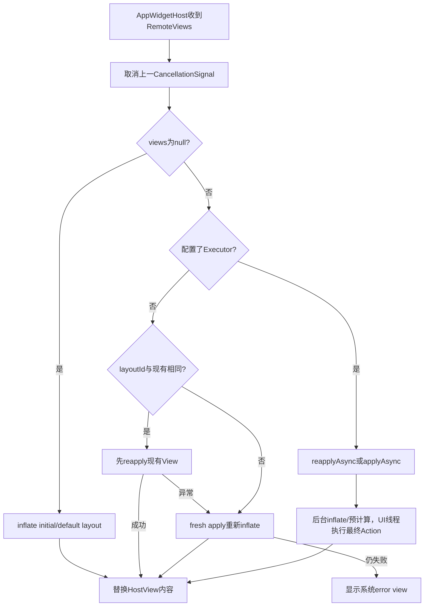
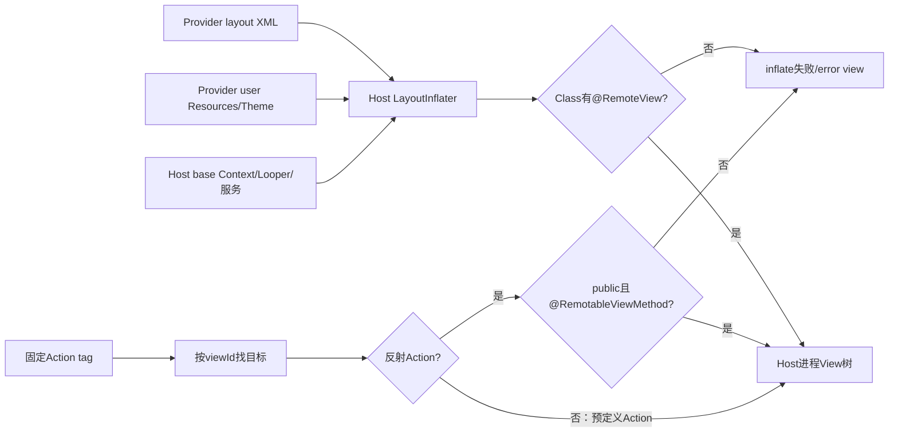
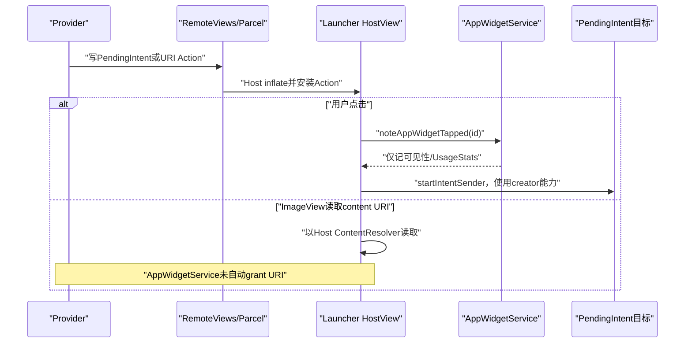

# 第 362 章 Android RemoteViews Host执行：资源上下文、受限Inflate、Action沙箱、点击与异步取消链

> 源码基线：Android 11 / API 30 / `android-11.0.0_r48`。本章只在macOS阅读源码，不编译。上一章把RemoteViews送到Host，本章进入Launcher进程：Provider的布局资源怎样在Host中inflate，为什么自定义View和任意Java方法不能直接执行，apply/reapply怎样选择，PendingIntent点击用谁的身份，Content URI为什么不会自动授权，以及新更新取消旧异步任务后哪些回调根本不会发生。

## 1. RemoteViews解决的根问题

Provider与Launcher属于不同进程、甚至不同user。系统不能把Provider进程里的View对象跨Binder传过去，于是传布局身份和受限Action，让Host在自己的进程创建一棵受控View树。

## 2. 它不是远程代码执行

标准RemoteViews不会调用Provider的任意业务回调，也不会把Provider Activity的View实例搬进Launcher。真正执行的是framework预定义Action、允许的View类和标注为可远程调用的方法。

## 3. 但也不是静态图片

Host会inflate真实TextView、ImageView、ListView等对象，应用属性、点击和集合Adapter，所以能适应密度、字体、方向和无障碍。安全性来自缩小可构造类与可调用方法集合。

## 4. 主入口AppWidgetHostView

`AppWidgetHostView.updateAppWidget(remoteViews)`调用`applyRemoteViews(remoteViews,true)`。这个FrameLayout保存当前内容View、layoutId、显示mode、点击处理器、可选异步Executor和最近CancellationSignal。

## 5. 三种显示mode

`VIEW_MODE_CONTENT`表示真实RemoteViews，`VIEW_MODE_DEFAULT`表示Provider尚未给内容时的initialLayout，`VIEW_MODE_ERROR`表示inflate/apply失败后的系统错误TextView。它们是Host运行态，不写AppWidget XML。

## 6. 每次更新先取消旧异步任务

`applyRemoteViews()`开头若`mLastExecutionSignal!=null`就cancel并清字段。目标是让更新B不要被较慢的更新A随后覆盖；取消只影响尚未完成的异步执行，不能反向撤销已经apply的View属性。

## 7. null RemoteViews进入默认态

若当前已经是DEFAULT，收到null直接返回；否则调用`getDefaultView()`、把layoutId设-1并切换DEFAULT。null不是必然显示空白，而是触发Provider元数据中的初始布局回退。

## 8. 非null先处理浅色背景

Host标记`mOnLightBackground`时调用`remoteViews.getDarkTextViews()`。若Provider设置了light-background布局id，`getLayoutId()`选择它；否则仍用普通布局。

## 9. 同步还是异步由Host决定

只有Host调用`setExecutor(nonNull)`且本次允许异步，AppWidgetHostView才走`inflateAsync()`；否则即使RemoteViews包含URI/Icon等偏好异步的Action，也在当前Host线程同步apply。

## 10. Host执行总图

## 11. 同步路径先尝试复用

新RemoteViews的`getLayoutId()`等于Host记录的`mLayoutId`时，先`reapply(mContext,mView,handler)`。成功就复用同一根View，减少inflate、对象分配和布局状态抖动。

## 12. reapply不是差量Action

它按当前RemoteViews的Action列表再次作用于现有树，并不计算新旧Action差异。若完整缓存里缺少某项恢复操作，旧View的某些运行态可能继续保留。

## 13. 同layoutId也可能不兼容

Provider升级或方向组合变化可能让同id资源结构不同，Action目标View类型也可变化。reapply抛RuntimeException后Host会退回fresh apply，而不是立即显示error。

## 14. fresh apply做两步

`RemoteViews.apply()`先选择当前方向的RemoteViews、调用`inflateView()`，再`performApply()`按列表顺序执行所有Action，最终返回尚未由RemoteViews自己attach到parent的根View。

## 15. 两次都失败才error

AppWidgetHostView分别捕获reapply和apply的RuntimeException；apply仍得不到content时，`applyContent()`记录错误并创建系统错误TextView。旧内容会被替换，而不是永久冻结在最后一帧。

## 16. Error只显示Host资源

`getErrorView()`用Host Context创建TextView，文字来自framework内部`gadget_host_error_inflating`，背景为半透明黑。Provider不能自定义错误界面。

## 17. 已在ERROR再失败会保持现状

`applyContent(content=null)`发现当前mode已是ERROR就直接返回，避免每次坏更新重复创建错误View。后续合法RemoteViews仍会重新尝试apply并可恢复CONTENT。

## 18. prepareView统一根布局参数

新内容若没有FrameLayout.LayoutParams就补MATCH_PARENT；随后强制gravity CENTER，再加入AppWidgetHostView。Provider可请求尺寸，但Host容器仍掌握最终cell和边界。

## 19. Root namespace防id碰撞

AppWidgetHostView构造时`setIsRootNamespace(true)`，把Widget内部viewId查找与Launcher外层View树隔离。Provider布局id和Host界面id即使数值相同，也不应越过这个命名空间。

## 20. Provider资源从哪里来

RemoteViews保存`ApplicationInfo mApplication`。`getContextForResources()`在Host user/package与其不同的情况下，用该ApplicationInfo创建`CONTEXT_RESTRICTED` ApplicationContext，从正确Provider user加载resources/theme。

## 21. 跨profile不偷换成Host资源

工作资料Provider的资源id可能与个人user同包版本不同；按mApplication uid创建资源Context，保证布局、字符串、drawable来自Provider所属user安装实例。

## 22. RemoteViewsContextWrapper是关键

inflate时新建`RemoteViewsContextWrapper(hostContext,contextForResources)`：它的base仍是Host Context，只重写Resources、Theme、packageName与isRestricted指向Provider资源Context。

## 23. 资源与能力被刻意拆开

布局解析看到Provider资源和主题，但未重写的系统服务、ContentResolver、类加载等仍从Host base Context继承。这能让远端资源显示，又避免把完整Provider运行环境塞进Launcher。

## 24. isRestricted也取Provider资源Context

包装器特意重写`isRestricted()`，注释说字体等风险资源加载会检查它。Provider资源Context以`CONTEXT_RESTRICTED`创建，因此受限资源规则继续生效。

## 25. inflate使用Host取得的Inflater

代码从传入Host Context获取LayoutInflater，再`cloneInContext(inflationContext)`。不会把filter装到Context持有的共享Inflater，避免一个Widget的安全过滤污染Host其它布局inflate。

## 26. 默认view路径稍有不同

`AppWidgetHostView.getDefaultView()`直接在`getRemoteContext()`得到的Provider受限Context上clone inflater，再设置同样的`@RemoteView`过滤器。它用于initialLayout，而非Provider提交的RemoteViews Action流。

## 27. 默认资源Context创建失败会回Host

若Provider包找不到，`getRemoteContext()`记录错误并返回Host Context。随后Provider资源id大概率inflate失败并进入error；这个fallback保证方法有Context，不保证资源语义正确。

## 28. initialLayout的category选择

默认view先读实例options；Host category为KEYGUARD且Provider声明`initialKeyguardLayout!=0`时用锁屏布局，否则用普通initialLayout。上一章默认HOME category会影响这里。

## 29. 默认view点击不是配置Activity

若根不是AdapterView，Host给默认view设置点击：通过LauncherApps查询Provider包在其profile的主Activity并启动列表第一项。它不是`info.configure`，也不是Provider自定义PendingIntent。

## 30. AdapterView默认根不装普通点击

源码明确AdapterView不支持这种OnClickListener回退，因此跳过。集合Widget的点击应由RemoteViews的template/fill-in协议提供。

## 31. 允许inflate的类由注解决定

标准filter只返回`clazz.isAnnotationPresent(RemoteViews.RemoteView.class)`。TextView、ImageView、LinearLayout、ListView、Chronometer等framework类显式带`@RemoteView`。

## 32. 任意自定义View默认被拒绝

Provider XML写普通自定义类时，LayoutInflater解析到类后filter返回false并抛inflate异常。RemoteViews因此不是把第三方View构造函数带进Launcher的通用容器。

## 33. 子类不会自动继承允许资格

`@RemoteView`没有`@Inherited`，文档也明确支持类的descendants不受支持。自定义TextView子类不能因为父类允许就自动通过。

## 34. filter检查类，不检查XML标签字符串

LayoutInflater先解析并获得Class，再交Filter判断；安全边界是实际Class的运行时注解，不是仅靠`<TextView>`名字白名单。

## 35. RemoteViews子类的filter扩展

纯`RemoteViews.class`使用轻量静态filter；子类可令`shouldUseStaticFilter()`为false，从而调用实例`onLoadClass()`。但公开注释说明应用重写不会影响真正渲染进程，第三方不能把它当绕过Host过滤的契约。

## 36. onLoadClass已deprecated

默认实现仍只认`@RemoteView`。它主要为系统/历史扩展保留，不是App Widget开发者注册自定义控件的API。

## 37. Parcel Action也有固定tag表

RemoteViews反序列化逐个读取整数tag，switch只构造已知Action类型；未知tag抛ActionException。Provider不能在Parcel里注入任意Action子类让Host反序列化执行。

## 38. 嵌套深度有入口限制

Parcel构造在非SYSTEM appId调用来源下检查`MAX_NESTED_VIEWS=10`，过深抛`IllegalArgumentException`。它覆盖`addView(nested)`和横竖组合递归，降低栈/资源滥用。

## 39. system调用来源豁免深度

检查使用`Binder.getCallingUid()`的appId。Provider把RemoteViews送入system_server时普通uid受限；system再转发Host时可能以SYSTEM身份反序列化，但危险对象已在第一次入口经过检查。

## 40. Action执行按序

`performApply()`遍历mActions，依序`a.apply(root,parent,handler)`。后Action可以覆盖前Action对同一属性的结果，Action中途异常会停止后续执行并让Host进入fallback/error链。

## 41. 找不到目标View常被静默跳过

许多Action先`root.findViewById(viewId)`，null就return。这种布局/Action错配可能不抛异常，只表现为某属性未更新；调试不能只搜索error view。

## 42. ReflectionAction不是任意反射

它根据有限type映射出boolean/int/CharSequence/Uri/Bitmap/Icon等参数Class，再调用`getMethod(view,methodName,paramType,async)`。

## 43. 方法必须public且签名精确

`klass.getMethod()`只找public方法，参数Class必须精确匹配Action编码。不存在或不可访问会包装成ActionException。

## 44. 还必须有RemotableViewMethod

即使View有同名public setter，未标`@RemotableViewMethod`也被拒绝。Provider不能借`setInt(id,"任意方法",value)`调用Launcher View的普通public API。

## 45. 方法缓存的key

静态`sMethods`以View class、参数class和methodName缓存MethodArgs，并在同步块内访问；重复Action避免每次反射解析。缓存结果属于Host进程全局。

## 46. 同步调用用MethodHandle

校验注解后通过`MethodHandles.publicLookup().unreflect(method)`得到同步handle，再invoke目标View。反射异常或目标方法异常统一包为ActionException。

## 47. 异步实现由注解显式声明

`@RemotableViewMethod(asyncImpl="...")`可指定同参数、返回Runnable的后台方法。没有asyncImpl时异步准备阶段返回原Action，最终仍在UI线程执行同步setter。

## 48. async方法不是自动在线程池调用任意setter

framework控件作者必须提供专门asyncImpl，它可在后台加载URI/Icon并返回UI线程Runnable。系统不把普通View方法盲目搬到后台。

## 49. 错误的async声明也会失败

注解给了方法名却找不到满足`public Runnable asyncMethod(args)`的实现时，getMethod抛ActionException。Host异步reapply随后尝试fresh apply，仍失败才显示error。

## 50. URI和Icon偏好异步

ReflectionAction的`prefersAsyncApply()`对URI/Icon返回true，但AppWidgetHostView是否异步仍取决于Host设置Executor。这个hint不自行创建线程。

## 51. 受限执行结构图

## 52. View树运行在哪个线程

同步apply通常由AppWidgetHost的UpdateHandler所在Looper调用，默认主线程；异步apply把inflate/可预计算部分交Executor，最终Action和HostView替换仍回AsyncTask的post执行线程，通常主线程。

## 53. applyAsync先选方向

`getAsyncApplyTask()`先按Host Context当前Configuration取landscape或portrait对象。任务启动后方向再变化不会自动切换这个选择；新的配置/更新应触发下一次apply。

## 54. 后台阶段做什么

若不是reapply，先`inflateView()`；随后建立ViewTree，并依次调用每个Action的`initActionAsync()`，得到可在post阶段执行的Action数组。

## 55. ViewTree只索引可查id

它跳过root namespace，保存有非0 id的节点；无id View的children继续挂到最近可索引祖先。异步嵌套add/remove用这棵结构预演树变化。

## 56. 后台inflate仍创建View对象

async并不只是解析XML字节，它在Executor线程构建View树。framework允许这条专用路径，但最终触碰UI可见状态的Runnable仍在post阶段执行。

## 57. onViewInflated发生在post阶段

AsyncTask完成后先回调listener.onViewInflated(root)，此时后台inflate已完成但最终Action尚未应用。这个回调不是“布局已经显示”。

## 58. 最终Action逐个执行

onPostExecute用自定义handler或DEFAULT handler依次apply准备后的Action。任一异常写mError并停止后续，然后回调onError。

## 59. listener为空时错误重新抛出

没有listener且mError非null，AsyncApplyTask在post阶段抛ActionException。AppWidgetHostView总会提供ViewApplyListener，因此它走回退/error UI而不是让异常无处理地冒泡。

## 60. reapplyAsync复用现有根View

它把现有v传给AsyncApplyTask，后台不inflate，只建ViewTree和预计算Action。成功时listener把`mIsReapply=true`传给applyContent，不重新add/remove根View。

## 61. 横竖组合额外校验root id

RemoteViews同时含landscape/portrait时，reapply先比较View根tag里的旧实际layoutId与当前方向选中layoutId；不一致直接抛，防止把一套Action套到完全不同结构。

## 62. Host自身layoutId只是第一道快路径

AppWidgetHostView按`remoteViews.getLayoutId()==mLayoutId`决定尝试reapply；组合RemoteViews的公开getLayoutId偏向portrait。真正方向安全还依赖RemoteViews内部root tag校验。

## 63. reapply失败会fresh apply

同步路径catch RuntimeException后继续apply；异步路径ViewApplyListener收到reapply error后启动一次`mViews.applyAsync()`。Provider无需另发更新即可获得一次完整重建机会。

## 64. fresh async失败才error view

第二次listener的`mIsReapply=false`，onError调用`applyContent(null,false,e)`。它与同步路径最终错误行为对齐。

## 65. FLAG_REAPPLY_DISALLOWED在此未消费

RemoteViews定义这个flag用于布局被不可恢复修改时禁止reapply，但r48 AppWidgetHostView和RemoteViews reapply路径中未见对应判断。当前是否尝试复用主要由layoutId与组合root tag决定。

## 66. 这是版本实现缺口

不能因为常量注释存在就写“Host必定尊重该flag”。未来版本可能补消费者，本章只陈述r48本地全树搜索结果。

## 67. CancellationSignal怎样连接任务

AsyncApplyTask创建signal并把自己设为OnCancelListener；Host调用signal.cancel()后执行`AsyncTask.cancel(true)`，后台循环会在每个Action之间检查`isCancelled()`。

## 68. 嵌套任务取消检查不完整

源码TODO明确“check if isCancelled in nested views”。外层取消可能不能立即停止正在递归准备的nested RemoteViews，CPU工作仍可延续一段时间。

## 69. cancel不会回调onError

AsyncApplyTask没有覆写onCancelled；被取消后通常不走onPostExecute，所以ViewApplyListener既收不到onViewApplied也收不到onError。取消是静默淘汰旧代际。

## 70. 旧UI在新任务完成前保留

新更新先cancel旧任务，再启动新apply/reapply；Host不会先清当前mView。新任务成功才替换，失败才进入error，因此取消本身不造成闪空。

## 71. cancel不是强制回滚

若旧任务已经进入UI post并执行了部分Action，后来cancel不能撤销这些副作用。代际正确性依赖Host Looper顺序与尽早取消，不是数据库事务。

## 72. setExecutor也会取消进行中任务

Host运行时切换Executor时先cancel旧signal、清字段，再保存新Executor；它不会自动重放被取消RemoteViews，调用者若要继续需再updateAppWidget。

## 73. 完成后signal没有立即清null

ViewApplyListener成功/失败路径未统一把`mLastExecutionSignal=null`。下一更新会对一个可能已完成的signal再cancel，通常无害，但字段不精确表示“任务仍在跑”。

## 74. Action次序在async仍保留

后台按原列表生成mActions数组，UI post也顺序apply。某些asyncImpl提前加载资源，但不能跨越前后Action随意重排最终View操作。

## 75. nested add如何异步

ViewGroupActionAdd会递归调用子RemoteViews的后台任务，更新ViewTree，最后返回RuntimeAction，在UI阶段执行子task post逻辑并`target.addView()`。

## 76. nested remove如何异步

后台先修正ViewTree中的children模型，最终RuntimeAction在UI线程removeAllViews或保留指定id。后续Action的异步findView可按预计新结构解析。

## 77. RuntimeAction不能Parcel

它只在Host异步准备期间生成，`writeToParcel()`直接抛UnsupportedOperationException。Provider无法从Binder输入伪造一个RunnableAction携带任意Runnable。

## 78. 点击Action只安装监听器

`SetOnClickResponse.apply()`找到目标后保存PendingIntent tag，并设置OnClickListener；真正Intent直到用户点击才发送。apply成功不是Activity已启动。

## 79. AppWidgetHostView包装点击处理器

每次点击先调用`AppWidgetManager.noteAppWidgetTapped(appWidgetId)`，再交自定义Host handler；没有自定义handler才调用`RemoteViews.startPendingIntent()`。

## 80. note tapped不是授权PendingIntent

服务要求Launcher uid当前进程态为TOP并能访问Widget，随后给Provider uid更新AppOps可见性并报告UsageStats USER_INTERACTION。失败/非TOP只跳过记账，点击handler仍继续。

## 81. 自定义Host可以截获发送

Host提供OnClickHandler时可决定怎样处理并返回boolean。AppWidgetService只在apply前传入handler，不强迫Launcher一定send；但tap可见性记账已经先尝试。

## 82. 默认发送通过IntentSender

`startPendingIntent()`调用点击View Context的`startIntentSender()`，附fill-in Intent与ActivityOptions。异常被捕获、记录并返回false，不让Launcher因坏PendingIntent崩溃。

## 83. 执行身份来自PendingIntent creator

虽然发送动作发生在Host进程，PendingIntent封装的是Provider创建时由系统登记的creator身份与目标。Host获得的是可发送能力，不等于以Launcher uid重新构造Provider Intent。

## 84. fill-in不能无限覆盖模板

集合点击由父AdapterView保存PendingIntent template，item RemoteViews提供fill-in Intent；最终哪些字段可填取决于PendingIntent创建时模板留空与mutable语义，fill-in不是越过creator边界的任意Intent。

## 85. 普通View用直接PendingIntent

`setOnClickPendingIntent()`在非collection child上有效。目标是collection item且Provider target场景受限制时会警告并跳过，应使用template+fill-in。

## 86. collection child标志决定协议

来自RemoteViewsFactory的item会带`FLAG_WIDGET_IS_COLLECTION_CHILD`：直接PendingIntent受限，fill-in才允许；非collection RemoteViews调用fill-in则记录error并忽略。

## 87. fill-in必须找到AdapterView祖先

点击时从item向上找AdapterView，若先遇到非RemoteViewsFrameLayout的AppWidgetHostView或null就失败。随后还要求祖先tag确实是PendingIntent template。

## 88. 点击与URI能力图

## 89. source bounds来自真实点击View

RemoteResponse把View屏幕坐标乘兼容缩放生成Rect，并放入fill-in Intent的sourceBounds。目标Activity可据此决定过渡起点。

## 90. ActivityOptions由Host环境生成

默认可能使用RemoteViews专用开启动画、共享元素或basic options，并统一设置NEW_TASK launch flag。Provider PendingIntent原附options可能被覆盖，这是API文档明确边界。

## 91. 共享元素必须找到Activity Context

AppWidgetHostView沿ContextWrapper向上找Activity；找不到就不生成scene transition。声明了shared view id/name也不保证一定有共享元素动画。

## 92. 共享元素缺失会被跳过

只把当前HostView中能find到的view加入数组；一个都没有返回null，RemoteResponse继续回退basic ActivityOptions。

## 93. URI Action有哪些来源

ReflectionAction的URI值和Icon的TYPE_URI/TYPE_URI_ADAPTIVE_BITMAP会通过`visitUris()`报告；TextView drawable等Action也有自己的URI访问点。实际加载发生在Host控件Action中。

## 94. AppWidgetService没有调用visitUris

本地`frameworks/base`全树搜索显示NotificationRecord会遍历Notification URI，但AppWidgetServiceImpl没有对RemoteViews调用`visitUris()`或UriGrantsManager授权。

## 95. URI不会因进入RemoteViews自动可读

包装Context的ContentResolver继承Host base Context；`setImageViewUri(content://...)`最终由Launcher进程访问Provider。Provider必须让Host已有权限或显式提供可访问URI，不能把RemoteViews当自动grant载体。

## 96. 跨profile URI更敏感

Provider资源Context能跨user加载APK资源，不等于Host自动获得跨user ContentProvider数据权限。工作资料内容URI仍受user、provider exported/grantUriPermissions与UriGrant规则约束。

## 97. visitUris只是枚举接口

它调用各Action visitor，本身不检查权限、不创建grant、不打开流。某个消费者要自动授权，必须像Notification链那样另有服务端逻辑。

## 98. 组合和嵌套URI枚举需谨慎

r48顶层`visitUris()`只遍历当前mActions；横竖组合根和ViewGroupActionAdd未在所见代码中递归覆盖visitor。即使未来AppWidget接入枚举，也需审计嵌套覆盖完整性。

## 99. Resource id不需要Content URI grant

`setImageViewResource()`或布局drawable通过Provider Resources Context加载，权限模型不同于content URI。优先资源id/Bitmap/Icon资源可减少Host跨包Provider访问问题，但Bitmap仍受上一章内存上限。

## 100. DEFAULT、CONTENT、ERROR的恢复路线

Provider未更新时DEFAULT；合法RemoteViews成功变CONTENT；错误变ERROR；下一份合法更新可重新CONTENT；RemoteViews为null则回DEFAULT。三态转换不依赖重绑appWidgetId。

## 101. ProviderInfo变化会reset

Host收到providerChanged时`resetAppWidget()`先更新Info、把mode设NOINIT，再`updateAppWidget(null)`，因此立即展示新initialLayout，等待Provider新的RemoteViews。

## 102. light background clone的细节

`getDarkTextViews()`暂时给原对象加flag、复制RemoteViews、finally清原flag。若light layout id为0，`getLayoutId()`仍回普通id，不会尝试inflate资源0。

## 103. 横竖RemoteViews必须同应用身份

构造组合对象时要求landscape与portrait的ApplicationInfo包和uid相同，否则抛RuntimeException。不能用方向切换偷偷引用另一个包/user的布局。

## 104. clone只允许root

RemoteViews.clone()检查`mIsRoot`，已作为nested child的对象不能单独clone。嵌套层共享BitmapCache，避免脱离根缓存后bitmap索引失配。

## 105. apply完成不等首帧显示

View树创建/Action完成后还要requestLayout、measure/layout/draw、RenderThread、Surface与合成。OnViewApplied只说明Host UI对象已应用，不是屏幕present时间。

## 106. 调试inflate失败顺序

先看layout资源属于哪个user/package，再看根和子View是否`@RemoteView`，随后看Action目标id/类型与`@RemotableViewMethod`，再区分reapply失败是否fresh apply成功，最后检查error view日志。

## 107. 调试异步覆盖

记录每次update、CancellationSignal.cancel、任务doInBackground、onViewInflated/onApplied/onError和HostView mode/layoutId。被cancel的任务没有listener终态，不能把缺onError当成功。

## 108. 调试点击

分清OnClickListener是否安装、collection标志/template/fill-in祖先是否满足、自定义Host handler是否吞掉、PendingIntent是否取消，以及noteTapped TOP门；note失败不等PendingIntent一定没发。

## 109. 调试URI

用URI scheme区分resource/bitmap/content，确认真正打开流的是Host uid/user；检查Provider是否grant给实际Launcher包以及grant生命周期。不要在AppWidgetService寻找不存在的自动visit/grant链。

## 110. 安全心智模型

Provider控制“选哪个允许布局、给哪些受限Action和能力token”，Host控制“在哪里、何时、用哪个Looper/Executor、是否发送点击”；framework控制允许类、允许方法、Parcel Action和异常回退。

## 111. 本章源码入口

重点读`AppWidgetHostView.applyRemoteViews/inflateAsync/ViewApplyListener/getDefaultView/getHandler`，`RemoteViews.inflateView/apply/reapply/AsyncApplyTask/getMethod/RemoteResponse`，再用全树`rg visitUris`验证URI消费者。

## 112. macOS只读练习一：还原两层Context

静态阅读`getContextForResources()`与`RemoteViewsContextWrapper`，列出Resources、Theme、packageName、isRestricted、ContentResolver、SystemService各来自Provider还是Host；再推演parent→managed profile资源加载，不编译。

## 113. macOS只读练习二：验证类与方法沙箱

执行`rg -n "@RemoteView|RemotableViewMethod|getMethod\(" frameworks/base/core/java/android/widget frameworks/base/core/java/android/view`，任选TextView的一个允许setter和一个未标注public方法，说明XML filter与Action反射为什么是两道独立门。

## 114. macOS只读练习三：推演异步取消

从`AppWidgetHostView.applyRemoteViews()`追到`AsyncApplyTask`，假设更新A正在准备第5个Action时更新B到来，写出cancel标志、旧UI、listener回调、新任务和最终replace状态；特别注明cancel没有onError。

## 115. macOS只读练习四：审计点击与URI

分别从`SetOnClickResponse→RemoteResponse→startPendingIntent`和`ReflectionAction.visitUris→ImageView URI async`追踪，标出PendingIntent creator身份、Host自定义handler、ContentResolver身份，并用全树搜索证明AppWidgetService没有自动URI grant。

## 116. 复读修正一：不是“使用Provider Context执行”

初读容易把createApplicationContext概括成整套Provider Context；复读wrapper确认只覆盖资源/主题/包名/isRestricted，base仍为Host。正文因此把资源归属与执行能力拆开。

## 117. 复读修正二：取消不是失败回调

AsyncApplyTask只实现OnCancelListener并调用`cancel(true)`，未覆写onCancelled通知listener。正文删除“旧任务onError后自动fresh apply”的误读；fresh fallback只针对真正reapply error。

## 118. 复读修正三：URI枚举不等授权

全树确认visitUris在Notification链有消费者，而AppWidgetService没有。正文不再声称RemoteViews会自动把URI权限授予Launcher，并补上跨profile数据权限边界。

## 119. 本章心智模型

RemoteViews是一门受限UI指令语言：Provider资源在Host沙箱内被解释，类注解、方法注解、固定Action tag与嵌套上限缩小攻击面；异步只搬可安全准备的工作，点击依赖能力token，URI仍走真实Host权限。

## 120. 下一章入口

集合Widget还多一个RemoteViewsService/Factory进程、Adapter连接、每项RemoteViews缓存、viewTypeCount、加载占位、数据变化与引用销毁协议。下一章沿ListView/GridView/StackView进入跨进程集合数据链。
