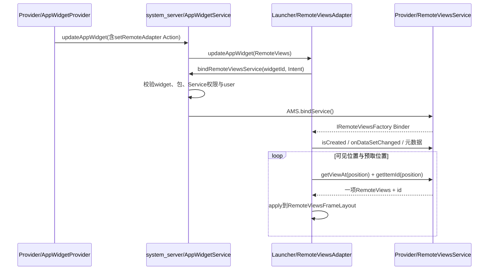
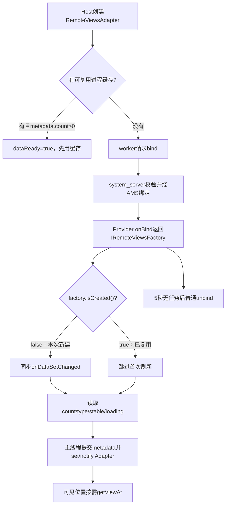
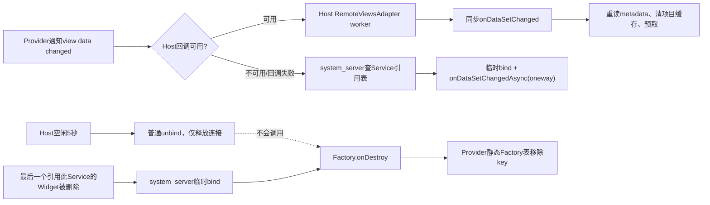

# 第 363 章 Android AppWidget集合：RemoteViewsService、Factory、Adapter绑定、缓存、刷新与销毁链

> 源码基线：Android 11 / API 30 / `android-11.0.0_r48`。本章只在macOS阅读源码，不编译。上一章解释了单个RemoteViews怎样在Launcher中安全执行；本章把视角放到ListView、GridView、StackView等集合Widget：Provider进程怎样按需生产每一项，Launcher怎样显示loading并预取缓存，system_server怎样校验远程Service、登记引用、离线刷新和触发销毁。文中“Host”通常指Launcher进程，“Provider”指Widget应用进程。

## 1. 为什么集合Widget不能一次塞完

普通Widget更新可以携带一棵RemoteViews；但列表可能有数百项，每项还有图片。若Provider一次把全部项目跨Binder发给system_server和Launcher，Parcel大小、Bitmap内存和更新时间都会失控，所以集合控件采用“远程Adapter”：Host只按当前可见位置向Provider取一项RemoteViews。

## 2. 先建立三端模型

集合链不是两个类直接互调，而是三端协作：Provider进程运行`RemoteViewsService`与`RemoteViewsFactory`；Launcher进程运行`RemoteViewsAdapter`和集合View；system_server中的`AppWidgetServiceImpl`验证绑定资格并记录哪个Widget引用哪个Service。

## 3. 四类对象不要混为一个

`RemoteViewsService`是Android Service组件；`RemoteViewsFactory`是应用实现的数据工厂；`RemoteViewsFactoryAdapter`是Service内部暴露的Binder Stub；`RemoteViewsAdapter`是Launcher本地的`BaseAdapter`。名字都带RemoteViews，却处在不同层级。

## 4. Provider在Widget布局里只放集合容器

Provider提交的顶层RemoteViews可包含ListView、GridView、StackView或AdapterViewFlipper。它不直接附带普通本地Adapter，而是用`setRemoteAdapter(viewId, intent)`把显式Service Intent编码成Action，等Host apply时建立远程Adapter。

## 5. Intent是工厂身份的一部分

Host真正连接的不是一个Java Factory对象引用，而是一个Intent所标识的RemoteViewsService端点。系统和Provider都会把Intent转换成`Intent.FilterComparison`用于相等比较，因此理解哪些Intent字段参与比较非常重要。

## 6. extras通常不参与FilterComparison

action、data、type、identifier、package、component和categories等过滤字段参与；extras不参与。仅在extras里放`appWidgetId`，并不能保证每个Widget实例得到独立Factory。

## 7. RemoteViewsAdapter还会移除两个内部extra

构造时它读取并删除`EXTRA_REMOTEADAPTER_APPWIDGET_ID`与`EXTRA_REMOTEADAPTER_ON_LIGHT_BACKGROUND`，然后才保存实际Service Intent。前者另用于Host进程缓存key，后者控制项目RemoteViews的浅色背景变体，不会传给Provider工厂。

## 8. 每实例数据怎样安全区分

若同一Provider的多个Widget实例必须使用不同数据，常见做法是把`appWidgetId`编码到Intent的data URI，例如`content://widget/items/42`，同时仍可保留extra方便读取。data参与FilterComparison，Factory身份才真正分开。

## 9. 只改extra的隐蔽后果

两个实例Service Intent若过滤字段相同、只有extra不同，它们会共享Provider进程中的同一个Factory；后创建的绑定也不会再次调用`onGetViewFactory()`。开发者若以为每次bind都会读取新的extra，就会看到列表串数据。

## 10. 集合Widget总链路



## 11. RemoteViewsService的公开职责

应用继承`RemoteViewsService`并实现`onGetViewFactory(Intent)`，返回Factory。Service本身已经实现`onBind()`和Binder协议，应用通常不应再设计一套自定义AIDL来喂集合项。

## 12. Factory提供什么数据

接口包含`onCreate()`、`onDataSetChanged()`、`onDestroy()`、`getCount()`、`getViewAt()`、`getLoadingView()`、`getViewTypeCount()`、`getItemId()`和`hasStableIds()`。它类似Adapter数据源，但方法会经Binder在Provider进程执行。

## 13. Provider进程有静态Factory表

源码中的`sRemoteViewFactories`是进程静态`HashMap<Intent.FilterComparison, RemoteViewsFactory>`，并由静态`sLock`保护。它不是system_server全局表，也不会跨Provider进程重启保存。

## 14. 第一次bind怎样创建Factory

`onBind()`持有`sLock`，未找到key时调用`onGetViewFactory(intent)`、放入静态表、再调用`factory.onCreate()`，返回一个`RemoteViewsFactoryAdapter(factory, false)`；`false`表示这次是新创建。

## 15. 已存在时怎样复用

相同FilterComparison再次bind时直接取现有Factory，不再调用`onGetViewFactory()`和`onCreate()`，并返回另一个包装同一Factory的Binder Adapter，其中`isCreated()`返回`true`。

## 16. isCreated名字容易读反

它不是“对象当前是否有效”，而是“在本次bind之前Factory是否已经存在”。新Factory已经执行完`onCreate()`，其Adapter却返回false；Launcher据此决定还要不要做首次`onDataSetChanged()`。

## 17. 首次建立的实际回调次序

在Android 11这条链上，新Factory先在Service主线程执行`onCreate()`；连接成功后，Launcher工作线程调用`isCreated()`得到false，再同步调用`onDataSetChanged()`，之后读取count、type等元数据。不要把onCreate当成唯一的首次加载点。

## 18. 复用Factory会跳过首次刷新

若`isCreated()`为true，`RemoteViewsAdapter`连接时不会主动调用`onDataSetChanged()`，而是直接读当前元数据。Factory应让已有数据快照保持可读；需要新数据时应由Provider调用`notifyAppWidgetViewDataChanged()`。

## 19. onGetViewFactory与onCreate在哪个线程

`RemoteViewsService.onBind()`通常由Service主线程执行，所以Factory创建和`onCreate()`处于Provider主线程。耗时I/O若直接放这里，会拖慢bind甚至制造应用卡顿。

## 20. 后续数据方法通常来自Binder线程

Launcher拿到IRemoteViewsFactory后，从其工作线程发同步Binder调用；Provider Stub方法运行在Binder线程池，而不是保证回到Service主线程。Factory不能默认所有方法都在同一线程。

## 21. AIDL同步与oneway分组

Android 11的AIDL中，`onDataSetChanged()`、查询元数据和取项目是同步调用；`onDataSetChangedAsync()`与`onDestroy(Intent)`标为oneway。同步意味着调用者等待结果，oneway只表示Binder不等待远端完成。

## 22. Async不代表自动创建专用线程

Stub里的`onDataSetChangedAsync()`只是直接调用同一内部实现；它没有自己创建HandlerThread。所谓async是相对Binder调用方不等待，Provider端仍在接收该事务的Binder线程执行。

## 23. Stub多数方法带synchronized

`RemoteViewsFactoryAdapter`的`getCount()`、`getViewAt()`等多数方法声明为`synchronized`，可以串行化“经过同一个Binder包装对象”的调用，避免该包装器同时进入Factory。

## 24. 但锁不是Factory全局锁

同一个FilterComparison被多次bind会生成多个`RemoteViewsFactoryAdapter`，它们共享Factory却各有自己的对象监视器。两条连接通过两个包装器调用时仍可能并发进入同一个Factory。

## 25. onDestroy还使用另一把锁

销毁路径同步的是Service静态`sLock`，不是某个Adapter包装器的`synchronized`锁，因此Factory的`onDestroy()`也可能与正在执行的`getViewAt()`或刷新并发。应用应自行建立可靠的数据锁或不可变快照。

## 26. 推荐不可变快照模型

`onDataSetChanged()`在本地变量中完整读取数据库/文件，构造不可变List，最后在短锁内替换`mSnapshot`；`getCount()`和`getViewAt()`先抓取同一份snapshot引用再读取。这样避免边读边清空造成越界或一半新一半旧。

## 27. getViewAt返回的是描述不是View

Factory为某位置创建`RemoteViews`，其中写行布局包名、layoutId和有限Action。真正的View对象仍由Launcher进程inflate；Provider不能把自定义View实例跨进程返回。

## 28. 集合子项会被系统加标志

Stub收到非null项目后调用`addFlags(FLAG_WIDGET_IS_COLLECTION_CHILD)`。该标志告诉RemoteViews后续点击等行为这是集合子项，Provider无需也不应依赖自己伪造完整Host状态。

## 29. Factory实现的最小骨架

```java
final class ItemsFactory implements RemoteViewsService.RemoteViewsFactory {
    private volatile List<Item> snapshot = Collections.emptyList();

    public void onCreate() { /* 只做轻量初始化 */ }
    public void onDataSetChanged() { snapshot = repository.loadSnapshot(); }
    public int getCount() { return snapshot.size(); }
    public RemoteViews getViewAt(int position) {
        Item item = snapshot.get(position);
        RemoteViews row = new RemoteViews(pkg, R.layout.widget_row);
        row.setTextViewText(R.id.title, item.title);
        return row;
    }
    public void onDestroy() { snapshot = Collections.emptyList(); }
    public int getViewTypeCount() { return 1; }
    public long getItemId(int position) { return snapshot.get(position).id; }
    public boolean hasStableIds() { return true; }
    public RemoteViews getLoadingView() { return null; }
}
```

## 30. 示例中的volatile还不包办一致性

volatile保证snapshot引用发布可见，但`getViewAt()`和`getItemId()`是两次独立Binder查询，期间仍可能发生下一次快照替换。若稳定ID和行内容必须严格同版本，应让刷新过程、查询策略与业务容忍度一起设计。

## 31. 异常处理并非安全吞掉

Stub捕获Factory抛出的异常后调用默认`UncaughtExceptionHandler.uncaughtException(thread, ex)`，再准备fallback值。默认处理器可能直接终止Provider进程，所以不要理解成“抛异常只返回空行、不影响进程”。

## 32. 各方法fallback值

源码准备的回退包括count为0、RemoteViews为null、viewTypeCount为0、itemId为0、stableIds为false。但进程若已被默认处理器结束，这些返回值未必真能稳定送回Host。

## 33. onGetViewFactory返回null也不是合法空列表

首次bind代码随后会调用`factory.onCreate()`；返回null会触发失败，而不是形成count=0工厂。空数据应返回真实Factory，并让`getCount()`返回0。

## 34. Host为何需要自己的工作线程

`RemoteViewsAdapter`构造`HandlerThread("RemoteViewsCache-loader")`，绑定、同步Binder查询、预取与部分异步apply准备都在该Looper上调度，避免Launcher UI线程直接等待Provider数据库或Binder。

## 35. 主线程Handler有一个前置条件

构造器使用`new Handler(Looper.myLooper(), this)`创建主回调Handler，而不是硬编码`getMainLooper()`。因此调用构造器的线程必须已有Looper；framework正常从Host View执行时通常就是Launcher UI线程。

## 36. 可选的异步item Executor

当`isAsync`为true，`RemoteViewsFrameLayout`把同一个worker线程Executor交给AppWidgetHostView异步apply。Binder取数据和异步inflate准备仍共用线程，不意味着无限并行。

## 37. 绑定请求为何不会无限重复

worker端`mBindRequested`记录是否已经发出绑定，多个缺失行同时调用`requestBindService()`不会各自bind一次。连接或解绑状态改变后再按需重置。

## 38. system_server先确认Widget归属

`bindRemoteViewsService()`在锁内按调用uid、package和appWidgetId查找Widget，要求实例与Provider都存在。Host不能拿任意数字去绑定别人的Widget数据服务。

## 39. Service必须与Provider同包

system_server取Intent显式component，并要求其package等于Widget Provider package。集合行数据服务不能被重定向到另一个普通应用包。

## 40. Service必须声明专用权限

PackageManager查询Provider user下的精确Service，要求其声明`android.permission.BIND_REMOTEVIEWS`。这是signature级绑定门，阻止普通应用自行bind并遍历Widget私有行数据。

## 41. 必须使用显式Intent

Android 11实现直接使用`intent.getComponent().getPackageName()`，未对null component做友好分支。隐式Intent不仅无法满足精确校验，还可能在这里触发空指针；Provider应始终设置RemoteViewsService component。

## 42. 绑定到哪个user

Service解析和AMS.bindService都使用Provider所属userId，而不是简单使用Host当前user。工作资料Widget因此连接工作资料内安装的Provider Service和资源。

## 43. 谁是实际绑定客户端

system_server把Host传来的ApplicationThread、activityToken和IServiceConnection交给AMS，同时替Host完成安全校验。生命周期与进程重要性关系仍以Host这次bind为基础，不是把system_server永久当业务客户端。

## 44. 绑定flag含义

RemoteViewsAdapter请求`BIND_AUTO_CREATE | BIND_FOREGROUND_SERVICE_WHILE_AWAKE`。前者允许需要时创建Provider Service；后者影响设备清醒时绑定Service的调度/重要性，但不等于应用自己启动了前台服务通知。

## 45. 连接回调在哪个线程

Host创建ServiceDispatcher时指定RemoteViewsAdapter worker Handler，因此`onServiceConnected()`在缓存加载线程处理。接下来同步查询不会堵住Launcher主线程。

## 46. 连接后先保存IRemoteViewsFactory

`onServiceConnected()`把Binder转成接口、安排5秒延迟解绑，然后决定是处理积压的data changed，还是进行首次元数据加载。Binder连接本身不表示Adapter已能立即渲染全部行。

## 47. 首次元数据读取内容

worker依次获取`hasStableIds()`、`getViewTypeCount()`、`getCount()`和`getLoadingView()`，写入临时metadata；完成后发送消息到主线程原子式提交，并通知集合View建立/刷新Adapter。

## 48. count大于零可能额外取第0项

若Factory没有自定义loading view且count>0，Host会调用`getViewAt(0)`，异步测量第一行高度，用作默认loading占位高度。第0项因此可能在真正显示之前就被生产一次，不能把getViewAt设计成有副作用的“一次性消费”。

## 49. 空列表的loading高度

count为0时无法测第0项；默认占位高度回退到50dp。通常空列表本身不会请求行View，但理解该常量有助于排查首次数据到达前的尺寸跳动。

## 50. 首次连接状态机



## 51. 为什么metadata要临时区

远端多个查询可能耗时或失败，若每取一个值就直接改主metadata，UI可能看到count已更新而type表仍是旧的混合状态。临时metadata收集完成后再在主线程提交，缩小不一致窗口。

## 52. viewTypeCount为什么加一

Factory报告的是业务行布局类型数量；Host在临时metadata中保存`factoryCount + 1`，把类型0留给loading view，真实RemoteViews布局类型从1开始映射。

## 53. 类型身份来自layoutId

RemoteViewsAdapter不是让Factory直接返回整数type，而是读取每项RemoteViews的`getLayoutId()`，把不同layoutId映射到本地type index。横竖组合等实际选择仍要结合RemoteViews自身规则理解。

## 54. 声明太少会怎样

若运行时出现的不同layoutId数量超过`getViewTypeCount()`承诺，缓存插入会拒绝该项并记录错误。症状可能是某类行长期停在loading，而不是Java Adapter常见的清晰编译错误。

## 55. 声明太多的代价

报告值必须至少覆盖所有可能行布局；过大虽不立即越界，却会让宿主认为类型空间更大并降低复用效率。应统计所有条件分支，而非简单返回数据总数。

## 56. loading type固定为0

项目尚未取回时`getItemViewType()`返回0；加载完成后返回其layoutId映射类型。Host因此能把占位FrameLayout先放入列表，数据回来再在同一容器apply真实RemoteViews。

## 57. getLoadingView返回null的语义

null不是“不显示任何东西”，而是让Host创建默认loading view。默认实现主要用测得高度或50dp占位，并不自动展示旋转进度条。

## 58. 错误View也可能看起来像loading

集合专用`RemoteViewsFrameLayout.getErrorView()`返回默认loading view。因此取行或apply失败时，视觉上可能只是空白占位一直存在；调试必须同时看log和Factory异常，不能只等显眼错误文字。

## 59. getView的缓存命中路径

若position已有RemoteViews，Host取得或新建FrameLayout，立即apply缓存项；同时根据可见范围提示安排邻近预取。UI线程不需要再次等Provider。

## 60. getView的缓存未命中路径

Host先请求/保持Service绑定，把loading RemoteViews或默认占位apply到FrameLayout，登记“哪个FrameLayout正在等这个position”，再把position加入worker加载队列。

## 61. Recycler复用时如何防错位

FrameLayout被滚动复用到新position时，旧位置的等待引用会被移除，再登记新位置。远端旧结果回来时只通知仍等待那个位置的容器，避免把第3行画到已复用成第20行的格子。

## 62. 单项加载是两次远端查询

worker先`factory.getViewAt(position)`，再`factory.getItemId(position)`，两次调用不是一个原子事务。若Factory正被并发刷新，行内容和ID理论上可能来自不同快照。

## 63. 空RemoteViews被当成加载失败

Factory对合法position返回null会被记录为运行错误，该位置不会成为正常空行。若某项无内容，仍应返回一个可inflate的占位行RemoteViews。

## 64. ApplicationInfo去重优化

缓存会在相同应用信息时复用先前RemoteViews的ApplicationInfo，减少Parcel/对象开销；源码TODO指出嵌套Action里的ApplicationInfo没有一起更新。它是实现优化，不能成为应用业务契约。

## 65. itemId未加载前可能是0

`getItemId(position)`读取本地缓存的item metadata；项目尚未加载时返回0，而不是立即同步问Provider。上层不应在首次loading阶段把0当成真实业务ID。

## 66. stableIds是一项承诺

Factory返回true表示相同业务对象跨数据变化保持相同long ID，可帮助集合View保持选择/动画等状态。若ID随position变化或复用，返回true反而制造错误关联。

## 67. getItem为什么总是null

RemoteViewsAdapter的`getItem(position)`直接返回null，因为真正业务对象留在Provider进程，Host只持RemoteViews和itemId。Launcher无法通过Adapter拿到Provider的任意Java模型对象。

## 68. 默认缓存最多40项

`DEFAULT_CACHE_SIZE`为40，表示本地重型RemoteViews缓存的最大项目数量，不是Factory总数据条数。列表可以有数百项，只会随着滚动淘汰旧RemoteViews再按需读取。

## 69. 40项限制触发时怎么选淘汰项

插入前若缓存项数已达上限，算法优先淘汰离当前加载position最远、且不在可见范围的项；若所有候选都可见，再从整体中选最远者。

## 70. bitmap内存阈值是2MiB

固定缓存估算各RemoteViews Bitmap内存，阈值为2MiB。它只约束Host的集合项目缓存，不等于Widget整棵RemoteViews或Launcher进程总图片上限。

## 71. 2MiB并非严格插入后上限

源码在插入新项之前循环检查“当前缓存是否已达到阈值”并淘汰，然后再放入新RemoteViews。若空缓存插入一张单项超大图，本次完成后仍可超过2MiB，直到下一次插入才触发清理。

## 72. 大图仍受其它边界影响

超大Bitmap还可能受Binder事务、RemoteViews整体内存检查、进程内存与解码成本影响。不能因为集合缓存会淘汰，就把原图无缩放地塞进每一行。

## 73. metadata与重型项目分开缓存

即使某项RemoteViews被淘汰，主metadata与部分index metadata可继续存在；Adapter仍知道总数、类型规则、稳定ID配置等。滚回该位置时再取重型行内容。

## 74. 可见范围提示从哪里来

`AbsListView`根据当前显示位置调用`setVisibleRangeHint(start,end)`；`AdapterViewAnimator`也根据活动窗口给范围。RemoteViewsAdapter据此决定预取和淘汰时保护哪些位置。

## 75. 范围可以跨末尾回绕

StackView等循环型容器可能给出start大于end的范围，算法将其理解为跨数据末尾回绕。直接用`for (i=start; i<=end)`解释会错过这类情况。

## 76. 预取窗口不是把全表拉完

最大预取数量约为缓存容量的一半，并使用约75%的slack判断是否需要重建加载窗口。这样滚动小幅变化时不反复清空/重排队列。

## 77. 直接请求优先于预取

用户当前需要的position会标为requested，worker从队列选任务时优先处理请求项，再处理邻近预加载。预取不应挡住屏幕上的loading行。

## 78. notifyAppWidgetViewDataChanged的入口

数据源变化后，Provider调用`AppWidgetManager.notifyAppWidgetViewDataChanged(appWidgetIds, viewId)`。这不是发送新顶层RemoteViews，而是告诉Host对应集合View让远程Adapter刷新数据。

## 79. Host View如何接住刷新

AppWidgetHostView找到viewId对应的AdapterView；若其Adapter已是RemoteViewsAdapter就调用`notifyDataSetChanged()`，若连接尚未完成则通过`deferNotifyDataSetChanged()`记下待刷新标志。

## 80. 延迟标志为何必要

Widget更新和Service绑定是异步的。数据变化通知可能先于IRemoteViewsFactory连接到达；若简单丢弃，首次列表会长期显示旧数据。连接成功后AbsListView/AdapterViewAnimator检查标志并补调刷新。

## 81. 刷新会同步等Provider完成

RemoteViewsAdapter worker调用同步`factory.onDataSetChanged()`；Provider可在这里更新快照。调用返回前Host保留旧缓存，避免UI立刻全空；但耗时过长会占住唯一缓存加载线程。

## 82. 返回后清理和重建顺序

刷新完成后Adapter reset项目缓存，重新获取临时metadata，按可见范围预加载，再由主线程提交metadata并调用BaseAdapter的notifyDataSetChanged。

## 83. 这不是逐项diff

系统不会比较新旧列表找插入、移动或删除，而是整体数据集失效、清缓存、按需重取。Stable ID可帮助宿主保持部分语义，但没有RecyclerView DiffUtil那样的细粒度协议。

## 84. 远端刷新异常会重置状态

Binder或Factory查询出错时，RemoteViewsAdapter会重置metadata/项目缓存并通知上层；用户可能看到空列表或loading。Provider端异常又可能经默认异常处理器杀进程，需同时分析两端日志。

## 85. Host不在线时系统怎样刷新

若Widget Host回调不存在或Binder通知失败，system_server查找所有包含该appWidgetId的RemoteViewsService引用key，临时bind这些Service并调用oneway `onDataSetChangedAsync()`，然后解绑。

## 86. 离线刷新为什么存在

Factory可能缓存数据库快照，Host暂时离线但Provider希望下次显示时数据已更新。system_server利用已登记的Service引用触发Factory刷新，而无需可见Launcher先连接。

## 87. 刷新、解绑与销毁的区别



## 88. 5秒延迟解绑是什么

连接建立或完成工作后，RemoteViewsAdapter安排`UNBIND_SERVICE_DELAY=5000ms`的解绑。目的是让短时间连续取行复用同一连接，又不让每个Widget永久保持Service绑定。

## 89. 滚动可再次触发bind

5秒后Factory Binder字段被清空；若用户继续滚到未缓存position，Adapter再次发起绑定。Provider静态表仍在时，新Binder包装器复用原Factory并报告isCreated=true。

## 90. 普通unbind不等于onDestroy

RemoteViewsAdapter调用AppWidgetManager unbind只断开Host这次Service连接，`RemoteViewsService`的静态Factory表不会因此移除条目，也不会调用Factory.onDestroy。

## 91. system_server维护什么引用key

成功bind后，服务端以`(providerUid, Intent.FilterComparison(intent))`为key，值为引用该远程Service的appWidgetId集合。uid把不同user/安装身份隔开，FilterComparison区分数据Service身份。

## 92. 值是Set而非bind次数

同一Widget多次bind相同Service只在HashSet中保留一个appWidgetId，不会把每次5秒重连累计成引用计数。否则一个Widget频繁滚动后将永远无法归零。

## 93. 一个Widget可以引用多个Service

顶层布局可含多个集合View，每个使用不同Intent。删除Widget时system_server遍历相关key，从每个集合中移除该appWidgetId，并分别判断是否还存在其它Widget引用。

## 94. 何时请求Factory.onDestroy

某服务key的appWidgetId Set删到空时，system_server调用`destroyRemoteViewsService()`并移除引用key。通常发生在最后一个引用该FilterComparison的Widget实例被删除。

## 95. 销毁为何还要临时bind

此时Host可能早已因5秒超时解绑，system_server手里没有可直接调用的当前IRemoteViewsFactory，因此以系统身份临时bind同一Provider user的Service，连接后调用AIDL `onDestroy(intent)`。

## 96. Provider端销毁做什么

RemoteViewsFactoryAdapter在Service静态锁下按Intent FilterComparison查表，调用Factory.onDestroy()，然后从`sRemoteViewFactories`移除条目。下一次相同key绑定会重新创建Factory并执行onCreate。

## 97. onDestroy是尽力而为

system_server没有等待oneway销毁完成；连接后发出事务便立即unbind，bind结果也没有形成可靠重试协议。若Provider无法启动、连接失败或进程在事务前死亡，onDestroy可能不到达。

## 98. 因此不能把它当持久化承诺

Factory可在onDestroy释放内存缓存、游标或监听，但关键数据提交应在正常事务完成时落盘，资源还应能随进程死亡由OS回收。不要只靠onDestroy保存用户修改。

## 99. finalize也不是可靠生命周期

RemoteViewsAdapter覆写`finalize()`尝试解绑并退出worker线程，但GC和finalize时机不确定。它是兜底，不是“Widget离屏后立即回调”的API契约。

## 100. 旋转时为何可能瞬间恢复列表

Host进程有静态RemoteViews缓存，以`FilterComparison + appWidgetId`为key。AbsListView和AdapterViewAnimator保存实例状态时调用`saveRemoteViewsCache()`，新Adapter可在短时间内复用项目与metadata。

## 101. 进程缓存只保留5秒

保存时会安排`REMOTE_VIEWS_CACHE_DURATION=5000ms`后的key移除；同key新Adapter及时构造会取消对应移除任务并接管缓存。它主要跨短暂配置重建，不是磁盘缓存。

## 102. 并非任何缓存都值得保存

只有metadata count大于0且至少缓存了一项RemoteViews才放入静态表。空列表或完全未加载的Adapter不会靠这套机制保存一个空壳。

## 103. 哪些配置变化会拒绝复用

比较Configuration时，字体缩放、UI mode、density与assets paths变化会重置缓存，因为旧RemoteViews尺寸/资源可能不再正确；Android 11这段列表没有把orientation本身作为强制清空项。

## 104. 缓存复用可跳过首次bind

若接管缓存的metadata count大于0，构造器把`mDataReady=true`，上层可立刻setAdapter而不马上绑定。等缺失位置、显式刷新或其它需求出现时再连接Provider。

## 105. 这不是跨进程持久化

静态缓存只活在Launcher进程；Launcher被杀、设备重启或5秒窗口过去都会消失。Provider必须能从自身数据源重建Factory快照，不能假设Host永远保留行内容。

## 106. AbsListView连接后的处理

若远程Adapter还不是当前Adapter，连接回调会`setAdapter(mRemoteAdapter)`并补做延迟刷新；若已经是当前Adapter，则调用`superNotifyDataSetChanged()`。断开时保留Adapter和已缓存行，等待下次缺项再重连。

## 107. AdapterViewAnimator还恢复当前页

它除相同的连接/延迟刷新逻辑外，还保存`mWhichChild`；若恢复状态早于远程连接，就暂存目标页，连接并setAdapter后再`setDisplayedChild()`。

## 108. 相同FilterComparison会阻止重复换Adapter

这两类集合View在`setRemoteViewsAdapter()`中比较新旧Intent FilterComparison；相等就直接return。若开发者只改extras并重新update，Host甚至不会建立新Adapter，再次说明实例身份不能只放extra。

## 109. 安全边界总结

Host不能任意绑定其它包Service：system_server校验Widget归属、同Provider包、显式组件、专用权限与目标user；Provider只能返回受限RemoteViews，最终仍由上一章的inflate类白名单和Action白名单执行。

## 110. 性能边界总结

按需取项、40项缓存、2MiB软阈值、可见范围预取、5秒连接复用与短期配置缓存共同控制开销。它们降低成本但不替应用优化数据库查询、图片缩放和快照构造。

## 111. 一条可操作的排错顺序

先确认顶层RemoteViews确实对目标viewId设置了显式Service Intent；再核对Provider manifest权限；随后看system_server bind校验；再看Factory onCreate/onDataSetChanged/count/type；最后区分“行没取回”“layout type超限”“apply失败但只显示默认loading”与“5秒普通解绑”。

## 112. macOS只读练习一：验证Factory复用key

在源码根目录执行`rg -n "sRemoteViewFactories|FilterComparison|onGetViewFactory" frameworks/base/core/java/android/widget/RemoteViewsService.java`，再读`onBind()`。写下：哪个Map是进程静态的、首次与复用分别传给`isCreated`什么值、为什么extras不同仍可能共享Factory。

## 113. macOS只读练习二：追首次加载和刷新线程

执行`rg -n "HandlerThread|onServiceConnected|sendNotifyDataSetChange|updateTemporaryMetaData|onDataSetChanged" frameworks/base/core/java/android/widget/RemoteViewsAdapter.java`，沿RemoteServiceHandler阅读。画两条线：首次新Factory连接、Provider显式通知数据变化，并标出Host主线程、Host worker和Provider Binder线程。

## 114. macOS只读练习三：核对缓存与类型限制

执行`rg -n "DEFAULT_CACHE_SIZE|REMOTE_VIEWS_CACHE_DURATION|sMaxMemoryLimitInBytes|getViewTypeCount|setVisibleRangeHint" frameworks/base/core/java/android/widget/RemoteViewsAdapter.java`。回答：为什么Host type数比Factory多1、40与2MiB分别限制什么、为何单个超大新项可能暂时越过2MiB。

## 115. macOS只读练习四：证明普通解绑不等于销毁

分别执行`rg -n "unbindRemoteViewsService|destroyRemoteViewsService|decrementAppWidgetServiceRefCount|onDestroy" frameworks/base/services/appwidget/java/com/android/server/appwidget/AppWidgetServiceImpl.java frameworks/base/core/java/android/widget/RemoteViewsService.java frameworks/base/core/java/android/widget/RemoteViewsAdapter.java`。把“Host空闲5秒解绑”和“最后Widget引用删除”画成两条路径，并圈出只有后者尝试调用Factory.onDestroy的位置。

## 116. 自测一：两个Widget为何串列表

若它们的Service Intent component相同、只在extras放不同appWidgetId，则FilterComparison相等；Provider静态表复用同一Factory，Host也可能认为远程Adapter身份未变。修复方向是把实例ID编码进data等参与过滤比较的字段，并让Factory按该身份创建数据快照。

## 117. 自测二：为什么getViewAt可能被调用多次

第0项可为测默认loading高度被提前读取；可见范围预取会读取尚未真正显示的项；缓存淘汰后滚回会再次读取；配置恢复缓存失效也会重取。因此该方法应幂等、无一次性副作用，并尽量基于已准备的内存快照。

## 118. 自测三：列表一直空白先看什么

依次查Service component和`BIND_REMOTEVIEWS`、Factory是否异常退出、count是否为0、getViewTypeCount是否覆盖所有layoutId、getViewAt是否返回null、RemoteViews apply是否失败。默认error view可能与loading占位相同，不能只凭肉眼断定是网络慢。

## 119. 本章最容易误解的五点

第一，Factory共享按FilterComparison而非完整extras；第二，新Factory的isCreated返回false不代表onCreate没执行；第三，Async AIDL不自动创建业务线程；第四，5秒unbind不调用onDestroy；第五，Stub的synchronized只锁单个包装器，不能替Factory保证全局线程安全。

## 120. 本章收束与下一章入口

集合Widget是一条“Host按需拉取、system_server受控绑定、Provider返回受限描述”的链：Factory快照决定数据一致性，RemoteViewsAdapter负责worker、loading、类型映射、预取与淘汰，系统引用表才决定最终销毁。下一章继续拆集合项交互：PendingIntent template、fill-in Intent、集合子项点击、身份与安全校验怎样从行RemoteViews走到目标组件。
