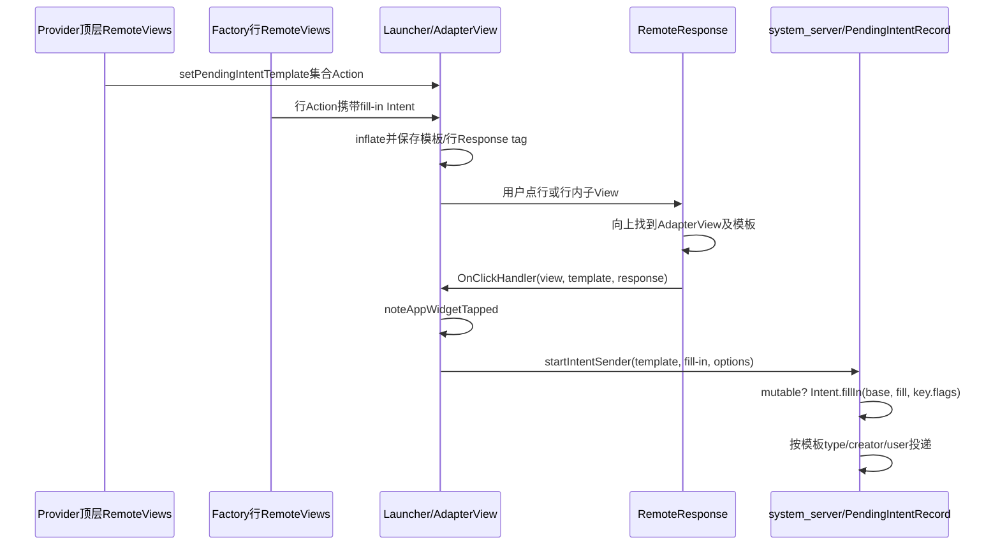
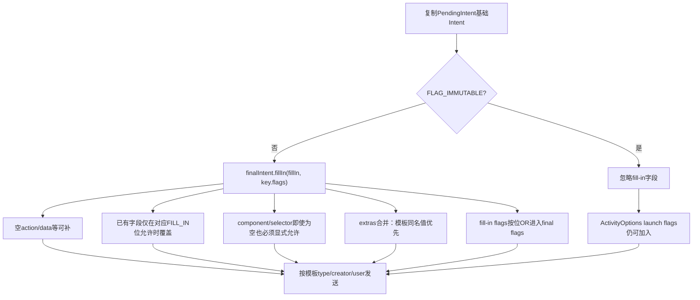
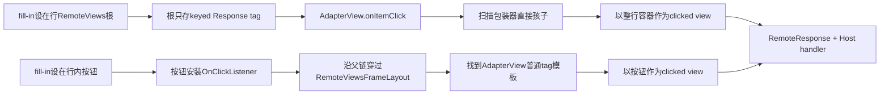

# 第 364 章 Android AppWidget集合项：PendingIntent模板、Fill-In合并、点击身份与安全链

> 源码基线：Android 11 / API 30 / `android-11.0.0_r48`。本章只在macOS阅读源码，不编译。上一章已经让Launcher按位置取到集合子项RemoteViews；本章只追一次点击：顶层Widget怎样安装一个PendingIntent模板，Factory怎样给每行附加fill-in Intent，Host如何找到模板并组装启动参数，system_server怎样按可变性与`FILL_IN_*`规则合并，以及最终到底使用Host身份还是Provider能力。

## 1. 集合点击为什么需要模板

若100行各携带一个完整PendingIntent，RemoteViews Parcel与system_server PendingIntent记录都会膨胀。集合协议只创建一个模板PendingIntent，每行传轻量Intent差异；点击时系统把两者组合成最终Intent。

## 2. 两半分别在哪里设置

Provider构造顶层Widget RemoteViews时，对ListView/GridView/StackView调用`setPendingIntentTemplate(collectionId, template)`；Factory的`getViewAt()`构造单行RemoteViews时，调用`setOnClickFillInIntent(targetId, fillIn)`。

## 3. 模板是能力，fill-in是参数

PendingIntent模板由Provider创建，已经冻结目标类型、创建者uid/package/user及基础Intent；fill-in只是发送时提供的Intent参数。Host拿到的是可发送能力，不会因此成为目标组件的业务身份。

## 4. 三个进程再次定位

Provider进程创建模板和行描述；Launcher进程inflate行、响应触摸并调用`startIntentSender()`；system_server持有PendingIntentRecord、完成合并并启动Activity/发广播/启Service。

## 5. 一份典型写法

```java
Intent base = new Intent(context, DetailActivity.class);
PendingIntent template = PendingIntent.getActivity(context, 0, base, 0);
widget.setPendingIntentTemplate(R.id.list, template);

// RemoteViewsFactory.getViewAt(position)
Intent fill = new Intent().putExtra("item_id", item.id);
row.setOnClickFillInIntent(R.id.row_root, fill);
```

## 6. Android 11默认PendingIntent可变

API 30已有`FLAG_IMMUTABLE`，但尚无后来强制显式选择可变性的通用规则。未指定IMMUTABLE的模板允许发送方fill-in；集合模板依赖这种可变能力。

## 7. IMMUTABLE模板会发生什么

`PendingIntentRecord.sendInner()`发现key带`FLAG_IMMUTABLE`时不调用`finalIntent.fillIn()`，行级data、extras、component和source bounds都不会合入基础Intent；ActivityOptions里的launch flags仍可另外加入。

## 8. 为什么不能照搬“PendingIntent都不可变”建议

不可变通常更安全，但集合模板的功能就是接收每项差异。在Android 11若模板必须区分行，就不能把它设为IMMUTABLE；安全做法是把模板目标锁定到明确组件，并只开放真正需要的字段。

## 9. click目标最好显式

模板直接指定Provider自己的Activity/Receiver/Service，可减少Intent重解析与劫持面。若模板留成宽泛隐式Intent，再允许fill-in大量覆盖字段，能力边界会变得更难审计。

## 10. 一次集合点击总图



## 11. setPendingIntentTemplate只是添加Action

API本身调用`addAction(new SetPendingIntentTemplate(viewId, pendingIntent))`，不会在Provider进程直接操作ListView。Action跨Parcel到Host，在RemoteViews apply时才查找真实View。

## 12. 目标必须是AdapterView

Host apply时若viewId对应`AdapterView<?>`，才安装OnItemClickListener并保存模板；否则只记错误日志并返回。把模板设到普通LinearLayout不会变成普通点击。

## 13. 模板保存在普通tag

源码调用`av.setTag(pendingIntentTemplate)`，不是专用成员字段。后续RemoteResponse向上找到AdapterView后，用`parent.getTag() instanceof PendingIntent`确认模板存在。

## 14. 这会覆盖Host原有普通tag

普通无key tag只有一个槽；模板Action写入后，Host若也依赖该AdapterView的普通tag会被覆盖。framework内部fill-in和pending-intent标记多用keyed internal tag，模板这里却是普通tag。

## 15. null模板不是清晰禁用协议

传null会让AdapterView tag不是PendingIntent，点击时记录“未设置模板”并返回；OnItemClickListener仍被安装。若要改变点击，应发送新的完整RemoteViews并明确设置合法模板/布局状态。

## 16. 行为何带COLLECTION_CHILD标志

上一章看到RemoteViewsService Stub在`getViewAt()`返回后添加`FLAG_WIDGET_IS_COLLECTION_CHILD`。内联RemoteViews列表的`RemoteViewsListAdapter`也会添加它；点击Action据此区分普通Widget与集合子项规则。

## 17. fill-in只允许集合子项

`SetOnClickResponse.apply()`发现mFillIntent非null却没有COLLECTION_CHILD标志，会记录错误并return。顶层普通Widget不能把fill-in单独当PendingIntent使用，因为它没有祖先模板能力。

## 18. 每行直接PendingIntent通常被拒绝

集合子项若调用`setOnClickPendingIntent()`，源码发出警告；Provider targetSdk达到Jelly Bean/API 16及以上就return，不为目标View安装点击。正确协议是template加fill-in。

## 19. 老应用为何例外

Honeycomb/ICS target为兼容历史错误实现，framework仍允许集合行直接PendingIntent。这个例外只为不破坏旧应用，不应成为新代码设计依据。

## 20. row root和内部按钮走不同安装方式

fill-in目标若正是行RemoteViews根，Action只把RemoteResponse存进根的keyed tag，真正点击由集合OnItemClickListener处理；若目标是根内子View，则继续给该子View安装OnClickListener。

## 21. 为什么根不直接装OnClickListener

ListView等需要自己的item click、选择、按压与复用流程，行根又被包在RemoteViewsFrameLayout里。把根Response交给AdapterView的OnItemClickListener，能让点击整行自然走集合协议。

## 22. AbsListView点击时扫描哪一层

传入item view通常是RemoteViewsFrameLayout。监听器把它视为ViewGroup，扫描其直接孩子，寻找`R.id.fillInIntent` keyed tag；内容RemoteViews根正是直接孩子，所以可找到根Response。

## 23. AdapterViewAnimator额外下钻一层

若parent是AdapterViewAnimator，代码先把item容器替换成其第0个child的ViewGroup，再扫描直接孩子。这是StackView/Flipper包装层差异的特判。

## 24. 下钻代码有结构假设

源码直接把`vg.getChildAt(0)`强转ViewGroup，再做null判断；它依赖framework生成的标准包装结构。自定义Host若打破层级，可能找不到Response甚至触发类型异常。

## 25. 只取第一个直接子Response

item click扫描直接孩子，发现第一个RemoteResponse tag便break。根级协议按设计只有内容根一个tag；若异常布局放入多个带根Response的直接孩子，后面的不会被选。

## 26. 根点击使用哪个source view

找到Response后调用`response.handleViewClick(view, handler)`，传的是AdapterView交给listener的item容器，而不是存tag的内容根。因此source bounds通常覆盖整项。

## 27. 子View点击不经过item扫描

对行内按钮设置fill-in时，按钮自己的OnClickListener直接调用RemoteResponse；随后它从按钮父链向上找AdapterView。source bounds会以被点击按钮计算，更适合局部启动动画。

## 28. 向上查找的停止条件

循环遇到第一个AdapterView即成功；遇到非`RemoteViewsFrameLayout`的AppWidgetHostView或null则停止并报“没有AdapterView parent”。这防止错误层级跨出当前Widget继续寻找别的容器。

## 29. RemoteViewsFrameLayout为何获豁免

它本身继承AppWidgetHostView，却只是集合每项的包装器，不是顶层Widget边界。查找循环允许穿过它，直到真正集合AdapterView。

## 30. 模板缺失时不会猜测

找到AdapterView但普通tag不是PendingIntent，源码记录“未调用setPendingIntentTemplate”并return。它不会退回行里的隐式Intent，也不会创建新的PendingIntent。

## 31. OnClickHandler是Host策略点

RemoteResponse最终只调用`handler.onClickHandler(clickedView, template, response)`。AppWidgetHostView可以包装默认处理，也允许Host传入自定义handler拦截或改变启动方式。

## 32. RemoteViewsAdapter怎样拿到同一handler

顶层`SetRemoteViewsAdapterIntent.apply()`除创建远程Adapter，还对AbsListView或AdapterViewAnimator调用`setRemoteViewsOnClickHandler(handler)`；每项RemoteViewsFrameLayout再用该handler执行行Action。

## 33. handler跨层但不跨Binder

它是Launcher进程本地Java接口，不会传回Provider。Provider只描述PendingIntent/fill-in，真正点击策略属于Host运行环境。

## 34. AppWidgetHostView先记一次tap

包装handler的第一句调用`AppWidgetManager.noteAppWidgetTapped(appWidgetId)`，之后才走自定义handler或默认`startPendingIntent()`。

## 35. note失败与发送是两个动作

note调用用于系统把Provider包记为用户交互/Widget可见相关状态；它不是PendingIntent发送确认。即使自定义handler返回false或后续PendingIntent已取消，note也已经先尝试执行。

## 36. note只接受合法TOP Host

system_server先核验callingPackage属于callingUid，再要求Launcher进程状态为TOP，并按calling uid/package查到该Widget；不满足就return，不会让后台普通应用伪造Widget点击提升别的包。

## 37. note记录给哪个Provider

通过Widget关系取Provider uid和package，调用AppOps内部Widget visibility更新，并向UsageStats报告`USER_INTERACTION`。记录对象是Provider包，不是简单给Launcher自己记一次点击。

## 38. 默认发送使用View Context

`RemoteViews.startPendingIntent()`取点击View的Context，调用`context.startIntentSender(template.getIntentSender(), fillIn, ..., options)`。发起API运行在Launcher，但IntentSender内部能力仍指向Provider创建的记录。

## 39. PendingIntent不是切换Binder callingUid魔法

system_server同时知道发送者callingUid/pid和记录创建者uid/package。目标操作以记录的creator身份/包/user为核心发起，而发送者前台态仍可参与后台启动等策略判断；两套身份都存在，不能只写“完全是Provider”或“完全是Launcher”。

## 40. 模板type决定投递种类

`getActivity()`记录走startActivityInPackage，`getBroadcast()`走broadcastIntentInPackage，`getService()`/`getForegroundService()`走startServiceInPackage。fill-in不能把Activity型PendingIntent变成广播型。

## 41. Provider进程无需存活

PendingIntentRecord在system_server；创建者进程被杀后，Host仍可发送有效能力，目标组件需要时再被系统启动。源码也明确不把creator ProcessRecord作为必需条件传下去。

## 42. PendingIntent被取消时

sendInner发现record canceled返回`START_CANCELED`；客户端startIntentSender抛SendIntentException，RemoteViews记录日志并返回false。默认链没有自动通知Factory“该行点击失败”。

## 43. ONE_SHOT模板的影响

若模板带FLAG_ONE_SHOT，第一次send就取消记录；后续其它行仍显示可点击，但发送失败。集合通常不应使用one-shot，除非产品明确整个列表只能成功触发一次。

## 44. requestCode不是行参数

模板只有一个PendingIntent记录，requestCode用于创建/匹配该记录，不会因fill-in行不同自动变化。行ID应放在data或extras中由最终目标读取。

## 45. FLAG_UPDATE_CURRENT更新模板基础值

再次用相同PendingIntent identity并带UPDATE_CURRENT，会更新已有记录的基础Intent extras；它不是为每一行创建独立记录。若基础extras与fill-in同名，后面还要考虑基础值优先规则。

## 46. PendingIntent identity通常不比较extras

相同type、包、requestCode以及Intent过滤身份可能命中同一记录，extras不同并不天然区分。模板本来就希望共享；若多个Widget需不同固定目标，应用要正确设计requestCode/data/component。

## 47. fill-in合并发生在哪里

客户端没有把模板解包后自行改写；AMS侧PendingIntentRecord复制`key.requestIntent`得到finalIntent，再在可变时执行`finalIntent.fillIn(intent, key.flags)`。

## 48. key.flags一身两用

PendingIntent创建flags既含ONE_SHOT、UPDATE_CURRENT、IMMUTABLE等记录语义，也可含`Intent.FILL_IN_ACTION/DATA/...`，后者决定发送时是否允许覆盖模板已有对应字段。

## 49. 空字段通常可自动补

模板action/data/type/categories/package/sourceBounds等为null时，fill-in提供值通常无需对应覆盖位即可填入；若模板已经有值，才需要相应`FILL_IN_*`允许替换。

## 50. Intent合并规则图



## 51. action覆盖规则

模板action为null时可由fill-in补；模板已有action时，只有创建PendingIntent时包含`Intent.FILL_IN_ACTION`才允许行覆盖。通常显式组件模板根本不需要让每行改变action。

## 52. data与type被视为一组

fillIn代码在other存在data或type，且基础data和type都为空或允许FILL_IN_DATA时，一起替换。用每行唯一URI是常见做法，但若模板已经设置data又没开放FILL_IN_DATA，行URI会被忽略。

## 53. categories不是简单追加

基础categories为null时复制fill-in集合；基础已有categories且未开放覆盖时保留基础，并不会自动union。开放`FILL_IN_CATEGORIES`时替换为fill-in categories副本。

## 54. package受selector约束

基础package为空或允许FILL_IN_PACKAGE时可以复制fill-in package，但已有selector会阻止设置package。一般模板应由Provider提前锁定package/component，不让行改变解析范围。

## 55. component是特殊安全字段

即使基础component为null，fill-in component也只有在key.flags含`FILL_IN_COMPONENT`时才复制。源码注释明确这是防止发送方把能力强制导向创建者未预期组件。

## 56. selector同样必须显式允许

`FILL_IN_SELECTOR`是另一个特殊门，并且要求package为空。普通集合点击几乎无需selector，少开放一个字段就少一个审计面。

## 57. ClipData空时可复制

基础无ClipData时，fill-in ClipData可以复制；已有值要`FILL_IN_CLIP_DATA`覆盖。ClipData可能携URI，应连同grant flags、目标组件和实际权限一起审计。

## 58. Intent flags总是按位OR

`Intent.fillIn()`无条件执行`mFlags |= other.mFlags`，不靠FILL_IN_*覆盖位。Provider行fill-in可加入CLEAR_TOP、URI grant等flags，但不能通过它清掉模板已有flags。

## 59. source bounds先由Host重写

RemoteResponse复制fill-in后调用`intent.setSourceBounds(getSourceBounds(clickedView))`。基础模板sourceBounds为空时会合入；若基础已有bounds且未允许FILL_IN_SOURCE_BOUNDS，Host计算值不会覆盖它。

## 60. IMMUTABLE连source bounds也挡住

不可变模板完全跳过Intent.fillIn，因此点击位置Intent不会进入finalIntent；但启动动画仍可能从ActivityOptions获得其它信息。不要用“动画还能开”误判行extras已成功合入。

## 61. extras不是fill blank那么简单

基础无extras时复制fill-in Bundle；两边都有时先复制fill-in，再`putAll(baseExtras)`。所以同名key由模板基础extras覆盖行fill-in，行只能新增模板没有的key。

## 62. 这是最常见的反直觉点

很多讲解笼统说“fill-in覆盖模板extras”，与Android 11源码不符。若模板固定写`item_id=0`，行再写`item_id=42`，最终仍可能是0；模板应把需要逐行变化的extra留空。

## 63. Bundle反序列化失败怎样处理

合并extras可能触发unparcel并抛RuntimeException；Intent.fillIn捕获后记录warning，保留原基础extras。于是部分字段已合并、extras却没合并，最终Intent不是事务式全有或全无。

## 64. contentUserHint会跟URI来源

当data/ClipData/extras可能复制URI且基础hint仍是CURRENT时，fillIn可带入other的content user hint。它只是URI归属解析提示，不等于自动获得跨user读取权限。

## 65. URI授权仍需明确能力

若目标要读取fill-in data/ClipData URI，需要Provider正确设置grant flags、URI和目标；最终组件启动链会按Intent授权规则处理。AppWidgetService不会因为这是Widget点击就给任意content URI自动授权。

## 66. 基础组件加行data是稳妥模式

模板固定显式DetailActivity且data留空；每行fill-in只设置唯一data URI和必要extra。component不能被行改写，data空位可自然补入，目标Activity按URI定位业务对象。

## 67. 若模板已有data怎么办

创建PendingIntent时显式加入`Intent.FILL_IN_DATA`，行才能覆盖；但这扩大了发送能力。更简单的设计通常是把模板data留null，或只在extras使用不冲突的新key。

## 68. 不要开放FILL_IN_COMPONENT图省事

即使行由自己的Factory生成，RemoteViews和PendingIntent最终由Host持有并发送，系统API仍按能力边界设计。固定component可以让代码审计者一眼确认所有行只能进入预期组件。

## 69. ActivityOptions从哪里产生

RemoteResponse根据点击View和Host环境构造：可能采用RemoteViews专用打开动画、共享元素转场，或回退到basic options；并设置PendingIntent launch flag `FLAG_ACTIVITY_NEW_TASK`。

## 70. NEW_TASK不靠篡改fill-in

RemoteViews注释特意说明NEW_TASK通过ActivityOptions加入，保证mutable与immutable PendingIntent表现一致。server在是否fill-in之后，再把options中的PendingIntent launch flags加到finalIntent。

## 71. 默认直接PendingIntent也有source bounds

若Response持完整PendingIntent而非fill-in，getLaunchOptions创建空Intent并写点击View bounds，作为发送fill-in参数。可变模板可接收bounds；immutable时仍跳过该Intent。

## 72. Shared element是可选增强

RemoteResponse可记录viewId与transition name；Host沿父链找到AppWidgetHostView，尝试创建ActivityOptions。找不到对应View或上下文不满足时可回退基本启动，不改变PendingIntent能力身份。

## 73. shared element bounds也进入fill-in extra

AppWidgetHostView为共享元素准备bounds Bundle并写入fillInIntent专用extra。若模板immutable，这类Intent补充同样不会进入finalIntent；ActivityOptions本身是否足够由具体路径决定。

## 74. 自定义Host handler可以不发送

AppWidgetHostView先note tap，再把view/template/response交给自定义handler。Launcher可实现自有动画或安全策略并返回结果；framework不保证第三方Host一定采用默认发送行为。

## 75. Provider不能直接控制Host动画细节

Provider可声明RemoteResponse共享元素信息，但最终View层级、Host Context、资源配置和handler决定能否实现。PendingIntent里预存的ActivityOptions还可能与发送方options合并/被覆盖。

## 76. 点击Listener运行在哪个线程

OnItemClickListener和View.OnClickListener在Launcher UI线程响应触摸；noteAppWidgetTapped和startIntentSender由该线程发同步Binder请求。目标Activity生命周期则在目标进程主线程另行调度。

## 77. 点击返回不等于目标已显示

`startIntentSender()`成功只表示系统接受/推进发送；目标进程启动、Activity onCreate、窗口draw、SurfaceFlinger显示仍是后续链。RemoteViews handler的boolean也不是首帧确认。

## 78. 自定义handler返回值用途有限

接口返回boolean表达Host是否处理/发送成功，SetOnClickResponse自己的listener不据此回滚按压状态或重试。Provider没有同步接收这个boolean的通道。

## 79. 行位置不是可靠业务身份

列表刷新后position可能变化，点击时fill-in已随该行RemoteViews缓存下来。应传稳定item ID/URI，并在目标组件重新查询与校验；不要只传position后相信仍指向原对象。

## 80. 缓存会让旧fill-in短暂存在

RemoteViewsAdapter缓存已取行；数据源变化到Host刷新/新项apply之间，屏幕可能仍带旧Response。目标组件必须容忍对象已删除、权限变化或版本过期。

## 81. Stable ID不自动改写fill-in

Factory的stable IDs帮助Adapter语义，不会把itemId自动写入点击Intent。Provider仍须在`getViewAt()`显式构造正确fill-in。

## 82. template更新与行缓存不是共同事务

顶层updateAppWidget可换模板，集合data change可换行Response，两条通知独立。竞态窗口内可能出现新模板配旧fill-in或旧模板配新fill-in，目标端要用版本/合法性校验降低影响。

## 83. Action执行顺序影响tag最终值

RemoteViews按Action顺序apply；若有其它机制在同一AdapterView改普通tag，后执行者覆盖前者。标准公开集合API通常不会让Provider任意setTag对象，但Host自身操作仍需避免冲突。

## 84. reapply会重新安装listener

顶层RemoteViews reapply时SetPendingIntentTemplate再次setOnItemClickListener并写tag；行RemoteViews reapply也会重写Response keyed tag/OnClickListener。旧View对象复用不代表点击参数永久不变。

## 85. clear某个子View点击的路径

SetOnClickResponse若既无PendingIntent也无fillIntent，会`target.setOnClickListener(null)`；正常公开构造多为二选一。发送null或损坏Parcel不应作为应用常规清理策略。

## 86. AdapterView本身不适合普通click PendingIntent

SetOnClickResponse看到完整PendingIntent且目标是AdapterView时注释提示可能本应使用template，但代码主要依据collection child flag处理。开发者应遵守API语义，不依赖模糊目标的偶然行为。

## 87. 集合根点击与行内按钮对比



## 88. 点击整行的优点

触摸目标大、ListView按压与无障碍item语义一致，source bounds覆盖整项；适合“打开详情”单一动作。

## 89. 行内按钮的代价

多个子View可各放不同fill-in，但会引入焦点、可点击子项、AdapterView item click冲突与无障碍描述问题。必须在真实Launcher上验证交互，而macOS阶段只做源码推演。

## 90. 多按钮可以共享同一模板

每个按钮Response都向上取同一AdapterView tag模板，只需在fill-in中增加action_kind/item_id等参数。目标组件必须白名单解析action_kind，不能把任意字符串当反射命令。

## 91. 同一Widget多个集合各有模板

每个AdapterView普通tag独立，因此两个列表可使用不同PendingIntent类型/目标。Response总取最近祖先AdapterView，不会主动跨到另一个集合。

## 92. 嵌套AdapterView的边界

查找在第一个AdapterView停止；RemoteViews允许的布局和集合结构本就受限。若出现嵌套，内层模板优先，外层不会作为fallback继续找。

## 93. PendingIntent记录的user很关键

创建时记录目标user；跨资料Widget在parent Launcher显示时，发送者是parent Host但模板由资料Provider创建，PendingIntent仍携其creator/user能力。跨user不等于Host获得资料应用任意Binder身份。

## 94. fill-in不能改变记录user

Intent字段没有把PendingIntentRecord的key.userId改成另一user的通用能力；system_server投递时使用记录user，USER_CURRENT才在发送时解析当前/目标user。

## 95. 后台启动规则仍会看sender

PendingIntentRecord获取实际发送者callingUid/pid，判断其是否前台并参与临时允许后台Activity trampoline等策略；Launcher处于TOP通常是Widget点击能正常打开UI的重要事实。

## 96. creator和sender分别防什么

creator限定“谁授予了什么组件操作能力”；sender状态反映“是否真由当前前台用户交互触发”。系统把两者都传入下游，避免把PendingIntent简化成完全无条件的身份借用。

## 97. 显式模板仍需目标端鉴权

PendingIntent只能证明调用路径持有Provider创建的能力，不能证明行数据仍有效或用户仍有权限。DetailActivity/Receiver应重新检查item存在性、账户、profile锁定和敏感操作确认。

## 98. 不把敏感密钥放fill-in

fill-in会出现在跨进程Intent/Parcel与Host内存中。只传最小稳定标识，在目标组件按当前身份查询数据；不要传长期token、密码或可直接兑换高权限的秘密。

## 99. 隐式广播模板的额外风险

若目标不限定package/component，最终Intent可能被其它匹配Receiver接收，尤其行data/action可变时更难预测。优先显式Receiver，并结合receiver exported/permission设计。

## 100. Service模板还受后台限制

PendingIntent type为Service并不保证所有后台启动都成功；sendInner走startServiceInPackage，前台状态、后台执行限制和是否foreground-service型记录仍参与。面向用户的详情点击通常用Activity更直接。

## 101. Activity模板可使用CLEAR_TOP

行fill-in flags会OR进finalIntent，AOSP Gallery示例给每项加入`FLAG_ACTIVITY_CLEAR_TOP`与data URI。它不会清掉模板flags，且最终任务栈行为仍由Activity launch mode与现有Task决定。

## 102. AOSP Calendar的模式

顶层Provider给events ListView设置单一launch template；Factory为每个event row生成包含event id、开始/结束时间的fill-in，再把它设到`widget_row`。这是“固定目标、每项参数”的标准示范。

## 103. AOSP Gallery的模式

Gallery顶层用显式WidgetClickHandler Activity创建模板；每个图片项fill-in设置图片content URI和CLEAR_TOP。远程Service Intent另用含widgetId的data区分Factory，数据身份与点击身份各自使用data但用途不同。

## 104. data身份不要与Service Intent混淆

上一章Service Intent data决定Factory共享key；本章fill-in data进入最终点击Intent。两者是不同Intent对象、不同生命周期，URI格式可相似但不能当成同一个系统字段流。

## 105. 点击问题的日志观察点

RemoteViews会记录非collection fill-in、collection直接PI被拒、没有AdapterView parent、祖先没template、PI发送异常；system_server另有PendingIntent/Activity/广播/Service日志。应先判断失败发生在Host组装前还是服务端发送后。

## 106. 肉眼点击无反应的第一组检查

确认fill-in设在Factory返回的行RemoteViews、该行获得COLLECTION_CHILD、顶层template viewId确实指集合、目标行/按钮可点击且层级能到AdapterView、template普通tag没有被Host覆盖。

## 107. 第二组检查是合并结果

确认模板不是IMMUTABLE；逐行字段在模板中留空或开放相应FILL_IN位；component没有错误期待自动补；同名extras未被基础值覆盖；data/type没有因基础已有值而保持旧值。

## 108. 第三组检查是发送与目标

检查PendingIntent是否被取消/one-shot耗尽、目标组件是否存在可用、user/profile是否解锁、后台启动策略、最终Activity/Receiver/Service自身日志与数据鉴权结果。

## 109. 安全审计的最小清单

模板目标显式且最小权限；不开放FILL_IN_COMPONENT/SELECTOR除非确有设计；fill-in只含稳定ID与必要flags；URI授权最小化；目标端重新鉴权；避免秘密extras；PendingIntent identity和UPDATE_CURRENT不会串Widget固定参数。

## 110. 性能审计的最小清单

全列表共享少量模板；Factory不为每行创建不同PendingIntent；fill-in Bundle小且无大Parcelable/Bitmap；点击不依赖同步大查询在Launcher；目标组件异步加载详情并处理陈旧ID。

## 111. 一句话串起源码

顶层Action把Provider PendingIntent能力放进AdapterView普通tag，行Action把RemoteResponse放根keyed tag或子View listener；Host从View层级把两者汇合，先note tap，再发送IntentSender；system_server复制基础Intent，按IMMUTABLE与创建flags合入fill-in，最后按creator/type/user投递。

## 112. macOS只读练习一：追两种点击安装路径

执行`sed -n '640,925p' frameworks/base/core/java/android/widget/RemoteViews.java`，分别标出SetPendingIntentTemplate与SetOnClickResponse。回答：根fill-in为什么只写tag，子View为什么装listener，AdapterViewAnimator为什么多下钻一层。

## 113. macOS只读练习二：手算Intent.fillIn

执行`sed -n '10160,10285p' frameworks/base/core/java/android/content/Intent.java`。自行设模板`component=DetailActivity, extra item_id=0, data=null`，fill-in为`component=Other, item_id=42, data=item/42`，分别在flags为0和`FILL_IN_COMPONENT`时写出结果，并说明哪个item_id保留。

## 114. macOS只读练习三：验证IMMUTABLE和身份

执行`sed -n '289,475p' frameworks/base/services/core/java/com/android/server/am/PendingIntentRecord.java`，圈出immutable分支、creator uid/package、callingUid/pid、key.userId和四种type分发。解释为什么“Launcher发送”不等于“按Launcher业务身份启动”。

## 115. macOS只读练习四：对照AOSP真实示例

阅读`packages/apps/Calendar/src/com/android/calendar/widget/CalendarAppWidgetProvider.java`和`CalendarAppWidgetService.java`中template/fill-in代码，再看Gallery2对应Provider/WidgetService。记录模板固定哪些字段、行填哪些字段、data URI在Factory区分和点击区分中分别扮演什么角色。

## 116. 自测一：为什么行extra覆盖失败

若模板基础Intent已含同名extra，Intent.fillIn合并时基础Bundle最后putAll到新Bundle，因此模板值胜出。让逐行key只出现在fill-in，或重新设计PendingIntent模板基础extras；不要误以为加某个FILL_IN_EXTRAS位能解决，因为不存在该位。

## 117. 自测二：为什么所有行打开同一数据

常见原因包括模板已设置固定data且没开放FILL_IN_DATA、模板IMMUTABLE、基础同名extra覆盖行值、Factory缓存生成了旧ID。先在服务端按源码规则手算finalIntent，再排目标Activity缓存。

## 118. 自测三：为什么根可点而按钮不可点

根Response由AdapterView item click扫描到；按钮需要自己的fill-in Action成功apply、listener存在，并能沿父链穿过RemoteViewsFrameLayout找到带PendingIntent tag的AdapterView。按钮被其它View遮挡或Host层级异常也会中断这条链。

## 119. 本章最容易误解的五点

第一，fill-in不是另一个PendingIntent；第二，IMMUTABLE模板会忽略行参数；第三，component即使模板为空也不会自动填，必须开放FILL_IN_COMPONENT；第四，extras冲突时基础模板值优先；第五，目标以creator能力发起但系统仍保留并使用实际sender前台态。

## 120. 本章收束与下一章入口

集合点击的核心不是“拼两个Intent字符串”，而是能力受控合并：View层级找到模板，RemoteResponse携行差异，PendingIntentRecord按创建者允许的字段形成finalIntent。下一章将离开点击，继续读AppWidget固定列表`setRemoteAdapter(List<RemoteViews>, viewTypeCount)`、RemoteViewsListAdapter的本地数据路径、类型校验、复用和它与RemoteViewsService方案的边界。
