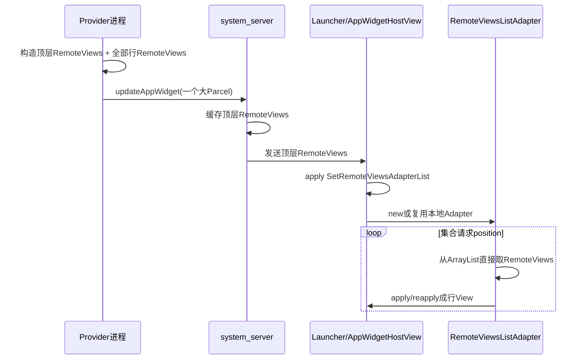
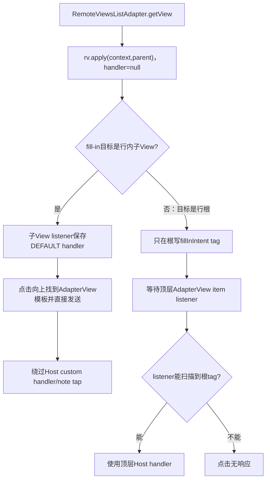
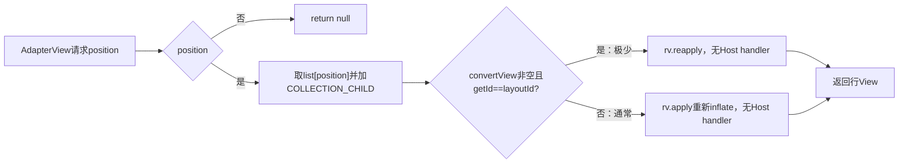

# 第 365 章 Android AppWidget固定RemoteViews列表：本地Adapter、类型、复用、内存与点击边界

> 源码基线：Android 11 / API 30 / `android-11.0.0_r48`。本章只在macOS阅读源码，不编译。前两章讲的是推荐的RemoteViewsService按需数据链和template/fill-in点击链；本章核对一个隐藏且已废弃的分支：`setRemoteAdapter(viewId, ArrayList<RemoteViews>, viewTypeCount)`把整张表随顶层RemoteViews一次发给Host，再由`RemoteViewsListAdapter`本地显示。它适合理解Adapter基本契约，也包含多个不能被误写成最佳实践的r48边角。

## 1. 这不是公开推荐API

Android 11源码把列表重载标成`@hide`、`@UnsupportedAppUsage`和`@Deprecated`，注释甚至写“似乎没有UnsupportedAppUsage之外的用户”。普通应用源码学习应理解实现，不应绕隐藏API限制依赖它。

## 2. 它与Service方案的根区别

Service方案只把显式Intent放进顶层RemoteViews，Host按位置跨Binder取行；固定列表方案把全部行RemoteViews直接写进同一个Action Parcel，Host收到后不再绑定Provider Service。

## 3. 数据规模决定架构

固定列表只有在总行数少、RemoteViews Action少、图片很小或使用URI时才可能合理；大量Bitmap、频繁刷新或大列表会让整次Binder事务和Host inflate成本集中爆发。

## 4. 四个核心类缩成两个

没有RemoteViewsService/Factory/IRemoteViewsFactory；主要只剩Provider创建的`SetRemoteViewsAdapterList` Action和Host进程的`RemoteViewsListAdapter`。

## 5. API入口做了什么

```java
public void setRemoteAdapter(int viewId,
        ArrayList<RemoteViews> list, int viewTypeCount) {
    addAction(new SetRemoteViewsAdapterList(viewId, list, viewTypeCount));
}
```

它只是保存viewId、list和typeCount到Action，没有在Provider侧创建真正Adapter。

## 6. Action没有防御性复制list

构造器直接`this.list = list`。在RemoteViews被Parcel复制前，调用者若继续修改同一个ArrayList，Action看到的内容也会变化；应用应把构建完成的RemoteViews视为不可变快照。

## 7. Parcel怎样携带整表

Action先写viewId和viewTypeCount，再`dest.writeTypedList(list, flags)`。每个RemoteViews都递归写自己的layout、Action和BitmapCache，因此总事务大小随整表线性增长。

## 8. 接收端直接重建ArrayList

构造Action时用`createTypedArrayList(RemoteViews.CREATOR)`逐项反序列化。它不是共享Provider内存对象，正常跨进程路径已经形成Host侧副本。

## 9. 固定列表总链



## 10. system_server仍会缓存顶层RemoteViews

它与普通完整Widget更新一起进入AppWidgetService缓存和Host回调；不同之处只是集合行藏在某个Action内，而非Provider Service按需提供。

## 11. Host apply先找viewId

`SetRemoteViewsAdapterList.apply()`用root.findViewById；找不到就静默return。布局版本错配可能表现为列表不更新而没有异常。

## 12. 只允许AppWidget根

rootParent必须是AppWidgetHostView，否则记录“只能用于AppWidgets”并return。该隐藏API不是任意跨进程RemoteViews容器的通用列表填充方法。

## 13. 支持的容器被进一步收窄

目标必须是AbsListView或AdapterViewAnimator；普通自定义AdapterView即使继承AdapterView也被拒绝。ListView/GridView属于前者，StackView/AdapterViewFlipper属于后者。

## 14. 创建还是复用Adapter

若目标当前Adapter已是RemoteViewsListAdapter，且新Action的viewTypeCount小于等于旧Adapter容量，就调用`setViewsList()`；否则new一个Adapter并`setAdapter()`。

## 15. 为什么允许新count小于旧容量

旧Adapter的mViewTypeCount被视为生命周期最大容量。新列表需要类型数不超过旧容量时可继续用；`setViewsList()`不会把旧容量缩小。

## 16. 新count变大则换Adapter

旧容量不足时构造新的RemoteViewsListAdapter。这可能重置集合选择、滚动/动画等本地Adapter状态；API文档因此要求生命周期内typeCount不要变化并预先声明最大值。

## 17. 小count声明可能被旧容量掩盖

若旧Adapter容量为3，新Action宣称1但列表实际有2种布局，复用条件仍成立；`setViewsList()`按旧mViewTypeCount=3校验并接受，新的1没有真正写入Adapter。这是实现的“容量不缩小”结果。

## 18. 首次构造立即init

Adapter保存Context、list和viewTypeCount，随后遍历所有RemoteViews收集不同layoutId。校验失败在Host apply阶段抛RuntimeException，可能让整个Widget进入fresh apply失败/error链。

## 19. viewTypeCount至少为1

即使list为空，只要非null，init最后仍要求mViewTypeCount>=1。传0不是“没有类型”，而是无效参数。

## 20. 类型以layoutId判定

`mViewTypes`保存首次遇到顺序下的不同`rv.getLayoutId()`；数量超过声明count就抛“Invalid view type count”。不同文字/图片Action不产生新类型，只有根layoutId不同才算。

## 21. 横竖RemoteViews的类型语义

组合RemoteViews的外层getLayoutId通常取portrait layoutId，而实际方向可选另一个布局。仅按外层layoutId分类可能无法表达两方向结构差异，进一步说明该旧Adapter实现很粗糙。

## 22. list为null的特殊行为

init看到null直接return，甚至不会执行viewTypeCount>=1校验；getCount返回0。于是`list=null,count=0`能构造空Adapter，而空的非null list加count=0却抛异常，语义不对称。

## 23. list内null项不被支持

init直接调用每项`rv.getLayoutId()`，没有null判断，所以含null会NPE。不要把null当loading行；固定列表没有RemoteViewsAdapter那套loading协议。

## 24. 类型表按新列表重建

`setViewsList()`替换list、clear mViewTypes、按新首次出现顺序收集，再notifyDataSetChanged。布局A/B顺序交换时，其本地type index也可能交换。

## 25. Adapter type最好跨刷新稳定

经典Adapter契约期望同类View的type一致，方便scrap复用。这里按首次出现顺序重编号并不稳定；后面另一个复用检查错误恰好让大部分convertView被放弃，掩盖了部分混用风险却损失性能。

## 26. getCount只是list.size

全部元数据已在Host，没有远端count查询、临时metadata或dataReady状态。更新整表前旧Adapter继续显示旧ArrayList。

## 27. getItem固定返回null

与RemoteViewsAdapter一样，Host没有公开业务模型对象；但这里其实已经持有RemoteViews。实现仍选择`getItem()`返回null，调用方只能依赖View和position。

## 28. itemId直接等于position

`getItemId(position)`返回position，`hasStableIds()`却返回false。列表插入/排序后同一对象位置变化，不提供稳定身份语义。

## 29. getItemViewType怎样算

合法position取该行layoutId，再在mViewTypes中找index；若position>=count返回0。负数没有显式保护，但正常AdapterView不会请求负position。

## 30. 没有loading type保留位

固定列表从0开始分配真实布局类型，因为所有行已在内存；上一章RemoteViewsAdapter的type 0专给loading、真实类型从1开始，不能把两套数字直接比较。

## 31. getView先添加collection标志

每次显示行都调用`rv.addFlags(FLAG_WIDGET_IS_COLLECTION_CHILD)`，使fill-in Action合法、集合行直接PendingIntent受targetSdk兼容规则限制。

## 32. 标志会原地留在RemoteViews

addFlags修改缓存中的行对象；第一次getView后该标志一直存在。重复调用只是OR同一位，不会累积其它状态。

## 33. 理想复用条件应是什么

若convertView来自同layoutId，应该对它reapply新Action；否则fresh apply。RemoteViews自己在根View的内部keyed tag `R.id.widget_frame`保存实际layoutId，reapply方向检查也使用该tag。

## 34. r48实际比较了错误字段

源码却写`convertView.getId() == rv.getLayoutId()`。getId()是XML根`android:id`，layoutId是`R.layout.xxx`，资源类型不同，数值正常不相等。

## 35. 结果几乎总是重新inflate

AdapterView即使按view type交来可复用convertView，条件通常false，代码走`rv.apply(mContext,parent)`创建新树。列表滚动会增加inflate、对象分配和GC。

## 36. 正确tag已存在却未使用

RemoteViews.inflateView()明确`v.setTagInternal(R.id.widget_frame, rv.getLayoutId())`；RemoteViews.reapply()也读取它。ListAdapter是全树唯一用根View id比较layoutId的地方，表现像Android 11实现缺陷。

## 37. 偶然相等不应依赖

`id`和`layout`资源ID高位类型不同，正常aapt分配不相等。即使某异常/手工View制造相同整数，也不是公开契约，不能用给根设置某id来“修复”隐藏API。

## 38. Fresh apply使用哪个Context

Adapter的mContext来自目标集合View，即Host/Launcher View Context；RemoteViews.apply内部再包装Provider ApplicationInfo资源Context，安全inflate规则与第362章相同。

## 39. Fresh apply没有Host专用handler参数

`RemoteViewsListAdapter`调用两参数`rv.apply(mContext,parent)`；reapply也调用两参数版本。它没有保存SetRemoteViewsAdapterList.apply收到的OnClickHandler。

## 40. null handler会回默认发送器

RemoteViews.performApply发现handler为null就换成DEFAULT_ON_CLICK_HANDLER，直接`startPendingIntent()`。因此行内View点击仍能发送，但绕过AppWidgetHostView包装的自定义Host处理。

## 41. 也可能绕过noteAppWidgetTapped

行内子View listener由行RemoteViews用默认handler安装，点击时不会经过AppWidgetHostView.getHandler()，所以不会先调用noteAppWidgetTapped。整行根点击是否绕过还取决于模板listener路径。

## 42. 顶层模板listener仍拿Host handler

`setPendingIntentTemplate()`属于顶层RemoteViews Action，由AppWidgetHostView apply时传入包装handler；其AdapterView OnItemClickListener闭包保存了该handler。因此能真正走到item listener的根点击仍可note并尊重自定义Host。

## 43. 行内按钮则直接用默认handler

按钮fill-in目标不是行根时，行apply直接给按钮装listener，点击不会先触发AdapterView.onItemClick；它沿父链找模板后用行apply时的默认handler发送。

## 44. 固定列表点击双路径图



## 45. 行根fill-in为何可能扫不到

RemoteViewsListAdapter直接返回内容根，没有RemoteViewsAdapter.RemoteViewsFrameLayout外包装；而顶层template listener对AbsListView拿到这个根后只扫描“它的直接孩子”tag，不检查item view自身tag。

## 46. 根Action把tag写在哪里

SetOnClickResponse发现target==root时，把RemoteResponse写在root自身并return。固定列表AbsListView的item listener随后扫描root children，因此标准结构下错过该tag。

## 47. Service方案为什么能找到

RemoteViewsAdapter返回RemoteViewsFrameLayout，内容root是其直接孩子；item listener扫描frame的child，正好找到内容root tag。旧固定列表少了这一包装层，协议拼接不完整。

## 48. 行内子View是可行绕路但有副作用

把fill-in设到root内部按钮/容器会安装独立listener，能向上找到AdapterView模板；但如前所述它使用默认handler，Host定制动画、点击政策和note tap会被绕过。

## 49. AdapterViewAnimator层级更复杂

template listener还会额外取item ViewGroup的child 0再扫描其children。具体能否命中取决于Animator内部包装与行布局，不能把AbsListView结论机械套用；必须用真实Host层级验证。

## 50. getView路径总览



## 51. reapply分支也没有捕获异常

若极少数情况下进入reapply，Action或方向结构不兼容抛RuntimeException时Adapter不会自己fresh apply兜底；异常向集合布局调用栈传播。它不具AppWidgetHostView主内容那套reapply失败再apply策略。

## 52. apply失败同样没有行级error view

RemoteViewsListAdapter不包装AppWidgetHostView，也不创建专用loading/error占位。某行inflate异常可能影响整个集合布局过程，而不是只给该位置一个稳定错误卡片。

## 53. 没有异步apply

它总在AdapterView调用getView的Host UI线程同步apply/reapply；URI/Icon加载或复杂布局可能直接增加Launcher帧耗时。RemoteViewsService Adapter可选worker异步准备，这里没有对应参数。

## 54. 没有预取队列

所有RemoteViews描述虽已在内存，但真正View仍在滚动到position时同步inflate。不存在40项RemoteViews缓存、可见范围预取或requested优先队列。

## 55. AdapterView自己的scrap仍存在

ListView/GridView会按type提供convertView；问题是本Adapter几乎总拒绝它。不能说“完全没有复用机制”，准确说法是上层提供了，r48错误比较使本层通常没有利用。

## 56. 没有Factory线程安全问题

全部数据已经Parcel快照化，Host getView只读ArrayList；不再有多个Binder包装器并发调用共享Factory。但Provider更新列表仍要创建并发送新完整RemoteViews。

## 57. 没有5秒Service解绑

因为根本不bind RemoteViewsService，所以不存在普通unbind、Provider静态Factory表、服务引用Set和onDestroy best-effort链。

## 58. 更新必须重新发顶层Action

`notifyAppWidgetViewDataChanged()`针对RemoteViewsAdapter/Factory刷新；固定列表要让新ArrayList进入Host，需update/partiallyUpdate含新的SetRemoteViewsAdapterList Action。

## 59. Action merge key是什么

默认unique key由actionTag和viewId组成；同一集合的新List Action在partial merge时替换旧List Action，而不是追加两份。system_server随后缓存合并后的顶层RemoteViews。

## 60. Host apply后如何复用本地Adapter

新Action对当前集合检查Adapter类型与容量；若可复用，setViewsList同步重建类型表并notifyDataSetChanged。它并不逐项diff，也不保留稳定IDs。

## 61. 更新不是原子UI帧

system_server缓存替换、Binder回调、Host Looper apply、Adapter notify与下一次layout分阶段发生。方法返回不等所有行已重新inflate，更不等屏幕present。

## 62. ArrayList更新是整表成本

即使只改一行文字，Provider也要构造并Parcel整份新list；Host重建类型表并让集合重新取View。没有单行Binder接口或diff协议。

## 63. 文档为何建议URI代替Bitmap

大Bitmap直接作为每行RemoteViews BitmapCache写入Parcel，整表迅速增大；URI只是轻量引用，实际图片在Host apply时读取，但需要Host有访问权限且会带来同步I/O风险。

## 64. 顶层BitmapCache不会收编行Bitmap

SetRemoteViewsAdapterList没有覆写Action.setBitmapCache；每个行RemoteViews继续拥有自己的根BitmapCache，不与顶层RemoteViews共享去重。

## 65. 相同Bitmap跨行可能重复Parcel

即使多行引用同一Bitmap对象，各行独立BitmapCache也可能分别序列化它；只有同一行RemoteViews内部Action能利用该行cache去重。固定整表的内存增长可能比想象更快。

## 66. r48 Widget bitmap上限可能漏算行表

AppWidgetService检查`widget.views.estimateMemoryUsage()`，该方法只返回顶层mBitmapCache内存；List Action未把行cache接入顶层，所以内联行Bitmap不会纳入这项估算。

## 67. 漏算不等于可以无限发送

Binder事务大小、Parcel分配、system_server/Launcher堆与Bitmap解码仍会失败或造成内存压力。服务端估算缺口是风险，不是可利用的性能额度。

## 68. 这解释了API为何强调“小”

源码注释要求总RemoteViews内存相对小并避免大量Bitmap；实现没有RemoteViewsAdapter的40项/2MiB动态淘汰，整表从传输到Host持有都同时存在。

## 69. visitUris也不深入行list

SetRemoteViewsAdapterList未覆写Action.visitUris，外层RemoteViews.visitUris只调用Action默认空实现，无法枚举行RemoteViews里的Image URI等。

## 70. AppWidgetService本来也不自动grant

第362章已确认r48 AppWidget服务未消费顶层visitUris自动给Host授权；这里更进一步说明，即便其它消费者调用外层visitUris，隐藏行URI也不会被这Action报告。

## 71. URI读取仍以Host Resolver发生

行RemoteViews在Launcher inflate/apply，ImageView URI等由Host Context能力读取。Provider必须使用公开可读或明确授权的URI，不能因数据内嵌在Action就获得隐式读取权。

## 72. 行RemoteViews应用信息仍各自写入

writeTypedList中的每个行对象作为root写自己的BitmapCache与ApplicationInfo。它们理论上可描述不同包/user资源，但创建资格、资源可用性和安全inflate仍需逐项成立。

## 73. type只看layoutId不看package/uid

mViewTypes仅保存整数layoutId；不同应用资源表可能出现相同数值却代表不同布局。通常Provider行同包，但隐藏API没有用ApplicationInfo参与类型key，跨包组合会产生语义碰撞风险。

## 74. apply实际仍按每行ApplicationInfo加载资源

即便type映射碰撞，RemoteViews.inflate会根据该行ApplicationInfo创建资源Context；所以可能inflate出不同结构，而Adapter却把它们当同一type，进一步破坏convertView契约。

## 75. 不要混用多包行RemoteViews

普通应用没有理由让一个Widget固定表混合其它包资源。保持所有行同Provider包/user、少量稳定layoutId，可降低旧实现没有校验完整身份的风险。

## 76. 类型声明应取生命周期最大值

若当前只有一种布局、未来错误/空态可能出现第二种，应从一开始声明2。否则后续count变大导致换Adapter，或者声明不足直接异常。

## 77. 不能传数据条数当typeCount

10行都用同一layout时typeCount应为1而不是10。过大通常不立即错，却扩大Adapter类型容量且掩盖声明错误。

## 78. 空态也可以是一种行布局

若用单个“暂无数据”RemoteViews代替空list，其layoutId也占一种type；更典型的是使用集合`setEmptyView()`，由Adapter count=0让AdapterView自动切换空View。

## 79. setEmptyView与本Adapter兼容

顶层SetEmptyView Action把集合与空View关联；固定list count=0时AdapterView控制显示。它不需要Factory.getLoadingView，也不存在远端数据未就绪态。

## 80. loading语义应由应用显式建模

若固定表仍要显示加载中，只能先发送一个loading行/外部View，再准备好后发送完整新表。它不会自动等待Provider后台数据并局部替换。

## 81. 进程死亡后的恢复

system_server已缓存顶层RemoteViews时可向重启Host补发整表；但缓存可能受包更新、重启持久化边界等影响。Provider仍应能在ACTION_APPWIDGET_UPDATE重建完整列表。

## 82. 固定表不落入AppWidget XML

AppWidgetService的运行时RemoteViews缓存不是上一章状态XML的完整持久化字段；设备重启后通常需要Provider重新update，不能把大表当永久存储。

## 83. 包更新可能清空views

第359章已见Provider包更新会清Widget views并通知Host/providerChanged，再发UPDATE。旧固定list不会因为没有Service就自动迁移，新版本Provider必须重新生成。

## 84. 跨profile资源能力仍分离

每行可按Provider user的ApplicationInfo取资源，但图片URI/点击PendingIntent是独立能力。资源能inflate不代表Host可读资料数据URI。

## 85. 安全inflate规则完全不放宽

固定表行仍只能使用`@RemoteView`允许类、固定Action tag和`@RemotableViewMethod`方法。把行内嵌到顶层Parcel不能绕过第362章沙箱。

## 86. 嵌套深度按每个行对象读取

TypedList用RemoteViews.CREATOR逐项创建，每项自己的递归构造仍检查MAX_NESTED_VIEWS；列表长度本身没有同一个“10项”限制，只受事务和内存现实边界。

## 87. 列表长度与View树深度是两件事

100个浅行不是嵌套深度100；一个行里递归addView超过限制才触发深度门。性能上前者仍可能远超合理Parcel大小。

## 88. Clone会通过Parcel复制Action

`new RemoteViews(src)`把Actions写入临时Parcel再读回，因此其中list与行RemoteViews会形成深层Parcel副本，而非简单共享原ArrayList；随后各行仍保持独立BitmapCache结构。

## 89. 但构建到clone前仍有可变窗口

SetRemoteViewsAdapterList初始直接持调用者list，若调用者在update/clone前并发修改，写Parcel可能看到变化甚至集合并发问题。最安全是构建后不再修改任何RemoteViews和list。

## 90. Partial merge会复制新Action

mergeRemoteViews先`new RemoteViews(newRv)`，所以新列表先经Parcel快照，再按相同actionTag+viewId替换旧Action。它减少调用者对象别名，但system_server批量引用问题仍需结合第361章理解。

## 91. Action本身注释要求不可变

基类明确写“子类必须immutable才能clone”，但SetRemoteViewsAdapterList含可变ArrayList字段。Parcel式clone能在复制时重建快照，却不能阻止复制前外部修改，属于旧API设计不整齐处。

## 92. 同一list对象不要供多个Widget后改

多个顶层RemoteViews若共享可变ArrayList，后续修改可让发送时内容分叉；批量update的顶层对象引用别名又会放大推理难度。每轮为每个逻辑快照创建独立、只读列表。

## 93. Host断开不影响数据源

固定list数据已在Host RemoteViews/Adapter内存，没有Provider监听、游标或Factory资源需要onDestroy。相应地，数据变化也没有服务端主动回调入口。

## 94. 配置变化没有专用5秒行缓存

RemoteViewsListAdapter不是RemoteViewsAdapter，不使用其静态RemoteViewsCacheKey和5秒cachePruner。是否保留由Host View/顶层RemoteViews重建流程决定。

## 95. onSaveInstanceState不会保存整表副本

AbsListView只在mRemoteAdapter非null时调用其saveRemoteViewsCache；固定表使用普通mAdapter，不走这段远程缓存保存。系统状态Parcel也不应塞整张行表。

## 96. 滚动位置仍由ListView自己保存

Adapter更换/notify时ListView可能基于其普通SavedState恢复位置，但stable IDs为false、数据顺序变化和整Adapter替换都会降低精确恢复保证。

## 97. Animator显示索引类似

AdapterViewAnimator保存whichChild，但新列表长度减少时会按其内部规则调整；固定Adapter无restoreWhichChild等待远程连接问题，因为setAdapter在Action apply时同步发生。

## 98. 不存在dataReady竞态

Action apply完成时list元数据已在本地，Adapter可立即getCount；但同步inflate一行仍可能耗时或失败。“立刻有数据”不等于“立刻流畅显示”。

## 99. 错误隔离比Service方案差

Service方案null/异常行常停在loading并记录错误，Provider进程异常可重连；固定表的类型校验/行apply异常直接发生在Launcher UI链，可能让整个Widget或一次layout失败。

## 100. 数据新鲜度也更差

Service Factory可在onDataSetChanged重新查询并按需取；固定表只能等Provider构造并推送全表。对日历、消息等动态大量数据，Service方案更合适。

## 101. 小型静态表仍可用公开替代设计

普通应用可用少量固定View槽位、ViewFlipper、多个预定义子View或现代兼容库提供的受支持方案；不要因为源码有隐藏重载就反射调用。

## 102. 若维护系统应用为何还要谨慎

即使平台签名/hidden API可访问，r48复用判断、点击handler、内存估算和URI遍历缺口仍真实存在。系统应用也应优先RemoteViewsService或修复framework并做完整回归。

## 103. 一个概念性修复点：复用比较

应读取`convertView.getTag(R.id.widget_frame)`并与当前实际方向layoutId核对，而非View.getId；还要捕获reapply失败后fresh apply，并验证type映射稳定。这里只做源码审计，不在macOS实际改编译。

## 104. 第二个修复点：传递Host handler

RemoteViewsListAdapter需要保存OnClickHandler并在apply/reapply传入，才能让子按钮点击经过Host包装；同时要验证根fill-in包装层/扫描逻辑，不可只改handler就宣称协议完整。

## 105. 第三个修复点：资源遍历与内存

List Action应递归接入行RemoteViews的BitmapCache/estimate或显式汇总内存，并实现visitUris；但共享BitmapCache会改变Parcel格式与生命周期，需要版本兼容和安全测试。

## 106. 修复不是改三行就结束

要覆盖跨user ApplicationInfo、横竖布局、partial merge、Host custom handler、AbsListView/StackView层级、Bitmap去重、Binder事务、URI grants、类型重排和旧Parcel兼容。

## 107. 排错第一站：Action有没有生效

确认目标viewId存在、rootParent是AppWidgetHostView、目标类型是AbsListView/AdapterViewAnimator；错误类型只记日志，不会自动转成RemoteViewsService。

## 108. 第二站：类型与数据合法性

确认list非null或理解其空语义、无null行、viewTypeCount>=1且覆盖全部layoutId、每行包/user资源存在、顶层事务没有因过大失败。

## 109. 第三站：滚动性能

观察getView是否每次fresh inflate，结合源码错误的getId/layoutId比较；减少行布局层级和同步URI加载只能缓解，无法恢复convertView复用。

## 110. 第四站：点击分路径

整行根fill-in检查template listener是否扫到自身tag；子View填充检查默认handler是否绕过Host；再按第364章核对PendingIntent mutable、字段合并和目标组件。

## 111. 方案选择表

小且几乎不变、无大图的系统内部表才勉强符合固定list设想；公开第三方、动态数据、大图、长列表、需可靠点击策略或需Host缓存/异步加载时，应选择RemoteViewsService/Factory。

## 112. macOS只读练习一：追隐藏API到Host

执行`rg -n "setRemoteAdapter\(int viewId, ArrayList|SetRemoteViewsAdapterList" frameworks/base/core/java/android/widget/RemoteViews.java`，阅读API注释、Parcel和apply。写出错误viewId、错误rootParent、错误目标类型、类型容量增加四种结果。

## 113. macOS只读练习二：证明复用比较异常

阅读`frameworks/base/core/java/android/widget/RemoteViewsListAdapter.java`的getView，再读RemoteViews.inflateView与reapply。对比`View.getId()`、`R.id.widget_frame` tag和`R.layout.xxx`，解释为何正常资源ID类型使convertView分支几乎永远不进入。

## 114. macOS只读练习三：验证点击包装差异

把RemoteViewsListAdapter两参数apply与RemoteViews.performApply默认handler、AppWidgetHostView.getHandler、SetPendingIntentTemplate扫描层级连起来。画出“行根fill-in”和“行内按钮fill-in”两条链，标出noteAppWidgetTapped是否到达。

## 115. macOS只读练习四：核对Bitmap漏算

搜索`SetRemoteViewsAdapterList`是否覆写`setBitmapCache`/`visitUris`，再读`RemoteViews.estimateMemoryUsage()`和AppWidgetServiceImpl的上限检查。说明为什么行Bitmap不进顶层估算，以及Binder/堆限制为何仍然存在。

## 116. 自测一：为什么传空list和count 0反而崩

非null空list会走完init并检查mViewTypeCount<1，于是抛RuntimeException；null list在init开头return而避开检查。正确契约仍应给至少1的生命周期类型容量，不依赖不对称空值边角。

## 117. 自测二：为什么滚动不停inflate

AdapterView提供的convertView根id来自布局XML的id资源，而代码拿它与layout资源ID比较，正常不相等；于是每次走RemoteViews.apply。类型数设置正确也无法修复这一实现判断。

## 118. 自测三：为什么行内按钮能开但系统没记Widget点击

固定ListAdapter以null handler apply行，RemoteViews替换为DEFAULT handler；子按钮listener直接用它发送，只向上取模板，不经过顶层template listener和AppWidgetHostView包装，所以可启动却跳过note/custom handler。

## 119. 本章最容易误解的五点

第一，这个列表重载隐藏且废弃；第二，整表本地不等于View已预inflate；第三，typeCount是布局类型容量不是行数；第四，r48几乎不利用convertView；第五，行Bitmap藏在独立cache会漏过顶层估算但不会逃过Binder和内存现实限制。

## 120. 本章收束与下一章入口

固定RemoteViews列表以省掉Service换来整表传输、同步inflate和较弱生命周期；r48还存在类型重编号、复用比较、根点击包装、Host handler传递、Bitmap/URI递归统计等缺口。下一章进入AppWidget尺寸变化链：Host如何上报options，Provider如何收到OPTIONS_CHANGED，min/max宽高怎样随cell和方向变化，以及更新风暴怎样避免。
