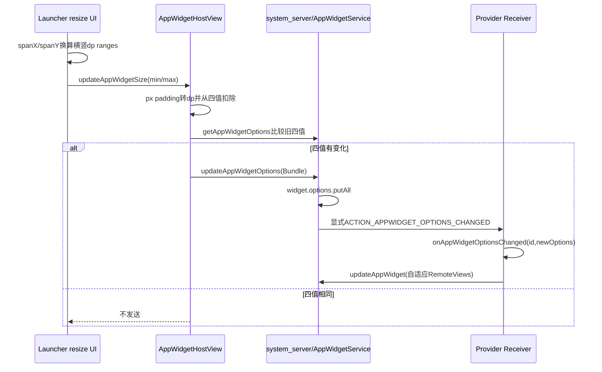
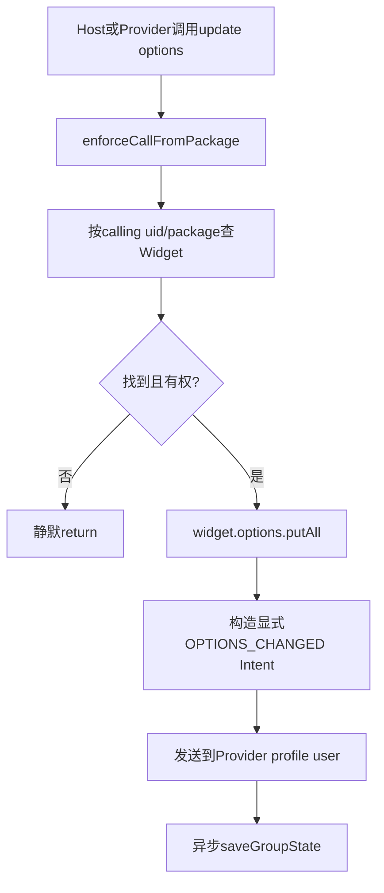
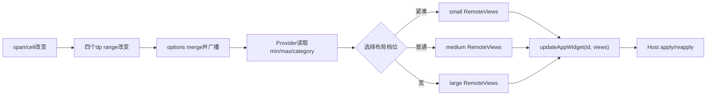

# 第 366 章 Android AppWidget尺寸：Ranges、Options合并、变化广播与自适应更新链

> 源码基线：Android 11 / API 30 / `android-11.0.0_r48`。本章只在macOS阅读源码，不编译。前面已经讲清Widget内容与集合；本章追Host拖动尺寸后怎样生成四个dp范围、扣除默认padding、写入实例options，system_server怎样合并并给Provider发送显式OPTIONS_CHANGED广播，以及Provider怎样选择紧凑/宽屏布局而不制造更新循环。

## 1. Widget尺寸不是Provider自己测出来的

Provider进程没有Launcher中的真实cell、Workspace缩放和HostView Measure结果。尺寸建议由Host计算，经AppWidget options跨Binder传给system_server，再广播到Provider。

## 2. 四个标准尺寸键

`OPTION_APPWIDGET_MIN_WIDTH/MIN_HEIGHT/MAX_WIDTH/MAX_HEIGHT`都是int，API文档定义单位为density-independent pixels，也就是dp/dip，不是原始px。

## 3. 为什么不是一个width和height

同一span在横竖屏时cell物理尺寸不同；Host给下界和上界，Provider可设计在这一实例可能出现的范围内都合理的RemoteViews。

## 4. Options不只装尺寸

标准还包含`OPTION_APPWIDGET_HOST_CATEGORY`和`OPTION_APPWIDGET_RESTORE_COMPLETED`，Bundle也允许Host/Provider写额外信息。不同键的生产者和持久化边界并不相同。

## 5. Host category的默认值

绑定Widget时若options没给category，system_server补`WIDGET_CATEGORY_HOME_SCREEN`。KEYGUARD/SEARCHBOX Host应显式提供相应category。

## 6. 初始options与后续options

绑定时Host可传一份初始Bundle；后续Host或Provider调用`updateAppWidgetOptions(id,bundle)`，服务端在现有实例Bundle上增量`putAll`。

## 7. 谁可以读写

服务端按calling uid/package查Widget，允许该实例的Host或Provider访问；无权/找不到时update静默return，get返回Bundle.EMPTY。它不是任意应用共享配置表。

## 8. AppWidgetHostView提供尺寸helper

`updateAppWidgetSize(newOptions,minWidth,minHeight,maxWidth,maxHeight)`接收已经以dp表示的完整HostView范围，自动扣framework默认padding，再决定是否上报。

## 9. 尺寸变化总链



## 10. Launcher从span算尺寸

Launcher3的`getWidgetSizeRanges()`读取横屏和竖屏cell size，把`spanX*cellWidth`与`spanY*cellHeight`从px除density得到dp。

## 11. Rect四边被借作四个语义

Launcher把`Rect(left,top,right,bottom)`设成`(portWidth, landHeight, landWidth, portHeight)`，再依次当minWidth、minHeight、maxWidth、maxHeight传给HostView。

## 12. 不是屏幕上的几何Rect

这里left/right不是X坐标，top/bottom不是Y坐标，而是复用Rect存四个范围值。阅读时必须跟调用参数对应，不能拿width()/height()解释。

## 13. min/max依赖设备形态假设

r48直接把portrait width当min width、landscape width当max width，把landscape height当min height、portrait height当max height，没有再调用Math.min/max。常规手机成立，特殊cell布局需产品验证。

## 14. Resize mode先限制可拖方向

Launcher读取ProviderInfo.resizeMode，决定水平/垂直边框能否改变span；options记录的是最终可能范围，不重新执行resizeMode授权。

## 15. 跨过cell阈值才变span

拖动像素先累计，只有达到cell跨度增减并成功`createAreaForResize()`时才更新LayoutParams span和size ranges，避免每个MOVE都发一次尺寸广播。

## 16. 拖动中会及时上报

`resizeWidgetIfNeeded(onDismiss=false)`在接受新span后调用updateWidgetSizeRanges；dismiss收尾分支不重复上报，因为拖动阶段通常已发过最后span。

## 17. Host helper自己再做等值抑制

即使Launcher重复计算同一span，AppWidgetHostView会先get旧options，只有四个扣padding后的值至少一个不同才调用服务端update。

## 18. 两层节流作用不同

Launcher cell阈值减少计算/布局变化；Host四值比较减少Binder和广播。它们都不是时间debounce，也不等待用户松手才统一发送。

## 19. 默认padding从哪里来

AppWidgetHostView读取framework内部四个`default_app_widget_padding_*` dimension，结果单位px；setAppWidget时也把同样padding设到HostView容器。

## 20. r48 helper忽略component参数

公开`getDefaultPaddingForWidget(context, component, rect)`直接转到私有方法，component没有参与计算。注释谈旧target兼容，但该实现总按当前framework资源值返回，OEM overlay可改变数值。

## 21. Padding为何要扣掉

Host传入的是分配给整个AppWidgetHostView的外框；Provider真正可布局内容区域要减掉Host自动加的左右/上下padding，否则会高估可用空间。

## 22. px转dp的具体公式

`xPaddingDips=(int)((left+right)/density)`，Y同理；先求px总和再除density，最后强转int向零截断，不做四舍五入。

## 23. 四个范围都扣同一轴padding

minWidth和maxWidth都减xPaddingDips，minHeight/maxHeight都减yPaddingDips。Host默认padding不随横竖范围单独变化。

## 24. ignorePadding隐藏参数

隐藏重载允许`ignorePadding=true`，此时不扣。普通Host调用公开方法默认false；自定义Host若自己已排除padding才应使用隐藏能力。

## 25. 重复扣padding的后果

如果调用者传的本来就是内容区域dp，helper又扣一次，Provider收到的范围偏小，可能错误选择紧凑布局。

## 26. 完全不扣的后果

若自定义Host传外框却使用ignorePadding，Provider高估空间，文字/按钮可能落入Host padding或被裁剪。

## 27. 参数Javadoc有文字错误

r48注释把minHeight写成“maximum height”，又把maxHeight描述成“upper width”。应以常量定义、变量名和实际写键代码为准，不复制文档笔误。

## 28. 负值不会在helper中clamp

若外框小于默认padding，减法可得到负min/max；AppWidgetHostView仍会与旧值比较并发送。调用者应保证合理尺寸。

## 29. 持久化又会把负值改成0

写AppWidget XML时服务端仅把大于0的尺寸写原值，否则写0；因此同一boot内存/广播可能为负，重启加载后变0，存在运行态与持久态差异。

## 30. density来源属于Host

padding px和density都从Host View resources取得，范围也是Host对自己cell的解释。Provider不要再用自身density把options当px二次换算。

## 31. helper会读取服务端旧值

每次调用`getAppWidgetOptions(mAppWidgetId)`跨Binder取Bundle；旧键缺失时`getInt`默认0。四值全为0且新值也0就不会上报。

## 32. newOptions为null会新建Bundle

尺寸helper允许null，内部new Bundle后写四个尺寸。它不会把旧完整Bundle复制到newOptions；服务端putAll保留未覆盖旧键。

## 33. newOptions非null会被原地修改

尺寸变化时helper向调用者传入的Bundle写四个标准键。调用者继续持有该对象会看到变化；跨进程服务端通常收到Parcel副本。

## 34. 尺寸没变时附加options也被丢弃

needsUpdate只比较四个尺寸；若它们相同，helper不调用`updateAppWidgetOptions(newOptions)`，即使newOptions包含新的自定义键。附加信息应直接调用updateAppWidgetOptions，或单独比较。

## 35. 这是helper而非服务端规则

直接`AppWidgetHostView.updateAppWidgetOptions(bundle)`不会做四值比较；AppWidgetManager也直接Binder调用。只有updateAppWidgetSize封装会这样抑制。

## 36. 服务端采用增量merge

找到Widget后执行`widget.options.putAll(options)`。传入Bundle同名键覆盖，未出现的旧键继续保留；不是整Bundle replace。

## 37. 缺少删除key协议

因为只putAll，客户端把某key从自己Bundle移除再更新，服务端旧key不会消失。可以覆盖为新值/null，但key仍可能存在；公开API没有“用这份Bundle完全替换”的语义。

## 38. 服务端不做值相等判断

即使传入键值与现有完全相同，它也照样putAll、发送OPTIONS_CHANGED、安排异步保存。调用方必须自己抑制无意义重复。

## 39. 直接传null可能怎样

AppWidgetManager方法未显式NonNull检查，服务端随后`putAll(options)`也无null保护；传null可产生服务端NullPointerException经Binder返回。应始终传真实Bundle。

## 40. Options更新服务端图



## 41. 调用包先过UID校验

`enforceCallFromPackage(callingPackage)`防止Binder调用者冒用其它包名；随后lookup再确保该uid/package确实是此Widget的Host或Provider。

## 42. 跨profile按关系授权

parent Launcher可访问自己托管的profile Provider Widget，因为lookup理解Host/Provider关系；任意跨user数字仍不会通过。

## 43. 广播是显式组件

system_server设置component为`widget.provider.info.provider`，不会让其它声明同action的Receiver竞争接收。

## 44. 广播发往Provider user

调用`sendBroadcastAsUser(intent, provider profile)`并先clearCallingIdentity；工作资料Provider在资料user收到，不会跑到parent Launcher user的同包实例。

## 45. Intent携两个必要extra

`EXTRA_APPWIDGET_ID`标识实例，`EXTRA_APPWIDGET_OPTIONS`放当前完整`widget.options`，不是只放本次变化的delta。

## 46. Provider基类的分发门

AppWidgetProvider.onReceive要求action匹配，extras同时包含id和options，才调用`onAppWidgetOptionsChanged()`；缺任一项就忽略。

## 47. 回调一次只对应一个实例

OPTIONS_CHANGED携单个appWidgetId，不像ACTION_APPWIDGET_UPDATE可带id数组。Provider应按实例读取尺寸并生成对应RemoteViews。

## 48. 回调运行在Provider Receiver线程

通常是Provider进程主线程的BroadcastReceiver回调；不要在其中做长时间网络/数据库阻塞。快速选择布局并更新，重工作交给合适后台机制。

## 49. 广播发送不是同步业务完成

updateAppWidgetOptions Binder方法安排广播后返回，不等Provider回调完成，也不等它调用updateAppWidget，更不等Launcher apply或屏幕present。

## 50. 完整自适应闭环



## 51. Provider应更新Views而非再次写相同options

onAppWidgetOptionsChanged的典型动作是读取newOptions、构造RemoteViews并`updateAppWidget()`。若无条件调用updateAppWidgetOptions写回同值，服务端不抑制，会再次广播形成循环。

## 52. Provider也有写options权限

API文档允许associated Provider访问；例如restore完成后Provider把RESTORE_COMPLETED设true。但写后仍会给自己发OPTIONS_CHANGED，必须做旧值比较或一次性状态机。

## 53. Restore completed的建议顺序

文档要求恢复后先把OPTION_APPWIDGET_RESTORE_COMPLETED设true，再updateAppWidget刷新Views。两次调用没有共同事务，崩溃可留下只更新一侧的中间态。

## 54. category通常由Host控制

Provider不应随意覆盖HOME/KEYGUARD/SEARCHBOX，因为Host最清楚承载位置；但服务端没有按key区分写权限，Provider技术上可putAll覆盖。

## 55. 自定义key也缺少所有权隔离

Host和Provider共享同一个Bundle命名空间，同名自定义key最后写入者获胜。应使用包名前缀并约定生产者，避免碰撞。

## 56. Provider收到的是当前合并快照

广播extra引用服务端widget.options写入Parcel，包含此前保留键和本次覆盖键；它不是“changedKeys”。Provider要自行比较或只根据当前快照做幂等渲染。

## 57. getAppWidgetOptions返回副本边界

跨进程Binder天然Parcel复制；若本地Binder，服务端`cloneIfLocalBinder`也克隆Bundle，避免调用者直接修改system_server内存对象。

## 58. Bundle.EMPTY不可修改假设

找不到Widget返回Bundle.EMPTY；调用者不应尝试把它当可变持久配置，先确认id和授权，再新建Bundle更新。

## 59. 只比较关心的布局档位

Provider可把连续dp映射成small/medium/large三档，只有档位改变才推新RemoteViews。这样拖动跨多个cell时减少重复布局构造。

## 60. 但首次回调不能假设旧档位存在

进程重启后Provider内存缓存为空，options可能已持久化；ACTION_APPWIDGET_UPDATE也应读取options并生成当前档位，不能只依赖OPTIONS_CHANGED增量。

## 61. minWidth的实用含义

通常代表该span在较窄方向/配置下可用内容宽下界；设计至少要在这个值不截断关键按钮与文字。

## 62. maxWidth的实用含义

代表可能出现的较宽配置上界，可用于决定是否展示第二列、更多文字或操作，但不能假设当前此刻一定就是max。

## 63. 高度同理

min/maxHeight描述可能范围；列表行数、图片比例等可按档位调整。不要把maxHeight误作Launcher测得的实时像素高度。

## 64. Android 11没有尺寸列表API

本章基线只有四个范围键，不应倒灌后续Android版本的精确尺寸候选列表API语义。r48 Provider只能基于range和category推断。

## 65. Options不是MeasureSpec

它没有EXACTLY/AT_MOST模式，也不参与Host真实measure强制；最终View仍由Launcher cell和AppWidgetHostView布局裁剪。Provider应做弹性布局。

## 66. options更新不自动重apply旧Views

system_server只发Provider广播并保存options，不重新发送widget.views。Provider若希望视觉变化，必须显式updateAppWidget。

## 67. Provider不响应也不会被系统代布局

旧RemoteViews继续显示并由Host拉伸/裁剪。系统不知道哪个子View该隐藏、列数该改或图片该换。

## 68. updateAppWidget可与回调异步交错

多个连续OPTIONS_CHANGED可能排队，Provider为旧尺寸生成的更新可能晚于新尺寸。使用当前getAppWidgetOptions复核、档位版本或串行任务避免旧结果覆盖新结果。

## 69. 广播有序性不能代替业务代际

同一Receiver主线程通常顺序处理，但后台工作完成顺序可反转，system_server views缓存只保留最后到达的更新。异步任务应在提交前检查仍对应当前档位。

## 70. Host尺寸抑制只看服务端旧值

get与update是两个Binder事务，中间另一个调用者可改options；helper没有原子compare-and-set。并发Host/Provider写同键存在TOCTOU，最后putAll胜出。

## 71. newOptions可能覆盖并发标准键

helper在发送前向newOptions写自己算的四值，能覆盖调用者预放尺寸；服务端再merge。不要同时由多个组件竞争生成尺寸键。

## 72. Options与Widget关系保存非同步事务

服务端内存先putAll、发广播，再`saveGroupStateAsync`。磁盘写失败/崩溃可使当前boot Provider已按新尺寸更新Views，但重启options回旧。

## 73. XML只持久化标准子集

r48写Widget XML只保存四尺寸、host category及条件下restore completed；任意自定义options不序列化，重启后会消失。

## 74. 自定义key不能当数据库

它适合作为当前运行提示，不适合保存重要用户配置。Provider自己的SharedPreferences/数据库才是业务持久化源。

## 75. 0值持久化语义

缺失或非正尺寸最终XML写0；解析后Bundle含对应键值0。Provider应把0理解为未知/未建立有效范围，而不是确有0dp可用空间。

## 76. category按十六进制写XML

尺寸和category用Integer.toHexString序列化、再base16解析。它是内部格式，阅读dump/XML时不要把字符串“10”默认当十进制10。

## 77. Restore键按boolean字符串

只有saveRestoreCompleted条件允许时写`restore_completed`；读取用Boolean.valueOf。它与四尺寸的hex编码不同。

## 78. 初次绑定可已有尺寸

Launcher在bind前可计算options并传入；Provider收到首次UPDATE时就能getAppWidgetOptions选择布局，不必等用户第一次resize。

## 79. Launcher WidgetHostViewLoader会预填

AOSP Launcher在放置流程中计算size ranges，把四键加入绑定options。源码阅读要把“bind初始值”和“拖动后update”两条入口合并起来。

## 80. QSB也可直接更新options

Launcher的搜索框Host路径构造Bundle后直接`updateAppWidgetOptions`，说明并非所有尺寸都必须经过AppWidgetHostView helper；直接路径需自己避免重复。

## 81. 无障碍resize也走helper

LauncherAccessibilityDelegate调用HostView.updateAppWidgetSize，最终与触摸resize汇入同一options链，Provider无需区分输入方式。

## 82. 旋转未必改变span却可能改range

四值本来已经同时包含横竖cell估算；若设备profile/cell size变化，Launcher重新计算才可能上报。单纯当前方向切换不必等于options每次交换。

## 83. density变化会重新量化dp

cell px与padding px都受资源/density影响；换显示密度后计算结果可能相同或因截断差1dp，Host比较发现变化便广播。

## 84. OEM padding overlay会影响内容range

framework内部dimen可被产品配置，Host扣除值随设备不同。Provider不能硬编码“AOSP一定左右各8dp”之类常量。

## 85. Provider元数据minWidth不是实例options minWidth

ProviderInfo的minWidth/minHeight用于Launcher初始span/可选尺寸资格；options四值描述某个已经绑定实例的Host实际范围。名字相近、生产阶段不同。

## 86. minResizeWidth也不是options下界

它约束Host允许缩到多小；实际cell离散化、padding和方向范围计算后，options minWidth可能不同。

## 87. resizeMode不随options广播重复携带

ProviderInfo元数据已由Host读取；OPTIONS_CHANGED Bundle标准字段没有resizeMode。Provider本身当然知道manifest配置，但不应期待回调extra包含它。

## 88. Host category影响默认View

第362章看到KEYGUARD category可选择initialKeyguardLayout；即使Provider不响应尺寸变化，Host default view路径也会读取options category。

## 89. Restore completed影响备份恢复

它不是布局尺寸，却与同一Bundle、同一update广播共享链。Provider更新该值时可能收到options callback，应确保处理幂等。

## 90. Provider回调示例

```java
public void onAppWidgetOptionsChanged(Context c, AppWidgetManager m,
        int id, Bundle o) {
    int minW = o.getInt(AppWidgetManager.OPTION_APPWIDGET_MIN_WIDTH, 0);
    int minH = o.getInt(AppWidgetManager.OPTION_APPWIDGET_MIN_HEIGHT, 0);
    LayoutMode mode = chooseMode(minW, minH);
    m.updateAppWidget(id, buildViews(c, id, mode));
}
```

## 91. 示例为何只读不写options

newOptions已经是服务端当前快照；回调只派生RemoteViews。若还把同一Bundle写回服务端，会触发下一轮OPTIONS_CHANGED。

## 92. 选择档位要用纯函数

相同options应得到相同mode和Views结构，便于恢复、重试与测试。不要依赖“这是第几次回调”改变布局。

## 93. 文本宽度不能只看minWidth整数

字体缩放、语言、Host padding、RemoteViews允许控件与实际Measure仍影响显示。range只做粗粒度布局档位，TextView还要ellipsize/maxLines等弹性策略。

## 94. 图片尺寸不要等于maxWidth原图

options是dp上界，不是要求Provider传同尺寸Bitmap；Launcher density、内存上限和缩放都要考虑，优先适当采样或受权URI。

## 95. 集合Widget resize后也要刷新Factory吗

若行布局/数量依赖新档位，Provider先update顶层RemoteViews，必要时再notifyAppWidgetViewDataChanged；两条链独立，没有自动事务顺序。

## 96. 可只换顶层而复用Service身份

Service Intent FilterComparison保持相同，RemoteViewsAdapter可能复用Factory；若Factory需要知道尺寸，应从Provider自己的共享状态读取并显式通知data changed，不能期待Service onBind extras自动变化。

## 97. 每实例尺寸要按appWidgetId保存

一个Provider可有多个Widget，各span不同。不要用进程全局单一mode；以appWidgetId为key读options/构建Views，删除实例时清业务缓存。

## 98. 但标准options已由system_server按实例保存

Provider通常可随时`getAppWidgetOptions(id)`，无需把四值再重复持久化；若保存派生mode，要处理系统options与自有数据无共同事务。

## 99. 更新风暴的三层防线

Host只在span/range变化时调用、HostView比较四值、Provider只在派生档位变化时推复杂Views。服务端本身不提供等值防线。

## 100. 时间debounce要谨慎

若Provider后台合并多次回调，只提交最新options对应结果；不能简单延迟后使用最早Bundle。提交前重新get当前options更安全。

## 101. 调试先打印四值和单位

同时记录spanX/Y、portrait/landscape cell px、density、padding px/dp、扣除前后range。多数“少一格”问题来自单位或padding重复计算。

## 102. 再区分广播与Views更新

看到OPTIONS_CHANGED只证明Provider收到配置；要继续查Provider是否调用updateAppWidget、system_server是否缓存、Host是否apply以及最终布局Measure。

## 103. dumpsys/options不是当前像素实测

它显示服务端保存的dp范围快照，可能因异步保存、Host未上报或产品cell变化而陈旧。不要用它替代View层实际bounds截图/布局检查。

## 104. 负值或0先查Host输入

检查调用者是否传px而非dp、是否已扣padding又被helper再扣、Host frame是否小于padding，以及重启持久化clamp是否把之前负值变0。

## 105. 自定义option没到Provider先查helper

若通过updateAppWidgetSize捎带自定义key，而四尺寸没变，整个调用被抑制；改为直接updateAppWidgetOptions并自行做值比较。

## 106. 广播循环先查Provider回调

在onAppWidgetOptionsChanged中搜索updateAppWidgetOptions；若写回同值，服务端仍再次广播。改为只updateAppWidget，或先比较且仅在确需改变标准状态时写一次。

## 107. 服务端写入安全与广播伪造要分开

真正改变system_server options必须通过calling package/uid和Widget Host/Provider关系校验；但AppWidgetProvider.onReceive本身只按action/extras分发，没有验证广播发送者。若Receiver可被外部显式调用，伪造OPTIONS_CHANGED可诱发一次Provider回调却不能直接改服务端账；敏感逻辑应重新getAppWidgetOptions核实。

## 108. onReceive覆写必须调用super

AppWidgetProvider子类若完全吞掉onReceive且不调用super，OPTIONS_CHANGED不会分发到onAppWidgetOptionsChanged，和其它enabled/update/deleted回调一样。

## 109. 广播回调中Bundle应当只读

修改newOptions只是改Provider进程收到的对象，不会反向修改system_server；要持久更新必须显式API调用，而那又会触发新广播。

## 110. 一条准确完成语义

updateAppWidgetOptions返回：服务端内存已merge并已发起显式广播/异步保存；不保证Provider已处理、磁盘已落、Views已更新、Host已布局或帧已显示。

## 111. 本章源码入口地图

Launcher3看AppWidgetResizeFrame/WidgetHostViewLoader；framework客户端看AppWidgetHostView、AppWidgetManager、AppWidgetProvider；服务端看AppWidgetServiceImpl的update/get、sendOptionsChangedIntentLocked和XML options读写。

## 112. macOS只读练习一：手算range

阅读Launcher3 `getWidgetSizeRanges()`与AppWidgetHostView.updateAppWidgetSize。任选横竖cell px、span、density和padding，算Rect四值与扣padding结果，并解释为什么Rect不是坐标。

## 113. macOS只读练习二：验证附加key丢失

逐行读updateAppWidgetSize的needsUpdate分支。假设四尺寸与oldOptions相同、newOptions新增`com.example.mode=x`，写出是否调用服务端；再比较直接updateAppWidgetOptions的结果。

## 114. macOS只读练习三：追广播循环

阅读AppWidgetServiceImpl.updateAppWidgetOptions、sendOptionsChangedIntentLocked和AppWidgetProvider.onReceive。证明服务端没有equals门，并画出Provider回调中无条件写同options时的循环。

## 115. macOS只读练习四：核对持久化子集

阅读serializeWidget与parseWidgetIdOptions，列出会写XML的键、负尺寸怎样处理、自定义key怎样消失。说明内存merge成功和重启后状态为何可能不同。

## 116. 自测一：为什么回调拿到的是四个range

同span在横竖cell配置下宽高不同，Launcher把portrait/landscape候选折成上下界；Provider获得的是可适配范围，不是当前View某一时刻的唯一Measure宽高。

## 117. 自测二：为什么相同options仍反复广播

只有AppWidgetHostView尺寸helper比较四值；直接AppWidgetManager调用到服务端后总是putAll并send。Provider或QSB等直接调用者必须自行比较。

## 118. 自测三：为什么重启后自定义key没了

服务端运行时Bundle允许任意键，但XML序列化只保存标准尺寸/category/restore字段。自定义options不是业务数据库，进程/设备恢复后需要由Host或Provider重新提供。

## 119. 本章最容易误解的五点

第一，四值是dp范围不是px实测；第二，Host helper会扣padding；第三，尺寸不变时捎带自定义key也不发送；第四，服务端直接更新从不等值抑制；第五，options广播不会自动改变RemoteViews。

## 120. 本章收束与下一章入口

尺寸自适应是一条Host生产、system_server合并保存、Provider消费并主动更新Views的反馈链。理解单位、padding、范围、增量Bundle、非持久自定义键与非原子完成点，才能避免错布局和广播循环。下一章继续AppWidget固定内容控制：RemoteViews中的Text、Image、Progress、Chronometer与ViewStub等常用Action怎样编码、合并和在Host执行。
