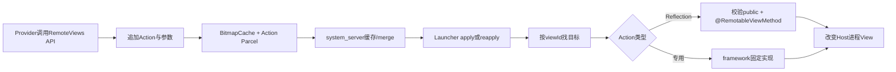
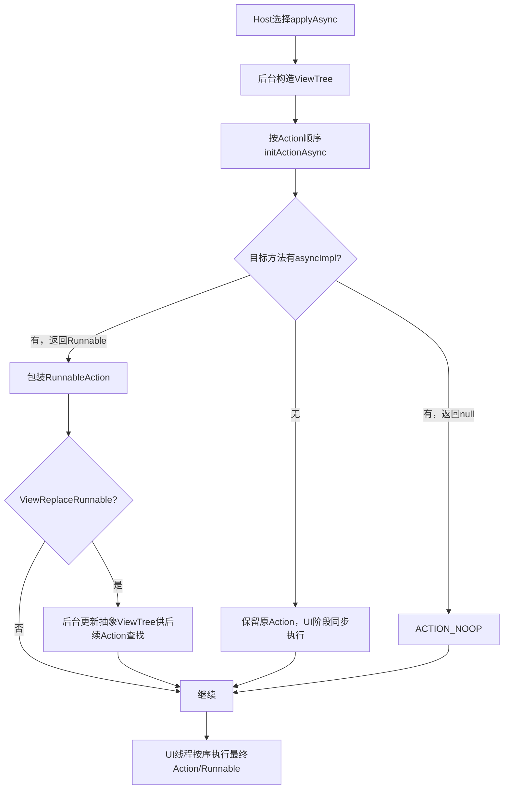
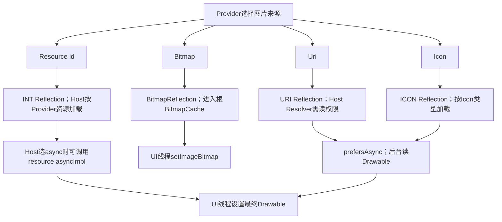

# 第 367 章 Android RemoteViews常用控件Action：文本、图片、进度、计时、布局与异步执行链

> 源码基线：Android 11 / API 30 / `android-11.0.0_r48`。本章只在macOS阅读源码，不编译。第362章讲过RemoteViews安全沙箱，本章把常用API逐个落到Action：哪些只是ReflectionAction的便捷封装，哪些有专用Parcel格式，图片怎样选择资源/URI/Bitmap/Icon，Chronometer与ProgressBar一次调用为何生成多条Action，ViewStub怎样在异步预处理阶段改写ViewTree，以及partial update合并时哪些旧状态会留下。

## 1. RemoteViews API本质是录制命令

Provider调用`setTextViewText()`时并未接触Launcher里的TextView，只向mActions追加一条可Parcel的命令；Host inflate布局后才按顺序找viewId并执行。

## 2. 四类实现先分清

常用API可分为ReflectionAction、BitmapReflectionAction、专用Action，以及由多个Action组合的便捷方法。分类决定Parcel编码、merge key、异步准备与内存统计。

## 3. ReflectionAction不是无限反射

它只编码固定参数类型，并要求目标public方法带`@RemotableViewMethod`；任意methodName字符串仍过framework白名单检查。

## 4. 专用Action直接调用受控逻辑

TextViewSizeAction、ViewPaddingAction、LayoutParamAction、SetDrawableTint等在framework内写死目标操作，不通过公开字符串反射。

## 5. 组合API会改变Action数量

`setChronometer()`追加base、format、started三条ReflectionAction；`setProgressBar()`至少追加indeterminate一条，确定模式再追加max和progress。

## 6. 为什么Action数量重要

执行按列表顺序，partial merge又按每条unique key替换/追加；一次“高级API”不是不可拆分事务，中途异常或与其它Action交错都可能产生部分状态。

## 7. Provider到Host总图

## 8. addAction负责初始化列表

普通API最终调用私有addAction；它在mActions为null时new ArrayList，并拒绝继续修改已经由横竖两个RemoteViews组合成的外层对象。

## 9. 横竖组合必须先各自配置

先分别给landscape和portrait添加Action，再构造`new RemoteViews(landscape, portrait)`；组合后再调setText等会抛RuntimeException。

## 10. Action按追加顺序执行

同一次完整RemoteViews中，后Action可覆盖前Action。比如先setTextColor红再蓝，Host最终通常显示蓝；但两条仍可能都执行。

## 11. 找不到viewId常静默跳过

ReflectionAction和多数专用Action都在target为null时return。布局版本/方向错配可能只让某个属性没生效，不一定整Widget报错。

## 12. 找到错误类型可能抛异常

Reflection方法不存在或未标注会ActionException；TextViewSizeAction的泛型find结果转TextView也可能ClassCastException。Host主内容链会尝试fallback，仍失败则error view。

## 13. Reflection支持哪些参数

boolean、byte、short、int、long、float、double、char、String、CharSequence、Uri、Bitmap、本地Bundle、Intent、ColorStateList和Icon各有固定type编号。

## 14. 参数签名必须精确

`setInt(id,"setFoo",1)`只找`setFoo(int)`，不会自动匹配Integer、long或重载的其它参数。方法名相同但type不同是不同Action key。

## 15. 每个type有固定Parcel读写

primitive直接写值，CharSequence走TextUtils，Uri/Intent/Icon等走typed object，Bitmap常规Reflection type只用于本地转接；持久Action用独立BitmapReflectionAction去重。

## 16. Reflection unique key的组成

基础是`actionTag_viewId`，再拼methodName和type。partial update只替换完全相同viewId、方法名和参数type的旧Action。

## 17. 重载会留下两条Action

旧缓存有`setTextColor(int)`，partial更新改用隐藏`setTextColor(ColorStateList)`；type不同，旧int Action不会被移除，新旧都会保留并按合并后的顺序执行。

## 18. merge替换会移动顺序

MERGE_REPLACE不是原位置赋值：先移除旧Action，再把新Action追加到列表末尾。相对其它Action的顺序可能变化，最终状态要看合并后列表而非Provider新片段单独顺序。

## 19. smoothScrollBy是Reflection特例

只有methodName精确为`smoothScrollBy`时mergeBehavior返回APPEND，其它Reflection默认REPLACE；累积滚动因此保留多条。

## 20. smoothScrollByOffset不是这个特例

公开`setRelativeScrollPosition()`调用`smoothScrollByOffset(int)`，方法名不同，仍是REPLACE。注释中的累积特例不能泛化到所有滚动API。

## 21. setTextViewText的真实编码

它调用`setCharSequence(viewId,"setText",text)`，Host最终校验TextView的`setText(CharSequence)`带RemotableViewMethod并调用。

## 22. 文本已经是CharSequence值

API不接受string resource id重载；Provider若传`context.getText(R.string.x)`，实际文字/Span随Parcel发送。语言变化后需重新update，不能指望Host凭资源id重取字符串。

## 23. CharSequence可携受支持Span

TextUtils Parcel保留framework支持的ParcelableSpan，但自定义任意Span并非可靠跨进程协议。文本长度与span数量同样增加Parcel和Host布局成本。

## 24. null文本是合法值

ReflectionAction可写null CharSequence，TextView.setText(null)按控件语义显示空文本；它不是“忽略这条Action”。

## 25. setTextColor(int)仍是Reflection

便捷API调用`setInt(viewId,"setTextColor",color)`；ColorInt只是整数，不从Provider资源延迟解析。

## 26. ColorStateList重载是隐藏API

它用ReflectionAction.COLOR_STATE_LIST，可保留不同状态颜色；普通第三方以公开API为准，不应反射调用隐藏重载。

## 27. setTextViewTextSize是专用Action

它保存units和float size，Host直接强转TextView后调用`setTextSize(units,size)`，unique key只按专用tag+viewId。

## 28. 单位在Host执行时解释

传SP会结合目标View Context的DisplayMetrics/fontScale换成px；传PX就是原始像素。Provider不要把已经换成px的值再标SP。

## 29. 专用TextSize绕过Remotable注解检查

它是framework固定Action直接调用两参数setTextSize，不通过Reflection的签名/注解缓存；安全性来自Action代码和TextView强类型目标。

## 30. 文本可访问性也走Reflection

`setContentDescription()`是`setCharSequence(...,"setContentDescription")`；`setLabelFor()`是setInt。它们改变Host View语义，Provider应随可见文字一起更新。

## 31. overrideTextColors遍历整棵树

隐藏OverrideTextColorsAction用Stack深度遍历当前View树，对每个TextView先清除文字中的颜色Span，再设置统一颜色。

## 32. 它不只改一个viewId

该Action没有目标id概念，影响当前树全部TextView；它的unique key继承默认viewId初值，partial merge行为需要谨慎，通常由系统浅色背景策略使用。

## 33. override顺序很关键

若它在单个setTextColor之后执行，会覆盖单色；若单个颜色Action在它之后执行，又可覆盖对应View。它还会改Text内容以移除ColorSpan。

## 34. setViewVisibility是Reflection

它调用`setInt(viewId,"setVisibility",visibility)`；View.setVisibility带RemotableViewMethod，ImageView等override也可带注解。

## 35. visibility参数不会提前校验

RemoteViews API接受任意int，合法性/控件行为留到Host方法；应用应只传VISIBLE/INVISIBLE/GONE。

## 36. ViewStub是visibility的特殊目标

普通View只改显示状态；未inflate的ViewStub收到VISIBLE或INVISIBLE会inflate布局并在parent中替换自身，GONE则不inflate。

## 37. 同步ViewStub会当场改树

Action执行到setVisibility时ViewStub.replace，后续Action若按新child id查找，live View树已经包含新布局；顺序正确才能命中。

## 38. 先写child Action会静默丢失

若Provider先追加“设置Stub内部TextView文字”，再追加“Stub VISIBLE”，第一条执行时child尚不存在便return；后面inflate也不会补执行丢掉的文字Action。

## 39. 异步ViewStub有专门Runnable

ViewStub的`setVisibilityAsync()`在后台inflate但不attach，返回ViewReplaceRunnable；RemoteViews异步准备识别它并更新ViewTree，UI阶段Runnable再真正替换。

## 40. 异步Action准备图

## 41. 异步不代表所有setter都在后台

没有asyncImpl的方法返回原ReflectionAction，最终仍在UI线程调用；只有控件作者显式提供的预处理会转成RunnableAction。

## 42. ACTION_NOOP的两种来源

异步树找不到目标直接NOOP；async方法认为无需变化或返回null也NOOP。它表示该Action在最终UI阶段不做事，不等于整个RemoteViews取消。

## 43. 图片资源API的编码

`setImageViewResource()`最终是INT ReflectionAction，方法名`setImageResource`。资源id由目标ImageView Context解释，来自Provider资源环境。

## 44. resource id为0可清图片

ImageView.setImageResource(0)会解析为空/清除。无效非0资源在同步路径可能记录/失败，异步实现捕获异常后把resId改0并返回清空Drawable的Runnable。

## 45. 资源Action也有asyncImpl

ImageView.setImageResource声明`asyncImpl=setImageResourceAsync`，Host已选择async时可后台加载Drawable；但ReflectionAction.prefersAsyncApply只对URI/Icon返回true，INT资源本身不会建议Host自动异步。

## 46. prefersAsync只是提示

AppWidgetHostView是否异步仍取决于Host是否配置Executor；resource/URI/Icon有asyncImpl也不会自行创建通用线程池切换主链。

## 47. URI API先在Provider规范化

`setUri()`对非null URI调用getCanonicalUri；StrictMode开启file URI暴露检查时还会checkFileUriExposed，然后才录制ReflectionAction。

## 48. URI不等于网络图片加载器

ImageView文档说明setImageURI用于本地URI；content/file等由Host Context读取。HTTP URL没有RemoteViews自动下载、缓存、重试协议。

## 49. URI读取身份属于Host

异步ImageView也是用View的Context `getDrawableFromUri()`；AppWidgetService不会自动grant。Provider必须确保Launcher有URI读权限。

## 50. URI异步失败会怎样

`setImageURIAsync()`若加载不到Drawable，把uri改null并返回callback；UI阶段设置空Drawable/空URI，而不是保留旧图片或显示系统错误图。

## 51. 相同URI可能返回NOOP

ImageView发现当前resource=0且URI相等时asyncImpl返回null，RemoteViews把它变ACTION_NOOP，避免重复读取。

## 52. Bitmap API使用专用缓存Action

`setImageViewBitmap()`调用setBitmap，追加BitmapReflectionAction；它把Bitmap登记到RemoteViews根BitmapCache，Action Parcel只写bitmapId。

## 53. 同一对象可在一棵RemoteViews去重

BitmapCache用contains/indexOf找已有Bitmap；多个Action引用同一/相等对象时可能复用id，避免同一根RemoteViews Parcel重复写多份。

## 54. 去重不消除Bitmap总内存

bitmap仍要flatten到Parcel并在进程间传递，system_server还按BitmapCache估算内存上限。大图应在Provider侧缩放。

## 55. BitmapAction执行时转成Reflection

Host apply里临时构造type=BITMAP的ReflectionAction，调用标注的`setImageBitmap(Bitmap)`；持久mActions不会存普通BITMAP Reflection类型。

## 56. Bitmap通常不做异步解码

Bitmap已经在Parcel中重建，ReflectionAction没有为BITMAP标记prefersAsync；ImageView.setImageBitmap也无asyncImpl。成本主要发生在传输/反序列化与UI设置。

## 57. Icon是另一种图片容器

`setImageViewIcon()`录制ICON ReflectionAction；Icon可封装资源、Bitmap或URI，Host调用ImageView.setImageIcon。

## 58. Icon支持后台loadDrawable

ImageView声明setImageIconAsync，Host异步路径可在后台`icon.loadDrawable(context)`，UI Runnable再setImageDrawable。

## 59. URI Icon也会被visitUris发现

ReflectionAction.visitUris对URI直接访问，对ICON进一步检查TYPE_URI/TYPE_URI_ADAPTIVE_BITMAP；Bitmap/resource Icon不报告URI。

## 60. null URI visit存在边角

ReflectionAction对URI直接`visitor.accept(uri)`，没有本地null过滤；具体消费者需容忍null。r48 AppWidgetService本身未调用visitUris。

## 61. 图片四种API选择

资源适合同Provider APK静态drawable；Bitmap适合小型动态像素；content URI适合已授权本地内容；Icon适合统一封装多种来源。选择还要结合Host权限和异步Executor。

## 62. setDrawableTint是专用Action

它可选目标背景Drawable，或在target为ImageView时取当前image Drawable；找不到Drawable就静默不做。

## 63. tint会先mutate

`targetDrawable.mutate().setColorFilter()`避免修改共享ConstantState影响其它View；但Action顺序必须在图片/背景已经存在之后才有目标。

## 64. 先tint再换图可能丢效果

Tint Action只修改当时Drawable，后续setImageResource/URI/Bitmap换成新Drawable后不保证继承该color filter；通常先设置图，再设置tint。

## 65. mode声明NonNull

公开隐藏方法参数注解NonNull，Action构造仍直接存；Parcel用PorterDuff mode整数。不要传null依赖注释所说“ignored”，实现可能在modeToInt等处失败。

## 66. Ripple颜色只认RippleDrawable

SetRippleDrawableColor读取target background，只有实例是RippleDrawable才mutate并setColor；普通ColorDrawable背景静默无效。

## 67. Progress tint走Reflection

progress、background、secondary、indeterminate tint列表各调用对应ColorStateList setter，方法必须在ProgressBar带RemotableViewMethod。

## 68. null ColorStateList可清tint

typed object支持null，ProgressBar setter用has标志保存“明确设置为null”，从而清除对应tint；这与target缺失的无操作不同。

## 69. setProgressBar的Action顺序

先setIndeterminate；若false再setMax、setProgress。这样确定模式下先退出indeterminate再设置范围与当前值。

## 70. indeterminate=true忽略两个参数

API根本不录制max/progress，而不是录制后由ProgressBar忽略。因此当前RemoteViews Action列表只有一条新状态命令。

## 71. partial切到indeterminate会留下旧Action

旧完整缓存里的setMax/setProgress与新partial的key不同，不会被删除；merge后它们仍可能在apply时执行，最后新setIndeterminate因被追加到末尾而决定视觉模式。

## 72. 再切回determinate会覆盖三键

新的false/max/progress分别替换旧同key并追加；最终值通常正确，但合并列表顺序经过多轮会变化，不能把高级API想象成单一原子记录。

## 73. ProgressBar自己clamp数值

RemoteViews不提前校验max/progress范围；Host控件setter负责规范化。Provider仍应传可理解数据并防除零/负业务语义。

## 74. Chronometer base必须用elapsedRealtime

base与Host同一设备的`SystemClock.elapsedRealtime()`时间基准对应；传wall clock毫秒会产生巨大错误显示。

## 75. setChronometer追加顺序

base、format、started依次录制。Host先改变参考时间并刷新文字，再改格式，最后启动/停止定时tick。

## 76. format改变时不立即updateText

Chronometer.setFormat只存字符串/Builder，不直接调用updateText；前一条setBase已先按旧format刷新。若setStarted使控件从未运行切到可见运行，updateRunning会按新format刷新；若本来已运行则等下一tick。started=false时新format可能不会立刻反映，属于顺序边角。

## 77. 复读源码确认format边角

setFormat源码没有invalidate/updateText；因此若RemoteViews对一个已停止且base Action先执行的Chronometer只改变format，显示可能保留旧格式直到另一触发。不要把“setter返回”当已重绘保证。

## 78. setStarted不改base

它只改mStarted并updateRunning；stop后时间显示冻结但参考base仍保留。重新start会根据当前elapsedRealtime继续计算。

## 79. Chronometer实际运行还有可见门

内部running取started、attached、window/view visible等状态组合；started=true不保证后台不可见Widget仍每秒tick。

## 80. countDown是第四个独立Action

`setChronometerCountDown()`录制boolean setCountDown，可在setChronometer之前或之后；它会立刻updateText当前elapsedRealtime，顺序会影响一次中间显示。

## 81. 倒计时base仍是elapsedRealtime目标点

countDown显示base-now；若base在未来则向0减少，过去后可显示负方向语义。它不是传“剩余秒数”。

## 82. 多Action执行不是事务

Chronometer三条中第二条若因签名/目标异常抛出，第三条不会执行；前面base可能已经改变。Host fallback fresh apply可能重建整树，但不能抽象成服务端原子属性包。

## 83. ViewPaddingAction参数单位是px

API Javadoc明确left/top/right/bottom为pixels；Action在Host直接setPadding，不做density换算。想表达dp应在Provider构造时用资源换成px，并考虑目标显示配置。

## 84. padding支持任意View

它直接找View并setPadding，不要求Remotable注解；不存在目标就return，参数负值如何表现由View实现处理。

## 85. LayoutParamAction是隐藏能力

r48支持marginEnd dimen、marginEnd px、bottom margin dimen和width；普通应用只依赖公开RemoteViews API，不应把隐藏方法当稳定契约。

## 86. Dimen资源在Host目标Context解析

`resolveDimenPixelOffset(target,resId)`用target Context resources；resId=0表示清零。Provider资源包装保证同包资源通常正确。

## 87. margin只对MarginLayoutParams生效

目标LayoutParams不是MarginLayoutParams时静默不做；width则对普通LayoutParams直接赋值并setLayoutParams触发布局。

## 88. width只允许三种值

隐藏API前置检查只接受0、MATCH_PARENT和WRAP_CONTENT，拒绝任意固定px，注释说明固定尺寸在density变化时表现差。

## 89. setViewLayoutWidth有r48初始化缺陷

它没有调用addAction，而直接`mActions.add(...)`；新RemoteViews的mActions初始为null，因此若width是第一条Action会NullPointerException。

## 90. 先加其它Action会掩盖缺陷

若此前setText等已通过addAction初始化列表，width调用成功。这种顺序依赖不是契约，说明隐藏API实现边角，不能推广为推荐技巧。

## 91. width还绕过组合对象保护

addAction会拒绝修改横竖组合外层；直接mActions.add既可能NPE，也没有执行这项检查。r48隐藏方法的行为与其它API不一致。

## 92. LayoutParam unique key包含property

同view的width、marginEnd、bottomMargin彼此不替换；同property新Action替换旧值。dimen与直接marginEnd是不同property key，可能同时保留并按顺序覆盖同一最终margin。

## 93. 专用Action默认merge都是REPLACE

除显式override外，unique key通常actionTag+viewId；同类同目标partial更新替换，异类Action即使修改同一视觉属性也不会互相删除。

## 94. “同一视觉属性”不等于同一key

ImageView resource(INT Reflection)、URI(URI Reflection)、Bitmap专用tag、Icon(ICON Reflection)都可改变图片，却是不同key；多轮partial会让旧图片Action共存。

## 95. 图片切换的最后顺序决定结果

从Bitmap partial切URI时，旧BitmapAction不被移除，新URI Action追加并最后执行，通常显示URI；再更新别的Bitmap key时顺序又变化。完整update更容易建立干净状态。

## 96. partial更新适合相同setter值变化

若只反复setText(CharSequence)或setProgress(int)，exact key会被替换；若改变表示方式/重载/Action类型，旧命令残留增加顺序复杂度。

## 97. 必要时发送完整RemoteViews重建基线

模式从resource图切URI、布局档位或ViewStub树结构大变时，完整update直接替换服务端Action缓存，比多轮partial更可预测。

## 98. Action异常传播到哪里

同步apply中异常停止后续Action并由AppWidgetHostView捕获；reapply失败会尝试fresh apply，仍失败显示error。集合旧ListAdapter可能没有同等级行级兜底。

## 99. 异步准备异常也会失败

asyncImpl找不到、后台URI/Icon加载抛出或ViewTree更新异常会交给AsyncApplyTask error；Host可能从async reapply转fresh async apply，最终onError处理。

## 100. Async Runnable最终仍在UI线程

后台只加载Drawable/inflate Stub等，真正setImageDrawable、replaceSelfWithView和普通setter保持在Host UI线程，避免并发改View树。

## 101. 取消异步任务的边界

新RemoteViews到达会cancel旧CancellationSignal；已完成的后台I/O或已在UI应用的属性不能回滚，nested取消仍有第362章提到的TODO。

## 102. 方法缓存按Class/参数/名字

getMethod结果存进静态sMethods，重复Action减少反射查找；同步handle和async方法名/handle一起懒加载。缓存不放宽注解校验。

## 103. 目标子类仍要方法可访问

getMethod从实际View Class找public签名，注解取Method；允许的framework子类可继承被标注方法。自定义View本身又会先被inflate白名单挡住。

## 104. URI与Icon的异步偏好可递归汇总

RemoteViews.prefersAsyncApply遍历mActions，只要某Action返回true即可提示；嵌套Action也有自己的实现边界。Host仍有最终决策权。

## 105. visitUris只做枚举不授予权限

ReflectionAction能报告URI/Icon URI，TextView等其它值中的URI未必被遍历；AppWidget链没有自动消费并授权。枚举API不能等同安全能力传递。

## 106. Bitmap内存只看BitmapCache

Icon内部Bitmap是否纳入同一估算要看Icon Parcel/Action实现，RemoteViews.estimateMemoryUsage直接返回mBitmapCache bitmap分配量；不要认为所有drawable成本都被该上限精确覆盖。

## 107. 调试先看Action生成而非API名字

同一便捷API可能生成三条，两个不同API可能生成同一种ReflectionAction。先在源码追到methodName/type/tag，再判断merge和执行。

## 108. 再核对目标实际Class与签名

确认当前方向布局的viewId存在、实际类正确、public方法参数精确并带RemotableViewMethod；只看XML里“像TextView”不足以证明setter成功。

## 109. 图片问题要四分

资源找不到、Host无URI权限、Bitmap超内存/事务、Icon加载失败是不同路径；不要统一归因“RemoteViews图片不支持”。

## 110. 时间问题先查时钟基准

Chronometer使用elapsedRealtime，不是currentTimeMillis；再查base、countDown、started、View可见/attach和format更新触发。

## 111. 一张常用API映射表

Text/visibility/image resource/URI/Icon/progress/chronometer多为Reflection；Bitmap有BitmapCache专用Action；text size、padding、layout params和drawable tint为专用Action；Chronometer/Progress是多Action组合。

## 112. macOS只读练习一：手工展开组合API

阅读RemoteViews的setChronometer与setProgressBar。分别列出Action的methodName/type/顺序，再推演partial从determinate切indeterminate时哪些旧key仍在缓存。

## 113. macOS只读练习二：比较四种图片路径

追setImageViewResource/Uri/Bitmap/Icon到Reflection或BitmapAction，再读ImageView三个asyncImpl。写出谁建议async、谁进入BitmapCache、URI由谁读取、加载失败怎样处理。

## 114. macOS只读练习三：验证ViewStub顺序

阅读ViewStub.setVisibility/Async和ReflectionAction.initActionAsync。画“先child文字后Stub可见”与“先Stub可见后child文字”两种执行，说明同步/异步为何都依赖Action顺序。

## 115. macOS只读练习四：确认width缺陷

对照RemoteViews构造器、addAction和setViewLayoutWidth，证明新对象mActions为null且该隐藏API直接add。再说明先调用setText为何只会掩盖而非修复设计缺陷。

## 116. 自测一：为何setText没报错却不显示

最常见是当前方向布局没有该id，ReflectionAction静默return；也可能后续同key/其它Action覆盖、ViewStub child尚未inflate。应按Host实际Action顺序与树查证。

## 117. 自测二：为何URI新图失败后旧图也没了

异步setImageURI加载Drawable失败会把URI改null，UI callback设置空Drawable，而不是保持旧内容；同时Host必须拥有content URI权限。

## 118. 自测三：为何partial换图片偶尔受旧Action影响

resource、URI、Bitmap、Icon属于不同tag/type key，partial只替换同key，旧图片命令仍在缓存；merge把新Action追加，反复切换会改变最终顺序，完整更新可清理基线。

## 119. 本章最容易误解的五点

第一，便捷API不等于单Action；第二，找不到id常静默；第三，async只预处理且由Host选择；第四，不同图片表示不是同一merge key；第五，Chronometer base必须是elapsedRealtime。

## 120. 本章收束与下一章入口

读RemoteViews常用控件不能只背API：要展开成tag、method、type、unique key和执行顺序，再结合Host Context、权限、BitmapCache与asyncImpl。下一章继续动态View树Action：addView/removeAllViews、嵌套RemoteViews、方向组合、BitmapCache共享、深度限制、merge与reapply为什么更容易失配。
