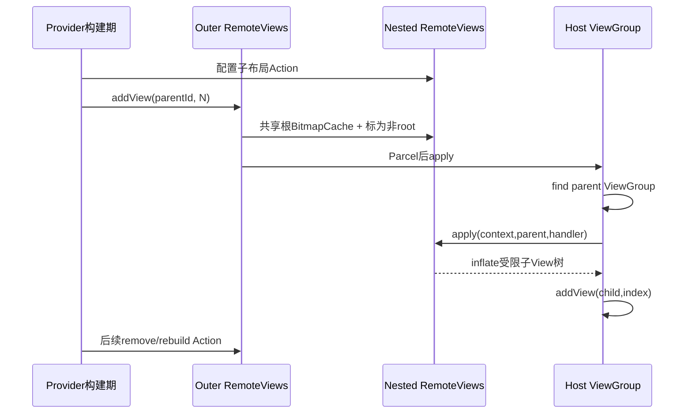
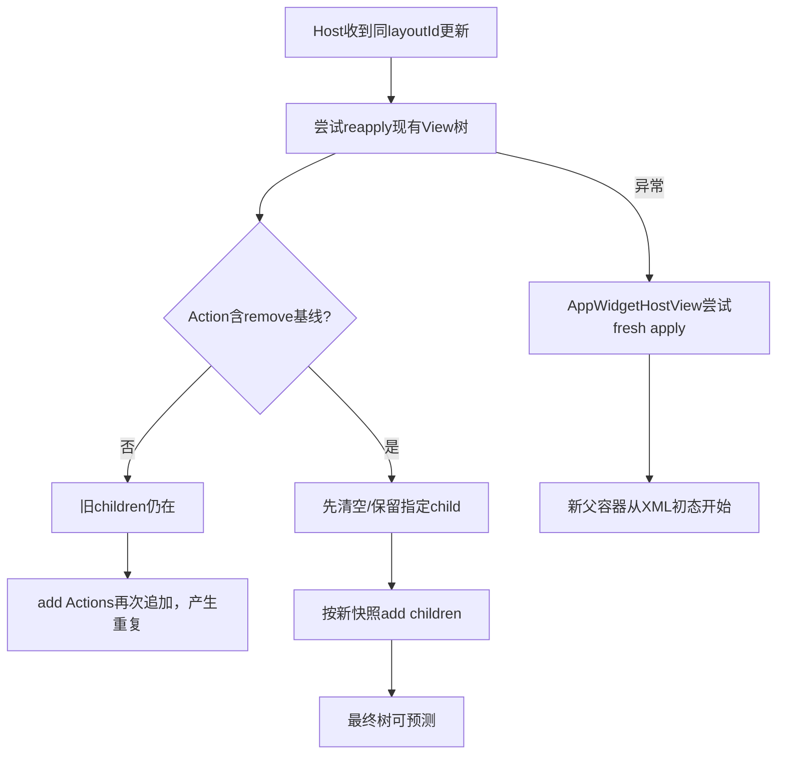
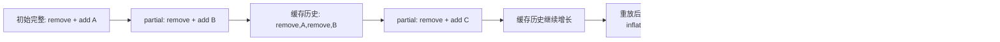

# 第 368 章 Android RemoteViews动态View树：嵌套、Add/Remove、缓存、深度、Merge与Reapply链

> 源码基线：Android 11 / API 30 / `android-11.0.0_r48`。本章只在macOS阅读源码，不编译。上一章讲单个控件Action，本章处理会改变树结构的`addView()`、`removeAllViews()`和隐藏`removeAllViewsExceptId()`：嵌套RemoteViews怎样共享根BitmapCache、为什么被attach后不能clone、同步与异步怎样维护两棵ViewTree、partial merge为何保存动态Action历史、reapply为何会重复添加，以及Android 11异步保留child路径的明确差异。

## 1. 动态树解决什么问题

Provider可在一个允许的ViewGroup中按运行数据加入若干受限RemoteViews子树，例如可变数量的状态块；它不是把Provider进程真实View对象传给Launcher。

## 2. 三个主要API

公开`addView(parentId,nested)`、`removeAllViews(parentId)`，以及隐藏`removeAllViewsExceptId(parentId,keepId)`；隐藏重载还可指定插入index。

## 3. null addView的公开语义

公开addView发现nestedView为null时不创建Add Action，而是创建ViewGroupActionRemove，等价于removeAllViews。

## 4. 隐藏index重载没有null保护

`addView(parent,nested,index)`直接构造ViewGroupActionAdd；nested为null时后续write/apply会访问mNestedViews而失败。不要把公开null语义套到隐藏重载。

## 5. 树变化仍是录制Action

Provider调用add/remove时只把父viewId、nested RemoteViews或keepId录入顶层mActions；真实ViewGroup.addView/remove发生在Host apply。

## 6. 两层RemoteViews不是两次Widget更新

外层负责根布局，nested有自己的layoutId和Action；Parcel把它作为ViewGroupActionAdd的一部分递归携带，system_server缓存仍是一棵顶层RemoteViews对象图。

## 7. 动态树总链



## 8. add时会改nested对象

ViewGroupActionAdd构造器调用`configureRemoteViewsAsChild(nested)`；这不是只读登记，而会给nested换BitmapCache并把mIsRoot设false。

## 9. 所有嵌套共享根BitmapCache

nested.setBitmapCache(outer.mBitmapCache)还会递归更新它内部BitmapReflectionAction的bitmapId，因此整棵正常嵌套树只在根Parcel写一次Bitmap列表。

## 10. 共享缓存能跨子树去重

多个nested引用同一Bitmap时都登记到outer根cache，可避免每个子树像第365章固定List Action那样独立写一份cache。

## 11. mIsRoot决定谁写Bitmap表

RemoteViews.writeToParcel只有mIsRoot为true才`writeBitmapsToParcel`；child只写layout/Action并通过父传入的BitmapCache解析bitmapId。

## 12. child也可省略重复ApplicationInfo

Action判断nested与parent是否同package/uid；相同时用PARCELABLE_ELIDE_DUPLICATES不重复写ApplicationInfo，接收端沿用parent info。

## 13. 跨包nested会写自己的AppInfo

hasSameAppInfo为false时不elide，child Parcel包含ApplicationInfo；Host仍按该包/user资源Context与安全inflate规则处理。

## 14. 普通应用不应随意跨包拼树

资源可加载不代表URI/点击/数据权限自动获得，layoutId数值还可能跨包碰撞。保持同Provider包更易审计。

## 15. attach后clone会失败

RemoteViews.clone()要求mIsRoot为true；nested一旦add到outer就被setNotRoot，随后直接clone该child会抛IllegalStateException。

## 16. 应在attach前复制

若同一逻辑子树要加入两个不同outer，应先为每个outer创建独立RemoteViews或在任何add之前分别`new RemoteViews(src)`，再各自attach。

## 17. 同一child跨outer复用很危险

第二个outer会再次把同一nested对象切换到自己的BitmapCache并重算bitmapId；第一个outer Action仍引用它，缓存与id可能被第二次配置污染。

## 18. 同一outer重复引用也需谨慎

共享cache一致，但同一可变nested对象被多Action引用，之后构建期修改会同时影响多个位置；RemoteViews应在组装完成后视为不可变快照。

## 19. Parcel/clone才形成快照边界

正常跨进程发送会递归序列化重建；`new RemoteViews(outer)`也通过临时Parcel复制Actions。此前所有对象引用仍可能别名。

## 20. 深度限制保护递归解析

RemoteViews Parcel构造维护depth，普通非SYSTEM调用来源超过MAX_NESTED_VIEWS=10抛IllegalArgumentException，限制addView与横竖组合递归造成的栈/资源压力。

## 21. root与nested层数要区分

限制面向嵌套深度而非Action总数或siblings数量；100个同层child不是深度100，但仍可能因Parcel、Bitmap和inflate成本过大。

## 22. system来源为什么豁免

检查调用Binder.getCallingUid的appId；普通Provider首次进入system_server时已按非system身份解析，系统再转发Host时不重复把可信缓存当普通来源拒绝。

## 23. 豁免不是应用绕过方法

应用不能因为最终经system_server发送就提交超深对象；危险输入在第一次Provider→system_server反序列化时仍看到Provider uid。

## 24. add同步apply先找ViewGroup

代码把`root.findViewById(viewId)`结果赋给ViewGroup；找不到return，找到但实际不是ViewGroup可能ClassCastException并让整个RemoteViews apply失败。

## 25. nested用root Context开始apply

Action取`root.getContext()`传给nested.apply；nested内部再依据自己的ApplicationInfo包装资源Context，执行handler沿用外层Host点击策略。

## 26. index=-1表示append

公开addView走默认mIndex=-1，ViewGroup.addView(child,-1)追加末尾；隐藏index按指定位置插入，越界由ViewGroup抛异常。

## 27. 添加的是fresh child View

每次Action执行都会nested.apply新inflate一棵View树，再target.addView；没有按layoutId复用某个既有动态child。

## 28. removeAll同步路径很直接

找到目标ViewGroup后调用removeAllViews；父不存在静默return，错误类型可能在赋值转换处失败。

## 29. keep路径倒序删除

removeAllViewsExceptId从最后child向前遍历，id不等keepId就removeViewAt；倒序避免删除时索引前移漏项。

## 30. keep的是所有匹配id的直接child

算法只检查ViewGroup直接孩子，并保留每一个id等于keepId的child，不递归搜索，也不强制唯一。

## 31. NO_ID不会意外表示remove all

remove-all内部哨兵用-2，因为默认View.NO_ID是-1，避免把普通无id child概念与“全部删除”混淆。

## 32. 动态树典型重建模式

```java
RemoteViews root = new RemoteViews(pkg, R.layout.widget);
root.removeAllViews(R.id.container);
for (Item item : items) {
    RemoteViews child = new RemoteViews(pkg, R.layout.widget_chip);
    child.setTextViewText(R.id.title, item.title);
    root.addView(R.id.container, child);
}
```

## 33. remove必须排在adds之前

Action按顺序执行；先add后remove会把刚添加的child也清掉。构建方法应明确先清基线、再按目标快照加入。

## 34. 为什么每轮最好先remove

AppWidgetHostView可对相同layoutId执行reapply；如果RemoteViews只有add Actions，旧ViewGroup已有child，再执行会追加重复项。

## 35. Fresh apply看不出重复问题

第一次inflate父容器通常为空，add结果正确；第二次同layout reapply才出现重复，所以只测试首次显示会漏掉Bug。

## 36. reapply与动态树图



## 37. FLAG_REAPPLY_DISALLOWED看似为此设计

RemoteViews定义该flag并注释“Action破坏基础树时应禁止reapply”；但第362章全树核对r48 AppWidgetHostView未消费该flag。

## 38. 不能依赖flag自动fresh apply

Provider/系统代码即使addFlags(REAPPLY_DISALLOWED)，Android 11 r48 Host路径仍可能按同layoutId reapply；动态Action必须自己保证可重复执行。

## 39. remove+add实现幂等近似

每次先把动态区域恢复为空，再构造目标child集合，重复执行最终树相同；这不让整个Action过程原子，但能避免稳定态重复。

## 40. keep模式也可维持固定骨架

容器内有一个Host/布局固定child需保留时先removeAllExceptId，再add动态项；必须保证keepId不会被多个动态child复用。

## 41. Add Action mergeBehavior是APPEND

partial update合并时不会以tag+parentId替换旧add；每次新add Action都追加到服务端缓存Action列表。

## 42. Remove Action同样APPEND

removeAll和keep remove也不会替换旧remove。它们保存操作历史，最终状态取决于整个历史顺序。

## 43. partial不带remove会持续累积child

旧add在reapply时再次执行，新partial add又追加，最终既重放旧child又加入新child，数据和View数量不断增长。

## 44. partial带remove可修正最终树

新partial先removeAll再add目标快照，合并后旧历史先执行、随后新remove清掉旧结果、最后新add形成正确稳定态。

## 45. 但缓存历史仍会增长

旧add/remove Action并未从RemoteViews缓存删除；每次reapply仍先浪费时间inflate/添加旧树再删除，随后重建新树。长期高频partial会增加Parcel、CPU和短时分配。

## 46. 完整update能清理Action历史

发送新的完整RemoteViews直接替换widget.views，只有当前remove/add快照；动态列表大幅变化或多轮partial后应考虑完整更新。



## 47. system_server merge会重建BitmapCache

merge结束创建新根BitmapCache并递归`setBitmapCache()`，所有仍保留的nested Add Actions重新登记Bitmap，删除旧Action后不再需要的Bitmap可被剪掉。

## 48. Append历史也保留旧Bitmap

因为旧Add Actions仍在列表，它们引用的nested Bitmap仍会重新进入cache；即使后续remove在视觉上删除旧child，旧图片仍占RemoteViews缓存与Parcel内存。

## 49. 动态大图更应完整更新

反复partial remove+add不同Bitmap时，视觉最终正确但Action历史让所有旧nested/Bitmap继续存活，容易触发第361章Widget Bitmap上限。

## 50. Add Action递归异步偏好

`prefersAsyncApply()`直接返回nested.prefersAsyncApply；子树含URI/Icon等偏好异步Action时，外层可向Host提示整次异步。

## 51. 同步nested apply沿用handler

nested内PendingIntent/Fill-In Action使用外层传入OnClickHandler，不像第365章旧ListAdapter丢handler；正常动态子树点击会走Host包装。

## 52. 异步准备维护抽象ViewTree

AsyncApplyTask先为当前真实树建ViewTree；Add Action找到目标节点，在后台为nested执行自己的AsyncApplyTask，再把得到的child tree插入抽象target。

## 53. 为什么抽象树要先加入child

后续Action可能目标是刚加入nested内的viewId；虽然UI还没真正add，准备阶段findViewTreeById也必须看到它并为其生成异步Runnable。

## 54. UI阶段才真正attach

Add的RuntimeAction先调用nested task.onPostExecute执行准备好的最终Action，再`targetVg.addView(task.mResult,index)`。

## 55. nested内部Action在attach前执行

onPostExecute时mResult尚未加到真实parent；但nested apply创建时传targetVg为rootParent，View自身getParent仍可能为null。依赖attach状态的setter必须由控件实现容忍。

## 56. 异步add目标错误会NOOP

抽象树找不到parent，或目标root不是ViewGroup时，返回ACTION_NOOP；同步错误类型可能ClassCast抛异常，两条路径的错误表现不完全相同。

## 57. nested后台任务失败外溢

`doInBackground()`返回null时Add Action抛ActionException(task.mError)，使外层AsyncApplyTask失败，而不是只跳过一个child。

## 58. Async remove也先改抽象树

找到目标ViewGroup后，initActionAsync把`target.mChildren=null`，让后续Action看不到被移除的child；UI RuntimeAction再真实remove。

## 59. removeAll的抽象行为合理

全部删除时后续Action本就不应再命中旧child；新Add Action会重新把其child tree加入抽象结构。

## 60. keep路径存在r48差异

`removeAllViewsExceptId()`同步只删非keep child，但异步准备仍无条件把全部mChildren设null，没有把keep child节点放回抽象树。

## 61. 后续keep-child Action会被吃掉

异步序列“remove except keep → setText(keep child)”中，第二条准备查不到目标并变ACTION_NOOP；UI阶段keep child确实保留，却不会收到文字更新。

## 62. 同一RemoteViews同步反而成功

同步执行时remove except保留真实child，后续findViewById仍找到并更新。因此是否配置Host Executor可改变最终结果，属于Android 11实现边角。

## 63. 这不是简单性能差异

async与sync在keep后续Action上可能产生不同可见状态，测试必须覆盖两种Host策略；不能只说异步“结果相同、速度不同”。

## 64. 概念修复方向

异步remove-except应在抽象target中保留匹配keepId的ViewTree，而不是清空全部children；还要处理多个匹配、直接child语义和后续index Add。

## 65. 本阶段只记录不编译修复

用户要求macOS只生成文档；我们以源码证据指出差异，不实际修改framework或声称通过设备测试。

## 66. remove RuntimeAction捕获的是Action对象字段

UI阶段读取mViewIdToKeep执行全删或保留；Action本身在构建后应不可变，避免异步准备与UI执行看到不同参数。

## 67. ViewTree注释与实际ID判断有落差

注释说只加入“valid ID”节点，实际代码判断`v.getId()!=0`；id为0的View被压平、其children挂到上层，但`View.NO_ID=-1`也会被建成节点。普通RemoteViews Action仍使用正资源id定位，不能把注释当严格过滤证明。

## 68. 重复id让find语义不唯一

动态加入多个相同viewId子树时，root.findViewById通常返回遍历遇到的第一个；Action无法表达“更新第N个同id child”。每个需要单独更新的动态实例应避免重复目标id方案。

## 69. RemoteViews布局id不是实例id

每个nested可用相同R.layout，内部viewId也相同；加入多个后，外层后续Action按该内部id不能可靠选择某一项。应在构造nested前完成各项属性，而非add后从outer逐项改。

## 70. nested Action在自己的root内查id

child.setTextViewText录在child RemoteViews中，apply时root就是该child树，所以相同内部id不会与siblings冲突；这是推荐的逐项配置方式。

## 71. outer后续Action查整棵root

一旦在outer录制setText同一内部id，它从Widget根find，可能命中第一个child；不要把child局部命名空间理解成Android View id真正隔离。

## 72. Root namespace只隔离Host外层

AppWidgetHostView的root namespace防Launcher外部id碰撞，不会为每个nested RemoteViews建立独立findViewById namespace。

## 73. nested方向组合可以存在

child RemoteViews可自身由landscape/portrait组合，apply时按Host Context方向选择；outer getLayoutId相同不保证nested实际结构相同。

## 74. 方向改变后reapply风险更高

旧树中的nested来自旧方向，新RemoteViews reapply可能执行对另一方向id结构设计的动态Action；缺id会静默，类型不符会异常。AppWidgetHostView只比较outer layoutId。

## 75. nested getLayoutId在组合时返回portrait

公开getLayoutId文档如此；缓存/type推理若只看它会忽略当前方向选择，动态树应尽量让两方向关键id契约一致。

## 76. Light background flag也会影响nested选择

RemoteViews apply flags和light background layout可在克隆/子树传播路径参与getLayoutId；系统Host不同背景可能inflate另一子布局，目标id仍需兼容。

## 77. Parcel解析Add时使用父BitmapCache

ViewGroupActionAdd构造nested时传入当前root cache、可复用parent ApplicationInfo、depth与class cookies；child构造后标非root。

## 78. Add构造还尝试传播outer apply flags

源码对新nested调用`addFlags(mApplyFlags)`；但普通Parcel构造在readActions之后才读取outer mApplyFlags，跨进程时这里的outer字段仍为默认0，存在时序不对称。

## 79. Clone路径又可能不同

`new RemoteViews(src)`在写读Actions前已复制src.mApplyFlags，因此临时Parcel读Add时可把flag加给nested；本地clone与普通跨进程构造的传播时机不同，r48不宜把该语句当可靠通用继承保证。

## 80. child自身flags仍会Parcel

nested.writeToParcel末尾写自己的mApplyFlags；若构建时明确给child加flag，该值可独立恢复。不要只依赖outer晚读取字段的隐式传播。

## 81. visitUris不会递归进入Add child

ViewGroupActionAdd没有override visitUris，外层RemoteViews.visitUris调用Action默认空实现，nested里的URI/Icon URI不会被外层枚举。

## 82. 这与BitmapCache递归不对称

Add明确override setBitmapCache和prefersAsyncApply，却没实现visitUris；内存共享/异步提示会递归，URI枚举不会。

## 83. AppWidget r48未消费visitUris

因此当前Widget链本就不会自动grant；若其它系统消费者依赖outer.visitUris，nested URI遗漏仍是需要单独审计的能力缺口。

## 84. nested URI仍由Host真实读取

枚举遗漏不阻止ImageView setImageURI执行，只是没有自动能力准备；结果通常是Host无权限加载失败或清空图片。

## 85. Bitmap估算会覆盖正常nested

因为add时所有child接入根BitmapCache，outer.estimateMemoryUsage能统计这些Bitmap；这与固定List Action行cache漏算不同。

## 86. 复用child跨root会破坏这项保证

若同一nested被第二个outer重新setBitmapCache，第一个outer估算/Action bitmapId可能不再对应；对象别名问题会把正常递归设计打乱。

## 87. Clone外层会重建干净共享cache

复制构造先Parcel复制Actions，再new根BitmapCache并递归setBitmapCache，使复制品内部nested重新统一登记；前提是源对象图序列化时仍一致。

## 88. remove不直接剪BitmapCache

同一RemoteViews Action列表里remove Action只是Host运行时删View，不会从根BitmapCache删除旧Add Action引用的图片；只有Action本身从列表消失并重建cache才可能释放。

## 89. 动态树状态有三层

服务端缓存Action历史、Host当前真实View树、Host异步准备ViewTree是三份不同状态；remove/add在它们上发生的时间和语义不同。

## 90. Binder返回不代表树已变

Provider update返回时system_server可能已缓存并回调，Host Looper尚未apply；async时后台/最终UI又分阶段，最终Surface显示更晚。

## 91. 动态更新失败可能保留什么

同步reapply中先remove成功、后nested apply异常会使当前Host树暂时被清空；AppWidgetHostView随后fresh apply完整RemoteViews，若仍异常则换error view。

## 92. Fresh fallback重新从XML根开始

它不会在刚被部分修改的旧树上继续，能消除重复/半删状态；但Provider错误Action仍会再次失败。

## 93. Async取消也非回滚事务

准备阶段构造的View对象可被丢弃；UI RuntimeAction若已执行remove/add，后续取消不能自动还原旧children。新更新通常会再次apply目标状态。

## 94. index插入和异步抽象树要一致

Add init按mIndex调用target.addChild，UI也按同index addView；越界/并发真实树变化可让两者分叉并抛异常。

## 95. Host UI线程通常串行保护真实树

RemoteViews最终Action和View布局事件在Launcher主线程串行，但Provider更新消息、异步准备完成和新更新取消仍有代际竞争，由AppWidgetHostView CancellationSignal处理部分旧任务。

## 96. 删除保留child不保留业务状态契约

keep只按View id保留实例，child内部点击listener、临时动画、accessibility和旧数据也一并保留；Provider要明确哪些运行态应该继续。

## 97. removeAll会触发正常View detach

真实UI阶段ViewGroup.removeAllViews/removeViewAt走View层detach与布局失效；它不是只改RemoteViews缓存引用。

## 98. Chronometer等child会停止可见运行

被remove/detach后控件的onDetachedFromWindow可停止tick；但Provider进程不会收到“nested child删除”的组件生命周期回调。

## 99. PendingIntent能力可能仍被其它引用持有

View移除后其listener/View通常可GC，但已经交给Host的PendingIntent能力不会由remove Action显式cancel；真正PendingIntent记录生命周期按其token/creator规则。

## 100. 动态树不是RecyclerView

每轮add fresh inflate，无稳定ID、diff、ViewHolder或按可见区域加载；项目较多应使用RemoteViewsService集合，而非大量nested chips模拟列表。

## 101. 适合的场景

少量、上限明确、布局简单的动态块，例如2—4个状态；并且每次完整update或remove+add构建幂等快照。

## 102. 不适合的场景

几十项大图、频繁单项刷新、需要滚动复用/稳定ID/加载占位的内容；Action历史和全量inflate成本会迅速放大。

## 103. 排错第一站是Action顺序

把最终完整缓存展开：所有旧partial Append历史、remove位置、add位置、nested内部Action顺序；只看最新Provider代码片段不够。

## 104. 第二站是sync还是async

确认Host是否setExecutor；remove-except后续keep child、错误类型target和ViewStub等路径可能表现不同。

## 105. 第三站是对象别名和cache

检查同一nested是否加入多个outer、是否attach后继续修改、Bitmap Action id是否与根cache一致、完整更新能否消除问题。

## 106. 第四站是当前方向真实树

outer/nested横竖布局、light background variant和id/type是否一致；reapply依据outer layoutId，不会替你验证所有child结构。

## 107. 第五站是权限而非inflate

nested资源能显示但URI图片失败时，检查Host Resolver grant；Add Action不递归visitUris且AppWidgetService不自动授权。

## 108. 安全边界没有因nested放宽

每个child仍走RemoteView类过滤、固定Action tag和Remotable方法；深度门限制普通入站，跨包资源Context仍受user/package身份约束。

## 109. 性能边界的核心指标

最终Action历史长度、nested总数/深度、BitmapCache分配量、每次reapply transient inflate数量、Host是否异步以及完整更新清历史频率。

## 110. 推荐构建模板

每次从新outer开始、先remove动态容器、为每项新建并完整配置child、再add；图片先缩放；最后完整update。只有确知代价时才用partial动态树。

## 111. 一句话贯通三份树

Provider对象图定义目标命令，system_server缓存并merge命令历史，Host同步真实View树或异步抽象ViewTree按序重放；任何一层把“最终快照”误成“操作增量”都会出现重复或丢更新。

## 112. macOS只读练习一：验证child共享cache

阅读configureRemoteViewsAsChild、setBitmapCache、writeToParcel和clone。画outer→nested→BitmapAction关系，解释mIsRoot=false为何省Bitmap表、同一child跨两个outer为何危险。

## 113. macOS只读练习二：推演partial历史

阅读ViewGroupActionAdd/Remove的MERGE_APPEND和mergeRemoteViews。手算初始`remove,A`，两次partial分别`remove,B`、`remove,C`后的最终Action顺序、最终View和仍被cache引用的旧Bitmap。

## 114. macOS只读练习三：证明异步keep差异

对照ViewGroupActionRemove.apply与initActionAsync。推演`removeAllViewsExceptId(parent,keep)`后紧跟setText(keep)，指出同步真实树和异步target.mChildren各剩什么、最终文字是否更新。

## 115. macOS只读练习四：核对深度与URI

阅读RemoteViews(Parcel)的depth检查和ViewGroupActionAdd的setBitmapCache/prefersAsyncApply方法，再搜索其是否override visitUris。说明深度门在哪次Binder入口生效、nested URI为何不被outer枚举。

## 116. 自测一：为什么第二次更新出现重复块

同outer layout触发reapply，而缓存Action只有add没有remove；旧children未清，每条add再次fresh inflate追加。发送包含先remove的完整快照可恢复幂等。

## 117. 自测二：为什么最终UI正确但越来越卡

多轮partial每次都有remove+add，所以最后一次remove让视觉正确；但Add/Remove都是APPEND，旧历史和Bitmap继续缓存，每次reapply先重放并删除大量旧树。

## 118. 自测三：为什么开异步后保留文字不更新

r48 remove-except同步保留keep child，异步预处理却清空全部抽象children；后续setText准备时目标不存在成为NOOP，真实UI child虽保留也收不到Action。

## 119. 本章最容易误解的五点

第一，add会修改nested的root/cache身份；第二，reapply会重放add；第三，Add/Remove partial都APPEND；第四，remove视觉删除不释放历史Bitmap；第五，异步remove-except与同步可能不同结果。

## 120. 本章收束与下一章入口

动态RemoteViews树的可靠原则是独立child、共享单根cache、深度受控、先remove后add、少用partial历史并同时验证sync/async。下一章进入RemoteViews Parcel与BitmapCache更底层的序列化：ApplicationInfo去重、class cookies、action tag兼容、Bitmap内存估算、clone/merge怎样重建对象图及畸形Parcel失败边界。
