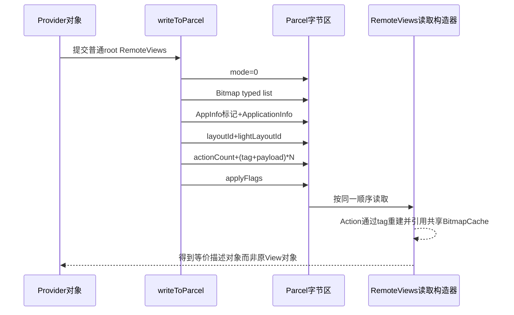
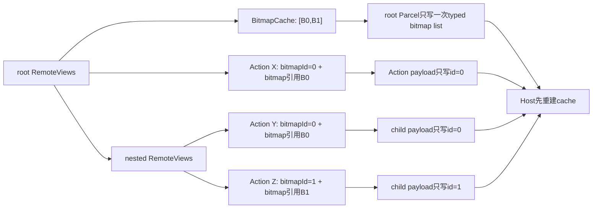
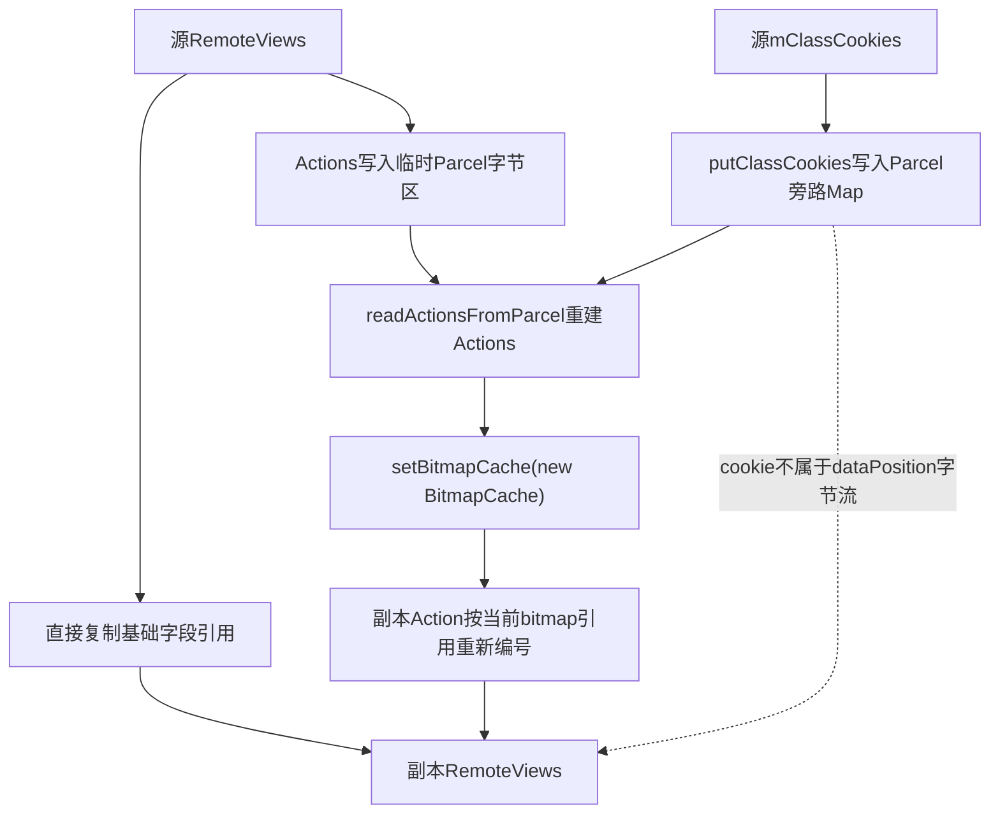

# 第 369 章 Android RemoteViews Parcel：序列化、ApplicationInfo 去重、Class Cookies、BitmapCache 与 Clone 对象图

> 源码基线：Android 11 / API 30 / `android-11.0.0_r48`。本章只在 macOS 阅读源码，不编译。上一章已经看到嵌套 `RemoteViews` 共用根 `BitmapCache`；本章把对象真正写进 `Parcel`，逐字段跟踪普通模式、横竖屏组合模式、Action tag、`ApplicationInfo` 去重、class cookie、Bitmap 索引和复制构造。重点不是背格式，而是能区分“Java 内存对象”“Parcel 字节序列”“Parcel 旁路元数据”和“Host 重建对象”四个层次。

## 1. 本章要解决的核心问题

一个 `RemoteViews` 为什么不能简单理解成“跨进程传 View”？因为传输的是布局标识、应用资源身份、Action 参数和 Bitmap 表。接收端按完全相同的读取顺序重建描述，再由 Host inflate 和 apply；任何字段错位，后面所有字段都会被错误解释。

## 2. 先建立四层模型

第一层是 Provider 进程中的 Java 对象图；第二层是 `Parcel` 中按顺序排列的数据；第三层是 class cookie 这类不进入字节流的旁路状态；第四层是接收端重新创建的 `RemoteViews`、Action 和 Bitmap 引用。理解复制与跨进程差异时必须指出自己正在谈哪一层。

## 3. RemoteViews 不是 Java 序列化

它实现的是 `Parcelable`，由 `writeToParcel()`显式写字段、构造器显式读字段。字段名、反射、对象地址都不会自动保存；只有写入协议覆盖的内容会重建。因此“新增一个成员变量”不等于它会自动跨进程存在。

## 4. 入口源码在哪里

主文件是 `frameworks/base/core/java/android/widget/RemoteViews.java`。本章重点读 `writeToParcel()`、Parcel 构造器、`readActionsFromParcel()`、`getActionFromParcel()`、`BitmapCache`、复制构造器和 `clone()`；class cookie 的容器行为在 `frameworks/base/core/java/android/os/Parcel.java`。

## 5. 两种顶层编码模式

Android 11 只定义 `MODE_NORMAL=0` 与 `MODE_HAS_LANDSCAPE_AND_PORTRAIT=1`。普通模式含一个布局和 Action 列表；组合模式含 landscape、portrait 两个子 `RemoteViews`。mode 是接收端决定后续结构的第一个整数。

## 6. mode 不是界面方向值

它不是 `Configuration.ORIENTATION_*`，也不表示当前设备正处于横屏或竖屏；它只描述 Parcel 后面采用哪一种对象结构。真正 apply 时，`getRemoteViewsToApply()`才根据 Host 的配置选择其中一个分支。

## 7. 根对象与 child 的协议不同

只有 `mIsRoot=true` 的对象写 Bitmap 表；被 `addView()`或横竖屏组合构造器挂入父对象后会变成非 root，并复用父传下来的 `BitmapCache`。因此从字节位置看，child 的 mode 后面不会再出现 Bitmap 列表。

## 8. 为什么读取构造器需要父参数

私有构造器除了 `Parcel`，还接收父 `BitmapCache`、可复用 `ApplicationInfo`、递归深度和 class cookies。根调用这些参数为 null；递归 child 则依赖父参数恢复被省略的信息。协议的紧凑性正来自这种上下文传递。

## 9. 普通模式的准确写入顺序

顺序是：mode；若为 root 则 Bitmap typed list；AppInfo 存在标记和可选 `ApplicationInfo`；`mLayoutId`；`mLightBackgroundLayoutId`；Action 数量与各 Action；最后才是 `mApplyFlags`。不要根据成员变量声明顺序猜 Parcel 顺序。

## 10. 普通模式完整时序图



## 11. mApplyFlags 为什么容易读错

源码在普通与组合两个分支都结束后统一 `dest.writeInt(mApplyFlags)`，读取端也在整个分支结束后才 `parcel.readInt()`。所以它不是 layoutId 旁边的头字段，也不是每个 Action 的公共前缀。

## 12. 晚读 flags 带来的构造时序

当读取某个 `ViewGroupActionAdd` 时，外层 `RemoteViews.mApplyFlags` 还保持默认 0，因为外层 flags 在 Action 列表之后。该 Action 构造器调用 `mNestedViews.addFlags(mApplyFlags)`时拿到的是 Action 所属外层对象当下的默认值。这是 Android 11 r48 的真实时序，不能按“最终 flags 会自动提前传播”理解。

## 13. 正常协议靠双方同版本约定

`RemoteViews` 自身没有显式 schema version 字段。读写双方依靠 mode、固定字段顺序、Action tag 和各 payload 布局保持一致。Android 的典型 Binder 链两端运行同一系统 framework，普通应用只通过 SDK 构造对象，因此通常不会遇到任意版本互解。

## 14. 没有版本字段意味着什么

它不表示 Android 无法演进，而表示演进必须维护系统内的写读兼容假设。若新系统写出旧系统不认识的新 Action tag，旧读取器会失败；不能把 Parcel 当成适合长期落盘、跨 ROM 任意版本交换的稳定文件格式。

## 15. describeContents 返回 0

`RemoteViews.describeContents()`返回 0，表示它没有声明 `CONTENTS_FILE_DESCRIPTOR`。这不等于“里面没有 Binder 对象”或“没有 PendingIntent”；文件描述符语义与 Binder/PendingIntent 的可传递性是不同维度。

## 16. Bitmap 表为何靠近 mode

Action payload 只写 `bitmapId`，所以读取 Action 之前必须先恢复共享 Bitmap 表。根构造器在读 mode 后立即 `new BitmapCache(parcel)`，后面的 `BitmapReflectionAction(Parcel)`才可以用 id 找回 Bitmap。

## 17. 普通 root 一定写 ApplicationInfo

写入判断是 `!mIsRoot && flags含PARCELABLE_ELIDE_DUPLICATES` 才写 0。即使调用者给 root 传了 ELIDE 标志，root 因 `mIsRoot=true` 仍写存在标记 1 和完整 `ApplicationInfo`，给整个对象图建立资源身份基准。

## 18. child 怎样省略重复 AppInfo

嵌套 Action 写 child 前会用 `hasSameAppInfo()`判断 child 与 parent 是否同应用；同包名、同 uid 时给 child 的 `writeToParcel()`传 `PARCELABLE_ELIDE_DUPLICATES`，child 只写整数 0。读取 child 时再使用父构造器传入的 `info`。

## 19. 省略标记的准确含义

标记 0 不是“没有应用身份”，而是“此处不重复写，请继承调用方提供的 info”；标记 1 才紧跟一个 `ApplicationInfo`。脱离父上下文单独截取 child 字节并读取，会破坏这一协议前提。

## 20. hasSameAppInfo 比较范围很窄

Android 11 实现只比较 `mApplication.packageName.equals(info.packageName)`与 `mApplication.uid == info.uid`，并不逐字段比较 sourceDir、版本、flags 等整个快照。相同包与 uid 的 child 被省略后会直接共享父传入的完整 `ApplicationInfo` 对象。

## 21. 为什么 uid 也必须相同

包名相同并不足以区分不同 Android 用户。uid 编码包含 userId 与 appId；同包在 user 0 和工作资料用户中的资源、数据与权限边界不同，所以组合构造和去重判断必须保留用户身份。

## 22. hasSameAppInfo 的空值边界

该方法直接解引用 `mApplication`与传入 `info`，没有通用 null 容错。由正常公开构造和正常 Parcel 生成的结构能满足非空前提；人为畸形 Parcel 令 child 标记为 0、同时不给父 info，后续可能在别处出现 NPE，而不是得到友好的“AppInfo 缺失”错误。

## 23. 横竖屏组合构造的前置检查

`new RemoteViews(landscape, portrait)`要求两者都非 null，并要求 `landscape.hasSameAppInfo(portrait.mApplication)`成立，否则抛 RuntimeException。它以 portrait 的 ApplicationInfo、layoutId 和 light layoutId 作为外层可查询值。

## 24. 组合对象先统一 BitmapCache

构造器新建一个根 BitmapCache，再分别 `configureRemoteViewsAsChild(landscape)`和 portrait。两个分支因此都标为非 root，并递归重算其中 Bitmap Action 的 id，最终只由组合根写一张 Bitmap 表。

## 25. 组合模式的准确写入顺序

顺序是：mode=1；若组合对象为 root，写统一 Bitmap 表；写 landscape child；写 portrait child，并强制追加 ELIDE 标志；最后写组合外层 `mApplyFlags`。portrait 可以继承 landscape 读出的 AppInfo，因为构造器已验证同包同 uid。

## 26. landscape 为什么仍可能写 AppInfo

组合根调用 `mLandscape.writeToParcel(dest, flags)`，landscape 已是非 root，但是否省略取决于外部 flags 是否含 ELIDE。通常根写入没有这个标志，因此 landscape 写完整 AppInfo；portrait 则由源码明确 OR 上 ELIDE，写标记 0。

## 27. 组合读取怎样传递 info

先用调用者给组合对象的 `info`读取 landscape；再把 `mLandscape.mApplication`传给 portrait。读完后，组合外层把自己的 `mApplication`、layoutId、light layoutId 设为 portrait 的值。这与构造函数选择 portrait 作为默认查询分支一致。

## 28. 任意非零 mode 的真实行为

读取代码是 `if (mode == MODE_NORMAL) ... else ...`，并没有 `else if(mode==1)`后再拒绝未知值。因此 2、99 或负数都会进入组合分支，随后把后续字节误当两个子 `RemoteViews`。通常最终因错位而异常，但异常未必叫“unknown mode”。

## 29. 不要把畸形表现当公开兼容承诺

未知 mode 被当组合模式是当前实现细节，不是允许第三种模式的扩展点。安全分析应写成“r48 没有显式校验，畸形输入会按组合结构继续解析”，而不是教人构造 mode=2 的自定义协议。

## 30. Action 列表先写 count

`writeActionsToParcel()`把 null 列表和空列表都编码为 count=0；非空时依次写 tag，再让 Action 写自己的 payload。接收端只有 count>0 才创建 `ArrayList`，所以空列表读回来通常仍是 `mActions=null`，不是一个空 ArrayList。

## 31. 负数 Action count 的边界

读取器只判断 `if (count > 0)`，因此畸形负数与 0 一样被当成“无 Action”，没有显式异常。更危险的是后续读取位置没有因此跳过所谓 payload；紧跟的整数会被当作 `mApplyFlags`，造成语义错位。

## 32. Action tag 是手写类型表

每个 Action 先写固定整数 tag；`getActionFromParcel()`用 switch 选择对应构造器。它没有写 Java 类名，也不会通过反射实例化任意 Action 子类，这既减小数据，也收紧了可接受类型集合。

## 33. Android 11 r48 的 tag 范围

本版使用 1、2、3、4、5、6、7、8、10、11、12、13、14、15、18、19、20、21、22；9、16、17 等存在空洞。编号空洞可能来自历史演进，不能自行填入或认为 tag 必须连续。

## 34. tag 与类的部分对应

例如 1 对应 `SetOnClickResponse`，2 对应 `ReflectionAction`，4 对应 `ViewGroupActionAdd`，7 对应 remove，12 对应 `BitmapReflectionAction`，19 对应 `LayoutParamAction`。阅读某个 Action 的 Parcel 格式，必须先找到其 tag 分支，再读那个构造器与 `writeToParcel()`成对实现。

## 35. 未知 Action tag 会立即失败

switch 的 default 抛 `new ActionException("Tag " + tag + " not found")`。这与未知 mode 不同：tag 有明确拒绝分支。因此排查“Tag N not found”时应先怀疑写读版本不一致、Parcel 错位或数据损坏。

## 36. tag 不是安全检查的全部

认识 tag 只确定由哪个 Action 构造器继续读；payload 中的 viewId、枚举 type、Bitmap id、Intent 等仍有各自边界。安全性还依赖系统入口的身份校验、Parcel 基础类型读取、RemoteViews 允许类过滤和 Host apply 规则。

## 37. ReflectionAction 的二级类型协议

tag=2 只说明它是 ReflectionAction；payload 还含 methodName、type 与 value。type 决定后面读 int、long、CharSequence、Uri、Icon 等哪一种值。若 type 被破坏，字段长度和解释方式都可能错位。

## 38. 未知 Reflection type 的表现

其构造器 switch 对未知 type 不一定立刻给出清晰协议异常，value 可能保持 null；apply 时 `getParameterType()`对坏 type 返回 null，最终反射查找或 ActionException 才暴露问题。不同畸形字节也可能更早在某个基础读取中失败。

## 39. 正常写入不会产生未知 type

公开 setter 由 framework 选择固定类型常量并按对应方式写值。上节是阅读健壮性时的边界说明，不是日常 RemoteViews 调用需要防御的普通分支。

## 40. 每个 Action 的 payload 都没有统一长度头

读取器完全依赖 tag 对应构造器知道要读多少字段；一个错误 tag 会让后续字段整体错位。Parcel 不是“跳过未知 Action 继续读”的 TLV 格式，因此未知 tag 只能失败，无法可靠向前兼容地忽略。

## 41. mApplyFlags 也可能被错位污染

因为 flags 位于 Action 列表之后，错误 count、错误 tag payload 或少读/多读都会影响最终 `readInt()`。得到一个奇怪 flags 值可能只是更早的格式问题，不能只在 `addFlags()`处找原因。

## 42. 递归深度在哪里检查

私有 Parcel 构造器进入时先判断传入 `depth > MAX_NESTED_VIEWS`，再执行 `depth++`。Action add 和横竖屏组合递归都把递增后的 depth 继续传下去，所以限制的是解析递归层级，不是 Action 数量。

## 43. 为什么条件看起来有一个边界差

初始 root 传 depth=0，检查 0>10 为假，然后变 1。更深对象逐层传值，只有传入值已经大于 10 时才拒绝。判断精确允许多少层时应按构造调用画表或读测试，不要仅凭常量名称口算。

## 44. SYSTEM_UID 的读取豁免

超过深度时，只有调用者 appId 不是 SYSTEM_UID 才抛 `IllegalArgumentException`。普通 Provider 首次把对象送到 system_server 时仍按 Provider 身份解析，不能因为以后由系统转发就绕过第一次边界。

## 45. clone 与超深已存在对象的准确边界

源码测试构造 11 层 add 或组合对象后，`clone()`可成功，而 Parcel/反 Parcel 失败；这是平台 core test 的实测结论。实现上组合分支由复制构造器直接 Java 递归，不走 Parcel 深度门；add Action 副本仍经临时 Parcel 且从 depth=0 递归读取，深度判断代码仍存在，并受 `Binder.getCallingUid()`的 SYSTEM_UID 豁免影响。因此不要把该平台测试泛化成“任意普通应用的 clone 都能绕过深度限制”。

## 46. 深度限制与 Binder 大小不是一回事

深度限制控制递归结构；Binder transaction 限制控制整个事务缓冲；Bitmap 内存上限又是另一条策略。浅而宽的对象可能不超深却非常大，深而字段很少的对象也可能先撞递归限制。

## 47. 根 BitmapCache 的职责

它维护 `ArrayList<Bitmap> mBitmaps`，把多个 Bitmap Action 的对象引用映射成整数 id。整个正常嵌套树共享这一表，Action 只在 payload 中写 id，避免同一个 Bitmap 被每个 Action 重复写入。

## 48. Bitmap 对象图与 Parcel 图



## 49. null Bitmap 的 id

`getBitmapId(null)`直接返回 -1，不把 null 放进列表。读取时 `getBitmapForId(-1)`返回 null，因此“设置 Bitmap 为 null”仍可通过统一的 Bitmap Action 表达清除图片语义。

## 50. Bitmap 去重使用什么判断

`getBitmapId()`先 `mBitmaps.contains(b)`，再 `indexOf(b)`；否则 append。其相等语义由 Bitmap 的 `equals()`决定，在通常实现中更接近对象身份而不是逐像素内容比较，所以两张内容相同但对象不同的 Bitmap 不应假定会合并。

## 51. 查找为何可能是 O(n²)

对每个新 Bitmap 都线性 contains，命中时又线性 indexOf；连续加入大量不同 Bitmap 时，总比较次数呈平方级增长。Widget 本就应控制图片数和尺寸，不能把 RemoteViews 当大型图库传输格式。

## 52. getBitmapForId 的正常边界

id=-1 或 id>=列表大小返回 null；正常 writer 只产生 -1 或有效非负索引。这样 null 图片与越界过大的畸形 id 都不会在这里直接访问列表。

## 53. 小于 -1 的畸形 id

判断没有覆盖 -2、-3 等值，这些值会进入 `mBitmaps.get(id)`并抛索引异常。这是 r48 的具体健壮性边界；正常 API 不会生成这些 id，不应把它描述成支持负索引。

## 54. BitmapCache(Parcel) 做什么

它调用 `source.createTypedArrayList(Bitmap.CREATOR)`重建列表。正常根 writer 总用 `writeTypedList(mBitmaps, flags)`写非 null 列表；child 不调用该构造器，而是拿父传下来的同一 cache。

## 55. BitmapReflectionAction 保留双重状态

它同时保存 `Bitmap bitmap`对象引用与 `int bitmapId`。新建时用当前 cache 分配 id；反 Parcel 时先读 id，再从已建立的 cache 取回 bitmap；写 Parcel 时只写 viewId、methodName 和 bitmapId，并不再次写 Bitmap 内容。

## 56. 为什么换 cache 必须重编号

某个 id 只对某张具体列表有意义。`setBitmapCache(newCache)`遍历对象图，Bitmap Action 用自己保留的 bitmap 引用向新表重新登记并更新 id；嵌套 add Action 则递归给 child 换表。

## 57. setBitmapCache 不是简单赋值

普通对象遍历所有 Actions，调用各 Action 的覆写；组合对象递归 landscape 与 portrait。只有理解这一步，才能解释 child attach、复制构造和 merge 后为何 id 仍可指向正确的新表。

## 58. 没覆写的 Action 什么也不做

Action 基类的 `setBitmapCache()`为空。只有真正依赖共享 Bitmap 表的 Action 需要覆写，例如 BitmapReflectionAction 与 ViewGroupActionAdd。第 365 章所讲的固定 List 数据有自己的序列化结构，不能假设它一定参与这张根表。

## 59. estimateMemoryUsage 估算什么

它直接返回 `mBitmapCache.getBitmapMemory()`，后者把缓存表中每个 Bitmap 的 `getAllocationByteCount()`相加。它估的是 Bitmap 像素分配堆内存，不是 Parcel 序列化后的字节数，也不是 Host inflate 后整个 View 树内存。

## 60. 哪些图片不在这个估算里

资源 id、URI、Icon 中并非以 BitmapReflectionAction 登记进根表的内容，以及 Drawable 实例开销、View 开销、字符串和 Intent 等，都不由这一个求和覆盖。因此“estimateMemoryUsage 很小”不能推出整个更新很轻。

## 61. 内存值为什么缓存

`mBitmapMemory`初始 -1，首次查询才遍历求和；新 Bitmap append 时重置为 -1。后续没有变更便直接返回缓存值，避免重复统计。

## 62. reduceImageSizes 的直接实现

它遍历 `mBitmapCache.mBitmaps`，把每项替换为 `Icon.scaleDownIfNecessary(bitmap,maxWidth,maxHeight)`的结果。它没有遍历每个 BitmapReflectionAction 去替换其 `bitmap`字段，也没有显式把 `mBitmapMemory`重置为 -1。

## 63. 一个容易忽略的内存缓存问题

如果先调用 `estimateMemoryUsage()`缓存旧值，再调用 `reduceImageSizes()`，本方法没有失效 `mBitmapMemory`，后续估算可能仍返回缩放前数值。读源码时应把“列表内容变了”与“缓存统计是否失效”分别核对。

## 64. 立即写 Parcel 时缩放仍有效

已有 Action 的 bitmapId 未变，而根 Bitmap 列表相同索引已换成缩小图。紧接着 `writeToParcel()`会写缩小后的表，接收端 Action 按 id 取得缩小图，所以常规“缩放后立即发送”能够工作。

## 65. Action 为何还握着原图

`reduceImageSizes()`没有修改 `BitmapReflectionAction.bitmap`。若之后触发新 BitmapCache 重建，Action 的 `setBitmapCache()`会拿这个原引用重新登记，可能把全尺寸图重新放进新表，抵消此前仅对旧 cache 列表做的缩放。

## 66. 哪些操作可能重建 cache

复制构造最终 `setBitmapCache(new BitmapCache())`，merge 完成后也可能重新配置对象图，child 改挂到另一 root 时同样换表。具体结果取决于该操作前 Action 是否已通过 Parcel 从缩小表重建了自己的 bitmap 引用。

## 67. 缩放后复制构造为何通常保住小图

复制 Action 的临时 Parcel 只写 bitmapId，并在读取时复用源 cache；此时源 cache 对应 id 已是缩小图，因此新 Action 的 bitmap 字段取得缩小图。随后新建 cache 重编号时登记的是这张缩小图，而不是源 Action 仍握着的旧大图。

## 68. 缩放后直接把原对象改挂的风险

如果没有先经过这次 Parcel 语义复制，而是对原 Action 图直接调用换 cache 的路径，原 Action 仍可能登记旧大图。稳妥的阅读结论是：`reduceImageSizes()`修改的是当前共享表，不是对所有对象引用做原地深度替换。

## 69. Bitmap 表去重不等于压缩

去重解决“同一个 Bitmap 多次引用”重复传输；缩放解决单图尺寸；Parcel/native 传输还可能使用其他底层机制。三者目标不同。只减少 Action 数量也未必降低最大那张图的分配大小。

## 70. BitmapCache 只由 root 写一次的前提

前提是所有 child 都经过 `configureRemoteViewsAsChild()`并共享同一 cache。手工制造状态不一致，或重复把同一 child 改挂不同 root，会让 Action id 与实际 root 表不一致；正常公开组装流程正是在防止这种结构。

## 71. 复制构造器先复制哪些引用

`new RemoteViews(src)`一开始直接赋值源 `mBitmapCache`、`mApplication`、`mIsRoot`、layout ids、flags 和 `mClassCookies`。这只是复制过程的临时初态，不代表最终所有字段仍共享，也不代表“完全深拷贝”。

## 72. 组合分支怎样复制

若源对象有 landscape 与 portrait，复制构造器分别递归 `new RemoteViews(src.mLandscape)`和 portrait。此处是直接 Java 递归，不通过顶层 RemoteViews Parcel 构造器，因此不会执行跨进程入口的深度检查。

## 73. Actions 怎样复制

若 `src.mActions != null`，构造器申请临时 Parcel，先放入 class cookies，再调用 `src.writeActionsToParcel(p)`，将位置归零后 `readActionsFromParcel(p,0)`。这让每个 Action 按自己的 Parcelable 协议重建，而不是简单共享 Action 对象引用。

## 74. 为什么只写 Actions 不写整个 RemoteViews

外层基础字段已直接复制，组合分支已递归复制；临时 Parcel 的目标是复用每种 Action 已有的拷贝协议，并让 PendingIntent 等 Parcelable 正确重建。这样避免为每个 Action 再手写 Java clone。

## 75. Action “必须不可变”注释怎么理解

Action 基类注释写着子类必须 immutable，保证 clone 工作。这里的要点是构造完成后 Action 的逻辑字段不应被外部任意改变；但 Bitmap Action 在内部仍会因换 cache 更新 bitmapId，所以“不可变”不能机械理解成每个字段都 final。

## 76. 复制后的新 BitmapCache

所有分支和 Actions 重建后，构造器调用 `setBitmapCache(new BitmapCache())`。这会遍历新对象图，用复制 Action 当前持有的 Bitmap 引用重新建立一张独立 id 表，防止副本继续依赖源对象的缓存列表。

## 77. 复制不是所有对象的深拷贝

`mApplication=src.mApplication`与 `mClassCookies=src.mClassCookies`是引用共享；Bitmap/Action 通过 Parcel 语义重建和重新编号，但 Parcelable 内部是否创建新代理或共享 Binder 句柄由各自协议决定。准确说法是“RemoteViews 结构和 Actions 按 Parcel 语义复制”，不是“对象图每个节点完全独立”。

## 78. copy constructor 与 clone 的区别

废弃 `clone()`先检查 `mIsRoot`，非 root 直接抛 IllegalStateException，再调用复制构造器。公开复制构造器本身没有同样的显式 root 前置检查，并会复制 `mIsRoot`值；因此两者入口约束并不完全相同。

## 79. 为什么 attach 后 clone 失败

上一章看到 child 加入 outer 时调用 `setNotRoot()`。对这个 child 再调 clone 就不满足“必须是层级根”条件。推荐在 attach 前生成独立副本，或复制完整 outer 根，而不是把已绑定缓存上下文的 child 当独立根克隆。

## 80. 复制构造器能否用于 child

实现没有主动拒绝，且会把 `mIsRoot=false`复制到新对象。但这样的副本仍被标记为 child，不应被误当成完全独立可发送的 root。API 文档建议使用复制构造器，不等于应绕过对象层级约束去制造异常结构。

## 81. 临时 Parcel 为什么需要 class cookies

PendingIntent 等对象写入 Parcel 时可能读取对应 Class 的 cookie，携带只在同一进程复制过程中需要的附加上下文。若复制 Actions 时不把源 RemoteViews 捕获的 cookies 放入临时 Parcel，某些旁路信息会在二次 marshal 时丢失。

## 82. clone、字节和 cookie 三条路径



## 83. 什么是 Parcel class cookie

`Parcel`内部可按 Class 保存一个 Object：`setClassCookie(clz,cookie)`写 map，`getClassCookie()`查询。它是与 Parcel 实例关联的 Java 侧元数据，不由 `marshall()`普通数据字节自动表达，也不占用 `dataPosition()`中的字段位置。

## 84. cookie 为什么不是浏览器 Cookie

这里与 HTTP、登录状态、Web Cookie 完全无关。名称表达的是“某个 Parcelable Class 在 marshal/unmarshal 时可取的一小块上下文”。学习笔记若只写“cookie”而不限定 `Parcel class cookie`，非常容易引起错误联想。

## 85. RemoteViews 在何时捕获 cookies

根 Parcel 构造时，在读完 BitmapCache 后调用 `parcel.copyClassCookies()`存到 final `mClassCookies`。child 不重新复制，而是沿用父传入的同一 Map 引用，使整个 RemoteViews 对象图可在以后复制 Actions 时使用同一旁路上下文。

## 86. 空 cookie Map 是否安全

`copyClassCookies()`执行 `new ArrayMap<>(mClassCookies)`；这里 Parcel 字段本身是 ArrayMap，ArrayMap 的复制构造器明确在参数非 null 时才 `putAll`。因此普通 Parcel 从未设置 cookie 时会得到一个空 Map，不会因 null 直接崩溃。

## 87. putClassCookies 的行为

复制构造器调用临时 Parcel 的 `putClassCookies(mClassCookies)`；若参数 null 就返回，否则确保内部 Map 存在再 `putAll`。它是合并，不是把 Map 对象直接替换成传入引用。

## 88. adoptClassCookies 又不同

`Parcel.adoptClassCookies(from)`直接让目标 Parcel 的内部字段引用 `from.mClassCookies`；`putClassCookies()`则拷贝条目。RemoteViews 复制构造使用后者。阅读相似 API 时不能因为名字都含 cookie 就假定别名关系相同。

## 89. PendingIntent 白名单 token 测试

`RemoteViewsTest.copy_keepsPendingIntentWhitelistToken()`先把 RemoteViews 写进 Parcel，在读取前给 `PendingIntent.class`设置一个 Binder cookie；重建 RemoteViews 后再复制，最后断言副本中 PendingIntent 的 whitelist token 等于该 Binder。这个测试直接证明保存 cookies 是为后续复制语义服务。

## 90. 测试不代表每个 Widget 都有该 cookie

测试显式调用 `p.setClassCookie(PendingIntent.class, whitelistToken)`。普通 AppWidget 链是否设置、设置何种 token，取决于上游系统调用场景；不能从测试推断“所有 RemoteViews 永远有 PendingIntent cookie”。无 cookie 的常规 parcel/recreate 测试同样存在。

## 91. cookie 是否跨 Binder 传给另一进程

应谨慎区分：class cookie 本身不是写入普通 Parcel 数据区的 Parcelable 字段，主要是同一 Parcel/框架 marshal 流程中的旁路上下文。不能把任意 Java Object cookie 当成会像 Binder 参数一样自动跨进程传输的通用通道。

## 92. RemoteViews 为什么要长期保存 cookie Map

对象从某个带 cookie 的 Parcel 重建后，原 Parcel 很快 recycle；如果不把 Map 复制到 RemoteViews，稍后 `new RemoteViews(src)`创建临时 Parcel 时无法恢复 PendingIntent marshal 所需上下文。保存的是“未来再次序列化 Action 时要用的环境”。

## 93. mClassCookies 是 final 但内容未必不可变

final 只保证字段引用赋值一次，不保证 Map 内部不可变。复制构造直接共享源 Map 引用，组合构造在 portrait 非 null 时选 portrait 的 Map，否则选 landscape。通常框架把它当捕获快照使用，不应由应用代码依赖或修改。

## 94. ApplicationInfo 与 cookie 的职责不同

ApplicationInfo 进入正常 Parcel 数据，告诉接收端从哪个包和用户加载资源；class cookies 是 Parcelable 序列化旁路上下文。两者都可能从父传给 child，但一个是 RemoteViews 资源身份，另一个是 Parcel Class 级附加状态。

## 95. BitmapCache 与 cookie 的职责也不同

BitmapCache 是 RemoteViews 自己协议的一部分，根写 typed list、Action 写 id；cookie 由 Parcel 对象在字段流之外管理。画对象图时应把 BitmapCache 画成序列化数据节点，把 cookie 画成虚线旁路，避免误认为 Bitmap id 存在 cookie 中。

## 96. 正常跨进程重建的对象同一性

接收端 RemoteViews、Action 列表和 Bitmap Java 包装对象是重建结果，不能用 `==`期待等于发送端对象。语义相同来自字段与底层 Binder/资源标识，而不是保留原进程堆地址。

## 97. PendingIntent 为什么仍指向同一能力

PendingIntent 的 Parcelable 会传递系统维护的 Binder 能力/标识，接收端包装对象虽不同，却可指向同一系统记录。所谓“复制 PendingIntent”不是复制目标应用全部状态，而是复制可由系统验证和执行的令牌表达。

## 98. Parcel 临时复制也可能抛异常

Action payload 若含无法正确 marshal 的状态、Bitmap id 与 cache 不一致、或对象图已经被错误复用污染，`new RemoteViews(src)`也可能在写或读临时 Parcel 时失败。复制构造不是修复坏对象的清洗器。

## 99. Parcel.recycle 的资源习惯

复制构造器在正常路径末尾调用 `p.recycle()`；测试用 try/finally 确保回收。阅读框架代码时要留意异常路径是否仍回收，不过本章重点是协议，不应把 recycle 误解成销毁已经从 Parcel 重建出的 Actions。

## 100. 畸形 Parcel 的失败位置为何不稳定

因为没有总长度或逐 Action 长度，早期字段错误会改变后续解释；异常可能是 ActionException、IllegalArgumentException、索引异常、NPE，甚至先构造出语义错误对象再在 apply 暴露。安全结论应以“拒绝/失败边界不统一”描述，而不是承诺固定异常类型。

## 101. Binder 身份检查发生在读对象时

深度判断读取 `Binder.getCallingUid()`。直接在本进程单元测试里 parcel/recreate 与真实 Binder transaction 的 calling uid 环境可能不同；源码测试仍能覆盖结构，但分析 SYSTEM_UID 豁免时要结合调用现场。

## 102. Parcel 数据不是可信存档格式

不要把 RemoteViews Parcel 长期写文件，期望升级系统后稳定恢复。它包含 framework 内部 tag、ApplicationInfo、Bitmap 与 Binder Parcelable 语义，适合受控进程通信与短期框架复制，不具备自描述、校验和版本迁移机制。

## 103. 安全边界不能只靠 Parcel 格式

合法 tag 和字段顺序只说明“可解析”。RemoteViews 安全还依赖系统服务验证 Provider/Widget 关系、URI grant、PendingIntent 身份、允许 inflate 的 `@RemoteView`类、受限反射方法及 Host 的点击处理。

## 104. 调试时先画字段游标

遇到反序列化异常，可按 mode、root Bitmap list、AppInfo flag、layout ids、actionCount、每个 tag/payload、applyFlags 写一张游标表。先找第一个写读不对称点，比追最后抛出的 NPE 更有效。

## 105. 调试 Bitmap 错图的方法

同时记录 root cache 每个索引的尺寸/身份，以及每个 BitmapReflectionAction 的 viewId、methodName、bitmapId。只看 Action 的 bitmap 字段可能忽略它下一次写 Parcel 实际只写 id；只看 cache 又可能忽略换表时 Action 会用引用重新登记。

## 106. 调试复制差异的方法

分别比较复制前后：基础字段引用、Action 对象身份、Bitmap cache 列表身份、每个 Action 的 bitmapId、PendingIntent 语义和 class cookie 条目。不要只用 `toString()`或截图判断“深拷贝成功”。

## 107. 读源码时配对的方法

每看一个 `writeXxx()`，立刻寻找同一类型构造器中的 `readXxx()`，逐行编号。对 Action 还要先把外层 tag 写入算进去；对 child 还要标注 root/非 root 与 ELIDE flags，否则很容易漏掉条件字段。

## 108. 本章最关键的普通模式伪格式

```text
int mode=0
[root only] typedList<Bitmap>
int hasApplicationInfo
[if 1] ApplicationInfo
int layoutId
int lightBackgroundLayoutId
int actionCount
repeat actionCount: int actionTag + actionSpecificPayload
int applyFlags
```

## 109. 本章最关键的组合模式伪格式

```text
int mode=1
[root only] shared typedList<Bitmap>
RemoteViews landscape child
RemoteViews portrait child (normally elides duplicate AppInfo)
int outerApplyFlags
```

两个 child 各自仍有自己的 mode 与末尾 applyFlags，不能把它们误看成只写 layoutId 的简化记录。

## 110. 一段最小复制示例应该怎样解读

```java
RemoteViews original = new RemoteViews(pkg, R.layout.widget);
original.setImageViewBitmap(R.id.icon, bitmap);
RemoteViews copy = new RemoteViews(original);
```

这段代码会临时复用源 cache 读取 Action，再给副本建立新 cache；它不 inflate View、不调用 Host、不证明 ApplicationInfo 与 cookie Map 已深拷贝。

## 111. 开始练习前的检查标准

下面四个练习都只用 macOS 的 `rg`、`sed`或编辑器阅读，不执行编译、不改 AOSP。每题输出应包含文件路径、关键行附近代码、你画出的字段顺序和一句“正常路径/畸形边界”区分。

## 112. macOS 只读练习一：手工对齐普通 Parcel

用 `rg -n "writeToParcel|RemoteViews\(Parcel|readActionsFromParcel" frameworks/base/core/java/android/widget/RemoteViews.java`定位写读入口，再用 `sed`展开上下文。画两列逐项连接 mode、Bitmap list、AppInfo flag、两个 layout id、Actions、applyFlags；特别标出 root/child 条件，不运行任何构建命令。

## 113. macOS 只读练习二：建立 Action tag 表

定位文件顶部所有 `*_TAG`常量，再对照 `getActionFromParcel()`switch。任选 Reflection、BitmapReflection、ViewGroupAdd 三类，分别找到构造器和写方法，记录 payload 字段顺序；检查未知 tag 的 default，解释为什么它不能跳过未知 payload。

## 114. macOS 只读练习三：追 BitmapCache 重编号

从 `setImageViewBitmap()`追到 BitmapReflectionAction，再读 `getBitmapId()`、`getBitmapForId()`、`setBitmapCache()`和复制构造末尾。手画“源 cache→临时 Action Parcel→副本 Action→新 cache”图，并回答 null、过大 id、小于 -1 id 的不同结果。

## 115. macOS 只读练习四：验证 class cookie 测试

阅读 `Parcel.setClassCookie/copyClassCookies/putClassCookies`，再读 `RemoteViewsTest.copy_keepsPendingIntentWhitelistToken()`。说明 cookie 在何时被放入 Parcel、RemoteViews 何时捕获、复制时何时放回临时 Parcel，以及为什么这不等价于把任意 cookie Object 写进普通字节流。

## 116. 四个练习的自检答案

练习一最后一项必须是 outer applyFlags；练习二应看到未知 tag 抛 ActionException；练习三应得到 -1→null、过大→null、小于 -1→索引异常，并说明副本最终新建 cache；练习四应指出测试在 `setDataPosition(0)`后、CREATOR 读取前设置 PendingIntent class cookie。

## 117. 容易误解点复读修正

第一，root 不会因 ELIDE 标志省略 AppInfo；第二，未知 mode 不会在 mode 处显式拒绝，而未知 tag 会；第三，class cookie 不在 dataPosition 字段流；第四，estimateMemoryUsage 不是 Parcel 大小；第五，复制构造按 Parcel 语义复制 Actions，但不是所有成员的完全深拷贝。

## 118. 本章源码锚点清单

至少应能快速回到 `RemoteViews.java`顶部 mode/tag 常量、`BitmapCache`、BitmapReflectionAction、两种构造器、`setBitmapCache()`、`writeToParcel()`与 `getActionFromParcel()`；旁路元数据回到 `Parcel.java`的 class cookie 方法，行为验证回到 `RemoteViewsTest`的 whitelist token 用例。

## 119. 本章检查题

请口头回答：为什么 child 不写 Bitmap 表仍能恢复图片？为什么 portrait 通常可省 AppInfo？为什么 flags 晚读会影响嵌套 Action 构造时序？`reduceImageSizes()`后哪两个地方可能仍保留旧信息？平台测试中 clone 与反 Parcel 的超深结果为何不同，为什么还必须说明组合/add 路径和调用 UID？

## 120. 本章结论与下一章入口

RemoteViews Parcel 是一份依靠上下文的紧凑指令协议：根统一持有 Bitmap 表，child 继承 cache 与可省略的 AppInfo，Action 由固定 tag 重建，flags 在对象末尾读取，class cookie 作为旁路上下文服务于再次 marshal；复制构造只对 Actions 与 Bitmap 图执行 Parcel 语义重建。下一章进入 RemoteViews 的 URI 访问、`visitUris()`、Icon/Intent/PendingIntent 携带内容以及系统服务授予 Host 临时 URI 权限的边界。
