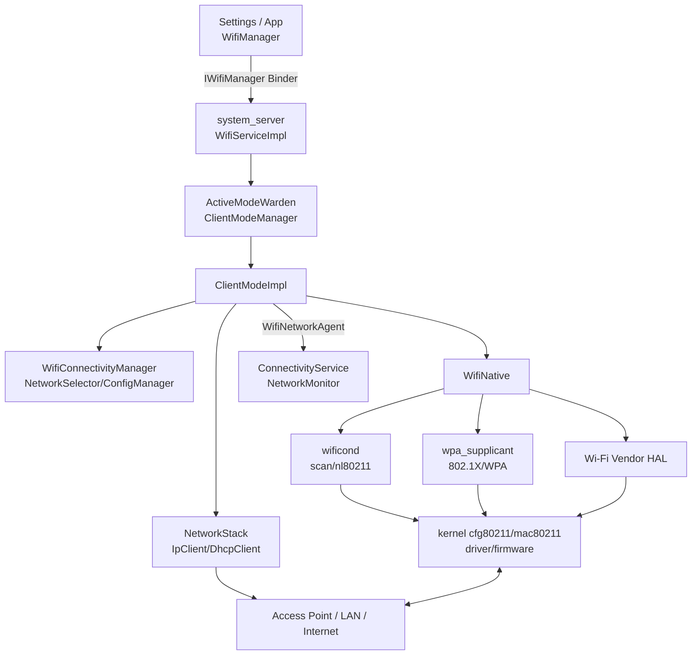
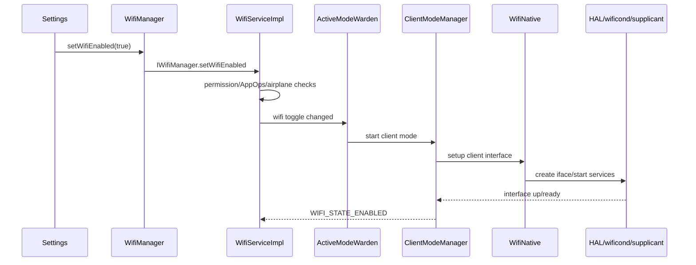
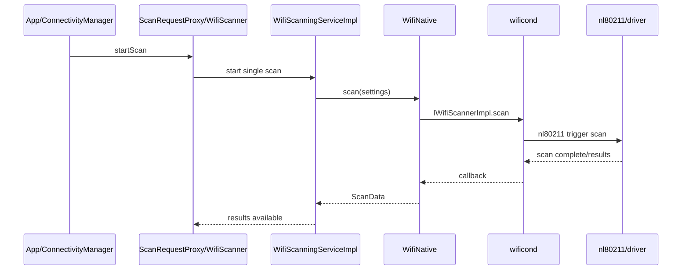
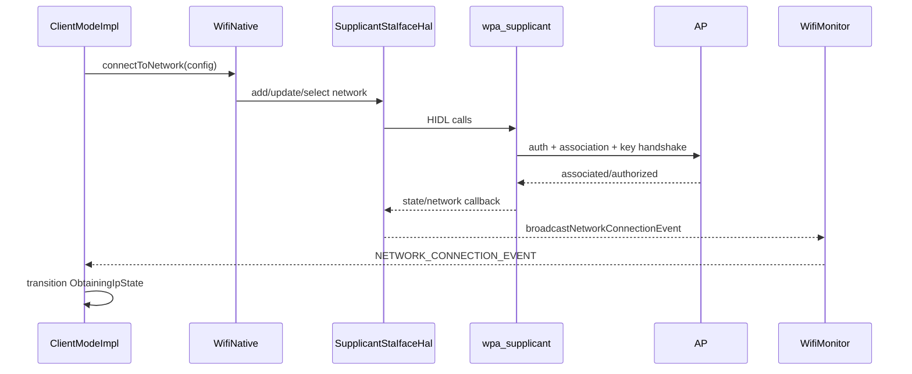

# 37 Android Wi‑Fi 系统、WifiService 与 ClientModeImpl

> 源码版本：Android 11 / API 30 / `android-11.0.0_r48`  
> 学习方式：macOS 只读源码，不要求编译  
> 前置章节：[24 网络栈](./24-Android网络栈ConnectivityService与NetworkAgent.md)、[25 电源管理](./25-Android电源管理WakeLock与Doze.md)、[31 蓝牙系统](./31-Android蓝牙系统BluetoothService与Profile.md)

Wi‑Fi 图标显示“已连接”时，至少可能经历了：打开芯片接口、扫描、网络选择、802.11 authentication/association、WPA 四次握手、获取 IP、创建 NetworkAgent、互联网验证和默认网络选择。任何一步失败，用户看到的现象都可能只是“连不上网”。

本章把链路拆成七个完成点：

```text
Wi-Fi enabled
 → AP discovered
 → AP selected
 → L2 associated/authenticated
 → IP provisioned
 → Network registered
 → Internet validated/default selected
```

---

## 1. 总体架构



---

## 2. 三个 native 边界不要混淆

| 组件 | 主要职责 | 不是 |
|---|---|---|
| wificond | 扫描、扫描结果、nl80211 接口和部分管理帧能力 | WPA 密钥状态机 |
| wpa_supplicant | STA 网络配置、认证、关联、WPA/802.1X/EAP | DHCP server |
| Wi‑Fi vendor HAL | 芯片/接口能力、扫描 offload、RSSI/packet stats、厂商功能 | Android 网络验证 |

三者最终都可触及驱动/firmware，但 API 和状态归属不同。

---

## 3. 核心进程

- WifiService、ClientModeImpl：`system_server`。
- wificond：native daemon。
- wpa_supplicant：独立 native service/daemon。
- Wi‑Fi vendor HAL：vendor service。
- NetworkStack：模块化网络栈进程，承载 IpClient/DhcpClient/NetworkMonitor。
- ConnectivityService：`system_server`。
- driver/firmware：kernel 与芯片。

同一个连接事件会跨多次 Binder/HIDL/Netlink/Handler 边界。

---

## 4. Android 11 核心源码

```text
frameworks/base/wifi/java/android/net/wifi/WifiManager.java
frameworks/base/wifi/java/android/net/wifi/IWifiManager.aidl

frameworks/opt/net/wifi/service/java/com/android/server/wifi/WifiService.java
frameworks/opt/net/wifi/service/java/com/android/server/wifi/WifiServiceImpl.java
frameworks/opt/net/wifi/service/java/com/android/server/wifi/WifiInjector.java
frameworks/opt/net/wifi/service/java/com/android/server/wifi/ActiveModeWarden.java
frameworks/opt/net/wifi/service/java/com/android/server/wifi/ClientModeManager.java
frameworks/opt/net/wifi/service/java/com/android/server/wifi/ClientModeImpl.java
frameworks/opt/net/wifi/service/java/com/android/server/wifi/WifiNative.java
frameworks/opt/net/wifi/service/java/com/android/server/wifi/WifiConnectivityManager.java
frameworks/opt/net/wifi/service/java/com/android/server/wifi/WifiNetworkSelector.java
frameworks/opt/net/wifi/service/java/com/android/server/wifi/WifiConfigManager.java

packages/modules/NetworkStack/src/android/net/ip/IpClient.java
packages/modules/NetworkStack/src/android/net/dhcp/DhcpClient.java
packages/modules/NetworkStack/src/com/android/server/connectivity/NetworkMonitor.java
```

---

## 5. WifiService 与 WifiServiceImpl

`WifiService` 是 SystemService 生命周期外壳；`WifiServiceImpl` 实现 Binder API，负责：

- Wi‑Fi 开关。
- 扫描请求和结果访问。
- 保存/连接/忘记网络。
- Soft AP、local-only hotspot。
- locks、multicast、suggestion/specifier。
- 权限、AppOps、前后台和 package/UID 校验。
- 把工作投递到 Wi‑Fi handler thread。

Binder 方法返回被接受，不表示状态机已完成硬件操作。

---

## 6. WifiInjector

WifiInjector 组装 Wi‑Fi 对象图和依赖：WifiNative、ConfigManager、ConnectivityManager、Scanner、Metrics、ActiveModeWarden、ClientModeImpl 等。

它类似依赖注入容器，便于测试替换。不要把构造对象理解成已经启动 Wi‑Fi 芯片。

---

## 7. ActiveModeWarden

统一管理 Wi‑Fi 工作模式：

- client mode（连接 AP）。
- scan-only mode。
- Soft AP mode。
- disabled。

还协调 airplane mode、emergency callback mode、location scan availability、热点并发和接口组合。

“Wi‑Fi UI 关闭”时设备仍可能处于 scan-only mode，为位置扫描提供能力。

---

## 8. ClientModeManager

ClientModeManager 管一个 client interface 的创建、启动、停止和 state callback：

```text
WifiNative.setupInterfaceForClientInConnectivityMode
 → 创建 wlan interface
 → 启动/连接 supplicant、wificond、HAL
 → ClientModeImpl 进入 ConnectMode
```

它管理接口生命周期；ClientModeImpl 管连接协议状态和 IP/NetworkAgent。

---

## 9. Wi‑Fi 开关状态

公开状态：

```text
WIFI_STATE_DISABLED
WIFI_STATE_DISABLING
WIFI_STATE_ENABLING
WIFI_STATE_ENABLED
WIFI_STATE_UNKNOWN
```

`setWifiEnabled(true)` 通过权限/airplane mode 检查后更新 settings/Controller，ActiveModeWarden 异步启动 ClientModeManager。

ENABLED 更接近“client Wi‑Fi 栈已启用”，不表示已连接任何 AP。

---

## 10. 开启 Wi‑Fi 主链



失败时可能返回 UNKNOWN/DISABLED，并由 metrics/diagnostics 记录原因。

---

## 11. Android 10+ 开关权限边界

Android 10 起普通 target SDK App 通常不能随意开关 Wi‑Fi；Settings、system/DO/PO 等受信任角色有例外。`CHANGE_WIFI_STATE` 不是所有场景的充分授权。

源码需看 WifiServiceImpl 对 calling UID/package、target SDK、AppOps 和 Settings UID 的检查。不要仅凭 Manifest permission 推断调用一定生效。

---

## 12. 扫描不是连接

扫描只发现附近 BSS：

```text
SSID/BSSID
frequency/channel
RSSI
capabilities/security IEs
timestamp
```

扫描到某 AP 不证明密码正确、能关联、DHCP 正常或有互联网。

同一 SSID 可有多个 BSSID，代表不同 AP/radio；网络选择通常精确到候选 BSSID。

---

## 13. 扫描链



部分扫描/PNO/offload 可由 firmware/vendor HAL 承担，具体路径依能力。

---

## 14. ScanRequestProxy

对普通 App 暴露扫描入口并执行：

- location permission/AppOps。
- location mode。
- foreground/background throttle。
- scan result广播。
- 缓存最近结果。

WifiConnectivityManager 的系统连接扫描和普通 App 手动扫描具有不同权限/配额语义。

---

## 15. Android 11 扫描隐私

Wi‑Fi scan results 能推断位置，因此受位置权限、位置开关、AppOps、前后台和扫描频率限制。

`startScan()` 返回 true 仅表示请求接受；结果可能来自新的扫描，也可能稍后广播，失败/节流需看 callback/广播和日志。

---

## 16. PNO Scan

Preferred Network Offload 允许 firmware 在低功耗状态扫描已知网络，匹配后唤醒主机。可减少 AP 唤醒和全量扫描成本。

PNO 发现候选不等于已经连接；Framework 醒来后仍需选择、认证、关联和 IP provisioning。

---

## 17. SSID 与 BSSID

```text
SSID：网络名，可重复、可隐藏
BSSID：一个 Basic Service Set/AP radio 的 MAC 标识
```

多个 BSSID 可共享 SSID、安全配置和后端网络。漫游通常在同一网络不同 BSSID 间切换。

隐藏 SSID 不是安全机制，连接可能需要主动 probe 并增加隐私暴露。

---

## 18. ScanResult timestamp

ScanResult timestamp 通常是自启动相关的微秒时间，不是 `System.currentTimeMillis()`。RSSI 是扫描时刻快照，读取列表时可能已经陈旧。

候选选择要考虑 age。不能把旧强信号结果当当前 AP 仍存在。

---

## 19. WifiConfiguration

保存网络配置：

- SSID/BSSID。
- key management/security params。
- PSK、enterprise config 或密钥引用。
- hiddenSSID。
- networkId。
- status/selection status。
- creator/update UID。
- metered、MAC randomization、IP/proxy config。

networkId 是本机配置数据库 ID，不是 supplicant 永久 ID，也不是 netId。

---

## 20. Wi‑Fi 中的多个 net/id

| ID | 含义 |
|---|---|
| WifiConfiguration networkId | Framework 保存网络 ID |
| supplicant network ID | wpa_supplicant 会话内 network object ID |
| BSSID | 具体 AP radio 标识 |
| Connectivity netId | Android 已注册 Network 的内核/系统 ID |

日志中都可能出现 `netId`，必须按类和阶段判断。

---

## 21. WifiConfigManager

负责：

- 添加、更新、删除、查询配置。
- caller ownership/权限。
- network selection status。
- failure disable counters。
- last selected、connect choice。
- per-user 可见性。
- 与 WifiConfigStore 持久化协作。

配置被保存不等于当前 enabled/可自动连接。

---

## 22. WifiConfigStore

将网络、suggestion、randomized MAC 等数据以 XML/加密辅助形式持久保存，区分 shared/user store 和 CE/DE 可用时机。

用户未解锁时只能使用已可访问配置；解锁后加载用户 store 可改变候选集合。

密码不会以供普通 App读取的明文 ScanResult 形式暴露。

---

## 23. 网络选择不是只选最强 RSSI

WifiNetworkSelector 汇总 evaluator/nominator 候选，考虑：

- saved/suggestion/passpoint。
- security、是否启用。
- RSSI 和频段。
- 当前网络切换成本。
- user connect choice。
- no-internet/portal history。
- BSSID blocklist。
- metered、carrier、OEM score。

最强 RSSI 的开放热点未必优于稍弱的已验证安全网络。

---

## 24. WifiConnectivityManager

持续协调自动连接：

- screen state 和 mobility state。
- periodic/PNO scan。
- 处理 scan results。
- 调 WifiNetworkSelector。
- 发起 connect/roam。
- failure watchdog。
- connected/ disconnected scans。

它决定“什么时候扫、选谁、何时切换”；真正协议连接由 ClientModeImpl/WifiNative/supplicant 完成。

---

## 25. Saved、Suggestion、Specifier

```text
Saved network：用户/系统持久保存，可自动连接
Network Suggestion：App 建议系统考虑，系统保持最终选择权
Network Specifier：App 请求匹配特定本地 Wi‑Fi，通常由用户确认，面向该请求
```

Suggestion 不是 App 强制切换默认 Wi‑Fi；Specifier 网络也不必提供互联网或成为全局默认网络。

---

## 26. 发起连接

选出 candidate 后：

```text
WifiConnectivityManager
 → ClientModeImpl.startConnectToNetwork(networkId, uid, bssid)
 → CMD_START_CONNECT
 → WifiConfigManager 取配置
 → WifiNative connectToNetwork
 → SupplicantStaIfaceHal
 → wpa_supplicant select/add network
```

CMD 接受不等于 L2 已连接，后续由 supplicant callback 驱动。

---

## 27. 802.11 Authentication 与 Association

在常见基础设施网络中：

1. STA 与 AP 做 802.11 authentication（open system 等链路步骤）。
2. STA association，协商能力并加入 BSS。
3. 安全网络继续 WPA key handshake/EAP。

“ASSOCIATED”不等于密钥握手完成，也不等于 IP 已获取。

---

## 28. WPA2-PSK 四次握手

AP/STA 已有 PSK 派生基础材料，通过 EAPOL-Key 4-way handshake：

- 交换 nonce。
- 派生 PTK。
- 验证双方持有相同密钥材料。
- 安装 pairwise/group keys。

常见认证失败可能来自密码错误、重放/超时、加密能力不匹配。握手不通过时 DHCP 根本不会开始。

---

## 29. WPA3 SAE

SAE 是密码认证密钥交换，改进离线字典攻击抵抗；Transition mode 可同时兼容 WPA2/WPA3。

Android 11 支持程度取决于 supplicant、driver、firmware 和设备 feature。扫描 capabilities 显示 SAE 不保证本机硬件/配置一定能连接。

---

## 30. Enterprise 802.1X/EAP

企业 Wi‑Fi可能使用 EAP-TLS、PEAP、TTLS、SIM/AKA 等：

```text
STA/supplicant
 ↔ AP authenticator
 ↔ RADIUS/auth server
```

证书、CA validation、identity、phase2、SIM subscription 都会影响。association 成功但 EAP authentication 失败时不会进入可用数据网络。

---

## 31. SupplicantStaIfaceHal

Java wrapper 管：

- supplicant service/iface 生命周期。
- add/select/remove network。
- reassociate/reconnect/disconnect。
- anonymous identity/EAP/keys。
- callback 版本适配 1.0～1.3。

callback 被转给 WifiMonitor，再成为 ClientModeImpl event。

---

## 32. WifiMonitor

注册 per-interface handlers，分发：

- SUPPLICANT_STATE_CHANGE_EVENT。
- NETWORK_CONNECTION_EVENT。
- NETWORK_DISCONNECTION_EVENT。
- AUTHENTICATION_FAILURE_EVENT。
- ASSOCIATION_REJECTION_EVENT。
- ANQP、WPS 等。

它是进程内 event bus，不是 Android Wi‑Fi 状态广播本身。

---

## 33. L2 连接时序



---

## 34. ClientModeImpl 状态机

关键层次大致包括：

```text
DefaultState
ConnectModeState
L2ConnectedState
ObtainingIpState
ConnectedState
RoamingState
DisconnectingState
DisconnectedState
```

状态有父子层级，不同版本名称/嵌套会变化。阅读 Message 时先确认当前 state 和父 state 的处理顺序。

---

## 35. Authentication Failure 与 Association Rejection

```text
authentication failure：密码/EAP/握手等认证失败
association rejection：AP 拒绝 association，可能满载、策略、能力不兼容
```

两者会更新 NetworkSelectionStatus failure counters，临时 disable 配置或 block BSSID。反复自动重试可能被 backoff。

---

## 36. 已连接热点为何仍没有 IP

L2 connection 只说明 802.11 数据链路可用。还需：

- IPv6 link-local/RA/SLAAC 等。
- IPv4 DHCP discover/offer/request/ack。
- 地址冲突检测。
- DNS、route、MTU、proxy。

所以状态可以卡在 `ObtainingIpState`，此时问题更可能在 DHCP/LAN，而不是密码。

可以用一条具体时间线理解这些完成点。假设用户在 `12:00:00` 点击某个热点：

| 时间 | 系统刚完成的事情 | 此时能否断言“互联网可用” |
|---|---|---|
| 12:00:00.200 | 找到目标 BSSID，并决定连接 | 不能，甚至还没有建立无线链路 |
| 12:00:00.900 | association 和密钥握手完成，收到 L2 连接事件 | 不能，只能说明终端能和 AP 交换二层帧 |
| 12:00:02.100 | DHCP 成功，获得地址、网关和 DNS | 仍不能，网关、DNS 或外网可能不可达 |
| 12:00:02.300 | `NetworkAgent` 已把网络交给 ConnectivityService | 仍不能，它只是成为系统可评估的候选网络 |
| 12:00:03.000 | NetworkMonitor 探测通过，网络获得 `VALIDATED` | 通常可以，系统才有充分依据把它作为互联网默认网络 |

这些时间只是帮助理解的示例，不是 Android 的固定超时。真正排障时要记录事件顺序和实际时间戳，不能拿表中的毫秒数判断故障。

---

## 37. IpClient

ClientModeImpl 创建 NetworkStack `IpClient`，配置：

- interface name。
- DHCP/静态 IP。
- IPv6、RA。
- provisioning timeout。
- pre/post DHCP actions。
- APF packet filter。
- reachability monitor。
- TCP buffer、proxy 等。

IpClient 在 NetworkStack 进程，通过 Binder callback 把 LinkProperties/provisioning 结果返回 Wi‑Fi。

---

## 38. DHCP DORA

IPv4 动态地址典型：

```text
DISCOVER → OFFER → REQUEST → ACK
```

结果含 IP/prefix、gateway、DNS、lease time 等。失败原因可能是：

- DHCP server 无响应。
- AP 隔离/中继问题。
- 地址池耗尽。
- 驱动丢包。
- 旧 lease/rebind 冲突。
- captive 网络设备异常。

---

## 39. Pre-DHCP Action

DHCP 前 Wi‑Fi 可暂时调整 power save、BT coexistence 等，以减少关键广播交互丢包；完成后恢复。

IpClient 用 callback 请求 pre-DHCP action，ClientModeImpl 完成准备再回 `completedPreDhcpAction()`。

这解释了为何 DHCP 不只是 NetworkStack 单方面发包。

---

## 40. 静态 IP

WifiConfiguration 可保存 StaticIpConfiguration：IP/prefix、gateway、DNS。IpClient 跳过 DHCP并应用配置。

静态配置格式正确不代表网络实际可达：重复地址、错误网关/DNS、网段不匹配都可能导致 L2 connected 但 validation 失败。

---

## 41. IPv6

Android 11 的普通 Wi‑Fi 主线主要依据 Router Advertisement，通过 SLAAC 配置地址，
并从 RA 的 RDNSS 等选项取得 DNS；AOSP `IpClient` 在这里不是依靠一个与
`DhcpClient` 对称的 DHCPv6 客户端来完成地址配置。一个网络可：

- IPv4 only。
- IPv6 only。
- dual stack。
- IPv6 + NAT64/CLAT。

DHCPv4 失败不一定表示完全无网络；需看完整 LinkProperties 和 capabilities。

---

## 42. Provisioning Success

IpClient callback `onProvisioningSuccess(LinkProperties)` 表示获得满足 provisioning 条件的 IP 配置。ClientModeImpl 更新 LinkProperties，进入 connected 相关流程并创建/更新 WifiNetworkAgent。

它仍不证明互联网可达。网关后可能有 portal、DNS 劫持或断网。

---

## 43. WifiNetworkAgent

向 ConnectivityService 报告：

- TRANSPORT_WIFI。
- NetworkCapabilities。
- LinkProperties。
- score。
- NetworkInfo/state。
- unwanted、validation status、keepalive 等 callback。

这是 Wi‑Fi 从“链路”变成 Android `Network` 的边界。

---

## 44. NetworkMonitor 验证

ConnectivityService/NetworkStack 为 Network 启动 NetworkMonitor，通过 DNS/HTTP/HTTPS 等探测判断：

```text
VALIDATED
CAPTIVE_PORTAL
PARTIAL_CONNECTIVITY
NO_INTERNET
```

验证地址和策略由系统配置。探测失败可能是公网受限、DNS、portal，也可能是探测服务被阻断；不等于 L2 断开。

---

## 45. Captive Portal

酒店/机场 Wi‑Fi 常允许 DHCP/DNS，但拦截 Web 直到登录。NetworkMonitor 检出 portal 后系统显示登录 UI。

登录成功触发重新验证。用户选择“保持连接”或网络配置的 no-internet 策略会影响是否作为默认网络。

---

## 46. 默认网络选择

ConnectivityService 比较 Wi‑Fi、cellular 等 Network 的 capabilities、score、validation 和用户策略，满足每个 NetworkRequest。

Wi‑Fi connected 但无互联网时，默认网络可能仍是 cellular；绑定该 Wi‑Fi 的局域网 App则可使用 Wi‑Fi Network。

状态栏 Wi‑Fi 图标和某个 socket 实际 netId 不必完全等价。

---

## 47. 完成点对照

| 完成点 | 证明什么 | 不证明什么 |
|---|---|---|
| Scan result | 看到 AP 广播/探测响应 | 能认证连接 |
| NETWORK_CONNECTION_EVENT | L2 已连接/authorized | 有 IP |
| Provisioning success | 有可用 LinkProperties | 公网可达 |
| NetworkAgent registered | Connectivity 看见该 Network | 它是默认网络 |
| VALIDATED | 系统探测认为互联网可用 | 所有业务域名都可达 |

排障先确定卡在哪个完成点。

---

## 48. Roaming

STA 在同一 ESS 不同 BSSID 间切换，以改善信号/质量。Framework 根据 scan、firmware roaming、network selection 发起 roam；supplicant/driver 完成 reassociation/key handling。

漫游可能保留同一 IP，也可能触发 reachability/DHCP 检查。L2 短暂切换不应总被当成完整断网重连。

---

## 49. 802.11r/k/v

- 11r：Fast BSS Transition，减少重新认证时延。
- 11k：邻居/无线资源测量辅助候选发现。
- 11v：网络管理和 BSS transition suggestion。

是否生效需 AP、supplicant、driver 和安全配置共同支持。capability 存在不保证切换一定无丢包。

---

## 50. RSSI 与 Link Layer Stats

RSSI 是接收信号强度快照，不等于吞吐。实际质量还受：

- SNR、干扰、channel utilization。
- PHY rate/MCS、spatial streams。
- retries、packet loss。
- AP backhaul/互联网。
- power save。

WifiVendorHal/driver 提供 link layer stats，WifiScoreReport 综合质量影响 network score。

---

## 51. 2.4 GHz、5 GHz 与 6 GHz

Android 11 基础代码已在演进多频段能力，但具体 6 GHz/Wi‑Fi 6E 支持取决于芯片、法规、HAL和构建。

2.4 GHz 穿透好但拥挤；5 GHz 可用带宽大但覆盖不同。网络选择不是一律偏好最高频段，而是综合 RSSI/score/能力。

---

## 52. MAC Randomization

为了隐私，扫描和连接可使用随机 MAC。持久网络通常有稳定的 per-network randomized MAC，避免每次变化破坏 DHCP/portal，同时减少跨网络跟踪。

企业 NAC、MAC whitelist、路由器静态租约可能与随机化冲突。Factory MAC 与当前 interface MAC 必须区分。

---

## 53. 网络凭据安全

PSK、企业私钥/证书和 passpoint 凭据受系统权限、keystore 和持久化加密保护。普通 App 查询 WifiConfiguration 不应得到其他网络明文密码。

日志/dumpsys 也应隐藏 PSK、identity、BSSID/MAC 等隐私字段。

---

## 54. Wi‑Fi 权限

Android 11 常见：

- ACCESS_WIFI_STATE。
- CHANGE_WIFI_STATE。
- location permission/AppOps/location enabled（scan/results）。
- NETWORK_SETTINGS、NETWORK_SETUP_WIZARD 等特权权限。
- target SDK/foreground 限制。

Android 13 的 NEARBY_WIFI_DEVICES 不能套到 API 30。

---

## 55. Per-user 配置

Wi‑Fi 硬件是全局资源，但 saved networks、suggestions、Passpoint和可见配置受 user/profile 管理。用户切换/解锁会加载相应 config store 并重新选择。

工作资料 App suggestion 不应无限制泄露给其他用户。

---

## 56. Airplane Mode

Airplane mode 通常影响 Wi‑Fi 开关，但用户可在飞行模式中重新启用 Wi‑Fi；Settings 会持久记录选择。ActiveModeWarden 根据 settings 和 mode 决定 client/scan-only/disabled。

因此不能看到 airplane=true 就断言 Wi‑Fi interface 必定不存在。

---

## 57. Scan-only 与位置扫描

“Wi‑Fi 扫描始终可用”设置可在 Wi‑Fi toggle off 时维持 scan-only mode，供定位服务扫描 AP，不建立普通 client connection。

它解释了用户关闭 Wi‑Fi 后仍可能看到扫描活动。是否允许还受 location mode、airplane和设备配置。

---

## 58. Wi‑Fi Lock

App 可请求 WifiLock（权限/策略允许），影响 Wi‑Fi 在屏幕关闭或空闲时的性能/保持策略。模式包括 full/high perf/low latency 等本版本能力。

Lock 是请求，不保证网络永不掉线，也不替代 WakeLock。系统可按前后台、Doze和资源限制处理。

---

## 59. Multicast Lock

为省电，Wi‑Fi 驱动可过滤 multicast。MulticastLock 请求允许接收 multicast，常用于 mDNS/局域网发现。

它可能显著增加唤醒和功耗，应按生命周期释放。它不负责加入 IP multicast group，也不保证 AP 不隔离客户端。

---

## 60. APF

Android Packet Filter 把小程序下发到 Wi‑Fi firmware，在 AP suspend 时过滤/响应部分网络包，减少主 CPU 唤醒，同时维持 IPv6/ARP 等基本网络功能。

APF 由 IpClient 与 HAL/driver 能力协调。错误 filter 可能表现为 suspend 后断网，需看 APF capabilities和 dump。

---

## 61. Soft AP

热点路径与 client mode 不同：

```text
WifiService
 → ActiveModeWarden/SoftApManager
 → WifiNative setup AP iface
 → hostapd
 → tethering/DHCP/NAT
```

STA+AP 是否能并发取决于 chip concurrency matrix。开热点可能关闭 client Wi‑Fi 或切换接口组合。

---

## 62. hostapd 与 supplicant

```text
wpa_supplicant：设备作为 STA/client 连接 AP
hostapd：设备作为 AP 管理客户端认证关联
```

名字都与 WPA 有关但角色相反。热点客户端拿 IP 的 DHCP server/tethering又是另一层。

---

## 63. Wi‑Fi Direct

P2P 使用 WifiP2pService、supplicant P2P interface、group owner/client 角色，建立 group 后用 IpClient/DHCP 配置局域网。

它不等于连接普通 AP，也不自动提供互联网。与 STA/SoftAP 并发受芯片接口组合限制。

---

## 64. Passpoint

Passpoint/Hotspot 2.0 使用 provider credential、ANQP、realm/roaming consortium、EAP，自动发现和连接运营商/公共 Wi‑Fi。

ScanResult 只是 BSS；ANQP 提供网络服务信息。Passpoint provider 与普通 PSK WifiConfiguration 的选择和持久化不同。

---

## 65. 断开链

可能来源：

- 用户 forget/disconnect。
- AP deauth/disassoc。
- auth timeout。
- reachability lost。
- roam。
- interface/HAL/supplicant death。
- Wi‑Fi toggle off。

ClientModeImpl 先区分 local/remote reason，停止 IpClient、更新 NetworkAgent、清理 current config/BSSID并进入 DisconnectedState。

---

## 66. Supplicant/HAL/wificond 死亡

WifiNative/各 HAL wrapper 监听 death：

- 清理旧 iface/proxy/callback。
- 通知 ClientModeManager/Impl。
- disconnect current NetworkAgent。
- 触发 recovery/restart Wi‑Fi stack。
- 使用 generation 防迟到 callback。

UI 可能短暂显示 Wi‑Fi 重启。不能继续使用旧 interface name/handle。

---

## 67. WifiLastResortWatchdog

当多个可见已保存网络持续连接失败，watchdog 汇总 auth/association/DHCP failure，可能触发 Wi‑Fi stack restart 作为最后恢复手段。

它不是每次密码错误都重启 Wi‑Fi；需达到失败模式和阈值，避免制造更大抖动。

---

## 68. WifiDiagnostics 与 Metrics

- WifiMetrics 记录 scan、connection attempt、StaEvent、失败原因、使用统计。
- WifiDiagnostics 收集 ring buffer、firmware/driver dump、bugreport 证据。
- LastMileLogger/score/card 等提供特定诊断。

metrics 的 connection event 有 start/end boundaries，应按同一次 attempt 关联，不只搜一个 failure 字符串。

---

## 69. 常见问题分层诊断

| 症状 | 优先检查 |
|---|---|
| Wi‑Fi 开关卡住 | ActiveModeWarden、iface create、HAL/wificond/supplicant death |
| 扫不到 AP | scan 权限/节流、频段/regulatory、wificond/driver、AP hidden |
| 有 AP 但不自动连 | config enabled、selector candidate、blocklist、user choice |
| 密码正确仍失败 | security type/transition、SAE/EAP、association reject、时钟证书 |
| 卡在 Obtaining IP | DHCP packets/server、pre-DHCP、static config、IPv6 |
| 显示连接但无互联网 | LinkProperties、DNS/gateway、NetworkMonitor/portal/validation |
| Wi‑Fi 连着却走流量 | cellular 可能是 validated default；检查 netId/request/binding |
| 漫游频繁断流 | BSSID候选、RSSI、11r/k/v、firmware roam、DHCP/reachability |
| 熄屏后断网 | power save、Doze、WifiLock、APF、AP/路由器策略 |
| 热点无法与 Wi‑Fi 共存 | chip concurrency/interface combination |

---

## 70. dumpsys 与只读观察

```bash
adb shell dumpsys wifi
adb shell dumpsys connectivity
adb shell dumpsys network_stack
adb shell dumpsys wifiscanner
adb shell cmd wifi help
```

重点看：

- Wi‑Fi state/mode/interface。
- ClientModeImpl current state/message history。
- current config/networkId/BSSID。
- scan results age/candidates。
- connection events/failure reason。
- DHCP/LinkProperties。
- NetworkAgent/netId/validation/default network。
- supplicant/HAL/wificond status。

SSID/BSSID/MAC/IP 是隐私信息，分享前脱敏。

---

## 71. 源码路线一：开关

```text
frameworks/base/wifi/java/android/net/wifi/WifiManager.java
frameworks/opt/net/wifi/service/java/com/android/server/wifi/WifiServiceImpl.java
frameworks/opt/net/wifi/service/java/com/android/server/wifi/ActiveModeWarden.java
frameworks/opt/net/wifi/service/java/com/android/server/wifi/ClientModeManager.java
frameworks/opt/net/wifi/service/java/com/android/server/wifi/WifiNative.java
```

练习：追 setWifiEnabled 到 interface ready，标出 enabled 与 connected 的区别。

---

## 72. 源码路线二：扫描

```text
frameworks/opt/net/wifi/service/java/com/android/server/wifi/ScanRequestProxy.java
frameworks/opt/net/wifi/service/java/com/android/server/wifi/scanner/WifiScanningServiceImpl.java
frameworks/opt/net/wifi/service/java/com/android/server/wifi/WifiNative.java
system/connectivity/wificond/scanning/scanner_impl.cpp
system/connectivity/wificond/net/netlink_utils.cpp
```

练习：追 startScan 到 nl80211 result，标出 App throttle 与系统 PNO scan。

---

## 73. 源码路线三：网络选择

```text
frameworks/opt/net/wifi/service/java/com/android/server/wifi/WifiConnectivityManager.java
frameworks/opt/net/wifi/service/java/com/android/server/wifi/WifiNetworkSelector.java
frameworks/opt/net/wifi/service/java/com/android/server/wifi/WifiConfigManager.java
frameworks/opt/net/wifi/service/java/com/android/server/wifi/WifiConfigStore.java
```

练习：为两个同 SSID BSSID 和一个更强开放网络，写候选选择证据。

---

## 74. 源码路线四：L2 连接

```text
frameworks/opt/net/wifi/service/java/com/android/server/wifi/ClientModeImpl.java
frameworks/opt/net/wifi/service/java/com/android/server/wifi/WifiNative.java
frameworks/opt/net/wifi/service/java/com/android/server/wifi/SupplicantStaIfaceHal.java
frameworks/opt/net/wifi/service/java/com/android/server/wifi/WifiMonitor.java
hardware/interfaces/wifi/supplicant/1.3/ISupplicantStaIface.hal
```

练习：追 CMD_START_CONNECT 到 NETWORK_CONNECTION_EVENT，并区分 auth/assoc/key handshake。

---

## 75. 源码路线五：IP

```text
frameworks/opt/net/wifi/service/java/com/android/server/wifi/ClientModeImpl.java
packages/modules/NetworkStack/src/android/net/ip/IpClient.java
packages/modules/NetworkStack/src/android/net/dhcp/DhcpClient.java
```

练习：追 startIpClient、pre-DHCP、DORA、onProvisioningSuccess 和 LinkProperties。

---

## 76. 源码路线六：联网验证

```text
packages/modules/NetworkStack/src/com/android/server/connectivity/NetworkMonitor.java
frameworks/base/services/core/java/com/android/server/ConnectivityService.java
```

练习：从 WifiNetworkAgent 注册追 validated/captive portal 和默认网络选择。

---

## 77. 推荐八组只读练习

1. **完成点图**：enabled、scan、selected、L2、IP、registered、validated。
2. **ID 对照**：Wifi networkId、supplicant ID、BSSID、Connectivity netId。
3. **三 native 边界**：wificond、supplicant、vendor HAL。
4. **扫描链**：App scan 与 PNO/system scan 对比。
5. **安全链**：Open、WPA2-PSK、WPA3-SAE、Enterprise EAP。
6. **IP 链**：DHCP、IPv6、静态地址三种 provisioning。
7. **路由链**：Wi‑Fi connected、validated、default 与 socket binding。
8. **故障纸算**：给“密码正确但无网”列 L2、IP、validation 三类证据。

---

## 78. 初学者最容易混淆的十八点

1. Wi‑Fi enabled 不等于 connected。
2. 扫描到 AP 不等于能连接。
3. SSID 不唯一，BSSID 才是具体 BSS。
4. networkId 有 Framework、supplicant、Connectivity 多种含义。
5. wificond、supplicant、vendor HAL 职责不同。
6. 最强 RSSI 不一定被选中。
7. Suggestion 不是强制连接。
8. ASSOCIATED 不等于 WPA/EAP 已完成。
9. L2 connected 不等于有 IP。
10. DHCP success 不等于有互联网。
11. NetworkAgent registered 不等于默认网络。
12. Wi‑Fi connected 时 socket 仍可能走 cellular。
13. Captive portal 不是 Wi‑Fi 密码认证。
14. A2DP/Wi‑Fi coexistence 与 Wi‑Fi认证不是同一层。
15. 关闭 UI toggle 后可能仍 scan-only。
16. Factory MAC 与 randomized MAC 不同。
17. supplicant 用于 STA，hostapd 用于 AP。
18. Android 11 不使用 Android 13 Nearby Wi‑Fi 权限模型。

---

## 79. 自测题

1. WifiServiceImpl、ActiveModeWarden、ClientModeImpl 如何分工？
2. wificond、supplicant、vendor HAL 各负责什么？
3. Wi‑Fi enabled 为什么不表示已连接？
4. SSID 与 BSSID 有何区别？
5. 为什么最强 RSSI 不一定胜出？
6. WifiConfiguration networkId 与 Connectivity netId 有何区别？
7. association、WPA handshake、IP provisioning 的顺序是什么？
8. NETWORK_CONNECTION_EVENT 证明什么？
9. IpClient 与 DhcpClient 如何分工？
10. provisioning success 为什么仍可能无网？
11. validated 与 default network 有何区别？
12. Wi‑Fi connected 为什么 App socket 可能走 cellular？
13. scan-only mode 有何用途？
14. MAC randomization 为什么可能与路由器白名单冲突？
15. 连接失败如何区分 auth、association、DHCP？

---

## 80. 自测答案

1. Service 是 Binder/权限入口；Warden 管模式；ClientModeImpl 管 STA 连接、IP 和 NetworkAgent 状态机。
2. 分别管理扫描/nl80211、认证关联/WPA、芯片厂商能力和接口。
3. 只说明 client mode/interface 启动，还未选 AP、认证和配网。
4. SSID 是网络名，BSSID 是具体 AP radio/BSS 标识。
5. 还要考虑安全、历史验证、用户选择、频段、切换成本、blocklist 等。
6. 前者是保存配置 ID，后者是 Connectivity 给已注册 Network 的系统 ID。
7. 先 802.11 auth/association，再安全握手/authorized，再 DHCP/IPv6。
8. L2 网络连接事件，不证明 IP 或互联网。
9. IpClient 管整体 IP provisioning，DhcpClient 是其中 IPv4 DHCP 状态机。
10. DNS/网关后无公网、portal 或 validation 探测失败。
11. validated 是互联网能力判断；default 是 Connectivity 为默认请求选择的网络。
12. cellular 可能仍是 validated default，或 App/Socket 显式绑定其他 Network。
13. toggle off 时为定位等系统功能提供低功耗扫描，不建立普通连接。
14. 当前连接 MAC 不再是 factory MAC，AP 的 allowlist/static lease 可能不匹配。
15. 看 supplicant AUTH_FAILURE、ASSOC_REJECT、L2 connection event 和 IpClient/DHCP callbacks。

---

## 81. 本章结论

普通连接主链：

```text
Wifi toggle/client mode
 → scan/wificond/nl80211
 → WifiConnectivityManager + NetworkSelector
 → ClientModeImpl CMD_START_CONNECT
 → WifiNative/SupplicantStaIfaceHal
 → auth + association + WPA/EAP
 → NETWORK_CONNECTION_EVENT
 → IpClient/DhcpClient/IPv6
 → LinkProperties provisioning success
 → WifiNetworkAgent
 → ConnectivityService/NetworkMonitor
 → validated/captive/no-internet
 → default network and socket routing
```

读“Wi‑Fi 连不上”时固定问：

```text
client interface 是否真正启动？
扫描是否新鲜，候选为何被选择或禁用？
失败发生在 association、authentication 还是 key handshake？
NETWORK_CONNECTION_EVENT 是否收到？
IP provisioning 的地址、网关、DNS 是否完整？
NetworkAgent 的 netId、validation 和 score 是什么？
该 App/socket 最终绑定的是哪个 Network？
```

能回答这些问题，就能把一个模糊的 Wi‑Fi 图标问题拆成射频扫描、L2 安全、IP 配置和 Android 网络策略四个独立层次。
